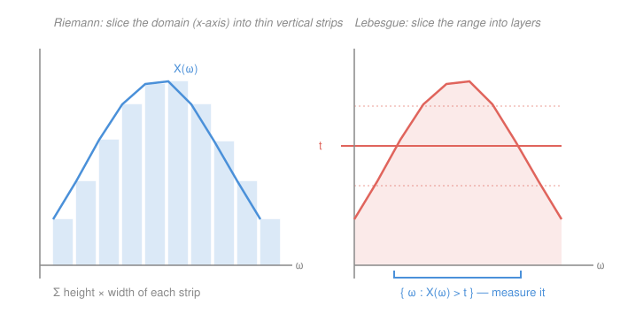

# Probability Theory · Lesson 2.3: The Lebesgue integral and expectation

> ⏱ ~15 min · Module 2: Random variables and expectation · Builds on: [2.1 Random variables and measurability](02-01-random-variables-measurability.md), [2.2 Distributions, CDFs, and pushforward](02-02-distributions-and-cdfs.md) · Unlocks: [2.4 The convergence theorems](02-04-convergence-theorems.md)

## Why this matters

Expectation is the number every applied probabilist actually computes — the mean, the price of a bet, the center of a distribution. In the refresher it was a formula: $\sum x_i p_i$ for discrete, $\int x f(x)\,dx$ for continuous. But *why* those two, and why do they agree? And when can you pull a limit inside an expectation — the single move behind the law of large numbers, the CLT, and every "$\mathbb E$ commutes with $\lim$" step you'll ever make? The honest answer needs a new integral, built by slicing the *range* instead of the domain. That integral is expectation: $\mathbb E[X]=\int_\Omega X\,d\mathbb P$.

## The idea

The Riemann integral you built in `real-analysis` (Module 7) chops the **domain** into thin vertical strips, measures the height of the function over each, and sums height × width. It works beautifully for tame functions on intervals — but it chokes the moment the function is wild (jumps everywhere) or the domain is an abstract sample space $\Omega$ with no natural "width."

Lebesgue's move is to turn the picture ninety degrees. Instead of asking *"over this thin slice of inputs, how tall is $X$?"*, ask *"at this height $t$, how much probability sits at or above it?"* — slice the **range** into horizontal layers and, for each level, **measure the set where $X$ exceeds it**. Measuring sets is exactly what $\mathbb P$ does. So the wildness of $X$ across $\Omega$ no longer matters; all that matters is, for each height, the size of a set — and $\mathbb P$ was built to size sets (the very measure axioms that define it). That reversal is why expectation can integrate horrific functions, ignore null sets, and — the payoff in [2.4](02-04-convergence-theorems.md) — trade places with limits.

**In words:** Riemann sums heights over slices of *input*; Lebesgue sums how much *probability* clears each level of *output*.

## The formal version

Fix a probability space $(\Omega,\mathcal F,\mathbb P)$ — sample space $\Omega$, σ-algebra of events $\mathcal F$, probability measure $\mathbb P$. A random variable $X:\Omega\to\mathbb R$ is a measurable function ([2.1](02-01-random-variables-measurability.md)). We build $\mathbb E[X]=\int_\Omega X\,d\mathbb P$ in three stages.

**Stage 1 — simple functions.** A **simple** random variable takes finitely many values:
$$X=\sum_{i=1}^n a_i\,\mathbf 1_{A_i},\qquad a_i\ge 0,\ \ A_i\in\mathcal F,\ \ \text{the }A_i\text{ disjoint},$$
where $\mathbf 1_{A}(\omega)=1$ if $\omega\in A$ and $0$ otherwise. Its expectation is the obvious weighted average:
$$\boxed{\ \mathbb E[X]=\sum_{i=1}^n a_i\,\mathbb P(A_i).\ }$$
**In words:** each value $a_i$ contributes itself, weighted by the probability of landing where $X=a_i$. (This is well-defined: two different ways of writing the same simple $X$ give the same sum, because both refine to the common partition by the distinct values of $X$.)

**Stage 2 — nonnegative $X$.** For any measurable $X\ge 0$, approximate it from below by simple functions and take the best such approximation:
$$\boxed{\ \mathbb E[X]=\sup\{\,\mathbb E[S] : S\text{ simple},\ 0\le S\le X\,\}\ \in[0,\infty].\ }$$
**In words:** build the tallest staircase that stays under $X$; its area is the integral. Concretely the standard staircase $S_n=\sum_{k=0}^{n2^n-1}\frac{k}{2^n}\mathbf 1_{\{k/2^n\le X<(k+1)/2^n\}}+n\,\mathbf 1_{\{X\ge n\}}$ chops the *range* $[0,\infty)$ into strips of height $2^{-n}$; $S_n\uparrow X$ pointwise, and $\mathbb E[S_n]\uparrow\mathbb E[X]$. A nonnegative $X$ *always* has an expectation, possibly $+\infty$.

**Stage 3 — general $X$.** Split into positive and negative parts:
$$X^+=\max(X,0)\ge 0,\qquad X^-=\max(-X,0)\ge 0,\qquad X=X^+-X^-,\quad |X|=X^++X^-.$$
Call $X$ **integrable** if $\mathbb E|X|=\mathbb E[X^+]+\mathbb E[X^-]<\infty$ (both parts finite). Then
$$\boxed{\ \mathbb E[X]=\mathbb E[X^+]-\mathbb E[X^-].\ }$$
**In words:** integrate the up-part and the down-part separately, then subtract — provided neither is infinite.

### Properties

Let $X,Y$ be integrable, $a,b\in\mathbb R$.

- **Linearity:** $\mathbb E[aX+bY]=a\,\mathbb E[X]+b\,\mathbb E[Y]$.
- **Monotonicity:** $X\le Y\ \Rightarrow\ \mathbb E[X]\le\mathbb E[Y]$.
- **Triangle:** $|\mathbb E[X]|\le\mathbb E|X|$.
- **Null sets don't count:** if $X=0$ almost surely (i.e. $\mathbb P(X\neq 0)=0$), then $\mathbb E[X]=0$; more generally $X=Y$ a.s. $\Rightarrow \mathbb E[X]=\mathbb E[Y]$.

**Proof of linearity, on simple functions** (the general case follows by taking sups / splitting into $\pm$ parts). Let $X=\sum_i a_i\mathbf 1_{A_i}$ and $Y=\sum_j b_j\mathbf 1_{B_j}$ with $\{A_i\}$ and $\{B_j\}$ each a disjoint partition of $\Omega$. The sets $C_{ij}=A_i\cap B_j$ are disjoint and partition $\Omega$, and on $C_{ij}$ we have $aX+bY=aa_i+bb_j$. So $aX+bY$ is simple, and
$$\mathbb E[aX+bY]=\sum_{i,j}(aa_i+bb_j)\,\mathbb P(C_{ij}).$$
Now split the sum and use finite additivity of $\mathbb P$ over the partitions ($\sum_j\mathbb P(C_{ij})=\mathbb P(A_i)$, $\sum_i\mathbb P(C_{ij})=\mathbb P(B_j)$):
$$=a\sum_i a_i\sum_j\mathbb P(C_{ij})+b\sum_j b_j\sum_i\mathbb P(C_{ij})=a\sum_i a_i\mathbb P(A_i)+b\sum_j b_j\mathbb P(B_j)=a\,\mathbb E[X]+b\,\mathbb E[Y].\qquad\blacksquare$$

**Proof of monotonicity.** If $X\le Y$ then $Y-X\ge 0$, so $\mathbb E[Y-X]\ge 0$ (Stage 2: the sup of nonnegative simple integrals is nonnegative). By linearity $\mathbb E[Y-X]=\mathbb E[Y]-\mathbb E[X]$, hence $\mathbb E[X]\le\mathbb E[Y]$. The triangle inequality then follows from $-|X|\le X\le|X|$: applying monotonicity and linearity gives $-\mathbb E|X|\le\mathbb E[X]\le\mathbb E|X|$. $\blacksquare$

### Change of variables — the computational bridge

Abstract integrals over $\Omega$ are not what you compute by hand. The **pushforward** law $\mu_X$ from [2.2](02-02-distributions-and-cdfs.md) (the distribution of $X$ on $\mathbb R$) collapses everything onto the real line: for measurable $g$,
$$\mathbb E[g(X)]=\int_\Omega g(X)\,d\mathbb P=\int_{\mathbb R} g\,d\mu_X.$$
**In words:** you never need to know $\Omega$ — only how $X$ spreads probability over $\mathbb R$. Two cases recover the refresher's formulas:

- **$X$ has density $f$:** $\ \displaystyle\mathbb E[g(X)]=\int_{\mathbb R} g(x)\,f(x)\,dx$ — an ordinary (improper) integral from `calc-refresher`. Taking $g(x)=x$ gives the mean $\mathbb E[X]=\int_{\mathbb R} x\,f(x)\,dx$.
- **$X$ discrete**, values $x_i$ with $\mathbb P(X=x_i)=p_i$: this is exactly the Stage-1 simple-function case, $\ \mathbb E[g(X)]=\sum_i g(x_i)\,p_i$.

So $\sum x_ip_i$ and $\int x f\,dx$ aren't two definitions — they're two evaluations of the *one* Lebesgue integral.

### Why Lebesgue beats Riemann

Take the **Dirichlet function** on $[0,1]$: $D=\mathbf 1_{\mathbb Q\cap[0,1]}$, i.e. $1$ on rationals, $0$ on irrationals. It is jump-discontinuous at *every* point, and it is **not Riemann integrable** (`real-analysis` Module 7: every lower sum is $0$, every upper sum is $1$; they never meet). But Lebesgue sees it instantly. $\mathbb Q\cap[0,1]$ is countable, hence a **null set** — Lebesgue measure zero (`real-analysis`, Lesson 1.4). So $D=0$ almost everywhere, and by "null sets don't count,"
$$\int_0^1 D\,dx=0.$$
Riemann needs the function tame on the domain; Lebesgue only needs to *measure the level sets*, and a null set of exceptions is free. This same robustness — indifference to what happens on null sets, and the sup-of-staircases construction — is precisely what lets Lebesgue integrals **swap with limits** where Riemann integrals cannot ([2.4](02-04-convergence-theorems.md)).

## Picture

## Worked examples

**Example 1 (mechanical — a simple function two ways).** On $(\Omega,\mathcal F,\mathbb P)$ let $A,B\in\mathcal F$ be disjoint with $\mathbb P(A)=0.3$, $\mathbb P(B)=0.2$, and set $X=2\,\mathbf 1_A+5\,\mathbf 1_B$. Then $X$ is simple with values $2$ (on $A$), $5$ (on $B$), $0$ (elsewhere), so
$$\mathbb E[X]=2(0.3)+5(0.2)+0(0.5)=1.6.$$
For $\mathbb E[X^2]$, note $X^2=4\,\mathbf 1_A+25\,\mathbf 1_B$ (the parts are disjoint, no cross terms), a simple function again:
$$\mathbb E[X^2]=4(0.3)+25(0.2)=6.2.$$
No new machinery: $g(X)$ of a simple $X$ is simple, and Stage 1 evaluates it.

**Example 2 (why you'd care — a mean via a density).** Let $X$ be exponential with rate $\lambda>0$: density $f(x)=\lambda e^{-\lambda x}$ for $x\ge 0$, else $0$. Change of variables turns the abstract $\int_\Omega X\,d\mathbb P$ into the improper integral you drilled in `calc-refresher` (Lesson 2.3):
$$\mathbb E[X]=\int_0^\infty x\,\lambda e^{-\lambda x}\,dx\overset{\text{parts}}{=}\left[-x e^{-\lambda x}\right]_0^\infty+\int_0^\infty e^{-\lambda x}\,dx=0+\frac{1}{\lambda}=\frac{1}{\lambda}.$$
The boundary term dies because $e^{-\lambda x}$ beats $x$ at infinity — the exact "decay fast enough for a finite total" phenomenon from that lesson. The abstract expectation became a one-line calculus problem.

## Watch out

- You might think a signed $X$ always has an expectation, but $\mathbb E[X]$ is defined via $X^+$ and $X^-$ **separately**: if *both* are $+\infty$ it is **undefined**, not "$\infty-\infty=0$." Integrability means $\mathbb E|X|<\infty$. (A *nonnegative* $X$ always has one, possibly $+\infty$ — no subtraction to go wrong.)
- You might think changing $X$ at a few points changes its mean. On a **null set** it changes nothing: $X=Y$ a.s. $\Rightarrow\mathbb E[X]=\mathbb E[Y]$. That's why the everywhere-discontinuous $D$ still integrates to $0$.
- You might read $\mathbb E[X]=\int x f\,dx$ as the definition. It's a *consequence* — the density case of change of variables. The definition is the three-stage sup construction; densities are one way probability can be arranged on $\mathbb R$.

## One-liner

> Expectation is the Lebesgue integral $\int_\Omega X\,d\mathbb P$ — built from simple functions up, slicing the range so it can measure level sets, ignore null sets, and swap with limits where Riemann can't.

## Problems

**P1 (🟢)** A fair die gives $X\in\{1,\dots,6\}$, each with probability $\tfrac16$. Writing $X$ as a simple function, compute $\mathbb E[X]$ and $\mathbb E[X^2]$, then find $\operatorname{Var}(X)=\mathbb E[X^2]-(\mathbb E[X])^2$.

**P2 (🟡)** Let $X$ have density $f(x)=2x$ on $[0,1]$ (and $0$ elsewhere). Confirm $f$ is a valid density, then compute $\mathbb E[X]$ and $\mathbb E[X^2]$ using change of variables. Which calculus fact from `calc-refresher` are you leaning on?

**P3 (🔴, optional)** Let $X$ have the symmetric density $f(x)=\dfrac{1}{2x^2}$ for $|x|\ge 1$ (and $0$ for $|x|<1$). Show $f$ integrates to $1$. Then show $\mathbb E[X^+]=\mathbb E[X^-]=+\infty$, so that even though $f$ is symmetric about $0$, $\mathbb E[X]$ is **undefined** — not $0$. Which improper-integral verdict from `calc-refresher` (Lesson 2.3) is doing the work?

Solutions

**P1** As a simple function $X=\sum_{k=1}^6 k\,\mathbf 1_{\{X=k\}}$ with each $\mathbb P(X=k)=\tfrac16$:
$$\mathbb E[X]=\sum_{k=1}^6 k\cdot\tfrac16=\tfrac{1+2+3+4+5+6}{6}=\tfrac{21}{6}=3.5.$$
$$\mathbb E[X^2]=\sum_{k=1}^6 k^2\cdot\tfrac16=\tfrac{1+4+9+16+25+36}{6}=\tfrac{91}{6}\approx 15.17.$$
$$\operatorname{Var}(X)=\tfrac{91}{6}-\left(\tfrac72\right)^2=\tfrac{91}{6}-\tfrac{49}{4}=\tfrac{182-147}{12}=\tfrac{35}{12}\approx 2.92.$$

**P2** Valid density: $f\ge0$ and $\int_0^1 2x\,dx=[x^2]_0^1=1$. ✓ Then, by change of variables (density case),
$$\mathbb E[X]=\int_0^1 x\cdot 2x\,dx=\int_0^1 2x^2\,dx=\Big[\tfrac23 x^3\Big]_0^1=\tfrac23,$$
$$\mathbb E[X^2]=\int_0^1 x^2\cdot 2x\,dx=\int_0^1 2x^3\,dx=\Big[\tfrac12 x^4\Big]_0^1=\tfrac12.$$
The fact being used is the power rule / fundamental theorem of calculus to evaluate the ordinary definite integral that change of variables produced.

**P3** *Normalization.* By symmetry $\int_{\mathbb R} f=2\int_1^\infty\frac{1}{2x^2}\,dx=\int_1^\infty x^{-2}\,dx=\big[-x^{-1}\big]_1^\infty=1.$ ✓ (This is a convergent $p=2$ tail.)

*The mean's two halves.* For the up-part, $X^+>0$ only where $x\ge 1$:
$$\mathbb E[X^+]=\int_1^\infty x\cdot\frac{1}{2x^2}\,dx=\frac12\int_1^\infty\frac{dx}{x}=\frac12\big[\ln x\big]_1^\infty=+\infty.$$
By symmetry $\mathbb E[X^-]=+\infty$ as well. Since both parts are infinite, $\mathbb E[X]=\mathbb E[X^+]-\mathbb E[X^-]$ is the forbidden $\infty-\infty$: **undefined**, and $\mathbb E|X|=+\infty$ so $X$ is not integrable. Symmetry is *not* enough — the definition demands each part be finite first. The verdict doing the work is the $p$-test: $\int_1^\infty x^{-1}\,dx$ **diverges** (the harmonic-tail boundary case), whereas the density's $\int_1^\infty x^{-2}\,dx$ converges.

## Flashback

**From Lesson 2.1 (Random variables and measurability):** Let $A\in\mathcal F$. Prove the indicator $\mathbf 1_A:\Omega\to\mathbb R$ is a random variable (i.e. $\mathcal F$-measurable), and compute $\mathbb E[\mathbf 1_A]$.

Solution

*Measurability.* It suffices to check preimages of the generating sets $(-\infty,t]$ are in $\mathcal F$ ([2.1](02-01-random-variables-measurability.md)). Since $\mathbf 1_A$ takes only the values $0$ and $1$:
$$\{\mathbf 1_A\le t\}=\begin{cases}\varnothing, & t<0,\\ A^c, & 0\le t<1,\\ \Omega, & t\ge 1.\end{cases}$$
Each of $\varnothing,\ A^c,\ \Omega$ lies in $\mathcal F$ (a σ-algebra is closed under complements and contains $\varnothing,\Omega$), because $A\in\mathcal F$. So every sublevel set is an event, and $\mathbf 1_A$ is measurable — a random variable.

*Expectation.* $\mathbf 1_A$ is simple with one nonzero value ($a_1=1$ on $A_1=A$), so Stage 1 gives directly
$$\mathbb E[\mathbf 1_A]=1\cdot\mathbb P(A)=\mathbb P(A).$$
Probability is the expectation of an indicator — the identity that ties the whole theory together (and the reason "measure the set where $X>t$" *is* an expectation). $\blacksquare$

## Connections

- **Backward:** this generalizes the Riemann integral of `real-analysis` Module 7 — same "area under a curve" instinct, but slicing the range instead of the domain, so it survives functions Riemann rejects (the Dirichlet function). The pushforward $\mu_X$ that makes computation possible is [2.2](02-02-distributions-and-cdfs.md); measurability of $X$ is [2.1](02-01-random-variables-measurability.md).
- **Forward:** the sup-of-staircases construction and null-set indifference are exactly the levers pulled in [2.4](02-04-convergence-theorems.md) (monotone convergence, Fatou, dominated convergence) to swap $\lim$ and $\mathbb E$ — the move Riemann can't make. Every later mean, variance, and moment (Boss problem 2's Jensen and Chebyshev bounds) is an instance of this integral.
- **Sideways:** the change-of-variables formula $\mathbb E[g(X)]=\int g\,f\,dx$ is the bridge back to `calc-refresher` — the exponential mean in Example 2 is that lesson's improper integral, and P3 is its divergent harmonic tail deciding a probabilistic question (finite mean or none). In econ, $\mathbb E[u(X)]$ for a utility $u$ is this same integral; a divergent one is the St. Petersburg paradox.
