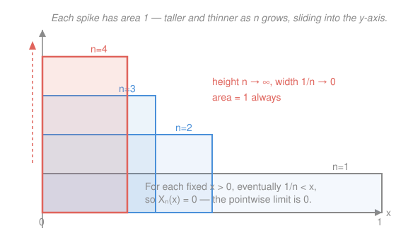

# Probability Theory · Lesson 2.4: The convergence theorems

> ⏱ ~15 min · Module 2: Random variables and expectation · Builds on: [2.3 The Lebesgue integral and expectation](02-03-lebesgue-integral-expectation.md) · Unlocks: [2.5 $L^p$ spaces and the key inequalities](02-05-lp-spaces-inequalities.md)

## Why this matters

Almost every theorem you actually want in probability is a statement about a limit of expectations: the law of large numbers averages more and more variables, characteristic functions differentiate an integral under the sign, and defining a density means passing an integral to the limit. Each one silently asks the same question — **can I swap $\lim$ and $\int$?** Over in `real-analysis` (Module 8) you could only swap when the convergence was *uniform*, a demand that fails constantly in probability (a sequence of random variables rarely converges uniformly). The whole reason we suffered through building the Lebesgue integral in [2.3](02-03-lebesgue-integral-expectation.md) is that it buys three theorems letting you swap under hypotheses you can actually check: **monotonicity, or a single dominating function**. That is the entire payoff. This lesson is the toolbox you reach for on every page for the rest of the course.

## The idea

You have random variables $X_n$ closing in on a limit $X$ — pointwise, or off a null set. You know each expectation $\mathbb E[X_n]$ and you want $\mathbb E[X]$, the expectation of the limit. The naive hope is $\mathbb E[X_n]\to\mathbb E[X]$: "the integral of the limit is the limit of the integrals." Sometimes true, sometimes catastrophically false — mass can **leak away** in the limit (a tall thin spike converging pointwise to zero keeps unit area the whole way down; see the Picture).

The three theorems are three different *licenses* to make the swap, each ruling out the leak in a different way:

- **Monotone Convergence (MCT):** if the $X_n$ are nonnegative and only ever *increase* toward $X$, nothing can escape — the integrals climb right along with them. This is the bedrock; it is literally how the integral was built.
- **Fatou's Lemma:** with no monotonicity, all you're promised is an *inequality*. Mass can leak out (giving a strict drop), but it can never be conjured from nothing — so the limit's integral can only sit *below* the trailing integrals, never above.
- **Dominated Convergence (DCT):** if a *single* integrable function $Y$ caps all the $X_n$ at once, it acts as a lid the escaping mass can't slip past — and the swap is exact again.

In words: monotone from below, or trapped under one finite roof, and you may exchange limit and integral. Otherwise you get only Fatou's one-directional guarantee.

## The formal version

Throughout, $(\Omega,\mathcal F,\mathbb P)$ is a probability space and expectation *is* the Lebesgue integral, $\mathbb E[X]=\int_\Omega X\,d\mathbb P$ from [2.3](02-03-lebesgue-integral-expectation.md). "$X_n\uparrow X$" means $X_n(\omega)\le X_{n+1}(\omega)$ for all $n$ with $X_n(\omega)\to X(\omega)$. **"a.s." (almost surely)** means "for all $\omega$ outside a set of probability $0$" — and since sets of measure zero don't affect any integral, every hypothesis below only needs to hold a.s.

**Monotone Convergence Theorem (MCT).** If $0\le X_n\uparrow X$ a.s., then
$$\mathbb E[X_n]\uparrow \mathbb E[X],$$
an equality of limits (both sides may be $+\infty$).

> In words: for an increasing tower of nonnegative variables, the limit of the integrals is the integral of the limit — exactly, no leak possible.

We take MCT as given: it's the cornerstone on which [2.3](02-03-lebesgue-integral-expectation.md) *defined* $\mathbb E[X]$ for nonnegative $X$ as $\sup$ over simple functions below $X$, and MCT is the statement that this sup is reached along any increasing sequence.

**A clean consequence (Tonelli for sums).** Apply MCT to partial sums $S_n=\sum_{k=1}^n Y_k$ of nonnegative $Y_k\ge 0$: the $S_n$ increase to $\sum_{k=1}^\infty Y_k$, so
$$\mathbb E\!\left[\sum_{k=1}^\infty Y_k\right]=\sum_{k=1}^\infty \mathbb E[Y_k].$$

> In words: for nonnegative terms you may always push expectation through an infinite sum — no convergence check needed, because both sides are honest suprema.

**Fatou's Lemma.** If $X_n\ge 0$ a.s., then
$$\mathbb E\!\left[\liminf_{n\to\infty} X_n\right]\le \liminf_{n\to\infty}\mathbb E[X_n].$$

> In words: the integral of the eventual floor of the $X_n$ can't exceed the eventual floor of their integrals — mass may vanish in the limit, but none is ever created.

*Proof (from MCT).* Fix $n$ and set $G_n=\inf_{k\ge n}X_k$. Two facts: (i) each $G_n\ge 0$, and $G_n\uparrow \liminf_k X_k$ as $n\to\infty$ — that's the *definition* of $\liminf$, the sup of the increasing infima. So MCT applies to the tower $G_n$:
$$\mathbb E\!\left[\liminf_k X_k\right]=\lim_{n\to\infty}\mathbb E[G_n].$$
(ii) For every $k\ge n$ we have $G_n\le X_k$, hence $\mathbb E[G_n]\le \mathbb E[X_k]$; taking the inf over $k\ge n$ gives $\mathbb E[G_n]\le \inf_{k\ge n}\mathbb E[X_k]$. Let $n\to\infty$: the left side tends to $\mathbb E[\liminf_k X_k]$ by (i), and the right side is exactly $\liminf_n \mathbb E[X_n]$. Chaining the two, $\mathbb E[\liminf X_n]\le\liminf \mathbb E[X_n]$. $\blacksquare$

**Dominated Convergence Theorem (DCT).** If $X_n\to X$ a.s. and there is one integrable $Y$ (i.e. $\mathbb E[Y]<\infty$) with $|X_n|\le Y$ a.s. for *every* $n$, then $X$ is integrable and
$$\mathbb E[X_n]\to \mathbb E[X],\qquad\text{and moreover}\qquad \mathbb E\,|X_n-X|\to 0.$$

> In words: if every $X_n$ lives under one fixed integrable ceiling, limit and expectation commute — and the convergence is even in the stronger "average absolute error" sense.

*Proof (from Fatou).* Since $|X_n|\le Y$ and $X_n\to X$ a.s., also $|X|\le Y$, so $X$ is integrable. The two functions $Y+X_n\ge 0$ and $Y-X_n\ge 0$ are each nonnegative, so Fatou applies to both.
Apply it to $Y+X_n$ (which $\to Y+X$): using $\liminf(Y+X_n)=Y+X$,
$$\mathbb E[Y]+\mathbb E[X]\le \liminf_n\big(\mathbb E[Y]+\mathbb E[X_n]\big)=\mathbb E[Y]+\liminf_n\mathbb E[X_n],$$
and cancelling the finite $\mathbb E[Y]$ gives $\mathbb E[X]\le \liminf_n \mathbb E[X_n]$.
Apply it to $Y-X_n$ (which $\to Y-X$): since $\liminf(-X_n)=-\limsup X_n$,
$$\mathbb E[Y]-\mathbb E[X]\le \mathbb E[Y]-\limsup_n\mathbb E[X_n]\ \Longrightarrow\ \limsup_n\mathbb E[X_n]\le \mathbb E[X].$$
Together: $\ \mathbb E[X]\le\liminf \mathbb E[X_n]\le\limsup\mathbb E[X_n]\le\mathbb E[X]$, forcing equality, so $\mathbb E[X_n]\to\mathbb E[X]$. For the last claim, apply the same argument to $|X_n-X|\to 0$, dominated by the integrable $2Y$. $\blacksquare$

**Bounded Convergence Theorem.** The special case $Y\equiv c$ (a constant). On a probability space a constant is integrable ($\mathbb E[c]=c<\infty$), so: if $X_n\to X$ a.s. and $|X_n|\le c$ for all $n$, then $\mathbb E[X_n]\to\mathbb E[X]$. Uniformly bounded random variables always let you swap — the everyday version of DCT.

## Picture

The **escaping-mass** sequence on $([0,1],\lambda)$ with $\lambda$ = Lebesgue (uniform) measure: $X_n=n\,\mathbf 1_{(0,1/n)}$, a spike of height $n$ on a base of width $1/n$. For every fixed $x>0$, once $n$ is large enough that $1/n<x$ the spike has already slid past and $X_n(x)=0$, so $X_n\to 0$ pointwise. Yet each spike encloses area $\int_0^1 X_n\,d\lambda = n\cdot\frac1n = 1$. The mass doesn't shrink — it *escapes* up the thinning spike, and $\mathbb E[X_n]=1\not\to 0=\mathbb E[\lim X_n]$. (On $[0,1]$ Lebesgue measure is a probability measure, so this is a legitimate probability example.)

## Worked examples

**Example 1 (mechanical — MCT builds an expectation from below).** Let $X_n=\min(X,n)$ for a nonnegative random variable $X\ge 0$ (the "truncation" of $X$ at level $n$). Each $X_n$ is bounded, hence integrable, and $0\le X_n\uparrow X$ as $n\to\infty$ (for each $\omega$, once $n>X(\omega)$ the min equals $X(\omega)$). MCT then says
$$\mathbb E[X]=\lim_{n\to\infty}\mathbb E[\min(X,n)].$$
This is the standard *definition-in-practice* of $\mathbb E[X]$ for an unbounded nonnegative $X$: compute the tame bounded expectations and take the limit, with MCT guaranteeing you land on the right number (finite or $+\infty$).

**Example 2 (why you'd care — differentiating an expectation).** Let $N$ be a nonnegative integer-valued random variable and consider the generating function $g(s)=\mathbb E[s^N]=\sum_{k=0}^\infty s^k\,\mathbb P(N=k)$ for $s\in[0,1)$. To extract $\mathbb E[N]$ you want to differentiate term by term and set $s\to 1$. The nonnegative-terms swap is licensed *for free* by the Tonelli-for-sums corollary: with $Y_k=k s^{k-1}\mathbf 1_{\{N=k\}}\ge 0$,
$$g'(s)=\sum_{k=1}^\infty k\,s^{k-1}\,\mathbb P(N=k)=\mathbb E\big[N s^{N-1}\big].$$
Now let $s\uparrow 1$: the integrands $N s^{N-1}$ increase to $N$, so MCT gives $\lim_{s\uparrow1} g'(s)=\mathbb E[N]$. Two swaps, both nonnegative, both free — this is how "differentiate under the expectation" gets justified in practice, and it's the engine behind moment and characteristic-function calculations in Module 4.

## Watch out

- **You might think MCT works for any pointwise limit, but it needs *monotone* and *nonnegative*** — an increasing tower starting at $0$ or above. Drop monotonicity (the spikes $n\mathbf 1_{(0,1/n)}$ aren't increasing) and it fails outright. A *decreasing* sequence needs its own hypothesis (a integrable first term), because mass can escape *downward* too.
- **You might think Fatou gives an equation, but it's only an inequality**, and one-directional at that: $\mathbb E[\liminf X_n]\le\liminf\mathbb E[X_n]$, requiring $X_n\ge 0$. The escaping-mass example makes it strict — $0<1$. Never "read Fatou backwards" to bound $\liminf\mathbb E[X_n]$ from above.
- **You might think DCT just needs each $X_n$ integrable, but it needs one *single* dominator $Y$ capping *all* of them at once**, with $\mathbb E[Y]<\infty$. In the spike example every $X_n$ is integrable ($\mathbb E[X_n]=1<\infty$), yet the smallest function above all of them is $\sup_n X_n\ge \frac1x$ on $(0,1)$, whose integral $\int_0^1 \frac{dx}{x}=\infty$ diverges — no integrable dominator exists, so DCT rightly does not apply.
- **You never need uniform convergence.** This is the whole upgrade over `real-analysis`: a.s. convergence (pointwise off a null set) plus monotonicity or domination is enough. The uniform-convergence swaps of Module 8 there are now the weakest, most disposable special case.

## One-liner

> To swap $\lim$ and $\int$: climb monotonically from zero (MCT), hide under one integrable roof (DCT), or settle for the one-way inequality (Fatou) — and remember the tall thin spike, whose escaping unit of mass is exactly what these hypotheses forbid.

## Problems

**P1 (🟢)** Let $X_n=\dfrac{n}{n+1}\,\mathbf 1_{[0,1]}$ on $([0,1],\lambda)$. Show $X_n\to \mathbf 1_{[0,1]}$ and that $\mathbb E[X_n]\to 1$, and name which single theorem most cleanly justifies the swap here. (One line each.)

**P2 (🟡, the Boss counterexample)** For the escaping-mass sequence $X_n=n\,\mathbf 1_{(0,1/n)}$ on $([0,1],\lambda)$, we have $X_n\to 0$ pointwise while $\mathbb E[X_n]=1$. Go through the three theorems and state, precisely, *why each does not deliver* $\mathbb E[X_n]\to\mathbb E[0]=0$: (a) which MCT hypothesis fails; (b) what Fatou actually says here and why it is consistent (not violated); (c) which DCT hypothesis fails.

**P3 (🔴, optional)** Let $X\ge 0$ with $\mathbb E[X]<\infty$. Prove $\displaystyle\lim_{n\to\infty}\mathbb E\big[X\,\mathbf 1_{\{X>n\}}\big]=0$ (the "tails carry vanishing expected mass" fact, used to prove uniform integrability later). *Hint: let $Z_n=X\,\mathbf 1_{\{X>n\}}$, note $Z_n\to 0$ a.s., and find a dominator.*

Solutions

**P1** For each $x\in[0,1]$, $X_n(x)=\frac{n}{n+1}\to 1$, so $X_n\to\mathbf 1_{[0,1]}$ pointwise. And $\mathbb E[X_n]=\frac{n}{n+1}\int_0^1 1\,d\lambda=\frac{n}{n+1}\to 1$. The cleanest justification is **MCT**: the sequence $\frac{n}{n+1}=1-\frac1{n+1}$ is nonnegative and *increasing* up to $\mathbf 1_{[0,1]}$, exactly MCT's hypotheses. (DCT also applies with dominator $Y\equiv 1$, and Bounded Convergence likewise — any of the three works, but MCT is the tightest fit.)

**P2**
(a) **MCT fails because the sequence is not monotone increasing** (nor nonnegative-increasing to the limit): $X_1=\mathbf 1_{(0,1)}$ but $X_2=2\,\mathbf 1_{(0,1/2)}$, and e.g. at $x=0.7$ we have $X_1(0.7)=1>0=X_2(0.7)$ — it goes down, not up. MCT never applied. (The spikes are nonnegative, but monotonicity is the hypothesis that dies.)
(b) **Fatou is satisfied — with a strict inequality, which is allowed.** Here $\liminf_n X_n=0$ (the pointwise limit), so $\mathbb E[\liminf_n X_n]=\mathbb E[0]=0$, while $\liminf_n\mathbb E[X_n]=\liminf_n 1=1$. Fatou asserts $0\le 1$ — true. Fatou only ever promised the "$\le$" direction, so a genuine gap $0<1$ is exactly the escaping mass it permits, not a contradiction.
(c) **DCT fails for lack of an integrable dominator.** Any $Y$ with $Y\ge X_n$ for all $n$ must satisfy $Y(x)\ge \sup_n X_n(x)$. On $(0,1)$, for each $x$ the largest spike still covering $x$ has height $\lceil 1/x\rceil$, so $\sup_n X_n(x)\ge \frac1x$; hence $\mathbb E[Y]\ge\int_0^1\frac{dx}{x}=+\infty$. No integrable $Y$ dominates the whole sequence, so DCT's hypothesis is unmet — even though each individual $X_n$ is integrable. (This is precisely the trap in "Watch out": per-term integrability is not domination.)

**P3** Set $Z_n=X\,\mathbf 1_{\{X>n\}}$. For each fixed $\omega$, since $X(\omega)<\infty$ a.s. (it's integrable, hence finite a.s.), once $n>X(\omega)$ the indicator is $0$, so $Z_n(\omega)\to 0$ a.s. Domination: $0\le Z_n=X\,\mathbf 1_{\{X>n\}}\le X$ for every $n$, and $X$ is integrable by hypothesis. So DCT applies with dominator $Y=X$:
$$\lim_{n\to\infty}\mathbb E\big[X\,\mathbf 1_{\{X>n\}}\big]=\mathbb E\Big[\lim_{n\to\infty} Z_n\Big]=\mathbb E[0]=0.\qquad\blacksquare$$
(Equivalently, one can write $\mathbb E[X\mathbf 1_{\{X>n\}}]=\mathbb E[X]-\mathbb E[X\mathbf 1_{\{X\le n\}}]$ and drive $\mathbb E[X\mathbf 1_{\{X\le n\}}]\uparrow\mathbb E[X]$ by MCT as in Example 1, but DCT is the one-line route.)

## Flashback

**From Lesson 2.3 (The Lebesgue integral and expectation):** Let $X$ have density $f(x)=2x$ on $[0,1]$ (and $0$ elsewhere). Using the change-of-variables / density formula $\mathbb E[g(X)]=\int_{\mathbb R} g(x)\,f(x)\,dx$, compute $\mathbb E[X]$ and $\mathbb E[X^2]$, and verify $\mathbb E[X]^2\le\mathbb E[X^2]$.

Solution

First confirm $f$ is a density: $\int_0^1 2x\,dx=[x^2]_0^1=1$. ✓ Then
$$\mathbb E[X]=\int_0^1 x\cdot 2x\,dx=\int_0^1 2x^2\,dx=\Big[\tfrac{2}{3}x^3\Big]_0^1=\tfrac23,$$
$$\mathbb E[X^2]=\int_0^1 x^2\cdot 2x\,dx=\int_0^1 2x^3\,dx=\Big[\tfrac12 x^4\Big]_0^1=\tfrac12.$$
Check: $\mathbb E[X]^2=\left(\tfrac23\right)^2=\tfrac49\approx0.444\le \tfrac12=\mathbb E[X^2]$. ✓ The gap is the variance, $\operatorname{Var}(X)=\tfrac12-\tfrac49=\tfrac{1}{18}>0$ — a preview of the Jensen inequality $\mathbb E[X]^2\le\mathbb E[X^2]$ you prove in general in [2.5](02-05-lp-spaces-inequalities.md). $\blacksquare$

## Connections

- **Backward:** MCT isn't a new fact bolted on — it's the *definition* of the nonnegative Lebesgue integral from [2.3](02-03-lebesgue-integral-expectation.md) restated as a limit law, which is why it's an axiom-level cornerstone rather than something we prove. Everything here descends from it (Fatou from MCT, DCT from Fatou).
- **Forward:** [2.5](02-05-lp-spaces-inequalities.md) needs DCT to prove the $L^p$ spaces are complete and to justify Jensen's inequality in expectation form; Module 3 uses Tonelli-for-sums to build product measures and Fubini's theorem; and every limit theorem in Module 4 (laws of large numbers, the CLT via characteristic functions) is a controlled swap of $\lim$ and $\int$ powered by DCT.
- **Sideways (`real-analysis`):** this is the measure-theoretic upgrade of Module 8's uniform-convergence interchange theorems there. Same question — when does $\int\lim=\lim\int$ — but where analysis demanded uniform convergence, measure theory asks only for monotonicity or a dominating function, a decisive loosening that makes probability's limit theorems possible at all.
