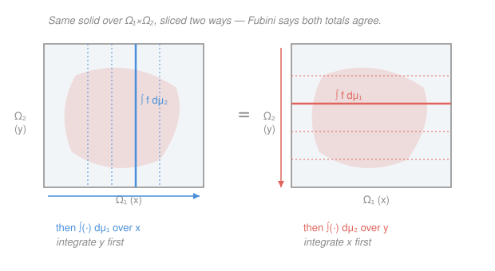

# Probability Theory · Lesson 3.2: Product measures and Fubini

> ⏱ ~15 min · Module 3: Independence and sums · Builds on: [3.1](03-01-independence.md), [1.4](01-04-constructing-lebesgue-measure.md) · Unlocks: [3.3](03-03-borel-cantelli-zero-one.md)

## Why this matters

Last lesson you *defined* independence — but where do independent random variables actually **live**? If $X$ and $Y$ are to "vary freely," neither one's value constraining the other, they need a joint home built so that every value of $X$ can pair with every value of $Y$. That home is a **product space** carrying a **product measure**, and the tool for computing on it is **Fubini's theorem**: a double integral collapses into two single integrals, done in whichever order is easier. This is the machine behind "$\mathbb E[XY]=\mathbb E[X]\mathbb E[Y]$," behind convolutions of distributions, and behind essentially every calculation involving more than one random variable.

## The idea

Think of the plane. A point needs two coordinates, $x$ and $y$, and the plane is exactly "all $x$ paired with all $y$" — the **Cartesian product** $\mathbb R\times\mathbb R$. Independence is that same freedom lifted to probability: the pair $(X,Y)$ should be free to land anywhere in the rectangle of possibilities, and its chance of landing in a small rectangle "$X$ near $a$ **and** $Y$ near $b$" should just be (chance for $X$) $\times$ (chance for $Y$). No coupling, so the probabilities multiply.

Once you have a measure on that two-dimensional home, you'll want to integrate over it — compute expectations of things like $XY$ or $X+Y$. Fubini's promise is that you never have to face the two-dimensional integral head-on. **Sweep it into slices.** Fix $x$, integrate over all $y$ (one ordinary integral); then integrate the result over all $x$ (another). Or slice the other way — fix $y$ first. Same total either way, like measuring a solid's volume by stacking vertical cross-sections or horizontal ones. The one catch, which we'll make precise and then respect for the rest of the course: the slicing is only guaranteed to agree when the integrand is **nonnegative**, or when its **absolute** integral is finite.

## The formal version

Start with two measure spaces $(\Omega_1,\mathcal F_1,\mu_1)$ and $(\Omega_2,\mathcal F_2,\mu_2)$, both $\sigma$-finite (each space is a countable union of finite-measure pieces — true for every probability measure, where the whole space already has mass $1$).

**Product $\sigma$-algebra.** A **measurable rectangle** is a set $A\times B$ with $A\in\mathcal F_1$, $B\in\mathcal F_2$. The **product $\sigma$-algebra** is the smallest $\sigma$-algebra containing all of them:
$$\mathcal F_1\otimes\mathcal F_2 \;=\; \sigma\big(\{A\times B : A\in\mathcal F_1,\ B\in\mathcal F_2\}\big).$$

> In words: rectangles are the atoms of "events about the pair"; the product $\sigma$-algebra is everything you can build from them by the usual countable operations.

**Product measure.** There is a **unique** measure $\mu_1\times\mu_2$ on $\mathcal F_1\otimes\mathcal F_2$ satisfying
$$(\mu_1\times\mu_2)(A\times B) \;=\; \mu_1(A)\,\mu_2(B)\qquad\text{for every rectangle } A\times B.$$

> In words: area $=$ width $\times$ height, promoted from rectangles to a full-blown measure on all measurable sets.

*Where it comes from.* This is the [1.4](01-04-constructing-lebesgue-measure.md) machinery reused verbatim. The rule "$A\times B\mapsto\mu_1(A)\mu_2(B)$" is a well-defined premeasure on the rectangles; **Carathéodory's extension theorem** (stated in 1.4) extends it to a genuine measure on $\mathcal F_1\otimes\mathcal F_2$. **Uniqueness** is the $\pi$–$\lambda$ theorem from Module 1: the rectangles form a $\pi$-system (closed under intersection — $(A\times B)\cap(A'\times B')=(A\cap A')\times(B\cap B')$) that generates the $\sigma$-algebra, and two measures agreeing on a generating $\pi$-system agree everywhere. So Lebesgue measure on the plane is literally $\lambda\times\lambda$, and "area" is a theorem, not a definition.

**Independence is exactly a product.** Let $X:\Omega\to\mathbb R$ and $Y:\Omega\to\mathbb R$ have laws (distributions) $\mu_X,\mu_Y$ — the pushforward measures from [2.2]. Form the **joint law** $\mu_{(X,Y)}$, the pushforward of $\mathbb P$ under $\omega\mapsto(X(\omega),Y(\omega))$. Then
$$X,Y\ \text{independent}\quad\Longleftrightarrow\quad \mu_{(X,Y)} \;=\; \mu_X\times\mu_Y.$$

> In words: "$X$ and $Y$ are independent" and "their joint distribution is the product of the marginals" are the *same statement*. This is the precise sense of the slogan **independent $=$ lives on a product**. ($\Rightarrow$: independence gives $\mathbb P(X\in A,Y\in B)=\mu_X(A)\mu_Y(B)$ on rectangles, and by uniqueness that pins down the joint law as the product. $\Leftarrow$: read the same equation backwards.) Conversely, on any product space the two coordinate maps $(\omega_1,\omega_2)\mapsto\omega_1$ and $\mapsto\omega_2$ are automatically independent under $\mu_1\times\mu_2$ — that's what building the product *did*.

**Fubini–Tonelli.** Let $f:\Omega_1\times\Omega_2\to\mathbb R$ be $\mathcal F_1\otimes\mathcal F_2$-measurable. Both halves say the double integral equals either iterated integral; they differ only in the hypothesis on $f$.

- **Tonelli** (for $f\ge 0$): *always* — no integrability needed —
$$\int_{\Omega_1\times\Omega_2}\! f\,d(\mu_1\times\mu_2) \;=\; \int_{\Omega_1}\!\!\Big(\int_{\Omega_2}\! f\,d\mu_2\Big)d\mu_1 \;=\; \int_{\Omega_2}\!\!\Big(\int_{\Omega_1}\! f\,d\mu_1\Big)d\mu_2,$$
with the value possibly $+\infty$ (that's allowed for a nonnegative integrand).

- **Fubini** (for signed/complex $f$): the *same* chain of equalities holds provided $f$ is **absolutely integrable**, $\displaystyle\int_{\Omega_1\times\Omega_2}|f|\,d(\mu_1\times\mu_2)<\infty$.

> In words: integrate by slices, in either order — allowed whenever $f$ is **nonnegative** (Tonelli) **or** its absolute integral is **finite** (Fubini). And the two work as a team: to check Fubini's hypothesis you run **Tonelli on $|f|$** (which is nonnegative, so it's always legal) and see whether the answer is finite.

## Picture

## Worked examples

**Example 1 (mechanical — the product multiplies).** Let $X,Y$ be independent, each Uniform on $[0,1]$, so $\mu_X=\mu_Y=\lambda$ (Lebesgue) on $[0,1]$ and the joint law is $\lambda\times\lambda$ on the unit square. Compute $\mathbb P(Y\le X^2)$. Because the indicator $\mathbf 1\{y\le x^2\}\ge 0$, **Tonelli** lets us slice with no integrability check:
$$\mathbb P(Y\le X^2)=\int_{[0,1]^2}\mathbf 1\{y\le x^2\}\,d(\lambda\times\lambda) =\int_0^1\!\Big(\int_0^1\mathbf 1\{y\le x^2\}\,dy\Big)dx=\int_0^1 x^2\,dx=\tfrac13.$$
The inner integral fixed $x$ and swept $y$ (a vertical slice in the Picture); the outer integral summed the slices. That's the entire subject in one line.

**Example 2 (why you'd care — finishing the 3.1 claim).** In [3.1](03-01-independence.md) we asserted that independent $X,Y$ *uncorrelate*: $\mathbb E[XY]=\mathbb E[X]\,\mathbb E[Y]$. Fubini proves it cleanly. Assume $X,Y$ independent and **integrable** ($\mathbb E|X|,\mathbb E|Y|<\infty$). By the change-of-variables/pushforward rule, expectation of a function of the pair is an integral against the joint law, which independence makes the product $\mu_X\times\mu_Y$:
$$\mathbb E[XY]=\int_{\mathbb R^2} xy\ d\mu_{(X,Y)}(x,y)=\int_{\mathbb R^2} xy\ d(\mu_X\times\mu_Y).$$
**First check absolute integrability** — this is the discipline the lesson is teaching. Apply **Tonelli** to the nonnegative integrand $|xy|=|x|\,|y|$:
$$\int_{\mathbb R^2}|x|\,|y|\ d(\mu_X\times\mu_Y)=\Big(\int_{\mathbb R}|x|\,d\mu_X\Big)\Big(\int_{\mathbb R}|y|\,d\mu_Y\Big)=\mathbb E|X|\,\mathbb E|Y|<\infty.$$
Finite, so **Fubini** now licenses slicing the signed integrand:
$$\mathbb E[XY]=\int_{\mathbb R}\!\Big(\int_{\mathbb R} xy\,d\mu_Y(y)\Big)d\mu_X(x) =\int_{\mathbb R} x\Big(\int_{\mathbb R} y\,d\mu_Y\Big)d\mu_X =\int_{\mathbb R} x\,\mathbb E[Y]\,d\mu_X=\mathbb E[X]\,\mathbb E[Y].$$
Notice $\mathbb E[Y]$ is a constant, so it slid out of the inner integral, then out of the outer one. **The same setup gives convolution.** For independent $X,Y$ and any Borel set $B$,
$$\mathbb P(X+Y\in B)=\int_{\mathbb R^2}\mathbf 1\{x+y\in B\}\,d(\mu_X\times\mu_Y) =\int_{\mathbb R}\mu_Y(B-x)\,d\mu_X(x),$$
where $B-x=\{b-x:b\in B\}$; if $X,Y$ have densities $f_X,f_Y$ this becomes the **convolution** $f_{X+Y}(z)=\int_{\mathbb R} f_X(x)\,f_Y(z-x)\,dx$. We develop this fully in Lesson 3.4 — here just see that "the law of a sum" is a Fubini integral over the product.

## Watch out

- **You might think** the order of integration is always free to swap. **Actually** that's Tonelli's gift only for $f\ge 0$. For a **signed** $f$ you must *first* confirm $\int|f|<\infty$ (via Tonelli on $|f|$); skip that check and the two orders can genuinely disagree — see P3, where they come out to $+\tfrac\pi4$ and $-\tfrac\pi4$. Fubini's hypothesis is **not** decoration.
- **You might think** the product $\sigma$-algebra $\mathcal F_1\otimes\mathcal F_2$ is just "the rectangles." **Actually** it's *generated by* rectangles and contains vastly more — diagonals, disks, any Borel set of the plane. Rectangles are only the seeds; measurability of $f$ means measurable with respect to the whole generated $\sigma$-algebra.
- **You might think** "product measure" and "independence" are two topics. **Actually** they're one fact wearing two coats: $\mu_{(X,Y)}=\mu_X\times\mu_Y$ *is* independence. Building the product space is precisely the act of making the coordinates independent.
- **You might think** Tonelli needs the pieces to be finite. **Actually** it only needs $\sigma$-finiteness (automatic for probability measures) and $f\ge0$; the answer is allowed to be $+\infty$. It's Fubini — the signed case — that demands a finite absolute integral.

## One-liner

> Independent random variables live on a product space with a product measure, and Fubini integrates it by slices in either order — free when $f\ge0$, but only after checking $\int|f|<\infty$ when $f$ changes sign.

## Problems

**P1 (🟢)** Let $X,Y$ be independent Uniform$[0,1]$ variables (joint law $\lambda\times\lambda$ on the unit square). Using Tonelli, compute $\mathbb P(X+Y\le 1)$ and $\mathbb E[(X+Y)^2]$. (For the second, expand and use independence where it helps.)

**P2 (🟡)** *The tail-sum ("layer cake") formula.* Let $X\ge 0$ be a random variable on $(\Omega,\mathcal F,\mathbb P)$. Prove
$$\mathbb E[X]=\int_0^\infty \mathbb P(X>t)\,dt,$$
by writing $X=\int_0^\infty \mathbf 1\{t<X\}\,dt$ and applying Tonelli to the product measure $\mathbb P\times\lambda$ on $\Omega\times[0,\infty)$. (Which half — Tonelli or Fubini — are you entitled to use, and why with no side condition?)

**P3 (🔴, optional)** *Why the hypothesis is not optional.* On $(0,1)^2$ with Lebesgue measure, let
$$f(x,y)=\frac{x^2-y^2}{(x^2+y^2)^2}.$$
(a) Show $\displaystyle\int_0^1\!\Big(\int_0^1 f\,dy\Big)dx=\frac\pi4$ and $\displaystyle\int_0^1\!\Big(\int_0^1 f\,dx\Big)dy=-\frac\pi4$.
(Hint: $\dfrac{\partial}{\partial y}\dfrac{y}{x^2+y^2}=f$, and $f(y,x)=-f(x,y)$.)
(b) The two orders disagree. Exactly which theorem's hypothesis fails, and what is $\int_{(0,1)^2}|f|\,d\lambda$?

Solutions

**P1** Both integrands are nonnegative / the variables integrable, so Tonelli/Fubini apply throughout.

*First:* $\mathbf 1\{x+y\le 1\}\ge0$, so by Tonelli
$$\mathbb P(X+Y\le1)=\int_0^1\!\Big(\int_0^1\mathbf 1\{y\le 1-x\}\,dy\Big)dx=\int_0^1(1-x)\,dx=\Big[x-\tfrac{x^2}{2}\Big]_0^1=\tfrac12.$$
(Geometrically, the triangle $\{x+y\le1\}$ is half the unit square — reassuring.)

*Second:* expand $(X+Y)^2=X^2+2XY+Y^2$ and use linearity, then independence on the cross term. For Uniform$[0,1]$: $\mathbb E[X]=\tfrac12$, $\mathbb E[X^2]=\int_0^1 x^2dx=\tfrac13$. So
$$\mathbb E[(X+Y)^2]=\mathbb E[X^2]+2\,\mathbb E[X]\mathbb E[Y]+\mathbb E[Y^2]=\tfrac13+2\cdot\tfrac12\cdot\tfrac12+\tfrac13=\tfrac13+\tfrac12+\tfrac13=\tfrac76.$$
(The middle step used $\mathbb E[XY]=\mathbb E[X]\mathbb E[Y]$ — Example 2 in action.)

**P2** For fixed $\omega$, the value $X(\omega)\ge0$ satisfies $\int_0^\infty\mathbf 1\{t<X(\omega)\}\,dt=\int_0^{X(\omega)}1\,dt=X(\omega)$. So $X(\omega)=\int_0^\infty\mathbf1\{t<X(\omega)\}\,dt$. The integrand $g(\omega,t)=\mathbf 1\{t<X(\omega)\}$ is nonnegative and measurable on the product $\Omega\times[0,\infty)$ (it's the indicator of the measurable set $\{(\omega,t):t<X(\omega)\}$). We're entitled to **Tonelli** — nonnegative integrand, $\sigma$-finite spaces ($\mathbb P$ is finite, $\lambda$ on $[0,\infty)$ is $\sigma$-finite) — with **no** integrability side condition. Slicing $\omega$ first:
$$\mathbb E[X]=\int_\Omega\!\Big(\int_0^\infty \mathbf1\{t<X(\omega)\}\,dt\Big)d\mathbb P =\int_0^\infty\!\Big(\int_\Omega \mathbf1\{t<X(\omega)\}\,d\mathbb P\Big)dt=\int_0^\infty \mathbb P(X>t)\,dt,$$
since $\int_\Omega\mathbf1\{t<X\}\,d\mathbb P=\mathbb P(X>t)$. (This identity is a workhorse — it reappears for moments and in the strong-law estimates of Module 4.)

**P3** (a) *Inner over $y$:* since $\partial_y\big[\tfrac{y}{x^2+y^2}\big]=\tfrac{(x^2+y^2)-y\cdot2y}{(x^2+y^2)^2}=\tfrac{x^2-y^2}{(x^2+y^2)^2}=f$,
$$\int_0^1 f\,dy=\Big[\tfrac{y}{x^2+y^2}\Big]_{y=0}^{1}=\frac{1}{x^2+1},\qquad\int_0^1\frac{dx}{x^2+1}=\arctan1-\arctan0=\frac\pi4.$$
*Inner over $x$:* by the antisymmetry $f(y,x)=-f(x,y)$, swapping the roles of the variables flips the sign of the whole computation, so $\int_0^1 f\,dx=-\tfrac{1}{y^2+1}$ and $\int_0^1\big(\int_0^1 f\,dx\big)dy=-\tfrac\pi4$. (Directly: $\partial_x\big[-\tfrac{x}{x^2+y^2}\big]=f$, giving $\int_0^1 f\,dx=-\tfrac{1}{1+y^2}$.)

(b) The two iterated integrals are $+\tfrac\pi4\ne-\tfrac\pi4$, so **Fubini's** hypothesis must fail — and it does: $\int_{(0,1)^2}|f|\,d\lambda=+\infty$. Quick reason: near the origin, switch to polar-style scaling; on the wedge where $|x^2-y^2|$ is a fixed fraction of $x^2+y^2$, $|f|\approx \tfrac{c}{r^2}$ while the area element is $r\,dr\,d\theta$, so the mass behaves like $\int_0 \tfrac{c}{r^2}\,r\,dr=\int_0\tfrac{c}{r}\,dr=\infty$ (the divergent $\tfrac1r$ tail from [1.4]'s cousin in calc). Tonelli on $|f|$ returns $+\infty$, Fubini does not apply, and the order of integration is not safe to swap — precisely the warning. (Tonelli itself never lied: applied to $|f|\ge0$ it correctly reported $+\infty$ in both orders.)

## Flashback

**From Lesson 3.1 (Independence — factorization):** A pair $(X,Y)$ has joint density $f(x,y)=2$ on the triangle $\{(x,y):0<x<y<1\}$ and $f=0$ elsewhere. Are $X$ and $Y$ independent? Decide by computing the marginals and checking whether $f(x,y)=f_X(x)\,f_Y(y)$.

Solution

Marginals (integrate out the other variable over the triangle):
$$f_X(x)=\int_x^1 2\,dy=2(1-x)\quad(0<x<1),\qquad f_Y(y)=\int_0^y 2\,dx=2y\quad(0<y<1).$$
Their product is $f_X(x)f_Y(y)=4y(1-x)$, which does **not** equal $f(x,y)=2$ on the triangle (e.g. at $x=\tfrac14,y=\tfrac12$: product $=4\cdot\tfrac12\cdot\tfrac34=\tfrac32\ne2$). So **$X$ and $Y$ are not independent.** The deeper tell is visible before any integral: the support is a **triangle**, not a rectangle. Independence forces the joint law to be a product $\mu_X\times\mu_Y$, whose support is necessarily a product set $A\times B$ — a rectangle. A triangular support means knowing $Y=y$ restricts $X$ to $(0,y)$, so the variables constrain each other. That's exactly this lesson's slogan read in reverse: **not a product $\Rightarrow$ not independent.**

## Connections

- **Backward:** the product measure is built by the very [1.4](01-04-constructing-lebesgue-measure.md) Carathéodory extension, with $\pi$–$\lambda$ uniqueness from Module 1; the joint law is a pushforward from [2.2]; and this lesson closes the loop on [3.1](03-01-independence.md) by proving $\mathbb E[XY]=\mathbb E[X]\mathbb E[Y]$ and recasting independence as "$\mu_{(X,Y)}=\mu_X\times\mu_Y$."
- **Forward:** convolution (set up here) drives Lesson 3.4's sums of independent variables; Fubini is the engine again for characteristic functions in Module 4 ($\varphi_{X+Y}=\varphi_X\varphi_Y$), and product/independence structure underlies the Borel–Cantelli II half of [3.3](03-03-borel-cantelli-zero-one.md).
- **Sideways:** the "integrate by slices" move is the same Fubini physicists use to reduce multiple integrals in `em-refresher` and `analytical-mechanics`, and economists use for expected utility over joint distributions in `micro-refresher`; the tail-sum formula (P2) is the probabilistic twin of integration by parts.
