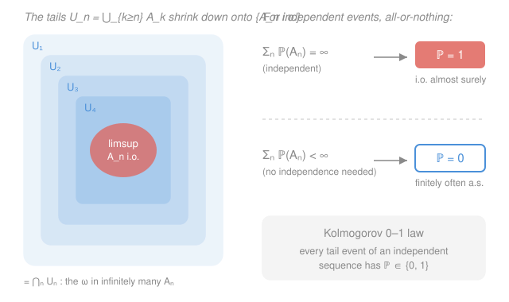

# Probability Theory · Lesson 3.3: Borel–Cantelli and the 0–1 law

> ⏱ ~15 min · Module 3: Independence and sums · Builds on: [3.1](03-01-independence.md), [1.3](01-03-measures-probability-spaces.md) · Unlocks: [3.4](03-04-sums-of-random-variables.md)

## Why this matters

Run an experiment forever. A rare event — a run of a million heads, a stock crash of a given size, the monkey typing *Hamlet* — has some tiny probability $p>0$ each time. Does it ever *actually* happen, and if so, does it keep happening? "Infinitely many trials, each tiny" is exactly the regime where intuition fails, and it's the regime every limit theorem lives in. The Borel–Cantelli lemmas settle the question with a single number, $\sum_n \mathbb P(A_n)$: converge and the events die out, diverge (if independent) and they recur forever. Kolmogorov's 0–1 law then delivers the punchline for the whole course — any question about the *long-run tail* of an independent sequence isn't just likely or unlikely, it's certain or impossible.

## The idea

You have infinitely many events $A_1, A_2, A_3, \dots$. The one question that survives to infinity is: **do infinitely many of them occur?** Call that event "$A_n$ infinitely often," written $\{A_n \text{ i.o.}\}$.

The answer turns out to hinge on one crude quantity — add up the probabilities, $\sum_n \mathbb P(A_n)$.

- If the sum is **finite**, the events are, on the whole, too scarce to keep landing: with probability $1$ only finitely many occur, and after some point they stop. This needs nothing but the total being finite.
- If the sum is **infinite** *and the events are independent*, they're too plentiful to avoid: with probability $1$ infinitely many occur, forever. Independence is what forbids the events from secretly "using up" their probability on the same outcomes.

So for independent events it's a clean **dichotomy**: the borderline sum $\sum \mathbb P(A_n)$ either converges (finitely often, a.s.) or diverges (infinitely often, a.s.) — no middle ground, no probability strictly between $0$ and $1$.

That "always $0$ or always $1$" flavor is not a coincidence of this one event. Kolmogorov's 0–1 law says *every* long-run question about an independent sequence — does the series converge? does the average settle? — comes back a certainty. The only work left is to figure out **which** certainty.

## The formal version

**The "infinitely often" event.** Given events $A_1, A_2, \dots$ in a probability space $(\Omega, \mathcal F, \mathbb P)$ (the setup from [1.3](01-03-measures-probability-spaces.md)), define

$$\{A_n \text{ i.o.}\} \;=\; \limsup_{n} A_n \;=\; \bigcap_{n=1}^{\infty} \bigcup_{k=n}^{\infty} A_k.$$

> In words: fix a cutoff $n$ and form the **tail union** $U_n = \bigcup_{k\ge n} A_k$ — "some event from $n$ onward happens." An outcome $\omega$ lies in *every* $U_n$ exactly when, no matter how far out you start, a later $A_k$ still contains it — i.e. $\omega$ is in infinitely many of the $A_n$. The tails $U_1 \supseteq U_2 \supseteq \cdots$ decrease, and their intersection is the i.o. event.

(Its sibling $\liminf_n A_n = \bigcup_n \bigcap_{k\ge n} A_k$ is "$A_n$ **eventually always**" — $\omega$ is in all but finitely many $A_n$. Keep them straight: i.o. is $\limsup$, eventually-always is $\liminf$.)

**Borel–Cantelli I (convergence ⟹ nothing).** If $\displaystyle\sum_{n=1}^{\infty}\mathbb P(A_n)<\infty$, then $\mathbb P(A_n \text{ i.o.})=0$. *No independence required.*

> In words: if the probabilities sum to a finite total, then almost surely only finitely many of the $A_n$ occur.

*Proof.* The i.o. event sits inside every tail union: $\{A_n \text{ i.o.}\}\subseteq U_n=\bigcup_{k\ge n}A_k$ for each $n$. By monotonicity and countable subadditivity of the measure (both proved in [1.3](01-03-measures-probability-spaces.md)),

$$\mathbb P(A_n \text{ i.o.})\;\le\;\mathbb P\!\Big(\bigcup_{k\ge n}A_k\Big)\;\le\;\sum_{k=n}^{\infty}\mathbb P(A_k).$$

The right side is the tail of a convergent series, so it $\to 0$ as $n\to\infty$. The left side doesn't depend on $n$, so it must be $\le 0$, i.e. exactly $0$. $\blacksquare$

(Equivalently: $U_n\downarrow \{A_n\text{ i.o.}\}$, so continuity of measure from above gives $\mathbb P(A_n\text{ i.o.})=\lim_n \mathbb P(U_n)\le \lim_n\sum_{k\ge n}\mathbb P(A_k)=0$.)

**Borel–Cantelli II (independence + divergence ⟹ everything).** If the $A_n$ are **independent** and $\displaystyle\sum_{n=1}^{\infty}\mathbb P(A_n)=\infty$, then $\mathbb P(A_n \text{ i.o.})=1$.

> In words: for independent events whose probabilities sum to infinity, almost surely infinitely many occur.

*Proof.* Showing the i.o. event has probability $1$ is the same as showing its complement — "only finitely many $A_n$ occur" — has probability $0$. That complement is $\bigcup_n \bigcap_{k\ge n}A_k^c$ (for some cutoff $n$, no $A_k$ happens after it), so it's enough to show $\mathbb P\big(\bigcap_{k\ge n}A_k^c\big)=0$ for every $n$. Independence of the $A_k$ gives independence of the complements $A_k^c$, so for any $N\ge n$,

$$\mathbb P\Big(\bigcap_{k=n}^{N}A_k^c\Big)=\prod_{k=n}^{N}\big(1-\mathbb P(A_k)\big).$$

Now use the workhorse bound $1-x\le e^{-x}$ (valid for all real $x$):

$$\prod_{k=n}^{N}\big(1-\mathbb P(A_k)\big)\;\le\;\prod_{k=n}^{N}e^{-\mathbb P(A_k)}\;=\;\exp\!\Big(-\sum_{k=n}^{N}\mathbb P(A_k)\Big).$$

As $N\to\infty$ the sum $\sum_{k=n}^{N}\mathbb P(A_k)\to\infty$ (a divergent series has divergent tails), so the exponential $\to 0$. Hence $\mathbb P\big(\bigcap_{k\ge n}A_k^c\big)=0$ for each $n$; a countable union of null sets is null, so the complement of the i.o. event has probability $0$, and $\mathbb P(A_n\text{ i.o.})=1$. $\blacksquare$

Together they are a **dichotomy** for independent events: $\sum\mathbb P(A_n)<\infty \Rightarrow$ finitely often a.s.; $\sum\mathbb P(A_n)=\infty\Rightarrow$ infinitely often a.s. The convergence of one number decides the whole long-run behavior.

**Tail $\sigma$-algebra.** For a sequence of random variables $(X_n)$ (measurable functions, from Lesson 2.1), let $\sigma(X_n, X_{n+1}, \dots)$ be the information carried by the variables from index $n$ on. The **tail $\sigma$-algebra** is

$$\mathcal T=\bigcap_{n=1}^{\infty}\sigma(X_n, X_{n+1}, X_{n+2}, \dots).$$

> In words: $\mathcal T$ holds exactly the events you can still decide after **throwing away any finite prefix** $X_1,\dots,X_{m}$ — questions about the far tail alone. Examples: "$\sum_n X_n$ converges," "$\limsup_n X_n > c$," "$\frac1n\sum_{k\le n}X_k \to 0$." Changing finitely many $X_k$ alters none of these.

**Kolmogorov's 0–1 law.** If the $X_n$ are **independent**, then every tail event $A\in\mathcal T$ has $\mathbb P(A)\in\{0,1\}$. (Equivalently, any tail-measurable random variable is almost surely equal to a constant.)

> In words: for an independent sequence, any question about the long-run tail is answered with certainty — probability exactly $0$ or exactly $1$, never anything between.

*Proof idea.* Fix a tail event $A\in\mathcal T$. Because $A$ depends only on $X_{n+1}, X_{n+2}, \dots$, it is independent of $\sigma(X_1,\dots,X_n)$ for every $n$ — the past. Letting $n\to\infty$, $A$ is independent of $\sigma(X_1, X_2, \dots)$, the $\sigma$-algebra generated by the *whole* sequence (this limiting step is where the $\pi$–$\lambda$ / approximation machinery from [3.1](03-01-independence.md) does its work). But $A$ is itself a member of that $\sigma$-algebra. So $A$ **is independent of itself**: $\mathbb P(A)=\mathbb P(A\cap A)=\mathbb P(A)\,\mathbb P(A)=\mathbb P(A)^2$. The only solutions of $p=p^2$ are $p=0$ and $p=1$. $\blacksquare$

## Picture

## Worked examples

**Example 1 (mechanical — BC I in action).** Flip a fair coin forever; let $A_n$ be the event that flips $n, n+1, \dots, 2n$ are *all heads* — a block of $n{+}1$ heads starting at position $n$. Then $\mathbb P(A_n)=2^{-(n+1)}$, and

$$\sum_{n=1}^{\infty}\mathbb P(A_n)=\sum_{n=1}^{\infty}2^{-(n+1)}=\tfrac12<\infty.$$

By Borel–Cantelli I (no independence needed — and indeed these overlapping blocks are *not* independent), $\mathbb P(A_n\text{ i.o.})=0$: almost surely, only finitely many such lengthening all-heads blocks appear at their designated start times. Growing demands eventually outrun the coin.

**Example 2 (why you'd care — the infinite monkey / recurrence).** An experiment repeats independently forever; a target event has fixed probability $p>0$ on each trial (the monkey types *Hamlet*; a specific millionaire-making hand is dealt; a sensor throws a rare fault). Let $A_n=\{$target occurs on trial $n\}$, so $\mathbb P(A_n)=p$ for all $n$ and the $A_n$ are independent. Then

$$\sum_{n=1}^{\infty}\mathbb P(A_n)=\sum_{n=1}^{\infty}p=\infty,$$

so Borel–Cantelli II gives $\mathbb P(A_n\text{ i.o.})=1$. **Any fixed-probability event, however tiny, occurs infinitely often almost surely** — the monkey doesn't just eventually type *Hamlet*, it types it infinitely many times. This is the honest statement behind "given enough time, anything possible happens."

Now a tail question for the sequel. Let $(\varepsilon_n)$ be independent random signs ($\pm 1$ with probability $\tfrac12$ each) and consider whether the series

$$\sum_{n=1}^{\infty}\frac{\varepsilon_n}{n}$$

converges. Convergence is unaffected by changing any *finite* block of signs — drop or flip $\varepsilon_1,\dots,\varepsilon_m$ and the tail, hence convergence, is identical. So "$\sum \varepsilon_n/n$ converges" is a **tail event** of the independent sequence $(\varepsilon_n)$. By Kolmogorov's 0–1 law its probability is $0$ or $1$ — no computation needed to know *that*. (Which one? It converges with probability $1$; the summands are independent, mean zero, with $\sum \operatorname{Var}(\varepsilon_n/n)=\sum 1/n^2<\infty$ controlling the fluctuations — the criterion you'll build in [3.4](03-04-sums-of-random-variables.md).)

## Watch out

- **You might think** Borel–Cantelli I also needs independence — it doesn't. BC I is pure subadditivity and works for *any* events (Example 1's blocks are dependent). Only BC II, the converse direction, requires independence.
- **You might think** $\sum\mathbb P(A_n)=\infty$ always forces infinitely-often — but without independence it can fail completely. Take a single event $B$ with $\mathbb P(B)=\tfrac12$ and set $A_n=B$ for every $n$. Then $\sum\mathbb P(A_n)=\sum\tfrac12=\infty$, yet $\{A_n\text{ i.o.}\}=B$, so $\mathbb P(A_n\text{ i.o.})=\tfrac12$ — strictly between $0$ and $1$. Divergence buys nothing when the events secretly reuse the same outcomes; independence is exactly what rules that out.
- **You might think** the 0–1 law tells you the answer — it only tells you the answer is *extreme*. "This tail event has probability $0$ or $1$" collapses the possibilities but doesn't pick between them. The real labor is always deciding **which**, and that's where BC II, variance sums, or a law of large numbers earn their keep.
- **You might think** i.o. and eventually-always are interchangeable. $\{A_n\text{ i.o.}\}=\limsup A_n$ (in infinitely many) and $\{A_n \text{ ev.}\}=\liminf A_n$ (in all but finitely many) are different events, with $\liminf A_n\subseteq\limsup A_n$. "Heads infinitely often" is certain; "heads eventually always" has probability $0$.

## One-liner

> One number decides an infinite fate: $\sum\mathbb P(A_n)$ converges and the events die out, diverges (if independent) and they recur forever — and for an independent sequence every tail question is already settled at $0$ or $1$.

## Problems

**P1 (🟢)** Let $A_n$ be the event that in $n$ independent fair-coin flips you get *all heads*, so $\mathbb P(A_n)=2^{-n}$, with the flip-blocks disjoint across $n$ (independent). Does $A_n$ occur infinitely often, almost surely? State which lemma you use and why.

**P2 (🟡)** Independent random variables $X_1, X_2, \dots$ satisfy $\mathbb P(X_n = n) = \tfrac1{n^2}$ and $\mathbb P(X_n = 0) = 1-\tfrac1{n^2}$. Show that almost surely $X_n = 0$ for all sufficiently large $n$, and conclude $\mathbb P(X_n\to 0)=1$. (This is a taste of "a.s. convergence" ahead in Module 4.)

**P3 (🔴, optional)** Let $(X_n)$ be independent with $\mathbb P(X_n=1)=\mathbb P(X_n=-1)=\tfrac12$. Consider the event $C=\big\{\limsup_n \tfrac1n\sum_{k=1}^n X_k \ge 0.01\big\}$.
(a) Explain why $C$ is a tail event, so $\mathbb P(C)\in\{0,1\}$.
(b) Without proving a law of large numbers, argue informally which value it is — and name the theorem (coming in Module 4) that would settle it rigorously.

Solutions

**P1** Yes, infinitely often, almost surely. The $A_n$ are independent and $\sum_n \mathbb P(A_n)=\sum_n 2^{-n}=1<\infty$ — wait, that sum is *finite*, so this is **Borel–Cantelli I**, giving $\mathbb P(A_n\text{ i.o.})=\mathbf 0$: almost surely only finitely many all-heads runs (at their designated blocks) occur. (Trap sprung: independence is present but irrelevant here — BC I is decided purely by the finite sum, and the honest answer is *not* infinitely often. Longer all-heads runs get exponentially rare fast enough to sum, so they stop.)

**P2** Let $A_n=\{X_n=n\}=\{X_n\neq 0\}$, with $\mathbb P(A_n)=1/n^2$. Then

$$\sum_{n=1}^{\infty}\mathbb P(A_n)=\sum_{n=1}^{\infty}\frac1{n^2}=\frac{\pi^2}{6}<\infty.$$

By Borel–Cantelli I, $\mathbb P(A_n\text{ i.o.})=0$; equivalently, with probability $1$ only finitely many $A_n$ occur, i.e. there is a (random) $N$ with $X_n=0$ for all $n> N$. For such an outcome $X_n\to 0$ trivially (it's eventually the constant $0$). Since this holds on a probability-$1$ set, $\mathbb P(X_n\to 0)=1$. No independence was needed — BC I again.

**P3** (a) Changing finitely many terms $X_1,\dots,X_m$ shifts the partial sum $\sum_{k=1}^n X_k$ by a fixed bounded amount for all $n\ge m$, so it changes $\tfrac1n\sum_{k=1}^n X_k$ by at most (constant)$/n\to 0$. Hence the value of $\limsup_n \tfrac1n\sum_{k\le n}X_k$ is unchanged by any finite prefix, so $C\in\mathcal T$, the tail $\sigma$-algebra of the independent sequence $(X_n)$. By Kolmogorov's 0–1 law, $\mathbb P(C)\in\{0,1\}$.

(b) The value is $\mathbf 0$. The $X_k$ have mean $0$, and the running average $\tfrac1n\sum_{k\le n}X_k$ should settle to the mean $0$, so its $\limsup$ is $0<0.01$ almost surely — the event $C$ essentially never happens, giving $\mathbb P(C)=0$. The theorem that makes this rigorous is the **Strong Law of Large Numbers** (Module 4, [4.2](../syllabus.md)): for i.i.d. variables with finite mean, $\tfrac1n\sum_{k\le n}X_k\to \mathbb E[X_1]=0$ almost surely, so the $\limsup$ equals $0$ a.s.

## Flashback

**From Lesson 3.1 (Independence — pairwise vs. mutual):** Roll two independent fair dice. Let $A=\{$first die is even$\}$, $B=\{$second die is even$\}$, and $C=\{$the sum is even$\}$. Show that $A, B, C$ are **pairwise** independent but **not mutually** independent, and pinpoint which factorization fails.

Solution

Each of $A, B, C$ has probability $\tfrac12$ (first die even: $3/6$; second die even: $3/6$; sum even = both even or both odd = $\tfrac12$).

*Pairwise.* $A$ and $B$ come from different independent dice, so $\mathbb P(A\cap B)=\tfrac12\cdot\tfrac12=\tfrac14=\mathbb P(A)\mathbb P(B)$. For $A$ and $C$: the sum is even *and* the first die is even iff both dice are even, probability $\tfrac12\cdot\tfrac12=\tfrac14$; and $\mathbb P(A)\mathbb P(C)=\tfrac12\cdot\tfrac12=\tfrac14$. ✓ By symmetry the same holds for $B$ and $C$. So all three pairs factor — pairwise independent.

*Mutual fails.* The triple factorization $\mathbb P(A\cap B\cap C)=\mathbb P(A)\mathbb P(B)\mathbb P(C)$ is the one that breaks. If the first two dice are both even, the sum is automatically even, so $A\cap B\subseteq C$ and $A\cap B\cap C=A\cap B$, giving

$$\mathbb P(A\cap B\cap C)=\mathbb P(A\cap B)=\tfrac14,\qquad\text{but}\qquad \mathbb P(A)\mathbb P(B)\mathbb P(C)=\tfrac12\cdot\tfrac12\cdot\tfrac12=\tfrac18.$$

Since $\tfrac14\neq\tfrac18$, the three-way factorization fails: $C$ is determined by $A$ and $B$ together (any two of the three force the third), so mutual independence is impossible even though every pair is independent. Mutual independence requires *all* $2^k-k-1$ higher factorizations, not just the pairwise ones.

## Connections

- **Backward:** BC I is nothing but continuity/subadditivity of measure from [1.3](01-03-measures-probability-spaces.md) applied to the decreasing tails $U_n$; BC II and the 0–1 law run on the independence and $\pi$–$\lambda$ machinery of [3.1](03-01-independence.md). The i.o. event is a $\limsup$ of sets — the set-theoretic cousin of the $\limsup$ of numbers.
- **Forward:** [3.4](03-04-sums-of-random-variables.md) turns "the random series $\sum X_n$ converges" (a tail event, hence $0$ or $1$ by today's law) into a computable criterion via variances; and the a.s.-convergence viewpoint of P2/P3 is the backbone of the Strong Law of Large Numbers in Module 4, whose proof leans directly on Borel–Cantelli.
- **Sideways:** the same "finite total ⟹ negligible tail" logic is why a countable/measure-zero set can be ignored inside an integral (`real-analysis`), and the 0–1 rigidity of tail events reappears in `stat-mech` as the sharpness of phase transitions and thermodynamic limits — macroscopic long-run quantities are almost surely constant.
