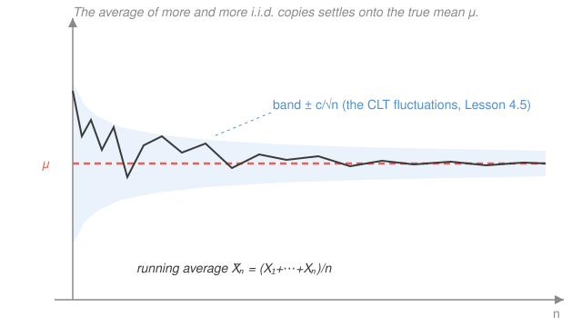

# Probability Theory · Lesson 4.2: The laws of large numbers

> ⏱ ~15 min · Module 4: Convergence and the limit theorems · Builds on: [4.1](04-01-modes-of-convergence.md), [3.4](03-04-sums-of-random-variables.md) · Unlocks: [4.3](04-03-characteristic-functions.md)

## Why this matters

This is the theorem that makes probability *mean* something. When you say "a fair coin lands heads half the time," you are making a claim about a limit — and until you can prove that the observed frequency of heads actually converges to $1/2$, that claim is folklore. The law of large numbers (LLN) is the proof. It is the license for every empirical average ever computed: opinion polls, insurance premiums, Monte Carlo integration, and the entire idea that an estimator gets the right answer with enough data (`prob-stat-refresher`). Two versions exist — a weak one that falls out of Chebyshev in three lines, and a strong one that pins down the frequentist promise exactly.

## The idea

Roll a die once: you get some number between 1 and 6, and the "average" is wherever you landed — no pattern. Roll it a thousand times and average: you will be sitting on top of $3.5$, the true mean, almost surely. Any single term is random noise; the *average of many* is not, because the independent wiggles cancel. Averaging is a noise-reduction machine.

Why does the noise shrink? Because variance does. Each new sample adds its own scatter, but you divide the whole sum by $n$ — and (from [3.4](03-04-sums-of-random-variables.md)) the variance of the average is $\sigma^2/n$, which collapses to zero. Zero spread means the average has nowhere left to go but the mean.

There are two honest ways to say "the average lands on $\mu$," and they differ by exactly the modes of convergence you sorted out in [4.1](04-01-modes-of-convergence.md):

- **Weak law:** for any tolerance you name, the chance the average misses $\mu$ by more than that tolerance goes to zero. (Convergence *in probability*.)
- **Strong law:** the sequence of averages, as one single infinite path, converges to $\mu$ — with probability one, the path settles down and stays. (Convergence *almost surely*.)

The strong law is what actually justifies "the frequency of heads converges to $1/2$": that is a statement about one infinite run of flips settling, not about a snapshot at large $n$.

## The formal version

**Setup.** Let $X_1, X_2, \dots$ be **i.i.d.** — independent and identically distributed — with common mean $\mu = \mathbb E[X_1]$. Write the **sample mean** (the running average of the first $n$)

$$\bar X_n = \frac{1}{n}\sum_{i=1}^n X_i.$$

From [3.4](03-04-sums-of-random-variables.md), linearity gives $\mathbb E[\bar X_n]=\mu$ (the average is *unbiased* — centered on the truth), and independence gives $\operatorname{Var}(\bar X_n)=\sigma^2/n$ where $\sigma^2=\operatorname{Var}(X_1)$ (assumed finite for the easy proof).

**Weak law of large numbers (WLLN).** If $\sigma^2<\infty$, then $\bar X_n \xrightarrow{P} \mu$: for every $\varepsilon>0$,

$$\mathbb P\bigl(|\bar X_n - \mu| \ge \varepsilon\bigr) \xrightarrow[n\to\infty]{} 0.$$

> In words: pick any error bar you like; the probability the average lands outside it vanishes as data piles up.

*Proof.* This is Chebyshev's inequality (from [2.5](02-05-lp-spaces-inequalities.md)) applied to $\bar X_n$, whose mean is $\mu$ and whose variance is $\sigma^2/n$:

$$\mathbb P\bigl(|\bar X_n - \mu| \ge \varepsilon\bigr) \;\le\; \frac{\operatorname{Var}(\bar X_n)}{\varepsilon^2} \;=\; \frac{\sigma^2}{n\varepsilon^2} \;\xrightarrow[n\to\infty]{}\; 0. \qquad\blacksquare$$

Three lines, and it exposes the mechanism completely: the average concentrates *because its variance dies like $1/n$.* (The finite-variance hypothesis can be dropped — a finite mean alone already forces $\bar X_n\xrightarrow{P}\mu$ — but that proof is a truncation argument, not a one-liner. We take the honest shortcut here.)

**Strong law of large numbers (SLLN, Kolmogorov).** If the $X_i$ are i.i.d. with $\mathbb E|X_1|<\infty$, then

$$\bar X_n \xrightarrow{a.s.} \mu, \qquad\text{i.e.}\qquad \mathbb P\Bigl(\lim_{n\to\infty}\bar X_n = \mu\Bigr)=1.$$

> In words: not just "unlikely to miss at each $n$" — the whole random path of running averages converges to $\mu$, for all outcomes except a set of probability zero.

Almost-sure is strictly stronger than in-probability ([4.1](04-01-modes-of-convergence.md)): the SLLN *upgrades* the mode of convergence, and it does so needing only a finite mean. The finite variance was a crutch for the WLLN's proof, nothing more.

*Proof sketch (under a finite 4th moment $\mathbb E[X_1^4]<\infty$ — stronger than needed, but clean).* Center so that $\mu=0$, and let $S_n=\sum_{i=1}^n X_i$. Expand

$$\mathbb E[S_n^4]=\sum_{i,j,k,l} \mathbb E[X_iX_jX_kX_l].$$

By independence and $\mathbb E[X_i]=0$, any term with a *lone* index (one that appears once) vanishes. Only two patterns survive: all four indices equal ($n$ terms, each $\mathbb E[X_1^4]$), or two matched pairs ($3n(n-1)$ terms, each $(\mathbb E[X_1^2])^2$). So $\mathbb E[S_n^4] = n\,\mathbb E[X_1^4] + 3n(n-1)(\mathbb E[X_1^2])^2 \le C n^2$ for a constant $C$. Therefore

$$\mathbb E\bigl[\bar X_n^4\bigr]=\frac{\mathbb E[S_n^4]}{n^4}\le \frac{C}{n^2},$$

and Markov's inequality gives $\mathbb P(|\bar X_n|>\varepsilon)=\mathbb P(\bar X_n^4>\varepsilon^4)\le C/(n^2\varepsilon^4)$. Since $\sum_n 1/n^2<\infty$, we have $\sum_n \mathbb P(|\bar X_n|>\varepsilon)<\infty$, so **Borel–Cantelli I** ([3.3](03-03-borel-cantelli-zero-one.md)) says $\mathbb P(|\bar X_n|>\varepsilon \text{ infinitely often})=0$: past some point the path stays inside $\pm\varepsilon$. Intersecting this over $\varepsilon=1/k$ for $k=1,2,\dots$ (a countable intersection of probability-one events) gives $\bar X_n\to 0$ almost surely. $\qquad\blacksquare$

Kolmogorov's theorem removes the 4th-moment assumption down to the bare $\mathbb E|X_1|<\infty$; the idea (summable tail probabilities $\Rightarrow$ Borel–Cantelli $\Rightarrow$ a.s.) is exactly this one, done with sharper tools.

## Picture

The path is pure noise at the left and glued to $\mu$ at the right. The shaded band narrows like $1/\sqrt n$ — a preview of [4.5](04-05-central-limit-theorem.md): the LLN says the path hits $\mu$, and the CLT says it approaches at rate $O(1/\sqrt n)$, with those leftover fluctuations Gaussian.

## Worked examples

**Example 1 (mechanical — how much data buys what accuracy).** Measurements $X_i$ are i.i.d. with mean $\mu$ and variance $\sigma^2=9$. How large must $n$ be so that the sample mean is within $\varepsilon=0.5$ of $\mu$ with probability at least $0.99$? By Chebyshev,

$$\mathbb P(|\bar X_n-\mu|\ge 0.5)\le \frac{9}{n(0.5)^2}=\frac{36}{n}.$$

Force $36/n\le 0.01$: we need $n\ge 3600$. Crude (Chebyshev is loose), but it is a *guarantee* with no distributional assumption beyond the variance — the WLLN made quantitative.

**Example 2 (why you'd care — Monte Carlo integration).** You want $I=\int_0^1 g(x)\,dx$ but $g$ has no antiderivative. Draw $U_1,\dots,U_n$ i.i.d. Uniform$(0,1)$ and average:

$$\hat I_n=\frac1n\sum_{i=1}^n g(U_i).$$

Since $\mathbb E[g(U_1)]=\int_0^1 g(x)\,dx=I$, the SLLN gives $\hat I_n\xrightarrow{a.s.} I$ — the random estimate converges to the exact integral, guaranteed. This is the whole engine of Monte Carlo methods (and, in general, $\frac1n\sum g(X_i)\to\mathbb E[g(X)]$ is why simulated averages estimate expectations). The error shrinks like $1/\sqrt n$ regardless of dimension — which is why Monte Carlo beats grid methods for high-dimensional integrals in physics and finance.

## Watch out

- **Weak vs. strong is a real gap.** The WLLN is convergence *in probability* (each snapshot is likely close); the SLLN is *almost sure* (the whole path settles). Almost-sure implies in-probability, never the reverse ([4.1](04-01-modes-of-convergence.md)) — do not quote one as if it were the other.
- **No mean, no law.** The **Cauchy** distribution (density $\frac{1}{\pi(1+x^2)}$) has no mean: $\int \frac{|x|}{\pi(1+x^2)}dx$ diverges. Its sample average $\bar X_n$ is *again* standard Cauchy for every $n$ — it never concentrates on anything. The LLN genuinely needs $\mathbb E|X_1|<\infty$; it is not a free law of averaging.
- **It's the average that converges, not the sum.** $\bar X_n=S_n/n\to\mu$, but $S_n=\sum X_i$ itself diverges (for $\mu\ne 0$ it runs off to $\pm\infty$; for $\mu=0$ it wanders like $\pm\sqrt n$). "Things average out" is a statement about $S_n/n$, never about $S_n$.
- **Finite variance is only for the easy proof.** The SLLN holds with a finite mean alone. Don't over-state the hypotheses.

## One-liner

> Divide a growing sum of i.i.d. copies by $n$ and its variance dies like $1/n$, dragging the average onto the true mean — weakly in probability, strongly (almost surely) if the mean is finite at all.

## Problems

**P1 (🟢)** Sensor readings are i.i.d. with unknown mean $\mu$ and known variance $\sigma^2=4$. Using Chebyshev, find the smallest $n$ guaranteeing $\mathbb P(|\bar X_n-\mu|\ge 0.1)\le 0.05$.

**P2 (🟡)** Estimate $I=\int_0^1 x^2\,dx$ by Monte Carlo: $\hat I_n=\frac1n\sum_{i=1}^n U_i^2$ with $U_i$ i.i.d. Uniform$(0,1)$. (a) Show $\hat I_n$ is unbiased and name the theorem giving $\hat I_n\to I$ almost surely. (b) Compute $\operatorname{Var}(\hat I_n)$. *(Recall for $U\sim$Uniform$(0,1)$, $\mathbb E[U^k]=\frac{1}{k+1}$.)*

**P3 (🔴, optional)** Let $X_1,\dots,X_n$ be i.i.d. standard Cauchy. It is a fact (provable via characteristic functions in [4.3](04-03-characteristic-functions.md)) that $\bar X_n$ is again standard Cauchy for every $n$. (a) Confirm the standard Cauchy has no mean. (b) Compute $\mathbb P(|\bar X_n|\le 1)$ and show it does **not** tend to $1$ as $n\to\infty$. Conclude that no LLN holds here, and say which hypothesis fails.

Solutions

**P1** Chebyshev on $\bar X_n$ (variance $\sigma^2/n=4/n$) with $\varepsilon=0.1$:

$$\mathbb P(|\bar X_n-\mu|\ge 0.1)\le \frac{4}{n(0.1)^2}=\frac{400}{n}.$$

Require $400/n\le 0.05$, i.e. $n\ge 400/0.05 = 8000$. So the smallest guaranteed $n$ is $\boxed{8000}$.

**P2** (a) $\mathbb E[\hat I_n]=\frac1n\sum_{i=1}^n\mathbb E[U_i^2]=\mathbb E[U_1^2]=\frac{1}{3}=\int_0^1 x^2\,dx=I$, so it's unbiased. The $U_i^2$ are i.i.d. with finite mean, so the **strong law of large numbers** gives $\hat I_n\xrightarrow{a.s.}I=\tfrac13$.

(b) Let $Y=U^2$. Then $\mathbb E[Y]=\frac13$ and $\mathbb E[Y^2]=\mathbb E[U^4]=\frac15$, so $\operatorname{Var}(Y)=\frac15-\frac19=\frac{9-5}{45}=\frac{4}{45}$. By independence, $\operatorname{Var}(\hat I_n)=\frac{1}{n}\operatorname{Var}(Y)=\dfrac{4}{45\,n}$ — decaying like $1/n$, exactly the WLLN mechanism, and the reason the estimate tightens with more samples.

**P3** (a) A mean would be $\int_{-\infty}^{\infty}\frac{x}{\pi(1+x^2)}\,dx$. But $\int_0^\infty\frac{x}{\pi(1+x^2)}\,dx=\frac{1}{2\pi}\bigl[\ln(1+x^2)\bigr]_0^\infty=\infty$; the positive and negative halves are each infinite, so (as with $\int_{-\infty}^\infty x\,dx$ in the `calc-refresher` improper-integrals lesson) the integral does not exist. No mean.

(b) Since $\bar X_n\sim$ standard Cauchy for every $n$,

$$\mathbb P(|\bar X_n|\le 1)=\int_{-1}^{1}\frac{dx}{\pi(1+x^2)}=\frac{1}{\pi}\bigl[\arctan x\bigr]_{-1}^{1}=\frac{1}{\pi}\cdot\frac{\pi}{2}=\frac12,$$

*independent of $n$.* If some LLN held with $\bar X_n\to c$ (a constant), then for large $n$ almost all of the mass would sit within $1$ of $c$, forcing $\mathbb P(|\bar X_n|\le 1)\to 1$ for the right window — but here it is stuck at $\frac12$ forever. So $\bar X_n$ does not converge to any constant. The failed hypothesis is exactly $\mathbb E|X_1|<\infty$: with no finite mean, the noise-cancellation argument has no target to cancel toward.

## Flashback

**From Lesson 4.1 (Modes of convergence):** Let $X_1,X_2,\dots$ be *independent* with $\mathbb P(X_n=1)=\frac1n$ and $\mathbb P(X_n=0)=1-\frac1n$. (a) Show $X_n\xrightarrow{P}0$ and $X_n\xrightarrow{L^1}0$. (b) Show that $X_n$ does **not** converge to $0$ almost surely. (This is the sequence that lives strictly on the "in probability but not a.s." side of the implication diagram.)

Solution

(a) For any $0<\varepsilon<1$, $\mathbb P(|X_n|\ge\varepsilon)=\mathbb P(X_n=1)=\frac1n\to0$, so $X_n\xrightarrow{P}0$. And $\mathbb E|X_n|=1\cdot\frac1n+0=\frac1n\to0$, so $X_n\xrightarrow{L^1}0$ as well.

(b) The events $\{X_n=1\}$ are independent with $\sum_n\mathbb P(X_n=1)=\sum_n\frac1n=\infty$. By **Borel–Cantelli II** ([3.3](03-03-borel-cantelli-zero-one.md)), $\mathbb P(X_n=1\text{ infinitely often})=1$: almost every outcome sees $X_n=1$ for infinitely many $n$, so $X_n$ cannot converge to $0$ along that path. Hence $X_n\not\xrightarrow{a.s.}0$. Convergence in probability (and even in $L^1$) genuinely does not imply almost-sure convergence — the LLN's strong law is a real strengthening, not a restatement. $\blacksquare$

## Connections

- **Backward:** the WLLN proof is [2.5](02-05-lp-spaces-inequalities.md)'s Chebyshev inequality fed the variance formula $\operatorname{Var}(\bar X_n)=\sigma^2/n$ from [3.4](03-04-sums-of-random-variables.md); the SLLN sketch runs on Borel–Cantelli I from [3.3](03-03-borel-cantelli-zero-one.md). It is the modes-of-convergence hierarchy of [4.1](04-01-modes-of-convergence.md) made concrete: same sequence, two verdicts.
- **Forward:** [4.3](04-03-characteristic-functions.md) reproves the WLLN cleanly and explains the Cauchy pathology (its characteristic function $e^{-|t|}$ isn't differentiable at $0$ — no mean); [4.5](04-05-central-limit-theorem.md) describes the $O(1/\sqrt n)$ Gaussian fluctuations *around* this limit — the band in the picture.
- **Sideways (statistics):** "the sample mean converges to the population mean" is the founding guarantee of estimation — consistency of estimators, the frequentist definition of probability, and the law behind every poll and Monte Carlo simulation (`prob-stat-refresher`).
