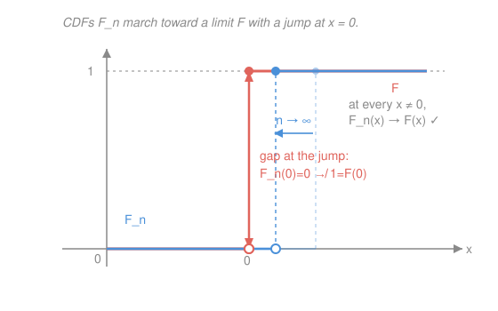

# Probability Theory · Lesson 4.4: Weak convergence

> ⏱ ~15 min · Module 4: Convergence and the limit theorems · Builds on: [4.3 Characteristic functions](04-03-characteristic-functions.md), [4.1 Modes of convergence](04-01-modes-of-convergence.md) · Unlocks: [4.5 The Central Limit Theorem](04-05-central-limit-theorem.md)

## Why this matters

The central limit theorem says a normalized sum "becomes normal." In *which* sense? Not almost surely, not in probability, not in $L^p$ — the individual values don't settle at all. It's convergence **in distribution**: the *law* of the sum approaches the normal law. In [4.1](04-01-modes-of-convergence.md) you defined that through CDFs, "$F_n(x)\to F(x)$ at continuity points of $F$" — a workable definition, but a clumsy one to prove theorems with. This lesson replaces it with a clean, portable definition that the CLT proof actually uses, and gives you the toolkit — the portmanteau theorem, the continuous mapping theorem, tightness and Prokhorov — that turns "converges in distribution" into something you can compute and reason with.

## The idea

Forget the CDF for a moment. If two distributions are close, then *averaging any reasonable measurement against them* should give nearly the same answer. That is the whole idea: probe each law $\mu_n$ with a **test function** $f$ — a bounded, continuous readout — and ask whether the averages $\int f\,d\mu_n$ settle down. If the averages of *every* nice test function converge, the laws themselves are converging.

Why bounded and continuous? **Bounded** so the average can't be hijacked by a sliver of mass parked far out at infinity. **Continuous** so that mass shuffling by a tiny amount only shuffles the readout by a tiny amount — a test function must not care about a hair's-breadth relocation. This second requirement is exactly what dodges the awkwardness of CDFs. A CDF $F(x)=\mu((-\infty,x])$ is really the average of the *indicator* $\mathbf 1_{(-\infty,x]}$, and that indicator has a **cliff** at $x$. If a limit law piles mass exactly on that cliff, an approximating sequence that puts its mass a hair to the wrong side reads the cliff differently — the CDFs disagree at that one point even though the laws are converging. Continuous test functions have no cliffs, so they never trip on this. That is why the continuity-point caveat in [4.1](04-01-modes-of-convergence.md) existed, and why it disappears here.

## The formal version

Throughout, $\mu_n,\mu$ are probability measures (laws) on $\mathbb R$ with its Borel σ-algebra — the setting from [1.3](01-03-measures-probability-spaces.md). Write $C_b(\mathbb R)$ for the bounded continuous functions $f:\mathbb R\to\mathbb R$.

**Definition (weak convergence).** $\mu_n$ **converges weakly** to $\mu$, written $\mu_n\Rightarrow\mu$, if
$$\int f\,d\mu_n \;\longrightarrow\; \int f\,d\mu \qquad\text{for every } f\in C_b(\mathbb R).$$
Equivalently, if $X_n$ has law $\mu_n$ and $X$ has law $\mu$, then $X_n\xrightarrow{d}X$ means $\mathbb E[f(X_n)]\to\mathbb E[f(X)]$ for all $f\in C_b(\mathbb R)$.

> In words: the expectation of every bounded, cliff-free measurement converges. That — and nothing about the actual values of the $X_n$ — is what "convergence in distribution" means.

**Portmanteau theorem.** The following are equivalent (a "portmanteau" is a suitcase — one theorem packing many faces of the same idea):

1. $\mu_n\Rightarrow\mu$ (i.e. $\int f\,d\mu_n\to\int f\,d\mu$ for all $f\in C_b$);
2. $\limsup_n \mu_n(C)\le\mu(C)$ for every **closed** set $C$;
3. $\liminf_n \mu_n(U)\ge\mu(U)$ for every **open** set $U$;
4. $\mu_n(A)\to\mu(A)$ for every **$\mu$-continuity set** $A$ (a Borel set with $\mu(\partial A)=0$, i.e. the boundary carries no mass);
5. $F_n(x)\to F(x)$ at every continuity point $x$ of the limit CDF $F$.

> In words: weak convergence can be read off test functions, or off how mass behaves on open/closed sets, or off "nice" sets whose rims are massless, or off CDFs away from jumps. Statement 5 is exactly the [4.1](04-01-modes-of-convergence.md) definition — now revealed as one face of the suitcase, not the fundamental thing.

*Proof of (1) $\Rightarrow$ (2), then (2) $\Rightarrow$ (3) $\Rightarrow$ (4) $\Rightarrow$ (5).* Take a closed set $C$. Its indicator has a cliff, so we squeeze it from above by cliff-free functions. Let $d(x,C)=\inf_{y\in C}|x-y|$ be the distance to $C$, and set
$$f_k(x)=\big(1-k\,d(x,C)\big)^{+}=\max\{0,\,1-k\,d(x,C)\}.$$
Each $f_k$ is continuous and bounded in $[0,1]$, equals $1$ on $C$, and — because $C$ is closed, so $d(x,C)>0$ off $C$ — decreases to $\mathbf 1_C$ pointwise as $k\to\infty$. Since $\mathbf 1_C\le f_k$,
$$\limsup_n\mu_n(C)\le\limsup_n\int f_k\,d\mu_n=\int f_k\,d\mu,$$
using (1) for the last equality. Now let $k\to\infty$: dominated convergence (the $f_k$ sit under the constant $1$, integrable since $\mu$ is a probability measure) gives $\int f_k\,d\mu\to\int\mathbf 1_C\,d\mu=\mu(C)$. Hence $\limsup_n\mu_n(C)\le\mu(C)$, which is (2).

(2) $\Rightarrow$ (3) is complementation: if $U$ is open then $U^c$ is closed, and $\mu_n(U)=1-\mu_n(U^c)$, so
$$\liminf_n\mu_n(U)=1-\limsup_n\mu_n(U^c)\ge 1-\mu(U^c)=\mu(U).$$
(2)+(3) $\Rightarrow$ (4): for any Borel $A$, let $A^\circ$ be its interior (open) and $\overline A$ its closure (closed), so $A^\circ\subseteq A\subseteq\overline A$. Then
$$\mu(A^\circ)\le\liminf_n\mu_n(A^\circ)\le\liminf_n\mu_n(A)\le\limsup_n\mu_n(A)\le\limsup_n\mu_n(\overline A)\le\mu(\overline A).$$
If $A$ is a $\mu$-continuity set, $\mu(\overline A)-\mu(A^\circ)=\mu(\partial A)=0$, so the outer terms coincide and the sandwich forces $\mu_n(A)\to\mu(A)$. Finally (4) $\Rightarrow$ (5): take $A=(-\infty,x]$, whose boundary is $\{x\}$. Then $\mu(\partial A)=\mu(\{x\})=0$ exactly when $F$ has no jump at $x$ — i.e. $x$ is a continuity point — and there (4) reads $F_n(x)\to F(x)$. The remaining implication (5) $\Rightarrow$ (1) recovers the definition from CDF convergence; we take it as stated. $\blacksquare$

**Continuous mapping theorem.** If $X_n\xrightarrow{d}X$ and $g:\mathbb R\to\mathbb R$ is continuous except possibly on a set $D$ with $\mathbb P(X\in D)=0$, then $g(X_n)\xrightarrow{d}g(X)$.

> In words: a continuous readout of a converging-in-distribution sequence still converges in distribution — and $g$ may even be discontinuous, as long as the limit law assigns no mass to the bad points. (For $f\in C_b$, $f\circ g$ is bounded and continuous $\mu_X$-a.e.; feed it to the definition.) So $X_n\xrightarrow{d}N(0,1)$ gives $X_n^2\xrightarrow{d}\chi^2_1$ for free.

**Tightness.** A family $\{\mu_n\}$ is **tight** if for every $\varepsilon>0$ there is a compact set $K$ with $\mu_n(K)\ge 1-\varepsilon$ for **all** $n$.

> In words: one fixed bounded window catches all but $\varepsilon$ of the mass, uniformly in $n$ — no mass sneaks off to $\pm\infty$ as $n$ grows.

**Prokhorov's theorem (stated).** For probability measures on $\mathbb R$, $\{\mu_n\}$ is tight **if and only if** it is relatively compact for weak convergence: every subsequence has a further subsequence that converges weakly to some probability measure.

> In words: tightness is exactly the compactness that lets you *extract a limit law*. This is the existence tool — pair it with "all subsequential limits agree" to conclude the whole sequence converges. (Companion, named only: the **Skorokhod representation theorem** — if $\mu_n\Rightarrow\mu$ one can realize all of them on one probability space with $X_n\to X$ almost surely, converting weak statements into a.s. ones.)

**The Lévy bridge (from [4.3](04-03-characteristic-functions.md)).** Recall the characteristic function $\varphi_\mu(t)=\int e^{itx}\,d\mu(x)$. Lévy's continuity theorem says: $\mu_n\Rightarrow\mu$ **iff** $\varphi_{\mu_n}(t)\to\varphi_\mu(t)$ for every $t$ (and if the pointwise limit is merely continuous at $t=0$, it is automatically a characteristic function and a limit law exists — tightness in disguise). Since $e^{itx}$ is bounded and continuous, this is the *practical* test for weak convergence, and it is exactly the move [4.5](04-05-central-limit-theorem.md) makes.

## Picture

The limit $F$ (red) jumps at $x=0$. The approximants $F_n$ (blue) are steps whose cliff marches left toward $0$. Everywhere except $x=0$ they close in on $F$; but at the jump itself the red gap persists — $F_n(0)=0$ never reaches $F(0)=1$. That single bad point is why statement 5 excludes discontinuities, and why the *definition* uses cliff-free test functions instead of CDFs.

## Worked examples

**Example 1 (mechanical — a point mass sliding home, and the jump caveat live).** Let $\mu_n=\delta_{1/n}$, the unit mass at $1/n$, and $\mu=\delta_0$. For any $f\in C_b$,
$$\int f\,d\mu_n=f\!\left(\tfrac1n\right)\;\longrightarrow\; f(0)=\int f\,d\mu,$$
by continuity of $f$ alone. So $\delta_{1/n}\Rightarrow\delta_0$. Now watch the CDFs: $F_n(x)=\mathbf 1_{\{x\ge 1/n\}}$ and $F(x)=\mathbf 1_{\{x\ge 0\}}$. At $x=0$, since $1/n>0$ we have $F_n(0)=0$ for every $n$, so $F_n(0)\to0\ne 1=F(0)$ — failure **exactly at the jump**, the one discontinuity of $F$. At every $x\ne 0$, $F_n(x)\to F(x)$. The mass approaches $0$ from the right, on the wrong side of a right-continuous CDF's cliff; the test-function definition never noticed, which is the point. (Portmanteau still holds: for the closed set $C=\{0\}$, $\mu_n(C)=0$ and $\mu(C)=1$, so $\limsup\mu_n(C)=0\le 1$ — the closed-set *inequality* is satisfied, and equality fails only because $\{0\}$ is not a $\mu$-continuity set.)

**Example 2 (why you'd care — a discrete grid filling out the uniform).** Let $\mu_n$ be uniform on the grid $\{0,\tfrac1n,\tfrac2n,\dots,\tfrac{n-1}n\}$ (each point mass $1/n$), and let $\mu=\mathrm{Uniform}[0,1]$ (Lebesgue measure on $[0,1]$). For $f\in C_b$,
$$\int f\,d\mu_n=\frac1n\sum_{k=0}^{n-1} f\!\left(\tfrac kn\right)\;\longrightarrow\;\int_0^1 f(x)\,dx=\int f\,d\mu,$$
because the middle expression is precisely a **Riemann sum** for $\int_0^1 f$, and $f$ restricted to the compact $[0,1]$ is continuous hence Riemann integrable. So $\mu_n\Rightarrow\mathrm{Uniform}[0,1]$. Here the limit CDF $F(x)=x$ on $[0,1]$ is continuous *everywhere*, so there is no bad point at all: $|F_n(x)-x|\le 1/n\to0$ uniformly, convergence at every $x$. Weak convergence is the honest statement that "a fine discretization looks like the continuum" — and note it says nothing about any particular $X_n$ sitting near any particular $X$; it is a statement about **laws**.

## Watch out

- You might think you can test weak convergence with *any* bounded function, but it must be **continuous**. Indicators of sets — which have cliffs — can genuinely fail: in Example 1, $\mathbf 1_{\{0\}}$ gives $\mu_n(\{0\})=0\not\to1=\mu(\{0\})$ even though $\delta_{1/n}\Rightarrow\delta_0$. That failure at a boundary is *why* statement 4 restricts to $\mu$-continuity sets ($\mu(\partial A)=0$).
- You might think CDF convergence must hold *everywhere*, but it is required only at **continuity points** of the limit $F$. Mass piling exactly on a jump is allowed to break the CDF at that one point (Example 1) — and the definition is built precisely to tolerate it.
- You might think $X_n\xrightarrow{d}X$ means the values $X_n$ get close to $X$. It does **not** — it is a statement about laws only (contrast the a.s. / in-probability / $L^p$ modes of [4.1](04-01-modes-of-convergence.md), which *are* about values). If $X\sim N(0,1)$ then $-X\sim N(0,1)$ too, so $X\xrightarrow{d}-X$ while $|X-(-X)|=2|X|$ is never small.
- You might forget **tightness** and imagine every sequence of laws has a weakly convergent subsequence. Mass can escape: $\mu_n=\delta_n$ has $\int f\,d\mu_n=f(n)$, which need not converge, and *no* subsequence converges to a probability measure — the limit "law" leaks all its mass to $+\infty$. Tightness is exactly the hypothesis Prokhorov needs to rule this out.

## One-liner

> $\mu_n\Rightarrow\mu$ means $\int f\,d\mu_n\to\int f\,d\mu$ for every bounded continuous $f$ — cliff-free test functions, so mass piling on a jump can't break it — and tightness is what stops mass escaping to infinity so a limit law exists.

## Problems

**P1 (🟢)** Let $\mu_n=\delta_{-1/n}$, the unit mass at $-1/n$. Show $\mu_n\Rightarrow\delta_0$, and check whether the CDFs $F_n$ converge to $F$ **at every point including $x=0$**. Contrast with Example 1 and explain, in one sentence, why the verdict at the jump differs.

**P2 (🟡)** Suppose $\mu_n\Rightarrow\mu$ where $\mu$ has a continuous CDF (no atoms). Using the portmanteau theorem, prove that $\mu_n\big([a,b]\big)\to\mu\big([a,b]\big)$ for every $a<b$. Then, given $X_n\xrightarrow{d}X$ with $X\sim N(0,1)$, deduce $\mathbb P(X_n\le 0)\to\tfrac12$ and name the theorem that gives $X_n^2\xrightarrow{d}\chi^2_1$.

**P3 (🔴, optional)** The lesson proved the *closed-set* portmanteau statement (2). Derive the *open-set* statement (3) — $\liminf_n\mu_n(U)\ge\mu(U)$ for open $U$ — from it, carefully. Then exhibit a concrete sequence $\mu_n\Rightarrow\mu$ and a Borel set $A$ with $\mu_n(A)\not\to\mu(A)$, and identify exactly which hypothesis of statement 4 fails for your $A$.

Solutions

**P1** For $f\in C_b$, $\int f\,d\mu_n=f(-1/n)\to f(0)=\int f\,d\delta_0$ by continuity, so $\mu_n\Rightarrow\delta_0$. CDFs: $F_n(x)=\mathbf 1_{\{x\ge -1/n\}}$ and $F(x)=\mathbf 1_{\{x\ge 0\}}$. At $x=0$: since $-1/n<0\le 0$, we have $0\ge -1/n$, so $F_n(0)=1$ for every $n$, giving $F_n(0)\to 1=F(0)$ — convergence holds **even at the jump**. For any fixed $x<0$, eventually $-1/n>x$ so $F_n(x)=0=F(x)$; for $x>0$, $F_n(x)=1=F(x)$. So here the CDFs converge everywhere. The difference from Example 1: the mass now approaches $0$ from the **left**, the same side a right-continuous CDF is "closed" on, so the approaching step already sits at height $1$ at $x=0$. (Weak convergence is identical in both cases — only the incidental CDF-at-the-jump behavior differs, underscoring that the jump point is not part of the real definition.)

**P2** The boundary of $A=[a,b]$ is $\partial A=\{a,b\}$. Since $\mu$ has a continuous CDF it has no atoms, so $\mu(\{a\})=\mu(\{b\})=0$, hence $\mu(\partial A)=0$: $[a,b]$ is a $\mu$-continuity set. Portmanteau statement 4 then gives $\mu_n([a,b])\to\mu([a,b])$ directly. For the normal case, $A=(-\infty,0]$ has $\partial A=\{0\}$ and $\mathbb P(X=0)=0$ (the normal is atomless), so it too is a continuity set and $\mathbb P(X_n\le 0)\to\mathbb P(X\le 0)=\Phi(0)=\tfrac12$. (Equivalently, $0$ is a continuity point of $F=\Phi$, so statement 5 applies.) That $X_n^2\xrightarrow{d}\chi^2_1$ is the **continuous mapping theorem** with $g(x)=x^2$ (continuous everywhere), since the square of a standard normal is chi-squared with one degree of freedom.

**P3** *Open from closed.* Let $U$ be open, so $C:=U^c$ is closed. As $\mu_n,\mu$ are probability measures, $\mu_n(U)=1-\mu_n(C)$ and $\mu(U)=1-\mu(C)$. Using $\liminf_n(1-a_n)=1-\limsup_n a_n$ with $a_n=\mu_n(C)$,
$$\liminf_n\mu_n(U)=\liminf_n\big(1-\mu_n(C)\big)=1-\limsup_n\mu_n(C)\ \ge\ 1-\mu(C)=\mu(U),$$
where the inequality is statement (2) applied to the closed set $C$. That is statement (3). *Counterexample for (4).* Take $\mu_n=\delta_{1/n}\Rightarrow\delta_0=\mu$ (Example 1) and $A=(-\infty,0]$. Then $\mu_n(A)=\delta_{1/n}\big((-\infty,0]\big)=0$ for all $n$ (since $1/n>0$), while $\mu(A)=\delta_0\big((-\infty,0]\big)=1$; so $\mu_n(A)=0\not\to 1=\mu(A)$. The failed hypothesis: $\partial A=\{0\}$ and $\mu(\partial A)=\delta_0(\{0\})=1\ne 0$, so $A$ is **not** a $\mu$-continuity set — the limit law parks an atom exactly on the boundary. (The set $A=\{0\}$ or $A=[0,\infty)^c$ works equally; any $A$ whose boundary catches the point $0$ does.)

## Flashback

**From Lesson 4.3 (Characteristic functions):** Let $X\sim\mathrm{Exponential}(\lambda)$, density $f(x)=\lambda e^{-\lambda x}$ for $x\ge 0$ (rate $\lambda>0$). (a) Compute the characteristic function $\varphi_X(t)$. (b) If $X,Y$ are independent $\mathrm{Exponential}(\lambda)$, write down $\varphi_{X+Y}(t)$. (c) Recover $\mathbb E[X]$ from $\varphi_X'(0)$.

Solution

(a) $\displaystyle\varphi_X(t)=\mathbb E[e^{itX}]=\int_0^\infty e^{itx}\lambda e^{-\lambda x}\,dx=\lambda\int_0^\infty e^{-(\lambda-it)x}\,dx=\frac{\lambda}{\lambda-it}$ (the exponent has negative real part $-\lambda$, so the boundary term at $\infty$ vanishes).

(b) By independence, characteristic functions multiply ([4.3](04-03-characteristic-functions.md)): $\displaystyle\varphi_{X+Y}(t)=\varphi_X(t)\,\varphi_Y(t)=\left(\frac{\lambda}{\lambda-it}\right)^{2}.$ (This is the characteristic function of a $\mathrm{Gamma}(2,\lambda)$ — convolution of two exponentials — recovered without integrating a convolution.)

(c) Differentiate: $\varphi_X(t)=\lambda(\lambda-it)^{-1}$, so $\varphi_X'(t)=\lambda\cdot(-1)(\lambda-it)^{-2}\cdot(-i)=\dfrac{i\lambda}{(\lambda-it)^{2}}$, giving $\varphi_X'(0)=\dfrac{i\lambda}{\lambda^{2}}=\dfrac{i}{\lambda}$. Since $\varphi_X'(0)=i\,\mathbb E[X]$, we get $\mathbb E[X]=\dfrac1\lambda$ — the exponential mean, read straight off the derivative at $0$. $\blacksquare$

## Connections

- **Backward:** this makes the "convergence in distribution" of [4.1](04-01-modes-of-convergence.md) — the weakest of the four modes — precise and portable, and it runs on the Lebesgue integral of [2.3](02-03-lebesgue-integral-expectation.md) applied to test functions. The portmanteau proof leaned on dominated convergence ([2.4](02-04-convergence-theorems.md)) to pass $f_k\downarrow\mathbf 1_C$.
- **Forward:** [4.5](04-05-central-limit-theorem.md) proves the CLT by showing the characteristic function of the normalized sum converges pointwise to $e^{-t^2/2}$, then invoking the Lévy bridge above to upgrade that to weak convergence — i.e. $\xrightarrow{d}N(0,1)$. Tightness/Prokhorov is the general existence engine behind such limit laws.
- **Sideways:** the "test against nice functions" idea is the same **weak topology** move that recurs across math — weak-\* convergence of measures in functional analysis, and distributions (generalized functions) defined purely by how they pair with smooth test functions. Whenever an object is slippery to pin down directly, you probe it with a well-behaved family and watch the pairings.
