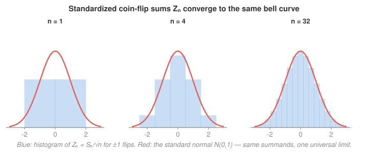

# Probability Theory · Lesson 4.5: The Central Limit Theorem

> ⏱ ~15 min · Module 4: Convergence and the limit theorems · Builds on: [4.3](04-03-characteristic-functions.md), [4.4](04-04-weak-convergence.md) · Unlocks: Module 5 — [5.1 Conditional expectation](05-01-conditional-expectation.md)

## Why this matters

Measurement error, the diffusion of a particle, the sampling distribution of a poll, the fluctuation of a price — all of them are bell-shaped, and none of them agreed to be. The Central Limit Theorem is why. It says that when you add up many small independent contributions and look at the total on the right scale, the *shape* of the pieces is erased: whatever they were — coin flips, die rolls, exponential waiting times — the standardized sum is a standard normal. This is the theorem that makes the normal distribution the default of all of statistics, and it is the reason `prob-stat-refresher`'s confidence intervals and hypothesis tests work at all. Here you finally prove it.

## The idea

The Law of Large Numbers ([4.2](04-02-laws-of-large-numbers.md)) told you the sample average $\bar X_n = S_n/n$ collapses to the constant $\mu$: divide the sum by $n$ and all the randomness is crushed out. That is almost *too* good — it throws away the very fluctuations we often care about. The CLT rewinds one notch. Instead of dividing by $n$, divide the *centered* sum by $\sqrt n$. This is the exact rate at which the leftover wobble neither blows up nor vanishes — it settles into a stable, universal shape.

And here is the miracle: that shape does not depend on what you were adding. Sum up $\pm 1$ coin flips, or die rolls, or lifetimes — center, divide by $\sqrt n$, and the histogram converges to the *same* bell curve every time (see the picture). The individual quirks — skewness, discreteness, fat middles — wash out. Only two numbers survive the limit: the mean (killed by centering) and the variance (the width). Everything else is noise that averages away.

Why $\sqrt n$ and not $n$? Because from [3.4](03-04-sums-of-random-variables.md), independent variances add: $\operatorname{Var}(S_n) = n\sigma^2$, so $\operatorname{sd}(S_n) = \sigma\sqrt n$. Dividing by $\sigma\sqrt n$ is exactly rescaling by the sum's own standard deviation — the only normalization that lands you on a fixed, non-degenerate distribution.

## The formal version

**Central Limit Theorem (i.i.d. case).** Let $X_1, X_2, \dots$ be independent, identically distributed random variables with mean $\mu = \mathbb E[X_i]$ and finite, nonzero variance $\sigma^2 = \operatorname{Var}(X_i) \in (0, \infty)$. Set $S_n = \sum_{i=1}^n X_i$ and

$$Z_n = \frac{S_n - n\mu}{\sigma\sqrt n} = \frac{\sum_{i=1}^n (X_i - \mu)}{\sigma\sqrt n}.$$

Then $Z_n \xrightarrow{\ d\ } N(0,1)$: for every real $z$,

$$\mathbb P(Z_n \le z) \ \longrightarrow\ \Phi(z) = \int_{-\infty}^{z} \frac{1}{\sqrt{2\pi}}\, e^{-x^2/2}\,dx.$$

> In words: subtract the mean, divide by the standard deviation of the sum, and the resulting distribution converges to the standard normal — no matter what distribution the $X_i$ had.

Here $\xrightarrow{d}$ is **convergence in distribution** from [4.4](04-04-weak-convergence.md), and $\Phi$ is the standard-normal CDF. Notice $Z_n$ is already standardized: $\mathbb E[Z_n]=0$ and $\operatorname{Var}(Z_n)=1$ for every $n$ (the CLT says the *whole distribution*, not just the first two moments, converges).

## Picture

For $X_i = \pm 1$ fair flips ($\mu = 0$, $\sigma = 1$), the standardized sum $Z_n = S_n/\sqrt n$ starts as two blunt spikes ($n=1$), is already recognizably bell-shaped by $n=4$, and hugs $N(0,1)$ by $n=32$. Same summands throughout — the limit shape is not something we put in.

## The formal version, proved

We prove the i.i.d. CLT in full using characteristic functions — the machine built in [4.3](04-03-characteristic-functions.md), where the key fact was that **for a sum of independent variables the characteristic function is the product**, and [4.4](04-04-weak-convergence.md)'s **Lévy continuity theorem**, which converts pointwise convergence of characteristic functions into convergence in distribution.

**Step 0 — reduce to the standard case.** Replace each $X_i$ by $\tilde X_i = (X_i - \mu)/\sigma$. These are i.i.d. with $\mathbb E[\tilde X_i] = 0$ and $\operatorname{Var}(\tilde X_i) = 1$, and $Z_n = \sum_{i=1}^n \tilde X_i / \sqrt n$ is unchanged. So without loss of generality assume $\mu = 0$, $\sigma^2 = 1$.

**Step 1 — expand the characteristic function to second order.** Let $\varphi(t) = \mathbb E[e^{itX_1}]$ be the common characteristic function, where $i = \sqrt{-1}$. Because $\mathbb E[X_1^2] = \sigma^2 = 1 < \infty$, the moment expansion from [4.3](04-03-characteristic-functions.md) applies: $\varphi$ is twice differentiable at $0$ with $\varphi'(0) = i\,\mathbb E[X_1] = 0$ and $\varphi''(0) = -\mathbb E[X_1^2] = -1$, so its Taylor expansion is

$$\varphi(t) = 1 + it\,\mathbb E[X_1] - \frac{t^2}{2}\,\mathbb E[X_1^2] + o(t^2) = 1 - \frac{t^2}{2} + o(t^2)\qquad (t \to 0).$$

**This is the one and only place finite variance is used** — it is what buys us the $-t^2/2$ term and guarantees the remainder is $o(t^2)$. With infinite variance the second derivative does not exist and this expansion is false (see Watch out).

**Step 2 — multiply, using independence.** Since the $X_i$ are independent and identically distributed, the characteristic function of $Z_n = \sum X_i / \sqrt n$ factors:

$$\varphi_{Z_n}(t) = \mathbb E\!\left[\exp\!\left(i\,\frac{t}{\sqrt n}\sum_{i=1}^n X_i\right)\right] = \prod_{i=1}^n \mathbb E\!\left[e^{i(t/\sqrt n)X_i}\right] = \Big[\varphi\!\big(t/\sqrt n\big)\Big]^n.$$

**Step 3 — take the limit.** Fix $t$. As $n \to \infty$, the argument $t/\sqrt n \to 0$, so Step 1 gives

$$\varphi\!\big(t/\sqrt n\big) = 1 - \frac{t^2}{2n} + o\!\left(\frac{1}{n}\right), \qquad\text{hence}\qquad \varphi_{Z_n}(t) = \left[1 - \frac{t^2}{2n} + o\!\left(\frac1n\right)\right]^n.$$

Write the bracket as $1 + c_n/n$ with $c_n = -\tfrac{t^2}{2} + n\cdot o(1/n) \to -\tfrac{t^2}{2}$. We use the elementary lemma: **if $c_n \to c \in \mathbb C$, then $\big(1 + c_n/n\big)^n \to e^{c}$** (the complex version of $(1+z/n)^n \to e^z$; proof: take logs, $n\log(1+c_n/n) = n(c_n/n + O(1/n^2)) \to c$). Therefore

$$\varphi_{Z_n}(t) \ \longrightarrow\ e^{-t^2/2} \qquad\text{for every } t \in \mathbb R.$$

**Step 4 — identify the limit and conclude.** From [4.3](04-03-characteristic-functions.md), $e^{-t^2/2}$ is exactly the characteristic function of $N(0,1)$. It is continuous at $t = 0$, so Lévy's continuity theorem [4.4](04-04-weak-convergence.md) applies: pointwise convergence of the characteristic functions to the characteristic function of a genuine distribution forces

$$Z_n \ \xrightarrow{\ d\ }\ N(0,1). \qquad \blacksquare$$

The whole proof is: *center, scale by $\sqrt n$, and every characteristic function is squeezed toward the one parabola-in-the-exponent that only the first two moments can see.*

## Beyond i.i.d. (stated, not proved)

- **Lindeberg–Feller CLT.** The "identically distributed" hypothesis is not essential. For independent (not necessarily identical) $X_i$ with finite variances, the standardized sum is still asymptotically $N(0,1)$ *provided* no single term dominates — the precise requirement is the **Lindeberg condition**, which says the fraction of the total variance coming from any one atypically large summand vanishes. This is why aggregates of *many different* small independent effects (a thousand unrelated influences on a measurement) are normal, not just sums of clones.
- **Berry–Esseen theorem.** The CLT is a statement about a limit; Berry–Esseen makes it quantitative. If $\mathbb E|X_1|^3 < \infty$, then $\sup_z |\mathbb P(Z_n \le z) - \Phi(z)| \le C\,\rho/(\sigma^3\sqrt n)$, i.e. the CDF approximation error is $O(1/\sqrt n)$. Slow but universal.

## Watch out

- **It is convergence in *distribution* only.** The CLT describes the *shape* of $Z_n$'s distribution; it says nothing about whether any individual sequence $Z_n(\omega)$ settles down. Almost-sure behavior of averages is the LLN's job ([4.2](04-02-laws-of-large-numbers.md)) — don't mix the two. (In fact $Z_n$ does *not* converge a.s. to anything; it keeps rattling around $N(0,1)$ forever.)
- **The normalization is $\sqrt n$, and it is not negotiable.** Divide the centered sum by $n$ and you recover the LLN's degenerate limit (the constant $0$); divide by $n^{0.6}$ and you get $0$; by $n^{0.4}$ and it blows up. Only $\sqrt n$ — the standard deviation's growth rate — lands on the bell curve.
- **Finite, nonzero variance is required.** Zero variance means the $X_i$ are constant (nothing to standardize). *Infinite* variance breaks the theorem outright: heavy-tailed i.i.d. sums (e.g. Cauchy, or Pareto with tail index $<2$) do not converge to a normal at any scaling — they converge to non-normal **stable laws** with heavy tails of their own. The bell curve is the reward for finite variance, not a universal law of sums (P3).
- **The limit is the *same* normal no matter the summands' law.** That is the entire content. If you find yourself needing the distribution of the $X_i$ to state the limit, you've misremembered the theorem — only $\mu$ and $\sigma$ enter, and only to standardize.

## One-liner

> Center a sum of many small independent pieces, divide by $\sqrt n = $ its own standard-deviation scale, and the characteristic function is crushed onto $e^{-t^2/2}$ — the bell curve, whatever the pieces were.

## Problems

**P1 (🟢)** Let $X_1, \dots, X_{100}$ be i.i.d. with mean $\mu = 2$ and variance $\sigma^2 = 9$. Use the CLT to approximate $\mathbb P(S_{100} > 230)$, where $S_{100} = \sum_{i=1}^{100} X_i$. (Use $\mathbb P(Z > 1) \approx 0.159$ for $Z \sim N(0,1)$.)

**P2 (🟡)** Flip a fair coin $n$ times, scoring $+1$ / $-1$ ($\mu = 0$, $\sigma = 1$), and let $S_n$ be the running total. How large must $n$ be so that the sample average stays within $0.05$ of $0$ with probability at least $0.95$ — i.e. $\mathbb P(|S_n| \le 0.05\,n) \ge 0.95$? (Use the $97.5\%$ normal quantile $1.96$.) Comment on what this says about the LLN's *rate*.

**P3 (🔴, optional)** The standard Cauchy distribution has characteristic function $\varphi(t) = e^{-|t|}$ and *infinite* variance. For i.i.d. Cauchy $X_1, \dots, X_n$, compute the characteristic function of the average $\bar X_n = \frac{1}{n}\sum_{i=1}^n X_i$. What is the distribution of $\bar X_n$? Explain in one line why this does not contradict the CLT — and why no normalization turns this sum into a normal.

Solutions

**P1** Standardize with $n\mu = 100 \cdot 2 = 200$ and $\sigma\sqrt n = 3\cdot\sqrt{100} = 30$:

$$\mathbb P(S_{100} > 230) = \mathbb P\!\left(\frac{S_{100} - 200}{30} > \frac{230 - 200}{30}\right) = \mathbb P(Z_{100} > 1) \approx \mathbb P(Z > 1) \approx 0.159.$$

So about a $16\%$ chance. (We never needed the individual distribution — only $\mu$ and $\sigma^2$. That's the CLT earning its keep.)

**P2** Divide the event by $\sqrt n$ to get it onto the standardized scale $Z_n = S_n/\sqrt n$:

$$|S_n| \le 0.05\,n \iff \frac{|S_n|}{\sqrt n} \le 0.05\sqrt n \iff |Z_n| \le 0.05\sqrt n.$$

By the CLT $Z_n \approx N(0,1)$, and $\mathbb P(|Z| \le a) \ge 0.95$ requires $a \ge 1.96$. So we need

$$0.05\sqrt n \ge 1.96 \implies \sqrt n \ge 39.2 \implies n \ge 39.2^2 \approx 1537.$$

So roughly $n \ge 1537$ flips. **Comment:** the LLN promises $S_n/n \to 0$, but this is the *rate* — to shrink the average's spread to a fixed tolerance $0.05$ you need $n \propto 1/0.05^2$ samples, because the average's standard deviation is $\sigma/\sqrt n$. Halving the tolerance quadruples the required $n$. The CLT is precisely the statement that quantifies the LLN's speed.

**P3** By independence and identical distribution, the characteristic function of the sum factors, and scaling by $1/n$ scales the argument (if $Y = aX$ then $\varphi_Y(t) = \varphi_X(at)$):

$$\varphi_{\bar X_n}(t) = \varphi_{S_n}\!\left(\frac{t}{n}\right) = \Big[\varphi\!\left(t/n\right)\Big]^n = \Big[e^{-|t/n|}\Big]^n = e^{-n\cdot |t|/n} = e^{-|t|}.$$

That is the characteristic function of the standard Cauchy again — so $\bar X_n$ is **exactly standard Cauchy for every $n$**. The average of $n$ i.i.d. Cauchys is no more concentrated than a single one: it never settles, and no normalization makes it normal.

*Why no contradiction:* the CLT requires *finite* variance, and the Cauchy has none ($\mathbb E|X| = \infty$). With the second moment gone, Step 1's expansion $\varphi(t) = 1 - t^2/2 + o(t^2)$ fails — indeed $e^{-|t|} = 1 - |t| + o(|t|)$ has a *first-order* $|t|$ kink, not a smooth $t^2$. That linear term is the fingerprint of a heavy-tailed **stable law**, and it is why the right scaling here is $1/n$ (not $1/\sqrt n$) and the limit is Cauchy, not the bell curve.

## Flashback

**From Lesson 4.3 (Characteristic functions):** The Poisson$(\lambda)$ distribution has characteristic function $\varphi_\lambda(t) = \exp\!\big(\lambda(e^{it} - 1)\big)$. Let $X \sim \text{Poisson}(\lambda)$ and $Y \sim \text{Poisson}(\mu)$ be independent. Use characteristic functions to identify the distribution of $X + Y$.

Solution

For independent variables the characteristic function of the sum is the product:

$$\varphi_{X+Y}(t) = \varphi_X(t)\,\varphi_Y(t) = \exp\!\big(\lambda(e^{it}-1)\big)\exp\!\big(\mu(e^{it}-1)\big) = \exp\!\big((\lambda+\mu)(e^{it}-1)\big).$$

This is exactly $\varphi_{\lambda+\mu}(t)$, the characteristic function of Poisson$(\lambda + \mu)$. By the uniqueness theorem from [4.3](04-03-characteristic-functions.md) (a distribution is determined by its characteristic function), $X + Y \sim \text{Poisson}(\lambda + \mu)$. Independent Poissons add their rates — the "sum stays in the family" pattern, proved in one line by turning convolution into multiplication.

## Connections

- **Backward:** this is the payoff of the whole module. It runs on [4.3](04-03-characteristic-functions.md)'s "sum → product" machine and moment expansion, is delivered to the finish line by [4.4](04-04-weak-convergence.md)'s Lévy continuity theorem, and completes the story [4.2](04-02-laws-of-large-numbers.md) began: the LLN kills the average's randomness, the CLT resurrects it at the $\sqrt n$ scale and names its shape. The $\sqrt n$ itself is [3.4](03-04-sums-of-random-variables.md)'s additivity of variance.
- **Forward:** the normal distribution the CLT manufactures is the ambient object of all downstream inference in `prob-stat-refresher` (confidence intervals, $z$- and $t$-tests, the sampling distribution of the mean). Module 5's conditional expectation [5.1](05-01-conditional-expectation.md) and martingales generalize "predict the sum" from unconditional to conditional, and there is a martingale CLT lurking beyond this course.
- **Sideways (physics):** the same $\sqrt n$ scaling is the diffusion law — a random walker's displacement grows like $\sqrt{t}$, and its position is asymptotically Gaussian; this is the bridge from discrete sums to Brownian motion (named as the sequel in the syllabus). Measurement error is normal for the Lindeberg reason: it's a sum of many small unrelated perturbations.
