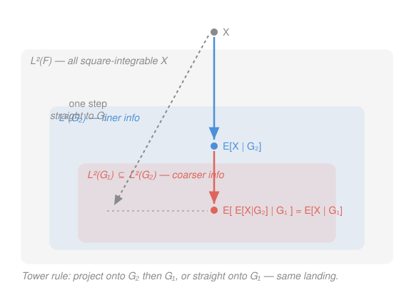

# Probability Theory · Lesson 5.2: Properties of conditional expectation

> ⏱ ~15 min · Module 5: Conditional expectation and martingales · Builds on: [5.1](05-01-conditional-expectation.md) · Unlocks: [5.3](05-03-martingales.md)

## Why this matters

In [5.1](05-01-conditional-expectation.md) you paid the full price for $\mathbb E[X\mid\mathcal G]$: an abstract existence theorem, Radon–Nikodym, an $L^2$ projection. That was a one-time cost. From now on you almost never return to the definition — you compute with a handful of rules: linearity, a law of total expectation, a nesting rule (the *tower*), and "pull out what you already know." These four are the daily tools, and they are exactly the machinery martingales run on in [5.3](05-03-martingales.md): a martingale is *defined* by a tower-like identity, and turning "convex function of a martingale" into a submartingale is one application of conditional Jensen. Learn the rulebook here; spend it for the rest of the module.

## The idea

Think of $\mathbb E[X\mid\mathcal G]$ as **your best forecast of $X$ once you're told everything in $\mathcal G$**. Four facts about forecasting are almost obvious once you say them out loud:

- **Averaging forecasts recovers the truth.** If you average your forecast over all possible information states, you get back the plain average $\mathbb E[X]$. (Law of total expectation.)
- **Forecasting a forecast collapses to the coarser one.** Suppose you'll first learn a lot ($\mathcal G_2$), then I ask: standing here with only a little information ($\mathcal G_1\subseteq\mathcal G_2$), what do you expect your future detailed forecast to be? Answer: exactly your *current* coarse forecast. The extra information you don't have yet averages out. (Tower property — **the coarser information always wins**.)
- **What you already know factors out.** If a quantity $Z$ is already determined by $\mathcal G$, then inside a $\mathcal G$-forecast it behaves like a constant and slides out front. (Pull-out.)
- **What you can't see averages to its mean.** If $X$ has nothing to do with $\mathcal G$, learning $\mathcal G$ tells you nothing, so your forecast is just $\mathbb E[X]$. (Independence drops out.)

Everything below is these four sentences made precise and proved. The single engine behind every proof is the **partial-averaging definition** from [5.1](05-01-conditional-expectation.md): $\mathbb E[X\mid\mathcal G]$ is the (a.s.-unique) $\mathcal G$-measurable random variable with

$$\int_A \mathbb E[X\mid\mathcal G]\,d\mathbb P \;=\; \int_A X\,d\mathbb P \qquad\text{for every } A\in\mathcal G. \tag{$\star$}$$

To prove "$W$ equals $\mathbb E[X\mid\mathcal G]$," you show two things: $W$ is $\mathcal G$-measurable, and $W$ satisfies $(\star)$. That's the whole game.

Throughout, $(\Omega,\mathcal F,\mathbb P)$ is a probability space, $\mathcal G\subseteq\mathcal F$ a sub-$\sigma$-algebra ("the information"), all variables are integrable ($\mathbb E|X|<\infty$), and every identity holds **almost surely** — $\mathbb E[X\mid\mathcal G]$ is an a.s.-equivalence class, so "$=$" always means "$=$ with probability $1$."

## The formal version

**1. Linearity.** For constants $a,b$,
$$\mathbb E[aX+bY\mid\mathcal G]=a\,\mathbb E[X\mid\mathcal G]+b\,\mathbb E[Y\mid\mathcal G].$$
*Proof.* The right side is $\mathcal G$-measurable (a combination of $\mathcal G$-measurable variables). For any $A\in\mathcal G$, using $(\star)$ for $X$ and for $Y$,
$$\int_A\big(a\,\mathbb E[X\mid\mathcal G]+b\,\mathbb E[Y\mid\mathcal G]\big)=a\!\int_A X+b\!\int_A Y=\int_A(aX+bY).$$
So the right side is $\mathcal G$-measurable and satisfies $(\star)$ for $aX+bY$; by a.s.-uniqueness it *is* $\mathbb E[aX+bY\mid\mathcal G]$. $\blacksquare$

**2. Positivity and monotonicity.** If $X\ge 0$ then $\mathbb E[X\mid\mathcal G]\ge 0$ a.s.; hence $X\le Y\Rightarrow\mathbb E[X\mid\mathcal G]\le\mathbb E[Y\mid\mathcal G]$.
*Proof.* Let $A=\{\mathbb E[X\mid\mathcal G]<0\}$, which lies in $\mathcal G$ (it's defined by a $\mathcal G$-measurable variable). By $(\star)$, $\int_A\mathbb E[X\mid\mathcal G]=\int_A X\ge 0$. But if $\mathbb P(A)>0$ the left integral is $<0$ — contradiction. So $\mathbb P(A)=0$. For monotonicity, apply this to $Y-X\ge 0$ and use linearity. $\blacksquare$

**3. Law of total expectation.** $\ \mathbb E\big[\mathbb E[X\mid\mathcal G]\big]=\mathbb E[X].$
*Proof.* Put $A=\Omega\in\mathcal G$ in $(\star)$: $\int_\Omega\mathbb E[X\mid\mathcal G]=\int_\Omega X$, which is the claim. $\blacksquare$
> In words: average your forecast over all information states and you recover the unconditional mean.

**4. Tower property.** If $\mathcal G_1\subseteq\mathcal G_2$ then
$$\mathbb E\big[\,\mathbb E[X\mid\mathcal G_2]\mid\mathcal G_1\big]=\mathbb E[X\mid\mathcal G_1].$$
*Proof.* The candidate on the right, $\mathbb E[X\mid\mathcal G_1]$, is $\mathcal G_1$-measurable. Check $(\star)$ for it against the *inner* variable $\mathbb E[X\mid\mathcal G_2]$: for $A\in\mathcal G_1$,
$$\int_A\mathbb E[X\mid\mathcal G_1]\overset{(\star)}{=}\int_A X, \qquad \int_A\mathbb E[X\mid\mathcal G_2]\overset{(\star)}{=}\int_A X,$$
where the second identity is legal because $A\in\mathcal G_1\subseteq\mathcal G_2$, so $A\in\mathcal G_2$. Both equal $\int_A X$, so $\int_A\mathbb E[X\mid\mathcal G_1]=\int_A\mathbb E[X\mid\mathcal G_2]$ for all $A\in\mathcal G_1$. Thus $\mathbb E[X\mid\mathcal G_1]$ is $\mathcal G_1$-measurable and satisfies $(\star)$ for the inner variable — it is that variable's conditional expectation given $\mathcal G_1$. $\blacksquare$
> In words: **the coarser $\sigma$-algebra wins.** Whichever order you nest them in the notation, the result conditions on the smaller one. (Total expectation, fact 3, is the case $\mathcal G_1=\{\emptyset,\Omega\}$.)

**5. Taking out what is known (pull-out).** If $Z$ is $\mathcal G$-measurable and $ZX$ is integrable,
$$\mathbb E[ZX\mid\mathcal G]=Z\,\mathbb E[X\mid\mathcal G].$$
*Proof (the standard machine).* The right side is $\mathcal G$-measurable. We verify $(\star)$, $\int_A Z\,\mathbb E[X\mid\mathcal G]=\int_A ZX$, building $Z$ up in stages.
- **$Z=\mathbf 1_B$ with $B\in\mathcal G$.** Then for $A\in\mathcal G$, $A\cap B\in\mathcal G$, so $\int_A \mathbf 1_B\,\mathbb E[X\mid\mathcal G]=\int_{A\cap B}\mathbb E[X\mid\mathcal G]\overset{(\star)}{=}\int_{A\cap B}X=\int_A\mathbf 1_B X.$ ✓
- **$Z=\sum_k c_k\mathbf 1_{B_k}$ simple, $B_k\in\mathcal G$.** Linearity of the integral extends the indicator case. ✓
- **$Z\ge 0$.** Pick simple $\mathcal G$-measurable $Z_n\uparrow Z$; both sides pass to the limit by the monotone convergence theorem. ✓
- **General $Z=Z^+-Z^-$.** Subtract the two nonnegative cases (integrability of $ZX$ keeps everything finite). $\blacksquare$
> In words: a factor you already know acts as a constant inside the forecast and comes straight out front.

**6. Independence and measurability (the two extremes).**
- If $X$ is **independent** of $\mathcal G$, then $\mathbb E[X\mid\mathcal G]=\mathbb E[X]$.
  *Proof.* The constant $\mathbb E[X]$ is $\mathcal G$-measurable. For $A\in\mathcal G$, $\mathbf 1_A$ is $\mathcal G$-measurable hence independent of $X$, so $\int_A X=\mathbb E[X\,\mathbf 1_A]=\mathbb E[X]\,\mathbb P(A)=\int_A\mathbb E[X]$. ✓ $\blacksquare$
- If $X$ is **$\mathcal G$-measurable**, then $\mathbb E[X\mid\mathcal G]=X$ (the best forecast of something you already see is itself — this is pull-out with $Z=X$, $X\!\to\!1$).

**7. Conditional Jensen.** For convex $\varphi:\mathbb R\to\mathbb R$ (with $\varphi(X)$ integrable),
$$\varphi\big(\mathbb E[X\mid\mathcal G]\big)\le\mathbb E\big[\varphi(X)\mid\mathcal G\big]\quad\text{a.s.}$$
*Idea.* A convex $\varphi$ is the supremum of the affine functions lying under it: $\varphi(x)=\sup_i(a_i x+b_i)$. For each such line, monotonicity + linearity give $a_i\,\mathbb E[X\mid\mathcal G]+b_i=\mathbb E[a_iX+b_i\mid\mathcal G]\le\mathbb E[\varphi(X)\mid\mathcal G]$; take the sup over $i$ on the left. This is the conditional twin of unconditional Jensen from [2.5](02-05-lp-spaces-inequalities.md), and it's the tool that turns $\varphi(\text{martingale})$ into a submartingale in [5.3](05-03-martingales.md).

## Picture

The tower property is a statement about **projections onto nested subspaces**. From the $L^2$ picture in [5.1](05-01-conditional-expectation.md), $\mathbb E[\cdot\mid\mathcal G]$ is orthogonal projection onto $L^2(\mathcal G)$, the $\mathcal G$-measurable variables. When $\mathcal G_1\subseteq\mathcal G_2$, we have nested subspaces $L^2(\mathcal G_1)\subseteq L^2(\mathcal G_2)\subseteq L^2(\mathcal F)$ — and projecting onto the big one and then the small one lands in the same place as projecting straight onto the small one.

## Worked examples

**Example 1 (mechanical — linearity + pull-out + independence, then total expectation).** Roll a fair die, $Y\in\{1,2,3,4,5,6\}$, and independently draw $X$ with $\mathbb E[X]=5$. Let $\mathcal G=\sigma(Y)$. Compute $\mathbb E[Y^2 X\mid\mathcal G]$ and then $\mathbb E[Y^2X]$.

$Y^2$ is $\sigma(Y)$-measurable, so it pulls out; $X$ is independent of $\mathcal G$, so its forecast is its mean:
$$\mathbb E[Y^2X\mid\mathcal G]=Y^2\,\mathbb E[X\mid\mathcal G]=Y^2\,\mathbb E[X]=5Y^2.$$
Now the law of total expectation collapses the $\mathcal G$ away: $\mathbb E[Y^2X]=\mathbb E[5Y^2]=5\cdot\frac{1^2+\cdots+6^2}{6}=5\cdot\frac{91}{6}=\frac{455}{6}\approx 75.8.$ Notice we never needed the distribution of $X$ beyond its mean.

**Example 2 (why you'd care — a random sum, Wald's identity in preview).** An insurer receives a random number $N$ of claims in a year, with $\mathbb E[N]=10$; each claim $X_i$ is i.i.d. with mean $\mu=\mathbb E[X_i]=2{,}000$ dollars, independent of $N$. What's the expected total payout $S=\sum_{i=1}^N X_i$?

Condition on $N$ — once $N$ is known, the sum has a fixed number of terms:
$$\mathbb E\Big[\textstyle\sum_{i=1}^N X_i\,\Big|\,N\Big]=\sum_{i=1}^N\mathbb E[X_i\mid N]=\sum_{i=1}^N\mathbb E[X_i]=N\mu,$$
using linearity (finitely many terms, with $N$ fixed inside the conditioning) and independence of each $X_i$ from $N$. Then the tower/total expectation finishes it:
$$\mathbb E[S]=\mathbb E\big[\mathbb E[S\mid N]\big]=\mathbb E[N\mu]=\mu\,\mathbb E[N]=2{,}000\cdot 10=20{,}000\text{ dollars}.$$
This is **Wald's identity** $\mathbb E[\sum_{i=1}^N X_i]=\mathbb E[N]\,\mathbb E[X_1]$ — the expected total is "expected count times expected size," and conditioning on $N$ is the entire trick.

## Watch out

- **The tower collapses to the *coarser* $\sigma$-algebra, not the last-written one.** Both $\mathbb E[\mathbb E[X\mid\mathcal G_2]\mid\mathcal G_1]$ and $\mathbb E[\mathbb E[X\mid\mathcal G_1]\mid\mathcal G_2]$ (with $\mathcal G_1\subseteq\mathcal G_2$) equal $\mathbb E[X\mid\mathcal G_1]$ — the *smaller* one. The second is immediate because $\mathbb E[X\mid\mathcal G_1]$ is already $\mathcal G_2$-measurable (fact 6). Order of nesting in the notation doesn't matter; the smaller information always wins.
- **Pull-out needs $Z$ to be $\mathcal G$-*measurable*, not independent.** These are opposite hypotheses. If $Z$ is $\mathcal G$-measurable it slides out as a factor: $\mathbb E[ZX\mid\mathcal G]=Z\,\mathbb E[X\mid\mathcal G]$. If instead $Z$ is *independent* of $\mathcal G$, it does **not** come out as $Z$ — you'd use fact 6 on the relevant piece. Confusing the two is the most common error in the whole module.
- **Conditional Jensen needs $\varphi$ *convex*, and the inequality points one way.** $\varphi(\mathbb E[X\mid\mathcal G])\le\mathbb E[\varphi(X)\mid\mathcal G]$. For concave $\varphi$ it flips. Forgetting convexity (or which side gets the outer $\varphi$) breaks the submartingale argument downstream.
- **Everything is almost sure.** Each identity above holds outside a $\mathbb P$-null set. You cannot evaluate $\mathbb E[X\mid\mathcal G]$ "at a point $\omega$" and expect the equations to hold there — only up to null sets. Chaining finitely many a.s. identities is fine (a finite union of null sets is null).

## One-liner

> Never touch the definition again: forecasts average back to the truth (total expectation), nest down to the coarser information (tower), release what you already know (pull-out), and forget what's independent — the four moves that run all of martingale theory.

## Problems

**P1 (🟢)** Let $W$ be independent of a random variable $Y$, with $\mathbb E[W]=2$, and set $\mathcal G=\sigma(Y)$. Compute, with one-line justification each: (a) $\mathbb E[W\mid\mathcal G]$; (b) $\mathbb E[WY\mid\mathcal G]$; (c) $\mathbb E[(3Y-W)\mid\mathcal G]$.

**P2 (🟡)** Roll a fair die to get $N\in\{1,\dots,6\}$, then flip $N$ fair coins; let $S$ be the number of heads. Using conditioning on $N$, find $\mathbb E[S]$. (Which two properties are you using, and where?)

**P3 (🔴, optional — law of total variance)** Define the *conditional variance* $\operatorname{Var}(X\mid\mathcal G):=\mathbb E[X^2\mid\mathcal G]-\big(\mathbb E[X\mid\mathcal G]\big)^2$.
(a) Use conditional Jensen to show $\operatorname{Var}(X\mid\mathcal G)\ge 0$ a.s.
(b) Prove the **law of total variance**
$$\operatorname{Var}(X)=\mathbb E\big[\operatorname{Var}(X\mid\mathcal G)\big]+\operatorname{Var}\big(\mathbb E[X\mid\mathcal G]\big).$$
(Hint: expand both right-hand terms and use the law of total expectation on $\mathbb E[X\mid\mathcal G]$.)

Solutions

**P1** (a) $W$ is independent of $\mathcal G=\sigma(Y)$, so by fact 6 the forecast is the mean: $\mathbb E[W\mid\mathcal G]=\mathbb E[W]=2$.
(b) $Y$ is $\sigma(Y)$-measurable, so it pulls out (fact 5), then (a): $\mathbb E[WY\mid\mathcal G]=Y\,\mathbb E[W\mid\mathcal G]=2Y$.
(c) Linearity, then: $3Y$ is $\mathcal G$-measurable so equals itself, and $\mathbb E[W\mid\mathcal G]=2$: $\mathbb E[3Y-W\mid\mathcal G]=3Y-2$.

**P2** Condition on $N$. Given $N=n$, $S$ is the number of heads in $n$ fair flips, so $\mathbb E[S\mid N]=\tfrac12 N$ (linearity: sum of $N$ indicator-flips each with mean $\tfrac12$; $N$ pulls out as a known count). Then the law of total expectation:
$$\mathbb E[S]=\mathbb E\big[\mathbb E[S\mid N]\big]=\mathbb E\big[\tfrac12 N\big]=\tfrac12\,\mathbb E[N]=\tfrac12\cdot\frac{1+2+\cdots+6}{6}=\tfrac12\cdot 3.5=1.75.$$
Two properties used: **pull-out/linearity** to get $\mathbb E[S\mid N]=\tfrac12N$, and **total expectation** (the $\mathcal G_1=\{\emptyset,\Omega\}$ tower) to remove the conditioning.

**P3** (a) Apply conditional Jensen (fact 7) with the convex $\varphi(x)=x^2$: $\big(\mathbb E[X\mid\mathcal G]\big)^2\le\mathbb E[X^2\mid\mathcal G]$ a.s. Rearranging is exactly $\operatorname{Var}(X\mid\mathcal G)\ge 0$ a.s. (A conditional variance is a genuine variance — of the conditional distribution — so of course it's nonnegative.)

(b) Take expectations of each right-hand term. Let $M:=\mathbb E[X\mid\mathcal G]$; by total expectation $\mathbb E[M]=\mathbb E[X]$.
$$\mathbb E\big[\operatorname{Var}(X\mid\mathcal G)\big]=\mathbb E\big[\mathbb E[X^2\mid\mathcal G]\big]-\mathbb E[M^2]=\mathbb E[X^2]-\mathbb E[M^2],$$
using total expectation on $\mathbb E[X^2\mid\mathcal G]$. And
$$\operatorname{Var}(M)=\mathbb E[M^2]-(\mathbb E[M])^2=\mathbb E[M^2]-(\mathbb E[X])^2.$$
Add them: the $\mathbb E[M^2]$ terms cancel, leaving $\mathbb E[X^2]-(\mathbb E[X])^2=\operatorname{Var}(X)$. $\blacksquare$
This decomposition — "unexplained variation (within groups) plus explained variation (between forecasts)" — is the probabilist's ANOVA, and reappears as the bias–variance split in statistics.

## Flashback

**From Lesson 5.1 (Conditional expectation — the discrete/partition case):** Roll a fair die and let $X$ be the number shown. Let $\mathcal G=\sigma(A)$ where $A=\{\text{the roll is even}\}$. Compute $\mathbb E[X\mid\mathcal G]$ explicitly, and verify the partial-averaging identity $(\star)$ on the event $A$.

Solution

$\mathcal G=\{\emptyset,A,A^c,\Omega\}$, where $A=\{2,4,6\}$ and $A^c=\{1,3,5\}$. A $\mathcal G$-measurable variable is constant on each block, and on a block that constant is the conditional average of $X$ there:
$$\mathbb E[X\mid\mathcal G]=\underbrace{\frac{2+4+6}{3}}_{4}\,\mathbf 1_A+\underbrace{\frac{1+3+5}{3}}_{3}\,\mathbf 1_{A^c}=4\,\mathbf 1_{\{\text{even}\}}+3\,\mathbf 1_{\{\text{odd}\}}.$$
Check $(\star)$ on $A$: the left side is $\int_A\mathbb E[X\mid\mathcal G]\,d\mathbb P=4\cdot\mathbb P(A)=4\cdot\tfrac12=2$; the right side is $\int_A X\,d\mathbb P=\mathbb E[X\mathbf 1_A]=\tfrac{2+4+6}{6}=2$. They agree. (Same check on $A^c$ gives $3\cdot\tfrac12=\tfrac{1+3+5}{6}=\tfrac32$.) The forecast is the block average — the finite-partition face of $\mathbb E[X\mid\mathcal G]$. $\blacksquare$

## Connections

- **Backward:** conditional Jensen (fact 7) is the conditional lift of the plain Jensen inequality from [2.5](02-05-lp-spaces-inequalities.md) — same supporting-line proof, now applied blockwise inside $\mathbb E[\cdot\mid\mathcal G]$. Total expectation is the case where $\mathcal G$ carries no information.
- **Forward:** these are the working tools of [5.3](05-03-martingales.md). A martingale is a process with $\mathbb E[X_{n+1}\mid\mathcal F_n]=X_n$; the tower gives it constant expectation ($\mathbb E[X_n]=\mathbb E[X_0]$, part of **Boss problem 5**), and conditional Jensen turns $\varphi(X_n)$ into a submartingale for convex $\varphi$. Pull-out is how you handle "predictable" factors in martingale transforms.
- **Sideways:** the random-sum computation (Example 2, Wald's identity) is the same conditioning move that prices aggregate insurance losses and compound-Poisson risk in mathematical finance; the law of total variance (P3) is the probabilist's ANOVA and the bias–variance decomposition underlying `prob-stat-refresher` and any regression course.
