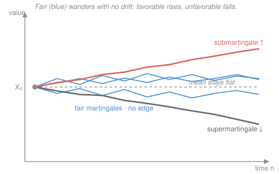

# Probability Theory · Lesson 5.3: Martingales

> ⏱ ~15 min · Module 5: Conditional expectation and martingales · Builds on: [5.2](05-02-conditional-expectation-properties.md) · Unlocks: [5.4 Stopping times and optional stopping](05-04-stopping-times-optional-stopping.md)

## Why this matters

A martingale is the mathematics of a **fair game**: a process whose best forecast of tomorrow, given everything you know today, is exactly today's value. No drift, no edge, nothing to exploit. That one sentence turns out to unify objects that look unrelated — a symmetric random walk, a product of likelihood ratios, and "a fixed random variable slowly revealed over time" are all the same kind of animal. It also earns the two crown theorems of the course: you cannot beat a fair game by any honest strategy (optional stopping, [5.4](05-04-stopping-times-optional-stopping.md)), and a fair game that stays bounded must eventually settle down (the convergence theorem, Lesson 5.5). Everything in Module 5 is built to make those two payoffs rigorous.

## The idea

Picture a gambler at a fair casino. After $n$ rounds her fortune is some number $X_n$. The game is *fair* if, whatever has happened so far, her expected fortune after the next round equals what she has right now — the house gives her no advantage and takes none. She might get lucky or unlucky, but the **conditional average** of her next fortune, given the entire history, is pinned to today's value.

That is the whole definition. A **martingale** models this fair game. Tilt the balance and you get its two cousins: a **submartingale** is a *favorable* game (expected to rise), a **supermartingale** an *unfavorable* one (expected to fall).

Two things have to be made precise before the sentence "given everything you know today" means anything. First, "everything you know by time $n$" — that is a $\sigma$-algebra $\mathcal F_n$, and as time passes you only *learn* more, never forget, so these grow: $\mathcal F_0\subseteq\mathcal F_1\subseteq\cdots$. That growing stack is a **filtration**. Second, "you actually know $X_n$ by time $n$" — the value must be determined by the information $\mathcal F_n$; a process with that property is **adapted**. With those two words in hand, "fair game" becomes a one-line equation.

## The formal version

Throughout, we work on a probability space $(\Omega,\mathcal F,\mathbb P)$ and index time by $n=0,1,2,\dots$.

**Filtration.** A **filtration** is an increasing sequence of sub-$\sigma$-algebras of $\mathcal F$,
$$\mathcal F_0\subseteq \mathcal F_1\subseteq \mathcal F_2\subseteq \cdots \subseteq \mathcal F.$$

> In words: $\mathcal F_n$ is the total information available by time $n$; you accumulate knowledge and never lose it.

**Adapted process.** A sequence of random variables $(X_n)_{n\ge 0}$ is **adapted** to $(\mathcal F_n)$ if each $X_n$ is $\mathcal F_n$-measurable.

> In words: by time $n$ you can read off the current value $X_n$ from what you already know — no peeking at the future required.

**Martingale.** An adapted process $(X_n)$ with $\mathbb E|X_n|<\infty$ for every $n$ (**integrable**) is a **martingale** with respect to $(\mathcal F_n)$ if
$$\mathbb E[X_{n+1}\mid \mathcal F_n] = X_n \qquad \text{for all } n\ge 0.$$
It is a **submartingale** if $\mathbb E[X_{n+1}\mid\mathcal F_n]\ge X_n$, and a **supermartingale** if $\mathbb E[X_{n+1}\mid\mathcal F_n]\le X_n$.

> In words: **martingale** = fair game (next-step forecast equals now); **sub**martingale = favorable (tends to rise); **super**martingale = unfavorable (tends to fall). Adaptedness and integrability are not fine print — without integrability the conditional expectation need not even exist, and without adaptedness the equation compares incomparable things.

**Constant expectation (the first consequence).** For a martingale, taking the total expectation of the defining equation and using the tower property from [5.2](05-02-conditional-expectation-properties.md),
$$\mathbb E[X_{n+1}] = \mathbb E\big[\mathbb E[X_{n+1}\mid\mathcal F_n]\big] = \mathbb E[X_n],$$
so by induction $\mathbb E[X_n]=\mathbb E[X_0]$ for every $n$. For a submartingale the middle step becomes $\ge$, giving $\mathbb E[X_0]\le \mathbb E[X_1]\le\cdots$ (the expectation climbs); for a supermartingale it falls.

> In words: a fair game has a flat expected-value line; a favorable one trends up, an unfavorable one trends down. This is exactly the flat, rising, and falling curves in the picture.

## Picture

The blue paths are fair martingales: individually they wander, but they carry no drift and their common expectation stays glued to the flat dashed line. The red path is a submartingale, pulled steadily upward; the grey path a supermartingale, sinking. Fairness is a statement about the *average* level, not about any single trajectory.

## Worked examples

**Example 1 (mechanical — the symmetric random walk is a martingale).** Let $\xi_1,\xi_2,\dots$ be independent with $\mathbb E[\xi_i]=0$ and $\mathbb E|\xi_i|<\infty$ (e.g. $\xi_i=\pm 1$ each with probability $\tfrac12$). Set $S_0=0$ and $S_n=\sum_{i=1}^n \xi_i$, and let $\mathcal F_n=\sigma(\xi_1,\dots,\xi_n)$ be the information from the first $n$ steps.

*Adapted and integrable:* $S_n$ is built from $\xi_1,\dots,\xi_n$, so it is $\mathcal F_n$-measurable, and $\mathbb E|S_n|\le\sum_{i\le n}\mathbb E|\xi_i|<\infty$. *Martingale property:* write $S_{n+1}=S_n+\xi_{n+1}$ and use linearity of conditional expectation together with two facts from [5.2](05-02-conditional-expectation-properties.md) — pull out the known $S_n$, and drop the conditioning on the independent $\xi_{n+1}$:
$$\mathbb E[S_{n+1}\mid\mathcal F_n]=\mathbb E[S_n\mid\mathcal F_n]+\mathbb E[\xi_{n+1}\mid\mathcal F_n]=S_n+\mathbb E[\xi_{n+1}]=S_n+0=S_n.$$
The mean-zero increments are precisely what makes the game fair. If instead $\mathbb E[\xi_i]=\mu>0$, the same computation gives $\mathbb E[S_{n+1}\mid\mathcal F_n]=S_n+\mu\ge S_n$: a submartingale, a walk with upward drift. (Compare the sums-of-independent-variables machinery in [3.4](03-04-sums-of-random-variables.md); a martingale is what you get when you strip the drift out.)

**Example 2 (why you'd care — three more canonical martingales).**

*(b) Products of independent mean-one positives.* Let $Y_1,Y_2,\dots$ be independent, $Y_i>0$, with $\mathbb E[Y_i]=1$, and set $M_n=\prod_{i=1}^n Y_i$ (with $M_0=1$), $\mathcal F_n=\sigma(Y_1,\dots,Y_n)$. Then $M_n$ is $\mathcal F_n$-measurable, and
$$\mathbb E[M_{n+1}\mid\mathcal F_n]=\mathbb E[M_n\,Y_{n+1}\mid\mathcal F_n]=M_n\,\mathbb E[Y_{n+1}\mid\mathcal F_n]=M_n\,\mathbb E[Y_{n+1}]=M_n,$$
pulling out the known $M_n$ and dropping the independent $Y_{n+1}$. Mean-one multiplicative increments are the fair game in *product* form.

*(c) The Doob–Lévy martingale — a revealed forecast.* Fix a single integrable random variable $X$ ($\mathbb E|X|<\infty$) and any filtration $(\mathcal F_n)$, and define
$$X_n=\mathbb E[X\mid\mathcal F_n].$$
This is adapted by construction, and integrable since $\mathbb E|X_n|\le\mathbb E|X|$ (conditional Jensen on $|\cdot|$). The martingale property is one line of the **tower property** ([5.2](05-02-conditional-expectation-properties.md)): because $\mathcal F_n\subseteq\mathcal F_{n+1}$, the smaller conditioning wins,
$$\mathbb E[X_{n+1}\mid\mathcal F_n]=\mathbb E\big[\mathbb E[X\mid\mathcal F_{n+1}]\,\big|\,\mathcal F_n\big]=\mathbb E[X\mid\mathcal F_n]=X_n.$$
Read it as a forecast of the fixed quantity $X$ that sharpens as information arrives — and a fair one, since today's forecast is the best guess of tomorrow's.

*(d) Likelihood ratios.* Suppose data $\xi_1,\xi_2,\dots$ are i.i.d. with true density $p$, but a rival hypothesis says the density is $q$. The accumulated **likelihood ratio** is $L_n=\prod_{i=1}^n \frac{q(\xi_i)}{p(\xi_i)}$. Each factor has mean (under the true $p$)
$$\mathbb E\!\left[\frac{q(\xi_i)}{p(\xi_i)}\right]=\int \frac{q(x)}{p(x)}\,p(x)\,dx=\int q(x)\,dx=1,$$
so $L_n$ is a product of independent mean-one positives — case (b) again, hence a martingale. This is the engine behind sequential hypothesis testing and change-of-measure arguments in statistics and finance.

**Convexity turns martingales into submartingales.** If $(X_n)$ is a martingale and $\varphi$ is convex with $\mathbb E|\varphi(X_n)|<\infty$, then $(\varphi(X_n))$ is a **submartingale**. Proof, in one step, is **conditional Jensen** from [5.2](05-02-conditional-expectation-properties.md):
$$\mathbb E[\varphi(X_{n+1})\mid\mathcal F_n]\;\ge\;\varphi\big(\mathbb E[X_{n+1}\mid\mathcal F_n]\big)=\varphi(X_n).$$
So $X_n^2$ (take $\varphi(x)=x^2$) and $|X_n|$ (take $\varphi(x)=|x|$) are submartingales whenever integrable. In particular $\mathbb E[X_n^2]$ is *nondecreasing* — the fact that powers Doob's maximal inequality and the $L^2$ convergence theorem in Lesson 5.5.

## Watch out

- You might think $\mathbb E[X_{n+1}]=\mathbb E[X_n]$ *is* the martingale property, but it is far weaker. The definition is **conditional**: $\mathbb E[X_{n+1}\mid\mathcal F_n]=X_n$ must hold path-by-path given the history, not just on average over all paths. A biased walk that happens to have $\mathbb E[X_n]$ constant by cancellation is still not a martingale. The conditional equation is what makes the game unbeatable.
- You might think a **super**martingale grows (the prefix sounds like "more"), but the sign convention is the opposite of the everyday word: **super**martingale ⇒ $\mathbb E[X_{n+1}\mid\mathcal F_n]\le X_n$ ⇒ tends to **decrease** (unfavorable). The mnemonic that survives: a supermartingale sits *above* where it is heading, so it must come down. Sub ⇒ up, super ⇒ down.
- You might think adaptedness and integrability are technicalities to skip. They are part of the definition: without $\mathbb E|X_n|<\infty$ the conditional expectation may not exist, and a non-adapted "process" can't be compared to $\mathcal F_n$-information at all. Always check all three: adapted, integrable, and the (in)equality.
- You might think "fair game" is a loose analogy. It is exact: no non-anticipating betting strategy can turn a martingale into a favorable game — the formal statement, via stopping times, is the optional stopping theorem you meet next in [5.4](05-04-stopping-times-optional-stopping.md).

## One-liner

> A martingale is a fair game — tomorrow's conditional forecast equals today's value — so its expectation never drifts, and that single property earns optional stopping and convergence.

## Problems

**P1 (🟢)** Let $\xi_1,\xi_2,\dots$ be i.i.d. with $\mathbb P(\xi_i=1)=\mathbb P(\xi_i=-1)=\tfrac12$, $S_n=\sum_{i\le n}\xi_i$, $\mathcal F_n=\sigma(\xi_1,\dots,\xi_n)$. Show that $M_n=S_n^2-n$ is a martingale. (Hint: expand $S_{n+1}^2=(S_n+\xi_{n+1})^2$ and condition on $\mathcal F_n$.)

**P2 (🟡)** Let $(X_n)$ be a supermartingale with $X_n\ge 0$ for all $n$. Prove that $\mathbb E[X_n]\le\mathbb E[X_0]$ for every $n$, and explain in one sentence why this already hints that a nonnegative supermartingale "can't run away upward." Then state whether $(-X_n)$ is a sub- or supermartingale.

**P3 (🔴, optional)** A gambler bets on a fair coin, doubling her stake after every loss (the martingale betting system): she wagers $1$, then $2$, then $4$, …, quitting the instant she first wins. Let $W_n$ be her net wealth after $n$ rounds (start $W_0=0$), with $\mathcal F_n$ the coin history. (a) Argue $W_n$ is a martingale before she stops. (b) She is *certain* to win eventually and walk away exactly $+1$ ahead. Reconcile this with constant expectation $\mathbb E[W_n]=0$: which hypothesis of "you can't beat a fair game" is she quietly violating? (This is the cliffhanger optional stopping resolves in [5.4](05-04-stopping-times-optional-stopping.md).)

Solutions

**P1** Adapted: $M_n=S_n^2-n$ is a function of $\xi_1,\dots,\xi_n$, so $\mathcal F_n$-measurable; integrable since $|S_n|\le n$ makes $M_n$ bounded. Now expand and condition, using that $S_n$ is $\mathcal F_n$-measurable (pull out) and $\xi_{n+1}$ is independent of $\mathcal F_n$ (drop the conditioning):
$$\mathbb E[S_{n+1}^2\mid\mathcal F_n]=\mathbb E[(S_n+\xi_{n+1})^2\mid\mathcal F_n]=S_n^2+2S_n\,\mathbb E[\xi_{n+1}]+\mathbb E[\xi_{n+1}^2].$$
Here $\mathbb E[\xi_{n+1}]=0$ and $\mathbb E[\xi_{n+1}^2]=1$, so $\mathbb E[S_{n+1}^2\mid\mathcal F_n]=S_n^2+1$. Therefore
$$\mathbb E[M_{n+1}\mid\mathcal F_n]=\mathbb E[S_{n+1}^2\mid\mathcal F_n]-(n+1)=(S_n^2+1)-(n+1)=S_n^2-n=M_n.$$
So $(M_n)$ is a martingale. (It is the "compensated" square: $S_n^2$ alone is a submartingale by convexity — its expectation $n$ rises — and subtracting $n$ removes exactly the drift.)

**P2** By the defining inequality and the tower property, for each $n$,
$$\mathbb E[X_{n+1}]=\mathbb E\big[\mathbb E[X_{n+1}\mid\mathcal F_n]\big]\le \mathbb E[X_n].$$
Chaining from $0$ gives $\mathbb E[X_n]\le\mathbb E[X_{n-1}]\le\cdots\le\mathbb E[X_0]$. Since $X_n\ge 0$, its expectation is a nonincreasing sequence bounded below by $0$, hence it cannot blow up — the total "mass" only leaks away, never accumulates, which is the first whisper of the martingale convergence theorem (Lesson 5.5). Finally, negating flips every inequality: $\mathbb E[-X_{n+1}\mid\mathcal F_n]=-\mathbb E[X_{n+1}\mid\mathcal F_n]\ge -X_n$, so $(-X_n)$ is a **sub**martingale.

**P3** (a) In any single round before she has won, the fair coin adds a mean-zero increment to her wealth: if her stake this round is $b$ (an $\mathcal F_n$-measurable quantity, fixed by the losing history), then $W_{n+1}=W_n\pm b$ with equal probability, so $\mathbb E[W_{n+1}\mid\mathcal F_n]=W_n+b\cdot\tfrac12-b\cdot\tfrac12=W_n$. Fair game, martingale. Constant expectation gives $\mathbb E[W_n]=W_0=0$ for every fixed $n$.

(b) The trick "wins" because she stops at a **random** time $\tau$ — the first win — not a fixed time $n$. Constant expectation holds at every deterministic $n$, but says nothing about $W_\tau$ unless $\tau$ is a well-behaved stopping time with a boundedness/integrability control. Here it is not: reaching the guaranteed $+1$ requires being able to lose $1+2+4+\cdots$ arbitrarily long, i.e. **unbounded stake and unbounded borrowing**. The hidden violated hypothesis is exactly the integrability/boundedness condition of the optional stopping theorem — $W_\tau$ exists but $\mathbb E[W_\tau]=1\neq 0=\mathbb E[W_0]$ precisely because $\sup_n|W_n|$ is unbounded and $\mathbb E[\tau\cdot(\text{stake})]$ diverges. A fair game is unbeatable only against strategies with honest resource limits; [5.4](05-04-stopping-times-optional-stopping.md) makes the limit precise.

## Flashback

**From Lesson 5.2 (Properties of conditional expectation):** Let $X,Y$ be random variables with $\mathcal G=\sigma(Y)$, where $Y$ is discrete. Suppose $X=Y\cdot Z$ with $Z$ independent of $Y$ and $\mathbb E[Z]=3$, and $\mathbb E|X|<\infty$. Compute $\mathbb E[X\mid\mathcal G]$, and then use the tower property to find $\mathbb E[X]$ in terms of $\mathbb E[Y]$.

Solution

$Y$ is $\mathcal G$-measurable, so it **pulls out** of the conditional expectation; $Z$ is independent of $Y$, hence independent of $\mathcal G=\sigma(Y)$, so conditioning on $\mathcal G$ **drops out** and leaves its plain mean:
$$\mathbb E[X\mid\mathcal G]=\mathbb E[Y Z\mid\mathcal G]=Y\,\mathbb E[Z\mid\mathcal G]=Y\,\mathbb E[Z]=3Y.$$
Now the **tower property** collapses the outer conditioning to the ordinary expectation:
$$\mathbb E[X]=\mathbb E\big[\mathbb E[X\mid\mathcal G]\big]=\mathbb E[3Y]=3\,\mathbb E[Y].$$
(Sanity check by independence directly: $\mathbb E[YZ]=\mathbb E[Y]\mathbb E[Z]=3\,\mathbb E[Y]$. ✓ — the "pull out what is known, drop what is independent" pair is exactly the move that verifies every product-form martingale above.)

## Connections

- **Backward:** the martingale property *is* [5.2](05-02-conditional-expectation-properties.md) put in motion — every verification above is one application of the tower and pull-out properties, and "constant expectation" is the tower property watched over time. The mean-zero-increment walk is the drift-free version of the sums in [3.4](03-04-sums-of-random-variables.md).
- **Forward:** [5.4](05-04-stopping-times-optional-stopping.md) freezes a martingale at a random **stopping time** and proves optional stopping (P3's cliffhanger, and gambler's ruin); the convexity fact ($X_n^2$, $|X_n|$ submartingales) feeds Doob's inequalities and the martingale convergence theorem in Lesson 5.5.
- **Sideways:** the likelihood-ratio martingale (d) is the backbone of sequential testing in econometrics and of change-of-measure pricing in mathematical finance; the Doob–Lévy "revealed forecast" (c) is how a fixed payoff's fair value updates as information arrives, the discrete shadow of the Brownian martingales named as this course's sequel.
