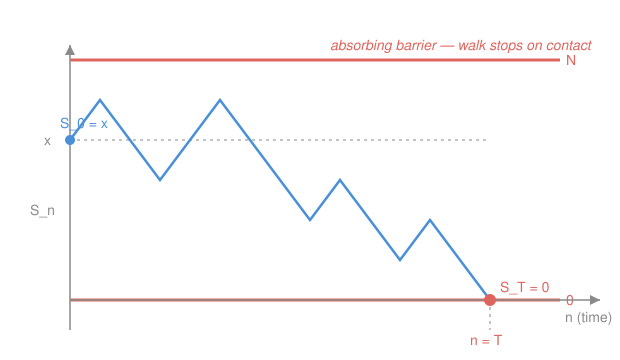

# Probability Theory · Lesson 5.4: Stopping times and optional stopping

> ⏱ ~15 min · Module 5: Conditional expectation and martingales · Builds on: [5.3](05-03-martingales.md) · Unlocks: [5.5](05-05-martingale-convergence.md)

## Why this matters

A martingale is a fair game: on average you neither gain nor lose (that's [5.3](05-03-martingales.md)'s $\mathbb E[X_n]=\mathbb E[X_0]$). But real gamblers don't play a fixed number of rounds — they quit when they're up, or when they're broke, or the first time they hit some target. Does a clever *quitting rule* let you beat a fair game? The optional stopping theorem answers: **no, as long as your rule can't see the future** — and turns that "no" into a computational hammer that cracks gambler's ruin, expected hitting times, and a dozen random-walk problems in two lines each. It's the single most useful theorem about martingales.

## The idea

Picture a fair coin-flip game, your fortune wandering up and down with no drift. You're allowed to walk away at any moment — but you must decide *now*, using only what you've seen so far, whether this is the moment. You may say "I quit the first time I'm up 100 dollars." You may **not** say "I quit at the moment right before my worst dip" — that requires knowing the future.

A quitting rule that uses only the past is a **stopping time**. The theorem's promise: for any such rule (with a mild safety condition), your *expected* fortune at the moment you quit equals your starting fortune. The fairness of the game survives your strategy. You can't manufacture an edge out of *timing* alone.

Why the safety condition? Because there's a famous cheat — keep doubling your bet until you win once, then stop — that seems to guarantee a profit on a fair game. It doesn't beat fairness; it just needs *unbounded* capital and *unbounded* time, and that's exactly the loophole the hypotheses close. Fair timing is powerless; the appearance of a free lunch always hides an infinite resource.

## The formal version

Fix a filtration $(\mathcal F_n)_{n\ge0}$ — the information available by time $n$ ([5.3](05-03-martingales.md)) — on a probability space $(\Omega,\mathcal F,\mathbb P)$.

**Stopping time.** A random time $T:\Omega\to\{0,1,2,\dots\}\cup\{\infty\}$ is a **stopping time** if

$$\{T\le n\}\in\mathcal F_n \quad\text{for every } n,\qquad\text{equivalently}\qquad \{T=n\}\in\mathcal F_n \text{ for every } n.$$

> In words: by time $n$ you can already tell whether you've stopped. The decision "stop now" uses only information up to now — no clairvoyance.

The two forms are equivalent because $\{T=n\}=\{T\le n\}\setminus\{T\le n-1\}$ and $\{T\le n\}=\bigcup_{k\le n}\{T=k\}$, all inside $\mathcal F_n$.

*Examples.* The **first hitting time** of a level $a$, $\ T_a=\inf\{n\ge0: X_n=a\}$, is a stopping time: $\{T_a=n\}=\{X_0\ne a,\dots,X_{n-1}\ne a,\ X_n=a\}$ depends only on $X_0,\dots,X_n$, hence lies in $\mathcal F_n$. But "**the time the process hits its maximum** over $0\le n\le N$" is **not** a stopping time — to know that today is the peak you must know every future value up to $N$. That is precisely the clairvoyance the definition forbids.

**Stopped process.** For a stopping time $T$, define the process frozen at $T$: $\ X_{T\wedge n}$, where $a\wedge b=\min(a,b)$. So it runs as $X_n$ until time $T$, then holds the value $X_T$ forever.

> In words: play the martingale, but the instant your rule says stop, sit on your final fortune.

**Theorem (a stopped martingale is a martingale).** If $(X_n)$ is a martingale and $T$ a stopping time, then $(X_{T\wedge n})_{n\ge0}$ is a martingale. In particular

$$\mathbb E[X_{T\wedge n}]=\mathbb E[X_0]\qquad\text{for every finite } n.$$

*Why.* Write $X_{T\wedge n}$ as a running sum of increments switched off after $T$:
$$X_{T\wedge n}=X_0+\sum_{k=1}^{n}\mathbf 1_{\{T\ge k\}}\,(X_k-X_{k-1}).$$
The switch $\mathbf 1_{\{T\ge k\}}=1-\mathbf 1_{\{T\le k-1\}}$ is $\mathcal F_{k-1}$-measurable — it's decided *before* the $k$th increment. So, conditioning on $\mathcal F_{k-1}$ and using the martingale property $\mathbb E[X_k-X_{k-1}\mid\mathcal F_{k-1}]=0$, each new term has conditional mean $0$. Hence $\mathbb E[X_{T\wedge n}\mid\mathcal F_{n-1}]=X_{T\wedge(n-1)}$: a martingale. Taking expectations gives the constant-mean claim. (This is the honest "no timing strategy beats a fair game": $\mathbf 1_{\{T\ge k\}}$ is a *predictable* betting rule, and betting on a martingale keeps it a martingale.) $\blacksquare$

**The catch.** We want $\mathbb E[X_T]=\mathbb E[X_0]$, but the theorem only gives $\mathbb E[X_{T\wedge n}]=\mathbb E[X_0]$. If $T<\infty$ almost surely then $X_{T\wedge n}\to X_T$ pointwise — but *pointwise* convergence does **not** force $\mathbb E[X_{T\wedge n}]\to\mathbb E[X_T]$. We need a hypothesis to swap the limit and the expectation (the convergence theorems of [2.4](02-04-convergence-theorems.md) are exactly this machinery). That is the whole content of the next theorem.

**Optional Stopping Theorem.** Let $(X_n)$ be a martingale and $T$ a stopping time. Then
$$\boxed{\ \mathbb E[X_T]=\mathbb E[X_0]\ }$$
provided **any one** of the following holds:

- **(i) Bounded time.** $T\le N$ for some constant $N$.
- **(ii) Bounded/dominated stopped process.** $T<\infty$ a.s. **and** the stopped process is uniformly bounded, $|X_{T\wedge n}|\le M$ for all $n$ (more generally, dominated by an integrable variable).
- **(iii) Bounded increments and integrable time.** $\mathbb E[T]<\infty$ **and** the increments are bounded, $|X_{n}-X_{n-1}|\le c$ for all $n$.

> In words: the fair game stays fair at your quitting time — *as long as* the game can't run away on you. Each clause is one honest way to guarantee $X_{T\wedge n}\to X_T$ in expectation: (i) there's no limit to take; (ii) bounded convergence; (iii) dominated convergence with dominator $|X_0|+cT$.

**These hypotheses are essential** — with none of them the conclusion is simply false (see Watch out). For a supermartingale ("unfavorable game," $\mathbb E[X_n\mid\mathcal F_{n-1}]\le X_{n-1}$) the same hypotheses give the inequality $\mathbb E[X_T]\le\mathbb E[X_0]$.

## Picture

## Worked examples

### Example 1 (mechanical — is it a stopping time?)

Let $S_n$ be a random walk. Which of these are stopping times for $(\mathcal F_n)=(\sigma(S_0,\dots,S_n))$?

1. $T=\inf\{n: S_n\ge 10\}$ — **yes.** $\{T=n\}=\{S_0<10,\dots,S_{n-1}<10,\ S_n\ge10\}\in\mathcal F_n$.
2. $T=\inf\{n:S_n\ge10\}-1$ (the step *before* first crossing) — **no.** Knowing you're one step before the crossing requires seeing $S_{n+1}$; $\{T=n\}$ needs $\mathcal F_{n+1}$.
3. $T=$ the time index of the largest value among $S_0,\dots,S_{100}$ — **no.** Declaring today the record requires knowing all values through time $100$.

The pattern: a rule is a stopping time iff you could implement it *live*, with a stop button and no rewind.

### Example 2 (why you'd care — Wald's identity in one line)

Let $\xi_1,\xi_2,\dots$ be i.i.d. with mean $\mu=\mathbb E[\xi_i]$, and $S_n=\xi_1+\cdots+\xi_n$. Then $M_n=S_n-n\mu$ is a martingale ([5.3](05-03-martingales.md)). If $T$ is a stopping time with $\mathbb E[T]<\infty$ and the $\xi_i$ are bounded, hypothesis (iii) applies to $M_n$ (increments $|\xi_n-\mu|$ are bounded), so $\mathbb E[M_T]=\mathbb E[M_0]=0$, i.e.

$$\mathbb E[S_T]=\mu\,\mathbb E[T]\qquad(\textbf{Wald's identity}).$$

> In words: the expected total of a random number of i.i.d. draws is the mean per draw times the expected number of draws — *provided* the stopping rule doesn't peek. It's optional stopping wearing a work uniform: expected sample sizes in sequential statistics, expected total claims in insurance, and — next — expected duration of gambler's ruin.

### The main event — Gambler's Ruin (fully worked)

Two players; you start with $x$ dollars, your opponent with $N-x$, so $0\le x\le N$. Each round a fair coin moves one dollar. Your fortune is the **symmetric $\pm1$ random walk** $S_n$, $S_0=x$, with i.i.d. steps $\xi_i=\pm1$ each with probability $\tfrac12$. Play stops at

$$T=\inf\{n: S_n=0 \text{ or } S_n=N\}\quad(\text{ruin or victory}).$$

**Setup fact ($T<\infty$ a.s. and $\mathbb E[T]<\infty$).** From any interior point there is a fixed-length run of $N$ up-steps (probability $\ge 2^{-N}$) that reaches a barrier. Chopping time into blocks of length $N$, the walk fails to be absorbed in a block with probability $\le 1-2^{-N}<1$ each time, independently, so $\mathbb P(T> kN)\le(1-2^{-N})^k\to0$. Geometric-type tails give $T<\infty$ a.s. **and** $\mathbb E[T]<\infty$. Good — we'll need both.

**Exit probability — use the martingale $S_n$.** The walk itself is a martingale (mean-zero steps). The stopped walk stays in $[0,N]$, so $|S_{T\wedge n}|\le N$: hypothesis **(ii)** applies (bounded stopped process, $T<\infty$ a.s.). Optional stopping:

$$\mathbb E[S_T]=\mathbb E[S_0]=x.$$

But $S_T\in\{0,N\}$, so $S_T=N\cdot\mathbf 1_{\{S_T=N\}}$ and $\mathbb E[S_T]=N\,\mathbb P(S_T=N)$. Let $p=\mathbb P(S_T=N)$ (you win). Then $Np=x$, so

$$\boxed{\ \mathbb P(S_T=N)=\frac{x}{N},\qquad \mathbb P(S_T=0)=1-\frac{x}{N}=\frac{N-x}{N}.\ }$$

Your chance of victory is just your share of the total stake — beautifully fair. (Start with 1 dollar against a 99-dollar opponent: you win with probability $1/100$.)

**Expected duration — use the martingale $S_n^2-n$.** Since the steps are $\pm1$ with variance $1$, the process $M_n=S_n^2-n$ is a martingale: $\ \mathbb E[S_{n}^2\mid\mathcal F_{n-1}]=\mathbb E[(S_{n-1}+\xi_n)^2\mid\mathcal F_{n-1}]=S_{n-1}^2+2S_{n-1}\underbrace{\mathbb E[\xi_n]}_{0}+\underbrace{\mathbb E[\xi_n^2]}_{1}=S_{n-1}^2+1$, so $\mathbb E[M_n\mid\mathcal F_{n-1}]=M_{n-1}$.

Which hypothesis? Apply the stopped-martingale identity at finite $n$: $\ \mathbb E[S_{T\wedge n}^2]-\mathbb E[T\wedge n]=\mathbb E[M_0]=x^2.$ Now let $n\to\infty$. On the left, $0\le S_{T\wedge n}^2\le N^2$ is bounded, so bounded convergence gives $\mathbb E[S_{T\wedge n}^2]\to\mathbb E[S_T^2]$; and $T\wedge n\uparrow T$ with $\mathbb E[T]<\infty$, so monotone convergence gives $\mathbb E[T\wedge n]\to\mathbb E[T]$. (This is exactly hypothesis **(iii)** in action: bounded increments plus $\mathbb E[T]<\infty$.) Hence

$$\mathbb E[S_T^2]-\mathbb E[T]=x^2\ \Longrightarrow\ \mathbb E[T]=\mathbb E[S_T^2]-x^2.$$

Compute $\mathbb E[S_T^2]$ from the exit probabilities: $S_T^2$ is $N^2$ with prob $x/N$ and $0$ with prob $(N-x)/N$, so $\mathbb E[S_T^2]=N^2\cdot\frac xN=Nx$. Therefore

$$\boxed{\ \mathbb E[T]=Nx-x^2=x(N-x).\ }$$

The 1-vs-99 game lasts, on average, $1\cdot99=99$ rounds; the even 50-50 split lasts $50\cdot50=2500$. Two martingales, four lines, both crown facts of gambler's ruin — that's the power of optional stopping.

## Watch out

- **You might think any quitting rule is a stopping time, but a rule that peeks ahead is not.** "Sell at the maximum over the next year" or "quit the step before I'd have busted" both need future information; $\{T\le n\}\notin\mathcal F_n$. Only rules you could execute *live* qualify.
- **You might think $\mathbb E[X_T]=\mathbb E[X_0]$ always holds because a stopped martingale is a martingale, but it needs a hypothesis and is FALSE in general.** The stopped process gives you $\mathbb E[X_{T\wedge n}]=\mathbb E[X_0]$ for finite $n$ *for free*; the equality at $T$ requires justifying the limit $n\to\infty$ (one of (i)–(iii)). Skipping that step is the classic error. **The doubling / "quit when ahead" strategy** is the standing counterexample: bet 1, and each loss double your next bet; stop at your first win. On a fair game each round is a martingale, and $T<\infty$ a.s. (you win eventually), with $X_T=+1>0=X_0$, so $\mathbb E[X_T]=1\ne0=\mathbb E[X_0]$. Optional stopping *fails* — because $T$ is unbounded and the stopped fortune is not uniformly integrable: a loss streak of length $k$ has you down $2^k-1$, so the "guaranteed" profit is bankrolled by unbounded capital. No hypothesis holds, and the theorem rightly does not apply.
- **You might think a stopping time is automatically finite, but $T=\infty$ can have positive probability.** A hitting time of a level a walk may never reach (e.g. hitting $+1$ for a walk with downward drift) can be infinite. Hypotheses (ii) and (iii) explicitly demand $T<\infty$ a.s. (or $\mathbb E[T]<\infty$, which forces it) before you may write $X_T$ at all.

## One-liner

> A fair game stays fair at any non-clairvoyant quitting time — $\mathbb E[X_T]=\mathbb E[X_0]$ — but only when the game can't run away (bounded $T$, bounded stopped process, or $\mathbb E[T]<\infty$ with bounded steps); the doubling scheme is what the hypotheses forbid.

## Problems

**P1 (🟢)** Let $S_n$ be the symmetric $\pm1$ random walk with $S_0=0$, and $T=\inf\{n:S_n=3 \text{ or } S_n=-5\}$. Using the exit-probability result, find $\mathbb P(S_T=3)$ and $\mathbb E[T]$. (Hint: shift so both barriers are nonnegative.)

**P2 (🟡)** A biased walk: steps $\xi_i=+1$ with probability $p\ne\tfrac12$ and $-1$ with probability $q=1-p$, starting at $x\in\{0,\dots,N\}$, absorbed at $0$ or $N$. The plain walk is *not* a martingale now. Show that $Y_n=(q/p)^{S_n}$ **is** a martingale, and use optional stopping to find the ruin probability $\mathbb P(S_T=0)$. (This is Boss problem 5's biased cousin.)

**P3 (🔴, optional)** In the symmetric gambler's-ruin setup ($S_0=x$, barriers $0,N$), let $p=x/N$ be your win probability. Explain why the doubling-strategy paradox from Watch out does **not** contradict $\mathbb E[S_T]=x$ here — i.e., what is different about *this* $T$ that makes optional stopping legitimately apply, and what would break if you removed the upper barrier $N$ (playing against an infinitely rich house, target $+1$)?

Solutions

**P1** Shift coordinates by $+5$: let $S_n'=S_n+5$, so $S_0'=5$ and the barriers $-5,3$ become $0,8$. This is standard gambler's ruin with $x=5$, $N=8$. The upper barrier $S_n'=8$ is the original $S_n=3$, so

$$\mathbb P(S_T=3)=\mathbb P(S_T'=8)=\frac{x}{N}=\frac{5}{8}.$$

Duration is shift-invariant (it's the same walk, relabeled), so $\mathbb E[T]=x(N-x)=5\cdot3=15$. (Sanity check on the exit probability: $\mathbb P(S_T=-5)=3/8$, and $\mathbb E[S_T]=3\cdot\tfrac58+(-5)\cdot\tfrac38=\tfrac{15-15}{8}=0=S_0$. ✓)

**P2** *Martingale check.* With $r=q/p$,
$$\mathbb E[Y_n\mid\mathcal F_{n-1}]=\mathbb E\big[r^{S_{n-1}+\xi_n}\mid\mathcal F_{n-1}\big]=r^{S_{n-1}}\mathbb E[r^{\xi_n}]=r^{S_{n-1}}\big(p\,r^{+1}+q\,r^{-1}\big).$$
Now $p\,r+q\,r^{-1}=p\cdot\frac qp+q\cdot\frac pq=q+p=1$. So $\mathbb E[Y_n\mid\mathcal F_{n-1}]=r^{S_{n-1}}=Y_{n-1}$: a martingale. ✓ (As with the symmetric case, $T<\infty$ a.s. and the stopped process $Y_{T\wedge n}$ is bounded — $S$ stays in $[0,N]$ so $Y$ lies between $r^0$ and $r^N$ — so hypothesis (ii) applies.)

*Optional stopping.* $\mathbb E[Y_T]=Y_0=r^{x}$. And $Y_T$ takes value $r^0=1$ (if $S_T=0$) or $r^N$ (if $S_T=N$). Let $u=\mathbb P(S_T=0)$. Then $u\cdot1+(1-u)\,r^{N}=r^{x}$, so

$$\mathbb P(S_T=0)=u=\frac{r^{N}-r^{x}}{r^{N}-1}=\frac{(q/p)^{N}-(q/p)^{x}}{(q/p)^{N}-1}.$$

(Check the symmetric limit $r\to1$: L'Hôpital in $r$ gives $u\to\frac{N-x}{N}$, matching the fair-game answer. ✓)

**P3** In symmetric gambler's ruin $T$ is the exit time of the *bounded* strip $[0,N]$, and the stopped walk satisfies $|S_{T\wedge n}|\le N$ — hypothesis (ii) holds outright, so $\mathbb E[S_T]=x$ is legitimate. The doubling paradox needs an *unbounded* stopped process; here the barriers cap it, so there is no paradox. If you delete the upper barrier and play for target $+1$ against an infinitely rich house, the walk is now confined only below (there's no $N$), $S_{T\wedge n}$ is **not** bounded above, and although $T<\infty$ a.s. (a symmetric walk hits $+1$ eventually — it is recurrent), $\mathbb E[T]=\infty$ and *none* of (i)–(iii) hold. Optional stopping fails exactly as in the doubling scheme: you'd conclude $\mathbb E[S_T]=1\ne0=x$. The finite upper barrier is doing all the work.

## Flashback

**From Lesson 5.3 (Martingales):** Let $\xi_1,\xi_2,\dots$ be i.i.d. with $\mathbb E[\xi_i]=0$ and $\operatorname{Var}(\xi_i)=\sigma^2<\infty$, and set $S_n=\xi_1+\cdots+\xi_n$ with $S_0=0$. Show that $M_n=S_n^2-n\sigma^2$ is a martingale with respect to $\mathcal F_n=\sigma(\xi_1,\dots,\xi_n)$, and confirm $\mathbb E[M_n]=\mathbb E[M_0]$.

Solution

$M_n$ is $\mathcal F_n$-measurable and integrable ($\mathbb E|M_n|\le\mathbb E[S_n^2]+n\sigma^2=2n\sigma^2<\infty$). For the martingale property, write $S_n=S_{n-1}+\xi_n$ with $\xi_n$ independent of $\mathcal F_{n-1}$:

$$\mathbb E[S_n^2\mid\mathcal F_{n-1}]=\mathbb E[(S_{n-1}+\xi_n)^2\mid\mathcal F_{n-1}]=S_{n-1}^2+2S_{n-1}\underbrace{\mathbb E[\xi_n]}_{0}+\underbrace{\mathbb E[\xi_n^2]}_{\sigma^2}=S_{n-1}^2+\sigma^2,$$

using that $S_{n-1}$ is $\mathcal F_{n-1}$-measurable (pull it out) and $\xi_n\perp\mathcal F_{n-1}$. Therefore

$$\mathbb E[M_n\mid\mathcal F_{n-1}]=\mathbb E[S_n^2\mid\mathcal F_{n-1}]-n\sigma^2=S_{n-1}^2+\sigma^2-n\sigma^2=S_{n-1}^2-(n-1)\sigma^2=M_{n-1}.$$

A martingale. Taking expectations (or by the constant-mean property [5.3]): $\mathbb E[M_n]=\mathbb E[M_0]=\mathbb E[S_0^2]-0=0$ for all $n$. This is exactly the martingale that measures duration in gambler's ruin, with $\sigma^2=1$. $\blacksquare$

## Connections

- **Backward:** this is [5.3](05-03-martingales.md)'s fairness ($\mathbb E[X_n]=\mathbb E[X_0]$) extended from *fixed* times to *random* non-clairvoyant times. The limit-swap that upgrades $\mathbb E[X_{T\wedge n}]$ to $\mathbb E[X_T]$ is monotone/bounded/dominated convergence from [2.4](02-04-convergence-theorems.md) — the same theorems, now earning their keep.
- **Forward:** [5.5](05-05-martingale-convergence.md) pushes "stopped martingales behave" all the way to "bounded martingales *converge*" via the upcrossing inequality, which counts crossings using stopping times exactly like $T$ here.
- **Sideways:** Wald's identity (Example 2) is the engine of **sequential analysis** in statistics (expected sample size of a test) and of ruin theory in `actuarial`/insurance; gambler's ruin exit probabilities are the discrete skeleton of hitting probabilities for Brownian motion, the sequel this course names but doesn't build.
