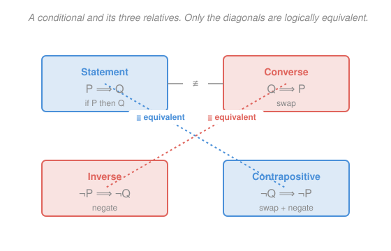

# How to Read & Write Proofs · Lesson 1.1: Statements, connectives, and implication

> ⏱ ~15 min · Module 1: The language of mathematics · Builds on: (course start) · Unlocks: 1.2 (quantifiers and negation)

## Why this matters

Every theorem you'll ever read is a compound of a few tiny words — *and*, *or*, *not*, *if…then* — and almost every beginner's mistake in a proof is a slip in one of them. Prove the converse instead of the claim, or read "or" as exclusive, and your argument is dead on arrival no matter how clean the algebra. This lesson pins down exactly what those words assert, so that later — when you negate an ε–δ statement or split a proof into cases — you're manipulating the logic on purpose, not by feel.

## The idea

A **proposition** is any sentence that is definitely true or definitely false — no middle, no "depends." "$7$ is prime" is a proposition (true). "$x > 3$" is *not*, until you say what $x$ is; and "this sentence is exciting" never is. Mathematics is built only from propositions, because a proof is a chain of guaranteed truth, and you can't chain something that has no truth value.

From simple propositions you build complex ones with three glue-words:

- **and** ($P \land Q$): the whole thing is true only when *both* parts are.
- **or** ($P \lor Q$): true when *at least one* part is — crucially, this is the **inclusive** or. "$P$ or $Q$" stays true when both hold. (Everyday "soup or salad" is exclusive; mathematical "or" never is.)
- **not** ($\lnot P$): flips true to false and back.

The one that trips everyone is **if $P$ then $Q$**, written $P \implies Q$. Read it as a *promise*: "if $P$ happens, I guarantee $Q$." The only way to catch me breaking that promise is for $P$ to happen and $Q$ to fail. If $P$ never happens, I broke nothing — the promise holds automatically, and we call it **vacuously true**. That single asymmetry is the whole subject.

## The formal version

We record how compound truth values depend on the parts with a **truth table** — one row per combination of $\mathrm{T}$/$\mathrm{F}$ for the inputs. For $\land$, $\lor$, $\lnot$:

| $P$ | $Q$ | $P \land Q$ | $P \lor Q$ | $\lnot P$ |
|---|---|---|---|---|
| T | T | T | T | F |
| T | F | F | T | F |
| F | T | F | T | T |
| F | F | F | F | T |

In words: $\land$ needs both; $\lor$ needs at least one; $\lnot$ just flips.

**Implication.** $P \implies Q$ is defined by:

| $P$ | $Q$ | $P \implies Q$ |
|---|---|---|
| T | T | T |
| T | F | **F** |
| F | T | T |
| F | F | T |

In words: an implication is true *except* in the one row where the hypothesis $P$ is true but the conclusion $Q$ is false. Here $P$ is the **hypothesis** (or antecedent), $Q$ the **conclusion** (consequent). The bottom two rows — where $P$ is false — are the vacuous ones: the promise holds because it was never tested.

**Three relatives of $P \implies Q$.** Each is a different rearrangement:

- **Converse:** $Q \implies P$ — swap hypothesis and conclusion.
- **Inverse:** $\lnot P \implies \lnot Q$ — negate both, keep the order.
- **Contrapositive:** $\lnot Q \implies \lnot P$ — swap *and* negate.

The single most important fact in this lesson: **a statement and its contrapositive are logically equivalent** (same truth value in every row), while **the converse is not equivalent to the statement**. The converse is a genuinely different claim. (The converse and inverse are contrapositives of *each other*, so those two are equivalent as a pair — just not to the original.)

## Picture

The two diagonals are the two equivalence classes: $\{$statement, contrapositive$\}$ and $\{$converse, inverse$\}$. Sliding *across the top* — from statement to converse — changes the meaning, which is exactly the trap.

## Worked examples

**Example 1 (mechanical — verify an equivalence by table).** Are $P \implies Q$ and its contrapositive $\lnot Q \implies \lnot P$ really the same? Build both columns and compare every row:

| $P$ | $Q$ | $P \implies Q$ | $\lnot Q$ | $\lnot P$ | $\lnot Q \implies \lnot P$ |
|---|---|---|---|---|---|
| T | T | T | F | F | T |
| T | F | F | T | F | F |
| F | T | T | F | T | T |
| F | F | T | T | T | T |

Columns 3 and 6 match in all four rows, so the two statements are equivalent — written $(P \implies Q) \equiv (\lnot Q \implies \lnot P)$. (Check the tricky row 2: $\lnot Q = \mathrm{T}$, $\lnot P = \mathrm{F}$, and $\mathrm{T} \implies \mathrm{F}$ is $\mathrm{F}$. ✓) This is *why* proof by contrapositive, coming in [2.2](02-02-contrapositive-and-contradiction.md), is legitimate: proving $\lnot Q \implies \lnot P$ proves the original for free.

**Example 2 (why you'd care — a false conclusion doesn't sink a proof-friendly claim).** Take "if $n > 5$ then $n > 3$" for an integer $n$. It's true for *every* $n$. Test $n = 2$: the hypothesis "$2 > 5$" is false, the conclusion "$2 > 3$" is also false — yet the implication is **true**, because it lands in a vacuous ($P$-false) row. If you demanded that a true "if…then" have a true conclusion, you'd wrongly reject this. Now look at the converse, "if $n > 3$ then $n > 5$": take $n = 4$, hypothesis true, conclusion false — **the converse is false.** One statement true, its converse false: concrete proof they're different claims.

## Watch out

- You might think $P \implies Q$ means "$P$ **causes** $Q$" or that the two are somehow linked in meaning. It doesn't — it's a pure truth-value promise. "If $2+2=5$ then the moon is cheese" is a true implication (false hypothesis), with zero causal content. Don't smuggle causation into the arrow.
- You might think proving the **converse** proves the claim. It doesn't. "If it's a square then it's a rectangle" is true; its converse "if it's a rectangle then it's a square" is false. Prove the direction you were actually asked for.
- You might read "$P$ or $Q$" as *exclusive* (one or the other, not both). In math it's **inclusive**: $P \lor Q$ is true when both hold. If you ever mean exclusive-or, you must say so explicitly.

## One-liner

> $P \implies Q$ is a promise broken only when $P$ is true and $Q$ is false — so it equals its contrapositive, never its converse, and a false hypothesis makes it vacuously true.

## Problems

**P1 (🟢)** Build the full truth table for $\lnot(P \land Q)$ and for $\lnot P \lor \lnot Q$ (all four rows). Conclude whether the two are logically equivalent. (This is your first De Morgan law — it returns in [3.1](03-01-sets-and-element-method.md) as a fact about sets.)

**P2 (🟡)** Consider the conditional "**If it rains, the game is cancelled.**" Let $P$ = "it rains", $Q$ = "the game is cancelled." Write the converse, inverse, and contrapositive in plain English, and state which one is guaranteed to have the same truth value as the original.

**P3 (🔴, optional)** Prove by truth table that $(P \implies Q) \equiv (\lnot P \lor Q)$. Then explain, using the row where $P$ is false, why this is the same "vacuously true" phenomenon from the lesson.

Solutions

**P1** Compute each combination:

| $P$ | $Q$ | $P \land Q$ | $\lnot(P \land Q)$ | $\lnot P$ | $\lnot Q$ | $\lnot P \lor \lnot Q$ |
|---|---|---|---|---|---|---|
| T | T | T | F | F | F | F |
| T | F | F | T | F | T | T |
| F | T | F | T | T | F | T |
| F | F | F | T | T | T | T |

Column 4 ($\lnot(P\land Q)$) and column 7 ($\lnot P \lor \lnot Q$) agree in every row (F, T, T, T), so **they are logically equivalent**: $\lnot(P \land Q) \equiv \lnot P \lor \lnot Q$. In words, the negation of "both" is "at least one fails" — De Morgan's law. (Sanity check on row 1: both parts hold, so "not both" is false, and "either fails" is also false. ✓)

**P2** With $P$ = "it rains", $Q$ = "the game is cancelled":

- **Converse** ($Q \implies P$): "If the game is cancelled, then it rained." (Different claim — the game might be cancelled for other reasons.)
- **Inverse** ($\lnot P \implies \lnot Q$): "If it does not rain, then the game is not cancelled." (Also a different claim.)
- **Contrapositive** ($\lnot Q \implies \lnot P$): "If the game is not cancelled, then it did not rain."

The **contrapositive** is guaranteed to have the same truth value as the original (statement $\equiv$ contrapositive). The converse and inverse need not — and they equal each other, not the original.

**P3** Truth table for both sides:

| $P$ | $Q$ | $P \implies Q$ | $\lnot P$ | $\lnot P \lor Q$ |
|---|---|---|---|---|
| T | T | T | F | T |
| T | F | F | F | F |
| F | T | T | T | T |
| F | F | T | T | T |

Column 3 and column 5 match in all four rows (T, F, T, T), so $(P \implies Q) \equiv (\lnot P \lor Q)$. ✓

Explanation via the $P$-false rows (rows 3 and 4): when $P$ is false, $\lnot P$ is true, so $\lnot P \lor Q$ is automatically true regardless of $Q$. That is exactly why $P \implies Q$ is **vacuously true** whenever the hypothesis fails — the "$\lnot P$" term alone satisfies the disjunction. The rewrite $\lnot P \lor Q$ literally says "either the hypothesis fails, or the conclusion holds," which is the promise "if $P$ then $Q$" stated without an arrow.

## Connections

- **Backward:** this is the ground floor — the propositions and connectives here are the atoms every later lesson combines.
- **Forward:** [1.2](01-02-quantifiers-order-negation.md) adds the quantifiers $\forall$ and $\exists$, and negating them reuses De Morgan (P1) applied to whole families of statements; the contrapositive equivalence you verified here is the engine of proof by contrapositive in [2.2](02-02-contrapositive-and-contradiction.md).
- **Sideways (analysis):** the definition of a limit is a stack of quantifiers wrapped around a single implication of the form you met here; reading "if $n > N$ then $|a_n - L| < \varepsilon$" correctly — including its vacuous rows — is the skill [1.2](01-02-quantifiers-order-negation.md) and the ε–δ ideas behind [calc-refresher 2.3](../../calc-refresher/lessons/02-03-improper-integrals-and-models.md) both lean on.
