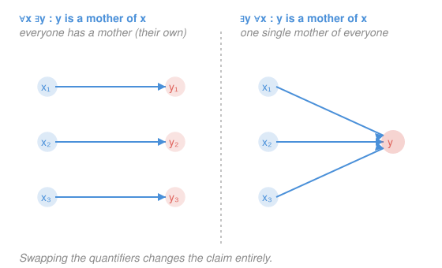

# How to Read & Write Proofs · Lesson 1.2: Quantifiers, order, and negation

> ⏱ ~15 min · Module 1: The language of mathematics · Builds on: [1.1 Statements, connectives, and implication](01-01-statements-connectives-implication.md) · Unlocks: Module 2 (proof techniques)

## Why this matters

Almost every real definition in analysis, topology, and probability is a chain of "for all" and "there exists" — continuity, convergence, compactness, uniform anything. The order you write those quantifiers in is not decoration: swap two of them and you've stated a *different, usually false* claim. And to disprove something — the everyday move of finding a counterexample — you need to negate it correctly first. This lesson gives you both skills, then aims them at the definition of a convergent sequence, which is [Boss problem 1](../syllabus.md) and the gateway to real analysis.

## The idea

Two words carry the load. **"For all"** ($\forall$) claims something about *every* object in view — one exception kills it. **"There exists"** ($\exists$) claims *at least one* object works — you win by producing a single witness. They are opposites in how you attack them: to prove $\forall$ you argue about an arbitrary object; to prove $\exists$ you hand over one example.

The subtlety is **order**. "Everyone has a mother" is true — but it does *not* say there's one woman who mothered everybody. The first reading lets each person pick their *own* mother; the second demands a *single* mother shared by all. Same words, different order of the quantifiers, opposite truth. When an $\exists$ sits *inside* a $\forall$, the existing object is allowed to depend on the universal one — and that dependence is the whole ballgame.

The other skill is **negation**. To deny "everyone passed," you don't say "everyone failed" — you say "*someone* didn't pass." Denying a "for all" produces a "there exists," and vice versa. That single rule, applied mechanically, negates even the scariest nested definition.

## The formal version

Let $P(x)$ be a statement about $x$ drawn from some set (its *domain*).

**The two quantifiers.**

$$\forall x\, P(x) \quad\text{means}\quad \text{``}P(x)\text{ holds for every }x\text{,''}\qquad \exists x\, P(x)\quad\text{means}\quad \text{``}P(x)\text{ holds for at least one }x\text{.''}$$

In words: $\forall$ is an unbounded AND over the domain; $\exists$ is an unbounded OR.

**Order matters when quantifiers differ.** With $P(x,y)$ a statement about a pair,

$$\forall x\, \exists y\, P(x,y) \qquad\text{is \emph{not} the same as}\qquad \exists y\, \forall x\, P(x,y).$$

In words: on the left, each $x$ gets to choose its *own* $y$ (the $y$ may depend on $x$); on the right, *one* $y$ must work for *every* $x$ simultaneously. The right statement is stronger — it always implies the left, never the reverse. (Two quantifiers of the *same* type do commute: $\forall x\,\forall y \equiv \forall y\,\forall x$, and likewise for $\exists\exists$.)

**Negating quantifiers (De Morgan for quantifiers).**

$$\lnot\,\forall x\, P(x) \;\equiv\; \exists x\,\lnot P(x), \qquad\qquad \lnot\,\exists x\, P(x) \;\equiv\; \forall x\,\lnot P(x).$$

In words: pushing a $\lnot$ inward **flips each quantifier** ($\forall \leftrightarrow \exists$) and negates whatever is left inside. To negate a whole string of quantifiers, flip every one in order, then negate the innermost statement.

**Negating an implication.** Recall from [1.1](01-01-statements-connectives-implication.md) that $P \implies Q$ is false in exactly one case — $P$ true, $Q$ false — so

$$\lnot(P \implies Q) \;\equiv\; P \,\land\, \lnot Q.$$

In words: the only way to break a promise "if $P$ then $Q$" is to make $P$ happen and $Q$ fail. This matters because implications hide *inside* quantified statements, and when the $\lnot$ reaches them you rewrite them this way — no "$\lnot Q \implies$" nonsense.

## Picture

## Worked examples

**Example 1 (mechanical — negate a two-quantifier claim).** Consider

$$\forall x \in \mathbb{R}\; \exists y \in \mathbb{R} : \; y > x,$$

"every real has a bigger real" (true — take $y = x+1$). Negate it by flipping each quantifier in turn and negating the inside ($y > x$ becomes $y \le x$):

$$\lnot\big(\forall x\, \exists y :\, y > x\big) \;\equiv\; \exists x\, \forall y : \, y \le x.$$

In words: "there is a real $x$ that is $\ge$ every real $y$" — a largest real number. Plainly false, which is the correct verdict for the negation of a true statement. Notice the *order* was preserved while the *types* flipped.

**Example 2 (why you'd care — the definition of convergence).** Here is the statement all of Module 1 is pointed at. A sequence $a_1, a_2, a_3, \dots$ **converges to** $L$ means

$$\forall \varepsilon > 0 \;\; \exists N \;\; \forall n > N : \; |a_n - L| < \varepsilon.$$

Read it left to right, and *feel the dependence*: "*Hand me any error tolerance $\varepsilon > 0$ (however tiny). Then there is a cutoff index $N$ — allowed to depend on $\varepsilon$ — beyond which every term $a_n$ sits within $\varepsilon$ of $L$.*" The $N$ living inside the $\forall \varepsilon$ is exactly the "each $x$ picks its own $y$" pattern: smaller $\varepsilon$ generally needs a larger $N$. If you demanded one $N$ that worked for *all* $\varepsilon$ at once (pulling $\exists N$ to the front), you'd be claiming the terms are *exactly* $L$ eventually — a totally different, far stronger thing. Order is the entire content of this definition. Negating it is [Boss problem 1](../syllabus.md) and problem P3 below.

## Watch out

- **You might think** $\forall x\,\exists y$ and $\exists y\,\forall x$ are just stylistic variants. **Actually** they can have opposite truth values — the inner-$\exists$ version lets the witness depend on $x$, the outer-$\exists$ version forbids it. Whenever an $\exists$ follows a $\forall$, ask "is this object allowed to change as the earlier one changes?" The answer is yes.
- **You might think** negating "for all $x$, $P(x)$" gives "for all $x$, $\lnot P(x)$." **Actually** it gives "*there exists* $x$ with $\lnot P(x)$" — one counterexample, not universal failure. This is the single most common negation error.
- **You might think** you negate "$P \implies Q$" by writing "$P \implies \lnot Q$." **Actually** the negation is "$P \land \lnot Q$" — the negation of an implication is *not* an implication at all. Inside a quantifier, "$\forall x\,(P(x)\implies Q(x))$" negates to "$\exists x\,(P(x) \land \lnot Q(x))$."

## One-liner

> To negate, flip every quantifier ($\forall\leftrightarrow\exists$) left to right and negate the core; and never trust two adjacent quantifiers of different type to commute — order is content.

## Problems

**P1 (🟢)** Negate each statement. Give the negation both in symbols and in plain English, and say whether the *original* is true or false.
(a) $\forall x \in \mathbb{R}, \; x^2 \ge 0.$
(b) $\exists n \in \mathbb{N}, \; n^2 = 2.$

**P2 (🟡)** Consider "every integer has a strictly larger integer," i.e. $\forall m \in \mathbb{Z}\; \exists n \in \mathbb{Z}: n > m$.
(a) Write its negation in symbols and English; is the original true?
(b) Now *swap the quantifier order* to $\exists n\, \forall m : n > m$. Translate it and explain how its meaning — and truth — differ from the original.

**P3 (🔴, optional — Boss problem 1 warm-up)** Take the convergence definition $\forall \varepsilon > 0\; \exists N\; \forall n > N: |a_n - L| < \varepsilon$.
(a) Write its full negation in symbols.
(b) Translate that negation into plain English, and state operationally what "$a_n$ does **not** converge to $L$" demands you exhibit.
(c) Verify your negation by negating it a second time and checking you recover the original.

Solutions

**P1**
(a) Negation: $\exists x \in \mathbb{R}, \; x^2 < 0$ — "there is a real number whose square is negative." The original is **true** (a square is never negative), so this negation is correctly false. (Flip $\forall \to \exists$; negate $x^2 \ge 0$ to $x^2 < 0$.)
(b) Negation: $\forall n \in \mathbb{N}, \; n^2 \ne 2$ — "every natural number has square different from 2." The original is **false** (no natural number squares to 2, since $1^2 = 1$ and $2^2 = 4$), so this negation is correctly true. (Flip $\exists \to \forall$; negate $n^2 = 2$ to $n^2 \ne 2$.)

**P2**
(a) Negation: $\lnot\big(\forall m\, \exists n : n > m\big) \equiv \exists m\, \forall n : n \le m$ — "there is an integer $m$ such that every integer $n$ satisfies $n \le m$," i.e. *there is a largest integer.* The original is **true** (given any $m$, take $n = m+1$), so the negation is false — there is no largest integer.
(b) $\exists n\, \forall m : n > m$ reads "there is a single integer $n$ that is strictly larger than *every* integer $m$" — one universal upper bound. This is **false**: such an $n$ would have to satisfy $n > n$ (taking $m = n$), a contradiction. The original let $n$ depend on $m$ (pick a fresh, bigger integer each time); the swap demands *one fixed* $n$ that beats them all at once. Same symbols, order reversed, truth flips from true to false — the $\forall x\,\exists y$ vs. $\exists y\,\forall x$ picture exactly.

**P3**
(a) Flip all three quantifiers left to right and negate the core ($|a_n - L| < \varepsilon$ becomes $|a_n - L| \ge \varepsilon$):
$$\exists \varepsilon > 0\; \forall N\; \exists n > N : \; |a_n - L| \ge \varepsilon.$$
(b) In words: "there is a tolerance $\varepsilon > 0$ such that, no matter how large a cutoff $N$ you pick, some later term $a_n$ (with $n > N$) lies at least $\varepsilon$ away from $L$." Operationally, to show $a_n$ does **not** converge to $L$ you must *exhibit one specific $\varepsilon > 0$* and then argue that the sequence keeps escaping the band $(L - \varepsilon,\, L + \varepsilon)$ forever — for every proposed cutoff there is a still-later term outside the band. (Example: $a_n = (-1)^n$ does not converge to $1$; take $\varepsilon = 1$, and every odd $n$ gives $|a_n - 1| = 2 \ge 1$.)
(c) Negate the negation, flipping each quantifier back and negating $|a_n - L| \ge \varepsilon$ to $|a_n - L| < \varepsilon$:
$$\lnot\big(\exists \varepsilon > 0\, \forall N\, \exists n > N : |a_n - L| \ge \varepsilon\big) \equiv \forall \varepsilon > 0\; \exists N\; \forall n > N : |a_n - L| < \varepsilon,$$
which is the original definition. ✓ The double negation returns us home, confirming the negation was formed correctly.

## Connections

- **Backward:** the implication rules from [1.1](01-01-statements-connectives-implication.md) resurface here — negating an implication ($P\land\lnot Q$) is what you do to the *inside* once the $\lnot$ has flipped all the quantifiers.
- **Forward:** [Module 2](02-01-direct-proof-definitions.md) turns these readings into proofs — proving a $\forall$ by taking an arbitrary object, proving an $\exists$ by constructing a witness, and disproving a claim by negating it and hunting the counterexample this lesson taught you to name.
- **Sideways (real analysis):** the convergence definition in Example 2 is the literal entry point to `real-analysis`; the same $\forall\varepsilon\,\exists\delta$ shape defines the limits and continuity foreshadowed in [`calc-refresher` 2.3](../../calc-refresher/lessons/02-03-improper-integrals-and-models.md), where "the limit is where the answer lives" was still an intuition — now it's a statement you can negate.
