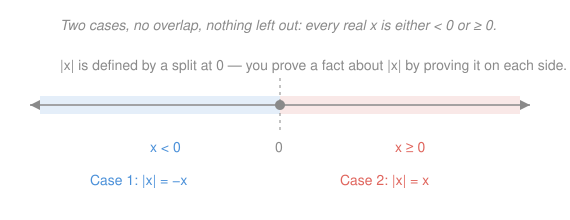

# How to Read & Write Proofs · Lesson 2.3: Proof by cases and "without loss of generality"

> ⏱ ~15 min · Module 2: Core proof techniques · Builds on: [2.1 Direct proof: unpacking definitions](02-01-direct-proof-definitions.md), [2.2 Contrapositive and contradiction](02-02-contrapositive-and-contradiction.md) · Unlocks: Module 3 (sets, functions, induction)

## Why this matters

A single argument often can't cover every input at once: the absolute value $|x|$ *is* one formula for $x\ge 0$ and a different one for $x<0$, so any claim about it splits at zero. The triangle inequality — the workhorse of every $\varepsilon$–$\delta$ estimate in `real-analysis` — is proved this way. Proof by cases lets you say "there are only finitely many situations, and I'll handle each"; "without loss of generality" lets you skip the ones that are just relabelings of a case you already did. Both are honesty tools: they force you to check that your cases really cover everything, and that a symmetry you're leaning on is real.

## The idea

Some claims resist a single clean chain of implications because the object in front of you behaves differently in different regimes. The fix is not to be cleverer — it's to **partition** the possibilities into a short list of cases, prove the claim separately in each, and then observe that the cases together leave no gap. If every case yields the conclusion, and the cases are exhaustive, the conclusion holds always. That's the whole method.

The classic partitions are tiny: every integer is **even or odd**; every real number is **negative, zero, or positive**; $|x|$ splits at $x\ge 0$ versus $x<0$. Two things must be true for the split to be legal — the cases must be **exhaustive** (their union is everything) and, ideally, **disjoint** (no overlap, so you never double-count or contradict yourself). Exhaustiveness is the one people forget; a proof that quietly omits "$x=0$" is not a proof.

"Without loss of generality" (WLOG) is a shortcut *inside* case-work. When two cases are mirror images — same structure with the labels swapped — you prove one and write "the other follows by symmetry." It's legitimate **only when the symmetry is genuine**: swapping the labels must leave the claim itself unchanged. Used honestly it halves your writing; used lazily it hides the case that was actually different.

## The formal version

**Proof by cases.** To prove a statement $P$, find statements $C_1, C_2, \dots, C_k$ (the *cases*) with
$$C_1 \lor C_2 \lor \cdots \lor C_k \quad\text{always true (exhaustive),}$$
and prove $C_i \Rightarrow P$ for each $i$. Then $P$ holds. In words: if the cases cover all possibilities and each one forces the conclusion, the conclusion is unavoidable.

The logical backbone is *proof by disjunction elimination*: from $C_1 \lor \cdots \lor C_k$ together with every $C_i \Rightarrow P$, conclude $P$. Disjointness ($C_i \land C_j$ impossible for $i\ne j$) isn't logically required, but keeping cases disjoint is good hygiene — it guarantees you've assigned every situation to exactly one branch.

**Without loss of generality.** Suppose the cases $C_1$ and $C_2$ are related by a relabeling $\sigma$ (e.g. "swap $a$ and $b$") under which the statement $P$ is *invariant*: $P$ holds for an input iff it holds for the relabeled input. Then a proof of $C_1 \Rightarrow P$ automatically gives $C_2 \Rightarrow P$, and you write "**WLOG** assume $C_1$." In words: if the problem looks identical after renaming, solving it once solves both.

## Picture

The absolute value is *defined* by a case split: $|x| = x$ when $x \ge 0$ and $|x| = -x$ when $x < 0$. The two cases tile the whole line with no overlap — that's exactly the "exhaustive and disjoint" you must be able to point to before a case proof counts.

## Worked examples

**Example 1 (mechanical — the definition in action).** Claim: $|x| \ge 0$ for every real $x$.

*Proof.* Every real number satisfies $x \ge 0$ or $x < 0$; these two cases are exhaustive.

- **Case $x \ge 0$:** by definition $|x| = x$, and $x \ge 0$, so $|x| \ge 0$.
- **Case $x < 0$:** by definition $|x| = -x$; since $x < 0$ we have $-x > 0$, so $|x| > 0 \ge 0$.

In both cases $|x| \ge 0$. As the cases cover every real $x$, the claim holds. $\blacksquare$

Notice the ritual: state the partition, name each case, and close by confirming the cases were exhaustive. Skip that last line and a reader can't tell whether you covered $x=0$ (here it lives in the first case, since we used $\ge$, not $>$).

**Example 2 (why you'd care — WLOG in action).** Claim: for any two reals $a, b$, at least one of them is $\le$ their average $\frac{a+b}{2}$.

*Proof.* The claim is symmetric in $a$ and $b$: swapping the two names changes neither "at least one of $a,b$" nor the average $\frac{a+b}{2}$. So **WLOG assume $a \le b$** (if instead $a > b$, rename to reduce to this case). Then
$$a = \frac{a+a}{2} \le \frac{a+b}{2},$$
using $a \le b$ in the second step. So $a$ is the number that is $\le$ the average. $\blacksquare$

The WLOG was honest because we *checked* the symmetry before invoking it. This averaging move — "something is no bigger than the mean" — is the seed of the pigeonhole and mean-value arguments you'll meet later.

## Watch out

- You might think naming a few cases is enough, but if they don't **cover everything** the proof is void. Always end with "these cases are exhaustive because …". The sneaky gap is a boundary value like $x = 0$ — decide which case owns it (use $\ge$ vs $>$ deliberately).
- You might think WLOG is a free pass to assume the convenient case, but it's only valid when **relabeling leaves the claim unchanged**. If assuming $a \ge b$ actually loses generality (the statement isn't symmetric), you've skipped a real case, not a redundant one. Test: write out the swapped statement and confirm it's the same statement.
- You might think more cases is safer. Overlapping or excessive cases invite contradictions and copy-paste errors; the cleanest proof uses the *coarsest* partition that still lets each case go through. Disjoint is tidy, exhaustive is mandatory.

## One-liner

> Split the world into cases that miss nothing, prove each, and only say "WLOG" when swapping the labels genuinely changes nothing.

## Problems

**P1 (🟢)** Prove that for every integer $n$, the number $n^2 + n$ is even. (Split on the parity of $n$, and confirm your cases are exhaustive.)

**P2 (🟡)** Prove the triangle inequality: for all real numbers $a, b$,
$$|a+b| \le |a| + |b|.$$
(You may split on signs, or prove the lemma $-|x| \le x \le |x|$ by cases and add. State clearly why your cases cover everything.)

**P3 (🔴, optional)** Prove that for all real numbers $a, b$,
$$\max(a,b) = \tfrac{1}{2}\big(a + b + |a-b|\big).$$
Use "WLOG $a \ge b$," and justify explicitly why the WLOG is legitimate here.

Solutions

**P1.** Every integer is even or odd — these two cases are exhaustive and disjoint (the definition of the integers' parity).

- **Case $n$ even:** write $n = 2k$ for some integer $k$. Then
$$n^2 + n = 4k^2 + 2k = 2(2k^2 + k),$$
and $2k^2 + k$ is an integer, so $n^2 + n$ is even.
- **Case $n$ odd:** write $n = 2k+1$ for some integer $k$. Then
$$n^2 + n = (4k^2 + 4k + 1) + (2k + 1) = 4k^2 + 6k + 2 = 2(2k^2 + 3k + 1),$$
and $2k^2 + 3k + 1$ is an integer, so $n^2 + n$ is even.

Every integer falls into exactly one case, and each gives an even result, so $n^2 + n$ is even for all integers $n$. $\blacksquare$

*(Slicker, same idea: $n^2 + n = n(n+1)$ is a product of two consecutive integers, one of which must be even — but the parity cases make the "must be even" explicit.)*

**P2.** We first prove a lemma by cases, then combine.

*Lemma:* for every real $x$, $\;-|x| \le x \le |x|$.
Every real satisfies $x \ge 0$ or $x < 0$ (exhaustive).
- **Case $x \ge 0$:** then $|x| = x$, so $x \le |x|$ holds with equality, and $-|x| = -x \le 0 \le x$.
- **Case $x < 0$:** then $|x| = -x$, so $x \le 0 < -x = |x|$, and $-|x| = x \le x$.

Both cases give $-|x| \le x \le |x|$; the cases are exhaustive, so the lemma holds. $\square$

Now apply the lemma to $a$ and to $b$ and add the inequalities:
$$-|a| \le a \le |a|, \qquad -|b| \le b \le |b|$$
$$\implies\quad -\big(|a| + |b|\big) \;\le\; a + b \;\le\; |a| + |b|.$$
A real number $y$ satisfies $-M \le y \le M$ (for $M \ge 0$) **iff** $|y| \le M$ — itself the two-case unpacking of $|y|$. Taking $y = a+b$ and $M = |a|+|b| \ge 0$ gives
$$|a + b| \le |a| + |b|. \qquad \blacksquare$$

*(Direct sign-case alternative: the cases $a,b \ge 0$ and $a,b < 0$ give equality; the two mixed-sign cases are symmetric under swapping $a \leftrightarrow b$, so WLOG do $a \ge 0 > b$, splitting further on the sign of $a+b$. The lemma route avoids the four-way bookkeeping.)*

**P3.** *Why WLOG is legitimate.* The statement is symmetric under swapping $a \leftrightarrow b$: the left side is unchanged since $\max(a,b) = \max(b,a)$, and the right side is unchanged since $a+b = b+a$ and $|a-b| = |b-a|$. So proving the identity when $a \ge b$ also settles $a < b$ (relabel the two numbers). Since every pair satisfies $a \ge b$ or $a < b$, WLOG we assume $a \ge b$.

*Proof under $a \ge b$.* Then $a - b \ge 0$, so $|a-b| = a - b$, and
$$\tfrac{1}{2}\big(a + b + |a-b|\big) = \tfrac{1}{2}\big(a + b + (a - b)\big) = \tfrac{1}{2}(2a) = a.$$
Also $\max(a,b) = a$ because $a \ge b$. Hence both sides equal $a$, proving the identity. $\blacksquare$

*(As a check, the companion identity $\min(a,b) = \tfrac{1}{2}(a+b-|a-b|)$ follows the same way, and adding the two recovers $\max + \min = a+b$.)*

## Flashback

**From Lesson 1.2 (Quantifiers, order, and negation):** Consider the claim "every real number has a multiplicative inverse":
$$\forall x \in \mathbb{R}\;\; \exists y \in \mathbb{R} \;\; (x \cdot y = 1).$$
Write its negation symbolically and in plain English, and decide which — the claim or its negation — is true.

Solution

Push the negation inward, flipping each quantifier and negating the core ($\lnot(x\cdot y = 1)$ is $x \cdot y \ne 1$):
$$\lnot\Big(\forall x\, \exists y\; (xy = 1)\Big) \;\equiv\; \exists x \in \mathbb{R}\;\; \forall y \in \mathbb{R} \;\; (x \cdot y \ne 1).$$
In English: **there is a real number $x$ such that no real $y$ satisfies $xy = 1$** — i.e. some real has no multiplicative inverse.

The **negation is true**: take $x = 0$. Then $0 \cdot y = 0 \ne 1$ for every real $y$, so $0$ has no inverse. Hence the original universal claim is false. (The order matters: $\exists x\,\forall y$ demands a single $x$ that defeats *all* $y$ at once, and $x=0$ is exactly such a witness.) $\blacksquare$

## Connections

- **Backward:** case analysis often teams up with [2.2](02-02-contrapositive-and-contradiction.md) — inside a proof by contradiction you frequently split the assumed situation into cases and derive a contradiction in each. And each individual case is just a [2.1](02-01-direct-proof-definitions.md) direct proof under an extra hypothesis.
- **Forward:** the element method in [3.1](03-01-sets-and-element-method.md) leans on cases (an element is in $A$ or not); De Morgan's laws are proved by checking membership case by case. Induction ([3.3](03-03-induction.md)) is a base-case/inductive-step split in disguise.
- **Sideways (analysis):** P2's triangle inequality is the single most-used estimate in `real-analysis` — every "$|a - c| \le |a - b| + |b - c|$" in an $\varepsilon$–$\delta$ or Cauchy-sequence argument is this lemma. WLOG-by-symmetry recurs there whenever a statement is symmetric in two indices or two points.
