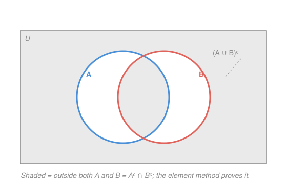

# How to Read & Write Proofs · Lesson 3.1: Sets and the element method

> ⏱ ~15 min · Module 3: The objects you prove things about · Builds on: [2.1 Direct proof: unpacking definitions](02-01-direct-proof-definitions.md), [1.2 Quantifiers, order, and negation](01-02-quantifiers-order-negation.md) · Unlocks: 3.2 (functions)

## Why this matters

Almost every object in analysis and topology is a set: an open interval, the domain of a function, the solution set of an equation, a neighborhood. So "prove these two sets are equal" and "prove this set sits inside that one" are among the most common things you'll ever be asked to do. There's a single technique — the **element method** — that handles nearly all of it, and it turns out to be nothing more than the direct proof you already met in [2.1](02-01-direct-proof-definitions.md), aimed at a claim about membership. Learn it once here and you'll reuse it in every course downstream.

## The idea

A set is just a collection of things, and the only question you can ask a set is: *is this particular thing in you or not?* That yes/no question — membership — is the whole game.

Everything else is built from it. "$A$ is inside $B$" should mean: pick *anything* in $A$, and it's guaranteed to be in $B$ too. "$A$ equals $B$" should mean: they have exactly the same members, so each is inside the other. To *prove* either, you don't need a clever trick — you grab one arbitrary element, follow the definitions, and see where it's forced to live. Because the element was arbitrary, whatever you proved about it holds for *all* of them. That's the element method in one breath: **let $x$ be in the left-hand side; chase the definitions until $x$ is forced into the right-hand side.**

## The formal version

Write $x \in A$ for "$x$ is an element of $A$", and $x \notin A$ for its negation. A few sets and operations, each defined by *what it means to be a member*:

- **Union:** $x \in A \cup B \iff (x \in A) \lor (x \in B)$. *In words: in $A$ or in $B$ (or both).*
- **Intersection:** $x \in A \cap B \iff (x \in A) \land (x \in B)$. *In words: in both.*
- **Difference:** $x \in A \setminus B \iff (x \in A) \land (x \notin B)$. *In words: in $A$ but not $B$.*
- **Complement:** fixing a universe $U$ that contains everything in play, $A^c = U \setminus A$, so $x \in A^c \iff x \notin A$. *In words: everything outside $A$.*
- **Empty set:** $\varnothing$ has no members: $x \in \varnothing$ is false for every $x$.

Notice each operation is *defined by a logical connective* — $\cup$ is $\lor$, $\cap$ is $\land$, complement is $\lnot$. That's the bridge from [1.1](01-01-statements-connectives-implication.md): set algebra *is* logic wearing different notation.

**Subset.**

$$A \subseteq B \iff \forall x,\ (x \in A \implies x \in B).$$

*In words: every element of $A$ is also an element of $B$.* This is a **quantified implication** — exactly the shape [1.2](01-02-quantifiers-order-negation.md) taught you to read. To prove it you do what you always do with $\forall x,\ P(x)\implies Q(x)$: take an arbitrary $x$, assume $x \in A$, and derive $x \in B$.

**Set equality (double inclusion).**

$$A = B \iff (A \subseteq B) \land (B \subseteq A).$$

*In words: two sets are equal exactly when each contains the other.* This is the workhorse: to prove $A = B$ you prove **two** subset claims, each by the element method. Skipping one direction is the most common way a set-equality "proof" is actually wrong.

**De Morgan's laws for sets.** For any sets inside a universe $U$,

$$(A \cup B)^c = A^c \cap B^c, \qquad (A \cap B)^c = A^c \cup B^c.$$

*In words: the outside of "$A$ or $B$" is "outside $A$ and outside $B$"; the outside of "$A$ and $B$" is "outside $A$ or outside $B$."* These are the set versions of the logical De Morgan laws — negation flips $\lor$ to $\land$ and $\land$ to $\lor$ — and P3 asks you to prove one, watching that flip happen at the membership level.

## Picture

The shaded region is everything *outside both* circles — that's $(A\cup B)^c$ by eye, and also "outside $A$ **and** outside $B$", i.e. $A^c \cap B^c$. The picture makes De Morgan *plausible* in one glance.

But a Venn diagram is a suggestion, not a proof. It shows the "generic" arrangement — two circles overlapping in a lens — and silently assumes that's the only case. Real sets can be disjoint, nested, or equal; a hand-drawn picture can quietly miss a configuration, and "it looks true in my drawing" has no logical force. The element method proves the identity for **every** possible arrangement at once, because it never draws a picture — it only manipulates the definition of membership.

## Worked examples

**Example 1 (mechanical — a subset by the element method).** Claim: $A \cap B \subseteq A$.

*Proof.* Let $x \in A \cap B$ be arbitrary. By the definition of intersection, $x \in A$ **and** $x \in B$. In particular $x \in A$. Since $x$ was an arbitrary element of $A \cap B$, we have shown $x \in A\cap B \implies x \in A$ for all $x$, i.e. $A \cap B \subseteq A$. $\blacksquare$

That's the entire method in four lines: *take an arbitrary element, unpack the left side's definition, extract what you need, conclude*. Read it against [2.1](02-01-direct-proof-definitions.md) — it is a direct proof of the implication $x\in A\cap B \implies x\in A$, nothing more.

**Example 2 (why you'd care — an equality by double inclusion).** Claim: $A \setminus B = A \cap B^c$. (This is the identity that lets you trade "difference" for "intersection with a complement" — handy whenever you want everything phrased in $\cap,\cup,{}^c$.)

*Proof.* We show each side is a subset of the other.

($\subseteq$) Let $x \in A \setminus B$. By definition of difference, $x \in A$ and $x \notin B$. But $x \notin B$ means $x \in B^c$. So $x \in A$ and $x \in B^c$, which is exactly $x \in A \cap B^c$.

($\supseteq$) Let $x \in A \cap B^c$. Then $x \in A$ and $x \in B^c$, i.e. $x \notin B$. So $x \in A$ and $x \notin B$, which is exactly $x \in A \setminus B$.

Both inclusions hold, so by double inclusion $A \setminus B = A \cap B^c$. $\blacksquare$

Notice the two directions are near-mirror images here — but you still write both, because in general they aren't, and the *reader* can't know a direction is trivial until you've shown it.

## Watch out

- You might think proving $A=B$ means "manipulate $A$ until it turns into $B$." That algebra-of-sets style works only once you've *already proven* the identities you're chaining. The foundational proof is double inclusion: **two** element-chases, one each way. When in doubt, do both directions explicitly.
- You might think a convincing Venn diagram settles it. It suggests, never proves — it fixes one arrangement of the circles and can miss disjoint/nested/equal cases. A picture earns you a *conjecture*; the element method earns you a *theorem*.
- You might confuse $\in$ with $\subseteq$. "$x \in A$" says $x$ is a *member*; "$\{x\} \subseteq A$" says the *one-element set* $\{x\}$ is contained in $A$. They're true together here, but they are different statements — e.g. $2 \in \mathbb{Z}$ while $\{2\} \subseteq \mathbb{Z}$, and $2 \subseteq \mathbb{Z}$ is a type error, not a claim.

## One-liner

> To prove one set sits in another, grab an arbitrary element and let the definitions push it across; to prove equality, push it across both ways.

## Problems

**P1 (🟢)** Prove $A \cap B \subseteq B$ by the element method. (The twin of Example 1 — extract the *other* half of the intersection.)

**P2 (🟡)** Prove the distributive law $A \cap (B \cup C) = (A \cap B) \cup (A \cap C)$ by double inclusion. Do both inclusions; at each step name which definition ($\cap$ or $\cup$) you're unpacking.

**P3 (🔴, optional)** Prove the De Morgan law $(A \cup B)^c = A^c \cap B^c$ by the element method. For each membership step, point to the negation rule from [1.2](01-02-quantifiers-order-negation.md) you're using — in particular, that $\lnot(P \lor Q)$ is equivalent to $(\lnot P) \land (\lnot Q)$.

Solutions

**P1.** Let $x \in A \cap B$ be arbitrary. By the definition of intersection, $x \in A$ and $x \in B$. In particular $x \in B$. Since $x$ was arbitrary, $x \in A\cap B \implies x \in B$ for all $x$, i.e. $A \cap B \subseteq B$. $\blacksquare$

**P2.** We show each side is contained in the other.

($\subseteq$) Let $x \in A \cap (B \cup C)$. By definition of $\cap$, $x \in A$ **and** $x \in B \cup C$. By definition of $\cup$, the second part says $x \in B$ **or** $x \in C$. Split into the two cases (both use that we already have $x\in A$):
- If $x \in B$: then $x \in A$ and $x \in B$, so $x \in A \cap B$.
- If $x \in C$: then $x \in A$ and $x \in C$, so $x \in A \cap C$.

Either way $x$ lands in $A\cap B$ or in $A\cap C$, so $x \in (A \cap B) \cup (A \cap C)$.

($\supseteq$) Let $x \in (A \cap B) \cup (A \cap C)$. By definition of $\cup$, $x \in A\cap B$ **or** $x \in A \cap C$.
- If $x \in A \cap B$: then $x \in A$ and $x \in B$. From $x\in B$ we get $x \in B \cup C$. So $x \in A$ and $x \in B\cup C$.
- If $x \in A \cap C$: then $x \in A$ and $x \in C$. From $x\in C$ we get $x \in B \cup C$. So again $x \in A$ and $x \in B\cup C$.

In both cases $x \in A \cap (B \cup C)$.

Both inclusions hold, so $A \cap (B \cup C) = (A \cap B) \cup (A \cap C)$. $\blacksquare$

(The case split is [2.3](02-03-cases-and-wlog.md)'s "proof by cases" doing real work — the "or" from $\cup$ forces it.)

**P3.** We show each side is contained in the other; the pivot is the logical De Morgan law $\lnot(P\lor Q) \equiv (\lnot P)\land(\lnot Q)$ from [1.2](01-02-quantifiers-order-negation.md).

($\subseteq$) Let $x \in (A \cup B)^c$. By definition of complement, $x \notin A \cup B$ — that is, $\lnot(x \in A \cup B)$. By definition of $\cup$, $x \in A\cup B$ means $(x\in A)\lor(x\in B)$, so we have $\lnot\big((x\in A)\lor(x\in B)\big)$. Applying the negation-of-or rule, this is $(\lnot(x\in A)) \land (\lnot(x\in B))$, i.e. $x \notin A$ **and** $x \notin B$. So $x \in A^c$ and $x \in B^c$, which is $x \in A^c \cap B^c$.

($\supseteq$) Let $x \in A^c \cap B^c$. By definition of $\cap$, $x \in A^c$ and $x \in B^c$, i.e. $x \notin A$ **and** $x \notin B$: $(\lnot(x\in A)) \land (\lnot(x\in B))$. Running the same equivalence backward, this is $\lnot\big((x\in A)\lor(x\in B)\big) = \lnot(x \in A\cup B)$, so $x \notin A \cup B$, which means $x \in (A\cup B)^c$.

Both inclusions hold, so $(A \cup B)^c = A^c \cap B^c$. $\blacksquare$

Every membership step was reversible, so you could also write this as a single chain of $\iff$'s — but writing it as two inclusions makes the logic impossible to skip.

## Flashback

**From Lesson 2.2 (Contrapositive and contradiction):** Prove that if $n^2$ is odd then $n$ is odd, for an integer $n$. Say which technique you're using and why it's the natural one here.

Solution

**Contrapositive** is the natural weapon: the hypothesis "$n^2$ is odd" is awkward to unpack directly (you'd have to reason backward from a product), whereas the contrapositive hypothesis "$n$ is even" hands you a factor of $2$ to compute with immediately.

The contrapositive of "$n^2$ odd $\implies$ $n$ odd" is "$n$ even $\implies$ $n^2$ even," and proving that proves the original.

*Proof (of the contrapositive).* Suppose $n$ is even. Then $n = 2k$ for some integer $k$. Squaring, $n^2 = (2k)^2 = 4k^2 = 2(2k^2)$. Since $2k^2$ is an integer, $n^2$ is even. This establishes the contrapositive, hence the original claim: if $n^2$ is odd then $n$ is odd. $\blacksquare$ $\square$

## Connections

- **Backward:** the element method is literally [2.1](02-01-direct-proof-definitions.md)'s direct proof applied to the quantified implication $\forall x,\ x\in A \implies x\in B$ from [1.2](01-02-quantifiers-order-negation.md); set De Morgan is the logical De Morgan of [1.1](01-01-statements-connectives-implication.md) with $\cup=\lor$, $\cap=\land$, ${}^c=\lnot$. Nothing here is new machinery — it's old machinery pointed at membership.
- **Forward:** [3.2](03-02-functions-injective-surjective-bijective.md) proves things about images and preimages, which are sets — every such proof is an element chase. Boss problem 3 fuses this with induction (counting the $2^n$ subsets of an $n$-element set, each subset a set you'll reason about element-by-element).
- **Sideways (analysis/topology):** "open", "closed", "bounded", "connected" are all properties of sets, and their theorems ("the intersection of two open sets is open," "the union of a family of open sets is open") are proved by exactly the element/subset method drilled here. `real-analysis` and `topology` run on it.
