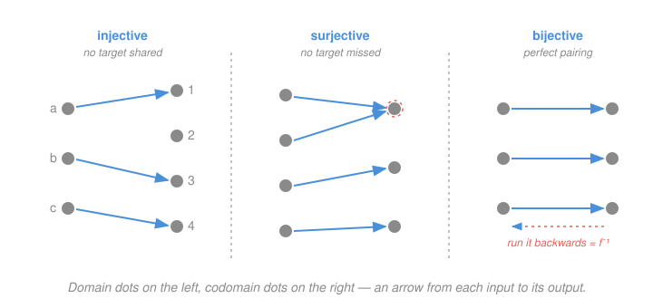

# How to Read & Write Proofs · Lesson 3.2: Functions: injective, surjective, bijective

> ⏱ ~15 min · Module 3: The objects you prove things about · Builds on: [3.1 Sets and the element method](03-01-sets-and-element-method.md), [1.2 Quantifiers, order, and negation](01-02-quantifiers-order-negation.md) · Unlocks: 3.3 (induction)

## Why this matters

A function is how one set talks to another, and three questions about that conversation come up everywhere: does it ever say the same thing twice (injective)? does it eventually say everything (surjective)? and can you run the conversation backwards (bijective)? These are the properties behind "change of variables," "isomorphism," "invertible matrix," and "counting by matching" — a bijection between two finite sets is *the* proof that they have the same size, which is exactly how [3.3](03-03-induction.md) will count subsets. Each property is a one-line quantifier statement from [1.2](01-02-quantifiers-order-negation.md), and each comes with a fixed proof template. Learn the three templates and you can prove any of them on autopilot.

## The idea

Picture a function $f$ as arrows leaving every dot in a left-hand set (the **domain**) and landing on dots in a right-hand set (the **codomain**). Every left dot fires exactly one arrow — that's what makes $f$ a function. The three properties are just rules about where the arrows *land*.

- **Injective** ("one-to-one"): no two arrows hit the same target. Distinct inputs get distinct outputs — the function never collides.
- **Surjective** ("onto"): every target gets hit by at least one arrow. Nothing in the codomain is left out.
- **Bijective**: both at once — a *perfect pairing*, each target hit exactly once. Now you can turn every arrow around and get a legitimate function back: the **inverse**.

The one trap to flag up front: surjectivity is not about the formula alone, it's about the **declared codomain**. $x \mapsto x^2$ misses the negatives — but if you *declare* the codomain to be $[0,\infty)$ instead of $\mathbb{R}$, nothing is missed anymore. Same rule, different target set, different verdict.

## The formal version

A **function** $f : A \to B$ assigns to each element of its domain $A$ exactly one element of its codomain $B$. The **image** of $f$ is the set of values actually hit, $f(A) = \{\, f(x) : x \in A \,\} \subseteq B$.

**Injective.** $f$ is **injective** if
$$\forall x_1, x_2 \in A:\quad f(x_1) = f(x_2) \;\implies\; x_1 = x_2.$$
In words: equal outputs force equal inputs — no two distinct inputs collide. (Contrapositive, equally valid: $x_1 \ne x_2 \implies f(x_1) \ne f(x_2)$.)

> **Template to prove injective.** Take arbitrary $x_1, x_2 \in A$, **assume $f(x_1) = f(x_2)$**, and derive $x_1 = x_2$. Start from the *equal outputs* — never assume $x_1 = x_2$, which is what you're trying to conclude.

**Surjective.** $f$ is **surjective** (onto) if
$$\forall y \in B\;\; \exists x \in A:\quad f(x) = y.$$
In words: every element of the codomain is an output of something. This is a $\forall\exists$ statement — exactly the shape from [1.2](01-02-quantifiers-order-negation.md), where the witness $x$ is allowed to depend on $y$.

> **Template to prove surjective.** Take an **arbitrary $y \in B$**, then **produce** an $x \in A$ (usually by solving $f(x) = y$ for $x$), and verify $f(x) = y$. The $\forall$ says start with a generic target; the $\exists$ says hand over a preimage.

**Bijective.** $f$ is **bijective** if it is both injective and surjective — every $y \in B$ has *exactly one* preimage.

**The inverse.** A function $g : B \to A$ is a **two-sided inverse** of $f$ if $g\circ f = \mathrm{id}_A$ and $f \circ g = \mathrm{id}_B$ (i.e. $g(f(x)) = x$ for all $x$ and $f(g(y)) = y$ for all $y$). We write $g = f^{-1}$. The central theorem — this is [Boss problem 3](../syllabus.md) — is:

$$f : A \to B \text{ has a two-sided inverse} \iff f \text{ is a bijection.}$$

In words: invertibility and bijectivity are the same thing. Here is the ($\Leftarrow$) direction, worked; the ($\Rightarrow$) direction is yours to finish in Module 3.

> **Claim.** If $f : A \to B$ is a bijection, then $f$ has a two-sided inverse.
>
> **Proof.** Define $g : B \to A$ as follows. Take any $y \in B$. Because $f$ is *surjective*, there is at least one $x \in A$ with $f(x) = y$; because $f$ is *injective*, that $x$ is the only one. So "the preimage of $y$" names a single element — set $g(y)$ to be it. This makes $g$ a well-defined function (surjectivity guarantees $g(y)$ exists, injectivity guarantees it's unambiguous). Now check both sides. For $x \in A$: let $b = f(x)$; then $x$ is the unique preimage of $b$, so $g(f(x)) = g(b) = x$, giving $g \circ f = \mathrm{id}_A$. For $y \in B$: $g(y)$ is by definition a preimage of $y$, so $f(g(y)) = y$, giving $f \circ g = \mathrm{id}_B$. Thus $g$ is a two-sided inverse of $f$. $\blacksquare$

Notice the proof *used both halves of bijectivity, and used them for different jobs* — surjectivity for existence, injectivity for uniqueness. That division of labor is the whole idea.

## Picture

## Worked examples

**Example 1 (mechanical — both templates, then the inverse).** Let $f : \mathbb{R} \to \mathbb{R}$, $f(x) = 7x + 2$. Claim: $f$ is a bijection, with inverse $f^{-1}(y) = \frac{y-2}{7}$.

*Injective.* Take $x_1, x_2 \in \mathbb{R}$ and assume $f(x_1) = f(x_2)$:
$$7x_1 + 2 = 7x_2 + 2 \;\implies\; 7x_1 = 7x_2 \;\implies\; x_1 = x_2.$$
Equal outputs forced equal inputs, so $f$ is injective. (We started from equal outputs, per the template.)

*Surjective.* Take an arbitrary $y \in \mathbb{R}$. Solve $f(x) = y$: $7x + 2 = y$ gives $x = \frac{y-2}{7}$, which is a real number, so it lives in the domain. Verify: $f\!\left(\frac{y-2}{7}\right) = 7\cdot\frac{y-2}{7} + 2 = (y - 2) + 2 = y.$ A preimage exists for every $y$, so $f$ is surjective.

Both hold, so $f$ is bijective, and the $x$ we solved for *is* the inverse: $f^{-1}(y) = \frac{y-2}{7}$. Confirm it's two-sided: $f^{-1}(f(x)) = \frac{(7x+2)-2}{7} = x$ and $f(f^{-1}(y)) = 7\cdot\frac{y-2}{7} + 2 = y$. $\blacksquare$

**Example 2 (why you'd care — the codomain decides surjectivity).** Let $f(x) = e^x$. Is it a bijection? The answer depends entirely on the codomain you declare.

*Injective (always).* Assume $e^{x_1} = e^{x_2}$. Taking $\ln$ of both sides (legal, since $\ln$ is defined on positive numbers and $e^{x} > 0$) gives $x_1 = x_2$. So $f$ is injective no matter the codomain.

*As $f : \mathbb{R} \to \mathbb{R}$ — not surjective.* The target $y = -1$ has no preimage: $e^x > 0$ for every real $x$, so $e^x = -1$ is impossible. One missed target kills surjectivity.

*As $f : \mathbb{R} \to (0,\infty)$ — surjective, hence bijective.* Take any $y > 0$. Then $x = \ln y$ is real and $f(\ln y) = e^{\ln y} = y$. Every target in $(0,\infty)$ is hit, so onto this codomain $f$ is a bijection, with inverse $f^{-1}(y) = \ln y$. Same formula, honest codomain, and now it's invertible — which is precisely why $\ln$ exists as a function. (This is the exp/log pairing that anchors `calc-refresher`.) $\blacksquare$

## Watch out

- **You might think** "one-to-one" means *one output per input* — **but** *every* function has that (it's the definition of a function). Injective means the reverse: *one input per output*, no two inputs sharing a target. The direction is the whole point.
- **You might think** you prove injectivity by assuming $x_1 = x_2$ and showing $f(x_1) = f(x_2)$. **Actually** that's true of any function and proves nothing — it's the definition run backwards. You must start from equal *outputs* and earn equal *inputs*.
- **You might think** surjectivity is a property of the formula. **Actually** it's a property of the formula *plus the declared codomain*: shrink the codomain to the image and any function becomes surjective; enlarge it and surjectivity can fail. Always check *which* $B$ you were handed.

## One-liner

> Injective = no two arrows collide (start a proof from equal outputs); surjective = no target missed (solve for a preimage of an arbitrary $y$); bijective = both, and *both* is exactly when the arrows can be run backwards as $f^{-1}$.

## Problems

**P1 (🟢)** Let $f : \mathbb{R} \to \mathbb{R}$, $f(x) = 3x - 5$. Prove $f$ is injective and surjective (hence bijective), then find $f^{-1}$ and verify $f \circ f^{-1} = \mathrm{id}_{\mathbb{R}}$.

**P2 (🟡)** Let $f : \mathbb{R} \to \mathbb{R}$, $f(x) = x^2$.
(a) Prove $f$ is **not** injective and **not** surjective (a counterexample suffices for each).
(b) State a restriction of the domain and codomain that makes $f$ a bijection, and prove your restricted function is injective and surjective.

**P3 (🔴, optional)** Let $f : A \to B$ and $g : B \to C$ both be injective. Prove that the composition $g \circ f : A \to C$ is injective.

Solutions

**P1** *Injective.* Take $x_1, x_2 \in \mathbb{R}$, assume $f(x_1) = f(x_2)$:
$$3x_1 - 5 = 3x_2 - 5 \implies 3x_1 = 3x_2 \implies x_1 = x_2.$$
So $f$ is injective. *Surjective.* Take arbitrary $y \in \mathbb{R}$; solve $3x - 5 = y$ to get $x = \frac{y+5}{3} \in \mathbb{R}$, and check $f\!\left(\frac{y+5}{3}\right) = 3\cdot\frac{y+5}{3} - 5 = (y+5) - 5 = y.$ So $f$ is surjective, hence bijective. The preimage formula is the inverse: $f^{-1}(y) = \frac{y+5}{3}$. Verify: $f\big(f^{-1}(y)\big) = 3\cdot\frac{y+5}{3} - 5 = y$, so $f \circ f^{-1} = \mathrm{id}_{\mathbb{R}}$ (and $f^{-1}(f(x)) = \frac{(3x-5)+5}{3} = x$ too). $\blacksquare$

**P2**
(a) *Not injective:* $f(-1) = 1 = f(1)$ but $-1 \ne 1$ — two distinct inputs, one output. *Not surjective:* the target $y = -1 \in \mathbb{R}$ has no preimage, since $x^2 \ge 0 > -1$ for every real $x$, so $f(x) = -1$ is impossible.

(b) Restrict to $f : [0,\infty) \to [0,\infty)$, $f(x) = x^2$. *Injective:* assume $x_1^2 = x_2^2$ with $x_1, x_2 \ge 0$. Then $x_1^2 - x_2^2 = (x_1 - x_2)(x_1 + x_2) = 0$, so $x_1 = x_2$ or $x_1 = -x_2$; but both are $\ge 0$, so the second forces $x_1 = x_2 = 0$ as well. Either way $x_1 = x_2$. *Surjective:* take arbitrary $y \ge 0$; then $x = \sqrt{y}$ satisfies $x \ge 0$ (so it's in the restricted domain) and $f(\sqrt{y}) = (\sqrt{y})^2 = y$. Both hold, so the restriction is a bijection (with inverse $f^{-1}(y) = \sqrt{y}$). $\blacksquare$

*(Other valid restrictions exist — e.g. $(-\infty, 0] \to [0,\infty)$ via $x \mapsto x^2$, with inverse $-\sqrt{y}$. The point is to kill the sign collision and trim the codomain to the image.)*

**P3** Take $x_1, x_2 \in A$ and assume $(g \circ f)(x_1) = (g \circ f)(x_2)$, i.e. $g(f(x_1)) = g(f(x_2))$. Since $g$ is injective, equal $g$-outputs force equal inputs: $f(x_1) = f(x_2)$. Since $f$ is injective, this forces $x_1 = x_2$. Therefore $g \circ f$ is injective. $\blacksquare$

*(The templates chained cleanly: peel off $g$'s injectivity, then $f$'s. The same two-step peel proves "composition of surjections is surjective," and hence "composition of bijections is a bijection.")*

## Flashback

**From Lesson 3.1 (Sets and the element method):** Prove the set identity
$$A \setminus (B \cup C) = (A \setminus B) \cap (A \setminus C),$$
where $A \setminus B = \{\, x : x \in A \text{ and } x \notin B \,\}$. Use the element method (an iff-chain of memberships).

Solution

We show each side has exactly the same elements by chaining "iff"s. For any $x$:
$$
\begin{aligned}
x \in A \setminus (B \cup C)
&\iff x \in A \;\text{and}\; x \notin B \cup C \\
&\iff x \in A \;\text{and}\; (x \notin B \;\text{and}\; x \notin C) &&\text{(negating } x \in B \cup C \text{, i.e. }x\in B\text{ or }x\in C)\\
&\iff (x \in A \;\text{and}\; x \notin B) \;\text{and}\; (x \in A \;\text{and}\; x \notin C) &&\text{(}x\in A\text{ used in both — logical AND is idempotent)}\\
&\iff x \in A \setminus B \;\text{and}\; x \in A \setminus C \\
&\iff x \in (A \setminus B) \cap (A \setminus C).
\end{aligned}
$$
Since $x$ was arbitrary and every step is an equivalence, the two sets have identical members, so they are equal. $\blacksquare$

(The middle step is exactly De Morgan for the negation of "or," the [1.2](01-02-quantifiers-order-negation.md) rule applied to a single element.)

## Connections

- **Backward:** surjectivity is a $\forall y\,\exists x$ statement — the [1.2](01-02-quantifiers-order-negation.md) quantifier shape — and every proof here is a direct proof ([2.1](02-01-direct-proof-definitions.md)) that unpacks a definition into an equation and solves it. The inverse construction leans on the set language of [3.1](03-01-sets-and-element-method.md).
- **Forward:** [3.3](03-03-induction.md) counts a size-$n$ set's subsets by pairing each subset with its indicator function — a **bijection** between subsets and $\{0,1\}$-strings — so "same size" *means* "a bijection exists," and [Boss problem 3](../syllabus.md) asks you to finish the invertible $\iff$ bijection theorem whose easy direction is worked above.
- **Sideways (analysis & algebra):** injective + surjective is the template for *isomorphism* everywhere — an invertible linear map is a bijection, and a change of variables in an integral is a bijection of domains. The $e^x \leftrightarrow \ln y$ pairing of Example 2 is the prototype of an inverse function you'll differentiate in `calc-refresher`.
