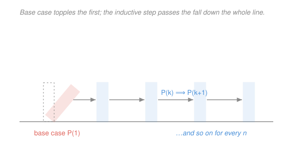

# How to Read & Write Proofs · Lesson 3.3: Induction and strong induction

> ⏱ ~15 min · Module 3: The objects you prove things about · Builds on: [2.1 Direct proof: unpacking definitions](02-01-direct-proof-definitions.md), [3.2 Functions: injective, surjective, bijective](03-02-functions-injective-surjective-bijective.md) · Unlocks: real-analysis, topology (course complete)

## Why this matters

A huge share of the claims you'll meet are really claims about *every* natural number at once: a formula that holds for all $n$, an algorithm that terminates in $n$ steps, a recursively built object of size $n$. You can't check infinitely many cases by hand. **Induction** is the one tool that proves a statement for all $n\ge n_0$ with a finite amount of work — and it's the finite backbone underneath every "add up infinitely many terms" argument in `real-analysis` (a series is just an induction you never stop running, [`calc-refresher` 3.1](../../calc-refresher/lessons/03-01-series-convergence-tests.md)). It's also the second half of this course's Boss problem 3: once a set has a bijection story, induction counts its $2^n$ subsets.

## The idea

Picture an infinite line of standing dominoes. You want to know that **every** domino falls. Checking them one at a time is hopeless — there are infinitely many. So you check two things instead:

1. **The first one falls.** (You physically tip it.)
2. **Any domino that falls knocks over the next.** (The spacing is close enough, everywhere.)

Together these force the conclusion with no gaps: the first falls (1), so the second falls (2), so the third falls (2 again), and the wave runs down the whole line forever. You proved something about *all* dominoes by checking one concrete case and one uniform "passing" rule.

That is induction exactly. Replace "domino $n$ falls" with any statement $P(n)$ you want to hold for every $n$. Tipping the first domino is the **base case**. The rule "a fallen domino knocks the next" is the **inductive step**. You never inspect a specific far-away domino — you prove that falling *propagates*, and let it propagate.

## The formal version

Let $P(n)$ be a statement depending on an integer $n$, and let $n_0$ be a starting value (usually $0$ or $1$). Here $\mathbb{N}=\{0,1,2,\dots\}$ is the natural numbers.

**Principle of mathematical induction.** To prove that $P(n)$ holds for all integers $n\ge n_0$, it suffices to prove:

- **(Base case)** $P(n_0)$ is true.
- **(Inductive step)** For every $k\ge n_0$, *if* $P(k)$ is true *then* $P(k+1)$ is true.

In words: nail the first case, then prove the machine that turns "true at $k$" into "true at $k+1$." The assumed hypothesis $P(k)$ inside the step has a name — the **inductive hypothesis**. It is the fallen domino you're allowed to lean on.

The step is itself a little direct proof of an implication $P(k)\implies P(k+1)$ (exactly the [2.1](02-01-direct-proof-definitions.md) skeleton: assume $P(k)$, do algebra, arrive at $P(k+1)$). You are *not* assuming $P(k+1)$ — that's the thing you must earn.

**Strong induction.** Same base case, but a beefier hypothesis: to prove $P(k+1)$ you may assume **all** of $P(n_0), P(n_0+1),\dots,P(k)$ at once, not merely the immediately previous $P(k)$.

- **(Strong inductive step)** For every $k\ge n_0$: if $P(n_0),\dots,P(k)$ are all true, then $P(k+1)$ is true.

In words: use every domino behind you, not just the last one. You reach for strong induction precisely when $P(k+1)$ breaks into *smaller* pieces that can land anywhere earlier — the flagship being "every integer $\ge 2$ is a product of primes," where $k+1=ab$ splits into two factors you can't predict.

**Well-ordering.** Both principles rest on one fact about $\mathbb{N}$: **every nonempty subset of $\mathbb{N}$ has a least element.** In words: you can't descend through the naturals forever. This is what a proof by induction is secretly using, and it powers the twin technique — the **minimal counterexample**: if $P$ failed somewhere, the set of failures would have a *smallest* member $m$; base case rules out $m=n_0$, and the inductive step manufactures a still-smaller failure from $m$, contradicting minimality. That is [2.2](02-02-contrapositive-and-contradiction.md)'s contradiction wearing an induction jersey.

## Picture

## Worked examples

**Example 1 (mechanical — the Gauss sum, second proof).** [2.1](02-01-direct-proof-definitions.md) proved $1+2+\cdots+n=\tfrac{n(n+1)}{2}$ by pairing terms. Here is the induction proof of the *same truth* — two roads, one destination.

Let $P(n)$ be the statement $1+2+\cdots+n=\dfrac{n(n+1)}{2}$.

*Base case* $n=1$: the left side is $1$; the right side is $\tfrac{1\cdot 2}{2}=1$. Equal, so $P(1)$ holds.

*Inductive step.* Fix $k\ge 1$ and assume $P(k)$: $\;1+2+\cdots+k=\tfrac{k(k+1)}{2}$. Add $k+1$ to both sides:

$$1+2+\cdots+k+(k+1)=\frac{k(k+1)}{2}+(k+1)=(k+1)\!\left(\frac{k}{2}+1\right)=\frac{(k+1)(k+2)}{2}.$$

The far right is exactly $\tfrac{(k+1)((k+1)+1)}{2}$, i.e. $P(k+1)$. By induction $P(n)$ holds for all $n\ge 1$. $\blacksquare$

Notice the whole content is one algebra line — glue $P(k)$ onto the new term $(k+1)$ and factor. That "add the next term, refold" is the rhythm of nearly every formula-induction.

**Example 2 (why you'd care — an inequality with a shifted base case).**

> **Claim.** $2^n > n^2$ for every integer $n\ge 5$.

The base case is *not* $n=0$: at $n=2,3,4$ the claim is false ($4\not>4$, $8<9$, $16=16$), so we must start at $5$.

*Base case* $n=5$: $2^5=32>25=5^2$. ✓

*Inductive step.* Fix $k\ge 5$ and assume $2^k>k^2$. Then

$$2^{k+1}=2\cdot 2^k > 2k^2.$$

It remains to show $2k^2\ge (k+1)^2$, i.e. $2k^2\ge k^2+2k+1$, i.e. $k^2-2k-1\ge 0$. For $k\ge 5$ this holds ($k^2-2k-1=k(k-2)-1\ge 5\cdot 3-1=14>0$). Chaining, $2^{k+1}>2k^2\ge (k+1)^2$, which is $P(k+1)$. By induction the claim holds for all $n\ge 5$. $\blacksquare$

The lesson inside the lesson: **check where the base case actually starts.** An inequality can be false for small $n$ and true forever after; induction is honest only if you plant the flag at the first $n$ that works.

## Watch out

- You might think the inductive step alone is a proof. It isn't — without a *true* base case the whole chain floats. "Proof" that $n=n+1$: assuming $k=k+1$ gives $k+1=k+2$… the step is fine, but no base case is true, so nothing is proved. **No base, no dominoes.**
- You might think you may "assume $P(k+1)$ to prove $P(k+1)$." That's circular — the classic hidden error. You assume $P(k)$ (or, in strong induction, everything below $k+1$) and must *derive* $P(k+1)$. If $P(k+1)$ appears as a justified step rather than the last line, the proof is worthless.
- You might think strong induction is a different axiom you must justify. It isn't stronger in power — over $\mathbb{N}$, ordinary induction, strong induction, and well-ordering are all equivalent. Reach for strong induction only when the recursion genuinely jumps back more than one step (like factoring $k+1=ab$), and reach for a minimal counterexample when a contradiction frame reads more naturally.

## One-liner

> Prove one case (the base), then prove that truth propagates (the step), and well-ordering carries it across all of $\mathbb{N}$ — dominoes, not infinitely many hand-checks.

## Problems

**P1 (🟢)** Prove by induction that $1+2+\cdots+n=\dfrac{n(n+1)}{2}$ for all integers $n\ge 1$. (Same identity as [2.1](02-01-direct-proof-definitions.md)'s Gauss-pairing problem — write the *induction* proof and note how the two differ in spirit.)

**P2 (🟡)** Prove that $n! > 2^n$ for every integer $n\ge 4$. Be careful about where the base case must sit.

**P3 (🔴, optional)** Prove by **strong induction** that every integer $n\ge 2$ is a product of one or more primes.

Solutions

**P1.** Let $P(n)$ be "$1+2+\cdots+n=\tfrac{n(n+1)}{2}$."

*Base case* $n=1$: LHS $=1$, RHS $=\tfrac{1\cdot 2}{2}=1$. So $P(1)$ holds.

*Inductive hypothesis.* Fix $k\ge 1$ and assume $P(k)$: $\;1+2+\cdots+k=\tfrac{k(k+1)}{2}$.

*Inductive step.* Add $(k+1)$ to both sides:

$$1+2+\cdots+k+(k+1)=\frac{k(k+1)}{2}+(k+1)=\frac{k(k+1)+2(k+1)}{2}=\frac{(k+1)(k+2)}{2},$$

which is $P(k+1)$. By induction $P(n)$ holds for all $n\ge 1$. $\blacksquare$

*How it differs from 2.1.* The pairing proof is a single global insight (fold the sum on itself); the induction proof is local and mechanical (assume one line below, add the next term). Same theorem — one shows *why* by symmetry, the other shows *that* by propagation.

**P2.** Let $P(n)$ be "$n! > 2^n$."

*Base case* $n=4$: $4!=24$ and $2^4=16$, and $24>16$. So $P(4)$ holds. (The claim fails for $n\le 3$: $3!=6<8=2^3$ — which is exactly why we start at $4$.)

*Inductive hypothesis.* Fix $k\ge 4$ and assume $k! > 2^k$.

*Inductive step.* Then

$$(k+1)! = (k+1)\cdot k! > (k+1)\cdot 2^k \ge 2\cdot 2^k = 2^{k+1},$$

where the first inequality uses the hypothesis and the second uses $k+1\ge 5\ge 2$. Thus $(k+1)! > 2^{k+1}$, i.e. $P(k+1)$. By induction $P(n)$ holds for all $n\ge 4$. $\blacksquare$

**P3.** Let $P(n)$ be "$n$ is a product of one or more primes." We prove $P(n)$ for all $n\ge 2$ by strong induction.

*Base case* $n=2$: $2$ is prime, hence a product of a single prime. So $P(2)$ holds.

*Strong inductive hypothesis.* Fix $k\ge 2$ and assume $P(m)$ for every integer $m$ with $2\le m\le k$.

*Inductive step.* Consider $k+1$. Two cases:

- If $k+1$ is prime, it is a product of one prime — $P(k+1)$ holds.
- If $k+1$ is not prime, then by definition it factors as $k+1=ab$ with integers $a,b$ satisfying $2\le a\le k$ and $2\le b\le k$. By the strong hypothesis, $a$ and $b$ are each products of primes; concatenating those two prime lists expresses $k+1=ab$ as a product of primes. So $P(k+1)$ holds.

Either way $P(k+1)$ follows. By strong induction, every integer $n\ge 2$ is a product of primes. $\blacksquare$

*Why strong induction is essential here:* $k+1=ab$ lands on factors $a,b$ that can be anywhere between $2$ and $k$ — not the single predecessor $k$. Ordinary induction, which only hands you $P(k)$, can't reach them; strong induction, which hands you the whole history, can.

## Flashback

**From Lesson 3.2 (Functions: injective, surjective, bijective):** Prove that the function $f:\mathbb{R}\to\mathbb{R}$ given by $f(x)=7-2x$ is a bijection, directly from the definitions (injective *and* surjective).

Solution

*Injective.* Suppose $f(x_1)=f(x_2)$ for some reals $x_1,x_2$. Then $7-2x_1=7-2x_2$; subtracting $7$ and dividing by $-2$ gives $x_1=x_2$. So distinct inputs can't share an output — $f$ is injective.

*Surjective.* Let $y\in\mathbb{R}$ be arbitrary. Set $x=\tfrac{7-y}{2}$, a real number. Then

$$f(x)=7-2\cdot\frac{7-y}{2}=7-(7-y)=y.$$

So every $y$ is hit — $f$ is surjective.

Being both injective and surjective, $f$ is a bijection; its inverse is $f^{-1}(y)=\tfrac{7-y}{2}$. $\blacksquare$

## Connections

- **Backward:** the inductive step *is* the [2.1](02-01-direct-proof-definitions.md) direct-proof skeleton applied to $P(k)\implies P(k+1)$; and the minimal-counterexample reframing is [2.2](02-02-contrapositive-and-contradiction.md)'s proof by contradiction, powered by well-ordering. Example 1 re-proves [2.1](02-01-direct-proof-definitions.md)'s Gauss sum, so you now hold two independent proofs of one identity.
- **Forward (course complete → real-analysis, topology):** induction is the finite engine behind infinite processes — a convergent series ([`calc-refresher` 3.1](../../calc-refresher/lessons/03-01-series-convergence-tests.md)) is an induction you run without stopping, and well-ordering / least-element arguments recur throughout analysis (the completeness of $\mathbb{R}$ is its continuous cousin).
- **Sideways (Boss problem 3 — the course capstone):** counting the subsets of an $n$-element set is a clean induction — adding one element $x$ doubles the subset count, because every subset of the larger set either contains $x$ or doesn't. That "either contains $x$ or doesn't" is a bijection to $\{0,1\}$-valued **indicator functions** (from [3.2](03-02-functions-injective-surjective-bijective.md)): a subset $\leftrightarrow$ its indicator, so $2^n$ subsets $=2^n$ indicator functions. The two big ideas of Module 3 — bijection and induction — meet exactly there.
