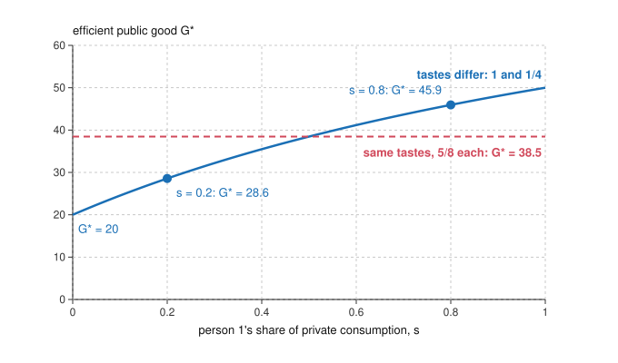

# Public Economics · Lesson 1.1: The Samuelson rule beyond quasilinearity

> ⏱ ~15 min · Module 1: Public goods · Builds on: [`grad-micro` 6.4 Public goods](../../grad-micro/lessons/06-04-public-goods.md), [`grad-micro` 6.3 Externalities](../../grad-micro/lessons/06-03-externalities-coase-theorem.md) · Unlocks: [1.2 Voluntary provision and crowding out](01-02-voluntary-provision-and-crowding-out.md), [2.4 Second best and the MCPF](02-04-second-best-and-the-marginal-cost-of-public-funds.md)

## Why this matters

This course asks one question eight ways: *where is the wedge, who bears it, and is the cure cheaper than the disease?* The eight modules run through public goods, tax incidence and excess burden, externality instruments, optimal commodity taxes, optimal income taxes, capital taxes, social insurance, and fiscal federalism. Throughout, social welfare weights are *inputs*: the course computes what follows from a given objective and leaves the choice of objective to [`philosophy-of-economics`](../../philosophy-of-economics/syllabus.md) and [`political-philosophy`](../../political-philosophy/syllabus.md). It starts where [`grad-micro` 6.3](../../grad-micro/lessons/06-03-externalities-coase-theorem.md) and [6.4](../../grad-micro/lessons/06-04-public-goods.md) stopped. That lesson's efficient quantity of a public good was one number. Once people's willingness to pay depends on their income, it is a whole menu of numbers, one for each distribution of income, and every cost-benefit test quietly picks one.

## The idea

Recall from [`grad-micro` 6.4](../../grad-micro/lessons/06-04-public-goods.md): with quasilinear utility, the efficient amount of a [public good](../reference.md#public-good) sets the *sum* of marginal willingness to pay equal to marginal cost, voluntary giving stops short of it, and personalized Lindahl prices would support it if people told the truth. Quasilinearity did one quiet job there. It made each person's willingness to pay for the good independent of their wealth, so a dollar moved from Ann to Bob changed nobody's valuation.

Drop that and look at a park. Ann loves parks. Bob barely notices them. Both value parks more when they are richer, because a richer person gives up less for each unit of park. If Ann holds most of the town's wealth, her marginal willingness to pay is large, the sum is large, and a big park passes the efficiency test. Move the wealth to Bob and the same sum shrinks: the efficient park is smaller. Neither allocation is "more efficient" than the other. Both are Pareto efficient, with different parks. The efficient quantity of a public good is not a fact about the good alone. It is a fact about the good *and* who holds the money.

## The formal version

**Setup.** There are $n$ people. Person $i$ consumes a private good $x_i$ and the public good $G$, which everyone consumes in full, with utility $u_i(x_i, G)$ increasing in both. Total private consumption is $X = \sum_i x_i$. Technology is a production possibility frontier $F(X, G) = 0$. Define person $i$'s marginal rate of substitution $\mathrm{MRS}^i_{Gx} = \dfrac{\partial u_i/\partial G}{\partial u_i/\partial x_i}$ (units of private good $i$ would give up for one more unit of $G$) and the marginal rate of transformation $\mathrm{MRT} = F_G/F_X$ (units of private good the economy gives up to make one more unit of $G$).

**Pareto problem.** Maximize $u_1(x_1, G)$ subject to $u_i(x_i, G) \ge \bar u_i$ for $i = 2, \dots, n$ and $F(\sum_i x_i, G) = 0$. With multipliers $\mu_i$ on the utility constraints ($\mu_1 = 1$) and $\gamma$ on technology, the first-order conditions for an interior optimum are

$$\mu_i \frac{\partial u_i}{\partial x_i} = \gamma F_X \ \ \text{for each } i, \qquad \sum_i \mu_i \frac{\partial u_i}{\partial G} = \gamma F_G.$$

Divide the second by $\gamma F_X$ and use the first for each $i$:

$$\sum_{i=1}^{n} \mathrm{MRS}^i_{Gx} = \mathrm{MRT}.$$

*In words:* this is the [Samuelson rule](../reference.md#samuelson-rule) (Samuelson 1954, *REStat*): the private goods everyone together would give up for one more unit of $G$ must equal what it costs to make. It holds at *every* Pareto optimum.

**The catch.** Each $\mathrm{MRS}^i$ is evaluated at person $i$'s own $x_i$. Varying the targets $\bar u_i$ traces out the Pareto frontier, and along it the $x_i$ change, so the $G$ that solves the rule changes too. *In words:* there is one efficient $G$ per point on the utility frontier, not one efficient $G$.

**When distribution does not matter.** Bergstrom and Cornes (1983, *Econometrica*) show that the efficient $G$ is independent of distribution exactly when each person's preferences can be represented as

$$u_i = A(G)\, x_i + B_i(G),$$

with $A$ common to everyone and $B_i$ free to differ. This is the [Bergstrom-Cornes condition](../reference.md#bergstrom-cornes-condition). Then $\mathrm{MRS}^i = (A'(G)\,x_i + B_i'(G))/A(G)$, and the sum is $\big(A'(G)\,X + \sum_i B_i'(G)\big)/A(G)$: it depends only on total $X$, never on how $X$ is split. *In words:* willingness to pay may rise with income, but at the same rate for everyone, so a transfer raises one person's valuation exactly as much as it lowers the other's. Quasilinearity is the case $A \equiv 1$. So is identical Cobb-Douglas, $u_i = \ln x_i + \alpha \ln G$, since $x_i G^{\alpha}$ represents the same preferences.

**Impure and club goods.** Pure public goods are rare. An [impure public good](../reference.md#impure-public-good) is a joint product with a private and a public side: a vaccination protects you and lowers everyone's infection risk. A [club good](../reference.md#club-good) (Buchanan 1965, *Economica*) is excludable but congestible, so it is partly rival: a pool is shared, but each extra swimmer crowds the rest. Take a facility of fixed cost $C$ shared equally by $n$ members, each suffering a congestion cost $h(n)$ with $h' > 0$. Members want to minimize average cost $C/n + h(n)$. The first-order condition is

$$n\,h'(n) = \frac{C}{n}.$$

*In words:* admit members until the congestion the newcomer imposes on everyone, $n\,h'(n)$, equals the cost share the newcomer takes over, $C/n$. Charge that congestion as an entry toll and the toll revenue, $n \cdot n\,h'(n)$, equals $C$: an efficiently priced club pays for itself. (If the facility's size is also chosen, it obeys Samuelson within the club: members' summed MRS equals the MRT.)

## Picture

This is Example 1. The blue curve is the menu of Pareto-efficient parks: every point on it satisfies the Samuelson rule. The dashed red line gives the same two people identical tastes, which puts them in the Bergstrom-Cornes class, and the menu collapses to a single number.

## Worked examples

**Example 1 (the menu of efficient parks).** Invented numbers. Two people have $u_1 = \ln x_1 + \ln G$ and $u_2 = \ln x_2 + \tfrac14 \ln G$. The frontier is linear, $X + G = 100$, so $\mathrm{MRT} = 1$. Here $\mathrm{MRS}^i = \alpha_i x_i / G$ with $\alpha = (1, \tfrac14)$. Let $s$ be person 1's share of private consumption, so $x_1 = sX$ and $x_2 = (1-s)X$. Samuelson gives

$$\frac{\bar\alpha X}{G} = 1, \qquad \bar\alpha \equiv s\cdot 1 + (1-s)\cdot\tfrac14.$$

With $X = 100 - G$, this solves to $G^* = 100\,\bar\alpha/(1+\bar\alpha)$.

- *Person 1 holds 80 percent* ($s = 0.8$): $\bar\alpha = 0.85$, $G^* = 85/1.85 = 45.9$, $X = 54.1$. The MRS are 0.94 and 0.06, summing to 1.
- *Person 1 holds 20 percent* ($s = 0.2$): $\bar\alpha = 0.4$, $G^* = 40/1.4 = 28.6$, $X = 71.4$. Both MRS are 0.5.

Both allocations are Pareto efficient. Moving wealth toward the park lover raises the efficient park by 61 percent. The park is not simply "too big" at one and "too small" at the other: at $s = 0.8$, cutting $G$ to 28.6 makes the summed MRS 2.1, above the MRT of 1, so that smaller park is inefficient *at that distribution*. As $s$ runs from 0 to 1, $G^*$ runs from 20 to 50. Give both people the average taste, $\alpha = \tfrac58$, and $G^* = 500/13 = 38.5$ for every $s$.

Why you would care: a cost-benefit analysis that sums willingness to pay at today's incomes is testing efficiency *at today's distribution*. Redistribute, and the same project can flip from pass to fail with no change in technology or tastes. The measurement is not neutral about who holds income, even when nobody intends it to be.

**Example 2 (sizing a club).** Invented numbers. A community pool costs 900 dollars a season. Each member's congestion cost is $h(n) = n/4$ dollars, so each extra swimmer costs every member a quarter. The rule $n\,h'(n) = C/n$ reads $n/4 = 900/n$, so $n^2 = 3600$ and $n = 60$. Each member pays a share of 15 and bears congestion of 15, for an average cost of 30. Half the size (30 members) or double (120) raises average cost to 37.5. The efficient toll is the congestion a newcomer imposes, $60 \times \tfrac14 = 15$, and 60 tolls of 15 cover the 900 exactly. The pool is non-rival up to a point and rival beyond it: congestion makes it a partial private good, and exclusion lets a price do the rationing that a pure public good cannot have.

## Watch out

- You might think the Samuelson rule picks out *the* efficient $G$, but actually it picks one per point on the Pareto frontier. Only under the Bergstrom-Cornes form does it deliver a single number.
- You might think Cobb-Douglas utility always makes $G^*$ depend on distribution, but actually identical Cobb-Douglas is in the Bergstrom-Cornes class. What breaks independence is income effects that *differ* across people, as with $\alpha = (1, \tfrac14)$.
- You might think "efficient $G$ depends on distribution" is a claim about fairness, but actually it is a positive statement. Choosing among the efficient points needs welfare weights, which this course takes as given.
- You might think a club good is just a public good with a gate, but actually congestion makes it partly rival, and that is what gives the club an optimal size.

## One-liner

> $\sum_i \mathrm{MRS}^i = \mathrm{MRT}$ holds at every efficient allocation, but with income effects that differ across people each distribution of wealth has its own efficient $G$; only the Bergstrom-Cornes form $A(G)x_i + B_i(G)$ makes the answer a single number.

## Problems

**P1 (🟢) *(Formal.)*** Invented numbers. Two people have $u_1 = \ln x_1 + \tfrac12 \ln G$ and $u_2 = \ln x_2 + \tfrac32 \ln G$. The frontier is $X + 3G = 120$. (a) Write the Samuelson condition for this economy. (b) Find the efficient $G$, $X$ and each person's $x_i$ when person 2 holds one quarter of private consumption, and again when person 2 holds three quarters. (c) By what percentage does the efficient $G$ rise between the two?

**P2 (🟡) *(Formal (a) · Exegetical (b).)*** For each profile, say whether the efficient $G$ is independent of distribution, naming the reason. (i) $u_i = \ln x_i + \tfrac12 \ln G$ for both people. (ii) $u_1 = \ln x_1 + \ln G$, $u_2 = \ln x_2 + 2 \ln G$. (iii) $u_1 = x_1 + 4\sqrt{G}$, $u_2 = x_2 + 6\sqrt{G}$. (a) Where independent, compute $G^*$ with the frontier $X + G = 90$ (assume an interior solution). (b) In two sentences: why does quasilinearity, the [`grad-micro` 6.4](../../grad-micro/lessons/06-04-public-goods.md) assumption, give a unique efficient $G$?

**P3 (🔴, optional) *(Formal.)*** Invented numbers. A shared makerspace costs 2,000 dollars a year. Congestion costs each member $h(n) = n^2/1000$ dollars. (a) Find the size that minimizes average cost per member, and the cost share, congestion cost and average cost at that size. (b) Find the efficient entry toll and show that tolls alone cover the 2,000. (c) Compare average cost at 50 and at 200 members.

Solutions

**P1** *(Formal.)*

(a) $\mathrm{MRS}^i = \alpha_i x_i/G$ and $\mathrm{MRT} = 3$, so $\dfrac{\tfrac12 x_1 + \tfrac32 x_2}{G} = 3$.

(b) Write $x_2 = s_2 X$ and $\bar\alpha = \tfrac12(1-s_2) + \tfrac32 s_2$. Samuelson gives $3G = \bar\alpha X$; the frontier gives $X + \bar\alpha X = 120$, so $X = 120/(1+\bar\alpha)$ and $G = \bar\alpha X/3$.

- $s_2 = \tfrac14$: $\bar\alpha = \tfrac34$, $X = 120/1.75 = 68.57$, $G = 0.75 \times 68.57/3 = 17.14$; $x_1 = 51.43$, $x_2 = 17.14$.
- $s_2 = \tfrac34$: $\bar\alpha = \tfrac54$, $X = 120/2.25 = 53.33$, $G = 1.25 \times 53.33/3 = 22.22$; $x_1 = 13.33$, $x_2 = 40$.

Check the first: $(0.5 \times 51.43 + 1.5 \times 17.14)/17.14 = 3$.

(c) $22.22/17.14 = 1.296$: about 30 percent more.

**Wrong turns:** setting the sum of MRS equal to 1 instead of the MRT of 3; averaging the $\alpha_i$ with equal weights instead of weighting by each person's private consumption.

---

**P2** *(Formal (a) · Exegetical (b).)*

Classification:

- (i) Independent: $x_i G^{1/2}$ represents the same preferences, the Bergstrom-Cornes form with $A(G) = G^{1/2}$, $B_i = 0$.
- (ii) Not independent: the implied $A_i(G) = G^{\alpha_i}$ differs across people. Summed MRS is $(x_1 + 2x_2)/G$, which rises when wealth moves to person 2 (on $X + G = 90$, $G^* = 54$ when person 1 holds half of $X$, 57.9 when person 1 holds a fifth).
- (iii) Independent: quasilinear, $A \equiv 1$.

(a) (i): $\tfrac12 X/G = 1$ and $X + G = 90$ give $X = 60$, $G^* = 30$. (iii): $\dfrac{4 + 6}{2\sqrt G} = 1$, so $\sqrt G = 5$ and $G^* = 25$, with $X = 65$ split any way.

**Must hit, strict (b):**

- Under quasilinearity each MRS is $b_i'(G)$, a function of $G$ alone, with no income effect.
- So the summed MRS, and the $G$ solving Samuelson, cannot change when private consumption is redistributed (at interior allocations).

**Wrong turns:** classifying (i) as distribution-dependent because it is not quasilinear; forgetting that the result needs every $x_i > 0$, since a corner where someone's private consumption hits zero breaks the argument.

**Model answer (b):** With $u_i = x_i + b_i(G)$, each person's MRS is $b_i'(G)$, which does not depend on their wealth. So a transfer changes no one's valuation, the summed MRS depends on $G$ alone, and the Samuelson rule has one solution whatever the distribution.

---

**P3** *(Formal.)*

(a) Minimize $2000/n + n^2/1000$: the condition $n\,h'(n) = C/n$ reads $2n^2/1000 = 2000/n$, so $n^3 = 1{,}000{,}000$ and $n = 100$. Cost share $2000/100 = 20$, congestion $100^2/1000 = 10$, average cost 30 dollars.

(b) The toll is the congestion a newcomer imposes on everyone, $n\,h'(n) = 2 \times 100^2/1000 = 20$ dollars. One hundred tolls of 20 raise 2,000, exactly the cost. This is general: at the optimum $n \cdot n\,h'(n) = n \cdot C/n = C$.

(c) At 50: $40 + 2.5 = 42.5$. At 200: $10 + 40 = 50$. Both exceed 30.

**Wrong turns:** setting the cost share equal to the congestion cost ($20 \ne 10$ here; they coincide only when $h$ is linear, as in Example 2); pricing the toll at the newcomer's own congestion $h(n) = 10$ rather than what the newcomer imposes on all $n$ members.

## Connections

- **Backward:** [`grad-micro` 6.4](../../grad-micro/lessons/06-04-public-goods.md) derived the rule under quasilinearity, plus Nash underprovision and [Lindahl prices](../reference.md#lindahl-prices); this lesson removes quasilinearity. The derivation is a Lagrangian with shadow prices ([`grad-micro` 1.4](../../grad-micro/lessons/01-04-envelope-theorem-duality.md)), and the Pareto frontier being traced is that of [`grad-micro` 4.4](../../grad-micro/lessons/04-04-two-welfare-theorems.md).
- **Forward:** [1.2](01-02-voluntary-provision-and-crowding-out.md) asks what private giving does when the government redistributes, where income effects decide the answer. [1.3](01-03-revealing-demand-for-public-goods.md) asks how anyone learns the MRS. [2.4](02-04-second-best-and-the-marginal-cost-of-public-funds.md) replaces the MRT by MRT times the marginal cost of public funds when lump-sum taxes are unavailable. Local public goods and clubs return in [8.1](08-01-tiebout-voting-with-your-feet.md).
- **Sideways:** choosing a point on the Pareto frontier needs a social welfare function ([`grad-micro` 6.5](../../grad-micro/lessons/06-05-social-choice-welfare.md)); which one is right belongs to [`philosophy-of-economics`](../../philosophy-of-economics/syllabus.md) and [`decision-theory`](../../decision-theory/syllabus.md). Kant's worry about free riding ([`ethics` 2.2](../../ethics/lessons/02-02-the-formula-of-universal-law.md)) is the moral mirror of the gap between one person's MRS and the sum.
