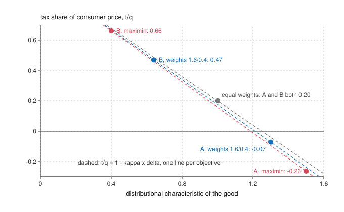

# Public Economics · Lesson 4.2: Equity and complementarity: many-person Ramsey and Corlett-Hague

> ⏱ ~15 min · Module 4: Optimal commodity taxation · Builds on: [4.1 The Ramsey rule](04-01-the-ramsey-rule.md), [`grad-micro` 2.4 The Slutsky equation](../../grad-micro/lessons/02-04-slutsky-equation-comparative-statics.md), [`grad-micro` 6.5 Social choice and welfare](../../grad-micro/lessons/06-05-social-choice-welfare.md) · Unlocks: [4.3 Production efficiency: Diamond-Mirrlees](04-03-production-efficiency-diamond-mirrlees.md), [5.1 The linear income tax](05-01-the-linear-income-tax.md), [6.1 Atkinson-Stiglitz](06-01-atkinson-stiglitz.md)

## Why this matters

The [Ramsey rule](../reference.md#ramsey-rule) of [4.1](04-01-the-ramsey-rule.md) has one consumer, so it can only care about efficiency: tax what people cannot stop buying. Real tax systems face two complications it ignores. Consumers differ, and a government that weights some of them more will not want to tax the goods they buy. And one good, leisure, cannot be taxed at all, so the rule must work around the hole. This lesson adds both. Together they explain why rate schedules differ across goods, and when the right answer is a single uniform rate after all.

## The idea

**Equity.** Suppose the government values a dollar in a poor household's hands more than a dollar in a rich one's. A tax on a good takes money from whoever buys it, in proportion to how much they buy. So each good carries a verdict on *whose* dollars it collects: bus fares collect disproportionately from the poor, restaurant meals from the rich. The single number that summarizes this is the good's **distributional characteristic**: the average welfare weight of its buyers, each weighted by how many units they buy. The many-person rule says: lower the tax on high-characteristic goods, raise it on low ones, and trade this off against elasticity, because the efficiency logic of 4.1 has not gone away.

A miniature: two goods equally elastic, so single-person Ramsey says tax them equally. If the poor buy three-quarters of good A and a fifth of good B, a government with any preference for the poor now taxes B more heavily than A, and, if it cares enough, subsidizes A.

**Complementarity.** A lump-sum tax is out of reach, and the next best thing would be a uniform tax on *everything*, leisure included, which cannot be dodged. Leisure is untaxable, so every commodity tax pushes people toward it. The fix: tax more heavily the goods people consume *with* leisure (vacations, golf), since that is an indirect tax on leisure itself, and tax lightly the goods that go with work (childcare, commuting). That is Corlett and Hague (1953, *Review of Economic Studies*), and it holds even with a single consumer. It is pure efficiency.

## The formal version

**Setup.** Households $h=1,\dots,H$ buy goods $i=1,\dots,n$. Producer prices $p_i$ are fixed; consumer prices are $q_i=p_i+t_i$ (in this module $q$ is a *price*), with $t_i$ a unit tax. Household $h$ has income $m^h$, demand $x_i^h(q,m^h)$ and indirect utility $v^h(q,m^h)$; aggregate demand is $X_i=\sum_h x_i^h$. A social welfare function $W(v^1,\dots,v^H)$ ranks outcomes. The government maximizes $W$ subject to raising revenue $R=\sum_i t_iX_i$; its multiplier $\lambda$ is the social value of a dollar of public revenue, the [marginal cost of public funds](../reference.md#marginal-cost-of-public-funds) of [2.4](02-04-second-best-and-the-marginal-cost-of-public-funds.md).

Let $\beta^h=\frac{\partial W}{\partial v^h}\frac{\partial v^h}{\partial m^h}$, the social value of one more dollar to household $h$, with average $\bar\beta$. The course's [social marginal welfare weights](../reference.md#social-marginal-welfare-weights) are $g_h=\beta^h/\bar\beta$, which average one.

*In words:* $g_h=1.6$ means society values a dollar to household $h$ at 1.6 times an average dollar. Which weights are right is not this course's question (see [`philosophy-of-economics`](../../philosophy-of-economics/syllabus.md) and [`political-philosophy`](../../political-philosophy/syllabus.md)); here they are inputs.

**Diamond's [many-person Ramsey rule](../reference.md#many-person-ramsey-rule)** (Diamond 1975, *Journal of Public Economics*). Differentiate the Lagrangian in $t_k$, use Roy's identity $\partial v^h/\partial q_k=-(\partial v^h/\partial m^h)\,x_k^h$, split each price effect with Slutsky ([`grad-micro` 2.4](../../grad-micro/lessons/02-04-slutsky-equation-comparative-statics.md)), and use symmetry of the substitution terms. At an interior optimum, for every taxed good $k$:

$$-\frac{\sum_i t_i S_{ki}}{X_k}=1-\sum_h \frac{x_k^h}{X_k}\,b^h,\qquad b^h=\frac{\beta^h}{\lambda}+\sum_i t_i\frac{\partial x_i^h}{\partial m^h},$$

where $S_{ki}=\sum_h \partial x_k^{h,c}/\partial q_i$ is the aggregate compensated (Hicksian) response of good $k$ to the price of good $i$.

*In words:* the tax system shrinks compensated demand for good $k$ by a proportion that is smaller the more of $k$ is bought by households whose dollars are socially valuable. Here $b^h$ is the net value of giving $h$ a dollar, counting the tax revenue that dollar generates when spent.

Drop the small revenue term in $b^h$ (it vanishes with quasilinear utility), so $b^h=\kappa\,g_h$ with $\kappa=\bar\beta/\lambda$. Define the [distributional characteristic](../reference.md#distributional-characteristic) of good $k$ (following Feldstein 1972, *American Economic Review*):

$$\delta_k=\sum_h g_h\,\frac{x_k^h}{X_k}.$$

*In words:* $\delta_k$ is the average welfare weight of good $k$'s buyers, weighted by their shares of its consumption. It equals 1 when everyone buys the same amount, exceeds 1 when high-$g$ households buy more. The rule becomes

$$-\frac{\sum_i t_i S_{ki}}{X_k}=1-\kappa\,\delta_k .$$

With one household, $\delta_k=1$ for every good and the right side is the constant of 4.1's rule. With independent demands ($S_{ki}=0$ for $i\neq k$) and $\tau_k=t_k/q_k$ the tax as a share of the consumer price, it becomes an [inverse elasticity rule](../reference.md#inverse-elasticity-rule) with an equity correction:

$$\tau_k=\frac{1-\kappa\,\delta_k}{|\varepsilon_k|},$$

where $\varepsilon_k<0$ is the [compensated own-price elasticity](../reference.md#compensated-elasticity) of aggregate demand. *In words:* tax a good more the less elastic it is and the less its buyers count.

**Corlett-Hague.** Now one household (or equal $\delta$'s) and three goods: leisure, good 0, whose price is the wage $w$ and whose tax is fixed at zero, and taxable goods 1 and 2. Let $\varepsilon_{ki}$ be the compensated elasticity of good $k$ with respect to price $i$. The Ramsey rule for $k=1,2$ reads $\tau_1\varepsilon_{k1}+\tau_2\varepsilon_{k2}=-\theta$, with $\theta$ the common proportional reduction. Compensated demand is homogeneous of degree zero in prices, so $\varepsilon_{k0}+\varepsilon_{k1}+\varepsilon_{k2}=0$. Solving,

$$\frac{\tau_1}{\tau_2}=\frac{\varepsilon_{20}+\varepsilon_{12}+\varepsilon_{21}}{\varepsilon_{10}+\varepsilon_{12}+\varepsilon_{21}}.$$

*In words:* [Corlett-Hague](../reference.md#corlett-hague): with a positive denominator, the good with the smaller cross-elasticity with the wage (the closer complement to leisure) gets the higher rate. Rates are equal exactly when $\varepsilon_{10}=\varepsilon_{20}$.

**When uniform rates are optimal** ([uniform commodity taxation](../reference.md#uniform-commodity-taxation)):

- One consumer, commodity taxes only: when goods are weakly separable from leisure with a homothetic sub-utility, since then a wage change moves all compensated goods demands in proportion, so $\varepsilon_{10}=\varepsilon_{20}$.
- Many consumers with an optimal *linear* income tax (a lump-sum grant plus a flat rate): weak separability plus linear Engel curves makes differentiated commodity taxes unnecessary (Deaton 1979, *Economics Letters*). The income tax then does all the redistributing.
- With an optimal *nonlinear* income tax, weak separability alone suffices: Atkinson and Stiglitz (1976), proved in [6.1](06-01-atkinson-stiglitz.md).

## Picture

Each dot is a good under one objective from Example 1. With equal weights both goods sit at $\delta=1$ and pay 20 percent; as the weights tilt toward household P, good A slides down its line into a subsidy and good B climbs.

## Worked examples

**Example 1 (the many-person rule, three objectives).** An invented economy has two households, P and R, and two goods with producer prices 1. Utility is quasilinear with unit-elastic demand for each good ($|\varepsilon|=1$, no cross effects), so aggregate spending on each is fixed at 50 and revenue is $50(\tau_A+\tau_B)$. The government needs 20. P buys 75 percent of good A (transit) and 20 percent of good B (restaurant meals).

*Equal weights* $g=(1,1)$: $\delta_A=\delta_B=1$, so $\tau_A=\tau_B=1-\kappa$. Revenue $50\cdot2(1-\kappa)=20$ gives $\kappa=0.8$ and a uniform 20 percent.

*Weights* $g=(1.6,0.4)$: $\delta_A=0.75(1.6)+0.25(0.4)=1.3$ and $\delta_B=0.2(1.6)+0.8(0.4)=0.64$. Revenue $50(2-1.94\kappa)=20$ gives $\kappa=0.8247$, so

$$\tau_A=1-0.8247(1.3)=-0.072,\qquad \tau_B=1-0.8247(0.64)=0.472.$$

Transit is subsidized at about 7 percent of its price; restaurant meals carry 47 percent.

*Maximin* $g=(2,0)$: $\delta_A=1.5$, $\delta_B=0.4$, $\kappa=0.8421$, $\tau_A=-0.263$, $\tau_B=0.663$.

A brute-force numerical maximization of weighted welfare subject to the revenue constraint reproduces all three answers. The elasticities never changed; only whose dollars each good collects. Which of the three objectives to adopt the model cannot say.

**Example 2 (Corlett-Hague).** Good 1 is vacation packages, good 2 is childcare, with equal spending on each. Compensated elasticities: $\varepsilon_{11}=-0.2$, $\varepsilon_{22}=-0.8$, $\varepsilon_{12}=\varepsilon_{21}=0.3$ (equal because spending is equal, by Slutsky symmetry). Homogeneity gives the wage cross-elasticities: $\varepsilon_{10}=0.2-0.3=-0.1$ (vacations complement leisure: a higher wage means less leisure and fewer vacations) and $\varepsilon_{20}=0.8-0.3=0.5$ (childcare goes with work). Then

$$\frac{\tau_1}{\tau_2}=\frac{0.5+0.6}{-0.1+0.6}=2.2.$$

Solving the two Ramsey equations with $\theta=0.02$ gives $\tau_1=0.314$ and $\tau_2=0.143$; check: $0.314(-0.2)+0.143(0.3)=-0.02$. Note that 4.1's inverse elasticity rule, ignoring cross effects, would tax childcare at a quarter of the vacation rate; complementarity moves the ratio from 4 to 2.2, but in the same direction. Here equity was off: the tilt is pure efficiency.

## Watch out

- You might think a good the poor buy always gets a low rate. Actually the rule trades $\delta_k$ against elasticity: a very inelastic good with $\delta_k>1$ can still carry a higher rate than an elastic one with $\delta_k<1$.
- You might think $\delta_k$ tracks budget shares. It tracks *consumption* shares: who buys the units, not who devotes the larger fraction of income.
- You might think Corlett-Hague taxes vacations because the rich buy them. No: it holds with one consumer. It is about the untaxable good, not about distribution.
- You might think uniform rates are a neutral default. They are optimal only under the separability conditions above; what they buy you, given a good income tax, is that the rate schedule need not redistribute.

## One-liner

> Tax a good less when its buyers count more (Diamond) and more when it goes with leisure (Corlett-Hague); with separable preferences and a good income tax, both corrections vanish and a uniform rate is optimal.

## Problems

**P1 (🟢) *(Formal (a)–(b) · Exegetical (c).)*** An invented economy has two households: P with income 20 and R with income 80 (thousands of dollars), and welfare weights $g_P=1.5$, $g_R=0.5$. Budget shares: bus fares 10 percent for P and 2.5 percent for R; home heating 10 percent and 5 percent; books 1 percent and 5 percent. (a) Find each good's distributional characteristic, and its value under maximin weights $g=(2,0)$. (b) Demands are independent, with compensated elasticities $-0.5$ (bus), $-0.8$ (heating) and $-1.5$ (books). Taking $\kappa=0.9$ as given, find each good's optimal $\tau=t/q$ under $g=(1.5,0.5)$. (c) In two sentences, explain why heating has $\delta<1$ even though P devotes twice R's budget share to it.

**P2 (🟡) *(Formal (a) · Exegetical (b)–(c).)*** One consumer buys leisure (good 0, untaxed) and two taxable goods with equal spending: home-office equipment (good 1) and sports gear (good 2). Compensated elasticities: $\varepsilon_{11}=-0.6$, $\varepsilon_{22}=-0.4$, $\varepsilon_{12}=\varepsilon_{21}=0.2$. (a) Find $\varepsilon_{10}$, $\varepsilon_{20}$ and $\tau_1/\tau_2$; if $\theta=0.04$, find both rates. (b) Which good is the closer complement to leisure, and does the answer to (a) agree with Corlett-Hague? (c) State the condition on this elasticity table under which uniform rates would be optimal, and a preference structure that delivers it in this one-consumer model.

Solutions

**P1** *(Formal (a)–(b) · Exegetical (c).)*

(a) Spending is budget share times income. Bus: P spends $0.10\times20=2$, R spends $0.025\times80=2$, so P's share is $1/2$. Heating: 2 and 4, P's share $1/3$. Books: 0.2 and 4, P's share $0.2/4.2=1/21\approx0.048$. With two households, $\delta=g_R+(g_P-g_R)s_P=0.5+s_P$:

$$\delta_{\text{bus}}=1,\qquad \delta_{\text{heat}}=5/6\approx0.833,\qquad \delta_{\text{books}}=23/42\approx0.548.$$

Under maximin, $\delta=2s_P$: 1, 0.667 and 0.095.

(b) $\tau=(1-0.9\,\delta)/|\varepsilon|$:

$$\tau_{\text{bus}}=\frac{0.1}{0.5}=0.20,\qquad \tau_{\text{heat}}=\frac{0.25}{0.8}=0.3125,\qquad \tau_{\text{books}}=\frac{0.5071}{1.5}=0.338.$$

**Wrong turns:** computing $\delta$ from budget shares ($0.5\cdot1.5\cdot0.10+\dots$) rather than from shares of the good's total consumption; forgetting to divide by the elasticity, which puts books at 0.51 instead of 0.34.

**Must hit, strict (c):**

- $\delta$ weights each household by its share of the good's *units* (or spending), not its budget share.
- R's income is four times P's, so half of P's budget share still leaves R buying two-thirds of the heating.

**Model answer (c):** The distributional characteristic weights each buyer by her share of total consumption of the good, and R, with four times P's income, buys 4 of the 6 units of heating spending despite the lower budget share. So a heating tax collects two-thirds of its revenue from the low-weight household, and $\delta=0.5+1/3<1$.

---

**P2** *(Formal (a) · Exegetical (b)–(c).)*

(a) Homogeneity: $\varepsilon_{10}=-\varepsilon_{11}-\varepsilon_{12}=0.6-0.2=0.4$ and $\varepsilon_{20}=0.4-0.2=0.2$. Then

$$\frac{\tau_1}{\tau_2}=\frac{\varepsilon_{20}+\varepsilon_{12}+\varepsilon_{21}}{\varepsilon_{10}+\varepsilon_{12}+\varepsilon_{21}}=\frac{0.6}{0.8}=0.75.$$

Solve $-0.6\tau_1+0.2\tau_2=-0.04$ and $0.2\tau_1-0.4\tau_2=-0.04$: $\tau_1=0.12$, $\tau_2=0.16$. Check: $-0.072+0.032=-0.04$ and $0.024-0.064=-0.04$.

**Wrong turns:** reading $\tau_1/\tau_2$ off the inverse elasticity rule ($0.4/0.6=0.67$), which drops the cross effects; getting the sign of homogeneity wrong and finding $\varepsilon_{10}=-0.4$.

**Must hit, strict (b):**

- Sports gear: $\varepsilon_{20}=0.2<\varepsilon_{10}=0.4$, so a wage rise (dearer leisure) cuts its compensated demand relative to home-office equipment.
- Yes: the closer leisure complement carries the higher rate, 16 against 12 percent.

**Must hit, strict (c):**

- Uniform rates are optimal iff $\varepsilon_{10}=\varepsilon_{20}$.
- Goods weakly separable from leisure with a homothetic sub-utility over goods delivers it.

**Model answer (c):** Rates are equal exactly when the two goods have the same compensated cross-elasticity with the wage. That holds when utility has the form $U(\phi(x_1,x_2),\ell)$ with $\phi$ homothetic, since a wage change then scales both goods' compensated demands in the same proportion. With a nonlinear income tax, 6.1 shows separability alone suffices.

## Flashback

**From Lesson [3.3](03-03-pigou-in-a-second-best-world.md) (Pigou in a second-best world):** *(Formal (a)–(b) · Exegetical (c).)* Sandmo's setting, invented numbers: utility is quasilinear, a dirty good has demand $x=80-2q$ independent of other prices, where $q=10+t$ is its consumer price (producer price 10, unit tax $t$), and the marginal cost of public funds $\lambda$ is taken as fixed. With $\lambda=1.5$, the government taxes the good at 14 per unit and says that rate is optimal. (a) What marginal external damage $\mathrm{MED}$ per unit makes 14 optimal? Split the tax into its Ramsey and Pigouvian terms. (b) Holding that $\mathrm{MED}$, find the optimal tax if $\lambda$ rises to 2. What would the benchmark rule (goods weakly separable from leisure, homothetic goods preferences) give at $\lambda=1.5$ and at $\lambda=2$? (c) In one sentence, why does a costlier public purse raise the tax here but lower it in the benchmark?

Solution

(a) At $t=14$: $q=24$, $x=32$ and $|x'|=2$, so $x/|x'|=16$. The Ramsey term is $\tfrac{\lambda-1}{\lambda}\cdot\tfrac{x}{|x'|}=\tfrac{0.5}{1.5}\times16=\tfrac{16}{3}\approx5.33$. The Pigouvian term is the rest, $14-\tfrac{16}{3}=\tfrac{26}{3}\approx8.67$, and it equals $\mathrm{MED}/1.5$, so $\mathrm{MED}=13$. The optimal tax exceeds marginal damage.

(b) With $x/|x'|=30-t$, the rule at $\lambda=2$ is $t=\tfrac{13}{2}+\tfrac12(30-t)$, so $1.5\,t=21.5$ and $t=\tfrac{43}{3}\approx14.33$: a Ramsey term of $\tfrac{47}{6}\approx7.83$ plus a Pigouvian term of 6.5. A direct numerical maximization of $\mathrm{CS}-13x+\lambda t x$ agrees at both values of $\lambda$. The benchmark rule $t=\mathrm{MED}/\lambda$ gives $\tfrac{26}{3}\approx8.67$ at $\lambda=1.5$ and 6.5 at $\lambda=2$.

**Must hit, strict (c):**

- Here the dirty good is an independent revenue base, so it carries a positive Ramsey term scaled by $(\lambda-1)/\lambda$, which rises with $\lambda$ by more than the Pigouvian term $\mathrm{MED}/\lambda$ falls.
- In the benchmark, separability and homotheticity make the Ramsey term zero, so only $\mathrm{MED}/\lambda$ is left, and it falls as $\lambda$ rises.

**Model answer (c):** Here the good is taxed partly as a fairly inelastic revenue source, and that Ramsey term grows with the value of revenue faster than the scaled-down Pigouvian term shrinks; in the benchmark the Ramsey term is zero, so the tax is just $\mathrm{MED}/\lambda$ and falls as $\lambda$ rises.

**Wrong turns:** multiplying $\mathrm{MED}$ by $\lambda$ instead of dividing; evaluating $x$ at the untaxed price ($x/|x'|=20$), which gives a Ramsey term of $\tfrac{20}{3}$ and $\mathrm{MED}=11$.

## Connections

- **Backward:** the single-person [Ramsey rule](../reference.md#ramsey-rule) of [4.1](04-01-the-ramsey-rule.md) is the special case $\delta_k=1$. The derivation is Roy's identity plus Slutsky ([`grad-micro` 2.4](../../grad-micro/lessons/02-04-slutsky-equation-comparative-statics.md)), and $\lambda$ is [2.4](02-04-second-best-and-the-marginal-cost-of-public-funds.md)'s MCPF, a Lagrange multiplier read as a shadow price ([`grad-micro` 1.4](../../grad-micro/lessons/01-04-envelope-theorem-duality.md)). The weights come from a social welfare function of [`grad-micro` 6.5](../../grad-micro/lessons/06-05-social-choice-welfare.md).
- **Forward:** [4.3](04-03-production-efficiency-diamond-mirrlees.md) asks which prices to tax at all (final goods, not inputs). [5.1](05-01-the-linear-income-tax.md) gives the government the linear income tax behind Deaton's result, with the same $g$'s. [6.1](06-01-atkinson-stiglitz.md) proves the nonlinear-tax version and applies it to saving, which is a tax on future consumption.
- **Sideways:** a regulated public utility that must price above marginal cost to cover its fixed cost faces the same trade-off, and adding distributional weights to its pricing problem is exactly Feldstein's 1972 question. Which weights to use is a question for [`philosophy-of-economics`](../../philosophy-of-economics/syllabus.md), [`political-philosophy`](../../political-philosophy/syllabus.md) and [`decision-theory`](../../decision-theory/syllabus.md).
