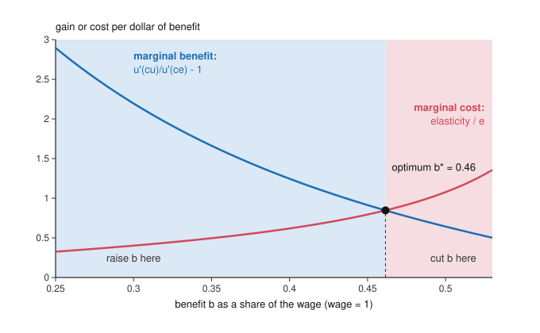

# Public Economics · Lesson 7.2: Optimal unemployment insurance: Baily-Chetty

> ⏱ ~15 min · Module 7: Social insurance and the welfare state · Builds on: [7.1 Adverse selection as a policy problem](07-01-adverse-selection-as-a-policy-problem.md), [`grad-micro` 5.4 Moral hazard](../../grad-micro/lessons/05-04-moral-hazard-principal-agent.md), [`grad-micro` 1.4 The envelope theorem](../../grad-micro/lessons/01-04-envelope-theorem-duality.md) · Unlocks: [7.3 Targeting transfers](07-03-tagging-ordeals-and-in-kind-benefits.md)

## Why this matters

[7.1](07-01-adverse-selection-as-a-policy-problem.md) showed why a private market may fail to insure a risk, and why a public program can step in. But public insurance has its own leak. Pay people while they are out of work and some will search less hard and stay out longer. So how generous should unemployment benefits be? The answer here, due to Baily (1978, *Journal of Public Economics*) and generalized by Chetty (2006, *Journal of Public Economics*), is a one-line test. It needs no model of how people search, only three or four numbers you can estimate: how far consumption falls on job loss, how risk-averse people are, and how strongly unemployment responds to benefits. It is the cleanest example of the **sufficient-statistics** method that now runs through empirical public finance.

## The idea

Raising the benefit does two things.

1. **It moves money from good states to bad ones.** A dollar collected from the employed and paid to the unemployed is worth more to its recipient, because consumption is lower when you are out of work and marginal utility is higher. If an unemployed worker's marginal dollar is worth 1.3 of an employed worker's, each dollar shifted buys 0.30 dollars of insurance value.
2. **It changes behavior, and the behavior costs the fund.** A higher benefit makes unemployment a little less painful, so people search less and more of them end up unemployed. Each extra unemployed worker draws a benefit and stops paying tax.

Here is the key step. The worker chose her search effort to suit herself, so a small change in that effort has no first-order effect on *her* welfare (the envelope theorem). It matters only through the government's budget. It is a [fiscal externality](../reference.md#fiscal-externality): she ignores the benefit she draws and the tax she no longer pays. Optimal insurance equates the insurance value of a dollar shifted to the budget leak it causes. Everything about how search works is summarized by one number: how much unemployment rises when benefits rise.

## The formal version

**Model** (one period, one worker type standing for a large population). The worker has concave utility $u$ and own resources $z$ (savings, home production, a spouse's income). She chooses search effort, which here is simply the probability $e$ of being employed, at utility cost $\psi(e)$ with $\psi'>0$, $\psi''>0$.

**A symbol clash.** In this lesson $e$ is the *employment probability*, not the elasticity of taxable income that $e$ denoted in Module 5 ([5.1](05-01-the-linear-income-tax.md), [5.3](05-03-the-saez-formula.md)). Elasticities here are written $\varepsilon$.

Employed, she earns the wage $w$ and pays a tax $\tau$; unemployed, she receives the benefit $b$:

$$c_e=z+w-\tau,\qquad c_u=z+b.$$

She solves $\max_e\; e\,u(c_e)+(1-e)\,u(c_u)-\psi(e)$, so

$$\psi'(e)=u(c_e)-u(c_u).$$

*In words:* she searches until the marginal cost of effort equals the utility gap between having a job and not having one. Raising $b$ narrows that gap, so $e$ falls.

The government runs a balanced budget: taxes on the employed pay benefits to the unemployed, $e\,\tau=(1-e)\,b$. Define the elasticity of the unemployment probability with respect to the benefit,

$$\varepsilon_{1-e,b}=\frac{d\ln(1-e)}{d\ln b}>0,$$

the total response, with $\tau$ adjusting to keep the budget balanced.

**Result ([Baily-Chetty formula](../reference.md#baily-chetty-formula)).** Social welfare is the worker's expected utility $W(b)$ with $\tau(b)$ balancing the budget. By the envelope theorem the change in $e$ drops out of the worker's own utility, leaving

$$W'(b)=(1-e)\,u'(c_u)-e\,u'(c_e)\,\frac{d\tau}{db}.$$

Differentiating $\tau=b(1-e)/e$ gives $\frac{d\tau}{db}=\frac{1-e}{e}\left(1+\frac{\varepsilon_{1-e,b}}{e}\right)$, so $W'(b)=0$ becomes

$$\frac{u'(c_u)-u'(c_e)}{u'(c_e)}=\frac{\varepsilon_{1-e,b}}{e}.$$

*In words:* the percentage gain in marginal utility from moving a dollar into unemployment (left side) must equal the fraction of each benefit dollar that leaks out through behavior (right side). If the left side is bigger, raise $b$; if smaller, cut it. Without a behavioral response ($\varepsilon=0$) the rule demands $u'(c_u)=u'(c_e)$: full insurance, as any actuarially fair insurer would provide.

**Sufficient statistics.** Neither $\psi$ nor the search technology appears in the formula. Every model of search consistent with the envelope condition gives the same answer once you know $e$, $\varepsilon_{1-e,b}$ and the marginal-utility gap. These are [sufficient statistics](../reference.md#sufficient-statistics): the handful of estimable numbers that pin down the welfare effect of a policy change without the model's primitives. Chetty (2006) showed that the same formula holds in far richer dynamic models, with savings, borrowing limits and durations in place of a one-shot probability.

**Measuring the left side.** Let $\gamma=-c\,u''(c)/u'(c)$ be relative risk aversion ([`grad-micro` 2.5](../../grad-micro/lessons/02-05-choice-under-uncertainty.md)) and $\Delta c/c=(c_e-c_u)/c_e$ the proportional consumption drop on job loss. A first-order Taylor expansion of $u'$ around $c_e$ gives the [consumption smoothing approximation](../reference.md#consumption-smoothing-approximation)

$$\frac{u'(c_u)-u'(c_e)}{u'(c_e)}\approx\gamma\,\frac{\Delta c}{c}.$$

With CRRA utility, $u'(c)=c^{-\gamma}$, the exact value is $(1-\Delta c/c)^{-\gamma}-1$, which always exceeds $\gamma\,\Delta c/c$ because $u'$ is convex (prudence, [`grad-macro` 5.2](../../grad-macro/lessons/05-02-precautionary-saving.md)). *In words:* the approximation understates the gain from insurance, and the gap grows with the drop.

**[Liquidity and moral hazard](../reference.md#liquidity-and-moral-hazard)** (Chetty 2008, *Journal of Political Economy*). Why does a higher $b$ reduce search? Differentiate the effort condition, holding $\tau$ fixed, with respect to cash $z$ received in both states, to the wage, and to the benefit:

$$\frac{\partial e}{\partial z}=\frac{u'(c_e)-u'(c_u)}{\psi''},\qquad \frac{\partial e}{\partial w}=\frac{u'(c_e)}{\psi''},\qquad \frac{\partial e}{\partial b}=-\frac{u'(c_u)}{\psi''}=\frac{\partial e}{\partial z}-\frac{\partial e}{\partial w}.$$

*In words:* the benefit's effect splits into a **liquidity effect** (more cash in hand, so less urgency, exactly as a gift would cause) and a **moral hazard effect** (a smaller reward for finding a job). Only the second is a distortion of marginal incentives. And the ratio of the two is the left side of Baily-Chetty:

$$\frac{-\partial e/\partial z}{\partial e/\partial w}=\frac{u'(c_u)}{u'(c_e)}-1.$$

So a lump-sum payment such as severance pay, which has only a liquidity effect, lets you measure the insurance value from behavior alone, with no consumption data and no $\gamma$. Chetty (2008) combined such evidence and attributed about 60 percent of the duration response to benefits to liquidity, implying an optimal benefit above half the wage.

**Evidence on the consumption side.** Gruber (1997, *American Economic Review*), using food spending in the Panel Study of Income Dynamics, found an average drop of about 7 percent on job loss, and estimated that without UI the drop would be more than three times as large.

## Picture

Both curves come from an invented calibration of the model above: CRRA $\gamma=2$, wage 1, own resources $z=0.25$, and a search cost chosen so unemployment is about 6 percent at $b=0.4$. Blue is the left side, falling as benefits close the consumption gap; red is $\varepsilon_{1-e,b}/e$, rising as generous benefits make search ever more responsive. They cross at $b^*=0.46$, which is also where a direct numerical maximization of expected utility lands (to six decimals). There unemployment is 6.7 percent, the tax is 0.033, and consumption still falls 26 percent on job loss: the optimum deliberately leaves the worker partly uninsured.

## Worked examples

**Example 1 (clean): raise or cut?** Invented statistics: $\gamma=2$, consumption falls 15 percent on job loss, the unemployment rate is 8 percent (so $e=0.92$), and $\varepsilon_{1-e,b}=0.6$.

- *Right side:* $0.6/0.92=0.652$. Each benefit dollar costs the fund $1.652$ dollars once behavior responds.
- *Left side, approximation:* $2\times0.15=0.30$. *Exact CRRA:* $(1/0.85)^2-1=0.384$.
- Both are below 0.652: **cut benefits.**
- *Break-even drop:* the approximation needs $\Delta c/c=0.652/2=32.6$ percent; the exact version needs $1-1.652^{-1/2}=22.2$ percent. Benefits are too generous unless consumption falls by at least that much.

**Example 2 (why you'd care): when the shortcut flips the verdict.** Invented statistics: $\gamma=4$, a 10 percent drop, $e=0.90$, $\varepsilon_{1-e,b}=0.4$. The right side is $0.4/0.9=0.444$. The approximation gives $4\times0.10=0.40$: cut. The exact CRRA side is $(1/0.9)^4-1=0.524$: raise. With high risk aversion, the higher-order terms that the approximation drops (driven by prudence) are worth 0.12 here, and it is decisive. This is one reason Gruber's conclusion that current benefits are justified only at fairly high risk aversion is fragile: the verdict hinges on a parameter that is poorly measured, and on how it is used.

Chetty's route sidesteps $\gamma$. If a severance-pay study attributes 60 percent of the benefit response to liquidity, the liquidity-to-moral-hazard ratio is $0.6/0.4=1.5$, which *is* the left side. Against $0.444$, raise benefits, and without ever measuring consumption.

## Watch out

- **You might think any rise in unemployment duration proves benefits are too high, but actually** part of it is liquidity: people who can finally afford to search carefully. That part is the insurance working, not a distortion, and its size relative to the moral hazard part *is* the left side of the formula.
- **You might think $\varepsilon_{1-e,b}$ is a fixed parameter, but actually** it is evaluated at the current benefit and typically rises as benefits rise (the red curve). A verdict of "raise" tells you the direction, not how far.
- **You might think $\gamma\,\Delta c/c$ is exact enough, but actually** it always understates the CRRA gain, by a lot when $\gamma$ or the drop is large.
- **You might think $e$ is the elasticity of taxable income, as in Module 5, but actually** here it is the employment probability; the right side divides an elasticity by it.

## One-liner

> Raise unemployment benefits until the proportional gain in marginal utility from moving a dollar into unemployment, $u'(c_u)/u'(c_e)-1$, just equals the share of that dollar lost to behavior, $\varepsilon_{1-e,b}/e$; and part of the behavior is liquidity, which is the insurance working.

## Problems

**P1 (🟢) *(Formal.)*** Invented statistics: relative risk aversion $\gamma=3$ (CRRA), consumption falls 8 percent on job loss, the unemployment rate is 6 percent, and the elasticity of the unemployment probability with respect to benefits is $0.3$. (a) Using the one-period Baily-Chetty condition, decide whether benefits should rise or fall, with both the exact CRRA left side and the $\gamma\,\Delta c/c$ approximation. (b) Holding the other statistics fixed, find the risk aversion at which the verdict would flip under each version.

**P2 (🟡) *(Formal (a)–(b) · Exegetical (c).)*** Invented statistics: CRRA with $\gamma=2.5$, $e=0.9$, $\varepsilon_{1-e,b}=0.36$. (a) Find the consumption drop at which the current benefit is optimal, exactly and under the approximation. (b) The observed drop is 20 percent. An invented study finds that each percentage point of replacement rate reduces the drop by 0.3 percentage points. Holding $e$ and $\varepsilon_{1-e,b}$ fixed, by how many points must the replacement rate rise to reach the exact optimum, and the approximate one? (c) Why is "holding $\varepsilon_{1-e,b}$ fixed" likely to overstate the rise? One sentence.

**P3 (🔴, optional) *(Exegetical (a) · Formal (b).)*** (a) A country extends the maximum duration of benefits from 30 to 39 weeks for workers aged 40 and over at layoff (invented). A regression discontinuity at age 40 ([`econometrics` 4.7](../../econometrics/lessons/04-07-regression-discontinuity.md)) compares unemployment durations just above and below. Which Baily-Chetty statistic does it estimate, which does it not, and what does it not split? Three sentences. (b) Invented: a severance-pay study attributes 25 percent of the duration response to benefits to liquidity. With $e=0.92$ and $\varepsilon_{1-e,b}=0.5$, use the one-period model's liquidity-moral hazard identity to decide whether benefits should rise or fall.

Solutions

**P1** *(Formal.)*

(a) $e=1-0.06=0.94$, so the right side is $0.3/0.94=0.319$. Exact CRRA: $(1/0.92)^3-1=0.284$. Approximation: $3\times0.08=0.24$. Both are below 0.319: **cut benefits**, under either version.

(b) Exact: $(1/0.92)^\gamma=1.319$ gives $\gamma=\ln1.319/\ln(1/0.92)=3.32$. Approximation: $\gamma=0.319/0.08=3.99$. Above those values the verdict flips to "raise". The exact threshold is lower because the exact left side is larger for any given $\gamma$.

**Wrong turns:** plugging the unemployment rate 0.06 in for $e$ (right side 5.0, a wildly wrong "cut"); writing the drop as $c_u/c_e=0.08$ instead of $1-0.08$.

---

**P2** *(Formal (a)–(b) · Exegetical (c).)*

(a) The right side is $0.36/0.9=0.40$. Approximation: $2.5\,\Delta c/c=0.40$, so $\Delta c/c=16$ percent. Exact: $(1-\Delta c/c)^{-2.5}=1.40$, so $\Delta c/c=1-1.4^{-0.4}=12.6$ percent.

(b) At a 20 percent drop both left sides exceed 0.40 (exact $0.747$, approximate $0.50$), so benefits should rise. To bring the drop to 12.6 percent: $(20-12.59)/0.3=24.7$ points. To 16 percent: $(20-16)/0.3=13.3$ points.

**Must hit, strict (c):**

- As benefits rise, the unemployment response $\varepsilon_{1-e,b}$ (and so the right side) typically grows, so the target drop rises and is reached sooner than the fixed-$\varepsilon$ calculation says.

**Wrong turns:** solving the exact version as $(1+\Delta c/c)^{2.5}=1.4$ (using $c_u/c_e$ upside down); reading the optimum as zero drop, which is full insurance and optimal only when $\varepsilon=0$.

**Model answer (c):** More generous benefits usually make unemployment more responsive to benefits, so the marginal cost $\varepsilon_{1-e,b}/e$ climbs along the way and the optimum arrives before the replacement rate has risen that far.

---

**P3** *(Exegetical (a) · Formal (b).)*

**Must hit, strict (a):**

- It estimates the behavioral response, the numerator of the right side: how much unemployment (duration) rises when benefits become more generous, here through potential duration rather than the level $b$.
- It says nothing about the left side: no consumption drop, no risk aversion, no marginal-utility gap.
- It measures the *total* response and cannot split it into liquidity and moral hazard; that needs variation in cash alone, such as severance pay. It is also local: workers near age 40, and a duration margin rather than the benefit level.

**Model answer (a):** The discontinuity identifies how strongly unemployment durations respond to more generous benefits, the elasticity on the cost side of Baily-Chetty, for workers laid off near age 40. It is silent on the consumption-smoothing side, which needs consumption data or risk aversion. And it delivers the total response, liquidity and moral hazard together, so it cannot tell how much of that response is a distortion.

(b) With a liquidity share of 0.25, $\text{LIQ}/\text{MH}=0.25/0.75=0.333$, and by the identity this equals $u'(c_u)/u'(c_e)-1$. The right side is $0.5/0.92=0.543$. Since $0.333<0.543$: **cut benefits.** Most of the response is moral hazard, so the insurance value is too small to justify the leak.

**Wrong turns:** using the share 0.25 itself as the left side instead of the ratio $0.25/0.75$; treating the whole RD estimate in (a) as moral hazard.

## Flashback

**From Lesson [6.3](06-03-the-inverse-euler-equation.md) (New dynamic public finance: the inverse Euler equation):** *(Formal (a) · Exegetical (b).)* Invented numbers. Utility is $u(c)=\ln c$ and $\beta R=1$, where $\beta$ is the discount factor and $R$ the gross return. Because skill is private and revealed only next period, the planner's allocation gives next-period consumption $c_2=1-d$ or $c_2=1+d$ with equal probability. Recall the inverse Euler equation $1/u'(c_1)=\mathbb{E}[1/u'(c_2)]/(\beta R)$ and the savings wedge on the gross return, $1-\tau_s=1/\big(\mathbb{E}[1/u'(c_2)]\,\mathbb{E}[u'(c_2)]\big)$. (a) What spread $d$ makes the optimal wedge exactly 9 percent? At that $d$, find the current consumption $c_1$ the planner chooses and the $c_1$ the worker would choose for himself under the standard Euler equation. (b) The government acquires an audit that verifies each worker's skill in period 2. What happens to the spread of $c_2$ and to the wedge, and why? One sentence.

Solution

(a) With log utility $1/u'(c)=c$, so $\mathbb{E}[1/u'(c_2)]=\mathbb{E}[c_2]=1$ and
$$\mathbb{E}[u'(c_2)]=\tfrac12\Big(\tfrac{1}{1-d}+\tfrac{1}{1+d}\Big)=\frac{1}{1-d^2}.$$
Hence $1-\tau_s=1-d^2$ and $\tau_s=d^2$. A 9 percent wedge needs $d=0.3$: $c_2=0.7$ or $1.3$. The planner sets $c_1=\mathbb{E}[c_2]=1$. The worker sets $1/c_1=\mathbb{E}[1/c_2]=1/0.91$, so $c_1=0.91$. Check: at $c_1=1$, $u'(c_1)=1$, while $\beta R\,\mathbb{E}[u'(c_2)]=1/0.91\approx1.099$, and $(1-0.09)\times1/0.91=1$. Left alone, the worker would consume 0.09 less today and carry it forward as a buffer against the low draw.

**Must hit, strict (b):**

- The spread goes to zero: with skill verifiable, a productive worker can no longer claim low skill, so the planner insures fully and $c_2$ is the same in every state.
- With $u'(c_2)$ constant, Jensen's inequality holds with equality, so $\tau_s=0$: the wedge comes from risk that is private and only partly insurable, not from risk as such.

**Model answer (b):** Once skill is verifiable nobody can mimic a low-skill worker, so the planner fully insures, $c_2$ stops varying, the Jensen gap closes and the savings wedge falls to zero.

**Wrong turns:** taking the wedge to be linear in the spread and setting $d=0.09$; reversing the direction, as if the planner wanted *more* saving than the worker chooses.

## Connections

- **Backward:** The derivation is the envelope theorem of [`grad-micro` 1.4](../../grad-micro/lessons/01-04-envelope-theorem-duality.md): the worker's own effort choice is privately optimal, so only its budget effect survives. The tension is the insurance-incentive trade-off of [`grad-micro` 5.4](../../grad-micro/lessons/05-04-moral-hazard-principal-agent.md), with the government as principal. The same "private response, public budget" logic priced the [marginal cost of public funds](../reference.md#marginal-cost-of-public-funds) in [2.4](02-04-second-best-and-the-marginal-cost-of-public-funds.md), and [6.3](06-03-the-inverse-euler-equation.md) met the same insurance-versus-effort trade-off in a dynamic setting.
- **Forward:** [7.3](07-03-tagging-ordeals-and-in-kind-benefits.md) asks how to target transfers when the government cannot observe need, using tags and ordeals instead of pricing behavior. The fiscal-externality idea returns in [8.3](08-03-tax-competition.md), where jurisdictions ignore their effect on each other's tax bases.
- **Sideways:** The statistics are estimated with the designs of [`econometrics`](../../econometrics/syllabus.md) Module 4, especially the regression discontinuity of [4.7](../../econometrics/lessons/04-07-regression-discontinuity.md). The unemployment rate itself is an equilibrium of search and matching ([`grad-macro` 6.3](../../grad-macro/lessons/06-03-search-matching-dmp.md)), which this partial-equilibrium formula holds fixed. How much weight society should put on the unemployed's marginal utility is a question for [`political-philosophy`](../../political-philosophy/syllabus.md), not this course; the formula takes the representative worker's expected utility as its social objective.
