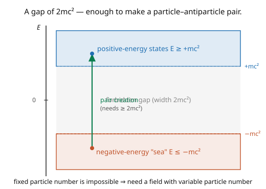

# Quantum Field Theory · Lesson 1.1: Why quantum mechanics + relativity forces fields

> ⏱ ~15 min · Module 1: Why fields? · Builds on: [`quantum-mechanics`](../../quantum-mechanics/syllabus.md), [`relativity`](../../relativity/syllabus.md) · Unlocks: [1.2 Classical field theory and the Lagrangian density](01-02-classical-field-theory-lagrangian.md)

## Why this matters

Quantum field theory isn't a stylistic choice — it's *forced*. Try to combine quantum mechanics with special relativity while keeping the ordinary single-particle picture (a wavefunction $\psi(\mathbf{x}, t)$ for one particle) and you hit contradictions: negative energies with no floor, negative probabilities, and signals leaking outside the light cone. The culprit is the assumption that particle number is fixed. Relativity says $E = mc^2$, so given enough energy you can *make* particles — pair creation is not optional. Any consistent relativistic quantum theory must allow particle number to change, and the object that does this naturally is a **quantum field**. This lesson is the "why" the entire course answers; everything after it is machinery.

## The idea

Three things refuse to coexist in a fixed-particle-number world:

**1. Relativity makes negative energies unavoidable.** The relativistic energy–momentum relation $E^2 = \mathbf{p}^2c^2 + m^2c^4$ has *two* roots, $E = \pm\sqrt{\mathbf{p}^2c^2 + m^2c^4}$. In non-relativistic QM you keep only $E \geq 0$; relativistically you can't throw the negative branch away (the solutions must be complete), and a spectrum with no lower bound is a disaster — the system could cascade down forever, releasing infinite energy (the picture: a positive continuum and a negative "sea" separated by a gap of $2mc^2$).

**2. Relativity forces pair creation.** $E = mc^2$ means energy converts to mass. Concentrate energy exceeding $2mc^2$ in a small region and you can create a particle–antiparticle pair. So "how many particles are there?" has no fixed answer — a one-particle theory is describing a situation that physically becomes a many-particle one. Concretely: try to localize a particle to better than its **Compton wavelength** $\lambda_C = \hbar/mc$ and the momentum uncertainty injects enough energy to make new particles. You cannot pin a relativistic quantum particle to a point.

**3. Causality demands locality.** In relativity, events at spacelike separation cannot influence each other. A single-particle relativistic wave equation lets amplitude propagate *outside* the light cone — a causality violation. Fixing this requires antiparticles: the "leakage" is cancelled by an antiparticle amplitude going the other way.

The resolution to all three is the same object. Promote the wavefunction to a **quantum field** $\hat\phi(\mathbf{x}, t)$ — an operator at every point of space, with infinitely many degrees of freedom. It creates and destroys particles (variable number, built on a **Fock space**), packages particles and antiparticles together (causality restored), and reinterprets the negative-energy solutions as positive-energy antiparticles. A particle becomes *an excitation of a field* — the central reframing of the subject.

## The formal version

**The relativistic dispersion relation** (units $c = \hbar = 1$ hereafter, standard in QFT):

$$E^2 = \mathbf{p}^2 + m^2 \quad\Longrightarrow\quad E = \pm\,\omega_{\mathbf p}, \qquad \omega_{\mathbf p} := \sqrt{\mathbf{p}^2 + m^2} \geq m.$$

*In words:* every momentum admits a positive- and a negative-energy solution; the negative branch cannot be discarded and destabilizes any single-particle interpretation.

**Pair-creation / localization bound.** To confine a particle to a region of size $\Delta x$, the uncertainty principle forces $\Delta p \gtrsim 1/\Delta x$, hence an energy $\Delta E \gtrsim 1/\Delta x$. When $\Delta x \lesssim 1/m$ (the Compton wavelength $\lambda_C = 1/m$ in natural units), $\Delta E \gtrsim m$ — enough to create additional quanta. *In words:* below the Compton wavelength, "one particle" is not a well-defined state; the number fluctuates.

**The field-theoretic fix.** Replace the single-particle state space by a **Fock space** $\mathcal{F} = \bigoplus_{n=0}^\infty \mathcal{H}^{(n)}$ (states of $0, 1, 2, \ldots$ particles), and the wavefunction by an operator-valued field $\hat\phi(x)$ acting on it. *In words:* the field is the fundamental object; particles are its quantized excitations, their number free to change — exactly what relativity demanded.

## Picture

## Worked examples

**Example 1 (you can't localize below the Compton wavelength).** Estimate the energy needed to confine an electron ($m = 511\ \text{keV}$) to a region $\Delta x$. By the uncertainty principle $\Delta p \sim \hbar/\Delta x$, and relativistically the energy of that momentum is $\Delta E \sim \Delta p\, c \sim \hbar c/\Delta x$. Setting $\Delta E = 2mc^2$ (the pair-creation threshold) gives

$$\Delta x \sim \frac{\hbar c}{2mc^2} = \frac{\hbar}{2mc} = \tfrac12\lambda_C \approx \tfrac12(386\ \text{fm}) \approx 190\ \text{fm}.$$

Push tighter than $\sim\lambda_C$ and the confining energy exceeds $2mc^2$: instead of a sharply localized electron you get an electron plus electron–positron pairs. Position eigenstates don't exist for relativistic particles — the field is what's really localizable, not the particle.

**Example 2 (the negative-energy branch won't go away).** Suppose you try a relativistic single-particle Schrödinger-like equation with Hamiltonian $H = \sqrt{\mathbf{p}^2 + m^2}$ (positive root only). It's non-local (a square root of a differential operator is a power series in derivatives of all orders), spoiling manifest causality. Alternatively, square it to get the local Klein–Gordon equation $(\partial^2 + m^2)\phi = 0$ ([1.4](01-04-klein-gordon-field.md)) — but squaring *reinstates* the negative-energy roots, and worse, the conserved "probability density" is not positive-definite (it can go negative). Either way the single-particle picture breaks: keep locality and lose positivity, or keep positivity and lose locality. **QFT's escape:** stop interpreting $\phi$ as a probability amplitude for one particle; make it a field operator, and the negative-frequency part becomes an antiparticle *creation* operator — positive energy, causal, consistent.

## Watch out

- **You might think antiparticles are an optional add-on.** They're mandatory. Causality (spacelike-separated commutators must vanish) *forces* every particle to have an antiparticle with the same mass — the field's negative-frequency modes. No antiparticles, no relativistic quantum consistency ([2.5](02-05-causality-microcausality.md)).
- **You might read "field" as just a fancy wavefunction.** A wavefunction is a state (a vector in Hilbert space); a quantum field is an **operator** (it acts on states, creating/destroying particles). This operator-vs-state distinction is the conceptual pivot of the whole course — $\phi(x)$ is not "the wavefunction of the particle."
- **You might expect particle number to be conserved because it is in QM.** Non-relativistically, yes; relativistically, no — interactions and even localization change it. The Hilbert space must accommodate superpositions of different particle numbers (Fock space), which single-particle QM structurally cannot.

## One-liner

> Relativity ($E = mc^2$, pair creation) plus quantum mechanics (localization → energy) makes fixed particle number impossible and negative energies unavoidable — so the wavefunction must be replaced by a quantum *field*, whose excitations are particles.

## Problems

**P1 (🟢)** Compute the Compton wavelength $\lambda_C = \hbar/mc$ for (a) an electron ($m = 511\ \text{keV}/c^2$) and (b) a proton ($m = 938\ \text{MeV}/c^2$). Which particle can be localized more tightly before pair creation sets in, and why? (Use $\hbar c \approx 197\ \text{MeV·fm}$.)

**P2 (🟡)** The relativistic energy is $E = \sqrt{\mathbf{p}^2 + m^2}$. Show that for $|\mathbf{p}| \ll m$ it reduces to $E \approx m + \frac{\mathbf{p}^2}{2m}$ (rest energy plus the non-relativistic kinetic energy), and identify the term that single-particle QM keeps and the term ($m$) it usually drops. Why does the *existence of the rest energy $m$* matter for pair creation?

**P3 (🔴, optional)** A photon of energy $E_\gamma$ scatters off a heavy nucleus and can convert into an $e^+e^-$ pair. Using energy conservation (ignore the nucleus's recoil energy but note it's needed for momentum conservation), find the threshold photon energy for pair production. Why is a nearby nucleus required — i.e. why can't a lone photon in empty space convert to a pair?

Solutions

**P1** $\lambda_C = \hbar/mc = \hbar c/(mc^2)$. (a) Electron: $\lambda_C = 197\ \text{MeV·fm} / 0.511\ \text{MeV} \approx 386\ \text{fm}$. (b) Proton: $\lambda_C = 197/938 \approx 0.21\ \text{fm}$. The **proton** can be localized much more tightly (by a factor $m_p/m_e \approx 1836$) before pair creation — the localization bound $\Delta x \gtrsim \lambda_C = \hbar/mc$ scales as $1/m$, so heavier particles have smaller Compton wavelengths and behave "more classically" in position.

**P2** $E = m\sqrt{1 + \mathbf{p}^2/m^2} = m\big(1 + \tfrac12\frac{\mathbf{p}^2}{m^2} - \cdots\big) = m + \frac{\mathbf{p}^2}{2m} + O(\mathbf{p}^4/m^3)$. Non-relativistic QM keeps $\frac{\mathbf{p}^2}{2m}$ (kinetic energy) and drops the constant rest energy $m$ (an irrelevant offset when particle number is fixed). But the rest energy is exactly what pair creation *cashes in*: converting energy into a new particle costs $m$ per particle, so the "$m$" that non-relativistic physics ignores is the entire currency of particle creation. Dropping it is why non-relativistic QM never makes pairs.

**P3** Threshold: the photon's energy must supply at least the rest mass of the pair, $E_\gamma \geq 2m_e c^2 \approx 1.022\ \text{MeV}$. A lone photon cannot convert to a pair in empty space because you cannot conserve energy *and* momentum simultaneously: a photon has $E_\gamma = |\mathbf{p}_\gamma|c$ (massless, moving at $c$), but an $e^+e^-$ pair has invariant mass $\geq 2m_e > 0$, so in the pair's rest frame the total momentum is zero while the photon's momentum can't be — there's no frame where a massless single quantum has the same $(E, \mathbf{p})$ as a massive pair. A nucleus absorbs the excess momentum (recoiling), allowing both conservation laws to hold; that's why pair production needs a "spectator" heavy body. ∎

## Connections

- **Forward:** [1.2](01-02-classical-field-theory-lagrangian.md) builds the classical field (infinitely many coupled oscillators) that Module 2 quantizes into the Fock space promised here; [2.5](02-05-causality-microcausality.md) proves causality is restored, and [1.4](01-04-klein-gordon-field.md) confronts the negative-energy trouble head-on.
- **Backward:** the localization argument is the uncertainty principle of [`quantum-mechanics`](../../quantum-mechanics/syllabus.md) meeting $E = mc^2$ from [`relativity`](../../relativity/syllabus.md); the dispersion $E^2 = \mathbf{p}^2 + m^2$ is the relativistic energy–momentum relation.
- **Sideways (condensed matter):** the same "particles are excitations of a field" idea describes phonons (quantized lattice vibrations) and quasiparticles — QFT's machinery is borrowed wholesale by many-body physics, where the "vacuum" is a ground state and excitations are collective modes.
