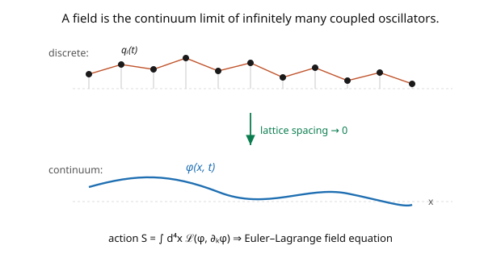

# Quantum Field Theory · Lesson 1.2: Classical field theory and the Lagrangian density

> ⏱ ~15 min · Module 1: Why fields? · Builds on: [1.1 Why quantum mechanics + relativity forces fields](01-01-why-qm-relativity-forces-fields.md), [`analytical-mechanics`](../../analytical-mechanics/syllabus.md) · Unlocks: [1.3 Symmetries and Noether's theorem for fields](01-03-symmetries-noether-for-fields.md)

## Why this matters

Before quantizing anything, we need the *classical* field theory — the Lagrangian machinery that produces field equations, and that will be promoted to operators in Module 2. The key mental move is to see a field as **infinitely many coupled oscillators**, one degree of freedom at every point of space. Then all of Lagrangian mechanics ([`analytical-mechanics`](../../analytical-mechanics/syllabus.md)) carries over: write a **Lagrangian density**, extremize the action, and out come the Euler–Lagrange field equations. This is the workhorse notation of the entire course — every theory (scalar, Dirac, QED) is specified by one line, its Lagrangian density, and Lorentz invariance of that line guarantees the physics is relativistic. Master this and you can read the "DNA" of any field theory.

## The idea

Take a row of masses connected by springs — a lattice of oscillators (the picture). Each mass has a coordinate $q_i(t)$; neighbors are coupled, so a disturbance propagates as a wave. Now shrink the lattice spacing to zero. The discrete label $i$ becomes a continuous position $\mathbf{x}$, and the coordinates $q_i(t)$ merge into a **field** $\phi(\mathbf{x}, t)$ — a single dynamical variable *at each point of space*. A field is just this: a mechanical system with a continuous infinity of degrees of freedom.

With that picture, Lagrangian mechanics transfers directly. In particle mechanics you have $L(q, \dot q)$ and minimize $S = \int L\,dt$. For a field, the Lagrangian is itself an integral over space of a **Lagrangian density** $\mathcal{L}$, so the action is an integral over all of spacetime:

$$S = \int dt\, L = \int dt\, d^3x\; \mathcal{L}(\phi, \partial_\mu\phi) = \int d^4x\; \mathcal{L}.$$

Because $\mathcal{L}$ depends on the field and its spacetime derivatives $\partial_\mu\phi = (\partial_t\phi, \nabla\phi)$, extremizing the action gives a **field equation** — a PDE, the continuum analog of $\frac{d}{dt}\frac{\partial L}{\partial\dot q} = \frac{\partial L}{\partial q}$. And here's the payoff of relativity: if $\mathcal{L}$ is a **Lorentz scalar** (built from invariant combinations like $(\partial_\mu\phi)(\partial^\mu\phi)$ and $\phi^2$), the field equation is automatically relativistic — the same in every inertial frame. Choosing the Lagrangian *is* choosing the theory.

## The formal version

A **field** $\phi(x)$ assigns a value to each spacetime point $x = x^\mu = (t, \mathbf{x})$. We use natural units $c = \hbar = 1$ and the **mostly-minus metric** $\eta_{\mu\nu} = \operatorname{diag}(+1, -1, -1, -1)$, so $\partial_\mu\phi\,\partial^\mu\phi = (\partial_t\phi)^2 - (\nabla\phi)^2$ (Peskin's convention).

The dynamics come from a **Lagrangian density** $\mathcal{L}(\phi, \partial_\mu\phi)$ and the **action** $S = \int d^4x\,\mathcal{L}$. Requiring $S$ to be stationary under $\phi \to \phi + \delta\phi$ (with $\delta\phi$ vanishing at the boundary) gives the **Euler–Lagrange equation for fields**:

$$\boxed{\;\partial_\mu\!\left(\frac{\partial\mathcal{L}}{\partial(\partial_\mu\phi)}\right) - \frac{\partial\mathcal{L}}{\partial\phi} = 0.\;}$$

*In words:* the field equation balances "how $\mathcal{L}$ changes with the field's slopes" (a divergence term) against "how $\mathcal{L}$ changes with the field itself" — the exact continuum generalization of Lagrange's equation, with the single time derivative replaced by a spacetime divergence $\partial_\mu = (\partial_t, \nabla)$ (summed over $\mu = 0,1,2,3$, Einstein convention).

The **conjugate momentum density** (needed for quantization, [2.1](02-01-canonical-quantization-field-operators.md)) is $\pi(x) = \dfrac{\partial\mathcal{L}}{\partial\dot\phi}$, and the **Hamiltonian density** is $\mathcal{H} = \pi\dot\phi - \mathcal{L}$. *In words:* the same Legendre transform as in mechanics, now per unit volume.

## Picture

## Worked examples

**Example 1 (deriving the Euler–Lagrange field equation).** Vary the action: $\delta S = \int d^4x\left[\frac{\partial\mathcal{L}}{\partial\phi}\delta\phi + \frac{\partial\mathcal{L}}{\partial(\partial_\mu\phi)}\delta(\partial_\mu\phi)\right]$. Since $\delta(\partial_\mu\phi) = \partial_\mu(\delta\phi)$, integrate the second term by parts (boundary term vanishes):

$$\delta S = \int d^4x\left[\frac{\partial\mathcal{L}}{\partial\phi} - \partial_\mu\frac{\partial\mathcal{L}}{\partial(\partial_\mu\phi)}\right]\delta\phi.$$

Stationarity ($\delta S = 0$ for arbitrary $\delta\phi$) forces the bracket to vanish — the Euler–Lagrange equation. This is *literally* the [`analytical-mechanics`](../../analytical-mechanics/syllabus.md) derivation with $\int dt \to \int d^4x$ and $\frac{d}{dt} \to \partial_\mu$.

**Example 2 (the Klein–Gordon Lagrangian → its field equation).** Take the simplest Lorentz-invariant Lagrangian for a real scalar:

$$\mathcal{L} = \tfrac12(\partial_\mu\phi)(\partial^\mu\phi) - \tfrac12 m^2\phi^2.$$

Compute the pieces: $\frac{\partial\mathcal{L}}{\partial\phi} = -m^2\phi$, and $\frac{\partial\mathcal{L}}{\partial(\partial_\mu\phi)} = \partial^\mu\phi$ (differentiating the quadratic kinetic term). The Euler–Lagrange equation gives

$$\partial_\mu\partial^\mu\phi + m^2\phi = 0, \qquad\text{i.e.}\qquad (\Box + m^2)\phi = 0,$$

with $\Box = \partial_\mu\partial^\mu = \partial_t^2 - \nabla^2$ the d'Alembertian. This is the **Klein–Gordon equation** ([1.4](01-04-klein-gordon-field.md)) — a wave equation with a mass term. The kinetic term gave the wave operator, the mass term the "$+m^2$." One line of Lagrangian, one relativistic field equation. (The conjugate momentum is $\pi = \partial\mathcal{L}/\partial\dot\phi = \dot\phi$, which we'll quantize next module.)

## Watch out

- **You might use the wrong metric signature.** QFT texts split between mostly-plus $(-+++)$ and mostly-minus $(+---)$. We use **mostly-minus** (Peskin), so $(\partial\phi)^2 = \dot\phi^2 - (\nabla\phi)^2$ and the KG mass term enters as $-\tfrac12 m^2\phi^2$. Mixing conventions flips signs everywhere — pick one and hold it.
- **You might vary $\phi$ and $\partial_\mu\phi$ as independent, then forget they're linked.** In the variation, $\delta(\partial_\mu\phi) = \partial_\mu(\delta\phi)$ — the derivative of the variation, which is what lets you integrate by parts. Treating them as truly independent (without the by-parts step) drops the $\partial_\mu(\cdots)$ term that makes the field equation a PDE.
- **You might think $\mathcal{L}$ is the energy.** $\mathcal{L}$ is (kinetic − potential) density; the *energy* density is the Hamiltonian $\mathcal{H} = \pi\dot\phi - \mathcal{L}$. For KG, $\mathcal{H} = \tfrac12\dot\phi^2 + \tfrac12(\nabla\phi)^2 + \tfrac12 m^2\phi^2$ — manifestly positive, the "kinetic + gradient + mass" energy of the field.

## One-liner

> A field is infinitely many coupled oscillators — one per point of space — and its dynamics come from extremizing $S = \int d^4x\,\mathcal{L}$, giving the Euler–Lagrange field equation; a Lorentz-scalar $\mathcal{L}$ makes the physics automatically relativistic.

## Problems

**P1 (🟢)** For $\mathcal{L} = \tfrac12(\partial_\mu\phi)(\partial^\mu\phi) - \tfrac12 m^2\phi^2 - \tfrac{\lambda}{4!}\phi^4$ (Klein–Gordon plus a quartic self-interaction), derive the field equation via Euler–Lagrange. How does it differ from the free case?

**P2 (🟡)** Compute the conjugate momentum density $\pi = \partial\mathcal{L}/\partial\dot\phi$ and the Hamiltonian density $\mathcal{H} = \pi\dot\phi - \mathcal{L}$ for the free Klein–Gordon Lagrangian, and confirm $\mathcal{H} = \tfrac12\dot\phi^2 + \tfrac12(\nabla\phi)^2 + \tfrac12 m^2\phi^2$. Which term is the "coupling to neighbors" that came from the springs?

**P3 (🔴, optional)** Add a total-derivative term $\mathcal{L} \to \mathcal{L} + \partial_\mu K^\mu$ to any Lagrangian. Show the Euler–Lagrange equations are unchanged. *Hint:* the added term contributes $\int d^4x\,\partial_\mu K^\mu$ to the action, a boundary term. Why does this mean the Lagrangian is not unique?

Solutions

**P1** $\frac{\partial\mathcal{L}}{\partial\phi} = -m^2\phi - \frac{\lambda}{3!}\phi^3$ (since $\frac{d}{d\phi}\frac{\lambda}{4!}\phi^4 = \frac{\lambda}{3!}\phi^3 = \frac{\lambda}{6}\phi^3$), and $\frac{\partial\mathcal{L}}{\partial(\partial_\mu\phi)} = \partial^\mu\phi$ as before. Euler–Lagrange: $\partial_\mu\partial^\mu\phi + m^2\phi + \frac{\lambda}{6}\phi^3 = 0$, i.e. $(\Box + m^2)\phi = -\frac{\lambda}{6}\phi^3$. It's the KG equation with a nonlinear source $\propto\phi^3$ — the field now interacts with itself, which is what makes scattering (and all of Module 3) possible. The free equation is linear (waves pass through each other); the interaction term couples the modes.

**P2** $\mathcal{L} = \tfrac12\dot\phi^2 - \tfrac12(\nabla\phi)^2 - \tfrac12 m^2\phi^2$ (expanding $(\partial\phi)^2$). So $\pi = \partial\mathcal{L}/\partial\dot\phi = \dot\phi$. Then $\mathcal{H} = \pi\dot\phi - \mathcal{L} = \dot\phi^2 - \big[\tfrac12\dot\phi^2 - \tfrac12(\nabla\phi)^2 - \tfrac12 m^2\phi^2\big] = \tfrac12\dot\phi^2 + \tfrac12(\nabla\phi)^2 + \tfrac12 m^2\phi^2$. ✓ The **gradient term $\tfrac12(\nabla\phi)^2$** is the coupling to neighbors — it penalizes the field for differing between nearby points, exactly the spring energy between adjacent oscillators in the continuum limit.

**P3** The added action is $\int d^4x\,\partial_\mu K^\mu = \oint_{\partial} K^\mu\,dS_\mu$ (divergence theorem), a pure boundary term. Since variations $\delta\phi$ vanish on the boundary, this term doesn't contribute to $\delta S$, so the stationarity condition — and hence the Euler–Lagrange equations — is unchanged. This means the Lagrangian is defined only **up to total derivatives**: infinitely many Lagrangians give the same physics. (This freedom is used constantly — e.g. integrating the kinetic term by parts, or removing surface terms — and it's why "the" Lagrangian of a theory is really an equivalence class.) ∎

## Connections

- **Backward:** this is [`analytical-mechanics`](../../analytical-mechanics/syllabus.md)'s Lagrangian mechanics with $\int dt \to \int d^4x$; the oscillator picture makes the field a limit of the coupled-mass systems from classical mechanics.
- **Forward:** [1.3](01-03-symmetries-noether-for-fields.md) applies Noether's theorem to $\mathcal{L}$ to get conserved currents; [1.4](01-04-klein-gordon-field.md) studies the KG field derived here; [2.1](02-01-canonical-quantization-field-operators.md) quantizes it via the conjugate momentum $\pi = \dot\phi$.
- **Sideways (every field theory):** the Dirac ([4.2](04-02-dirac-equation.md)) and QED ([5.2](05-02-minimal-coupling-qed-lagrangian.md)) theories are each just a choice of Lorentz-invariant $\mathcal{L}$; the whole Standard Model is one (long) Lagrangian density, and gauge symmetry ([5.1](05-01-gauge-invariance-photon.md)) is a constraint on which $\mathcal{L}$ are allowed.
