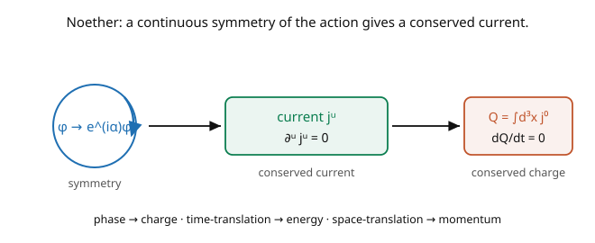

# Quantum Field Theory · Lesson 1.3: Symmetries and Noether's theorem for fields

> ⏱ ~15 min · Module 1: Why fields? · Builds on: [1.2 Classical field theory and the Lagrangian density](01-02-classical-field-theory-lagrangian.md) · Unlocks: [1.4 The Klein–Gordon field](01-04-klein-gordon-field.md)

## Why this matters

**Noether's theorem is the deepest organizing principle in physics**: every continuous symmetry of the action yields a conserved quantity. Time-translation symmetry gives energy conservation; space-translation gives momentum; rotation gives angular momentum; and — crucially for QFT — an internal *phase* symmetry gives conserved **charge**. In field theory these conservation laws become local *currents* $j^\mu$ satisfying a continuity equation, which is exactly the form charge conservation takes in electromagnetism. This lesson is the engine behind understanding *why* particles carry conserved charges, and it sets up the punchline of the whole course: in Module 5, *demanding* a phase symmetry be local will conjure the electromagnetic force out of thin air.

## The idea

You already know Noether from mechanics ([`analytical-mechanics`](../../analytical-mechanics/syllabus.md)): a symmetry of $L$ gives a conserved quantity. In field theory the statement upgrades — conserved *quantities* become conserved *currents* (the picture):

$$\text{continuous symmetry} \;\Longrightarrow\; \text{current } j^\mu \text{ with } \partial_\mu j^\mu = 0 \;\Longrightarrow\; \text{charge } Q = \int d^3x\, j^0 \text{ with } \tfrac{dQ}{dt} = 0.$$

The middle object, $\partial_\mu j^\mu = 0$, is a **continuity equation** $\partial_t j^0 + \nabla\cdot\mathbf{j} = 0$ — "charge isn't destroyed, only flows." Integrating over space, the total charge $Q = \int j^0\,d^3x$ is constant in time (the spatial flux $\nabla\cdot\mathbf{j}$ integrates to a surface term that vanishes at infinity). So a *local* conservation law (current) implies a *global* one (charge).

Two families of symmetry, two families of conservation:

- **Spacetime symmetries** (translations, rotations, boosts). Translation invariance gives the **energy–momentum tensor** $T^{\mu\nu}$ with $\partial_\mu T^{\mu\nu} = 0$; its components are energy density ($T^{00}$), momentum density, and stresses. Energy and momentum conservation are *consequences of spacetime being homogeneous*.
- **Internal symmetries** (transformations of the field values, not spacetime). A complex field's **phase symmetry** $\phi \to e^{i\alpha}\phi$ gives a conserved current whose charge is particle-number/electric charge. This is where "charge" comes from.

## The formal version

**Noether's theorem (fields).** Suppose the action is invariant under an infinitesimal transformation $\phi \to \phi + \alpha\,\delta\phi$ (constant parameter $\alpha$), meaning $\mathcal{L}$ changes at most by a total derivative, $\delta\mathcal{L} = \alpha\,\partial_\mu K^\mu$. Then the **Noether current**

$$j^\mu = \frac{\partial\mathcal{L}}{\partial(\partial_\mu\phi)}\,\delta\phi - K^\mu$$

is **conserved on-shell** (using the field equations): $\partial_\mu j^\mu = 0$. *In words:* the current is "conjugate momentum density times the field's change under the symmetry," minus any total-derivative piece. The associated **conserved charge** is

$$Q = \int d^3x\, j^0, \qquad \frac{dQ}{dt} = \int d^3x\,\partial_0 j^0 = -\int d^3x\,\nabla\cdot\mathbf{j} = 0.$$

**Spacetime translations** $\phi(x) \to \phi(x + a)$ give the (canonical) **energy–momentum tensor**

$$T^{\mu\nu} = \frac{\partial\mathcal{L}}{\partial(\partial_\mu\phi)}\,\partial^\nu\phi - \eta^{\mu\nu}\mathcal{L}, \qquad \partial_\mu T^{\mu\nu} = 0,$$

with conserved energy $P^0 = \int T^{00}\,d^3x$ (the Hamiltonian) and momentum $P^i = \int T^{0i}\,d^3x$. *In words:* homogeneity of spacetime is energy–momentum conservation, packaged as a conserved tensor current.

## Picture

## Worked examples

**Example 1 (phase symmetry → conserved charge — Boss Problem 1).** Take a *complex* scalar with $\mathcal{L} = (\partial_\mu\phi^*)(\partial^\mu\phi) - m^2\phi^*\phi$. It's invariant under the global phase rotation $\phi \to e^{i\alpha}\phi$, $\phi^* \to e^{-i\alpha}\phi^*$; infinitesimally $\delta\phi = i\phi$, $\delta\phi^* = -i\phi^*$, and $\delta\mathcal{L} = 0$ (so $K^\mu = 0$). The Noether current (summing over $\phi$ and $\phi^*$):

$$j^\mu = \frac{\partial\mathcal{L}}{\partial(\partial_\mu\phi)}(i\phi) + \frac{\partial\mathcal{L}}{\partial(\partial_\mu\phi^*)}(-i\phi^*) = \partial^\mu\phi^*(i\phi) - \partial^\mu\phi(i\phi^*) = i\big(\phi\,\partial^\mu\phi^* - \phi^*\partial^\mu\phi\big).$$

Verify conservation: $\partial_\mu j^\mu = i(\phi\,\Box\phi^* - \phi^*\Box\phi)$ (the $\partial_\mu\phi\,\partial^\mu\phi^*$ cross terms cancel). Using the field equations $\Box\phi = -m^2\phi$ and $\Box\phi^* = -m^2\phi^*$: $\partial_\mu j^\mu = i(\phi(-m^2\phi^*) - \phi^*(-m^2\phi)) = i(-m^2\phi\phi^* + m^2\phi^*\phi) = 0$. ✓ The conserved charge $Q = \int j^0\,d^3x$ is (up to sign) the **net particle number** — later, coupling to the photon makes it the **electric charge** ([5.2](05-02-minimal-coupling-qed-lagrangian.md)). A *real* scalar has no phase symmetry, hence no such charge — real fields are their own antiparticles.

**Example 2 (time translation → energy).** For the real Klein–Gordon field, the energy–momentum tensor's time–time component is

$$T^{00} = \frac{\partial\mathcal{L}}{\partial\dot\phi}\,\dot\phi - \mathcal{L} = \pi\dot\phi - \mathcal{L} = \mathcal{H} = \tfrac12\dot\phi^2 + \tfrac12(\nabla\phi)^2 + \tfrac12 m^2\phi^2.$$

So the conserved energy $P^0 = \int T^{00}\,d^3x$ is exactly the Hamiltonian ([1.2](01-02-classical-field-theory-lagrangian.md) P2) — energy conservation *is* the statement $\partial_\mu T^{\mu 0} = 0$, which follows from the Lagrangian having no explicit time dependence (time-translation symmetry). The momentum $P^i = \int T^{0i}\,d^3x = -\int \dot\phi\,\partial^i\phi\,d^3x$ is conserved likewise from spatial homogeneity. These $P^\mu$ become the total energy–momentum *operators* of the quantized field in Module 2.

## Watch out

- **You might think conservation holds off-shell.** Noether's current is conserved *on-shell* — only when the field equations hold. Off the equations of motion, $\partial_\mu j^\mu \neq 0$ in general. The field equations are exactly what's used in the final step (as in Example 1).
- **You might forget the $K^\mu$ term.** If the symmetry changes $\mathcal{L}$ by a total derivative $\partial_\mu K^\mu$ (not leaving it strictly invariant), the current is $j^\mu = \frac{\partial\mathcal{L}}{\partial(\partial_\mu\phi)}\delta\phi - K^\mu$ — the $-K^\mu$ is essential for spacetime symmetries (where $\mathcal{L}$ shifts) even though it's absent for internal ones (where $\delta\mathcal{L} = 0$).
- **You might conflate the two kinds of symmetry.** *Internal* symmetries rotate the field's values (phase, isospin) and give charge-like currents; *spacetime* symmetries move the argument $x$ and give $T^{\mu\nu}$, angular momentum, etc. They're both Noether, but the currents mean physically different things — charge vs. energy–momentum.

## One-liner

> Every continuous symmetry of the action gives a conserved current $\partial_\mu j^\mu = 0$ and hence a time-independent charge $Q = \int j^0\,d^3x$ — phase symmetry gives electric charge, time-translation gives energy, space-translation gives momentum.

## Problems

**P1 (🟢)** For the free real scalar, write the momentum density $T^{0i}$ from $T^{\mu\nu} = \partial^\mu\phi\,\partial^\nu\phi - \eta^{\mu\nu}\mathcal{L}$, and state the conserved total momentum $P^i$. Why does a *static* field configuration ($\dot\phi = 0$) carry zero momentum?

**P2 (🟡)** A theory of *two* real scalars $\phi_1, \phi_2$ has $\mathcal{L} = \tfrac12(\partial\phi_1)^2 + \tfrac12(\partial\phi_2)^2 - \tfrac12 m^2(\phi_1^2 + \phi_2^2)$. Show it is invariant under the rotation $\phi_1 \to \cos\alpha\,\phi_1 - \sin\alpha\,\phi_2$, $\phi_2 \to \sin\alpha\,\phi_1 + \cos\alpha\,\phi_2$, and find the conserved Noether current. *Hint:* infinitesimally $\delta\phi_1 = -\phi_2$, $\delta\phi_2 = \phi_1$. (This $SO(2) \cong U(1)$ symmetry is the same as the complex-field phase symmetry, since $\phi = \phi_1 + i\phi_2$.)

**P3 (🔴, optional)** Show that the conserved charge $Q$ generates the symmetry: at the classical level, the Poisson bracket $\{Q, \phi\}$ reproduces $\delta\phi$. (State the result for the phase symmetry; the quantum version is $[Q, \phi] = -\delta\phi$, making $Q$ the charge operator.) Why does this connect "conserved quantity" to "generator of the transformation"?

Solutions

**P1** $T^{0i} = \partial^0\phi\,\partial^i\phi - \eta^{0i}\mathcal{L} = \dot\phi\,\partial^i\phi$ (since $\eta^{0i} = 0$ and $\partial^0 = \partial_0 = \partial_t$). With the mostly-minus metric $\partial^i = -\partial_i$, so the momentum density is $T^{0i} = -\dot\phi\,\partial_i\phi$, and $P^i = \int T^{0i}\,d^3x = -\int\dot\phi\,\partial_i\phi\,d^3x$. A static configuration has $\dot\phi = 0$, so $T^{0i} = 0$ everywhere and $P^i = 0$: momentum requires the field to be *changing in time* (it's carried by the flow of field energy), just as a standing wave carries no net momentum.

**P2** Under the rotation, $\phi_1^2 + \phi_2^2$ is invariant (a rotation preserves length), and $(\partial\phi_1)^2 + (\partial\phi_2)^2$ likewise, so $\mathcal{L}$ is invariant ($\delta\mathcal{L} = 0$, $K^\mu = 0$). The Noether current sums over both fields: $j^\mu = \frac{\partial\mathcal{L}}{\partial(\partial_\mu\phi_1)}\delta\phi_1 + \frac{\partial\mathcal{L}}{\partial(\partial_\mu\phi_2)}\delta\phi_2 = \partial^\mu\phi_1(-\phi_2) + \partial^\mu\phi_2(\phi_1) = \phi_1\partial^\mu\phi_2 - \phi_2\partial^\mu\phi_1$. In complex notation $\phi = \phi_1 + i\phi_2$, this is $\propto i(\phi^*\partial^\mu\phi - \phi\partial^\mu\phi^*)$ — the same current as Example 1. The $SO(2)$ rotation of two real fields and the $U(1)$ phase of one complex field are literally the same symmetry.

**P3** For the phase symmetry, $Q = \int d^3x\,i(\phi\pi_\phi - \phi^*\pi_{\phi^*})$ (schematically, with $\pi$ the conjugate momenta). The canonical Poisson bracket $\{\phi(\mathbf{x}), \pi(\mathbf{y})\} = \delta^3(\mathbf{x}-\mathbf{y})$ gives $\{Q, \phi\} = i\phi = \delta\phi$ (the infinitesimal symmetry transformation). So the *conserved charge is the generator* of the symmetry it comes from — Noether's two faces. Quantum-mechanically, Poisson brackets become commutators (Module 2), and $[Q, \phi] = -\delta\phi$ makes $Q$ the operator that rotates the field, i.e. the charge operator whose eigenvalues label how much charge each state carries. Conservation ($\dot Q = 0$) and generation (of the symmetry) are the same fact because $Q$ commutes with $H$ iff it generates a symmetry of $H$. ∎

## Flashback

**From Lesson 1.2 (Classical field theory and the Lagrangian density):** Derive the field equation from $\mathcal{L} = \tfrac12(\partial_\mu\phi)(\partial^\mu\phi) - V(\phi)$ for a general potential $V$.

Solution

$\frac{\partial\mathcal{L}}{\partial\phi} = -V'(\phi)$ and $\frac{\partial\mathcal{L}}{\partial(\partial_\mu\phi)} = \partial^\mu\phi$. Euler–Lagrange gives $\partial_\mu\partial^\mu\phi + V'(\phi) = 0$, i.e. $\Box\phi + V'(\phi) = 0$. For $V = \tfrac12 m^2\phi^2$ this is Klein–Gordon ($V' = m^2\phi$); for $V = \tfrac12 m^2\phi^2 + \tfrac{\lambda}{4!}\phi^4$ it gains the $\tfrac{\lambda}{6}\phi^3$ interaction term. The potential's *slope* $V'$ is the restoring force in the field equation. ✓

## Connections

- **Backward:** this is [`analytical-mechanics`](../../analytical-mechanics/syllabus.md)'s Noether's theorem promoted to fields, using the Euler–Lagrange equation of [1.2](01-02-classical-field-theory-lagrangian.md) in the on-shell step; the same Lagrange-multiplier/symmetry logic recurs across the course.
- **Forward:** the phase current here becomes the **electric current** that couples to the photon under minimal coupling ([5.2](05-02-minimal-coupling-qed-lagrangian.md)); the charge $Q$ becomes a quantum operator ([2.3](02-03-particles-as-excitations-energy-momentum.md)); $T^{\mu\nu}$ is the source of gravity in general relativity.
- **Sideways (the whole of physics):** Noether unifies conservation laws — in [`analytical-mechanics`](../../analytical-mechanics/syllabus.md) it's energy/momentum/angular-momentum; here it adds *charge*; and in Module 5 the demand that a global symmetry become *local* is what generates the fundamental forces (gauge theory).
