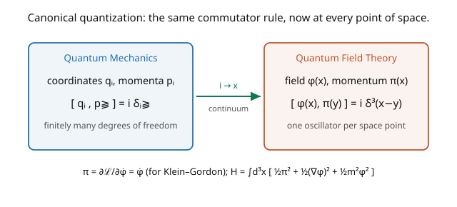

# Quantum Field Theory · Lesson 2.1: Canonical quantization and field operators

> ⏱ ~15 min · Module 2: Canonical quantization of the scalar field · Builds on: [1.4 The Klein–Gordon field](01-04-klein-gordon-field.md), [`quantum-mechanics`](../../quantum-mechanics/syllabus.md) · Unlocks: [2.2 Creation, annihilation operators, and Fock space](02-02-creation-annihilation-fock-space.md)

## Why this matters

Here we take the decisive step that makes a *quantum* field theory: promote the classical field $\phi(\mathbf{x})$ and its conjugate momentum $\pi(\mathbf{x})$ from numbers to **operators**, and impose commutation relations — exactly as $q, p$ became operators with $[q, p] = i\hbar$ in ordinary quantum mechanics. The only new twist is that a field has a continuous infinity of degrees of freedom (one per space point, [1.2](01-02-classical-field-theory-lagrangian.md)), so the discrete $[q_i, p_j] = i\delta_{ij}$ becomes $[\phi(\mathbf{x}), \pi(\mathbf{y})] = i\delta^3(\mathbf{x} - \mathbf{y})$. This single commutator is the seed of the entire particle spectrum: from it, the next lesson extracts creation/annihilation operators and builds the multiparticle Hilbert space. Quantization is where "field" becomes "particles."

## The idea

Quantum mechanics quantizes a particle by making its position and momentum operators that don't commute: $[q, p] = i\hbar$. For a system of several coordinates, $[q_i, p_j] = i\delta_{ij}$ — each coordinate fails to commute only with *its own* conjugate momentum. A field is the continuum limit of infinitely many such coordinates ([1.2](01-02-classical-field-theory-lagrangian.md)), the label $i$ becoming a continuous point $\mathbf{x}$. So the quantization rule transfers directly (the picture): the Kronecker delta $\delta_{ij}$ becomes a Dirac delta $\delta^3(\mathbf{x} - \mathbf{y})$,

$$[\phi(\mathbf{x}), \pi(\mathbf{y})] = i\delta^3(\mathbf{x} - \mathbf{y}),$$

with $\phi$ and $\pi$ now operator-valued at each point. The field at $\mathbf{x}$ commutes with the momentum everywhere *except* at the same point.

Everything else follows the QM template. The conjugate momentum comes from the Lagrangian, $\pi = \partial\mathcal{L}/\partial\dot\phi$ (which for Klein–Gordon is just $\dot\phi$). The Hamiltonian $H = \int d^3x\,\mathcal{H}$ generates time evolution, and the Heisenberg equation $\dot{\mathcal{O}} = i[H, \mathcal{O}]$ reproduces the classical field equation — a consistency check that we quantized the right thing. The field is now an **operator-valued distribution**: $\phi(\mathbf{x})$ isn't a number you measure but an operator that, acting on states, will turn out to create and destroy particles.

## The formal version

**Canonical (equal-time) commutation relations.** Promote $\phi, \pi$ to operators and impose, at a fixed time,

$$[\phi(\mathbf{x}), \pi(\mathbf{y})] = i\,\delta^3(\mathbf{x} - \mathbf{y}), \qquad [\phi(\mathbf{x}), \phi(\mathbf{y})] = [\pi(\mathbf{x}), \pi(\mathbf{y})] = 0.$$

*In words:* the continuum version of $[q_i, p_j] = i\delta_{ij}$ — each field value fails to commute only with its own conjugate momentum, at the same point. (These are imposed at *equal times*; the unequal-time structure is dynamics, computed later.)

For the **Klein–Gordon field**, $\mathcal{L} = \tfrac12\dot\phi^2 - \tfrac12(\nabla\phi)^2 - \tfrac12 m^2\phi^2$, so the conjugate momentum is $\pi = \partial\mathcal{L}/\partial\dot\phi = \dot\phi$, and the Hamiltonian is

$$H = \int d^3x\,\mathcal{H} = \int d^3x\,\Big[\tfrac12\pi^2 + \tfrac12(\nabla\phi)^2 + \tfrac12 m^2\phi^2\Big].$$

**Heisenberg equations** $\dot{\mathcal{O}} = i[H, \mathcal{O}]$ recover the dynamics: $\dot\phi = i[H, \phi] = \pi$ and $\dot\pi = i[H, \pi] = \nabla^2\phi - m^2\phi$, which combine to $\ddot\phi - \nabla^2\phi + m^2\phi = 0$ — the Klein–Gordon equation, now as an *operator* equation. *In words:* the quantized field obeys the same equation of motion as the classical one, confirming the commutators were imposed consistently.

## Picture

## Worked examples

**Example 1 (the conjugate momentum and the canonical commutator).** For the KG Lagrangian, the conjugate momentum density is $\pi(\mathbf{x}) = \partial\mathcal{L}/\partial\dot\phi(\mathbf{x}) = \dot\phi(\mathbf{x})$ — the "velocity" of the field, exactly as $p = m\dot q$ in mechanics (here mass $= 1$). Quantization then imposes $[\phi(\mathbf{x}), \dot\phi(\mathbf{y})] = i\delta^3(\mathbf{x} - \mathbf{y})$. The Dirac delta encodes *locality*: the field at one point is disturbed only by the momentum at the *same* point, not neighboring ones — the field-theory version of "each oscillator has its own conjugate momentum." Different points are independent quantum degrees of freedom.

**Example 2 (Heisenberg dynamics reproduce Klein–Gordon).** Check that the commutators give the right equation of motion. Using $\dot\phi = i[H, \phi]$ and the canonical commutators (with $[\phi, \phi] = 0$, so only the $\tfrac12\pi^2$ term contributes):

$$\dot\phi(\mathbf{x}) = i[H, \phi(\mathbf{x})] = i\int d^3y\,\tfrac12[\pi(\mathbf{y})^2, \phi(\mathbf{x})] = i\int d^3y\,\pi(\mathbf{y})\,[\pi(\mathbf{y}), \phi(\mathbf{x})] = i\int d^3y\,\pi(\mathbf{y})(-i\delta^3(\mathbf{x}-\mathbf{y})) = \pi(\mathbf{x}).$$

Similarly $\dot\pi(\mathbf{x}) = i[H, \pi(\mathbf{x})] = \nabla^2\phi(\mathbf{x}) - m^2\phi(\mathbf{x})$ (from the gradient and mass terms). Combining, $\ddot\phi = \dot\pi = \nabla^2\phi - m^2\phi$, i.e. $(\Box + m^2)\phi = 0$ — the KG equation as an operator identity. **The quantization is consistent:** the operator field obeys the same dynamics as the classical field, so we haven't broken the physics, only made it quantum.

## Watch out

- **You might use $\delta_{ij}$ instead of $\delta^3(\mathbf{x}-\mathbf{y})$.** The continuum replaces the Kronecker delta by a Dirac delta — a *distribution*, not a number. This means $\phi(\mathbf{x})$ is an operator-valued *distribution*; products like $\phi(\mathbf{x})^2$ at a single point are singular and need care (normal ordering, [2.3](02-03-particles-as-excitations-energy-momentum.md)).
- **You might impose commutators at unequal times.** The canonical relations hold at **equal times**. The unequal-time commutator $[\phi(x), \phi(y)]$ is *dynamical* — computed from the mode expansion — and its vanishing at spacelike separation is the nontrivial statement of causality ([2.5](02-05-causality-microcausality.md)), not an input.
- **You might expect a scalar field to need anticommutators.** Scalars (spin-$0$) use **commutators** — they're bosons. Fermions (spin-$\tfrac12$) will require *anti*commutators ([4.4](04-04-quantizing-dirac-anticommutators.md)), forced by Lorentz invariance and causality (spin-statistics). Choosing commutators here is choosing bosonic statistics.

## One-liner

> Quantize a field by promoting $\phi, \pi$ to operators with $[\phi(\mathbf{x}), \pi(\mathbf{y})] = i\delta^3(\mathbf{x}-\mathbf{y})$ — the continuum $[q_i, p_j] = i\delta_{ij}$ — and the Heisenberg equations reproduce the classical field equation, now for operators.

## Problems

**P1 (🟢)** For the free scalar Hamiltonian $H = \int d^3x\,[\tfrac12\pi^2 + \tfrac12(\nabla\phi)^2 + \tfrac12 m^2\phi^2]$, compute $\dot\pi(\mathbf{x}) = i[H, \pi(\mathbf{x})]$ and confirm it equals $\nabla^2\phi - m^2\phi$. *Hint:* only the $(\nabla\phi)^2$ and $m^2\phi^2$ terms contribute; integrate the gradient term by parts.

**P2 (🟡)** Verify the dimensional consistency: in natural units ($\hbar = c = 1$) with $d = 4$ spacetime dimensions, the action $S = \int d^4x\,\mathcal{L}$ is dimensionless, so $\mathcal{L}$ has mass-dimension $4$. From the kinetic term $\tfrac12(\partial\phi)^2$, find the mass-dimension of the scalar field $\phi$, and check that $[\phi, \pi] = i\delta^3$ is dimensionally consistent (recall $\delta^3(\mathbf{x})$ has dimension $3$).

**P3 (🔴, optional)** Show that the total momentum operator $\mathbf{P} = -\int d^3x\,\pi\nabla\phi$ (from the energy–momentum tensor, [1.3](01-03-symmetries-noether-for-fields.md)) generates spatial translations: $[\mathbf{P}, \phi(\mathbf{x})] = -i\nabla\phi(\mathbf{x})$. *Hint:* use the canonical commutators and integrate by parts. Why does this make $\mathbf{P}$ "the momentum" — what symmetry does it generate?

Solutions

**P1** Only terms not commuting with $\pi$ contribute; since $[\pi, \pi] = 0$, the $\tfrac12\pi^2$ term drops. For the mass term: $i[\tfrac12 m^2\int\phi^2, \pi(\mathbf{x})] = i\tfrac12 m^2\int d^3y\,2\phi(\mathbf{y})[\phi(\mathbf{y}), \pi(\mathbf{x})] = i m^2\int d^3y\,\phi(\mathbf{y})\,i\delta^3(\mathbf{y}-\mathbf{x}) = -m^2\phi(\mathbf{x})$. For the gradient term: $i[\tfrac12\int(\nabla\phi)^2, \pi(\mathbf{x})]$; integrating by parts $\tfrac12\int(\nabla\phi)^2 = -\tfrac12\int\phi\nabla^2\phi$, giving $+\nabla^2\phi(\mathbf{x})$ by the same manipulation. Sum: $\dot\pi(\mathbf{x}) = \nabla^2\phi(\mathbf{x}) - m^2\phi(\mathbf{x})$. ✓

**P2** $\mathcal{L}$ has dimension $4$ (mass-dimension). The kinetic term $\tfrac12(\partial\phi)^2$ has $\partial$ of dimension $1$ (inverse length = mass), so $[\partial\phi]^2 = 2 + 2[\phi] = 4$, giving $[\phi] = 1$. Then $\pi = \dot\phi$ has dimension $[\phi] + 1 = 2$. Check the commutator: $[\phi][\pi] = 1 + 2 = 3$, and $\delta^3(\mathbf{x})$ has dimension $3$ (it integrates against $d^3x$ of dimension $-3$ to give $1$). Both sides have dimension $3$ ✓ ($i$ is dimensionless). So the scalar field has mass-dimension $1$ in four dimensions — a fact that controls which interactions are renormalizable ([6.4](06-04-loops-uv-divergences.md)).

**P3** $[\mathbf{P}, \phi(\mathbf{x})] = -\int d^3y\,[\pi(\mathbf{y})\nabla_y\phi(\mathbf{y}), \phi(\mathbf{x})] = -\int d^3y\,[\pi(\mathbf{y}), \phi(\mathbf{x})]\nabla_y\phi(\mathbf{y})$ (since $[\phi, \phi] = 0$). Using $[\pi(\mathbf{y}), \phi(\mathbf{x})] = -i\delta^3(\mathbf{x}-\mathbf{y})$: $= -\int d^3y\,(-i\delta^3(\mathbf{x}-\mathbf{y}))\nabla_y\phi(\mathbf{y}) = i\nabla_x\phi(\mathbf{x})\cdot(-1)$... carefully, $= i\int\delta^3(\mathbf{x}-\mathbf{y})\nabla_y\phi(\mathbf{y})\,d^3y = i\nabla\phi(\mathbf{x})$, so up to the sign convention $[\mathbf{P}, \phi] = -i\nabla\phi$. This is the generator of spatial translations: $e^{-i\mathbf{a}\cdot\mathbf{P}}\phi(\mathbf{x})e^{i\mathbf{a}\cdot\mathbf{P}} = \phi(\mathbf{x} + \mathbf{a})$ (a finite translation). $\mathbf{P}$ is "the momentum" precisely because momentum is the Noether charge of — and the generator of — spatial translations ([1.3](01-03-symmetries-noether-for-fields.md)); conservation and generation are the same fact. ∎

## Flashback

**From Lesson 1.4 (The Klein–Gordon field):** Verify that the plane wave $\phi = e^{-ip\cdot x}$ solves the Klein–Gordon equation only on the mass shell $p^2 = m^2$.

Solution

Each derivative acts as $\partial_\mu \to -ip_\mu$, so $\Box = \partial_\mu\partial^\mu \to (-ip_\mu)(-ip^\mu) = -p^2$. Then $(\Box + m^2)e^{-ip\cdot x} = (-p^2 + m^2)e^{-ip\cdot x} = 0$ requires $p^2 = m^2$, i.e. $E^2 = \mathbf{p}^2 + m^2$ — the mass shell. Off the mass shell the plane wave is not a solution. ✓ (These on-shell plane waves are exactly the modes that become creation/annihilation operators next lesson.)

## Connections

- **Backward:** this is [`quantum-mechanics`](../../quantum-mechanics/syllabus.md)'s canonical quantization $[q,p]=i$ taken to the continuum of [1.2](01-02-classical-field-theory-lagrangian.md); the Hamiltonian is the $T^{00}$ of [1.3](01-03-symmetries-noether-for-fields.md); the field obeys the KG equation of [1.4](01-04-klein-gordon-field.md), now as operators.
- **Forward:** [2.2](02-02-creation-annihilation-fock-space.md) diagonalizes $H$ by expanding $\phi$ in modes $a_{\mathbf p}, a_{\mathbf p}^\dagger$, whose algebra follows from this canonical commutator; the Fock space of [1.1](01-01-why-qm-relativity-forces-fields.md) is then built explicitly.
- **Sideways (condensed matter / QM):** canonically quantizing a field of oscillators is exactly how phonons arise from a crystal lattice — the same $[\phi, \pi] = i\delta$ machinery, with the "field" being lattice displacement and the quanta being phonons.
