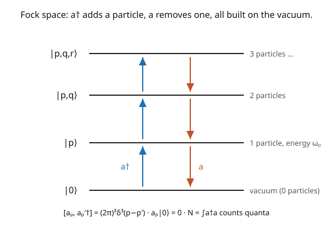

# Quantum Field Theory · Lesson 2.2: Creation, annihilation operators, and Fock space

> ⏱ ~15 min · Module 2: Canonical quantization of the scalar field · Builds on: [2.1 Canonical quantization and field operators](02-01-canonical-quantization-field-operators.md) · Unlocks: [2.3 Particles as excitations; energy and momentum](02-03-particles-as-excitations-energy-momentum.md)

## Why this matters

This is the lesson where **particles appear**. We take the quantized field, expand it in modes, and discover that each mode is a harmonic oscillator with its own **creation and annihilation operators** $a_{\mathbf p}^\dagger, a_{\mathbf p}$. Acting with $a_{\mathbf p}^\dagger$ on the vacuum *creates a particle* of momentum $\mathbf{p}$; acting with $a_{\mathbf p}$ *destroys* one. The multiparticle states they build form the **Fock space** — the variable-particle-number Hilbert space that [1.1](01-01-why-qm-relativity-forces-fields.md) said relativity demands. This is the concrete realization of "a particle is an excitation of a field," and the operators $a, a^\dagger$ are the vocabulary of every calculation for the rest of the course: propagators, scattering amplitudes, and Feynman diagrams are all built from them.

## The idea

The trick is that the free field is a collection of *independent harmonic oscillators*, one per momentum mode — you met the single quantum oscillator in [`quantum-mechanics`](../../quantum-mechanics/syllabus.md), with its ladder operators $a, a^\dagger$ satisfying $[a, a^\dagger] = 1$ and a spectrum built by repeatedly applying $a^\dagger$ to the ground state. A field is just infinitely many of these, labeled by $\mathbf{p}$.

Expand the field operator over its plane-wave modes ([1.4](01-04-klein-gordon-field.md)): the positive-frequency part carries an **annihilation operator** $a_{\mathbf p}$, the negative-frequency part a **creation operator** $a_{\mathbf p}^\dagger$. The canonical commutator $[\phi, \pi] = i\delta^3$ from [2.1](02-01-canonical-quantization-field-operators.md) translates into the ladder algebra $[a_{\mathbf p}, a_{\mathbf q}^\dagger] \propto \delta^3(\mathbf{p} - \mathbf{q})$ — each mode is an oscillator, independent of the others.

Now build the states (the picture). The **vacuum** $|0\rangle$ is annihilated by every $a_{\mathbf p}$: no particles. Apply $a_{\mathbf p}^\dagger$ and you climb one rung — a **one-particle state** $|\mathbf{p}\rangle$ of momentum $\mathbf{p}$. Apply more creation operators for more particles: $a_{\mathbf p}^\dagger a_{\mathbf q}^\dagger|0\rangle$ is a two-particle state, and so on. The span of all these is **Fock space**. Because the $a^\dagger$'s *commute*, the states are automatically symmetric under particle exchange — the field's quanta are **bosons**. A single operator, $a_{\mathbf p}^\dagger$, is the mathematical form of "create a particle."

## The formal version

Expand the free Klein–Gordon field operator in momentum modes (at $t = 0$; the mass shell $p^0 = \omega_{\mathbf p}$ is understood):

$$\phi(\mathbf{x}) = \int\!\frac{d^3p}{(2\pi)^3}\,\frac{1}{\sqrt{2\omega_{\mathbf p}}}\Big(a_{\mathbf p}\,e^{i\mathbf{p}\cdot\mathbf{x}} + a_{\mathbf p}^\dagger\,e^{-i\mathbf{p}\cdot\mathbf{x}}\Big), \qquad \pi(\mathbf{x}) = \int\!\frac{d^3p}{(2\pi)^3}\,(-i)\sqrt{\tfrac{\omega_{\mathbf p}}{2}}\Big(a_{\mathbf p}\,e^{i\mathbf{p}\cdot\mathbf{x}} - a_{\mathbf p}^\dagger\,e^{-i\mathbf{p}\cdot\mathbf{x}}\Big).$$

The canonical commutator $[\phi(\mathbf{x}), \pi(\mathbf{y})] = i\delta^3(\mathbf{x}-\mathbf{y})$ is equivalent to the **ladder algebra**

$$[a_{\mathbf p}, a_{\mathbf q}^\dagger] = (2\pi)^3\,\delta^3(\mathbf{p} - \mathbf{q}), \qquad [a_{\mathbf p}, a_{\mathbf q}] = [a_{\mathbf p}^\dagger, a_{\mathbf q}^\dagger] = 0.$$

*In words:* every momentum mode is an independent harmonic oscillator; the $\delta^3$ says different momenta don't mix, and the commuting $a^\dagger$'s make the statistics bosonic. **States:**

- **Vacuum:** $a_{\mathbf p}|0\rangle = 0$ for all $\mathbf{p}$, with $\langle 0|0\rangle = 1$.
- **One-particle:** $|\mathbf{p}\rangle = \sqrt{2\omega_{\mathbf p}}\,a_{\mathbf p}^\dagger|0\rangle$ (a Lorentz-invariant normalization), a state of definite momentum $\mathbf{p}$ and energy $\omega_{\mathbf p}$.
- **Multiparticle:** $a_{\mathbf p}^\dagger a_{\mathbf q}^\dagger\cdots|0\rangle$; the **Fock space** is the span of all such states over $0, 1, 2, \ldots$ particles.

The **number operator** $N = \int\frac{d^3p}{(2\pi)^3}\,a_{\mathbf p}^\dagger a_{\mathbf p}$ counts particles: $N|0\rangle = 0$, $N|\mathbf{p}\rangle = |\mathbf{p}\rangle$, etc. *In words:* $a_{\mathbf p}^\dagger a_{\mathbf p}$ is the occupation of mode $\mathbf{p}$, and $N$ sums them — the total particle number, which (unlike in single-particle QM) is now a genuine operator with variable eigenvalues.

## Picture

## Worked examples

**Example 1 (the ladder algebra from the canonical commutator).** Invert the mode expansion to write $a_{\mathbf p}$ in terms of $\phi$ and $\pi$: $a_{\mathbf p} = \int d^3x\,e^{-i\mathbf{p}\cdot\mathbf{x}}\big(\sqrt{\tfrac{\omega_{\mathbf p}}{2}}\,\phi(\mathbf{x}) + \tfrac{i}{\sqrt{2\omega_{\mathbf p}}}\pi(\mathbf{x})\big)$ (and $a_{\mathbf p}^\dagger$ its conjugate). Then

$$[a_{\mathbf p}, a_{\mathbf q}^\dagger] = \int d^3x\,d^3y\,e^{-i\mathbf{p}\cdot\mathbf{x}}e^{i\mathbf{q}\cdot\mathbf{y}}\Big(\tfrac{-i}{2}\sqrt{\tfrac{\omega_{\mathbf p}}{\omega_{\mathbf q}}}[\phi(\mathbf{x}),\pi(\mathbf{y})] + \tfrac{i}{2}\sqrt{\tfrac{\omega_{\mathbf q}}{\omega_{\mathbf p}}}[\pi(\mathbf{x}),\phi(\mathbf{y})]\Big).$$

Using $[\phi,\pi] = i\delta^3$ (and $[\pi,\phi] = -i\delta^3$), the two terms combine and the $\delta^3(\mathbf{x}-\mathbf{y})$ collapses one integral, giving $\int d^3x\,e^{-i(\mathbf{p}-\mathbf{q})\cdot\mathbf{x}}\cdot\tfrac12(\ldots) = (2\pi)^3\delta^3(\mathbf{p}-\mathbf{q})$. So $[a_{\mathbf p}, a_{\mathbf q}^\dagger] = (2\pi)^3\delta^3(\mathbf{p}-\mathbf{q})$. The single field commutator *is* an infinite family of oscillator commutators — the field is a bundle of oscillators.

**Example 2 (creating a particle, and counting it).** The state $|\mathbf{p}\rangle = \sqrt{2\omega_{\mathbf p}}\,a_{\mathbf p}^\dagger|0\rangle$ is a one-particle state. Check it's an energy eigenstate: with $H = \int\frac{d^3q}{(2\pi)^3}\omega_{\mathbf q}\,a_{\mathbf q}^\dagger a_{\mathbf q}$ (normal-ordered, [2.3](02-03-particles-as-excitations-energy-momentum.md)), use $[H, a_{\mathbf p}^\dagger] = \omega_{\mathbf p}a_{\mathbf p}^\dagger$ (from the ladder algebra) to get $H|\mathbf{p}\rangle = H\sqrt{2\omega_{\mathbf p}}a_{\mathbf p}^\dagger|0\rangle = \sqrt{2\omega_{\mathbf p}}\,[H, a_{\mathbf p}^\dagger]|0\rangle = \omega_{\mathbf p}|\mathbf{p}\rangle$ (using $H|0\rangle = 0$). So $|\mathbf{p}\rangle$ has energy $\omega_{\mathbf p} = \sqrt{\mathbf{p}^2 + m^2}$ — *exactly the relativistic energy of one particle of momentum $\mathbf{p}$*. And $N|\mathbf{p}\rangle = |\mathbf{p}\rangle$: one quantum. "A particle" is literally "one rung up the field's ladder."

## Watch out

- **You might treat $a_{\mathbf p}^\dagger$ as a state.** It's an *operator* — "create a particle." The *state* is $a_{\mathbf p}^\dagger|0\rangle$ (operator acting on the vacuum). Keeping operator vs. state straight is the same discipline as $\phi$-operator vs. wavefunction from [1.1](01-01-why-qm-relativity-forces-fields.md).
- **You might drop the $(2\pi)^3$ or the $\sqrt{2\omega}$ factors.** Conventions vary (Peskin uses relativistic normalization $|\mathbf{p}\rangle = \sqrt{2\omega_{\mathbf p}}a_{\mathbf p}^\dagger|0\rangle$ with $[a, a^\dagger] = (2\pi)^3\delta^3$). Fix a convention and carry the factors — cross-sections depend on them. The point is Lorentz-invariance of the normalization.
- **You might expect distinct particles to give distinct states when swapped.** Because $a_{\mathbf p}^\dagger a_{\mathbf q}^\dagger = a_{\mathbf q}^\dagger a_{\mathbf p}^\dagger$ (creation operators commute), $|\mathbf{p}, \mathbf{q}\rangle = |\mathbf{q}, \mathbf{p}\rangle$ — the two-particle state is symmetric. Identical bosons are automatically symmetrized; you never impose it by hand. (Fermions will *anti*commute, giving antisymmetry and Pauli exclusion, [4.4](04-04-quantizing-dirac-anticommutators.md).)

## One-liner

> Each momentum mode of the field is a harmonic oscillator with ladder operators $a_{\mathbf p}, a_{\mathbf p}^\dagger$; $a_{\mathbf p}^\dagger$ creates a particle of momentum $\mathbf{p}$ on the vacuum, and the multiparticle states they build are the bosonic Fock space.

## Problems

**P1 (🟢)** Using $[a_{\mathbf p}, a_{\mathbf q}^\dagger] = (2\pi)^3\delta^3(\mathbf{p}-\mathbf{q})$, show that $[N, a_{\mathbf p}^\dagger] = a_{\mathbf p}^\dagger$ where $N = \int\frac{d^3q}{(2\pi)^3}a_{\mathbf q}^\dagger a_{\mathbf q}$. Hence explain why $a_{\mathbf p}^\dagger$ raises the particle number by one.

**P2 (🟡)** Compute the norm $\langle\mathbf{p}|\mathbf{q}\rangle$ of one-particle states with the relativistic normalization $|\mathbf{p}\rangle = \sqrt{2\omega_{\mathbf p}}\,a_{\mathbf p}^\dagger|0\rangle$. *Hint:* use $a_{\mathbf p}|0\rangle = 0$ and the commutator to move $a$ past $a^\dagger$. You should get $\langle\mathbf{p}|\mathbf{q}\rangle = 2\omega_{\mathbf p}(2\pi)^3\delta^3(\mathbf{p}-\mathbf{q})$ (a Lorentz-invariant normalization).

**P3 (🔴, optional)** Show the two-particle state $|\mathbf{p}, \mathbf{q}\rangle = a_{\mathbf p}^\dagger a_{\mathbf q}^\dagger|0\rangle$ is symmetric under $\mathbf{p} \leftrightarrow \mathbf{q}$, and that this is Bose statistics. Then argue that if we had instead imposed *anticommutators* $\{a_{\mathbf p}^\dagger, a_{\mathbf q}^\dagger\} = 0$, the state would be antisymmetric and $a_{\mathbf p}^\dagger a_{\mathbf p}^\dagger|0\rangle = 0$ (Pauli exclusion). Which statistics does the scalar field have, and why?

Solutions

**P1** $[N, a_{\mathbf p}^\dagger] = \int\frac{d^3q}{(2\pi)^3}[a_{\mathbf q}^\dagger a_{\mathbf q}, a_{\mathbf p}^\dagger] = \int\frac{d^3q}{(2\pi)^3}a_{\mathbf q}^\dagger[a_{\mathbf q}, a_{\mathbf p}^\dagger] = \int\frac{d^3q}{(2\pi)^3}a_{\mathbf q}^\dagger(2\pi)^3\delta^3(\mathbf{q}-\mathbf{p}) = a_{\mathbf p}^\dagger$ (using $[a_{\mathbf q}^\dagger, a_{\mathbf p}^\dagger] = 0$ so only the second factor contributes). So $N a_{\mathbf p}^\dagger|n\rangle = (a_{\mathbf p}^\dagger N + a_{\mathbf p}^\dagger)|n\rangle = (n+1)a_{\mathbf p}^\dagger|n\rangle$: applying $a_{\mathbf p}^\dagger$ raises the eigenvalue of $N$ by one — it creates exactly one particle.

**P2** $\langle\mathbf{p}|\mathbf{q}\rangle = \sqrt{2\omega_{\mathbf p}}\sqrt{2\omega_{\mathbf q}}\,\langle 0|a_{\mathbf p}a_{\mathbf q}^\dagger|0\rangle$. Move $a_{\mathbf p}$ past $a_{\mathbf q}^\dagger$: $a_{\mathbf p}a_{\mathbf q}^\dagger = a_{\mathbf q}^\dagger a_{\mathbf p} + [a_{\mathbf p}, a_{\mathbf q}^\dagger] = a_{\mathbf q}^\dagger a_{\mathbf p} + (2\pi)^3\delta^3(\mathbf{p}-\mathbf{q})$. Since $a_{\mathbf p}|0\rangle = 0$, only the commutator survives: $\langle 0|a_{\mathbf p}a_{\mathbf q}^\dagger|0\rangle = (2\pi)^3\delta^3(\mathbf{p}-\mathbf{q})$. So $\langle\mathbf{p}|\mathbf{q}\rangle = \sqrt{2\omega_{\mathbf p}}\sqrt{2\omega_{\mathbf q}}(2\pi)^3\delta^3(\mathbf{p}-\mathbf{q}) = 2\omega_{\mathbf p}(2\pi)^3\delta^3(\mathbf{p}-\mathbf{q})$ (the delta forces $\omega_{\mathbf p} = \omega_{\mathbf q}$). The factor $2\omega_{\mathbf p}$ makes the normalization Lorentz-invariant.

**P3** Since $[a_{\mathbf p}^\dagger, a_{\mathbf q}^\dagger] = 0$, $a_{\mathbf p}^\dagger a_{\mathbf q}^\dagger = a_{\mathbf q}^\dagger a_{\mathbf p}^\dagger$, so $|\mathbf{p},\mathbf{q}\rangle = |\mathbf{q},\mathbf{p}\rangle$ — the state is **symmetric** under exchange: Bose statistics. If instead $\{a_{\mathbf p}^\dagger, a_{\mathbf q}^\dagger\} = 0$, then $a_{\mathbf p}^\dagger a_{\mathbf q}^\dagger = -a_{\mathbf q}^\dagger a_{\mathbf p}^\dagger$, so $|\mathbf{p},\mathbf{q}\rangle = -|\mathbf{q},\mathbf{p}\rangle$ (antisymmetric), and setting $\mathbf{p} = \mathbf{q}$ gives $a_{\mathbf p}^\dagger a_{\mathbf p}^\dagger|0\rangle = -a_{\mathbf p}^\dagger a_{\mathbf p}^\dagger|0\rangle = 0$ — no two quanta in the same mode (Pauli exclusion). The **scalar field uses commutators**, hence Bose statistics — this is forced (not chosen) by requiring a stable, causal theory for spin-$0$; the spin-statistics theorem ([4.4](04-04-quantizing-dirac-anticommutators.md)) shows integer spin ⟹ commutators ⟹ bosons, half-integer spin ⟹ anticommutators ⟹ fermions. ∎

## Flashback

**From Lesson 2.1 (Canonical quantization and field operators):** For the Klein–Gordon field, what is the conjugate momentum $\pi$, and what equal-time commutator do we impose to quantize?

Solution

The conjugate momentum is $\pi = \partial\mathcal{L}/\partial\dot\phi = \dot\phi$ (the field's time derivative, since the KG kinetic term is $\tfrac12\dot\phi^2$). Quantization imposes the equal-time canonical commutator $[\phi(\mathbf{x}), \pi(\mathbf{y})] = i\delta^3(\mathbf{x}-\mathbf{y})$ (with $[\phi,\phi] = [\pi,\pi] = 0$) — which, as this lesson showed, is equivalent to the ladder algebra $[a_{\mathbf p}, a_{\mathbf q}^\dagger] = (2\pi)^3\delta^3(\mathbf{p}-\mathbf{q})$. ✓

## Connections

- **Backward:** the ladder algebra is the canonical commutator of [2.1](02-01-canonical-quantization-field-operators.md) in momentum space; each mode is the harmonic oscillator of [`quantum-mechanics`](../../quantum-mechanics/syllabus.md); Fock space is the variable-particle-number Hilbert space demanded in [1.1](01-01-why-qm-relativity-forces-fields.md).
- **Forward:** [2.3](02-03-particles-as-excitations-energy-momentum.md) writes $H$ and $\mathbf{P}$ in terms of $a^\dagger a$ (counting quanta and their energy/momentum); [2.4](02-04-feynman-propagator.md) builds the propagator from $\langle 0|\phi\phi|0\rangle$; all of Module 3's scattering is $a^\dagger, a$ bookkeeping.
- **Sideways (condensed matter):** phonons, magnons, and photons in a cavity are all quanta created by $a^\dagger$ on a ground state — the Fock-space construction is universal across quantum many-body physics, not special to relativistic fields.
