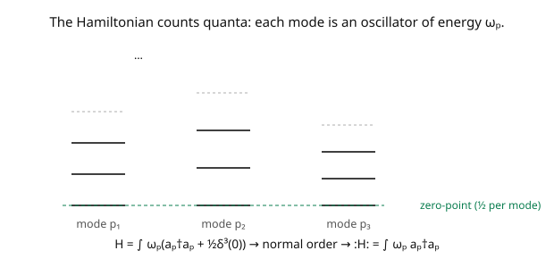

# Quantum Field Theory · Lesson 2.3: Particles as excitations; energy and momentum

> ⏱ ~15 min · Module 2: Canonical quantization of the scalar field · Builds on: [2.2 Creation, annihilation operators, and Fock space](02-02-creation-annihilation-fock-space.md) · Unlocks: [2.4 The Feynman propagator](02-04-feynman-propagator.md)

## Why this matters

Now we cash in the ladder operators: substitute the mode expansion into the Hamiltonian and it becomes a machine that **counts quanta and weights them by energy** — $H = \int\omega_{\mathbf p}\,a_{\mathbf p}^\dagger a_{\mathbf p}$ (plus an infinite constant we'll deal with). Acting on a one-particle state, it returns the relativistic energy $\omega_{\mathbf p} = \sqrt{\mathbf{p}^2 + m^2}$; on a two-particle state, the sum. This makes precise the slogan "a particle is an excitation of a field": particles are *quanta of energy and momentum*, indexed by mode. Along the way we meet the first infinity of QFT — the **zero-point energy** of the vacuum — and the first tool for taming infinities, **normal ordering**. It's a gentle preview of the renormalization story that closes the course.

## The idea

Plug the field's mode expansion ([2.2](02-02-creation-annihilation-fock-space.md)) into the Hamiltonian $H = \int d^3x\,[\tfrac12\pi^2 + \tfrac12(\nabla\phi)^2 + \tfrac12 m^2\phi^2]$. The spatial integral turns products of plane waves into momentum deltas, collapsing everything to a single momentum integral. The result is beautifully simple: the field's energy is a sum over modes, each mode being a harmonic oscillator of frequency $\omega_{\mathbf p}$ (the picture),

$$H = \int\frac{d^3p}{(2\pi)^3}\,\omega_{\mathbf p}\Big(a_{\mathbf p}^\dagger a_{\mathbf p} + \tfrac12[a_{\mathbf p}, a_{\mathbf p}^\dagger]\Big).$$

The first term, $\omega_{\mathbf p}\,a_{\mathbf p}^\dagger a_{\mathbf p}$, is "(energy per quantum) × (number of quanta in mode $\mathbf p$)" — exactly the oscillator spectrum. The second term is the **zero-point energy**: each mode has a ground-state energy $\tfrac12\omega_{\mathbf p}$, and summing over the continuum of all modes gives *infinity* (it contains $\delta^3(0)$, an infinite volume factor times infinitely many modes).

That infinity is a red herring for most purposes: only *energy differences* are measured, and the vacuum energy shifts everything equally. **Normal ordering** formalizes dropping it — reorder every product so annihilation operators sit to the right (they kill the vacuum), which discards the constant. The renormalized Hamiltonian $:\!H\!: = \int\omega_{\mathbf p}\,a_{\mathbf p}^\dagger a_{\mathbf p}$ then gives $:\!H\!:\!|0\rangle = 0$ and $:\!H\!:\!|\mathbf{p}\rangle = \omega_{\mathbf p}|\mathbf{p}\rangle$: the vacuum has zero energy, a one-particle state has the relativistic energy of one particle. Likewise the momentum operator gives $\mathbf{P}|\mathbf{p}\rangle = \mathbf{p}|\mathbf{p}\rangle$. So the state $|\mathbf{p}\rangle$ *is* a relativistic particle: energy $\omega_{\mathbf p}$, momentum $\mathbf{p}$, mass $m$ (since $\omega_{\mathbf p}^2 - \mathbf{p}^2 = m^2$). Particles are excitations — quanta — of the field.

## The formal version

Substituting the mode expansion into $H$ and normal-ordering (dropping the zero-point constant):

$$H = \int\frac{d^3p}{(2\pi)^3}\,\omega_{\mathbf p}\,a_{\mathbf p}^\dagger a_{\mathbf p}, \qquad \mathbf{P} = \int\frac{d^3p}{(2\pi)^3}\,\mathbf{p}\,a_{\mathbf p}^\dagger a_{\mathbf p}, \qquad \omega_{\mathbf p} = \sqrt{\mathbf{p}^2 + m^2}.$$

*In words:* the energy is (energy per quantum $\omega_{\mathbf p}$) times (number in mode $\mathbf p$), integrated over modes; the momentum weights each quantum by $\mathbf{p}$. These act on Fock states as:

$$H|0\rangle = 0, \qquad H|\mathbf{p}\rangle = \omega_{\mathbf p}|\mathbf{p}\rangle, \qquad H\,a_{\mathbf p}^\dagger a_{\mathbf q}^\dagger|0\rangle = (\omega_{\mathbf p} + \omega_{\mathbf q})\,a_{\mathbf p}^\dagger a_{\mathbf q}^\dagger|0\rangle,$$

and similarly $\mathbf{P}|\mathbf{p}\rangle = \mathbf{p}|\mathbf{p}\rangle$. **Normal ordering** $:\!\mathcal{O}\!:$ moves all $a^\dagger$ to the left of all $a$ (treating them as commuting for this reordering), so $:\!a_{\mathbf p}a_{\mathbf q}^\dagger\!: = a_{\mathbf q}^\dagger a_{\mathbf p}$; it defines $:\!H\!:$ with $\langle 0|\!:\!H\!:\!|0\rangle = 0$. *In words:* a bookkeeping rule that discards the (unobservable) vacuum energy by fiat.

The **zero-point energy** $E_0 = \int\frac{d^3p}{(2\pi)^3}\,\tfrac12\omega_{\mathbf p}\cdot(2\pi)^3\delta^3(0)$ is infinite (both the mode sum and $\delta^3(0) \sim V$ diverge). Its *absolute* value is unobservable (only differences are), though its *variations* are real — the **Casimir effect** measures the change in vacuum energy between conducting plates.

## Picture

## Worked examples

**Example 1 (the Hamiltonian counts quanta, and the vacuum energy appears).** Substituting the mode expansions of $\phi$ and $\pi$ into $H = \int d^3x\,[\tfrac12\pi^2 + \tfrac12(\nabla\phi)^2 + \tfrac12 m^2\phi^2]$, the spatial integral produces $\delta^3(\mathbf{p} \pm \mathbf{q})$ factors. The $a a$ and $a^\dagger a^\dagger$ cross-terms cancel (their frequency factors combine to zero for the free field), leaving

$$H = \int\frac{d^3p}{(2\pi)^3}\,\frac{\omega_{\mathbf p}}{2}\big(a_{\mathbf p}^\dagger a_{\mathbf p} + a_{\mathbf p}a_{\mathbf p}^\dagger\big) = \int\frac{d^3p}{(2\pi)^3}\,\omega_{\mathbf p}\Big(a_{\mathbf p}^\dagger a_{\mathbf p} + \tfrac12(2\pi)^3\delta^3(0)\Big),$$

using $a a^\dagger = a^\dagger a + (2\pi)^3\delta^3(0)$. The first piece counts quanta; the second is the divergent vacuum energy $\tfrac12\sum_{\mathbf p}\omega_{\mathbf p}$. Normal ordering discards it: $:\!H\!: = \int\omega_{\mathbf p}a_{\mathbf p}^\dagger a_{\mathbf p}$. **This is the field's energy read as "count the particles, weight by their energies."**

**Example 2 (a state is a relativistic particle).** Apply $:\!H\!:$ and $\mathbf{P}$ to $|\mathbf{p}\rangle = \sqrt{2\omega_{\mathbf p}}\,a_{\mathbf p}^\dagger|0\rangle$. Using $[a_{\mathbf q}^\dagger a_{\mathbf q}, a_{\mathbf p}^\dagger] = (2\pi)^3\delta^3(\mathbf{q}-\mathbf{p})a_{\mathbf p}^\dagger$:

$$:\!H\!:|\mathbf{p}\rangle = \omega_{\mathbf p}|\mathbf{p}\rangle, \qquad \mathbf{P}|\mathbf{p}\rangle = \mathbf{p}|\mathbf{p}\rangle.$$

So $|\mathbf{p}\rangle$ is a simultaneous eigenstate of energy and momentum with eigenvalues $(\omega_{\mathbf p}, \mathbf{p})$, satisfying $\omega_{\mathbf p}^2 - \mathbf{p}^2 = m^2$ — the energy–momentum relation of a **single relativistic particle of mass $m$**. A two-particle state $|\mathbf{p}, \mathbf{q}\rangle$ has energy $\omega_{\mathbf p} + \omega_{\mathbf q}$: energies of quanta simply add. The abstract Fock state and the physical particle are the same thing — "particle = quantum of the field" is now a theorem, not a slogan.

## Watch out

- **You might worry about the infinite vacuum energy.** For non-gravitational physics only energy *differences* matter, so the constant is unobservable and normal ordering legitimately removes it. But it's not "fake": the Casimir effect measures changes in it, and in gravity it sources the cosmological constant (the infamous vacuum-energy problem). Dropping it is a convention, not a proof it's zero.
- **You might normal-order and think you've "renormalized" QFT.** Normal ordering only removes the *vacuum* (zero-point) divergence — a constant. The genuine divergences of interacting QFT (loops, [6.4](06-04-loops-uv-divergences.md)) are momentum-dependent and need the real renormalization machinery. This is a baby version, not the full story.
- **You might expect $a a^\dagger = a^\dagger a$.** They differ by the commutator $(2\pi)^3\delta^3(0)$ — the ordering *is* the zero-point energy. The whole subtlety is that operator ordering matters; getting the vacuum energy is literally an ordering choice.

## One-liner

> Substituting the mode expansion, $H = \int\omega_{\mathbf p}\,a_{\mathbf p}^\dagger a_{\mathbf p}$ (after normal-ordering away the infinite zero-point energy) counts quanta weighted by energy, so a Fock state $|\mathbf{p}\rangle$ *is* a relativistic particle with $E = \omega_{\mathbf p}$, $\mathbf{P} = \mathbf{p}$.

## Problems

**P1 (🟢)** Compute the energy and momentum of the two-particle state $|\mathbf{p}, \mathbf{q}\rangle = a_{\mathbf p}^\dagger a_{\mathbf q}^\dagger|0\rangle$ using $:\!H\!: = \int\omega_{\mathbf k}a_{\mathbf k}^\dagger a_{\mathbf k}$ and $\mathbf{P} = \int\mathbf{k}\,a_{\mathbf k}^\dagger a_{\mathbf k}$. Confirm energies and momenta of the two quanta simply add.

**P2 (🟡)** The number operator is $N = \int\frac{d^3p}{(2\pi)^3}a_{\mathbf p}^\dagger a_{\mathbf p}$. Show $[H, N] = 0$ for the *free* field, so particle number is conserved. Then explain why an *interaction* term like $\phi^4$ (which contains products of four field operators, i.e. of $a$'s and $a^\dagger$'s) will *not* commute with $N$ — the origin of particle creation/annihilation in scattering.

**P3 (🔴, optional)** Estimate the Casimir force qualitatively: between two parallel conducting plates separated by distance $d$, only field modes with wavelengths fitting between the plates are allowed, so the vacuum energy *depends on $d$*. Argue on dimensional grounds (in natural units, with only $d$ available) that the vacuum energy per unit area scales as $\sim 1/d^3$, hence the force per area $\sim 1/d^4$. Why is this a *measurable* consequence of the "unobservable" zero-point energy?

Solutions

**P1** $:\!H\!:|\mathbf{p},\mathbf{q}\rangle$: acting with $\int\omega_{\mathbf k}a_{\mathbf k}^\dagger a_{\mathbf k}$ on $a_{\mathbf p}^\dagger a_{\mathbf q}^\dagger|0\rangle$, the number operator picks up one quantum at $\mathbf{p}$ and one at $\mathbf{q}$, giving $(\omega_{\mathbf p} + \omega_{\mathbf q})|\mathbf{p},\mathbf{q}\rangle$. Similarly $\mathbf{P}|\mathbf{p},\mathbf{q}\rangle = (\mathbf{p} + \mathbf{q})|\mathbf{p},\mathbf{q}\rangle$. So total energy $\omega_{\mathbf p} + \omega_{\mathbf q}$ and total momentum $\mathbf{p} + \mathbf{q}$ — the quanta contribute additively and independently (free particles don't interact).

**P2** Both $H = \int\omega_{\mathbf k}a_{\mathbf k}^\dagger a_{\mathbf k}$ and $N = \int a_{\mathbf k}^\dagger a_{\mathbf k}$ are built from number densities $a_{\mathbf k}^\dagger a_{\mathbf k}$, which all commute with each other ($[a_{\mathbf k}^\dagger a_{\mathbf k}, a_{\mathbf l}^\dagger a_{\mathbf l}] = 0$). So $[H, N] = 0$: the free Hamiltonian conserves particle number (free particles just propagate). An interaction $\int\phi^4$ expands into products like $a^\dagger a^\dagger a^\dagger a^\dagger$, $a^\dagger a^\dagger a^\dagger a$, etc. — terms that create or destroy a *net* number of particles (e.g. $a^\dagger a^\dagger a^\dagger a^\dagger$ creates four). These don't commute with $N$, so $[H_{\text{int}}, N] \neq 0$ and particle number changes — exactly the process of scattering, where incoming particles turn into outgoing ones ([3.1](03-01-interaction-picture-s-matrix.md)).

**P3** In natural units the only length scale is the plate separation $d$, and energy has dimension (length)$^{-1}$ = (mass)$^{+1}$. Vacuum energy *per unit area* has dimension (energy)/(area) = (mass)$^1$/(mass)$^{-2}$ = (mass)$^3$ = (length)$^{-3}$, so it must scale as $E/A \sim 1/d^3$ (up to a dimensionless constant, which turns out to be $-\pi^2/720$). The force per area is $-\partial(E/A)/\partial d \sim 1/d^4$. This is *measurable* because although the absolute vacuum energy is unobservable (an infinite constant), its *dependence on the geometry* ($d$) is finite and physical: moving the plates changes the allowed modes, changing the (regularized) vacuum energy by a finite, $d$-dependent amount — an attractive force confirmed experimentally. The zero-point energy is "unobservable" only in its absolute value, not in its variations. ∎

## Flashback

**From Lesson 2.2 (Creation, annihilation operators, and Fock space):** Compute the norm $\langle\mathbf{p}|\mathbf{q}\rangle$ of one-particle states with $|\mathbf{p}\rangle = \sqrt{2\omega_{\mathbf p}}\,a_{\mathbf p}^\dagger|0\rangle$.

Solution

$\langle\mathbf{p}|\mathbf{q}\rangle = \sqrt{2\omega_{\mathbf p}}\sqrt{2\omega_{\mathbf q}}\langle 0|a_{\mathbf p}a_{\mathbf q}^\dagger|0\rangle$. Since $a_{\mathbf p}a_{\mathbf q}^\dagger = a_{\mathbf q}^\dagger a_{\mathbf p} + (2\pi)^3\delta^3(\mathbf{p}-\mathbf{q})$ and $a_{\mathbf p}|0\rangle = 0$, the vacuum expectation is $(2\pi)^3\delta^3(\mathbf{p}-\mathbf{q})$. So $\langle\mathbf{p}|\mathbf{q}\rangle = 2\omega_{\mathbf p}(2\pi)^3\delta^3(\mathbf{p}-\mathbf{q})$ — the Lorentz-invariant normalization (the $2\omega_{\mathbf p}$ compensates the non-invariance of $d^3p$). ✓

## Connections

- **Backward:** the Hamiltonian is the $T^{00}$ of [1.3](01-03-symmetries-noether-for-fields.md) expressed in the ladder operators of [2.2](02-02-creation-annihilation-fock-space.md); each mode is the harmonic oscillator of [`quantum-mechanics`](../../quantum-mechanics/syllabus.md) with its zero-point energy $\tfrac12\omega$.
- **Forward:** [2.4](02-04-feynman-propagator.md) computes $\langle 0|T\phi(x)\phi(y)|0\rangle$ (the propagator) using these operators; Module 3 turns the non-conservation of $N$ under interactions (P2) into scattering amplitudes; normal ordering recurs in Wick's theorem ([3.3](03-03-wicks-theorem.md)).
- **Sideways (physics):** the zero-point energy is the Casimir effect (measured) and the cosmological-constant problem (unsolved); "counting quanta weighted by energy" is the structure of the photon gas and blackbody radiation in [`stat-mech`](../../stat-mech/syllabus.md).
