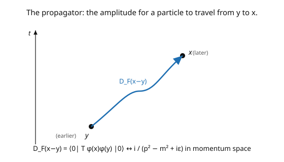

# Quantum Field Theory · Lesson 2.4: The Feynman propagator

> ⏱ ~15 min · Module 2: Canonical quantization of the scalar field · Builds on: [2.3 Particles as excitations; energy and momentum](02-03-particles-as-excitations-energy-momentum.md) · Unlocks: [2.5 Causality and microcausality](02-05-causality-microcausality.md)

## Why this matters

The **Feynman propagator** is the single most-used object in all of QFT — every internal line of every Feynman diagram *is* a propagator. Physically it's the amplitude for a particle to travel from one spacetime point to another; mathematically it's the time-ordered two-point function $\langle 0|T\phi(x)\phi(y)|0\rangle$, and in momentum space it's the compact $\frac{i}{p^2 - m^2 + i\varepsilon}$. That little "$+i\varepsilon$" is not decoration: it encodes causality, telling the particle to propagate forward in time and the antiparticle backward, and it's what makes the pole at the mass shell well-defined. Get the propagator and you have the building block from which all scattering amplitudes are assembled in Modules 3–5.

## The idea

Ask a natural question: if you create a disturbance in the field at point $y$, what's the amplitude to detect it at $x$? That amplitude is the **two-point function** $\langle 0|\phi(x)\phi(y)|0\rangle$ — vacuum, act with the field at $y$ (creating a particle), let it propagate, annihilate it at $x$, back to vacuum. Using the mode expansion, this is a specific integral over the mass shell.

But amplitudes in QFT come **time-ordered**: you always put the later operator on the left. Define the **Feynman propagator** with the time-ordering symbol $T$ (the picture — a line from the earlier event $y$ to the later event $x$):

$$D_F(x - y) = \langle 0|T\phi(x)\phi(y)|0\rangle = \begin{cases}\langle 0|\phi(x)\phi(y)|0\rangle & x^0 > y^0 \\ \langle 0|\phi(y)\phi(x)|0\rangle & y^0 > x^0.\end{cases}$$

Why time-order? Because it produces the combination that is (a) a **Green's function** of the Klein–Gordon operator — the response to a point source — and (b) Lorentz-invariant and causal. The magic is cleanest in momentum space, where all the time-ordering and mass-shell structure collapses to one expression:

$$\widetilde D_F(p) = \frac{i}{p^2 - m^2 + i\varepsilon}.$$

The denominator vanishes on the mass shell $p^2 = m^2$ (real particles), and the **$i\varepsilon$** is the instruction for how to go around that pole: it selects the *Feynman contour*, which sends positive-energy solutions forward in time and negative-energy (antiparticle) solutions backward. That single prescription is causality, encoded analytically.

## The formal version

The **Feynman propagator** is the time-ordered vacuum two-point function:

$$D_F(x - y) = \langle 0|T\phi(x)\phi(y)|0\rangle, \qquad T\phi(x)\phi(y) = \theta(x^0 - y^0)\phi(x)\phi(y) + \theta(y^0 - x^0)\phi(y)\phi(x),$$

with $\theta$ the step function. In **momentum space**,

$$D_F(x - y) = \int\frac{d^4p}{(2\pi)^4}\,\frac{i}{p^2 - m^2 + i\varepsilon}\,e^{-ip\cdot(x - y)}, \qquad \widetilde D_F(p) = \frac{i}{p^2 - m^2 + i\varepsilon}.$$

*In words:* the propagator is the Fourier transform of $\frac{i}{p^2 - m^2 + i\varepsilon}$; the pole at $p^2 = m^2$ is where a real on-shell particle can propagate, and the $+i\varepsilon$ shifts it off the real axis ($p^0 = \pm(\omega_{\mathbf p} - i\varepsilon)$) to define the contour. It is a **Green's function** of the KG operator:

$$(\Box_x + m^2)\,D_F(x - y) = -i\,\delta^4(x - y).$$

*In words:* $D_F$ is the field's response to a unit point source — the inverse of the KG operator, with the causal ($i\varepsilon$) boundary condition. Time-ordering is exactly what turns the operator product into this Green's function. **Physical reading:** $D_F(x - y)$ is the amplitude for a particle created at the earlier point to be found at the later one (and, for the other time order, an antiparticle going the opposite way).

## Picture

## Worked examples

**Example 1 (the two-point function from modes).** For $x^0 > y^0$, compute $\langle 0|\phi(x)\phi(y)|0\rangle$ using the mode expansion. Only the term with an annihilation operator on the right and a creation on the left survives (all others kill a vacuum): $\phi(x)$ contributes its $a_{\mathbf p}$ part, $\phi(y)$ its $a_{\mathbf q}^\dagger$ part, giving $\langle 0|a_{\mathbf p}a_{\mathbf q}^\dagger|0\rangle = (2\pi)^3\delta^3(\mathbf{p}-\mathbf{q})$. The result:

$$\langle 0|\phi(x)\phi(y)|0\rangle = \int\frac{d^3p}{(2\pi)^3}\,\frac{1}{2\omega_{\mathbf p}}\,e^{-ip\cdot(x-y)}\Big|_{p^0 = \omega_{\mathbf p}}.$$

This is the amplitude for a particle to propagate from $y$ to $x$ — a positive-frequency function, integrated over the mass shell. Time-ordering combines this ($x^0 > y^0$) with the reversed order ($y^0 > x^0$) into $D_F$, and doing the $p^0$ integral by contour (picking up the pole dictated by $i\varepsilon$) reproduces exactly the two step-function pieces. The two descriptions — sum over on-shell modes vs. $\frac{i}{p^2 - m^2 + i\varepsilon}$ — are equal.

**Example 2 (the propagator is a Green's function).** Verify $(\Box_x + m^2)D_F(x-y) = -i\delta^4(x-y)$ from the momentum-space form. Acting with the KG operator brings down $(-p^2 + m^2)$ under the integral:

$$(\Box_x + m^2)D_F = \int\frac{d^4p}{(2\pi)^4}\,\frac{i(-p^2 + m^2)}{p^2 - m^2 + i\varepsilon}\,e^{-ip\cdot(x-y)} \xrightarrow{\varepsilon\to 0} \int\frac{d^4p}{(2\pi)^4}(-i)\,e^{-ip\cdot(x-y)} = -i\,\delta^4(x-y),$$

using $\frac{-p^2 + m^2}{p^2 - m^2} = -1$ (the $i\varepsilon$ is harmless once the denominator cancels). So $D_F$ is the causal Green's function — the *inverse* of the KG operator, $\widetilde D_F(p) = \frac{i}{p^2 - m^2 + i\varepsilon} = \frac{i}{(\text{KG operator in momentum space})}$. This is why every propagator in a Feynman diagram is "$\frac{i}{p^2 - m^2 + i\varepsilon}$" — it's the inverse of the quadratic (free) part of the action.

## Watch out

- **You might drop or mis-sign the $i\varepsilon$.** The $+i\varepsilon$ (with the metric convention here) is essential: it picks the *Feynman* (causal) contour, distinct from the retarded or advanced Green's functions (which have different $\varepsilon$ placements and describe classical, not quantum-causal, propagation). Change the sign and you get the wrong boundary conditions.
- **You might think the propagator is only for on-shell particles.** The propagator's power is that it's defined *off* the mass shell too ($p^2 \neq m^2$): internal lines of diagrams carry **virtual** particles with $p^2 \neq m^2$. The pole at $p^2 = m^2$ marks where a real particle would appear, but the propagator lives everywhere.
- **You might forget the time-ordering.** $\langle 0|\phi(x)\phi(y)|0\rangle$ (no $T$) is *not* the propagator and is *not* Lorentz-invariant on its own for timelike separations without specifying order. Time-ordering is what makes $D_F$ both Lorentz-invariant and the correct Green's function.

## One-liner

> The Feynman propagator $D_F(x-y) = \langle 0|T\phi(x)\phi(y)|0\rangle = \int\frac{d^4p}{(2\pi)^4}\frac{i\,e^{-ip\cdot(x-y)}}{p^2 - m^2 + i\varepsilon}$ is the amplitude for a particle to travel between two points — the inverse of the KG operator, and the building block of every Feynman diagram.

## Problems

**P1 (🟢)** Verify $\frac{-p^2 + m^2}{p^2 - m^2 + i\varepsilon} \to -1$ as $\varepsilon \to 0$, and hence confirm the Green's-function property $(\Box + m^2)D_F = -i\delta^4(x-y)$ follows from the momentum-space propagator. What does "Green's function" mean physically for a field?

**P2 (🟡)** The poles of $\widetilde D_F(p) = \frac{i}{p^2 - m^2 + i\varepsilon}$ in the complex $p^0$ plane are at $p^0 = \pm(\omega_{\mathbf p} - i\varepsilon)$ (with $\omega_{\mathbf p} = \sqrt{\mathbf{p}^2 + m^2}$). Show this by writing $p^2 - m^2 = (p^0)^2 - \omega_{\mathbf p}^2$ and factoring. Which pole is picked up when you close the contour in the upper vs. lower half-plane, and how does that produce the two time-orderings?

**P3 (🔴, optional)** For a *massless* field ($m = 0$), the position-space propagator in 4D is $D_F(x) \propto \frac{1}{x^2 - i\varepsilon}$ (where $x^2 = t^2 - \mathbf{x}^2$). Identify where it is singular (on the light cone $x^2 = 0$) and explain physically why a massless particle propagates predominantly *on* the light cone — connecting to the fact that massless quanta (photons) travel at the speed of light.

Solutions

**P1** As $\varepsilon \to 0$, $\frac{-p^2 + m^2}{p^2 - m^2 + i\varepsilon} = \frac{-(p^2 - m^2)}{p^2 - m^2 + i\varepsilon} \to \frac{-(p^2-m^2)}{p^2-m^2} = -1$ (away from the pole, and the pole is a measure-zero set). So $(\Box + m^2)D_F = \int\frac{d^4p}{(2\pi)^4}(-i)e^{-ip\cdot(x-y)} = -i\delta^4(x-y)$. Physically, a Green's function is the field's response to a **unit point source** (a delta-function disturbance) at $y$ — it tells you the field everywhere given a "kick" at one spacetime point, i.e. how disturbances propagate. The propagator is the *causal* (Feynman) such response.

**P2** $p^2 - m^2 = (p^0)^2 - \mathbf{p}^2 - m^2 = (p^0)^2 - \omega_{\mathbf p}^2 = (p^0 - \omega_{\mathbf p})(p^0 + \omega_{\mathbf p})$. With the $+i\varepsilon$, the roots shift to $p^0 = \pm\omega_{\mathbf p}\sqrt{1 - i\varepsilon/\omega_{\mathbf p}^2} \approx \pm(\omega_{\mathbf p} - i\varepsilon')$ — the $+\omega_{\mathbf p}$ pole drops slightly below the real axis, the $-\omega_{\mathbf p}$ pole rises slightly above. For $x^0 > y^0$ the factor $e^{-ip^0(x^0-y^0)}$ decays when $\text{Im}(p^0) < 0$, so you close *below*, picking up the $p^0 = +\omega_{\mathbf p}$ pole (positive energy, forward in time). For $x^0 < y^0$ you close above, picking up $p^0 = -\omega_{\mathbf p}$ (the antiparticle). The $i\varepsilon$ thus assigns positive-energy propagation to the future and negative-energy (antiparticle) propagation to the past — encoding causality in the contour.

**P3** $D_F(x) \propto \frac{1}{x^2 - i\varepsilon}$ is singular where $x^2 = 0$, i.e. on the **light cone** $t^2 = \mathbf{x}^2$ (points reachable at exactly the speed of light). The singularity means the amplitude to propagate is largest for light-cone-separated points: a massless particle propagates *on* the light cone. This is the field-theoretic statement that massless quanta (photons) travel at $c$ — the propagator's support concentrates on $x^2 = 0$. (A massive field's propagator also has support *inside* the light cone, decaying over a Compton wavelength, reflecting that massive particles move slower than light and can lag behind the cone.) ∎

## Flashback

**From Lesson 2.3 (Particles as excitations; energy and momentum):** Using $:\!H\!: = \int\frac{d^3p}{(2\pi)^3}\omega_{\mathbf p}\,a_{\mathbf p}^\dagger a_{\mathbf p}$, find the energy of the two-particle state $a_{\mathbf p}^\dagger a_{\mathbf q}^\dagger|0\rangle$.

Solution

The normal-ordered Hamiltonian counts each quantum weighted by its energy, so $:\!H\!:\,a_{\mathbf p}^\dagger a_{\mathbf q}^\dagger|0\rangle = (\omega_{\mathbf p} + \omega_{\mathbf q})\,a_{\mathbf p}^\dagger a_{\mathbf q}^\dagger|0\rangle$. The total energy is the sum $\omega_{\mathbf p} + \omega_{\mathbf q}$ of the two free-particle energies (they don't interact in the free theory). ✓

## Connections

- **Backward:** the propagator is built from the two-point function of the field operators of [2.2](02-02-creation-annihilation-fock-space.md)–[2.3](02-03-particles-as-excitations-energy-momentum.md); it's the causal Green's function of the KG operator ([1.4](01-04-klein-gordon-field.md) P3), now with the $i\varepsilon$ that fixes the contour.
- **Forward:** [2.5](02-05-causality-microcausality.md) uses the *commutator* (not time-ordered product) to prove causality; Wick's theorem ([3.3](03-03-wicks-theorem.md)) shows every contraction in a scattering amplitude is a Feynman propagator, and the Feynman rules ([3.5](03-05-feynman-rules-amplitude.md)) assign $\frac{i}{p^2-m^2+i\varepsilon}$ to each internal line.
- **Sideways (path integral):** [6.3](06-03-recovering-propagators-feynman-rules.md) rederives $\widetilde D_F(p) = \frac{i}{p^2-m^2+i\varepsilon}$ as the inverse of the quadratic action from a Gaussian path integral — the same object from a completely different route.
