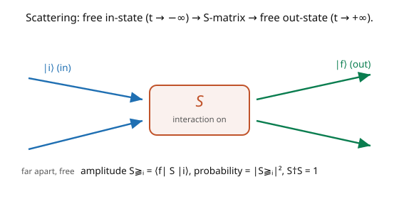

# Quantum Field Theory · Lesson 3.1: The interaction picture and the S-matrix

> ⏱ ~15 min · Module 3: Interactions and perturbation theory · Builds on: [2.5 Causality and microcausality](02-05-causality-microcausality.md), [`quantum-mechanics`](../../quantum-mechanics/syllabus.md) (interaction picture) · Unlocks: [3.2 The Dyson series and time ordering](03-02-dyson-series-time-ordering.md)

## Why this matters

Free fields are inert — particles pass through each other and nothing happens. Physics is in the **interactions**, and the observable that captures them is the **S-matrix**: the amplitude that a given set of incoming particles (prepared far apart in the distant past) turns into a given set of outgoing particles (detected in the far future). Every collider measurement — every cross-section, every decay rate — is an $|S_{fi}|^2$. This lesson sets up the framework: the **interaction picture**, which lets the fields keep their simple free-particle form (with the $a, a^\dagger$ of Module 2) while the interaction drives transitions between states. It's the exact relativistic upgrade of time-dependent perturbation theory from [`quantum-mechanics`](../../quantum-mechanics/syllabus.md), and it turns "compute a scattering amplitude" into a well-posed calculation.

## The idea

Split the Hamiltonian into a free part and an interaction: $H = H_0 + H_{\text{int}}$. In the **interaction picture**, you hand the "easy" free evolution $H_0$ to the *operators* and the "hard" interaction $H_{\text{int}}$ to the *states*. The payoff: interaction-picture fields evolve as **free fields** — the exact mode expansions of Module 2, built from $a_{\mathbf p}, a_{\mathbf p}^\dagger$ — so all our free-field machinery (propagators, Fock states) still applies. Meanwhile the states change in time, driven only by $H_{\text{int}}$, which is where the physics of scattering lives.

Now frame a collision (the picture). Long before the collision ($t \to -\infty$), the particles are far apart and don't feel each other — they're a **free in-state** $|i\rangle$, a Fock state of definite incoming momenta. Long after ($t \to +\infty$), the debris flies apart, again free — a **free out-state** $|f\rangle$. The **S-matrix** is the operator that evolves the in-state to the out-state through the interaction:

$$S_{fi} = \langle f|S|i\rangle, \qquad S = U(+\infty, -\infty),$$

the interaction-picture time-evolution operator across all time. Its squared magnitude $|S_{fi}|^2$ is the probability of the transition $i \to f$. To make "turn the interaction on and off" precise, one **adiabatically switches** $H_{\text{int}}$ with a slow envelope that vanishes at $t = \pm\infty$, so the asymptotic states are genuinely free. The whole game of Module 3 is to expand $S$ perturbatively (next lesson) and read off amplitudes.

## The formal version

Split $H = H_0 + H_{\text{int}}$ ($H_0$ the free Hamiltonian, $H_{\text{int}}$ the coupling, e.g. $\int d^3x\,\frac{\lambda}{4!}\phi^4$). In the **interaction picture**, operators and states carry, respectively:

$$\mathcal{O}_I(t) = e^{iH_0 t}\,\mathcal{O}_S\,e^{-iH_0 t}, \qquad i\frac{d}{dt}|\psi(t)\rangle_I = H_{\text{int}}^I(t)\,|\psi(t)\rangle_I,$$

where $H_{\text{int}}^I(t) = e^{iH_0 t}H_{\text{int}}e^{-iH_0 t}$. *In words:* operators evolve with the free Hamiltonian (so interaction-picture fields are **free fields**, with the Module 2 mode expansion), while states evolve with the interaction. The state evolution is generated by the **time-evolution operator** $U(t, t_0)$ with $|\psi(t)\rangle = U(t, t_0)|\psi(t_0)\rangle$.

The **S-matrix** is the evolution from the far past to the far future:

$$S = U(+\infty, -\infty), \qquad S_{fi} = \langle f|S|i\rangle,$$

with $|i\rangle, |f\rangle$ free (asymptotic) Fock states. *In words:* $S$ maps the incoming free state onto the outgoing free state; $|S_{fi}|^2$ is the transition probability. **Unitarity** $S^\dagger S = 1$ expresses conservation of total probability: $\sum_f |S_{fi}|^2 = 1$ (something must happen). One separates the trivial "nothing happens" piece by writing $S = 1 + iT$; the nontrivial **amplitude** $\mathcal{M}$ is defined through $\langle f|iT|i\rangle = (2\pi)^4\delta^4(p_f - p_i)\,i\mathcal{M}$, factoring out overall energy–momentum conservation. *In words:* $\mathcal{M}$ is the "reduced" scattering amplitude, the object Feynman diagrams compute ([3.5](03-05-feynman-rules-amplitude.md)).

## Picture

## Worked examples

**Example 1 (interaction-picture fields are free fields).** Consider $\phi^4$ theory, $H = H_0 + H_{\text{int}}$ with $H_{\text{int}} = \int d^3x\,\frac{\lambda}{4!}\phi^4$. In the interaction picture, the field is $\phi_I(x) = e^{iH_0 t}\phi(\mathbf{x})e^{-iH_0 t}$. Since $H_0$ is the *free* Hamiltonian, this evolution is exactly the free Heisenberg evolution ([2.1](02-01-canonical-quantization-field-operators.md)), so $\phi_I(x)$ satisfies the *free* Klein–Gordon equation and has the free mode expansion

$$\phi_I(x) = \int\frac{d^3p}{(2\pi)^3}\frac{1}{\sqrt{2\omega_{\mathbf p}}}\big(a_{\mathbf p}e^{-ip\cdot x} + a_{\mathbf p}^\dagger e^{+ip\cdot x}\big).$$

**This is the crucial simplification:** even though the *full* theory is interacting, the interaction-picture fields are free, so all the $a, a^\dagger$ algebra, the propagator, and Wick's theorem apply unchanged. The interaction enters only through $H_{\text{int}}^I(t) = \int d^3x\,\frac{\lambda}{4!}\phi_I^4(x)$ in the state's evolution — which we expand perturbatively next.

**Example 2 (unitarity and the optical theorem, in brief).** Write $S = 1 + iT$. Unitarity $S^\dagger S = 1$ gives $(1 - iT^\dagger)(1 + iT) = 1$, i.e. $-i(T - T^\dagger) = T^\dagger T$, or $2\,\text{Im}\,T = T^\dagger T$. In terms of amplitudes, this relates the *imaginary part* of a forward-scattering amplitude to the *total* cross-section (a sum over all final states) — the **optical theorem**. The physical content: probability is conserved ($\sum_f |S_{fi}|^2 = 1$), so the "loss" of the incoming beam into all possible outcomes is fixed by the forward amplitude. Unitarity is not optional bookkeeping — it constrains the whole theory and, at loop level, ties the imaginary parts of amplitudes to real physical rates.

## Watch out

- **You might confuse the interaction picture with Heisenberg or Schrödinger.** Schrödinger: states carry *all* evolution, operators static. Heisenberg: operators carry all, states static. **Interaction:** operators carry the *free* part ($H_0$), states carry the *interaction* ($H_{\text{int}}$). This split is what keeps the fields free while isolating the physics in $H_{\text{int}}$.
- **You might treat in- and out-states as the same free particles at all times.** They're free only *asymptotically* ($t \to \pm\infty$). In between, the interaction is on and the state is a complicated superposition. Adiabatic switching makes the asymptotic freeness precise; without it, "free incoming particles" is ill-defined in a truly interacting theory (a subtlety the LSZ formula handles rigorously).
- **You might forget the momentum-conserving delta.** Every S-matrix element carries an overall $(2\pi)^4\delta^4(p_f - p_i)$ enforcing total energy–momentum conservation; the *amplitude* $\mathcal{M}$ is what's left after stripping it. Mixing up $S_{fi}$, $\mathcal{M}$, and the delta factor is a common source of wrong normalization in cross-sections ([3.6](03-06-cross-sections-decay-rates.md)).

## One-liner

> The interaction picture keeps the fields free (Module 2's $a, a^\dagger$) while the interaction drives the states, and the S-matrix $S_{fi} = \langle f|S|i\rangle$ is the amplitude for incoming free particles to become outgoing ones — with $|S_{fi}|^2$ the measurable probability.

## Problems

**P1 (🟢)** In the interaction picture, show that a *free* operator ($[\mathcal{O}, H_{\text{int}}]$ aside) evolves by $i\dot{\mathcal{O}}_I = [\mathcal{O}_I, H_0]$. Why does this guarantee the interaction-picture field satisfies the free (not the full) equation of motion?

**P2 (🟡)** Using $S = 1 + iT$ and the definition $\langle f|iT|i\rangle = (2\pi)^4\delta^4(p_f - p_i)\,i\mathcal{M}$, explain what the "$1$" in $S = 1 + iT$ represents physically, and why the delta function appears (which symmetry enforces it). What distinguishes "forward scattering" ($f = i$) in this decomposition?

**P3 (🔴, optional)** Sketch why unitarity ($S^\dagger S = 1$) forces the theory to include *all* processes consistent with the interaction: if some final state $|f\rangle$ reachable from $|i\rangle$ were omitted, how would $\sum_f|S_{fi}|^2 = 1$ fail? Relate this to why loop diagrams (with their imaginary parts) are *required*, not optional, for consistency.

Solutions

**P1** From $\mathcal{O}_I(t) = e^{iH_0 t}\mathcal{O}_S e^{-iH_0 t}$, differentiate: $\dot{\mathcal{O}}_I = i e^{iH_0 t}[H_0, \mathcal{O}_S]e^{-iH_0 t} = i[H_0, \mathcal{O}_I]$, i.e. $i\dot{\mathcal{O}}_I = -[H_0, \mathcal{O}_I] = [\mathcal{O}_I, H_0]$. This is the Heisenberg equation with the *free* Hamiltonian $H_0$, so the interaction-picture field obeys the free equation of motion (free Klein–Gordon), and hence has the free mode expansion. The interaction never touches the operators — it only drives the states — which is exactly why all the free-field machinery survives in the interacting theory.

**P2** The "$1$" is the **no-scattering** amplitude: the incoming state passes through unchanged ($|f\rangle = |i\rangle$ with no interaction, the particles miss each other). The nontrivial physics is in $iT$. The delta $(2\pi)^4\delta^4(p_f - p_i)$ enforces **energy–momentum conservation** — a consequence of spacetime-translation invariance (Noether, [1.3](01-03-symmetries-noether-for-fields.md)): the total four-momentum in equals the total four-momentum out. "Forward scattering" ($f = i$, same momenta) is the special case where the outgoing state matches the incoming one; its amplitude's imaginary part controls the total cross-section via the optical theorem.

**P3** Unitarity says $\sum_f|S_{fi}|^2 = 1$: starting from $|i\rangle$, the probabilities of *all* possible outcomes must sum to one. If a physically reachable final state $|f\rangle$ were left out of the theory (no diagram producing it), then $\sum_f|S_{fi}|^2 < 1$ — probability would leak away, violating unitarity. So the theory must include every process the interaction allows. This forces loop diagrams: the optical theorem ($2\,\text{Im}\,\mathcal{M} = \sum_f|\mathcal{M}_{if}|^2$) says the *imaginary part* of a loop amplitude equals a sum of squared tree amplitudes for real final states — so if you keep the tree processes (real particle production), consistency *requires* the loops whose imaginary parts they generate. Unitarity ties loops to trees; you can't have one without the other. ∎

## Flashback

**From Lesson 2.5 (Causality and microcausality):** State the microcausality condition for the scalar field and explain, in one sentence, why the antiparticle contribution is essential for it.

Solution

Microcausality: $[\phi(x), \phi(y)] = 0$ for spacelike separation $(x-y)^2 < 0$ — measurements at spacelike-separated points cannot influence each other. The antiparticle contribution is essential because the commutator is the particle amplitude *minus* the antiparticle amplitude, and only their exact cancellation (for spacelike separation, via a boost sending $(x-y)\to-(x-y)$) makes the commutator vanish — without antiparticles, a single-particle amplitude would leak outside the light cone and violate causality. ✓

## Connections

- **Backward:** the interaction picture is [`quantum-mechanics`](../../quantum-mechanics/syllabus.md)'s time-dependent perturbation theory made relativistic; the free interaction-picture fields are exactly the quantized fields of [2.1](02-01-canonical-quantization-field-operators.md)–[2.2](02-02-creation-annihilation-fock-space.md); energy–momentum conservation is Noether's theorem ([1.3](01-03-symmetries-noether-for-fields.md)).
- **Forward:** [3.2](03-02-dyson-series-time-ordering.md) expands $S = U(\infty, -\infty)$ as the Dyson series (a time-ordered exponential); [3.3](03-03-wicks-theorem.md)–[3.5](03-05-feynman-rules-amplitude.md) turn each term into Feynman diagrams and the amplitude $\mathcal{M}$; [3.6](03-06-cross-sections-decay-rates.md) converts $|\mathcal{M}|^2$ to cross-sections.
- **Sideways (scattering theory):** the S-matrix and its unitarity are the same structure as non-relativistic scattering theory (Born approximation, optical theorem) in [`quantum-mechanics`](../../quantum-mechanics/syllabus.md), now upgraded to create and destroy particles.
