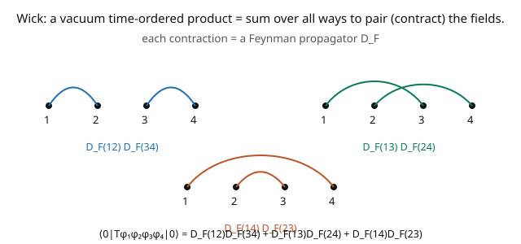

# Quantum Field Theory · Lesson 3.3: Wick's theorem

> ⏱ ~15 min · Module 3: Interactions and perturbation theory · Builds on: [3.2 The Dyson series and time ordering](03-02-dyson-series-time-ordering.md) · Unlocks: [3.4 Feynman diagrams for $\phi^4$ theory](03-04-feynman-diagrams-phi4.md)

## Why this matters

The Dyson series gives amplitudes as vacuum expectation values of **time-ordered products of many field operators**. Wick's theorem is the tool that *evaluates* them: it converts a time-ordered product into a sum over all ways of **pairing** (contracting) the fields, where each contraction is just a Feynman propagator. This is the computational heart of perturbation theory — it turns operator algebra into a bookkeeping problem, and each term in the sum will turn out to be a **Feynman diagram**. Without Wick's theorem, every amplitude would be an intractable operator manipulation; with it, you draw pictures and multiply propagators. It's the bridge from the abstract Dyson series to the concrete diagrams of the next lesson.

## The idea

A time-ordered product like $T\{\phi_1\phi_2\phi_3\phi_4\}$ is a mess of $a$'s and $a^\dagger$'s in some order. To take its vacuum expectation value, you'd normally commute all annihilation operators to the right (where they kill $|0\rangle$) and all creation operators to the left (where they kill $\langle 0|$) — i.e. **normal-order** it. Wick's theorem says the difference between the time-ordered product and the normal-ordered one is a sum of **contractions**.

A **contraction** of two fields, $\overline{\phi(x)\phi(y)}$, is precisely the Feynman propagator $D_F(x - y)$ — a $c$-number, the amplitude for a particle to travel from one point to the other ([2.4](02-04-feynman-propagator.md)). Wick's theorem:

$$T\{\phi_1\cdots\phi_n\} = \,:\!\phi_1\cdots\phi_n\!:\; + \;(\text{sum of all single contractions})\,:\!\cdots\!:\; + \cdots + (\text{fully contracted}).$$

Now the payoff for vacuum expectation values. A normal-ordered product has all $a$'s on the right, so $\langle 0|\!:\!\cdots\!:\!|0\rangle = 0$ — *any* term with even one uncontracted field vanishes in the vacuum. Only the **fully contracted** terms survive:

$$\langle 0|T\{\phi_1\cdots\phi_n\}|0\rangle = \sum_{\text{full pairings}}\prod\,D_F.$$

So the vacuum expectation value is a sum over all ways to pair up the fields, each pairing giving a product of propagators (the picture — for four fields, three pairings). This is a purely combinatorial rule, and each pairing pattern *is* a Feynman diagram. (For an odd number of fields there's no full pairing, so the VEV vanishes — consistent with the $\phi \to -\phi$ symmetry of the free theory.)

## The formal version

Define the **contraction** of two fields (inside a time-ordered product) as the Feynman propagator:

$$\overline{\phi(x)\,\phi(y)} \;=\; \langle 0|T\phi(x)\phi(y)|0\rangle \;=\; D_F(x - y).$$

**Wick's theorem.** The time-ordered product equals the normal-ordered product plus all possible contractions:

$$T\{\phi_1\phi_2\cdots\phi_n\} = \;:\!\phi_1\cdots\phi_n\!:\; + \sum_{\text{single}}:\!\overline{\phi_i\phi_j}\cdots\!:\; + \sum_{\text{double}}:\!\overline{\phi_i\phi_j}\;\overline{\phi_k\phi_l}\cdots\!:\; + \cdots$$

where each sum runs over all distinct ways to choose the contracted pairs, and contracted fields are removed from the normal ordering (replaced by their propagator). *In words:* time-ordering = normal-ordering + every way to pair fields into propagators.

**Vacuum expectation values.** Since $\langle 0|\!:\!\mathcal{O}\!:\!|0\rangle = 0$ unless $\mathcal{O}$ is a pure number (all fields contracted), only fully-contracted terms survive:

$$\langle 0|T\{\phi_1\cdots\phi_n\}|0\rangle = \sum_{\text{complete pairings}}\;\prod_{\text{pairs }(i,j)} D_F(x_i - x_j).$$

*In words:* the $n$-point vacuum function is the sum over all ways to pair the $n$ points, each pair contributing a propagator; nonzero only for even $n$. For $n = 2$ it's one propagator; for $n = 4$ it's a sum of $3$ products of two propagators; for general even $n$ there are $(n-1)!! = (n-1)(n-3)\cdots 1$ pairings.

## Picture

## Worked examples

**Example 1 (two fields — the propagator).** For $n = 2$, there's exactly one pairing:

$$\langle 0|T\{\phi(x)\phi(y)\}|0\rangle = \overline{\phi(x)\phi(y)} = D_F(x - y).$$

This is just the definition of the propagator ([2.4](02-04-feynman-propagator.md)) — Wick's theorem for two fields *is* the statement that the two-point function is the Feynman propagator. Simple, but it's the atom from which all higher functions are built.

**Example 2 (four fields — three pairings, the tree structure of $\phi^4$).** For $n = 4$, list the ways to pair $\{1,2,3,4\}$: $(12)(34)$, $(13)(24)$, $(14)(23)$ — three complete pairings. So

$$\langle 0|T\{\phi_1\phi_2\phi_3\phi_4\}|0\rangle = D_F(x_1{-}x_2)D_F(x_3{-}x_4) + D_F(x_1{-}x_3)D_F(x_2{-}x_4) + D_F(x_1{-}x_4)D_F(x_2{-}x_3).$$

Each term is a **Feynman diagram**: two propagator lines connecting the four points in one of three ways. When these four fields come from an interaction vertex and external particles (as in $2 \to 2$ scattering), these pairings become the $s$-, $t$-, and $u$-channel diagrams. The purely operator question "what is this VEV?" has become "draw all the pairings and multiply propagators" — combinatorics, not algebra. This is why QFT calculations are done with pictures.

## Watch out

- **You might contract fields that aren't in a time-ordered product.** Wick's theorem in this form applies inside $T\{\cdots\}$, where a contraction is the *Feynman* propagator. Contractions of normal-ordered products, or of fields at equal times, use different two-point functions — keep track of which product (time-ordered vs. normal) you're reducing.
- **You might miscount the pairings or symmetry factors.** The number of full pairings of $2k$ fields is $(2k-1)!! = (2k-1)(2k-3)\cdots 1$ (e.g. $3$ for four fields, $15$ for six). But *identical* fields at a vertex can produce equal pairings, giving **symmetry factors** ([3.5](03-05-feynman-rules-amplitude.md)) — extra $1/S$ factors that Wick's combinatorics generate automatically but that are easy to botch by hand.
- **You might expect odd $n$-point functions to be nonzero.** For a free scalar (or any theory even under $\phi \to -\phi$), any odd number of fields can't be fully paired, so $\langle 0|T\{\text{odd number of }\phi\}|0\rangle = 0$. Nonzero odd functions require an interaction that breaks the symmetry (a $\phi^3$ vertex, or a nonzero vacuum expectation value $\langle\phi\rangle \neq 0$).

## One-liner

> Wick's theorem turns a vacuum time-ordered product into a sum over all ways to pair the fields, each pair a Feynman propagator — reducing operator algebra to combinatorics, with each pairing a Feynman diagram.

## Problems

**P1 (🟢)** How many complete pairings does a six-point function $\langle 0|T\{\phi_1\cdots\phi_6\}|0\rangle$ have? Write the general formula $(2k-1)!!$ and evaluate for $2k = 2, 4, 6$.

**P2 (🟡)** Using Wick's theorem, evaluate $\langle 0|T\{\phi(x)^2\phi(y)^2\}|0\rangle$ (two fields at $x$, two at $y$). *Hint:* there are three pairings; identify which give "propagators connecting $x$ to $y$" versus "a field at $x$ contracted with the other field at $x$" (a self-contraction), and write the result as a sum of products of $D_F(x-y)$ and $D_F(0)$.

**P3 (🔴, optional)** Explain why $\langle 0|T\{\phi(x_1)\phi(x_2)\phi(x_3)\}|0\rangle = 0$ for a free scalar field, and what interaction term would make the analogous three-point function nonzero. *Hint:* count fields for pairing; then think about which $\mathcal{L}_{\text{int}}$ supplies an odd vertex.

Solutions

**P1** The number of complete pairings of $2k$ fields is $(2k-1)!! = (2k-1)(2k-3)\cdots 3\cdot 1$. For $2k = 2$: $1!! = 1$ (one pairing). For $2k = 4$: $3!! = 3\cdot 1 = 3$. For $2k = 6$: $5!! = 5\cdot 3\cdot 1 = 15$. So the six-point function is a sum of **15** products of three propagators.

**P2** Label the fields $\phi_a(x), \phi_b(x), \phi_c(y), \phi_d(y)$. The three pairings: (i) $\overline{\phi_a\phi_b}\,\overline{\phi_c\phi_d} = D_F(x-x)D_F(y-y) = D_F(0)^2$ (both self-contractions — the fields at the same point pair); (ii) $\overline{\phi_a\phi_c}\,\overline{\phi_b\phi_d} = D_F(x-y)^2$; (iii) $\overline{\phi_a\phi_d}\,\overline{\phi_b\phi_c} = D_F(x-y)^2$. Sum: $\langle 0|T\{\phi(x)^2\phi(y)^2\}|0\rangle = D_F(0)^2 + 2\,D_F(x-y)^2$. The $D_F(0)^2$ term is a disconnected "vacuum bubble" (each point self-contracts); the $2D_F(x-y)^2$ term connects $x$ to $y$ with two propagators (a loop when $x, y$ are vertices). $D_F(0)$ is divergent — a first hint of the loop divergences of [6.4](06-04-loops-uv-divergences.md).

**P3** A three-point function has an *odd* number ($3$) of fields, which cannot be completely paired (pairing removes fields two at a time, leaving one uncontracted). Any term with an uncontracted field is normal-ordered and has zero vacuum expectation value. So $\langle 0|T\{\phi_1\phi_2\phi_3\}|0\rangle = 0$ for the free field. More deeply, the free theory is symmetric under $\phi \to -\phi$, and a three-point function is odd under it, hence must vanish. To make it nonzero you need an interaction that breaks this symmetry — a **$\phi^3$ vertex** ($\mathcal{L}_{\text{int}} = -\frac{g}{3!}\phi^3$), which supplies an odd number of fields at a vertex and lets three external legs connect through it (giving a nonzero connected three-point function at order $g$). ∎

## Flashback

**From Lesson 3.2 (The Dyson series and time ordering):** Write the order-$\lambda$ term of the S-matrix for $\phi^4$ theory with $\mathcal{L}_{\text{int}} = -\frac{\lambda}{4!}\phi^4$.

Solution

The order-$\lambda$ term is $S^{(1)} = i\int d^4x\,\mathcal{L}_{\text{int}} = -i\int d^4x\,\frac{\lambda}{4!}\phi_I^4(x)$, with $\phi_I$ the free interaction-picture field. Sandwiched between in- and out-states, its four field operators — reduced via Wick's theorem — produce the tree-level $2\to2$ amplitude: two fields annihilate the incoming particles, two create the outgoing ones. ✓ (Evaluating $\langle f|S^{(1)}|i\rangle$ is precisely a Wick-contraction exercise, yielding $\mathcal{M} = -\lambda$.)

## Connections

- **Backward:** Wick's theorem evaluates the time-ordered products of the Dyson series ([3.2](03-02-dyson-series-time-ordering.md)); each contraction is the Feynman propagator of [2.4](02-04-feynman-propagator.md); normal ordering is from [2.3](02-03-particles-as-excitations-energy-momentum.md).
- **Forward:** [3.4](03-04-feynman-diagrams-phi4.md) reads each pairing as a Feynman diagram (points = vertices/external legs, contractions = lines); [3.5](03-05-feynman-rules-amplitude.md) codifies the propagator-and-vertex bookkeeping into Feynman rules; the $D_F(0)$ self-contractions become loop divergences ([6.4](06-04-loops-uv-divergences.md)).
- **Sideways (probability/combinatorics):** Wick's theorem is the operator version of **Isserlis' theorem** for Gaussian random variables ("the expectation of a product = sum over pairings of products of covariances"), reflecting that the free field is a Gaussian — the same identity used in [`probability-theory`](../../probability-theory/syllabus.md) and in the path-integral derivation ([6.3](06-03-recovering-propagators-feynman-rules.md)).
