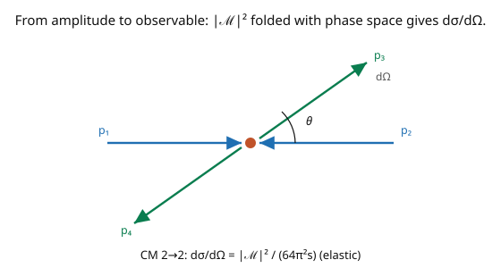

# Quantum Field Theory · Lesson 3.6: Cross-sections and decay rates

> ⏱ ~15 min · Module 3: Interactions and perturbation theory · Builds on: [3.5 Feynman rules and the amplitude](03-05-feynman-rules-amplitude.md) · Unlocks: [4.1 The Lorentz group and spinors](04-01-lorentz-group-spinors.md)

## Why this matters

An amplitude $\mathcal{M}$ is not yet something you measure — experiments measure **cross-sections** (how likely a scattering is, an effective target area) and **decay rates** (how fast an unstable particle falls apart). This lesson is the final bridge from theory to number: take $|\mathcal{M}|^2$, fold in the **phase space** (how many final states are kinematically available) and the **flux** (how many collisions per unit time), and out comes a cross-section in barns or a rate in inverse seconds — a prediction a detector can confirm. This is what makes QFT a *physical* theory rather than a formal one, and it completes the arc of Module 3: from Lagrangian to Feynman diagram to a measured quantity. It's Fermi's golden rule, relativistic and complete.

## The idea

The transition probability is $|\mathcal{M}|^2$, but to get a rate or cross-section you must account for two things the amplitude alone doesn't know (the picture):

- **Phase space:** how many distinct final states are available, weighted Lorentz-invariantly. Two outgoing particles can share the energy in many ways (different angles), and you integrate over them. More available phase space → larger rate.
- **Flux / normalization:** for a cross-section, divide by the incoming *flux* (particles per area per time) so the answer is an area, independent of beam intensity. For a decay, divide by the parent's energy (its "clock").

Assemble these and you get **Fermi's golden rule**, relativistically: rate $\propto |\mathcal{M}|^2 \times$ (phase space) $\div$ (flux or energy). For the two headline cases:

- **$2 \to 2$ scattering** in the center-of-mass frame: the differential cross-section is $\frac{d\sigma}{d\Omega} = \frac{|\mathcal{M}|^2}{64\pi^2 s}\cdot\frac{|\mathbf{p}_f|}{|\mathbf{p}_i|}$ (with $s$ the squared CM energy; for elastic scattering $|\mathbf{p}_f| = |\mathbf{p}_i|$ and the last factor is $1$).
- **$1 \to 2$ decay:** the rate is $\Gamma = \frac{|\mathbf{p}|}{8\pi m^2}|\mathcal{M}|^2$ (with $m$ the parent mass, $|\mathbf{p}|$ the daughter momentum), times $\frac12$ for identical daughters.

One recurring subtlety: **identical particles in the final state** are overcounted (swapping them gives the same physical state), so you divide by a symmetry factor (or integrate over half the solid angle). For $\phi^4$'s identical scalars, that's a factor of $\frac12$ in the *total* cross-section.

## The formal version

**Differential cross-section for $2 \to 2$** (CM frame, incoming momenta $\pm\mathbf{p}_i$, outgoing $\pm\mathbf{p}_f$, $\sqrt{s}$ = total CM energy):

$$\frac{d\sigma}{d\Omega} = \frac{1}{64\pi^2 s}\,\frac{|\mathbf{p}_f|}{|\mathbf{p}_i|}\,|\mathcal{M}|^2.$$

*In words:* the amplitude squared, times a kinematic factor from two-body phase space and the flux; $\frac{|\mathbf{p}_f|}{|\mathbf{p}_i|} = 1$ for elastic scattering (equal in/out masses). The **total cross-section** is $\sigma = \int\frac{d\sigma}{d\Omega}\,d\Omega$, divided by $2$ if the two final particles are **identical** (to avoid double-counting).

**Decay rate for $1 \to 2$** (parent mass $m$ at rest, daughters with CM momentum $|\mathbf{p}|$):

$$\Gamma = \frac{|\mathbf{p}|}{8\pi m^2}\,|\mathcal{M}|^2 \quad(\times\tfrac12 \text{ for identical daughters}).$$

*In words:* the decay rate is $|\mathcal{M}|^2$ times two-body phase space over the parent energy; $1/\Gamma$ is the particle's mean lifetime. Both formulas descend from the master expression

$$d\Gamma \text{ or } d\sigma \;\propto\; |\mathcal{M}|^2\,(2\pi)^4\delta^4\Big(\textstyle\sum p\Big)\prod_{\text{final}}\frac{d^3p_f}{(2\pi)^3\,2E_f},$$

the **Lorentz-invariant phase space** (each final particle contributes $\frac{d^3p}{(2\pi)^3 2E}$, and the delta enforces conservation), divided by the flux ($4E_1E_2 v_{\text{rel}}$ for scattering) or parent energy ($2m$ for decay). *In words:* square the amplitude, integrate over all kinematically allowed final momenta with the invariant measure, normalize by the incoming flux.

## Picture

## Worked examples

**Example 1 (the $\phi^4$ cross-section — Boss Problem 3 completed).** From [3.5](03-05-feynman-rules-amplitude.md), the tree-level $2\to2$ amplitude is $\mathcal{M} = -\lambda$, so $|\mathcal{M}|^2 = \lambda^2$ — constant, no angular dependence. The scattering is elastic (equal masses), so $|\mathbf{p}_f| = |\mathbf{p}_i|$ and

$$\frac{d\sigma}{d\Omega} = \frac{|\mathcal{M}|^2}{64\pi^2 s} = \frac{\lambda^2}{64\pi^2 s}.$$

Isotropic — same in every direction (a contact interaction has no preferred angle). Integrate over solid angle, dividing by $2$ for the **identical** final scalars:

$$\sigma = \frac{1}{2}\int d\Omega\,\frac{\lambda^2}{64\pi^2 s} = \frac{1}{2}\cdot 4\pi\cdot\frac{\lambda^2}{64\pi^2 s} = \frac{\lambda^2}{32\pi s}.$$

**This is a real, dimensionally-correct prediction:** the total cross-section for $\phi^4$ scattering, $\sigma = \frac{\lambda^2}{32\pi s}$ — decreasing with energy as $1/s$, growing as $\lambda^2$ with the coupling. From Lagrangian to measurable number in a page: this is what QFT *does*.

**Example 2 (a decay rate).** Suppose a heavy scalar $\Phi$ of mass $M$ decays to two light scalars via an interaction giving amplitude $\mathcal{M} = -g$ (a constant coupling $g$ with mass dimension). If the daughters are massless, their CM momentum is $|\mathbf{p}| = M/2$, and

$$\Gamma = \frac{1}{2}\cdot\frac{|\mathbf{p}|}{8\pi M^2}|\mathcal{M}|^2 = \frac{1}{2}\cdot\frac{M/2}{8\pi M^2}\,g^2 = \frac{g^2}{32\pi M},$$

with the $\frac12$ for identical daughters. The **lifetime** is $\tau = 1/\Gamma = 32\pi M/g^2$ — a heavier particle with the same coupling decays faster (more phase space), and stronger coupling $g$ means shorter life. This is Fermi's golden rule delivering a measurable decay width, exactly how particle lifetimes are predicted and checked at colliders.

## Watch out

- **You might forget the identical-particle factor.** Final states with identical particles are overcounted when you integrate the full solid angle — the configuration "particle A at $\theta$, B at $\pi-\theta$" is the *same physical state* as the swap. Divide the total cross-section (or decay rate) by $2$ (or the appropriate symmetry factor). For $\phi^4$ this is the difference between $\frac{\lambda^2}{16\pi s}$ (wrong) and $\frac{\lambda^2}{32\pi s}$ (right).
- **You might use non-relativistic normalization.** The phase-space measure $\frac{d^3p}{(2\pi)^3 2E}$ and the $\sqrt{2\omega}$ state normalization ([2.2](02-02-creation-annihilation-fock-space.md)) must be consistent — the $2E$ factors are what make the result Lorentz-invariant. Mixing conventions gives cross-sections off by powers of $2E$.
- **You might confuse $s, t, u$ or the CM energy.** $s = (p_1 + p_2)^2$ is the squared total CM energy ($\sqrt{s}$ = CM energy); the cross-section formula uses $s$. Getting the Mandelstam variables straight matters especially when $\mathcal{M}$ depends on them (as in $\phi^3$ or QED, unlike the constant $\phi^4$ case).

## One-liner

> A cross-section is $|\mathcal{M}|^2$ folded with phase space and divided by the flux — for $2\to2$ in the CM frame, $\frac{d\sigma}{d\Omega} = \frac{|\mathcal{M}|^2}{64\pi^2 s}$ — turning a Feynman-diagram amplitude into a measurable area (and, for decays, a lifetime).

## Problems

**P1 (🟢)** For $\phi^4$ theory, confirm that the total cross-section is $\sigma = \frac{\lambda^2}{32\pi s}$ by integrating the (constant) differential cross-section $\frac{d\sigma}{d\Omega} = \frac{\lambda^2}{64\pi^2 s}$ over solid angle and applying the identical-particle factor $\frac12$. What is $\int d\Omega$?

**P2 (🟡)** Check the dimensions: in natural units a cross-section has mass-dimension $-2$ (an area). Verify $\sigma = \frac{\lambda^2}{32\pi s}$ has dimension $-2$, given that $\lambda$ is dimensionless (in 4D) and $s$ has dimension $+2$ (energy squared). Why does $\sigma \propto 1/s$ make physical sense at high energy?

**P3 (🔴, optional)** A resonance appears when an intermediate particle in an $s$-channel diagram goes on-shell ($s = m^2$), making the propagator $\frac{1}{s - m^2}$ blow up. In reality the divergence is cut off by the particle's decay width $\Gamma$, giving the **Breit–Wigner** form $\frac{1}{s - m^2 + im\Gamma}$. Show the cross-section $\sigma \propto \frac{1}{(s - m^2)^2 + m^2\Gamma^2}$ peaks at $s = m^2$ with width set by $\Gamma$. Why does a narrow resonance (small $\Gamma$) mean a long-lived particle?

Solutions

**P1** $\int d\Omega = 4\pi$ (the full solid angle). So $\sigma = \frac12\int d\Omega\,\frac{\lambda^2}{64\pi^2 s} = \frac12\cdot 4\pi\cdot\frac{\lambda^2}{64\pi^2 s} = \frac{2\pi\lambda^2}{64\pi^2 s} = \frac{\lambda^2}{32\pi s}$. ✓ The $\frac12$ is the identical-particle factor.

**P2** In 4D, $\lambda$ is dimensionless (mass-dimension $0$), so $\lambda^2$ has dimension $0$; $s$ has dimension $+2$ (it's energy², i.e. mass²); $32\pi$ is dimensionless. So $[\sigma] = \frac{0}{2} = -2$ — mass-dimension $-2$, which is (mass)$^{-2}$ = (length)$^2$ = an area. ✓ Physically, $\sigma \propto 1/s$ (cross-section shrinking with energy) makes sense because the effective "size" a particle presents in a contact interaction is set by its wavelength $\sim 1/\sqrt{s}$, so the area $\sim 1/s$ — faster particles are harder to hit. (This falling cross-section is characteristic of a renormalizable point interaction; it's why high-energy colliders need high luminosity.)

**P3** With the Breit–Wigner propagator, $|\mathcal{M}|^2 \propto \left|\frac{1}{s - m^2 + im\Gamma}\right|^2 = \frac{1}{(s-m^2)^2 + m^2\Gamma^2}$, so $\sigma \propto \frac{1}{(s-m^2)^2 + m^2\Gamma^2}$. This is a Lorentzian peaked at $s = m^2$ (where the denominator is smallest, $= m^2\Gamma^2$), with **full width at half maximum** $\approx 2m\Gamma$ (in $s$) — so the width of the resonance peak directly measures $\Gamma$. A **narrow** resonance (small $\Gamma$) corresponds to a **long-lived** particle because the lifetime is $\tau = 1/\Gamma$: small width ⟺ small decay rate ⟺ long lifetime. Measuring the width of a resonance bump in the cross-section is exactly how particle lifetimes (like the $Z$ boson's) are determined. ∎

## Flashback

**From Lesson 3.5 (Feynman rules and the amplitude):** Using the Feynman rules, write $i\mathcal{M}$ for tree-level $2\to2$ scattering in $\phi^4$ theory and give $|\mathcal{M}|^2$.

Solution

The single four-point vertex gives $i\mathcal{M} = -i\lambda$, so $\mathcal{M} = -\lambda$ and $|\mathcal{M}|^2 = \lambda^2$ — a constant, independent of scattering angle and energy. This constant amplitude is what makes the $\phi^4$ cross-section isotropic and $\propto \lambda^2/s$. ✓

## Connections

- **Backward:** the amplitude $\mathcal{M}$ comes from the Feynman rules ([3.5](03-05-feynman-rules-amplitude.md)); the phase-space measure uses the Lorentz-invariant normalization of [2.2](02-02-creation-annihilation-fock-space.md); this is Fermi's golden rule from [`quantum-mechanics`](../../quantum-mechanics/syllabus.md), made relativistic.
- **Forward:** Module 5 computes QED cross-sections ($e^-\mu^- \to e^-\mu^-$, [5.6](05-06-squaring-amplitude-cross-section.md)) with the same phase-space machinery but a spinor amplitude; the Breit–Wigner form (P3) is how unstable particles (resonances) appear in data.
- **Sideways (experiment):** cross-sections in barns and decay widths in eV are the *direct* outputs of collider and fixed-target experiments; comparing the QFT-predicted $\sigma$ and $\Gamma$ to measured values is how the Standard Model is tested to extraordinary precision.

*Module 3 capstone (Boss Problem 3): computing the tree-level $\phi^4$ amplitude $\mathcal{M} = -\lambda$ and assembling the differential cross-section $\frac{d\sigma}{d\Omega} = \frac{\lambda^2}{64\pi^2 s}$ (total $\sigma = \frac{\lambda^2}{32\pi s}$ with the identical-particle factor) — Examples 1 across [3.4](03-04-feynman-diagrams-phi4.md)–[3.6](03-06-cross-sections-decay-rates.md) assemble exactly this.*
