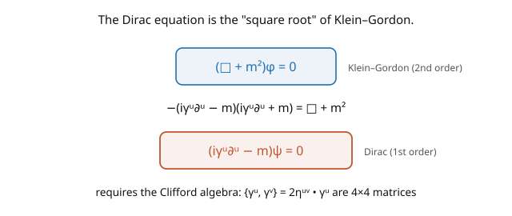

# Quantum Field Theory · Lesson 4.2: The Dirac equation

> ⏱ ~15 min · Module 4: Fermions and the Dirac field · Builds on: [4.1 The Lorentz group and spinors](04-01-lorentz-group-spinors.md) · Unlocks: [4.3 Solutions, spin, and antiparticles](04-03-solutions-spin-antiparticles.md)

## Why this matters

The **Dirac equation** is the wave equation of the electron — arguably the most beautiful equation in physics. Dirac was chasing a first-order (in time) relativistic equation to cure the Klein–Gordon field's negative probabilities ([1.4](01-04-klein-gordon-field.md)), and in doing so he was forced to invent **gamma matrices** and predict **antimatter**. The equation packages spin, relativity, and (once quantized) antiparticles into one line, $(i\gamma^\mu\partial_\mu - m)\psi = 0$. It's the "square root" of Klein–Gordon: factor the KG operator and you're forced into the Clifford algebra of the gammas, which *requires* the four-component spinor structure of [4.1](04-01-lorentz-group-spinors.md). This is the field of all charged matter — the foundation of QED (Module 5) and the reason the electron has spin $\tfrac12$ and a magnetic moment.

## The idea

The Klein–Gordon equation is second-order in time, and that's what gave it a non-positive density ([1.4](01-04-klein-gordon-field.md)). Dirac's idea: find a **first-order** equation whose square is Klein–Gordon (the picture). Write it as $(i\gamma^\mu\partial_\mu - m)\psi = 0$ for some coefficients $\gamma^\mu$, and demand that applying the operator twice reproduces $(\Box + m^2)$. Multiplying $(i\gamma^\mu\partial_\mu - m)(i\gamma^\nu\partial_\nu + m)$ and matching to $-(\Box + m^2)$ forces

$$\{\gamma^\mu, \gamma^\nu\} = \gamma^\mu\gamma^\nu + \gamma^\nu\gamma^\mu = 2\eta^{\mu\nu}\,\mathbb{1}.$$

This is the **Clifford algebra**. It has *no solution in ordinary numbers* (numbers commute, so $\{\gamma^0, \gamma^1\} = 2\gamma^0\gamma^1 \neq 0$) — you need **matrices**, and the smallest ones that work in 4D are $4 \times 4$. So $\psi$ must be a four-component object: a **Dirac spinor**, exactly the $(\tfrac12,0)\oplus(0,\tfrac12)$ representation of [4.1](04-01-lorentz-group-spinors.md). The demand "first-order and squares to Klein–Gordon" *forced* the spinor structure and the number of components.

Every solution of the Dirac equation automatically solves Klein–Gordon (since Dirac squared *is* KG), so Dirac particles still have $E^2 = \mathbf{p}^2 + m^2$ — but now with the extra spinor index carrying spin, and the negative-energy solutions reinterpreted (next lesson) as antiparticles. Dirac's first-order equation *does* have a positive-definite density $\psi^\dagger\psi$, curing the KG disease — at the cost of introducing antimatter, which Dirac initially found troubling and which turned out to be his greatest prediction.

## The formal version

The **Dirac equation** for a spinor field $\psi(x)$ (four components) of mass $m$:

$$(i\gamma^\mu\partial_\mu - m)\psi = 0, \qquad\text{often written}\qquad (i\,\partial\!\!\!/ - m)\psi = 0,$$

using the **Feynman slash** $\partial\!\!\!/ \equiv \gamma^\mu\partial_\mu$ (and $\not{p} \equiv \gamma^\mu p_\mu$). The $\gamma^\mu$ are four $4\times4$ matrices satisfying the **Clifford algebra**

$$\{\gamma^\mu, \gamma^\nu\} = 2\eta^{\mu\nu}\mathbb{1}.$$

*In words:* the gammas anticommute for $\mu \neq \nu$ and square to $\pm\mathbb{1}$ ($(\gamma^0)^2 = \mathbb{1}$, $(\gamma^i)^2 = -\mathbb{1}$); this algebra is what makes the Dirac operator a square root of Klein–Gordon. A common explicit choice (the **Dirac representation**):

$$\gamma^0 = \begin{pmatrix}\mathbb{1} & 0\\0 & -\mathbb{1}\end{pmatrix}, \qquad \gamma^i = \begin{pmatrix}0 & \sigma^i\\-\sigma^i & 0\end{pmatrix},$$

with $\sigma^i$ the Pauli matrices. Define the **Dirac adjoint** $\bar\psi = \psi^\dagger\gamma^0$; then $\bar\psi\psi$ is a Lorentz scalar and $j^\mu = \bar\psi\gamma^\mu\psi$ is a conserved current with **positive** density $j^0 = \psi^\dagger\psi > 0$ (curing the KG problem). **Plane-wave solutions:** $\psi = u(p)e^{-ip\cdot x}$ (positive energy) and $\psi = v(p)e^{+ip\cdot x}$ (negative frequency / antiparticle), where the spinors satisfy

$$(\not{p} - m)u(p) = 0, \qquad (\not{p} + m)v(p) = 0.$$

*In words:* on-shell spinor amplitudes are eigenvectors of $\not{p}$; the $u$'s describe particles, the $v$'s antiparticles ([4.3](04-03-solutions-spin-antiparticles.md)).

## Picture

## Worked examples

**Example 1 (squaring Dirac gives Klein–Gordon — the Clifford algebra emerges).** Apply the conjugate operator to the Dirac equation: multiply $(i\gamma^\nu\partial_\nu + m)$ onto $(i\gamma^\mu\partial_\mu - m)\psi = 0$:

$$(i\gamma^\nu\partial_\nu + m)(i\gamma^\mu\partial_\mu - m)\psi = \big(-\gamma^\nu\gamma^\mu\partial_\nu\partial_\mu - m^2\big)\psi = 0.$$

Now $\gamma^\nu\gamma^\mu\partial_\nu\partial_\mu = \tfrac12\{\gamma^\nu, \gamma^\mu\}\partial_\nu\partial_\mu$ (since $\partial_\nu\partial_\mu$ is symmetric, only the symmetric part of $\gamma^\nu\gamma^\mu$ survives). Using $\{\gamma^\nu, \gamma^\mu\} = 2\eta^{\nu\mu}$, this is $\eta^{\nu\mu}\partial_\nu\partial_\mu = \Box$. So the equation becomes $-(\Box + m^2)\psi = 0$ — the **Klein–Gordon equation**. This works *only* if the gammas satisfy the Clifford algebra; that requirement is what forces them to be matrices, and the four-component spinor along with it. Dirac's factorization *derives* the gamma matrices.

**Example 2 (a particle at rest).** For a particle at rest, $\mathbf{p} = 0$, $p^\mu = (m, \mathbf{0})$, so $\not{p} = \gamma^0 m$. The equation $(\not{p} - m)u = (\gamma^0 - 1)m\,u = 0$ requires $\gamma^0 u = u$ — $u$ is a $+1$ eigenvector of $\gamma^0 = \text{diag}(\mathbb{1}, -\mathbb{1})$. The two independent solutions are $u = \begin{pmatrix}\chi\\0\end{pmatrix}$ with $\chi = \begin{pmatrix}1\\0\end{pmatrix}$ or $\begin{pmatrix}0\\1\end{pmatrix}$ — the **two spin states** (up and down) of the electron. Likewise $(\not{p} + m)v = 0$ gives $\gamma^0 v = -v$, the two lower-component solutions — the **antiparticle** spin states. So the four components neatly split at rest into (spin up/down) $\times$ (particle/antiparticle). The Dirac equation contains the electron's spin and the positron, all at once.

## Watch out

- **You might try to solve the Clifford algebra with numbers.** Impossible — $\{\gamma^\mu, \gamma^\nu\} = 2\eta^{\mu\nu}$ with $\mu \neq \nu$ gives $0$, which no nonzero numbers satisfy (numbers commute). You *need* matrices, and $4\times4$ is the minimum in four spacetime dimensions. This is why $\psi$ has four components — it's forced, not chosen.
- **You might forget the Dirac adjoint $\bar\psi = \psi^\dagger\gamma^0$.** Lorentz-invariant bilinears use $\bar\psi$, not $\psi^\dagger$: $\bar\psi\psi$ is a scalar, $\bar\psi\gamma^\mu\psi$ a vector (the current). Using $\psi^\dagger\psi$ where $\bar\psi\psi$ belongs gives non-covariant garbage. The $\gamma^0$ in the adjoint is essential for Lorentz covariance.
- **You might think the gamma representation is unique.** The Dirac, Weyl (chiral), and Majorana representations are all valid choices of $\gamma^\mu$ satisfying the Clifford algebra, related by similarity transformations. Physics is representation-independent; pick whichever is convenient (Dirac rep for the non-relativistic limit, Weyl rep for handedness/massless particles).

## One-liner

> The Dirac equation $(i\gamma^\mu\partial_\mu - m)\psi = 0$ is the first-order "square root" of Klein–Gordon; requiring it forces the gamma matrices' Clifford algebra $\{\gamma^\mu,\gamma^\nu\} = 2\eta^{\mu\nu}$ and hence the four-component spinor — packaging spin, positive density, and (upon quantization) antimatter.

## Problems

**P1 (🟢)** Verify from the Clifford algebra that $(\gamma^0)^2 = \mathbb{1}$ and $(\gamma^1)^2 = -\mathbb{1}$, and that $\gamma^0\gamma^1 = -\gamma^1\gamma^0$. *Hint:* use $\{\gamma^\mu, \gamma^\nu\} = 2\eta^{\mu\nu}$ with the mostly-minus metric $\eta = \text{diag}(1,-1,-1,-1)$.

**P2 (🟡)** Show that the Dirac current $j^\mu = \bar\psi\gamma^\mu\psi$ has a *positive-definite* density $j^0 = \psi^\dagger\psi$, curing the Klein–Gordon problem. *Hint:* $j^0 = \bar\psi\gamma^0\psi = \psi^\dagger\gamma^0\gamma^0\psi$, and $(\gamma^0)^2 = \mathbb{1}$.

**P3 (🔴, optional)** The chirality matrix is $\gamma^5 = i\gamma^0\gamma^1\gamma^2\gamma^3$. Show $(\gamma^5)^2 = \mathbb{1}$ and $\{\gamma^5, \gamma^\mu\} = 0$ (it anticommutes with all $\gamma^\mu$). Hence the projectors $P_{L,R} = \tfrac12(1 \mp \gamma^5)$ split any spinor into left- and right-handed **Weyl** pieces — recovering the $(\tfrac12,0)\oplus(0,\tfrac12)$ decomposition of [4.1](04-01-lorentz-group-spinors.md). Why does a *mass* term $m\bar\psi\psi$ mix $L$ and $R$?

Solutions

**P1** From $\{\gamma^\mu, \gamma^\nu\} = 2\eta^{\mu\nu}$ with $\mu = \nu$: $2(\gamma^0)^2 = 2\eta^{00} = 2(+1)$, so $(\gamma^0)^2 = \mathbb{1}$; and $2(\gamma^1)^2 = 2\eta^{11} = 2(-1)$, so $(\gamma^1)^2 = -\mathbb{1}$. For $\mu = 0, \nu = 1$ ($\mu \neq \nu$): $\{\gamma^0, \gamma^1\} = 2\eta^{01} = 0$, i.e. $\gamma^0\gamma^1 + \gamma^1\gamma^0 = 0$, so $\gamma^0\gamma^1 = -\gamma^1\gamma^0$ (they anticommute). ✓

**P2** $j^0 = \bar\psi\gamma^0\psi = (\psi^\dagger\gamma^0)\gamma^0\psi = \psi^\dagger(\gamma^0)^2\psi = \psi^\dagger\mathbb{1}\psi = \psi^\dagger\psi = \sum_a|\psi_a|^2 \geq 0$. This is manifestly positive-definite (a sum of squared magnitudes), so it *can* serve as a probability density — exactly the property the Klein–Gordon density lacked ([1.4](01-04-klein-gordon-field.md)). Dirac's first-order equation fixes the negative-probability disease. (The price, revealed on quantization, is that this "probability" interpretation must still give way to a field theory with antiparticles — but the density is at least positive.)

**P3** $(\gamma^5)^2 = (i)^2\gamma^0\gamma^1\gamma^2\gamma^3\gamma^0\gamma^1\gamma^2\gamma^3$; anticommuting the second $\gamma^0$ leftward past three gammas (three sign flips) and using $(\gamma^0)^2 = 1$, then repeating, one finds $(\gamma^5)^2 = \mathbb{1}$. For $\{\gamma^5, \gamma^\mu\}$: $\gamma^5$ is a product of all four gammas, and moving a single $\gamma^\mu$ through it flips sign an odd number of times (it anticommutes with the three *other* gammas and commutes with itself's square), giving $\{\gamma^5, \gamma^\mu\} = 0$. Since $(\gamma^5)^2 = 1$, the operators $P_{L,R} = \tfrac12(1 \mp \gamma^5)$ are projectors ($P_L^2 = P_L$, $P_L + P_R = 1$, $P_L P_R = 0$), splitting $\psi = \psi_L + \psi_R$ into the two Weyl pieces. A **mass term** $m\bar\psi\psi = m(\bar\psi_L\psi_R + \bar\psi_R\psi_L)$ **mixes** $L$ and $R$ (the cross terms) — because $\bar\psi_L\psi_L = 0$ (the projectors kill it). So a mass necessarily couples the two handednesses, which is why a *massive* fermion needs both Weyl components (a full Dirac spinor), while a *massless* one can be a single Weyl fermion — the statement from [4.1](04-01-lorentz-group-spinors.md), now derived from $\gamma^5$. ∎

## Flashback

**From Lesson 4.1 (The Lorentz group and spinors):** Show that a spinor rotated by $2\pi$ about the $\hat z$-axis picks up a factor of $-1$.

Solution

A spinor transforms under a rotation by angle $\theta$ about $\hat z$ with $U = e^{i\theta\sigma_z/2}$ (half-angle). At $\theta = 2\pi$: $U = e^{i\pi\sigma_z} = \cos\pi\,\mathbb{1} + i\sin\pi\,\sigma_z = -\mathbb{1}$. So $\psi \to -\psi$ — the spinor is double-valued, returning only after $4\pi$. This double-valuedness (the $SL(2,\mathbb{C})$ double cover) is the group-theoretic seed of Fermi statistics. ✓

## Connections

- **Backward:** the four-component spinor is the $(\tfrac12,0)\oplus(0,\tfrac12)$ representation of [4.1](04-01-lorentz-group-spinors.md); the Dirac operator squares to the Klein–Gordon operator of [1.4](01-04-klein-gordon-field.md); the positive density cures that lesson's disease.
- **Forward:** [4.3](04-03-solutions-spin-antiparticles.md) works out the $u, v$ spinors, spin sums, and the antiparticle interpretation; [4.4](04-04-quantizing-dirac-anticommutators.md) quantizes $\psi$ with anticommutators; [4.5](04-05-dirac-propagator.md) builds the fermion propagator; QED ([5.2](05-02-minimal-coupling-qed-lagrangian.md)) couples $\psi$ to the photon.
- **Sideways (chemistry/physics):** the Dirac equation predicts the electron's spin magnetic moment ($g = 2$), fine structure of atomic spectra, and — through the $u, v$ split — antimatter; the $\gamma^5$ chirality (P3) is central to the *parity violation* of the weak interaction.
