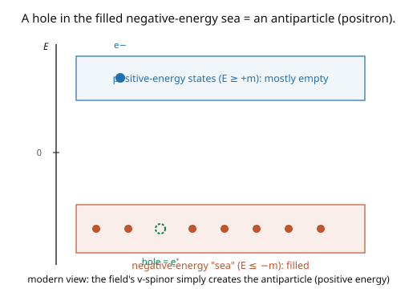

# Quantum Field Theory · Lesson 4.3: Solutions, spin, and antiparticles

> ⏱ ~15 min · Module 4: Fermions and the Dirac field · Builds on: [4.2 The Dirac equation](04-02-dirac-equation.md) · Unlocks: [4.4 Quantizing the Dirac field: anticommutators](04-04-quantizing-dirac-anticommutators.md)

## Why this matters

The Dirac equation's plane-wave solutions are the concrete spinors $u(p)$ and $v(p)$ that appear on every external fermion line in a Feynman diagram — you cannot compute a single QED amplitude without them. This lesson works out their structure, their **spin sums** (the completeness relations $\sum u\bar u = \not{p} + m$ that power all the trace technology of Module 5), and the physical meaning of the two solution types: $u$ for particles, $v$ for **antiparticles**. It also confronts Dirac's original puzzle — the negative-energy solutions — and its resolution, the antiparticle, which turned a mathematical embarrassment into the prediction of the positron (found in 1932, a triumph). Spin and antimatter, both falling out of one equation.

## The idea

The Dirac equation has two families of plane-wave solutions ([4.2](04-02-dirac-equation.md)):

- **Positive-frequency:** $\psi = u^s(p)\,e^{-ip\cdot x}$, with $(\not{p} - m)u^s = 0$. Two of these ($s = 1, 2$) — the **two spin states** of a particle (spin up and down).
- **Negative-frequency:** $\psi = v^s(p)\,e^{+ip\cdot x}$, with $(\not{p} + m)v^s = 0$. Two more — the **antiparticle** spin states.

So four independent solutions: (spin up/down) $\times$ (particle/antiparticle). Dirac worried about the negative-energy solutions: if the electron could cascade down into them, atoms would be unstable. His fix (the picture) was the **Dirac sea** — imagine *all* negative-energy states already filled, so the Pauli exclusion principle forbids an electron from falling in. A **hole** in this sea — a missing negative-energy electron — behaves as a particle of *positive* energy and *opposite* charge: the **positron**, the electron's antiparticle. The modern field-theory view is cleaner: don't fill any sea; instead, the $v$-spinor's coefficient is an operator that *creates an antiparticle* (positive energy, opposite charge) directly. Either way, the negative-energy solutions become antimatter.

The workhorse identities are the **spin sums**. Summing the outer products over the two spin states gives remarkably simple $4\times4$ matrices:

$$\sum_{s} u^s(p)\bar u^s(p) = \not{p} + m, \qquad \sum_s v^s(p)\bar v^s(p) = \not{p} - m.$$

These "completeness relations" are exactly what you need when squaring an amplitude and summing over unmeasured spins — they turn spinor sums into gamma-matrix traces (Module 5's "Casimir's trick"). Learn them; you'll use them constantly.

## The formal version

**Plane-wave spinors.** The Dirac equation's solutions are $\psi = u^s(p)e^{-ip\cdot x}$ and $\psi = v^s(p)e^{+ip\cdot x}$ ($s = 1, 2$), with

$$(\not{p} - m)u^s(p) = 0, \qquad (\not{p} + m)v^s(p) = 0,$$

normalized as $\bar u^s u^{s'} = 2m\,\delta^{ss'}$, $\bar v^s v^{s'} = -2m\,\delta^{ss'}$ (Peskin convention). An explicit form (Dirac basis): $u^s(p) = \begin{pmatrix}\sqrt{p\cdot\sigma}\,\xi^s\\\sqrt{p\cdot\bar\sigma}\,\xi^s\end{pmatrix}$ with $\xi^s$ a two-component spin basis and $\sigma^\mu = (\mathbb{1}, \boldsymbol\sigma)$, $\bar\sigma^\mu = (\mathbb{1}, -\boldsymbol\sigma)$.

**Spin sums (completeness relations):**

$$\sum_{s=1,2} u^s(p)\bar u^s(p) = \not{p} + m, \qquad \sum_{s=1,2} v^s(p)\bar v^s(p) = \not{p} - m.$$

*In words:* summing the spin states' outer products collapses to a simple gamma-matrix expression — the key to converting spin-summed $|\mathcal{M}|^2$ into traces ([5.6](05-06-squaring-amplitude-cross-section.md)).

**Helicity** is the spin projection along the direction of motion, $h = \mathbf{S}\cdot\hat{\mathbf{p}}$; it's $\pm\tfrac12$ ("right/left-handed"). For massless fermions helicity equals chirality ($\gamma^5$ eigenvalue) and is Lorentz-invariant; for massive fermions it's frame-dependent (you can overtake the particle and flip its apparent helicity). **Antiparticles:** the $v$-spinor solutions, upon quantization ([4.4](04-04-quantizing-dirac-anticommutators.md)), are created by operators $b^\dagger$ — antiparticles with the *same* mass and spin but *opposite* charge as the particle. *In words:* the negative-energy solutions of the classical Dirac equation become positive-energy antiparticles in the quantum field.

## Picture

## Worked examples

**Example 1 (the spin sum at rest — Boss Problem 4 piece).** Verify $\sum_s u^s\bar u^s = \not{p} + m$ for a particle at rest, $p^\mu = (m, \mathbf{0})$, so $\not{p} = m\gamma^0$ and we want $\sum_s u^s\bar u^s = m(\gamma^0 + 1)$. At rest ([4.2](04-02-dirac-equation.md) Example 2), $u^s = \sqrt{2m}\begin{pmatrix}\xi^s\\0\end{pmatrix}$ (upper components only, with $\xi^1 = \binom{1}{0}$, $\xi^2 = \binom{0}{1}$), and $\bar u^s = u^{s\dagger}\gamma^0 = \sqrt{2m}(\xi^{s\dagger}, 0)\gamma^0 = \sqrt{2m}(\xi^{s\dagger}, 0)$ (since $\gamma^0 = \text{diag}(\mathbb{1}, -\mathbb{1})$ acts as $+1$ on the upper block). Then

$$\sum_s u^s\bar u^s = 2m\sum_s\begin{pmatrix}\xi^s\\0\end{pmatrix}(\xi^{s\dagger}, 0) = 2m\begin{pmatrix}\sum_s\xi^s\xi^{s\dagger} & 0\\0 & 0\end{pmatrix} = 2m\begin{pmatrix}\mathbb{1} & 0\\0 & 0\end{pmatrix},$$

using $\sum_s\xi^s\xi^{s\dagger} = \mathbb{1}$ (completeness of the 2-spinors). And $m(\gamma^0 + 1) = m\begin{pmatrix}2\mathbb{1} & 0\\0 & 0\end{pmatrix} = 2m\begin{pmatrix}\mathbb{1}&0\\0&0\end{pmatrix}$. ✓ They agree. Boosting to general $p$ upgrades $m(\gamma^0+1)$ to $\not{p} + m$ (Lorentz covariance). This identity is the engine of every unpolarized cross-section.

**Example 2 (why negative energy becomes antimatter).** The negative-frequency solution $v^s(p)e^{+ip\cdot x}$ has $e^{+iEt}$ — naively "negative energy $-E$." Dirac's insight: an *absence* of a negative-energy electron (a hole in the filled sea) has energy $-(-E) = +E > 0$, charge $-(-e) = +e$, and momentum $-(-\mathbf{p}) = +\mathbf{p}$ — a positive-energy, positive-charge particle: the **positron**. It has the *same mass* as the electron (the sea's dispersion is symmetric). In the field-theory language, we never fill a sea; the coefficient of $v^s e^{+ip\cdot x}$ in the quantized field is $b_{\mathbf p}^{s\dagger}$, an operator that *creates* an antiparticle of momentum $\mathbf{p}$, energy $+E$, charge $+e$. Both pictures predict antimatter with equal mass and opposite charge — confirmed by the discovery of the positron. The negative-energy "problem" of the single-particle Dirac equation was actually a *prediction*.

## Watch out

- **You might treat $v(p)$ as a "negative-energy particle."** It's not — it's an **antiparticle** with *positive* energy. The "negative energy" is an artifact of the classical single-particle reading; the quantum field creates a genuine positive-energy antiparticle. Never assign negative physical energy to a $v$-spinor.
- **You might use the wrong sign in the $v$ spin sum.** $\sum u\bar u = \not{p} + m$ but $\sum v\bar v = \not{p} - m$ (minus sign!). The two differ by the sign of $m$, tracing back to $(\not{p} \mp m)$ in their defining equations. Getting the sign wrong flips antiparticle amplitudes.
- **You might conflate helicity and chirality.** For **massless** fermions they coincide and are Lorentz-invariant. For **massive** ones, chirality ($\gamma^5$ eigenvalue) is Lorentz-invariant but *not* conserved (mass mixes $L, R$), while helicity is conserved but *not* Lorentz-invariant (you can boost past the particle). Keep them distinct for massive particles.

## One-liner

> The Dirac equation has four plane-wave solutions — $u^s(p)$ (two spin states of the particle) and $v^s(p)$ (two of the antiparticle) — with spin sums $\sum u\bar u = \not{p} + m$, $\sum v\bar v = \not{p} - m$, and the negative-frequency solutions are antimatter, not negative energy.

## Problems

**P1 (🟢)** Using $(\not{p} - m)u = 0$ and the spin sum $\sum_s u^s\bar u^s = \not{p} + m$, verify that $(\not{p} - m)(\not{p} + m) = 0$ on the mass shell $p^2 = m^2$. *Hint:* $\not{p}\not{p} = p^2$ (from the Clifford algebra), so $(\not{p} - m)(\not{p} + m) = \not{p}^2 - m^2 = p^2 - m^2$.

**P2 (🟡)** Explain, using the hole picture, why the positron has the *same mass* but *opposite charge and opposite momentum-to-energy relation of a hole* compared to the electron. Then restate this in the field-theory language (the operator $b^\dagger$ creating an antiparticle) without any sea.

**P3 (🔴, optional)** Show that $\not{p}\not{p} = p^2\,\mathbb{1}$ using the Clifford algebra $\{\gamma^\mu, \gamma^\nu\} = 2\eta^{\mu\nu}$. *Hint:* $\not{p}\not{p} = \gamma^\mu\gamma^\nu p_\mu p_\nu = \tfrac12\{\gamma^\mu, \gamma^\nu\}p_\mu p_\nu$ (since $p_\mu p_\nu$ is symmetric). Why does this identity make $(\not{p} + m)$ the "numerator" of the Dirac propagator ([4.5](04-05-dirac-propagator.md))?

Solutions

**P1** $(\not{p} - m)(\not{p} + m) = \not{p}\not{p} + m\not{p} - m\not{p} - m^2 = \not{p}\not{p} - m^2$. Using $\not{p}\not{p} = p^2$ (P3): $= p^2 - m^2$. On the mass shell $p^2 = m^2$, this is $0$. So the operators $(\not{p} - m)$ and $(\not{p} + m)$ are "orthogonal" on-shell — consistent with $u$ satisfying $(\not{p}-m)u = 0$ and the projector structure of the spin sums. ✓

**P2** In the hole picture, a positron is the *absence* of a negative-energy electron of energy $-E$, charge $-e$, momentum $-\mathbf{p}$. Removing it leaves the sea with: energy increased by $+E$ (removing negative energy adds energy), so the hole has energy $+E > 0$; charge increased by $+e$ (removing charge $-e$), so charge $+e$ — **opposite** to the electron; momentum $+\mathbf{p}$. The mass is the same because the sea's dispersion $E = \sqrt{\mathbf{p}^2 + m^2}$ uses the same $m$. In field theory, there's no sea: the quantized field $\psi = \sum(a\,u\,e^{-ipx} + b^\dagger\,v\,e^{+ipx})$ has $b_{\mathbf p}^\dagger$ *creating* an antiparticle of momentum $\mathbf{p}$, energy $+E$, and charge $+e$ directly — same mass (same $\omega_{\mathbf p}$), opposite charge, no negative energies anywhere. Both descriptions agree on the observable: antimatter of equal mass, opposite charge.

**P3** $\not{p}\not{p} = \gamma^\mu p_\mu\,\gamma^\nu p_\nu = \gamma^\mu\gamma^\nu p_\mu p_\nu$. Since $p_\mu p_\nu$ is symmetric in $\mu \leftrightarrow \nu$, only the symmetric part of $\gamma^\mu\gamma^\nu$ contributes: $\gamma^\mu\gamma^\nu \to \tfrac12\{\gamma^\mu, \gamma^\nu\} = \eta^{\mu\nu}\mathbb{1}$. So $\not{p}\not{p} = \eta^{\mu\nu}p_\mu p_\nu\,\mathbb{1} = p^2\,\mathbb{1}$. This makes $(\not{p} + m)$ the propagator numerator because the Dirac propagator is the inverse of $(\not{p} - m)$: $\frac{1}{\not{p} - m} = \frac{\not{p} + m}{(\not{p} - m)(\not{p} + m)} = \frac{\not{p} + m}{p^2 - m^2}$ — rationalizing by multiplying top and bottom by $(\not{p} + m)$ turns the matrix denominator into the scalar $p^2 - m^2$, leaving the numerator $\not{p} + m$. So the fermion propagator is $\frac{i(\not{p} + m)}{p^2 - m^2 + i\varepsilon}$ ([4.5](04-05-dirac-propagator.md)). ∎

## Flashback

**From Lesson 4.2 (The Dirac equation):** Solve the Dirac equation $(\not{p} - m)u = 0$ for a particle at rest ($\mathbf{p} = 0$), and state how many independent solutions there are and what they represent.

Solution

At rest, $p^\mu = (m, \mathbf{0})$, so $\not{p} = m\gamma^0$ and the equation is $m(\gamma^0 - 1)u = 0$, requiring $\gamma^0 u = u$ — $u$ is a $+1$ eigenvector of $\gamma^0 = \text{diag}(\mathbb{1}, -\mathbb{1})$. The solutions are $u = \begin{pmatrix}\chi\\0\end{pmatrix}$ with $\chi = \binom{1}{0}$ or $\binom{0}{1}$: **two independent solutions**, the two spin states (up and down) of the particle. (The $(\not{p}+m)v = 0$ equation gives two more — the antiparticle spin states.) ✓

## Connections

- **Backward:** the $u, v$ spinors solve the Dirac equation of [4.2](04-02-dirac-equation.md); the four solutions realize the (spin) $\times$ (particle/antiparticle) structure hinted at in [4.1](04-01-lorentz-group-spinors.md); antiparticles were promised by causality in [2.5](02-05-causality-microcausality.md).
- **Forward:** [4.4](04-04-quantizing-dirac-anticommutators.md) makes the $b^\dagger$ antiparticle creation operator precise (with anticommutators); [4.5](04-05-dirac-propagator.md) uses $\not{p} + m$ as the propagator numerator; the spin sums drive the trace technology of [5.6](05-06-squaring-amplitude-cross-section.md).
- **Sideways (experiment):** the positron (Anderson, 1932) confirmed Dirac's antimatter prediction; helicity and chirality (massless-fermion physics) are central to the weak interaction's parity violation and to neutrino physics.

*Module 4 capstone (Boss Problem 4) uses the completeness relation $\sum_s u^s\bar u^s = \not{p} + m$ derived here, alongside the spin-statistics argument of [4.4](04-04-quantizing-dirac-anticommutators.md).*
