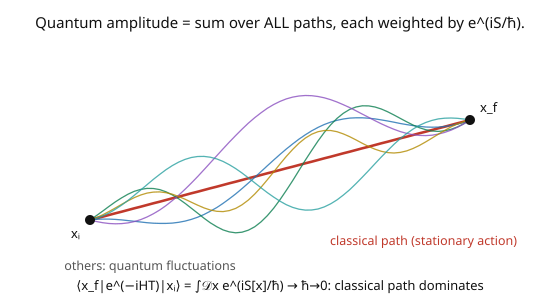

# Quantum Field Theory · Lesson 6.1: The path integral in quantum mechanics

> ⏱ ~15 min · Module 6: The path integral and renormalization · Builds on: [5.6 Squaring the amplitude and the cross-section](05-06-squaring-amplitude-cross-section.md), [`analytical-mechanics`](../../analytical-mechanics/syllabus.md) · Unlocks: [6.2 The path integral for fields; generating functionals](06-02-path-integral-fields-generating-functionals.md)

## Why this matters

There's a second, completely different formulation of quantum mechanics — Feynman's **path integral** — and it becomes the most powerful way to *do* QFT. Instead of operators and states, the amplitude to go from $A$ to $B$ is a **sum over all possible paths**, each weighted by a phase $e^{iS/\hbar}$ where $S$ is the classical action ([`analytical-mechanics`](../../analytical-mechanics/syllabus.md)). This reproduces everything canonical quantization gives (Modules 2–5) but makes gauge theories, symmetries, and non-perturbative physics far more transparent — it's the language of modern QFT. This lesson builds the idea in ordinary quantum mechanics, where it's cleanest, before promoting it to fields next lesson. As a bonus, it shows *why* classical mechanics emerges: in the $\hbar \to 0$ limit, the stationary-action path dominates.

## The idea

In canonical QM, the amplitude to go from position $x_i$ at time $0$ to $x_f$ at time $T$ is $\langle x_f|e^{-iHT}|x_i\rangle$. Feynman's insight: compute it by **summing over every path** the particle could conceivably take (the picture) — not just the classical trajectory, but *all* of them, wiggly and straight alike. Each path $x(t)$ contributes an amplitude $e^{iS[x]/\hbar}$, where $S[x] = \int L\,dt$ is the action of that path. Add them all up (a **functional integral** $\int\mathcal{D}x$ over the infinite-dimensional space of paths):

$$\langle x_f|e^{-iHT}|x_i\rangle = \int\mathcal{D}x(t)\;e^{iS[x]/\hbar}.$$

Why does this give quantum mechanics? Derive it by slicing time into tiny steps and inserting complete sets of position states at each — the product of infinitesimal propagators becomes the path integral. It's provably equivalent to the Schrödinger equation.

And why does classical mechanics emerge? The phase $e^{iS/\hbar}$ oscillates wildly as you vary the path — *unless* you're near a path where $S$ is **stationary** ($\delta S = 0$), where neighboring paths have nearly the same phase and **add constructively**. Everywhere else, paths interfere destructively and cancel. As $\hbar \to 0$, only the stationary-action path survives — and $\delta S = 0$ is exactly the **principle of least action**, the Euler–Lagrange equations ([`analytical-mechanics`](../../analytical-mechanics/syllabus.md)). So the classical path is the one quantum mechanics doesn't cancel. The path integral *contains* classical mechanics as its $\hbar \to 0$ shadow, and quantum effects are the fluctuations around it.

## The formal version

The **path-integral (Feynman) formulation**: the transition amplitude is

$$\langle x_f, T|x_i, 0\rangle = \langle x_f|e^{-iHT}|x_i\rangle = \int\mathcal{D}x(t)\;e^{iS[x]/\hbar}, \qquad S[x] = \int_0^T L(x, \dot x)\,dt,$$

where $\int\mathcal{D}x$ integrates over all paths with $x(0) = x_i$, $x(T) = x_f$. *In words:* the amplitude is the sum over histories, each weighted by $e^{i(\text{action})/\hbar}$. **Derivation (time-slicing):** split $[0, T]$ into $N$ steps of $\epsilon = T/N$, insert $\int dx_k\,|x_k\rangle\langle x_k|$ at each; each factor $\langle x_{k+1}|e^{-iH\epsilon}|x_k\rangle \approx e^{iS_k/\hbar}$ (the infinitesimal action), and the product in the $N \to \infty$ limit is the path integral.

**Classical limit (stationary phase).** As $\hbar \to 0$, the integral is dominated by paths where the phase is stationary:

$$\frac{\delta S}{\delta x(t)} = 0 \quad\Longleftrightarrow\quad \frac{d}{dt}\frac{\partial L}{\partial\dot x} - \frac{\partial L}{\partial x} = 0,$$

the **Euler–Lagrange equation** — classical mechanics. *In words:* the stationary-action (classical) path is where nearby paths interfere constructively; away from it, rapid phase oscillation cancels contributions. Quantum mechanics = classical path + fluctuations.

## Picture

## Worked examples

**Example 1 (the free particle).** For a free particle, $L = \frac12 m\dot x^2$, and the path integral can be done exactly (it's Gaussian). Slicing time and doing the sequence of Gaussian integrals gives

$$\langle x_f|e^{-iHT}|x_i\rangle = \sqrt{\frac{m}{2\pi i\hbar T}}\;\exp\!\left(\frac{im(x_f - x_i)^2}{2\hbar T}\right).$$

The exponent is $\frac{i}{\hbar}S_{\text{cl}}$, where $S_{\text{cl}} = \frac{m(x_f - x_i)^2}{2T}$ is the action of the *classical* straight-line path (constant velocity $\frac{x_f - x_i}{T}$). So the free-particle amplitude is (a prefactor from the fluctuations) times $e^{iS_{\text{cl}}/\hbar}$ — the classical action sets the phase, the Gaussian fluctuations set the prefactor. This matches the canonical propagator exactly, confirming the two formulations agree.

**Example 2 (stationary phase gives least action).** Why does the classical path dominate? Consider two nearby paths differing by $\delta x(t)$. Their phase difference is $\frac1\hbar\delta S = \frac1\hbar\int\frac{\delta S}{\delta x}\delta x\,dt$. If $\frac{\delta S}{\delta x} \neq 0$ (a non-classical path), then a small change $\delta x$ produces a phase change of order $\frac1\hbar\delta S$, which is **huge** for small $\hbar$ — so neighboring paths have wildly different phases and cancel. But near the *classical* path, $\frac{\delta S}{\delta x} = 0$, so nearby paths have nearly *equal* phase and **reinforce**. As $\hbar \to 0$, the sum concentrates entirely on the stationary path: $\delta S = 0$, the principle of least action. **The path integral explains why nature obeys least action** — it's the constructive-interference condition of the quantum sum over histories. Classical mechanics is the leading term of a semiclassical ($\hbar$) expansion.

## Watch out

- **You might think paths are physical trajectories.** They're not — the particle doesn't "take all paths." The path integral is a *calculational* prescription (a sum of amplitudes); only the total amplitude is physical. Individual paths are integration variables, most of them non-differentiable and non-classical.
- **You might treat $\int\mathcal{D}x$ as an ordinary integral.** It's a *functional* integral over an infinite-dimensional space of paths, defined as a limit of the time-sliced product of ordinary integrals. It needs careful definition (measure, normalization), and for interacting theories it's usually *defined* by perturbation theory or on a lattice — a subtlety that matters for rigor.
- **You might expect the classical path to be a minimum.** $\delta S = 0$ is a *stationary* point (least action is a misnomer) — it can be a minimum, maximum, or saddle. What matters is stationarity (constructive interference), not minimality.

## One-liner

> The path integral computes a quantum amplitude as a sum over all paths weighted by $e^{iS/\hbar}$; the classical path emerges as $\hbar \to 0$ because it's where the action is stationary and nearby paths interfere constructively — least action is the constructive-interference condition.

## Problems

**P1 (🟢)** In the $\hbar \to 0$ limit, which paths dominate the path integral, and what equation do they satisfy? Connect this to the principle of least action from [`analytical-mechanics`](../../analytical-mechanics/syllabus.md).

**P2 (🟡)** The free-particle amplitude is $\propto e^{iS_{\text{cl}}/\hbar}$ with $S_{\text{cl}} = \frac{m(x_f - x_i)^2}{2T}$. Verify that $S_{\text{cl}}$ is the action of the classical straight-line path (constant velocity $v = (x_f - x_i)/T$). *Hint:* $S = \int_0^T \frac12 mv^2\,dt$ with $v$ constant.

**P3 (🔴, optional)** The **Euclidean** path integral (Wick rotation $t \to -i\tau$) turns $e^{iS/\hbar}$ into $e^{-S_E/\hbar}$, a real, positive weight — making the path integral look like a *statistical-mechanics* partition function. Explain the analogy: what plays the role of energy, temperature, and the Boltzmann weight? Why does this connect QFT to statistical mechanics ([`stat-mech`](../../stat-mech/syllabus.md))?

Solutions

**P1** As $\hbar \to 0$, the paths of **stationary action** dominate — those satisfying $\frac{\delta S}{\delta x(t)} = 0$, the Euler–Lagrange equation. This is exactly the **principle of least (stationary) action** from [`analytical-mechanics`](../../analytical-mechanics/syllabus.md): the classical trajectory extremizes the action. The path integral *derives* this principle — the classical path is where quantum amplitudes interfere constructively, so it's the only one that survives the $\hbar \to 0$ limit. Quantum mechanics reduces to classical mechanics precisely as the stationary-phase approximation of the sum over paths.

**P2** The classical path has constant velocity $v = \frac{x_f - x_i}{T}$ (a free particle moves in a straight line at constant speed). Its action: $S_{\text{cl}} = \int_0^T\frac12 mv^2\,dt = \frac12 mv^2\cdot T = \frac12 m\left(\frac{x_f - x_i}{T}\right)^2 T = \frac{m(x_f - x_i)^2}{2T}$. ✓ This matches the exponent in the free-particle amplitude — the classical action sets the phase.

**P3** Under Wick rotation $t = -i\tau$, the weight $e^{iS/\hbar} \to e^{-S_E/\hbar}$ where $S_E = \int d\tau\,(\frac12 m\dot x^2 + V)$ is the **Euclidean action** (real, positive for stable systems). The path integral $\int\mathcal{D}x\,e^{-S_E/\hbar}$ then has exactly the form of a statistical-mechanics **partition function** $Z = \sum_{\text{states}}e^{-E/k_BT}$: the Euclidean action $S_E$ plays the role of $E/(k_B T)$ (energy over temperature), the weight $e^{-S_E/\hbar}$ is the Boltzmann factor, and $\hbar$ plays the role of temperature $k_B T$ (so $\hbar \to 0$ is the "low-temperature"/classical limit, where the ground state / minimum-action configuration dominates). This is the profound **QFT ↔ statistical mechanics** correspondence: a $d$-dimensional Euclidean QFT *is* a $d$-dimensional classical statistical system, with correlation functions ↔ correlation functions, mass gap ↔ inverse correlation length, and phase transitions ↔ critical points ([`stat-mech`](../../stat-mech/syllabus.md)). It's why lattice QFT uses Monte Carlo methods borrowed from statistical physics. ∎

## Flashback

**From Lesson 5.6 (Squaring the amplitude and the cross-section):** Evaluate $\text{Tr}[\gamma^\mu\gamma^\nu]$ and explain why the trace of an odd number of gamma matrices vanishes.

Solution

$\text{Tr}[\gamma^\mu\gamma^\nu] = 4\eta^{\mu\nu}$. The trace of an odd number of gammas vanishes because inserting $(\gamma^5)^2 = \mathbb{1}$ and anticommuting one $\gamma^5$ through $n$ gamma matrices gives a factor $(-1)^n$; for odd $n$, cyclicity of the trace then forces $\text{Tr} = -\text{Tr} = 0$. ✓

## Connections

- **Backward:** the action $S = \int L\,dt$ and the least-action principle are from [`analytical-mechanics`](../../analytical-mechanics/syllabus.md); the path integral reproduces the canonical propagator of Modules 2–5, giving the *same* physics from a different starting point.
- **Forward:** [6.2](06-02-path-integral-fields-generating-functionals.md) promotes $\int\mathcal{D}x$ to $\int\mathcal{D}\phi$ (a functional integral over field configurations) and defines the generating functional $Z[J]$; [6.3](06-03-recovering-propagators-feynman-rules.md) recovers the Feynman rules from it.
- **Sideways (stat-mech):** the Euclidean path integral (P3) is a statistical partition function — the deep bridge to [`stat-mech`](../../stat-mech/syllabus.md), critical phenomena, and lattice field theory; the same formalism appears in [`stochastic-calculus`](../../stochastic-calculus/syllabus.md) (Feynman–Kac connects diffusion path integrals to PDEs).
