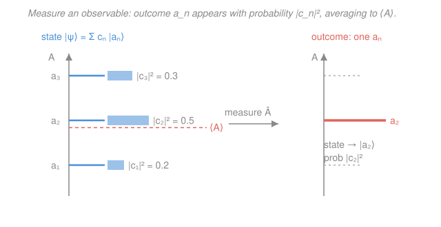

# Quantum Chemistry · Lesson 1.1: The Quantum Toolkit, Refreshed

> ⏱ ~15 min · Module 1: From Atoms to Molecules · Builds on: [quantum-mechanics syllabus](../../quantum-mechanics/syllabus.md) (operators, measurement, the H-atom, variational and perturbation methods) · Unlocks: 1.2 (the hydrogen atom revisited)

## Why this matters

Every method in this course — Hartree–Fock, configuration interaction, DFT — is, underneath, the same five moves: write a state as a wavefunction, act on it with an operator, demand the operator be Hermitian, solve $\hat H\psi = E\psi$, and read off an expectation value. You already met these in quantum mechanics. This lesson is a fast re-tooling: not to reteach the postulates, but to put them in the *working form* a chemist actually computes with — Dirac notation, so integrals become $\langle\phi|\hat A|\psi\rangle$; and atomic units, so the equations stop dragging around $\hbar$ and $4\pi\varepsilon_0$. Get fluent here and the rest of the course reads like a language you already speak.

## The idea

Quantum mechanics answers one question — *"if I measure this, what do I get, and how often?"* — with one recipe. All the information about a system lives in a **wavefunction** $\psi$, a complex-valued function whose squared magnitude $|\psi|^2$ is a probability density. Every measurable quantity (energy, position, momentum) is represented by an **operator**, a machine that eats a function and spits out another. The special functions an operator leaves *unchanged except for scaling* — its **eigenfunctions** — are the only outcomes a measurement can return; the scale factor is the value you read on the dial.

A general state is a *blend* of these eigenfunctions. Measure it and reality picks one, at random, weighted by how much of that eigenfunction was in the blend (the picture below). You can't predict the single outcome — but you can predict the *average over many measurements*, the **expectation value**, and that average is what quantum chemistry computes and compares to experiment.

Two pieces of hygiene make this workable. First, **Dirac notation**: instead of writing integrals like $\int \phi^* \hat A\,\psi\,d\tau$ over and over, we write $\langle\phi|\hat A|\psi\rangle$ and let the bracket *mean* "integrate the product." Second, **atomic units**: we measure mass in electron-masses, charge in electron-charges, and so on, so that a pile of fundamental constants all become $1$ and vanish from the equations. Both are pure convenience — no new physics — but they turn page-long formulas into one-liners.

## The formal version

**Postulate 1 — the state.** A system is described by a wavefunction $\psi(\mathbf r)$ (complex, single-valued, square-integrable). It is **normalized** when

$$\langle\psi|\psi\rangle \equiv \int \psi^*\psi\,d\tau = 1,$$

where $\psi^*$ is the complex conjugate and $d\tau$ is the full volume element. *In words: the total probability of finding the particle somewhere is exactly one.*

**Postulate 2 — observables are operators.** Each measurable quantity is a linear operator. The three you build everything from:

$$\hat x = x\ (\text{multiply by } x), \qquad \hat p = -i\hbar\nabla, \qquad \hat H = -\frac{\hbar^2}{2m}\nabla^2 + V(\mathbf r).$$

*In words: position multiplies, momentum differentiates, and the Hamiltonian $\hat H$ is kinetic-plus-potential energy* — the kinetic term $\hat T = -\frac{\hbar^2}{2m}\nabla^2$ is just $\hat p^2/2m$ written out.

**Postulate 3 — measurement.** The only possible results of measuring $\hat A$ are its eigenvalues $a_n$, from

$$\hat A\,\psi_n = a_n\psi_n.$$

*In words: an operator's eigenvalues are the tick-marks on its measuring instrument — nothing else can come out.* Expand any state in the (orthonormal) eigenbasis, $|\psi\rangle = \sum_n c_n|\psi_n\rangle$; then outcome $a_n$ occurs with probability $|c_n|^2$, and $\sum_n|c_n|^2 = 1$.

**Postulate 4 — the expectation value.** The mean of many measurements of $\hat A$ on identically prepared states $\psi$ is

$$\langle A\rangle = \langle\psi|\hat A|\psi\rangle = \int \psi^*\,\hat A\,\psi\,d\tau = \sum_n |c_n|^2\,a_n.$$

*In words: the average outcome is the eigenvalue-average, each eigenvalue weighted by its probability.* The last two forms are the same number computed two ways — by integral, or by summing over outcomes.

**Postulate 5 — the energy eigenproblem.** For a stationary state, the time-independent Schrödinger equation is

$$\boxed{\ \hat H\psi = E\psi\ }$$

*In words: the allowed energies are the eigenvalues of the Hamiltonian.* Solving this equation for atoms and molecules is, quite literally, the entire job of this course.

**Dirac (bra–ket) notation.** A **ket** $|\psi\rangle$ is the state; a **bra** $\langle\phi|$ is its conjugate partner waiting to be integrated against. Their pairings:

- **Inner product** $\langle\phi|\psi\rangle = \int \phi^*\psi\,d\tau$ — a single complex number measuring overlap.
- **Matrix element** $\langle\phi|\hat A|\psi\rangle = \int \phi^*\hat A\psi\,d\tau$ — the building block of every quantum-chemistry matrix.
- **Orthonormality** $\langle\psi_m|\psi_n\rangle = \delta_{mn}$ (1 if $m=n$, else 0) — eigenstates form a clean coordinate grid.
- **Completeness** $\sum_n |\psi_n\rangle\langle\psi_n| = \hat 1$ — the eigenstates span everything, so any state expands as $|\psi\rangle=\sum_n c_n|\psi_n\rangle$ with $c_n=\langle\psi_n|\psi\rangle$.

**Hermiticity — and why it matters.** An operator is **Hermitian** if $\langle\phi|\hat A\psi\rangle = \langle\hat A\phi|\psi\rangle$ for all states, i.e. $\hat A^\dagger = \hat A$. Two consequences are non-negotiable for physics:

1. **Eigenvalues are real** — measured energies and positions are real numbers, as they must be.
2. **Eigenstates for different eigenvalues are orthogonal** — $\langle\psi_m|\psi_n\rangle = 0$ for $a_m\neq a_n$ — which is exactly what lets us use them as a coordinate basis.

*In words: Hermiticity is the mathematical price of a sane measuring device — real readings and independent outcomes.* Every observable operator ($\hat x,\hat p,\hat H$) is Hermitian.

**Commutators.** The commutator $[\hat A,\hat B] = \hat A\hat B - \hat B\hat A$ measures whether two operators can be measured together. If $[\hat A,\hat B]=0$ they share a common eigenbasis and are **simultaneously observable**; if not, they obey an uncertainty relation. The canonical case is $[\hat x,\hat p] = i\hbar$ — position and momentum can never both be sharp.

**Atomic units.** Quantum chemistry sets

$$\hbar = m_e = e = 4\pi\varepsilon_0 = 1.$$

Energies then come out in **hartree** ($1\ \text{Ha} = 27.211\ \text{eV}$) and lengths in **bohr** ($1\ a_0 = 0.529\ \text{Å}$). The payoff is dramatic: the hydrogen Hamiltonian $\hat H = -\frac{\hbar^2}{2m_e}\nabla^2 - \frac{e^2}{4\pi\varepsilon_0 r}$ collapses to $\hat H = -\tfrac12\nabla^2 - \tfrac1r$, and its ground-state energy is simply $-\tfrac12$ Ha. *In words: choose the electron's own scales as your rulers and the fundamental constants stop cluttering every equation.*

## Picture

## Worked examples

**Example 1 (mechanical — an integral becomes a bracket).** Take the particle-in-a-box (from physical chemistry's [molecular energy levels](../../physical-chemistry/lessons/04-03-molecular-energy-levels-box-oscillator-rotor.md)), ground state $\psi_1(x) = \sqrt{\tfrac{2}{L}}\sin\!\frac{\pi x}{L}$ on $[0,L]$. Where is the particle *on average*? Compute $\langle x\rangle = \langle\psi_1|\hat x|\psi_1\rangle$:

$$\langle x\rangle = \frac{2}{L}\int_0^L x\,\sin^2\!\frac{\pi x}{L}\,dx = \frac{2}{L}\int_0^L x\cdot\frac{1-\cos\frac{2\pi x}{L}}{2}\,dx = \frac{1}{L}\left[\int_0^L x\,dx - \int_0^L x\cos\tfrac{2\pi x}{L}\,dx\right].$$

The first integral is $L^2/2$; the second vanishes (a full cosine period against $x$ integrates to zero). So

$$\langle x\rangle = \frac{1}{L}\cdot\frac{L^2}{2} = \frac{L}{2}.$$

The average position is dead center — obvious from the symmetry of $|\psi_1|^2$, and the bracket machinery confirms it. Notice how $\langle\psi_1|\hat x|\psi_1\rangle$ *is* that integral: the notation hid all the bookkeeping.

**Example 2 (why you'd care — energy for free, in clean units).** Same box, but now the energy. Inside the box $V=0$, so $\hat H = \hat T = -\frac{\hbar^2}{2m}\frac{d^2}{dx^2}$, and $\psi_n$ is an eigenstate: $\hat H\psi_n = E_n\psi_n$ with $E_n = \frac{n^2\pi^2\hbar^2}{2mL^2}$. Therefore

$$\langle T\rangle = \langle\psi_n|\hat H|\psi_n\rangle = E_n\langle\psi_n|\psi_n\rangle = E_n = \frac{n^2\pi^2\hbar^2}{2mL^2}.$$

No integral needed — *the eigenvalue equation did the work*, which is the whole point of Postulate 5. In atomic units ($\hbar = m_e = 1$) for an electron this is just $E_n = \dfrac{n^2\pi^2}{2L^2}$ hartree, with $L$ in bohr: every constant gone. That collapse — comparing energies as bare numbers in hartree — is why the field lives in atomic units.

## Watch out

- **You might think $|c_n|^2$ tells you the *outcome*.** It doesn't — it tells you the *probability* of outcome $a_n$. A single measurement returns one eigenvalue at random; only the average over many, $\langle A\rangle=\sum_n|c_n|^2 a_n$, is predictable. The expectation value is generally **not** itself an eigenvalue (in the figure, $\langle A\rangle$ sits *between* the levels).
- **You might drop the complex conjugate.** The bra carries it: $\langle\psi|\psi\rangle = \int\psi^*\psi\,d\tau$, not $\int\psi^2$. For real wavefunctions it makes no difference, but for anything complex (momentum eigenstates $e^{ikx}$, molecular orbitals with phases) forgetting the $^*$ gives a wrong — often complex — "probability."
- **You might think atomic units are an approximation.** They are not — just a choice of rulers, exact to all digits. The only trap is *re-inserting* a stray $\hbar$ or $4\pi\varepsilon_0$ after already setting it to 1, which double-counts. Set them to 1 everywhere or nowhere.
- **You might read $[\hat x,\hat p]=i\hbar$ as "these operators equal $i\hbar$."** No — the *commutator* (the failure to commute) equals $i\hbar$, and only when applied to a function. Order matters: $\hat x\hat p\neq\hat p\hat x$.

## One-liner

> State in, operator on it, Hermitian so the readings are real; solve $\hat H\psi=E\psi$ for the levels and $\langle\psi|\hat A|\psi\rangle$ for their average — all in atomic units so the constants disappear.

## Problems

**P1 (🟢)** An electron in a 1-D box of length $L$ is prepared in the superposition $|\psi\rangle = \sqrt{\tfrac13}\,|\psi_1\rangle + \sqrt{\tfrac23}\,|\psi_2\rangle$, where $\psi_1,\psi_2$ are the ground and first-excited box eigenstates with energies $E_1$ and $E_2 = 4E_1$. If you measure the energy, what values can you get and with what probabilities? Compute the expectation value $\langle E\rangle$ in units of $E_1$.

**P2 (🟡)** Verify the canonical commutator $[\hat x,\hat p] = i\hbar$ by acting on an arbitrary well-behaved function $f(x)$, with $\hat x = x$ and $\hat p = -i\hbar\,\frac{d}{dx}$. State what this implies about measuring position and momentum together.

**P3 (🔴)** (a) The hydrogen ground-state energy is $-\tfrac12$ hartree. Convert it to eV and confirm the familiar $-13.6$ eV. (b) The $\ce{H2}$ equilibrium bond length is $0.741$ Å. Convert it to bohr. (c) In one sentence, say why quantum chemistry reports both of these in atomic units rather than SI.

Solutions

**P1** The state is already written in the energy eigenbasis, so the possible outcomes are the eigenvalues $E_1$ and $E_2$, with probabilities equal to the squared coefficients:

$$|c_1|^2 = \left(\sqrt{\tfrac13}\right)^2 = \tfrac13, \qquad |c_2|^2 = \left(\sqrt{\tfrac23}\right)^2 = \tfrac23.$$

(They sum to 1 ✓, so the state is normalized — using $\langle\psi_m|\psi_n\rangle=\delta_{mn}$.) The expectation value is the probability-weighted average (Postulate 4):

$$\langle E\rangle = |c_1|^2 E_1 + |c_2|^2 E_2 = \tfrac13 E_1 + \tfrac23(4E_1) = \tfrac13 E_1 + \tfrac83 E_1 = 3E_1.$$

*Check.* $3E_1$ lies between $E_1$ and $E_2=4E_1$, as any weighted average must — and it is **not** one of the allowed outcomes, exactly the "watch out" point.

**P2** Apply the commutator to a test function $f$, being careful that $\hat p$ differentiates *everything* to its right (product rule on $x\hat p$ vs $\hat p x$):

$$[\hat x,\hat p]f = \hat x\hat p f - \hat p\hat x f = x\left(-i\hbar\frac{df}{dx}\right) - \left(-i\hbar\frac{d}{dx}\right)(xf).$$

Expand the second term with the product rule, $\frac{d}{dx}(xf) = f + x\frac{df}{dx}$:

$$= -i\hbar x f' + i\hbar\left(f + x f'\right) = -i\hbar x f' + i\hbar f + i\hbar x f' = i\hbar f.$$

The $x f'$ terms cancel, leaving $[\hat x,\hat p]f = i\hbar f$ for every $f$, so $[\hat x,\hat p] = i\hbar \neq 0$.

*Implication.* Because the commutator is nonzero, $\hat x$ and $\hat p$ share no common eigenbasis and are **not simultaneously observable** — you cannot assign a particle a sharp position and a sharp momentum at once. This nonzero commutator is precisely the seed of the Heisenberg uncertainty relation $\Delta x\,\Delta p \ge \hbar/2$.

**P3** (a) Using $1\ \text{Ha} = 27.211$ eV:

$$-\tfrac12\ \text{Ha} \times 27.211\ \frac{\text{eV}}{\text{Ha}} = -13.606\ \text{eV} \approx -13.6\ \text{eV}.\ \checkmark$$

(b) Using $1\ a_0 = 0.529$ Å, convert Å $\to$ bohr by dividing:

$$0.741\ \text{Å} \times \frac{1\ a_0}{0.529\ \text{Å}} = 1.40\ a_0 \ (\text{bohr}).$$

(c) In atomic units the governing equations lose every fundamental constant — the H atom is just $\hat H = -\tfrac12\nabla^2 - \tfrac1r$ with ground energy $-\tfrac12$ — so results are clean, dimensionless-looking numbers directly comparable across systems, with no error-prone constants to carry.

## Connections

- **Backward:** every postulate here is the working restatement of what you proved in the [quantum-mechanics course](../../quantum-mechanics/syllabus.md) — operators, eigenvalue measurement, and Hermiticity. The particle-in-a-box appears as the tester because you already solved it there and in physical chemistry's [box/oscillator/rotor lesson](../../physical-chemistry/lessons/04-03-molecular-energy-levels-box-oscillator-rotor.md).
- **Forward:** [Lesson 1.2](01-02-hydrogen-atom-revisited.md) turns $\hat H\psi=E\psi$ on the hydrogen atom, where atomic units make the whole spectrum $E_n = -\tfrac{1}{2n^2}$ Ha; the bra–ket matrix element $\langle\phi|\hat H|\psi\rangle$ becomes the literal matrix entry of Hartree–Fock and Roothaan–Hall in Module 2.
- **Sideways:** the expansion $|\psi\rangle=\sum_n c_n|\psi_n\rangle$ with $\langle\psi_m|\psi_n\rangle=\delta_{mn}$ is the same orthonormal-basis idea as an LCAO molecular orbital built from atomic orbitals — the bonding/antibonding picture from general chemistry's [MO lesson](../../general-chemistry/lessons/01-05-molecular-shape-vsepr-hybridization-mo.md) — and the completeness relation is why a finite basis set (Module 2.5) can approximate any orbital.
