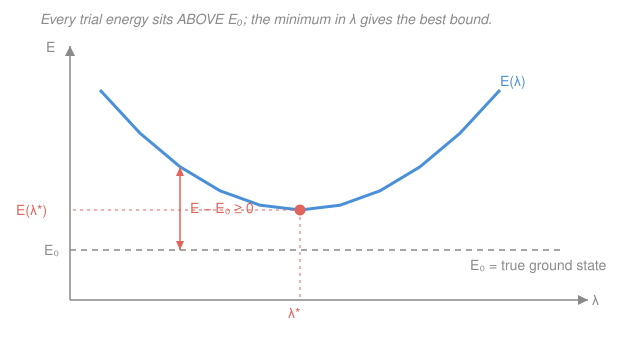

# Quantum Chemistry · Lesson 1.3: The Variational Principle

> ⏱ ~15 min · Module 1: From Atoms to Molecules · Builds on: [1.1 The quantum toolkit, refreshed](01-01-quantum-toolkit-refreshed.md), [`quantum-mechanics` syllabus](../../quantum-mechanics/syllabus.md) · Unlocks: [1.4 Perturbation theory](01-04-perturbation-theory.md)

## Why this matters

For anything past the hydrogen atom, the Schrödinger equation has no exact solution — no clean formula for a helium atom, let alone a benzene molecule. So how does *any* of quantum chemistry get numbers? The answer is the **variational principle**: guess a wavefunction, compute its energy, and you are guaranteed that guess overestimates the true ground-state energy. Never below — always above. That one-sided guarantee turns an impossible differential equation into an *optimization* problem: make the guess as good as you can and push the energy down toward the truth. This single idea is the engine under Hartree–Fock (Module 2), the LCAO molecular orbitals of [1.6](01-06-h2-plus-lcao.md), and essentially every method you will meet. It is the load-bearing wall of the whole course.

## The idea

Here is the whole trick in one sentence: **you cannot accidentally beat the ground state.** The true ground-state energy $E_0$ is the lowest energy the system can possibly have. So *any* wavefunction you write down — however crude — has an average energy that is at least $E_0$. A bad guess gives an energy that's too high; a good guess gives one that's a little less too high. It is like measuring the depth of a valley by dropping a rope in: the rope can only reach *down to* the valley floor, never below it. Every rope-length is an overestimate of "distance to the floor," and the longest rope that still touches is your best estimate.

That flips a hopeless problem into a tractable one. Instead of *solving* for the true $\psi_0$, we write a trial function with a few **adjustable knobs** (parameters), compute the energy as a function of those knobs, and then just **turn the knobs to make the energy as low as possible**. Because we can never go below $E_0$, "lowest" means "closest to the truth." Minimizing is optimizing. That's it — the rest of this lesson makes it precise and shows the machinery.

## The formal version

We work in **atomic units** throughout (Hartree atomic units: $\hbar = m_e = e = 4\pi\varepsilon_0 = 1$). Energies come out in **hartree** (1 hartree $\approx 27.211$ eV), lengths in **bohr** ($a_0 \approx 0.529$ Å). In these units the hydrogen-atom Hamiltonian is just $\hat H = -\tfrac12\nabla^2 - 1/r$ and its exact ground-state energy is $E_0 = -\tfrac12$ hartree — no constants to carry.

**The variational theorem.** Let $\hat H$ be a Hamiltonian with exact ground-state energy $E_0$. For *any* trial wavefunction $\tilde\psi$ (well-behaved, satisfying the boundary conditions), the **Rayleigh quotient**

$$E[\tilde\psi] \;=\; \frac{\langle \tilde\psi \,|\, \hat H \,|\, \tilde\psi\rangle}{\langle \tilde\psi \,|\, \tilde\psi\rangle} \;\ge\; E_0 .$$

*In words: the average energy of any guess is an upper bound on the true ground-state energy — a lower trial energy is always a better one.* The denominator $\langle\tilde\psi|\tilde\psi\rangle$ just normalizes; if $\tilde\psi$ is already normalized it equals 1 and $E[\tilde\psi] = \langle\tilde\psi|\hat H|\tilde\psi\rangle$. Here $\langle\tilde\psi|\hat H|\tilde\psi\rangle = \int \tilde\psi^* \hat H\,\tilde\psi\,d\tau$ is the expectation value of the energy you met in [1.1](01-01-quantum-toolkit-refreshed.md).

**Why it's true (the proof in three lines).** The exact eigenstates $\psi_n$ of $\hat H$, with $\hat H\psi_n = E_n\psi_n$ and $E_0 \le E_1 \le E_2 \le \cdots$, form a complete orthonormal set, so we can expand *any* trial function in them:

$$\tilde\psi = \sum_n c_n \psi_n, \qquad \text{normalized} \Rightarrow \sum_n |c_n|^2 = 1 .$$

Sandwich $\hat H$: because $\hat H\psi_n = E_n\psi_n$ and the $\psi_n$ are orthonormal, the cross terms vanish and

$$\langle\tilde\psi|\hat H|\tilde\psi\rangle = \sum_n |c_n|^2 E_n \;\ge\; \sum_n |c_n|^2 E_0 \;=\; E_0\underbrace{\sum_n |c_n|^2}_{=\,1} = E_0 .$$

*In words: the trial energy is a weighted average of the true energy levels, and no average of numbers can fall below the smallest one.* Equality holds only when $\tilde\psi = \psi_0$ (all weight on the ground state). That's the entire theorem.

**The method.** Choose a trial function $\tilde\psi(\lambda)$ carrying one or more **variational parameters** $\lambda$. Compute the energy as a function of them, $E(\lambda) = \langle\tilde\psi(\lambda)|\hat H|\tilde\psi(\lambda)\rangle / \langle\tilde\psi(\lambda)|\tilde\psi(\lambda)\rangle$, then **minimize**:

$$\frac{\partial E}{\partial \lambda} = 0 \quad\Longrightarrow\quad \lambda^*, \qquad E(\lambda^*) = \text{best upper bound in that family.}$$

*In words: within whatever family of shapes your trial function can make, the minimizing parameter gives the tightest bound you can get.* Widen the family (more parameters, more flexible shapes) and the bound can only improve.

## Picture

The curve is your family of guesses swept over the knob $\lambda$; the dashed floor is the truth you can approach but never pierce. Minimizing walks you to the bottom of the valley — as close to the floor as this family allows.

## Worked examples

**Example 1 (a Gaussian for hydrogen — a bound you can compute by hand).** The exact hydrogen $1s$ orbital decays like $e^{-r}$, but suppose we didn't know that and tried a **Gaussian**, $\tilde\psi = e^{-\alpha r^2}$, with width parameter $\alpha > 0$. (Gaussians are what real codes actually use — see [2.5](02-05-basis-sets.md) — so this is not a toy.) For $\hat H = -\tfrac12\nabla^2 - 1/r$ the normalized Gaussian gives two standard integrals:

$$\langle T\rangle = \frac{3\alpha}{2}, \qquad \langle -1/r\rangle = -2\sqrt{\frac{2\alpha}{\pi}} \quad\Longrightarrow\quad E(\alpha) = \frac{3\alpha}{2} - 2\sqrt{\frac{2\alpha}{\pi}} .$$

*(The kinetic term rewards spreading out — small $\alpha$; the attraction rewards clustering near the nucleus — large $\alpha$. The minimum is the truce.)* Minimize:

$$\frac{dE}{d\alpha} = \frac32 - \sqrt{\frac{2}{\pi}}\,\alpha^{-1/2} = 0 \;\Longrightarrow\; \alpha^{1/2} = \frac{2}{3}\sqrt{\frac{2}{\pi}} \;\Longrightarrow\; \alpha^* = \frac{8}{9\pi} \approx 0.283 .$$

At the minimum a small algebra trick helps: stationarity forces the potential term to equal $-3\alpha$, so $E(\alpha^*) = \tfrac32\alpha^* - 3\alpha^* = -\tfrac32\alpha^*$:

$$E(\alpha^*) = -\frac{3}{2}\cdot\frac{8}{9\pi} = -\frac{4}{3\pi} \approx -0.424 \text{ hartree.}$$

Compare to the exact $E_0 = -0.5$ hartree: our bound $-0.424 > -0.5$ ✓, as the theorem promises, and it's about 15% high. The Gaussian simply *cannot* reproduce the sharp cusp of the true $e^{-r}$ at the nucleus, so it never quite reaches the floor — a limitation we fix in practice by summing several Gaussians ([2.5](02-05-basis-sets.md)).

**Example 2 (why "lower is better" is the whole game).** Suppose two people hand you trial energies for the same molecule: Ann gets $-1.130$ hartree, Bo gets $-1.145$ hartree. Which wavefunction is better? **Bo's**, with no further information — because both are rigorous *upper bounds*, and the lower one is provably closer to the true $E_0$. You never need to know $E_0$ to rank two guesses: the variational principle makes energy a single-number scoreboard where lower always wins. This is exactly how quantum chemists compare methods and how a calculation "converges" — each iteration pushes the energy down toward the floor.

## The formal version, continued — linear variation and the secular equations

The most powerful choice of trial function is a **linear combination** of fixed basis functions $\phi_1,\dots,\phi_N$ (think: atomic orbitals):

$$\tilde\psi = \sum_{i=1}^{N} c_i\,\phi_i,$$

where now the **coefficients $c_i$ are the variational parameters**. Define the **Hamiltonian matrix** $H_{ij} = \langle\phi_i|\hat H|\phi_j\rangle$ and the **overlap matrix** $S_{ij} = \langle\phi_i|\phi_j\rangle$ (the $\phi_i$ need not be orthogonal). Then

$$E = \frac{\sum_{ij} c_i^* c_j H_{ij}}{\sum_{ij} c_i^* c_j S_{ij}} .$$

Minimizing over every $c_i$ (set $\partial E/\partial c_i^* = 0$) turns the calculus into linear algebra — the **secular equations**:

$$\sum_{j} \left(H_{ij} - E\,S_{ij}\right) c_j = 0 \quad\text{for all } i, \qquad\text{i.e.}\qquad \mathbf{H}\mathbf{c} = E\,\mathbf{S}\mathbf{c}.$$

*In words: finding the best coefficients is a generalized eigenvalue problem — the trial energies are the eigenvalues.* A nonzero solution exists only when the **secular determinant** vanishes:

$$\boxed{\;\det\!\left(H_{ij} - E\,S_{ij}\right) = 0\;}$$

This polynomial in $E$ has $N$ roots $E_1 \le E_2 \le \cdots \le E_N$; the **lowest root is the variational upper bound on the ground state**, and the higher roots bound the excited states (the MacDonald theorem). This determinant *is* the machinery behind the LCAO molecular orbitals of [1.6](01-06-h2-plus-lcao.md) and the Roothaan–Hall equations $\mathbf{FC} = \mathbf{SC}\boldsymbol\varepsilon$ of Hartree–Fock ([2.4](02-04-roothaan-hall-matrices.md)) — same skeleton, with $\hat H$ replaced by the Fock operator $\hat F$.

## Watch out

- **You might think a low variational energy means the *wavefunction* is accurate everywhere.** Not quite: the energy is a smoothed average, so a trial function can nail the energy while getting local details (like the nuclear cusp, or a dipole moment) wrong. Energy converges faster and more forgivingly than the wavefunction itself.
- **You might expect adding a basis function to possibly *raise* the energy.** It can't. Enlarging the family only adds flexibility, so the minimized energy can only stay the same or drop — variational bounds improve monotonically with basis size. (This is why "bigger basis = lower energy" is a sanity check in real calculations.)
- **The bound is one-sided — only for the ground state, and only if your trial function is legal.** If $\tilde\psi$ violates the boundary conditions or the wrong symmetry, or if you accidentally project out the ground state, the guarantee can fail. And nothing says an *excited-state* estimate is an upper bound unless you enforce orthogonality to the states below it.

## One-liner

> Any guess overestimates the ground-state energy, so turning the knobs to push the energy down — for a single width, or for a whole basis via $\det(H_{ij}-E\,S_{ij})=0$ — walks you as close to the truth as the guess allows.

## Problems

**P1 (🟢)** A one-parameter trial calculation on the hydrogen atom (trial function $\tilde\psi = e^{-\lambda r}$, atomic units) yields the energy function

$$E(\lambda) = \tfrac{1}{2}\lambda^2 - \lambda \quad\text{(hartree)}.$$

Minimize over $\lambda$, report the best (lowest) trial energy, and confirm it does not fall below the known exact ground state $E_0 = -0.5$ hartree. What do you notice?

**P2 (🟡)** *Effective nuclear charge for helium.* Model the He ground state by putting both electrons in a hydrogen-like $1s$ orbital with an **adjustable nuclear charge** $\zeta$ (the real charge is $Z=2$, but each electron partly *screens* the other, so the effective charge should be less). Standard integrals give the energy (in hartree)

$$E(\zeta) = \underbrace{\zeta^2}_{\text{2 electrons' kinetic}} \;-\; \underbrace{2Z\zeta}_{\text{electron–nucleus}} \;+\; \underbrace{\tfrac{5}{8}\zeta}_{\text{electron–electron}}, \qquad Z = 2 .$$

Find the optimal $\zeta$ and the corresponding energy. Compare to the experimental He ground state, $-2.904$ hartree, and interpret the value of $\zeta$.

**P3 (🔴, linear variation)** Two orthonormal basis functions $\phi_1,\phi_2$ (so $S_{ij}=\delta_{ij}$) have matrix elements $H_{11}=H_{22}=\alpha$ and $H_{12}=H_{21}=\beta$ (all in hartree), with $\alpha=-1.0$ and $\beta=-0.4$. Write the $2\times2$ secular determinant, solve for both variational energies, and say which one bounds the ground state.

Solutions

**P1** Minimize $E(\lambda) = \tfrac12\lambda^2 - \lambda$:

$$\frac{dE}{d\lambda} = \lambda - 1 = 0 \;\Longrightarrow\; \lambda^* = 1, \qquad E(\lambda^*) = \tfrac12(1)^2 - 1 = -\tfrac12 \text{ hartree.}$$

The bound is $E(\lambda^*) = -0.5$ hartree, which satisfies $E(\lambda^*) \ge E_0 = -0.5$ — with **equality**. This is the hydrogen atom with the trial family $\tilde\psi = e^{-\lambda r}$ (there $\langle T\rangle = \lambda^2/2$, $\langle -1/r\rangle = -\lambda$): because the exact ground state $e^{-r}$ *is a member of this family* (at $\lambda=1$), the variational method finds it exactly and the bound is saturated. The lesson: when your trial family contains the true wavefunction, the variational energy hits $E_0$ dead on — contrast the Gaussian of Example 1, whose family does not, so it stalls at $-0.424$.

**P2** Insert $Z=2$: $E(\zeta) = \zeta^2 - 4\zeta + \tfrac58\zeta = \zeta^2 - \tfrac{27}{8}\zeta$. Minimize:

$$\frac{dE}{d\zeta} = 2\zeta - \frac{27}{8} = 0 \;\Longrightarrow\; \zeta^* = \frac{27}{16} = 1.6875 .$$

Then (using $E = \zeta^2 - \tfrac{27}{8}\zeta = \zeta^2 - 2\zeta^2 = -\zeta^2$ at the minimum, since $\tfrac{27}{8} = 2\zeta^*$):

$$E(\zeta^*) = -\left(\frac{27}{16}\right)^2 = -\frac{729}{256} \approx -2.848 \text{ hartree.}$$

Check the bound: $-2.848 > -2.904$ ✓ — an upper bound, about 0.056 hartree (2%) high. Interpretation: the optimal $\zeta = 1.6875$ is well below the bare $Z=2$. The missing $2 - 1.6875 = 0.3125$ is the **screening**: each electron sees a nucleus partly shielded by the other, so it experiences an effective charge of only about 1.69. The variational principle *discovered* screening — a genuinely physical result — just by minimizing one number.

**P3** With $S_{ij}=\delta_{ij}$, the secular determinant $\det(H_{ij}-E\,S_{ij})=0$ is

$$\begin{vmatrix} \alpha - E & \beta \\ \beta & \alpha - E \end{vmatrix} = (\alpha - E)^2 - \beta^2 = 0 \;\Longrightarrow\; \alpha - E = \pm\beta \;\Longrightarrow\; E_\pm = \alpha \pm \beta .$$

With $\alpha=-1.0$, $\beta=-0.4$:

$$E_+ = \alpha + \beta = -1.4 \text{ hartree}, \qquad E_- = \alpha - \beta = -0.6 \text{ hartree.}$$

The **lower** root, $E = -1.4$ hartree, is the variational upper bound on the ground state (its eigenvector is the symmetric, in-phase combination $\tfrac{1}{\sqrt2}(\phi_1+\phi_2)$ — the **bonding** orbital); the higher root $-0.6$ hartree is the antibonding combination and bounds the first excited state. This is exactly the $\ce{H2+}$ / Hückel picture you'll build in [1.6](01-06-h2-plus-lcao.md); with a nonzero overlap $S_{12}=S$ the roots generalize to $E_\pm = (\alpha\pm\beta)/(1\pm S)$.

## Flashback

**From Lesson 1.1 (The quantum toolkit, refreshed):** A particle in a 1-D box has orthonormal energy eigenstates $\psi_n$ with energies $E_n = n^2 E_1$. It is prepared in the normalized superposition

$$\Psi = \frac{1}{\sqrt{5}}\big(\psi_1 + 2\,\psi_2\big).$$

Using Dirac notation, find the expectation value $\langle\hat H\rangle$ in units of $E_1$. Is your answer consistent with the variational theorem?

Solution

For an eigenstate expansion the energy expectation is the weighted average $\langle\hat H\rangle = \sum_n |c_n|^2 E_n$, with weights the squared coefficients. Here $c_1 = 1/\sqrt5$ and $c_2 = 2/\sqrt5$, so $|c_1|^2 = \tfrac15$, $|c_2|^2 = \tfrac45$ (they sum to 1 ✓, confirming normalization):

$$\langle\hat H\rangle = |c_1|^2 E_1 + |c_2|^2 E_2 = \frac15 E_1 + \frac45(4E_1) = \frac{1}{5}E_1 + \frac{16}{5}E_1 = \frac{17}{5}E_1 = 3.4\,E_1 .$$

Consistency check: $3.4\,E_1 \ge E_1$, so the average sits above the ground-state energy $E_1$ — exactly the variational inequality, and for exactly the same reason. In fact this *is* the proof of the theorem in miniature: any state is a weighted average of the eigen-energies, and a weighted average of numbers can never dip below the smallest one. ✓

## Connections

- **Backward:** the whole method rests on the expectation value $\langle\tilde\psi|\hat H|\tilde\psi\rangle$ and the eigenstate expansion from [1.1](01-01-quantum-toolkit-refreshed.md); the proof is literally that a weighted average of energies can't beat the lowest. The variational principle you first met in the [`quantum-mechanics`](../../quantum-mechanics/syllabus.md) course is here aimed squarely at atoms and molecules.
- **Forward:** [1.4 Perturbation theory](01-04-perturbation-theory.md) is the complementary tool — instead of guessing and minimizing, it corrects a solvable problem order by order (and, unlike variation, gives no guaranteed bound). The linear-variation secular determinant becomes the LCAO molecular orbitals of [1.6](01-06-h2-plus-lcao.md), and then the self-consistent Roothaan–Hall equations $\mathbf{FC}=\mathbf{SC}\boldsymbol\varepsilon$ of Hartree–Fock ([2.4](02-04-roothaan-hall-matrices.md)) — the same eigenvalue skeleton, iterated.
- **Sideways:** minimizing a Rayleigh quotient subject to normalization is the same constrained-optimization move as a Lagrange multiplier — the multiplier that enforces $\langle\tilde\psi|\tilde\psi\rangle=1$ turns out to be the energy eigenvalue itself. The screening you found for helium (P2) is the microscopic root of the effective nuclear charge behind periodic trends in [general chemistry](../../general-chemistry/lessons/01-02-electron-configurations-periodic-table.md).
