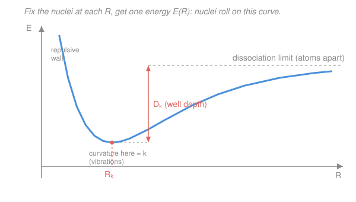

# Quantum Chemistry · Lesson 1.5: The Born–Oppenheimer Approximation

> ⏱ ~15 min · Module 1: From Atoms to Molecules · Builds on: [1.1](01-01-quantum-toolkit-refreshed.md), [1.2](01-02-hydrogen-atom-revisited.md) · Unlocks: [1.6](01-06-h2-plus-lcao.md)

## Why this matters

The full molecular Schrödinger equation — every electron and every nucleus coupled through one giant wavefunction — is unsolvable even for $\ce{H2}$. Yet chemistry is drowning in usable answers: bond lengths, dissociation energies, reaction barriers, vibrational spectra. The single move that turns the impossible problem into the everyday one is the **Born–Oppenheimer (BO) approximation**. It's what lets us speak of "molecular structure" at all — of a molecule *having* a shape — and it manufactures the **potential energy surface**, the object on which nearly all of computational chemistry (Module 4) is done. Every calculation you'll ever run, from Hartree–Fock to DFT, solves the *electronic* problem BO hands you.

## The idea

Nuclei are heavy; electrons are light. A proton outweighs an electron by a factor of about **1836**, and heavier nuclei by far more. In a tug-of-war between things of such different mass, the light one darts around while the heavy one lumbers. So from the electrons' point of view the nuclei are practically **nailed in place**, and from the nuclei's point of view the electrons are a blur that has already relaxed to its best arrangement before a nucleus has moved appreciably.

That suggests a two-step strategy. **Step one: clamp the nuclei.** Freeze them at some geometry $\mathbf R$ and solve for the electrons alone — they settle into their ground state for *that* frozen frame. Do this for every geometry and you get the electronic energy as a function of nuclear position, $E_\text{el}(\mathbf R)$. **Step two: let the nuclei move.** Add back the nuclei's mutual repulsion and treat the sum as a **potential energy** the nuclei feel. The nuclei then roll around on this landscape like a marble in a bowl — its valleys are stable molecules, its passes are transition states.

The picture to hold: electrons paint a potential energy *surface*, and the nuclei are beads sliding on it. Structure, vibration, and reaction are all just "where the bead sits and how it moves."

## The formal version

The full molecular Hamiltonian, in **atomic units** (where $\hbar = m_e = e = 4\pi\varepsilon_0 = 1$, so energies come out in **hartree**, $1\,E_h \approx 27.21$ eV), for electrons $i$ at $\mathbf r_i$ and nuclei $A$ at $\mathbf R_A$ with charges $Z_A$ and masses $M_A$:

$$\hat H = \underbrace{-\sum_A \tfrac{1}{2M_A}\nabla_A^2}_{\hat T_\text{nuc}} \;\underbrace{-\sum_i \tfrac12\nabla_i^2}_{\hat T_\text{el}} \;\underbrace{-\sum_{i,A}\frac{Z_A}{r_{iA}}}_{\hat V_\text{el-nuc}} \;\underbrace{+\sum_{i<j}\frac{1}{r_{ij}}}_{\hat V_\text{el-el}} \;\underbrace{+\sum_{A<B}\frac{Z_A Z_B}{R_{AB}}}_{\hat V_\text{nuc-nuc}}.$$

*In words: nuclear kinetic + electronic kinetic + electron–nucleus attraction + electron–electron repulsion + nucleus–nucleus repulsion.* The term $r_{iA}$ is the electron–nucleus distance, $r_{ij}$ the electron–electron distance, $R_{AB}$ the nucleus–nucleus distance.

**The clamped-nucleus (electronic) Hamiltonian.** Freeze the nuclei: drop $\hat T_\text{nuc}$ and treat every $\mathbf R_A$ as a fixed parameter, not a variable. What's left acting on the electrons is

$$\hat H_\text{el} = \hat T_\text{el} + \hat V_\text{el-nuc} + \hat V_\text{el-el},$$

and we solve the **electronic Schrödinger equation**

$$\boxed{\;\hat H_\text{el}\,\psi_\text{el}(\mathbf r;\mathbf R) = E_\text{el}(\mathbf R)\,\psi_\text{el}(\mathbf r;\mathbf R)\;}$$

*In words: at each fixed nuclear geometry $\mathbf R$, find the electronic wavefunction and its energy.* The semicolon in $\psi_\text{el}(\mathbf r;\mathbf R)$ is the whole point of the notation: $\mathbf r$ are the variables you solve for, $\mathbf R$ is a *label* — change the geometry and you get a new equation with a new answer.

**The potential energy surface (PES).** The nuclei don't feel the electronic energy alone; they also repel each other. Their potential is the sum:

$$V(\mathbf R) = E_\text{el}(\mathbf R) + \sum_{A<B}\frac{Z_A Z_B}{R_{AB}}.$$

*In words: electronic energy plus nuclear repulsion, as a function of geometry, is the surface the nuclei move on.* This $V(\mathbf R)$ **is** the potential energy surface. The nuclei then obey their own Schrödinger equation with $V(\mathbf R)$ as the potential:

$$\left[\hat T_\text{nuc} + V(\mathbf R)\right]\chi(\mathbf R) = E\,\chi(\mathbf R),$$

whose eigenvalue $E$ is the total molecular energy and whose $\chi(\mathbf R)$ describes vibration and rotation.

**What BO throws away.** The exact molecular wavefunction is a *sum* over electronic states $\Psi = \sum_n \chi_n(\mathbf R)\,\psi_{\text{el},n}(\mathbf r;\mathbf R)$. Letting $\hat T_\text{nuc}$ act on the products generates **non-adiabatic coupling** terms — roughly $\nabla_A\psi_\text{el}$, the electrons' response to nuclear motion — that let different electronic surfaces talk to each other. BO **keeps a single surface and drops that coupling**. It is excellent when surfaces are well separated in energy (the small $1/M_A$ prefactor makes the neglected terms tiny) and **fails where two surfaces touch or nearly touch** — at *conical intersections* and *avoided crossings*, exactly where photochemistry lives.

## Picture

For a diatomic there's only one nuclear coordinate — the internuclear distance $R$ — so the PES is a **1-D curve** $V(R)$. Read it left to right: at short $R$ the nuclei slam into each other's repulsion (the wall); at the **equilibrium bond length** $R_e$ the curve bottoms out (the stable molecule); as $R\to\infty$ it flattens to the **dissociation limit** (two free atoms). The vertical drop from that limit to the bottom is the **well depth** $D_e$, the electronic dissociation energy. And the *tightness* of the well — its curvature at $R_e$ — sets how stiffly the bond vibrates.

## Worked examples

**Example 1 (the whole recipe on $\ce{H2+}$, one geometry).** Take $\ce{H2+}$: two protons, one electron. Freeze the protons a distance $R = 2.0$ bohr apart ($1$ bohr $= a_0$, the atomic unit of length). The electronic problem is one electron in the field of two fixed protons — you solve $\hat H_\text{el}\psi_\text{el} = E_\text{el}(R)\psi_\text{el}$ and (this is next lesson's job) get, say, $E_\text{el}(2.0) \approx -1.10\,E_h$. The nuclei add their repulsion $Z_A Z_B/R_{AB} = (1)(1)/2.0 = 0.50\,E_h$. So the point on the PES at $R=2.0$ is

$$V(2.0) = -1.10 + 0.50 = -0.60\,E_h.$$

Repeat at $R = 1.0, 1.5, 2.5, 3.0, \dots$ and you trace the curve. Its minimum sits near $R_e \approx 2.0\,a_0$ — that's the predicted bond length of $\ce{H2+}$, produced entirely by the BO two-step. (You'll build $\psi_\text{el}$ itself by LCAO in [1.6](01-06-h2-plus-lcao.md).)

**Example 2 (why the asymptote matters — reading chemistry off the shape).** Two different molecular curves can share a bond length but differ wildly in the *depth* $D_e$ of the well: a deep well is a strong bond, a shallow one is weak. And the *shape* at large $R$ tells you the products of dissociation. If the curve rises smoothly to a flat plateau, the bond simply breaks into two neutral atoms. Where two electronic surfaces would cross on the way out, BO instead produces an **avoided crossing** — the ground-state curve bends away — and that bend is precisely where BO is on thin ice and where a molecule can hop from one surface to another (the basis of nonradiative decay and many photoreactions). So a single glance at a PES gives you: stability (is there a minimum?), bond length ($R_e$), bond strength ($D_e$), and warning signs for where the whole approximation strains.

## Watch out

- **You might think BO says the nuclei don't move.** It doesn't. Clamping the nuclei is only *step one*, a device to define the electronic problem at each geometry. In *step two* the nuclei very much move — they vibrate, rotate, and react on the surface $V(\mathbf R)$ the electrons built.
- **You might think "the nuclei are heavier so we ignore their kinetic energy."** We don't ignore it — we *defer* it. $\hat T_\text{nuc}$ is dropped from the *electronic* equation, then reinstated to move the nuclei on the PES. What BO actually neglects is the *coupling* between electronic states that $\hat T_\text{nuc}$ generates, not nuclear motion itself.
- **You might treat the PES as exact.** It's the best single-surface picture, and it's superb near equilibrium — but at conical intersections and avoided crossings the "molecule has one definite surface" story collapses, and you need multiple coupled surfaces.

## One-liner

> Because nuclei are ~1836× heavier than electrons, freeze the nuclei and solve the electrons; the resulting energy-plus-nuclear-repulsion *is* the potential energy surface the nuclei then live on.

## Problems

**P1 (🟢)** The figure shows a diatomic PES $V(R)$. Point to (a) the equilibrium bond length, (b) the dissociation energy, and (c) the part of the curve that governs vibrations. In one phrase each, say what feature of the curve encodes each quantity.

**P2 (🟡)** Justify BO quantitatively. A proton is about $1836\,m_e$. (a) If a proton and an electron carry comparable momentum (as they do when sharing a molecule's energy), how do their speeds compare? (b) Using that speed ratio, roughly how far does a nucleus move in the time an electron crosses the molecule — and why does that license "clamping" the nuclei? (c) State precisely what quantity BO neglects, and one situation where the approximation breaks down.

**P3 (🔴)** Near its minimum, expand the PES as $V(R) \approx V(R_e) + \tfrac12 k\,(R-R_e)^2$ with force constant $k = \left(\frac{d^2V}{dR^2}\right)_{R_e}$. (a) Explain why the linear term vanishes. (b) A diatomic then vibrates as a harmonic oscillator with reduced mass $\mu = \frac{m_1 m_2}{m_1+m_2}$ and $\omega = \sqrt{k/\mu}$. For $\ce{H2}$, $k \approx 570\ \mathrm{N/m}$ and $\mu \approx 8.37\times10^{-28}\ \mathrm{kg}$ (half a proton mass). Find $\omega$ and the wavenumber $\tilde\nu = \omega/(2\pi c)$. (c) Name where this "curvature is a spring constant" reasoning fails.

Solutions

**P1** (a) The **equilibrium bond length** $R_e$ is the $R$-coordinate of the curve's **minimum** — the bottom of the well, where the net force $-dV/dR$ on the nuclei is zero. (b) The **dissociation energy** is the **well depth** $D_e$: the vertical distance from the bottom of the well up to the flat dissociation asymptote (the energy of the separated atoms). (c) **Vibrations** are governed by the **curvature at the minimum** — how sharply the curve bends upward at $R_e$. A tight, steep well means a stiff, high-frequency bond; a shallow, gentle well means a floppy, low-frequency one.

**P2** (a) Momentum $p = mv$. Equal momenta $p_e = p_N$ give $m_e v_e = M_N v_N$, so

$$\frac{v_N}{v_e} = \frac{m_e}{M_N} = \frac{1}{1836}.$$

The nucleus moves about **1836× slower** than the electron. (More carefully, if instead they share comparable *kinetic energy* $\tfrac12 mv^2$, then $v_N/v_e = \sqrt{m_e/M_N} = 1/\sqrt{1836} \approx 1/43$ — still a large separation of speeds. Either way the nucleus is far slower.)

(b) In the time an electron makes one pass across the molecule, a nucleus travels $\sim 1/1836$ (to $\sim 1/43$) as far — a small fraction of a bond length. So the electrons complete many "orbits" and re-relax to their ground state long before the nuclei have visibly shifted. That is exactly the condition under which we may hold the nuclei fixed while solving for the electrons: to the fast electrons, the slow nuclei look **clamped**.

(c) BO neglects the **non-adiabatic (nuclear-kinetic-energy) coupling** between different electronic states — the terms $\sim\!\frac{1}{M_A}\nabla_A\psi_\text{el}$ that let one electronic surface mix into another. It **breaks down where electronic surfaces become degenerate or nearly so** — at conical intersections and avoided crossings — because there the neglected coupling is no longer small.

**P3** (a) The linear term is $\left(\frac{dV}{dR}\right)_{R_e}(R-R_e)$, and at a *minimum* the first derivative is zero, $\left(\frac{dV}{dR}\right)_{R_e} = 0$. So the leading variation is quadratic — every smooth well looks like a parabola near its bottom (the same universal-well argument behind the simple harmonic oscillator, now for a *bond* instead of a spring).

(b) With $k = 570\ \mathrm{N/m}$ and $\mu = 8.37\times10^{-28}\ \mathrm{kg}$:

$$\omega = \sqrt{\frac{k}{\mu}} = \sqrt{\frac{570}{8.37\times10^{-28}}} = \sqrt{6.81\times10^{29}} \approx 8.25\times10^{14}\ \mathrm{rad/s}.$$

Convert to a wavenumber with $c = 3.00\times10^{10}\ \mathrm{cm/s}$:

$$\tilde\nu = \frac{\omega}{2\pi c} = \frac{8.25\times10^{14}}{2\pi(3.00\times10^{10})} \approx \frac{8.25\times10^{14}}{1.885\times10^{11}} \approx 4.4\times10^{3}\ \mathrm{cm^{-1}}.$$

About $4400\ \mathrm{cm^{-1}}$ — right in the ballpark of $\ce{H2}$'s observed $\approx 4400\ \mathrm{cm^{-1}}$ stretch, a very stiff, light bond. *Check.* Units: $\sqrt{(\mathrm{N/m})/\mathrm{kg}} = \sqrt{\mathrm{s^{-2}}} = \mathrm{s^{-1}}$ ✓; dividing rad/s by cm/s gives $\mathrm{cm^{-1}}$ ✓.

(c) The parabola is only the *leading* approximation. It fails (i) at large displacement, where the real curve is **anharmonic** — it flattens toward dissociation rather than climbing forever, so the true levels bunch up and the bond can break; and (ii) wherever BO itself fails — at a **conical intersection**, the single surface (and hence its curvature) is no longer meaningful. This force constant feeds directly into the vibrational-frequency machinery of [4.2](04-02-vibrational-frequencies.md) and the vibrational spectroscopy of physical chemistry.

## Flashback

**From Lesson 1.2 (The hydrogen atom revisited):** The bound-state energies of a one-electron atom of nuclear charge $Z$ are $E_n = -\dfrac{Z^2}{2n^2}\,E_h$ (atomic units). (a) Compute the ground-state energy of $\ce{He+}$ ($Z=2$). (b) What is its ionization energy — the work to remove the electron? (Fresh variant: $Z=2$ instead of hydrogen's $Z=1$.)

Solution

(a) Ground state is $n=1$, with $Z=2$:

$$E_1 = -\frac{Z^2}{2n^2}\,E_h = -\frac{2^2}{2(1)^2}\,E_h = -\frac{4}{2}\,E_h = -2\,E_h.$$

In electronvolts, $-2\,E_h \times 27.21\ \mathrm{eV}/E_h \approx -54.4\ \mathrm{eV}$.

(b) The ionization energy is the energy to lift the electron from $E_1$ to the unbound limit $E_\infty = 0$:

$$\mathrm{IE} = E_\infty - E_1 = 0 - (-2\,E_h) = 2\,E_h \approx 54.4\ \mathrm{eV}.$$

*Check.* This is $Z^2 = 4$ times hydrogen's $0.5\,E_h$ (13.6 eV) ground-state binding — the $Z^2$ scaling makes $\ce{He+}$ four times as tightly bound, as it must be with double the nuclear charge pulling on one electron. ✓ These hydrogenic solutions are exactly the atomic building blocks the clamped-nucleus electronic problem reduces to when the nuclei fly apart — the dissociation limit of a PES.

## Connections

- **Backward:** the electronic problem $\hat H_\text{el}\psi_\text{el} = E_\text{el}(\mathbf R)\psi_\text{el}$ is solved with the tools of [1.1](01-01-quantum-toolkit-refreshed.md) and, at the dissociation limit, reduces to the hydrogenic atoms of [1.2](01-02-hydrogen-atom-revisited.md). The parabola-at-the-bottom argument for vibrations is the universal-well idea behind simple harmonic motion, transplanted from a spring to a bond.
- **Forward:** [1.6](01-06-h2-plus-lcao.md) actually solves the $\ce{H2+}$ electronic problem by LCAO and traces the PES point by point; all of [Module 4](04-01-pes-geometry-optimization.md) is geometry optimization (finding minima), transition-state search (saddle points), and vibrational frequencies (curvature) *on* this surface. The force constant $k = (d^2V/dR^2)_{R_e}$ feeds [4.2](04-02-vibrational-frequencies.md).
- **Sideways:** the PES minimum is the "molecular structure" and equilibrium geometry that general chemistry draws as a ball-and-stick model — see [general chemistry's shapes and bonding](../../general-chemistry/lessons/01-05-molecular-shape-vsepr-hybridization-mo.md); the well curvature becomes the harmonic frequencies read out in the vibrational and electronic spectroscopy of physical chemistry ([molecular energy levels](../../physical-chemistry/lessons/04-03-molecular-energy-levels-box-oscillator-rotor.md)).
