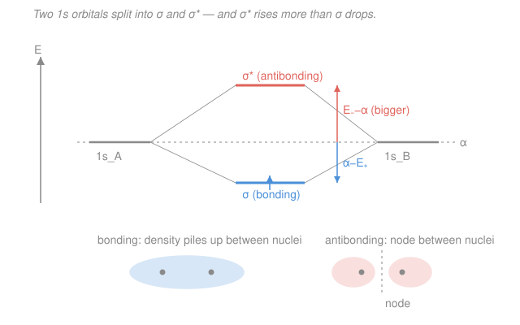

# Quantum Chemistry · Lesson 1.6: H₂⁺ and the LCAO Idea

> ⏱ ~15 min · Module 1: From Atoms to Molecules · Builds on: [1.3 Variational principle](01-03-variational-principle.md), [1.5 Born–Oppenheimer approximation](01-05-born-oppenheimer-approximation.md) · Unlocks: [2.1 Many electrons and antisymmetry](02-01-many-electrons-antisymmetry.md)

## Why this matters

Every molecular orbital diagram a chemist has ever scrawled — two lines on the sides, a $\sigma$ below and a $\sigma^*$ above — is a picture of *this one calculation*. $\ce{H2+}$, one electron shared between two protons, is the hydrogen atom of chemical bonding: the simplest system where a bond exists at all, and the template every larger molecule copies. Solve it once with the linear variation machinery from [1.3](01-03-variational-principle.md), on the clamped-nuclei stage set by [1.5](01-05-born-oppenheimer-approximation.md), and you get bonding/antibonding orbitals, the energy splitting, and — for free — an explanation of *why antibonding is worse than bonding is good*, the fact behind why $\ce{He2}$ doesn't exist. This lesson closes Module 1 and hands Module 2 its starting object: a molecular orbital built from atomic ones.

## The idea

An electron on a lone proton lives in a $1s$ orbital. Bring a second proton close (nuclei frozen in place — the Born–Oppenheimer move from [1.5](01-05-born-oppenheimer-approximation.md)) and the electron now feels *both*. What shape should its orbital take? We don't know the exact answer, so we guess intelligently: near proton A the electron should look like A's $1s$; near proton B, like B's $1s$. So build the molecular orbital as a weighted sum of the two atomic orbitals —

$$\psi = c_A\, 1s_A + c_B\, 1s_B.$$

This is the **LCAO** ansatz: a **L**inear **C**ombination of **A**tomic **O**rbitals. It's a trial function with two knobs $c_A, c_B$, so finding the best one is exactly the **linear variation** problem from [1.3](01-03-variational-principle.md): minimize the energy over the coefficients and you get a $2\times2$ secular equation.

Symmetry does most of the work. The two protons are identical, so the electron can't prefer one — the best orbitals must weight them *equally in magnitude*. That leaves only two options: the **in-phase** sum ($c_A = c_B$), where the two atomic waves reinforce in the middle and pile electron density *between* the nuclei, and the **out-of-phase** difference ($c_A = -c_B$), where they cancel in the middle, leaving a **node**. Electron density between two positive nuclei is electrostatic glue: it pulls both inward and lowers the energy — a **bond**. A node between them starves that region and *raises* the energy — **antibonding**. Two atomic orbitals in, one bonding and one antibonding orbital out.

## The formal version

We seek the best $\psi = c_A\,1s_A + c_B\,1s_B$. Feeding a linear trial function into the variational principle gives the **secular equations** (from [1.3](01-03-variational-principle.md)); non-trivial coefficients exist only when the **secular determinant** vanishes:

$$\det\begin{pmatrix} H_{AA}-E & H_{AB}-ES \\[2pt] H_{AB}-ES & H_{BB}-E \end{pmatrix}=0.$$

The three integrals, in Dirac notation with $\hat H$ the (clamped-nuclei) electronic Hamiltonian:

- **Coulomb integral** $\alpha \equiv H_{AA} = \langle 1s_A|\hat H|1s_A\rangle = H_{BB}$. *In words: the energy of the electron sitting in one atomic orbital while feeling both nuclei — close to the atomic $1s$ energy, slightly lowered by the second proton.* Equal on A and B by symmetry.
- **Resonance (exchange) integral** $\beta \equiv H_{AB} = \langle 1s_A|\hat H|1s_B\rangle$. *In words: the energy gained by the electron being shared — delocalized across both atoms.* It is **negative** and is the whole source of bonding; it has no classical analogue.
- **Overlap integral** $S \equiv \langle 1s_A|1s_B\rangle$. *In words: how much the two atomic orbitals occupy the same space* — $S=0$ if the atoms are far apart, $S\to 1$ as they merge. Here $0<S<1$.

With $H_{AA}=H_{BB}=\alpha$ the determinant is $(\alpha-E)^2 = (\beta-ES)^2$, i.e. $\alpha-E = \pm(\beta - ES)$. The two roots are

$$\boxed{\,E_+ = \frac{\alpha+\beta}{1+S}\quad(\text{bonding}),\qquad E_- = \frac{\alpha-\beta}{1-S}\quad(\text{antibonding}).\,}$$

Because $\beta<0$, $E_+ < E_-$: the in-phase combination is lower. Back-substituting each root fixes the coefficients: $E_+$ gives the symmetric $c_A=c_B$, $E_-$ the antisymmetric $c_A=-c_B$. Normalizing (using $\langle A|A\rangle=\langle B|B\rangle=1$ and $\langle A|B\rangle=S$):

$$\psi_+ = \frac{1s_A + 1s_B}{\sqrt{2(1+S)}},\qquad \psi_- = \frac{1s_A - 1s_B}{\sqrt{2(1-S)}},\qquad N_\pm = \frac{1}{\sqrt{2(1\pm S)}}.$$

*In words: the overlap $S$ shows up even in the normalization — you can't treat the two atomic orbitals as independent.* By molecular-symmetry labels, $\psi_+$ is the $\sigma_g$ orbital (symmetric, no node between the nuclei) and $\psi_-$ is $\sigma_u^*$ (a node on the plane bisecting the bond).

**The asymmetry.** Measure each level from the atomic reference $\alpha$. A line of algebra gives

$$E_+ - \alpha = \frac{\beta - S\alpha}{1+S} = -\frac{\gamma}{1+S},\qquad E_- - \alpha = \frac{S\alpha-\beta}{1-S} = +\frac{\gamma}{1-S},\qquad \gamma \equiv S\alpha-\beta>0.$$

Both shifts are the *same numerator* $\gamma$ over *different denominators*, so

$$\frac{|E_- - \alpha|}{|E_+ - \alpha|} = \frac{1+S}{1-S} > 1.$$

*In words: antibonding is pushed up more than bonding is pulled down, by the factor $(1+S)/(1-S)$* — purely because overlap makes the $1-S$ denominator smaller than the $1+S$ one. Set $S=0$ and the split would be symmetric; the real, nonzero overlap breaks the symmetry against you. (Deriving this cleanly is **Boss Problem 1**.)

## Picture

## Worked examples

**Example 1 (the integrals in numbers).** Take illustrative values $\alpha = -13.6\ \mathrm{eV}$, $\beta = -3.5\ \mathrm{eV}$, $S = 0.2$. Then

$$E_+ = \frac{\alpha+\beta}{1+S} = \frac{-17.1}{1.2} = -14.25\ \mathrm{eV},\qquad E_- = \frac{\alpha-\beta}{1-S} = \frac{-10.1}{0.8} = -12.63\ \mathrm{eV}.$$

Relative to $\alpha$: bonding drops by $\alpha - E_+ = 0.65\ \mathrm{eV}$, antibonding rises by $E_- - \alpha = 0.98\ \mathrm{eV}$. The rise beats the drop, and their ratio $0.98/0.65 = 1.5$ is exactly $(1+S)/(1-S) = 1.2/0.8$. The single electron of $\ce{H2+}$ goes into $\psi_+$, so the molecule is bound by about $0.65\ \mathrm{eV}$ relative to a free H atom.

**Example 2 (why $\ce{He2}$ isn't a molecule).** The asymmetry is the punchline. In $\ce{H2}$ we'd fill $\psi_+$ with two electrons: net stabilization $\approx 2(\alpha - E_+)$ — a bond. In hypothetical $\ce{He2}$ we'd fill *both* $\psi_+$ and $\psi_-$ with two electrons each. Since each antibonding electron is destabilized *more* than each bonding electron is stabilized, the four electrons net **positive** energy: no bond. That single fact — antibonding worse than bonding is good — is why filled-shell atoms don't form covalent bonds, and it fell straight out of the $1\pm S$ denominators. This is the same bonding/antibonding filling logic behind the MO diagrams in general chemistry's [molecular-orbital section](../../general-chemistry/lessons/01-05-molecular-shape-vsepr-hybridization-mo.md); here we've *derived* the levels those diagrams draw.

## Watch out

- **You might think $\beta$ is small because the orbitals barely touch, so bonding is a weak effect.** But $\beta$ (not $S$) *is* the bond — it is the energy of delocalization, and it has no classical counterpart. A common slip is to call $S$ "the bond"; overlap enables $\beta$ to be nonzero, but it's $\beta<0$ that lowers the energy.
- **You might expect the split to be symmetric** — $\sigma$ down by the same amount $\sigma^*$ is up. It never is. The $1-S$ denominator is smaller than $1+S$, so antibonding always moves more. Symmetric splitting is the fiction you get only if you wrongly set $S=0$ while keeping $\beta$.
- **You might drop the $S$ from the normalization** and write $N = 1/\sqrt2$. That's the $S=0$ answer. With real overlap the correct factor is $1/\sqrt{2(1\pm S)}$ — the cross term $2\langle A|B\rangle = 2S$ does not vanish.

## One-liner

> Build the MO as $c_A 1s_A + c_B 1s_B$, run linear variation, and $\ce{H2+}$ splits into $E_\pm = (\alpha\pm\beta)/(1\pm S)$ — the bonding $\sigma$ and antibonding $\sigma^*$ every MO diagram draws, with $\sigma^*$ pushed up more than $\sigma$ is pulled down.

## Problems

**P1 (🟢)** For $\ce{H2+}$ with $\alpha = -15.0\ \mathrm{eV}$, $\beta = -4.0\ \mathrm{eV}$, and $S = 0.25$, compute $E_+$ and $E_-$. Show explicitly that the antibonding level is destabilized (relative to $\alpha$) by more than the bonding level is stabilized, and check the ratio against $(1+S)/(1-S)$.

**P2 (🟡)** Write the normalized bonding and antibonding MOs for $\ce{H2+}$ in terms of $1s_A$, $1s_B$, and $S$. Derive the normalization constants from scratch (don't just quote them). State where the antibonding orbital has its node and why the bonding orbital has none between the nuclei.

**P3 (🔴, Boss-1 rehearsal)** Starting from the secular determinant with $H_{AA}=H_{BB}=\alpha$, $H_{AB}=\beta$, overlap $S$, derive $E_\pm = (\alpha\pm\beta)/(1\pm S)$ symbolically. Then show $|E_- - \alpha| > |E_+ - \alpha|$ and explain physically why the overlap $S$ makes the split asymmetric.

Solutions

**P1** Plug in:

$$E_+ = \frac{\alpha+\beta}{1+S} = \frac{-15.0 + (-4.0)}{1.25} = \frac{-19.0}{1.25} = -15.20\ \mathrm{eV},$$
$$E_- = \frac{\alpha-\beta}{1-S} = \frac{-15.0 - (-4.0)}{0.75} = \frac{-11.0}{0.75} = -14.67\ \mathrm{eV}.$$

Shifts from the atomic level $\alpha = -15.0\ \mathrm{eV}$:

$$\alpha - E_+ = -15.0 - (-15.20) = 0.20\ \mathrm{eV}\ \text{(stabilization)},\qquad E_- - \alpha = -14.67 - (-15.0) = 0.33\ \mathrm{eV}\ \text{(destabilization)}.$$

Destabilization $0.33 > 0.20$ stabilization. Ratio: $0.33/0.20 = 1.67$, and $(1+S)/(1-S) = 1.25/0.75 = 1.67$ ✓. Antibonding is worse by exactly the overlap factor.

*Check.* $E_+ < \alpha < E_-$ as required, and $E_+ < E_-$ (bonding lowest) since $\beta<0$. ✓

**P2** Impose $\langle\psi_+|\psi_+\rangle = 1$ for $\psi_+ = N_+(1s_A + 1s_B)$. Expand, using $\langle A|A\rangle = \langle B|B\rangle = 1$ and $\langle A|B\rangle = \langle B|A\rangle = S$:

$$\langle\psi_+|\psi_+\rangle = N_+^2\big(\langle A|A\rangle + \langle B|B\rangle + 2\langle A|B\rangle\big) = N_+^2(1 + 1 + 2S) = 2N_+^2(1+S) = 1.$$

So $N_+ = 1/\sqrt{2(1+S)}$. For $\psi_- = N_-(1s_A - 1s_B)$ the cross term flips sign:

$$N_-^2(1 + 1 - 2S) = 2N_-^2(1-S) = 1 \;\Longrightarrow\; N_- = \frac{1}{\sqrt{2(1-S)}}.$$

Therefore

$$\psi_+ = \frac{1s_A + 1s_B}{\sqrt{2(1+S)}},\qquad \psi_- = \frac{1s_A - 1s_B}{\sqrt{2(1-S)}}.$$

**Node.** $\psi_-$ vanishes wherever $1s_A = 1s_B$, i.e. on the plane that perpendicularly bisects the A–B axis (points equidistant from both nuclei) — a nodal plane cutting right through the bond region. $\psi_+$ never cancels: both $1s_A$ and $1s_B$ are positive everywhere, so their sum is strictly positive between the nuclei — density piles up there instead of vanishing.

*Check.* As $S\to 0$ both constants reduce to $1/\sqrt2$, the answer for non-overlapping orbitals. ✓

**P3** Set the secular determinant to zero:

$$\begin{vmatrix} \alpha-E & \beta-ES \\ \beta-ES & \alpha-E \end{vmatrix} = (\alpha-E)^2 - (\beta-ES)^2 = 0.$$

Factor the difference of squares (or take the square root of $(\alpha-E)^2 = (\beta-ES)^2$):

$$\alpha - E = \pm(\beta - ES).$$

*Upper sign* $\alpha - E = \beta - ES$: collect $E$ terms, $\alpha - \beta = E - ES = E(1-S)$, so $E = \dfrac{\alpha-\beta}{1-S} = E_-$.

*Lower sign* $\alpha - E = -(\beta - ES) = -\beta + ES$: then $\alpha + \beta = E + ES = E(1+S)$, so $E = \dfrac{\alpha+\beta}{1+S} = E_+$.

**Asymmetry.** Subtract $\alpha$ from each and put over a common denominator:

$$E_+ - \alpha = \frac{\alpha+\beta - \alpha(1+S)}{1+S} = \frac{\beta - S\alpha}{1+S},\qquad E_- - \alpha = \frac{\alpha-\beta - \alpha(1-S)}{1-S} = \frac{S\alpha - \beta}{1-S}.$$

Let $\gamma \equiv S\alpha - \beta$. With $\alpha<0$, $S>0$, and $\beta<0$, we have $\gamma = S\alpha - \beta$; for a bound system $|\beta| > S|\alpha|$ so $\gamma>0$. Then $E_+ - \alpha = -\gamma/(1+S) < 0$ (stabilized) and $E_- - \alpha = +\gamma/(1-S) > 0$ (destabilized), with the *same* $\gamma$ in each numerator. Hence

$$\frac{|E_- - \alpha|}{|E_+ - \alpha|} = \frac{\gamma/(1-S)}{\gamma/(1+S)} = \frac{1+S}{1-S} > 1.$$

**Physically:** the same delocalization interaction $\gamma$ drives both shifts, but overlap enters the two orbitals oppositely. In the bonding MO the two atomic waves overlap *constructively*, so the shared density is spread over a larger normalized volume — the $(1+S)$ denominator *dilutes* the stabilization. In the antibonding MO they overlap *destructively*, the density is squeezed out of the overlap region into a smaller effective volume — the $(1-S)$ denominator *concentrates* the destabilization. Nonzero overlap therefore always tips the balance toward antibonding; only the fictional $S=0$ case gives a symmetric split.

*Check.* Setting $S=0$: $E_\pm = \alpha \pm \beta$, shifts $\mp\beta$ equal in magnitude — symmetric, as claimed. ✓

## Flashback

**From Lesson 1.3 (Variational principle / linear variation):** Two *orthonormal* basis functions ($S=0$) give a Hamiltonian with $H_{11}=0$, $H_{22}=-4$, $H_{12}=H_{21}=-1$ (Hartree atomic units, where $\hbar=m_e=e=4\pi\varepsilon_0=1$). Set up and solve the secular determinant for the variational energies. Which is the ground-state estimate?

Solution

With $S=0$ the overlap terms drop and the secular determinant is

$$\begin{vmatrix} H_{11}-E & H_{12} \\ H_{21} & H_{22}-E \end{vmatrix} = \begin{vmatrix} -E & -1 \\ -1 & -4-E \end{vmatrix} = (-E)(-4-E) - (-1)^2 = E^2 + 4E - 1 = 0.$$

Quadratic formula:

$$E = \frac{-4 \pm \sqrt{16 + 4}}{2} = -2 \pm \sqrt{5} \approx -2 \pm 2.236.$$

So $E_- \approx -4.236$ and $E_+ \approx +0.236$ (Hartree). The **ground-state estimate is the lower root, $-4.236$**; by the variational principle it is an upper bound to the true ground-state energy.

*Check.* Trace is preserved: $E_- + E_+ = -4.24 + 0.24 = -4 = H_{11}+H_{22}$ ✓. The coupling $H_{12}=-1$ pushed the lower level below the smaller diagonal $-4$ — the same "off-diagonal element splits and lowers" effect that in $\ce{H2+}$ becomes the resonance integral $\beta$ creating the bond. ✓

## Connections

- **Backward:** this is the [1.3](01-03-variational-principle.md) linear-variation method applied to a two-orbital trial function — the secular determinant, the roots, the coefficients — run on the clamped-nuclei electronic Hamiltonian defined by the Born–Oppenheimer separation of [1.5](01-05-born-oppenheimer-approximation.md). Evaluating $\alpha$, $\beta$, $S$ as functions of the internuclear distance $R$ traces out the $\ce{H2+}$ potential energy curve from that lesson.
- **Forward:** [2.1 Many electrons and antisymmetry](02-01-many-electrons-antisymmetry.md) takes these one-electron molecular orbitals and asks how to place *many* electrons in them — which needs the Pauli/antisymmetry rules and the Slater determinant, launching Hartree–Fock in Module 2. **Boss Problem 1** is the symbolic $E_\pm=(\alpha\pm\beta)/(1\pm S)$ derivation and overlap-asymmetry argument you rehearsed in P3.
- **Sideways (general chemistry):** these $\psi_\pm$ *are* the bonding and antibonding orbitals of general chemistry's [MO theory](../../general-chemistry/lessons/01-05-molecular-shape-vsepr-hybridization-mo.md) — "two atomic orbitals combine into a $\sigma$ and a $\sigma^*$." The rule that antibonding destabilizes more than bonding stabilizes, used there to explain bond orders and why $\ce{He2}$ doesn't form, is the $(1+S)/(1-S)$ result derived here.
