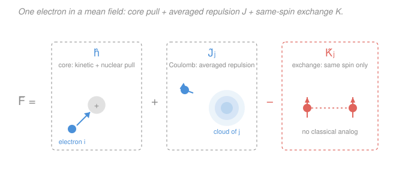

# Quantum Chemistry · Lesson 2.2: The Hartree–Fock Equations

> ⏱ ~15 min · Module 2: Hartree–Fock and Basis Sets · Builds on: [2.1 Many electrons and antisymmetry](02-01-many-electrons-antisymmetry.md), [1.3 The variational principle](01-03-variational-principle.md) · Unlocks: [2.3 The self-consistent field](02-03-self-consistent-field.md)

## Why this matters

The exact many-electron Schrödinger equation is unsolvable the moment you have more than one electron — every electron's motion is tangled with every other's through $1/r_{ij}$ repulsion. Hartree–Fock (HF) is the boldest useful compromise ever made in chemistry: pretend each electron moves independently in the *average* electric field of all the others, and find the single [Slater determinant](02-01-many-electrons-antisymmetry.md) that does this best. That one approximation is the foundation under essentially every practical electronic-structure method — HF is the starting point that correlation methods, MP2, coupled cluster, and even Kohn–Sham DFT all measure themselves against. This lesson turns the variational principle you met for atoms loose on molecules and derives the equation the whole field is built on.

## The idea

You have $N$ electrons, and the honest problem is hopeless: each electron feels the *instantaneous* position of every other, so you can never treat one alone. HF makes a trade. It says: freeze the swarm. Instead of tracking where electron $j$ *is* right now, smear its charge into a fixed cloud — its orbital's probability density — and let electron $i$ feel the steady pull and push of those clouds, not the jittering particles. Every electron gets its own orbital by moving in the **mean field** of all the others.

That is the whole game, and it is also HF's one sin. Real electrons *dodge* each other: when one is here, the others are momentarily pushed away (they are "correlated"). Averaging throws that dodging away — an electron in HF happily sits in the average cloud even at the instant a real partner would be right on top of it. The energy you lose by ignoring this instantaneous avoidance is the **correlation energy**, and chasing it back is what all of Module 3 is about. For now: mean field, best single determinant, no dodging.

Two forces act on our chosen electron. The obvious one is plain electrostatic repulsion from the smeared clouds — the **Coulomb** term, exactly what you'd write classically. The second has no classical picture at all. Antisymmetry (from 2.1) already keeps two same-spin electrons apart — the [Fermi hole](02-01-many-electrons-antisymmetry.md) — and that built-in avoidance *lowers* the repulsion between same-spin electrons. That correction is the **exchange** term. It is pure quantum bookkeeping, a gift of the determinant, and it acts only between electrons of the same spin.

## The formal version

We work in **atomic units** (Hartree units): $\hbar = m_e = e = 1$, energies in hartree ($1\ E_h \approx 27.2$ eV), lengths in bohr. Distances $r_{ij} = |\mathbf r_i - \mathbf r_j|$ are electron–electron separations.

Write the trial wavefunction as a single Slater determinant of $N$ orthonormal **spin-orbitals** $\chi_i$ (a spatial orbital times a spin function). Apply the [variational principle](01-03-variational-principle.md) — minimize $\langle \Psi | \hat H | \Psi \rangle$ over the orbitals, subject to keeping them orthonormal — and the minimization condition collapses into $N$ one-electron eigenvalue equations, the **Hartree–Fock equations**:

$$\boxed{\;\hat F\,\chi_i = \varepsilon_i\,\chi_i\;}$$

*In words: each occupied spin-orbital is an eigenfunction of one operator, the Fock operator, and its eigenvalue $\varepsilon_i$ is that orbital's energy.* The **Fock operator** is

$$\hat F = \hat h + \sum_{j=1}^{N}\bigl(\hat J_j - \hat K_j\bigr).$$

Term by term, acting on an electron in spin-orbital $\chi_i$:

- **Core Hamiltonian** $\hat h = -\tfrac12\nabla^2 - \sum_A \dfrac{Z_A}{r_{A}}$: the one-electron piece — kinetic energy plus attraction to each nucleus $A$ of charge $Z_A$ at distance $r_A$. *In words: what the electron would feel with no other electrons present.*

- **Coulomb operator** $\hat J_j$, defined by $\hat J_j\,\chi_i(1) = \Bigl[\int \dfrac{|\chi_j(2)|^2}{r_{12}}\,d\tau_2\Bigr]\chi_i(1)$: the electrostatic repulsion from electron $j$'s smeared charge cloud $|\chi_j|^2$. *In words: the average push from another electron's probability density — the ordinary classical repulsion.* It is **local**: it multiplies $\chi_i(1)$ by a number that depends on position 1.

- **Exchange operator** $\hat K_j$, defined by $\hat K_j\,\chi_i(1) = \Bigl[\int \dfrac{\chi_j^*(2)\,\chi_i(2)}{r_{12}}\,d\tau_2\Bigr]\chi_j(1)$: the nonclassical correction from antisymmetry. *In words: it swaps which orbital the electron lands in — there is no way to write it as "times a potential."* It is **nonlocal** (the result at point 1 depends on $\chi_i$ everywhere), and because it needs the overlap $\chi_j^* \chi_i$ to survive spin integration, $\hat K_j$ acts **only between same-spin electrons**. For opposite spins, $\hat K_j\chi_i = 0$.

**The catch — nonlinearity.** Look again: $\hat F$ is built from $\hat J_j$ and $\hat K_j$, which are built from the very orbitals $\chi_j$ we are solving for. The operator depends on its own solutions. So $\hat F\chi_i = \varepsilon_i\chi_i$ is **not** a standard linear eigenvalue problem — you can't diagonalize $\hat F$ until you already know the orbitals. The fix is to guess orbitals, build $\hat F$, solve for new orbitals, rebuild, and repeat until nothing changes: the **self-consistent field**, [Lesson 2.3](02-03-self-consistent-field.md).

**The Hartree–Fock energy.** Define the matrix elements (all integrals over spin-orbitals):

$$h_{ii} = \langle \chi_i|\hat h|\chi_i\rangle, \qquad J_{ij} = (ii|jj), \qquad K_{ij} = (ij|ji),$$

using the **two-electron integral** notation

$$(ij|kl) = \iint \chi_i^*(1)\,\chi_j(1)\,\frac{1}{r_{12}}\,\chi_k^*(2)\,\chi_l(2)\;d\tau_1\,d\tau_2 .$$

So $J_{ij} = (ii|jj)$ is the Coulomb repulsion between clouds $i$ and $j$, and $K_{ij}=(ij|ji)$ is their exchange integral (nonzero only for same spin). Then the total electronic energy is

$$\boxed{\;E_\text{HF} = \sum_{i} h_{ii} + \frac12\sum_{i}\sum_{j}\bigl(J_{ij} - K_{ij}\bigr)\;}$$

with sums over all $N$ occupied spin-orbitals. *In words: add each electron's core energy, then add every pair's net repulsion (Coulomb minus exchange), counting each pair once via the $\tfrac12$.* The $\tfrac12$ prevents double-counting pair $(i,j)$ and $(j,i)$; the self-terms are harmless since $J_{ii}=K_{ii}$ cancel.

**Why $E_\text{HF}\neq\sum_i\varepsilon_i$.** Multiply $\hat F\chi_i=\varepsilon_i\chi_i$ by $\chi_i^*$ and integrate: $\varepsilon_i = h_{ii} + \sum_j (J_{ij}-K_{ij})$. Each orbital energy already contains that electron's *full* repulsion with all the others. Sum over $i$ and every electron–electron pair gets counted **twice**:

$$\sum_i \varepsilon_i = \sum_i h_{ii} + \sum_i\sum_j (J_{ij}-K_{ij}) = E_\text{HF} + \frac12\sum_i\sum_j(J_{ij}-K_{ij}).$$

So you must subtract the double-counted repulsion back off:

$$\boxed{\;E_\text{HF} = \sum_i \varepsilon_i - \frac12\sum_i\sum_j (J_{ij}-K_{ij})\;}$$

*In words: the orbital energies over-count electron repulsion once, so the true energy is the sum of orbital energies minus one copy of the total Coulomb–exchange repulsion.*

## Picture

## Worked examples

**Example 1 (mechanical — read the operator).** Suppose electron $i$ has spin up ($\alpha$). Among the other occupied orbitals, three are spin up and four are spin down. Which of the Coulomb terms $\hat J_j$ and exchange terms $\hat K_j$ contribute to $\hat F\chi_i$?

*All seven Coulomb terms contribute* — $\hat J_j$ is classical electrostatics and doesn't care about spin; electron $i$ is repelled by every other charge cloud. *Only the three same-spin (up) exchange terms contribute* — $\hat K_j\chi_i = 0$ whenever $\chi_j$ has spin opposite to $\chi_i$, because the spin integral in $\int \chi_j^*(2)\chi_i(2)/r_{12}\,d\tau_2$ vanishes. So electron $i$ sees repulsion from all seven partners, but exchange relief from only its three spin-alike partners. That relief is the Fermi hole from [2.1](02-01-many-electrons-antisymmetry.md) showing up in the energy.

**Example 2 (why you'd care — reading orbital energies).** Koopmans' theorem falls straight out of what we just built. The energy to remove the electron in orbital $i$ (ionization) is, if the other orbitals don't relax, $\text{IE} \approx -\varepsilon_i$. Why? Because $\varepsilon_i = h_{ii} + \sum_j(J_{ij}-K_{ij})$ is exactly that electron's total energy in the field of all the others — its core energy plus its full interaction with the frozen remaining $N-1$ electrons. So the occupied orbital energies from a single HF calculation are first estimates of ionization energies, and the lowest empty (virtual) orbital energy estimates the electron affinity. One diagonalization, and the eigenvalues are chemistry — this is why $\varepsilon_i$ is worth computing even though it isn't the total energy.

## Watch out

- **You might think exchange is a small relativistic-style correction.** It isn't — $\hat K$ is a full-sized, purely quantum term of the same order as Coulomb, and it exists entirely because we used an antisymmetric determinant. Drop it and you get the older **Hartree** method (no exchange), which is qualitatively wrong. Exchange is the price and the reward of Fermi statistics.
- **You might think $\hat J$ and $\hat K$ are the same kind of object.** $\hat J_j$ is **local** — it multiplies $\chi_i(1)$ by an ordinary potential. $\hat K_j$ is **nonlocal** — it scatters $\chi_i$ into $\chi_j$; you cannot write it as "$\chi_i$ times a function of position." That structural difference is why HF is harder than a simple potential problem, and why DFT later tries to fake exchange with a local functional.
- **You might add up the orbital energies to get the total energy.** Never — $\sum_i\varepsilon_i$ double-counts every electron–electron repulsion. Subtract $\tfrac12\sum_{ij}(J_{ij}-K_{ij})$, or use $E_\text{HF}=\sum_i h_{ii}+\tfrac12\sum_{ij}(J_{ij}-K_{ij})$ directly. (And remember: to get the total molecular energy you still add the constant nuclear–nuclear repulsion on top.)

## One-liner

> Hartree–Fock is the best single Slater determinant: each electron solves $\hat F\chi_i=\varepsilon_i\chi_i$ in the averaged field $\hat F=\hat h+\sum_j(\hat J_j-\hat K_j)$ of all the others — classical Coulomb minus quantum same-spin exchange — but $\hat F$ depends on its own solutions, so you must iterate.

## Problems

**P1 (🟢)** Name the three kinds of term in $\hat F = \hat h + \sum_j(\hat J_j - \hat K_j)$ and state in one phrase what each represents physically. Which one arises *purely* from the antisymmetry of the wavefunction and has no classical counterpart? For that term, which pairs of electrons does it act between?

**P2 (🟡)** A student computes a set of HF orbital energies $\varepsilon_i$ and reports the molecule's electronic energy as $E = \sum_i \varepsilon_i$. Explain precisely what is wrong, and write the correct expression for $E_\text{HF}$ in terms of $h_{ii}$, $J_{ij}$, $K_{ij}$. Then give the equivalent correction written as $\sum_i\varepsilon_i$ minus something.

**P3 (🔴 — Boss-2 rehearsal)** Closed-shell $\ce{H2}$ at the HF level puts *both* electrons in the same spatial molecular orbital $\phi_1$ — one spin up, one spin down. Using the energy formula, reduce the electronic energy to

$$E_\text{HF} = 2h_{11} + J_{11},$$

where $h_{11}=\langle\phi_1|\hat h|\phi_1\rangle$ and $J_{11}=(11|11)$ is the Coulomb repulsion of the two electrons in $\phi_1$. Show explicitly that the exchange contribution vanishes for this pair, and say in one sentence why. (Work with the two spin-orbitals $\chi_1=\phi_1\alpha$, $\chi_2=\phi_1\beta$.)

Solutions

**P1** The three terms:
- $\hat h$ — the **core** (one-electron) Hamiltonian: an electron's kinetic energy plus its attraction to the nuclei, as if no other electrons existed.
- $\hat J_j$ — the **Coulomb** operator: the average electrostatic repulsion felt from electron $j$'s smeared charge cloud $|\chi_j|^2$. Classical.
- $\hat K_j$ — the **exchange** operator: the nonclassical repulsion correction forced by antisymmetry.

The **exchange** term $\hat K_j$ arises purely from antisymmetry (the Slater determinant) and has no classical analog. It acts **only between electrons of the same spin** — $\hat K_j\chi_i=0$ when $\chi_i$ and $\chi_j$ have opposite spin — because it requires the spatial overlap $\chi_j^*\chi_i$ to survive spin integration. It is the energetic face of the Fermi hole: same-spin electrons already avoid each other, which reduces their repulsion.

**P2** Using $\hat F\chi_i=\varepsilon_i\chi_i$ gives $\varepsilon_i = h_{ii} + \sum_j(J_{ij}-K_{ij})$, so each orbital energy already includes that electron's *entire* repulsion with all the others. Summing over $i$ therefore counts **every electron–electron pair twice** — once from each partner's perspective. The total electronic energy is

$$E_\text{HF} = \sum_i h_{ii} + \frac12\sum_i\sum_j(J_{ij}-K_{ij}),$$

and equivalently, correcting the student's sum,

$$E_\text{HF} = \sum_i\varepsilon_i - \frac12\sum_i\sum_j(J_{ij}-K_{ij}).$$

You subtract one full copy of the total Coulomb–exchange repulsion. (Numerically the error $\tfrac12\sum_{ij}(J_{ij}-K_{ij})$ is large and positive, so $\sum_i\varepsilon_i$ overestimates the binding badly.)

**P3** The two occupied spin-orbitals are $\chi_1 = \phi_1\alpha$ and $\chi_2 = \phi_1\beta$ — same spatial part $\phi_1$, opposite spins. Start from

$$E_\text{HF} = \sum_{i} h_{ii} + \frac12\sum_{i}\sum_{j}(J_{ij}-K_{ij}), \qquad i,j\in\{1,2\}.$$

*Core term.* Both spin-orbitals share $\phi_1$, and spin functions are normalized, so $h_{11}=h_{22}=\langle\phi_1|\hat h|\phi_1\rangle\equiv h_{11}$. Hence $\sum_i h_{ii} = 2h_{11}$.

*Two-electron term.* The double sum over $i,j\in\{1,2\}$ has four ordered pairs: $(1,1),(1,2),(2,1),(2,2)$. The self-pairs cancel identically, $J_{ii}-K_{ii}=0$ (since $J_{ii}=K_{ii}$), so only the cross pairs $(1,2)$ and $(2,1)$ survive. By symmetry $J_{12}=J_{21}$ and $K_{12}=K_{21}$, so

$$\frac12\sum_{i,j}(J_{ij}-K_{ij}) = \frac12\bigl[(J_{12}-K_{12}) + (J_{21}-K_{21})\bigr] = J_{12}-K_{12}.$$

*Evaluate the two integrals.* Because both electrons occupy the same spatial orbital $\phi_1$, the spatial part of $J_{12}$ is the same-orbital Coulomb integral: $J_{12} = (11|11) = J_{11} = \iint |\phi_1(1)|^2\,\frac{1}{r_{12}}\,|\phi_1(2)|^2\,d\mathbf r_1 d\mathbf r_2$ — the repulsion of the $\phi_1$ charge cloud with itself.

The exchange integral $K_{12}$ carries a spin overlap factor $\langle\alpha|\beta\rangle$ from integrating the spin coordinates: $\chi_1$ is spin-up and $\chi_2$ is spin-down, and $\langle\alpha|\beta\rangle = 0$. Therefore

$$K_{12} = 0.$$

*Assemble.* 

$$E_\text{HF} = 2h_{11} + (J_{12}-K_{12}) = 2h_{11} + J_{11} - 0 = \boxed{2h_{11} + J_{11}.}$$

The exchange contribution vanishes because **the two paired electrons have opposite spin** — exchange acts only between same-spin electrons, and there is only one spatial orbital here holding an up–down pair. Physically: two electrons, each with core energy $h_{11}$, repelling through the single same-orbital Coulomb integral $J_{11}$. (To get the total molecular energy, add the nuclear–nuclear repulsion $1/R$ for the two protons — that is the extra step in Boss Problem 2.)

## Flashback

**From Lesson 2.1 (Many electrons and antisymmetry):** Two electrons occupy spin-orbitals $\chi_a$ and $\chi_b$. Write the normalized two-electron Slater determinant $\Psi(1,2)$, then show directly that $\Psi(1,2) = -\Psi(2,1)$ and that $\Psi$ vanishes if $\chi_a = \chi_b$. State which physical principle each of these two facts encodes.

Solution

The normalized $2\times2$ Slater determinant is

$$\Psi(1,2) = \frac{1}{\sqrt2}\begin{vmatrix}\chi_a(1) & \chi_b(1)\\[2pt] \chi_a(2) & \chi_b(2)\end{vmatrix} = \frac{1}{\sqrt2}\bigl[\chi_a(1)\chi_b(2) - \chi_b(1)\chi_a(2)\bigr].$$

*Antisymmetry.* Swap the electron labels $1\leftrightarrow2$:

$$\Psi(2,1) = \frac{1}{\sqrt2}\bigl[\chi_a(2)\chi_b(1) - \chi_b(2)\chi_a(1)\bigr] = -\frac{1}{\sqrt2}\bigl[\chi_a(1)\chi_b(2) - \chi_b(1)\chi_a(2)\bigr] = -\Psi(1,2).\;\checkmark$$

Interchanging two electrons flips the sign — this encodes the **antisymmetry principle** (the Pauli principle for fermions).

*Exclusion.* Set $\chi_a = \chi_b \equiv \chi$:

$$\Psi(1,2) = \frac{1}{\sqrt2}\bigl[\chi(1)\chi(2) - \chi(1)\chi(2)\bigr] = 0.$$

Two electrons cannot occupy the same spin-orbital — a determinant with two equal columns is zero. This is the **Pauli exclusion principle**, and it is the seed of the exchange operator $\hat K$ we built in this lesson: the same "same-state = forbidden" that zeros $\Psi$ here is what carves the Fermi hole between same-spin electrons.

## Connections

- **Backward:** this is the [variational principle](01-03-variational-principle.md) from Module 1 applied to a whole molecule — but instead of tuning one parameter in a trial function, we minimize over the *shape* of every occupied orbital, and the minimum condition is the HF equation. The antisymmetric [Slater determinant](02-01-many-electrons-antisymmetry.md) from 2.1 is exactly what makes the exchange term $\hat K$ appear.
- **Forward:** $\hat F$ depends on its own eigenfunctions, so [2.3 The self-consistent field](02-03-self-consistent-field.md) solves the HF equations by iteration, and [2.4 Roothaan–Hall](02-04-roothaan-hall-matrices.md) turns them into a matrix equation $\mathbf{FC}=\mathbf{SC}\boldsymbol\varepsilon$ solvable on a computer. The energy HF *misses* — from ignoring instantaneous dodging — is the correlation energy that Module 3 recovers.
- **Sideways:** the doubly-occupied spatial MO $\phi_1$ of $\ce{H2}$ here is the bonding orbital from general chemistry's [molecular-orbital picture](../../general-chemistry/lessons/01-05-molecular-shape-vsepr-hybridization-mo.md) — HF is the quantitative machinery behind the LCAO bonding/antibonding diagrams you drew by hand. The mean-field idea (one particle in the averaged field of the rest) is the same self-consistent approximation that reappears across many-body physics.
