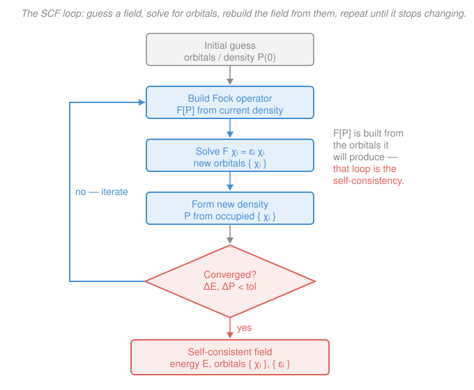

# Quantum Chemistry · Lesson 2.3: The Self-Consistent Field

> ⏱ ~15 min · Module 2: Hartree–Fock and Basis Sets · Builds on: [2.2 The Hartree–Fock equations](02-02-hartree-fock-equations.md) · Unlocks: [2.4 Roothaan–Hall matrices](02-04-roothaan-hall-matrices.md)

## Why this matters

Lesson 2.2 handed you the Hartree–Fock equations $\hat F\chi_i = \varepsilon_i\chi_i$ and then quietly dropped a bomb: the Fock operator $\hat F$ is **built out of the very orbitals $\chi_i$ you're trying to find**. Each electron moves in the averaged field of all the others — but that field is exactly what you don't know until you've solved for the orbitals. It's a snake eating its own tail. This lesson is how chemistry actually escapes the loop: guess, solve, rebuild, repeat, until the orbitals stop moving. That iteration — the **self-consistent field (SCF)** procedure — is the beating heart of every Hartree–Fock, DFT, and hybrid calculation you will ever run. And once it converges, the orbital energies $\varepsilon_i$ it spits out turn out to *mean* something physical (Koopmans' theorem) — they are your first cheap estimate of a molecule's ionization energy.

## The idea

Here's the circularity in one breath. To write down $\hat F$, you need the electron cloud — the density — so you can compute the average repulsion each electron feels. But the density is made *from the orbitals*, and the orbitals are what solving $\hat F\chi_i = \varepsilon_i\chi_i$ is supposed to give you. You need the answer to write the question.

The way out is a fixed-point iteration, the same trick you'd use to solve $x = \cos x$ by mashing the cosine button on a calculator until the number stops changing. **Guess** a density. Use it to **build** a Fock operator — now $\hat F$ is a fixed, known operator. **Solve** its eigenvalue problem for a fresh set of orbitals. Those give a **new** density, which builds a **new** $\hat F$, which gives newer orbitals… Round and round. Early laps, the orbitals lurch around. But the process homes in: the changes shrink each cycle, and eventually the orbitals you *put in* to build $\hat F$ are (to numerical tolerance) the same orbitals that come *out* of solving it.

That's what "**self-consistent**" means. The field is consistent with itself: the orbitals reproduce the very field that produced them. When you can go around the loop and nothing changes, you've found the fixed point — and that's your Hartree–Fock answer.

## The formal version

Work in atomic units throughout: energies in **hartree** ($1\ E_h = 27.211\ \text{eV} = 2625.5\ \text{kJ/mol}$), lengths in **bohr**, $\hbar = m_e = e = 1$.

**The self-consistency knot.** For a closed-shell system the Fock operator from 2.2 is

$$\hat F = \hat h + \sum_{j}^{\text{occ}}\left(2\hat J_j - \hat K_j\right),$$

where $\hat h$ is the one-electron core operator (kinetic energy + electron–nucleus attraction) and the Coulomb and exchange operators $\hat J_j,\hat K_j$ are **defined by the occupied orbitals $\chi_j$**. *In words: the operator that determines the orbitals is itself assembled from those orbitals* — hence you cannot solve $\hat F\chi_i=\varepsilon_i\chi_i$ in one shot the way you would a fixed linear eigenproblem.

**The object that actually converges: the density.** All that $\hat F$ really needs from the orbitals is the **electron density**, packaged as the density matrix. For $N$ electrons in $N/2$ doubly-occupied orbitals expanded in basis functions $\{\phi_\mu\}$ (that expansion is 2.4's job), 

$$P_{\mu\nu} = 2\sum_{a}^{N/2} C_{\mu a}\,C_{\nu a},$$

with $C_{\mu a}$ the coefficient of basis function $\phi_\mu$ in occupied orbital $\chi_a$. *In words: the density matrix summarizes where the electrons are, and it — not any individual orbital — is what you iterate to convergence.* Two orbital sets that differ only by a phase or an in-shell rotation give the *same* $P$; the density is the physically meaningful invariant.

**The SCF loop.**

1. **Guess** an initial density $P^{(0)}$ (e.g. from a cheap superposition of atomic densities, or a bare-core $\hat h$).
2. **Build** the Fock operator $\hat F[P^{(n)}]$ from the current density.
3. **Solve** $\hat F\chi_i = \varepsilon_i\chi_i$ for a new set of orbitals $\{\chi_i\}$ and energies $\{\varepsilon_i\}$.
4. **Form** the new density $P^{(n+1)}$ from the occupied orbitals.
5. **Test** convergence. If not converged, return to step 2 with $P^{(n+1)}$.

**Convergence criteria.** You stop when successive iterations barely move. Two standard tests, both required:

$$\big|E^{(n+1)} - E^{(n)}\big| < \tau_E \quad(\text{e.g. } 10^{-6}\,E_h), \qquad \big\|P^{(n+1)} - P^{(n)}\big\|_{\text{RMS}} < \tau_P \quad(\text{e.g. } 10^{-5}).$$

*In words: quit when the energy and the density both stop changing beyond a tiny tolerance* — the energy check alone can be fooled by an oscillating density passing through the same energy, so you watch the density too.

**When the plain loop misbehaves.** Naïve "feed the new density straight back in" iteration can **oscillate** (the density flip-flops between two patterns) or crawl. Three standard aids, one line each:

- **Damping**: feed back a blend $\alpha P^{(n)} + (1-\alpha)P^{(n+1)}$ instead of the raw new density, so it can't overshoot.
- **Level-shifting**: artificially raise the energy of the empty (virtual) orbitals to discourage occupied/virtual mixing that stalls convergence.
- **DIIS** (direct inversion in the iterative subspace): extrapolate the next density from a weighted combination of previous iterations chosen to minimize the residual — the workhorse that makes modern SCF converge in a handful of cycles.

**Koopmans' theorem — what the $\varepsilon_i$ mean.** Once converged, the orbital energies are not just bookkeeping. For a closed-shell HF wavefunction,

$$\text{IE} \approx -\varepsilon_{\text{HOMO}}, \qquad \text{EA} \approx -\varepsilon_{\text{LUMO}},$$

where IE is the first ionization energy (energy to remove an electron), EA the electron affinity, HOMO/LUMO the highest occupied / lowest unoccupied molecular orbital. *In words: the cost of pulling out the least-bound electron is (minus) its orbital energy, and the energy released by adding one is (minus) the energy of the first empty orbital.* The derivation assumes the remaining orbitals are **frozen** — they don't relax when you remove or add the electron — and it uses the same HF orbitals for the neutral and the ion.

That frozen assumption is wrong in two opposite ways that partly cancel:

- **Neglecting orbital relaxation** makes Koopmans overestimate the IE: in reality the ion's remaining electrons relax inward, lowering the ion's energy and so the true IE.
- **Neglecting electron correlation** makes Koopmans underestimate the IE: the neutral $N$-electron system has more correlation energy (more electron pairs) than the $(N{-}1)$-electron ion, and HF misses more of it for the neutral.

These errors run opposite, so for outer-valence ionizations Koopmans IEs are often good to a fraction of an eV — a lucky, useful cancellation.

## Picture

## Worked examples

**Example 1 (the loop in action — a conceptual walkthrough).** Suppose you're running HF on a small molecule. You start from a bare-core guess: $\hat F^{(0)} = \hat h$ (pretend, for one cycle, that electrons don't repel). Solving $\hat h\chi_i = \varepsilon_i\chi_i$ gives orbitals that are far too contracted — with no repulsion, the electrons pile onto the nuclei. From those orbitals you build $P^{(1)}$ and a real $\hat F^{(1)} = \hat h + \sum_j(2\hat J_j - \hat K_j)$; now the electron–electron repulsion pushes the cloud outward, and solving again gives more diffuse orbitals. The energy on cycle 1 might be $-75.9\ E_h$, cycle 2 $-76.01\ E_h$, cycle 3 $-76.023\ E_h$, cycle 4 $-76.0231\ E_h$… Watch the *changes*: $-0.11,\ -0.013,\ -0.0001$. Each step shrinks the correction by roughly an order of magnitude; when $|\Delta E|$ drops below $10^{-6}\ E_h$ and the density stops shifting, you stop. The final orbitals, fed back in, rebuild the same $\hat F$ that produced them — self-consistent. Notice the energy approaches its limit **from above**: HF with a finite basis is variational (the variational principle you met in [quantum mechanics](../../quantum-mechanics/syllabus.md)), so every SCF energy is an upper bound to the true HF energy, tightening each cycle.

**Example 2 (Koopmans in numbers — water).** A Hartree–Fock calculation on $\ce{H2O}$ gives an occupied set topped by $\varepsilon_{\text{HOMO}} = -0.500\ E_h$ (the oxygen lone-pair orbital). Koopmans' theorem estimates the first ionization energy as

$$\text{IE} \approx -\varepsilon_{\text{HOMO}} = 0.500\ E_h \times 27.211\ \frac{\text{eV}}{E_h} = 13.6\ \text{eV}.$$

The experimental first IE of water is $12.6\ \text{eV}$. Koopmans overshoots by about $1\ \text{eV}$ — exactly the signature of the frozen-orbital approximation: neglecting the relaxation of the cation's electrons inflates the estimate, and correlation only partly claws it back. Still, one number read straight off a converged SCF lands within $8\%$ of experiment, for free. That is why the $\varepsilon_i$ are worth taking seriously.

## Watch out

- **You might think the total HF energy is just the sum of orbital energies, $E = \sum_i \varepsilon_i$.** It isn't. Each $\varepsilon_i$ already contains that orbital's repulsion with *all* the others, so $\sum_i \varepsilon_i$ **double-counts** every electron–electron interaction. The correct closed-shell energy subtracts the overcount: $E = \sum_i (\varepsilon_i + h_{ii})$ over occupied spatial orbitals (equivalently $E = 2\sum_a h_{aa} + \sum_{ab}(2J_{ab}-K_{ab})$). Summing $\varepsilon_i$ is a classic sign you've mis-derived the energy.
- **You might think Koopmans' theorem is a small correction to an otherwise exact IE.** It rests on *two* approximations stacked together — frozen orbitals (no relaxation) **and** the HF wavefunction (no correlation). It works as well as it does only because those two errors point in opposite directions and partly cancel. For inner-shell or strongly-relaxing cases the cancellation fails and Koopmans can be off by several eV.
- **You might trust a converged energy without checking the density.** The energy can plateau while the density is still quietly oscillating between two patterns of the same energy. Always require *both* $\Delta E$ **and** $\Delta P$ below tolerance — that is why the flowchart's test has two conditions, not one.

## One-liner

> The Fock operator is built from the orbitals it's meant to produce, so you iterate — guess, build, solve, rebuild — until the field reproduces itself, and the orbital energies of that self-consistent field are (minus) the molecule's ionization energies.

## Problems

**P1 (🟢)** The five steps of an SCF cycle are listed below, scrambled. (a) Put them in the correct order. (b) State the criterion that tells you the loop is finished. (c) In one sentence, explain why a single non-iterative solve of $\hat F\chi_i = \varepsilon_i\chi_i$ is impossible.

&nbsp;&nbsp;(i) Solve $\hat F\chi_i = \varepsilon_i\chi_i$ for new orbitals  (ii) Form the new density $P$  (iii) Make an initial guess for the density  (iv) Test for convergence  (v) Build the Fock operator $\hat F$ from the current density

**P2 (🟡)** A Hartree–Fock calculation on molecular nitrogen $\ce{N2}$ returns a highest occupied orbital energy $\varepsilon_{\text{HOMO}} = -0.635\ E_h$. (a) Use Koopmans' theorem to estimate the first ionization energy in eV. (b) The experimental value is $15.6\ \text{eV}$. State whether your estimate is high or low, and name the two neglected effects and which way each pushes the error. ($1\ E_h = 27.211\ \text{eV}$.)

**P3 (🔴)** (a) Explain, in terms of the field and the orbitals, what "self-consistent" physically means at the converged solution. (b) A colleague's SCF energy refuses to settle — it bounces between $-76.01\ E_h$ and $-76.05\ E_h$ cycle after cycle. Name this failure mode, say what is physically happening to the density, and give one concrete algorithmic fix and how it helps.

Solutions

**P1** (a) Correct order: **(iii) → (v) → (i) → (ii) → (iv)**, then loop back to (v) if not converged. That is: guess the density, build $\hat F$ from it, solve for new orbitals, form the new density, test convergence.

(b) The loop is finished when successive iterations stop changing: both the energy change $|E^{(n+1)}-E^{(n)}|$ and the density change $\|P^{(n+1)}-P^{(n)}\|_{\text{RMS}}$ fall below preset tolerances (e.g. $10^{-6}\ E_h$ and $10^{-5}$). Both conditions are required.

(c) Because the Fock operator $\hat F$ is *built from the occupied orbitals* (through $\hat J_j$ and $\hat K_j$): you would need the orbitals already in hand to write down the operator whose solution gives those very orbitals. The problem is nonlinear — the operator depends on its own eigenvectors — so it must be solved by iteration to a fixed point, not in a single linear diagonalization.

**P2** (a) By Koopmans' theorem, $\text{IE} \approx -\varepsilon_{\text{HOMO}} = 0.635\ E_h$. Converting,
$$\text{IE} \approx 0.635 \times 27.211\ \text{eV} = 17.3\ \text{eV}.$$

(b) The estimate $17.3\ \text{eV}$ is **higher** than the experimental $15.6\ \text{eV}$ (by $1.7\ \text{eV}$). Two neglected effects:
- **Orbital relaxation** — the cation's remaining electrons relax (contract) after ionization, lowering the ion's energy and hence the true IE; neglecting it makes Koopmans **overestimate** the IE.
- **Electron correlation** — the neutral molecule has more correlation energy than the cation, and HF misses more correlation for the neutral; neglecting it makes Koopmans **underestimate** the IE.

Here the relaxation error dominates the (imperfect) cancellation, leaving Koopmans on the high side — typical for $\ce{N2}$, whose tightly bound $3\sigma_g$ HOMO relaxes substantially.

**P3** (a) At convergence the orbitals you insert to *build* the Fock operator are identical (to tolerance) to the orbitals you get back from *solving* it. Physically, each electron moves in the averaged field of all the others, and that averaged field is exactly the one generated by the final orbital cloud: the orbitals reproduce the field that produces them. The density is a fixed point of the SCF map — put it in, get it back out unchanged.

(b) This is **oscillating (non-convergent) SCF**. Physically the density is flip-flopping between two competing electronic arrangements (e.g. charge sloshing between two regions); feeding each new density straight back in overshoots, and the next cycle overshoots back, so the energy ping-pongs without settling. Fixes (any one):
- **Damping**: feed back a blend $\alpha P^{(n)} + (1-\alpha)P^{(n+1)}$ rather than the raw new density, so the update can't overshoot and the oscillation is averaged out.
- **DIIS**: build the next density from an error-minimizing combination of several previous iterations, killing the back-and-forth and accelerating convergence.
- **Level-shifting**: raise the virtual-orbital energies to suppress the occupied/virtual mixing that drives the flip-flop.

All three tame the step so the iteration spirals into the fixed point instead of bouncing around it.

## Flashback

**From Lesson 2.2 (The Hartree–Fock equations):** For a closed-shell molecule, the sum of the occupied orbital energies is **not** the total electronic energy. In one or two sentences, explain why $\sum_i \varepsilon_i$ differs from $E_{\text{HF}}$, and state which way it errs (too high or too low in magnitude of the repulsion).

Solution

Each orbital energy $\varepsilon_i = h_{ii} + \sum_j (2J_{ij}-K_{ij})$ already includes the repulsion of electron $i$ with **every** other occupied orbital $j$. When you sum $\sum_i \varepsilon_i$, every electron–electron interaction is therefore counted **twice** — once from $i$'s point of view and once from $j$'s. So $\sum_i \varepsilon_i$ overcounts the electron–electron repulsion. The correct total subtracts the surplus:
$$E_{\text{HF}} = \sum_i (\varepsilon_i + h_{ii}) = 2\sum_a h_{aa} + \sum_{ab}(2J_{ab} - K_{ab}),$$
where the second form makes the single (not double) counting of $\sum_{ab}(2J_{ab}-K_{ab})$ explicit. In short: $\sum_i\varepsilon_i$ overstates the repulsion energy, and the correction (adding back the core terms $h_{ii}$, which is equivalent to removing the once-over-counted repulsion) restores the correct $E_{\text{HF}}$.

## Connections

- **Backward:** this is the resolution of the nonlinearity flagged in [2.2](02-02-hartree-fock-equations.md) — the Fock operator's dependence on its own eigenfunctions — and it leans on the [variational principle](../../quantum-mechanics/syllabus.md) to guarantee each SCF energy is an upper bound converging from above.
- **Forward:** [2.4 Roothaan–Hall matrices](02-04-roothaan-hall-matrices.md) turns this abstract loop into concrete linear algebra: expand the orbitals in a basis and the SCF step becomes the generalized matrix eigenvalue problem $FC = SC\varepsilon$, solved and rebuilt each cycle — exactly the density matrix $P$ introduced here doing the iterating.
- **Sideways:** the same self-consistent loop reappears almost unchanged in [DFT's Kohn–Sham equations](../../quantum-chemistry/syllabus.md) (Module 3), where the effective potential replaces $\hat F$ but the guess–build–solve–rebuild cycle is identical; and the Koopmans link between orbital energies and ionization energies is the theoretical backbone of the photoelectron spectra you meet in physical chemistry's [electronic spectroscopy](../../physical-chemistry/lessons/04-06-electronic-spectroscopy.md).
