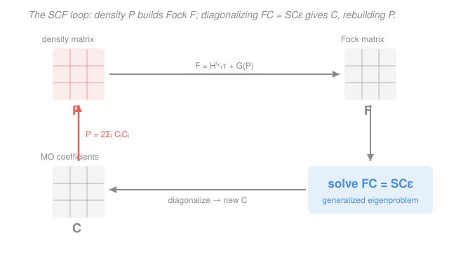

# Quantum Chemistry · Lesson 2.4: Roothaan–Hall — HF as Matrices

> ⏱ ~15 min · Module 2: Hartree–Fock and Basis Sets · Builds on: [2.2 The Hartree–Fock equations](02-02-hartree-fock-equations.md), [2.3 The self-consistent field](02-03-self-consistent-field.md), [1.6 $\ce{H2+}$ and LCAO](01-06-h2-plus-lcao.md) · Unlocks: [2.5 Basis sets](02-05-basis-sets.md)

## Why this matters

The Hartree–Fock equations from [2.2](02-02-hartree-fock-equations.md) are beautiful and useless to a computer: they're *integro-differential* equations for unknown functions $\phi_i(\mathbf r)$ living in an infinite-dimensional space. No machine solves for a function directly. The 1951 insight of Roothaan and Hall was to stop hunting for the orbitals as functions and instead expand each one in a **fixed, finite set of known atomic-orbital functions** — the LCAO idea you already used for $\ce{H2+}$ in [1.6](01-06-h2-plus-lcao.md), now scaled up. The moment you do that, the unknowns become a table of *numbers* (expansion coefficients), the HF equations collapse into a **matrix eigenvalue problem**, and the whole thing runs on linear algebra a laptop can grind through. This lesson is the bridge between the theory of HF and what a real quantum-chemistry code — Gaussian, ORCA, Psi4 — actually computes when you hit "run."

## The idea

Think of what "solve for the best orbital" means. An orbital $\phi_i(\mathbf r)$ is a function — infinitely many values, one per point in space. Searching that entire space is hopeless. So we cheat, in exactly the way [1.6](01-06-h2-plus-lcao.md) cheated: we *declare* that each molecular orbital (MO) is a weighted sum of a handful of atomic orbitals (AOs) parked on the nuclei. Then the only freedom left is the **weights** — a finite list of numbers. Finding the best orbital becomes finding the best numbers.

Once every orbital is "AO number one times $c_1$, plus AO number two times $c_2$, plus …," the HF condition "each orbital is an eigenfunction of the Fock operator" turns into a statement about matrices: a **Fock matrix** $\mathbf F$ (the operator, sampled against the AOs), times the **coefficient matrix** $\mathbf C$ (the weights), equals an **overlap matrix** $\mathbf S$ times $\mathbf C$ times the **orbital energies**. That's $\mathbf F\mathbf C=\mathbf S\mathbf C\boldsymbol\varepsilon$ — one clean equation that replaces the entire integro-differential system.

There's one wrinkle that makes it a *generalized* eigenvalue problem rather than the textbook kind: atomic orbitals on different atoms **overlap**. They aren't perpendicular vectors. That non-orthogonality is the whole reason $\mathbf S$ shows up instead of the identity — and dealing with it is a big part of what the code does.

## The formal version

**The LCAO expansion.** Choose a **basis** of $K$ atomic-orbital functions $\{\chi_\mu(\mathbf r)\}_{\mu=1}^{K}$ (Greek indices $\mu,\nu,\lambda,\sigma$ always label basis functions). Write each MO as a linear combination:

$$\phi_i(\mathbf r)=\sum_{\mu=1}^{K} C_{\mu i}\,\chi_\mu(\mathbf r).$$

*In words: molecular orbital $i$ is a weighted sum of atomic orbitals, and the weight of AO $\mu$ in MO $i$ is the number $C_{\mu i}$.* Stack these numbers into the **coefficient matrix** $\mathbf C$: its column $i$ is MO $i$, its row $\mu$ is AO $\mu$. Finding the orbitals now means finding $\mathbf C$.

**Two matrices from the AOs.** Substituting the expansion into the HF eigenvalue equation $\hat F\phi_i=\varepsilon_i\phi_i$ and projecting onto each $\chi_\nu$ (multiply by $\chi_\nu^*$, integrate) produces two matrices with entries

$$F_{\nu\mu}=\int \chi_\nu^*(\mathbf r)\,\hat F\,\chi_\mu(\mathbf r)\,d\mathbf r, \qquad S_{\nu\mu}=\int \chi_\nu^*(\mathbf r)\,\chi_\mu(\mathbf r)\,d\mathbf r.$$

*In words: the **Fock matrix** $\mathbf F$ is the Fock operator sandwiched between two AOs; the **overlap matrix** $\mathbf S$ measures how much AO $\nu$ and AO $\mu$ occupy the same region of space.* The projection turns $\hat F\phi_i=\varepsilon_i\phi_i$ into the **Roothaan–Hall equations**:

$$\boxed{\;\mathbf F\mathbf C=\mathbf S\mathbf C\,\boldsymbol\varepsilon\;}$$

where $\boldsymbol\varepsilon$ is the **diagonal matrix of orbital energies** $\varepsilon_i$. *In words: this is a generalized eigenvalue problem — solve it and each column of $\mathbf C$ is an MO, each diagonal entry of $\boldsymbol\varepsilon$ its orbital energy.* If the AOs were orthonormal we'd have $\mathbf S=\mathbf I$ and an ordinary eigenproblem $\mathbf F\mathbf C=\mathbf C\boldsymbol\varepsilon$ — but they aren't, so $\mathbf S\neq\mathbf I$ stays.

**The density matrix.** For a closed-shell molecule with $N$ electrons filling the lowest $N/2$ MOs doubly, define the **density matrix**

$$P_{\mu\nu}=2\sum_{i=1}^{N/2} C_{\mu i}\,C_{\nu i}.$$

*In words: $\mathbf P$ collects the occupied MO coefficients into a single object that encodes where the electrons are; the factor 2 is the two electrons per filled orbital.* Only **occupied** MOs enter the sum — the empty (virtual) orbitals don't hold electrons and don't contribute.

**Where the physics hides: the Fock matrix elements.** The Fock matrix splits into a one-electron **core** part (kinetic energy + electron–nucleus attraction, independent of the other electrons) and a two-electron part built from $\mathbf P$:

$$F_{\mu\nu}=H^{\text{core}}_{\mu\nu}+\sum_{\lambda\sigma}P_{\lambda\sigma}\Big[(\mu\nu\,|\,\lambda\sigma)-\tfrac12(\mu\lambda\,|\,\nu\sigma)\Big].$$

*In words: each Fock element is a fixed core piece plus a sum over all electron density of two-electron integrals — the Coulomb repulsion $(\mu\nu|\lambda\sigma)$ minus half the exchange $(\mu\lambda|\nu\sigma)$.* The symbol $(\mu\nu|\lambda\sigma)$ is a **two-electron repulsion integral**, the electrostatic interaction between charge distribution $\chi_\mu\chi_\nu$ and $\chi_\lambda\chi_\sigma$; exchange is the antisymmetry correction from [2.1](02-01-many-electrons-antisymmetry.md). The key structural fact: **$\mathbf F$ depends on $\mathbf P$, and $\mathbf P$ comes from $\mathbf C$, which comes from solving with $\mathbf F$.** The equation feeds itself — which is exactly why it must be solved *self-consistently*.

**The matrix SCF loop.** This closes the [2.3](02-03-self-consistent-field.md) cycle into pure linear algebra:

1. Guess an initial density matrix $\mathbf P$.
2. Build the Fock matrix $\mathbf F$ from $\mathbf P$ (and the fixed $H^{\text{core}}$ and integrals).
3. Solve $\mathbf F\mathbf C=\mathbf S\mathbf C\boldsymbol\varepsilon$ for $\mathbf C$ and $\boldsymbol\varepsilon$.
4. Form a new $\mathbf P$ from the occupied columns of $\mathbf C$.
5. Compare to the old $\mathbf P$; if changed, go to 2. If converged, stop.

**Handling the overlap (orthogonalization).** Step 3 isn't a standard eigenproblem because $\mathbf S\neq\mathbf I$. The fix: transform to an orthonormal basis. Compute $\mathbf S^{-1/2}$ (Löwdin **symmetric orthogonalization**), define $\mathbf F'=\mathbf S^{-1/2}\mathbf F\,\mathbf S^{-1/2}$ and $\mathbf C'=\mathbf S^{1/2}\mathbf C$; then

$$\mathbf F'\mathbf C'=\mathbf C'\boldsymbol\varepsilon$$

is an *ordinary* symmetric eigenproblem you diagonalize directly, after which $\mathbf C=\mathbf S^{-1/2}\mathbf C'$ back-transforms to the AO basis. *In words: absorb the overlap once, up front, so every SCF iteration diagonalizes a clean matrix.*

## Picture

## Worked examples

**Example 1 (why $\mathbf S\neq\mathbf I$ — a two-orbital case).** Take a minimal basis for $\ce{H2}$: one $1s$ orbital on each nucleus, $\chi_A$ and $\chi_B$, at bond length $R$. The overlap matrix is

$$\mathbf S=\begin{pmatrix} S_{AA} & S_{AB} \\ S_{BA} & S_{BB}\end{pmatrix}=\begin{pmatrix} 1 & S \\ S & 1\end{pmatrix},\qquad S=\int\chi_A^*\chi_B\,d\mathbf r.$$

Each AO is normalized so the diagonal is 1, but the off-diagonal $S=\langle\chi_A|\chi_B\rangle$ is *nonzero* — around $0.6$–$0.7$ for hydrogen at its equilibrium bond length. The two orbitals physically overlap in the bonding region. That single number $S$ is why we can't pretend $\mathbf S=\mathbf I$; it reappears in the $\ce{H2+}$ energies $E_\pm=(H_{AA}\pm H_{AB})/(1\pm S)$ from [1.6](01-06-h2-plus-lcao.md) — the *same* overlap, denominator and all.

**Example 2 (building $\mathbf P$ and reading its meaning).** Suppose in that $\ce{H2}$ basis the SCF has converged and the lowest (bonding, doubly occupied) MO has coefficients $C_{A1}=C_{B1}=0.55$. With one occupied MO ($N/2=1$):

$$P_{\mu\nu}=2\,C_{\mu 1}C_{\nu 1}\;\Rightarrow\; \mathbf P=2\begin{pmatrix}0.55\times0.55 & 0.55\times0.55\\ 0.55\times0.55 & 0.55\times0.55\end{pmatrix}=\begin{pmatrix}0.605 & 0.605\\ 0.605 & 0.605\end{pmatrix}.$$

The diagonal entries ($0.605$ each) count the electron population sitting *on* each atom; the off-diagonal ($0.605$) is the **bond-order** density piled up *between* the atoms — the electron sharing that is the covalent bond. Feed this $\mathbf P$ into $F_{\mu\nu}=H^{\text{core}}_{\mu\nu}+\sum_{\lambda\sigma}P_{\lambda\sigma}[(\mu\nu|\lambda\sigma)-\tfrac12(\mu\lambda|\nu\sigma)]$ and you get the two-electron part of the next Fock matrix. (Trace check: $\text{tr}(\mathbf{PS})=0.605(1)+0.605(0.6)\times2+0.605(1)=$ total electrons $=2$ once the true $S$ is used — the density is normalized to the electron count.)

## Watch out

- **You might think $\mathbf S\neq\mathbf I$ is a nuisance to be ignored.** It isn't optional — atomic orbitals on different atoms genuinely overlap, and dropping $\mathbf S$ silently orthogonalizes them, changing the physics. You *remove* it honestly via $\mathbf S^{-1/2}$, not by pretending it's the identity.
- **You might think $\mathbf F\mathbf C=\mathbf S\mathbf C\boldsymbol\varepsilon$ is solved once.** No — because $\mathbf F$ is built from $\mathbf P$, which is built from $\mathbf C$, one diagonalization only gives orbitals consistent with the *guessed* density. You must iterate to self-consistency ([2.3](02-03-self-consistent-field.md)). It's a fixed-point search wearing an eigenvalue-problem costume.
- **You might think only occupied orbitals matter, so ignore the virtuals.** The solve returns *all* $K$ MOs (occupied + virtual); only the occupied ones build $\mathbf P$, but the virtual orbitals and their energies are the raw material for correlation methods (CI, MP2 in [3.2](03-02-configuration-interaction.md)–[3.3](03-03-moller-plesset-mp2.md)) and for the LUMO in spectroscopy. Don't throw them away.
- **You might expect cost to scale with the number of electrons.** The bottleneck is the **two-electron integrals** $(\mu\nu|\lambda\sigma)$: four basis-function indices, each running over $K$ functions, gives $\sim K^4$ integrals. Doubling the basis multiplies the integral count by sixteen. That $N^4$ (here $K^4$) scaling — not the electron count directly — is what makes HF expensive and defines the wall every correlated method must climb over.

## One-liner

> Expand every MO in a fixed AO basis and the Hartree–Fock equations become $\mathbf F\mathbf C=\mathbf S\mathbf C\boldsymbol\varepsilon$ — a generalized eigenvalue problem whose Fock matrix is rebuilt from the density each SCF cycle, at a cost ruled by $K^4$ two-electron integrals.

## Problems

**P1 (🟢)** In the Roothaan–Hall equation $\mathbf F\mathbf C=\mathbf S\mathbf C\boldsymbol\varepsilon$, identify each of the four matrices $\mathbf F$, $\mathbf C$, $\mathbf S$, $\boldsymbol\varepsilon$ and state in one line what each represents. Then explain why $\mathbf S\neq\mathbf I$ in general — what physical fact forces the overlap matrix to differ from the identity?

**P2 (🟡)** A minimal-basis calculation on a two-orbital system has converged with a single doubly-occupied MO whose coefficients are $C_{A1}=0.60$, $C_{B1}=0.40$ (basis functions $\chi_A,\chi_B$). (a) Build the $2\times2$ density matrix $\mathbf P$. (b) State precisely where $\mathbf P$ enters the construction of the Fock matrix, and why that dependence forces the calculation to be iterative.

**P3 (🔴)** (a) Explain why the number of two-electron repulsion integrals $(\mu\nu|\lambda\sigma)$ scales as $K^4$ for $K$ basis functions, and why this is the dominant cost of a Hartree–Fock calculation. (b) Explain why $\mathbf F\mathbf C=\mathbf S\mathbf C\boldsymbol\varepsilon$ is a *generalized* eigenvalue problem rather than an ordinary one, and describe how symmetric (Löwdin) orthogonalization converts it to an ordinary one. (c) Tie both points back to the SCF loop of [2.3](02-03-self-consistent-field.md): which step pays the $K^4$ cost, and which step does the diagonalization?

Solutions

**P1.**
- $\mathbf F$ — the **Fock matrix** in the AO basis, $F_{\nu\mu}=\int\chi_\nu^*\hat F\chi_\mu\,d\mathbf r$: the effective one-electron Hamiltonian (core + averaged electron repulsion), sampled between every pair of AOs. It carries the physics and depends on the density.
- $\mathbf C$ — the **MO coefficient matrix**: column $i$ holds the LCAO weights $C_{\mu i}$ that build molecular orbital $i$ from the AOs. This is the unknown we solve for.
- $\mathbf S$ — the **overlap matrix**, $S_{\nu\mu}=\int\chi_\nu^*\chi_\mu\,d\mathbf r$: how much each pair of AOs occupies the same space.
- $\boldsymbol\varepsilon$ — the **diagonal orbital-energy matrix**: entry $\varepsilon_i$ is the energy of MO $i$ (the eigenvalues).

$\mathbf S\neq\mathbf I$ because the basis functions are **non-orthogonal**: atomic orbitals centered on different nuclei (and even different functions on the same nucleus) overlap in space, so $\int\chi_\nu^*\chi_\mu\,d\mathbf r\neq0$ for $\mu\neq\nu$. Only if the AOs were mutually orthonormal would $\mathbf S$ reduce to the identity. Physically, orbital overlap in the bonding region is what covalent bonding *is* — you can't wish it away.

**P2.**
(a) One occupied MO, so $N/2=1$ and $P_{\mu\nu}=2C_{\mu1}C_{\nu1}$:

$$\mathbf P=2\begin{pmatrix}C_{A1}C_{A1} & C_{A1}C_{B1}\\ C_{B1}C_{A1} & C_{B1}C_{B1}\end{pmatrix}=2\begin{pmatrix}0.36 & 0.24\\ 0.24 & 0.16\end{pmatrix}=\begin{pmatrix}0.72 & 0.48\\ 0.48 & 0.32\end{pmatrix}.$$

(b) $\mathbf P$ enters the **two-electron part** of every Fock element:
$$F_{\mu\nu}=H^{\text{core}}_{\mu\nu}+\sum_{\lambda\sigma}P_{\lambda\sigma}\Big[(\mu\nu|\lambda\sigma)-\tfrac12(\mu\lambda|\nu\sigma)\Big].$$
The core term $H^{\text{core}}_{\mu\nu}$ is fixed (kinetic + nuclear attraction), but the Coulomb–exchange sum is contracted against $\mathbf P$. Since $\mathbf P$ is built from $\mathbf C$, and $\mathbf C$ is obtained by solving $\mathbf F\mathbf C=\mathbf S\mathbf C\boldsymbol\varepsilon$ with that very $\mathbf F$, the equation is **circular**: the operator depends on its own solution. You break the circle by iterating — guess $\mathbf P$, build $\mathbf F$, solve for $\mathbf C$, rebuild $\mathbf P$ — until the density stops changing. That is the self-consistent field.

**P3.**
(a) A two-electron integral $(\mu\nu|\lambda\sigma)$ carries **four** basis-function indices, each ranging over all $K$ functions. The number of index combinations is therefore $\sim K^4$ (formally $K^4/8$ after using the 8-fold permutational symmetry of the integrals, but still $O(K^4)$). Every other ingredient — $H^{\text{core}}$ ($K^2$ integrals), $\mathbf S$ ($K^2$), diagonalization ($K^3$) — is asymptotically cheaper. So as the basis grows, computing (and contracting) the two-electron integrals dominates: doubling $K$ multiplies the integral work by $\sim16$. This $K^4$ wall is the defining cost of Hartree–Fock and the baseline every correlated method is measured against.

(b) It is *generalized* because of the $\mathbf S$ on the right-hand side: $\mathbf F\mathbf C=\mathbf S\mathbf C\boldsymbol\varepsilon$ instead of $\mathbf F\mathbf C=\mathbf C\boldsymbol\varepsilon$. The metric of the space is $\mathbf S$, not the identity, because the AOs aren't orthonormal — MO orthonormality reads $\mathbf C^\dagger\mathbf S\mathbf C=\mathbf I$, with $\mathbf S$ in the middle. **Löwdin symmetric orthogonalization** removes it: form $\mathbf S^{-1/2}$ (take $\mathbf S=\mathbf U\mathbf s\mathbf U^\dagger$, then $\mathbf S^{-1/2}=\mathbf U\,\mathbf s^{-1/2}\mathbf U^\dagger$), define $\mathbf F'=\mathbf S^{-1/2}\mathbf F\mathbf S^{-1/2}$ and $\mathbf C'=\mathbf S^{1/2}\mathbf C$. Substituting gives the ordinary symmetric eigenproblem $\mathbf F'\mathbf C'=\mathbf C'\boldsymbol\varepsilon$, which is diagonalized directly; then $\mathbf C=\mathbf S^{-1/2}\mathbf C'$ returns the coefficients to the AO basis. $\mathbf S^{-1/2}$ is computed once at the start since the basis (and hence $\mathbf S$) is fixed.

(c) In the SCF loop of [2.3](02-03-self-consistent-field.md): the **Fock-build step** (contracting the two-electron integrals against $\mathbf P$) pays the $K^4$ cost every iteration; the **solve step** does the diagonalization, using the pre-computed $\mathbf S^{-1/2}$ to turn the generalized problem into an ordinary one before diagonalizing (an $O(K^3)$ operation). The loop alternates these — build (expensive, density-dependent) then solve (diagonalize) — until $\mathbf P$ is self-consistent.

## Flashback

**From Lesson 2.3 (The self-consistent field):** A closed-shell SCF calculation starts from an initial guess density $\mathbf P^{(0)}$ and, on successive iterations, produces total electronic energies (in hartree) of $-1.820,\ -1.851,\ -1.857,\ -1.8571,\ -1.8571$. (a) What does it mean that the energy has stopped changing, in terms of the density matrix? (b) Why does the energy in this HF procedure approach its converged value from *above* — never dipping below and coming back up? (Fresh variant — a different iteration sequence than any in 2.3.)

Solution

(a) Convergence of the energy signals that the **density matrix has reached a fixed point**: $\mathbf P^{(n)}\approx\mathbf P^{(n-1)}$, so the Fock matrix $\mathbf F$ built from it no longer changes, and re-solving $\mathbf F\mathbf C=\mathbf S\mathbf C\boldsymbol\varepsilon$ returns the same $\mathbf C$ (hence the same $\mathbf P$). The field is now *self-consistent*: the orbitals generate the potential that in turn produces those same orbitals. In practice codes test the change in $\mathbf P$ (and/or the energy) against a threshold and stop when both are below it — here the last two energies agree to all quoted digits.

(b) Because Hartree–Fock is a **variational** method (the variational principle from the [quantum mechanics](../../quantum-mechanics/syllabus.md) course, now aimed at the single-determinant wavefunction). Every trial density gives an energy that is an *upper bound* to the true HF energy, so as the SCF improves the orbitals the energy can only **decrease monotonically toward the minimum from above** — it approaches the converged value and never undershoots it. A non-monotonic dip-and-recover would signal a bug or a non-variational step, not normal convergence. (The converged HF energy is itself still above the exact energy — the gap is the correlation energy of [3.1](03-01-correlation-problem.md).)

## Connections

- **Backward:** this is the LCAO idea of [1.6](01-06-h2-plus-lcao.md) — write each orbital as a sum of atomic orbitals — promoted from two functions and a $2\times2$ secular determinant to $K$ functions and full matrices. The overlap $S$ that appeared in $E_\pm=(H_{AA}\pm H_{AB})/(1\pm S)$ is literally the off-diagonal of $\mathbf S$ here. The self-consistency requirement is [2.3](02-03-self-consistent-field.md); the Fock operator and its Coulomb/exchange pieces are [2.2](02-02-hartree-fock-equations.md); the exchange term traces to antisymmetry in [2.1](02-01-many-electrons-antisymmetry.md).
- **Forward:** [2.5 Basis sets](02-05-basis-sets.md) asks what functions to actually *use* for the $\chi_\mu$ — the choice that sets $K$, and therefore the accuracy *and* the $K^4$ cost, of every calculation. The virtual orbitals this solve produces are the workspace for correlation methods: [3.2 Configuration interaction](03-02-configuration-interaction.md) and [3.3 MP2](03-03-moller-plesset-mp2.md).
- **Sideways (linear algebra / physics):** the generalized eigenvalue problem $\mathbf F\mathbf C=\mathbf S\mathbf C\boldsymbol\varepsilon$ with a non-identity metric $\mathbf S$ is the same structure as coupled small oscillations with a non-diagonal mass matrix ($\mathbf K\mathbf x=\omega^2\mathbf M\mathbf x$) — in both cases you orthogonalize the metric away ($\mathbf S^{-1/2}$ here, mass-weighting there) to recover an ordinary eigenproblem. The density-matrix language returns in DFT ([3.6 Kohn–Sham](03-06-dft-kohn-sham.md)), where an almost-identical matrix SCF loop solves the Kohn–Sham equations.
