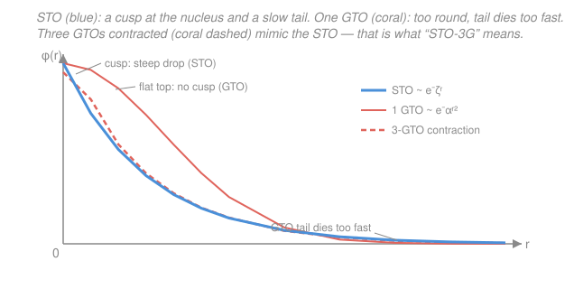

# Quantum Chemistry · Lesson 2.5: Basis Sets

> ⏱ ~15 min · Module 2: Hartree–Fock and Basis Sets · Builds on: [2.4 Roothaan–Hall matrices](02-04-roothaan-hall-matrices.md), [1.2 Hydrogen atom revisited](01-02-hydrogen-atom-revisited.md) · Unlocks: [3.1 The correlation problem](03-01-correlation-problem.md)

## Why this matters

In [2.4](02-04-roothaan-hall-matrices.md) the Hartree–Fock differential equations became the matrix equation $\mathbf{FC} = \mathbf{SC}\boldsymbol{\varepsilon}$ — but only *after* we agreed to expand each molecular orbital in a **fixed, finite list of functions**. That list is the **basis set**, and choosing it is the second great approximation of quantum chemistry. The first was collapsing the wavefunction to a single Slater determinant (Hartree–Fock itself); the second is representing every orbital with a handful of pre-chosen shapes instead of a truly continuous function. Every number a real code prints — an energy, a bond length, a dipole — is only as trustworthy as the basis behind it, and the single most common way to get a *wrong* answer with correct software is to pick the wrong basis. This lesson is the working chemist's field guide to that choice.

## The idea

An orbital is a function of space. To put it on a computer you write it as a weighted sum of building-block functions:

$$\psi_i(\mathbf r) = \sum_{\mu} C_{\mu i}\,\phi_\mu(\mathbf r).$$

The $\phi_\mu$ are the **basis functions** (a fixed menu), and the coefficients $C_{\mu i}$ are what Hartree–Fock solves for. If your menu were *infinite and complete*, this expansion could represent any orbital exactly and Hartree–Fock would hit its true limit. In practice the menu is short, so the answer lives in a cramped subspace — you can only build orbitals out of the shapes you brought.

Two questions decide everything: **what shape** should each building block have, and **how many** should you use? The shape question is a fight between physics and arithmetic. The functions that look most like real atomic orbitals give hard integrals; the functions that give easy integrals look wrong. The clever fix — used by essentially every code on Earth — is to *fake the right shape out of the easy functions*. The number question is the accuracy/cost dial: more functions crawl you toward the exact answer, but the price climbs as roughly the fourth power of how many you add.

## The formal version

**Slater-type orbitals (STOs).** Model an orbital on the real hydrogen atom of [1.2](01-02-hydrogen-atom-revisited.md):

$$\phi^{\text{STO}}(\mathbf r) \propto r^{n-1}\, e^{-\zeta r}\, Y_{\ell m}(\theta,\phi),$$

with $\zeta$ (zeta) the orbital exponent controlling how tightly the function hugs the nucleus, $r$ the distance to that nucleus, and $Y_{\ell m}$ the usual angular part. *In words: an STO is shaped exactly like a true atomic orbital — a sharp point at the nucleus and a slow exponential fade.* It has the two physically correct features: a **cusp** at $r=0$ (the wavefunction's slope is discontinuous there, forced by the $-1/r$ nuclear attraction) and an **exponential tail** $e^{-\zeta r}$ at large $r$ (the correct decay of a bound electron). The catch: two-electron repulsion integrals over four STOs on different atoms have no closed form and are brutally slow.

**Gaussian-type orbitals (GTOs).** Replace the exponential with a bell curve:

$$\phi^{\text{GTO}}(\mathbf r) \propto x^a y^b z^c\, e^{-\alpha r^2},$$

with $\alpha$ the Gaussian exponent and $a+b+c=\ell$ setting the angular momentum. *In words: a GTO is the wrong shape — rounded at the nucleus (no cusp) and dying off too fast (as $e^{-\alpha r^2}$, not $e^{-\zeta r}$) — but mathematically it is a dream.* The reason is the **Gaussian product theorem**: the product of two Gaussians centered on *different* atoms is a single Gaussian centered somewhere between them. That collapse turns the hard four-center integrals into tractable ones, and it is the entire reason quantum chemistry runs on GTOs.

**Contracted Gaussians — the compromise.** You get the STO's shape and the GTO's speed by gluing several **primitive** Gaussians into one **contracted** basis function with *fixed* internal weights:

$$\phi^{\text{CGTO}}(\mathbf r) = \sum_{k=1}^{K} d_k\, g_k(\mathbf r), \qquad g_k \text{ a primitive GTO with exponent } \alpha_k.$$

The contraction coefficients $d_k$ and exponents $\alpha_k$ are optimized *once, in advance*, so the sum best imitates a target STO; the SCF then treats the whole packet as a single function (it never varies $d_k$). *In words: several cheap round Gaussians, stacked in fixed proportions, add up to something close to the right pointy STO shape.* This is exactly what **STO-3G** means: each STO is mimicked by $K=3$ primitive Gaussians. (A finite sum of Gaussians still has zero slope at the nucleus, so even a contraction never reproduces the true cusp perfectly — but it captures the bulk of the orbital, which is what the energy cares about.)

**The quality hierarchy.** Given the shape settled, "how good" is a matter of how many contracted functions you deploy and where:

- **Minimal basis** — one basis function per occupied atomic orbital (e.g. H gets one $1s$; C gets $1s, 2s, 2p_x, 2p_y, 2p_z$). **STO-3G** is the classic. Cheap, and too rigid to describe bonding well — orbitals can't change size or shape as the molecule forms.
- **Split-valence / multiple-zeta** — split each valence orbital into two (**double-zeta**, e.g. **6-31G**, **cc-pVDZ**) or three (**triple-zeta**, e.g. **6-311G**, **cc-pVTZ**) functions of different $\zeta$: a tight inner one and a loose outer one. Mixing them lets the valence orbital *breathe* — contract in a cation, expand in an anion. (In **6-31G**: core $=6$ primitives in one function; valence $=$ a 3-primitive inner function $+$ a 1-primitive outer function.)
- **Polarization functions** — add basis functions of *higher* angular momentum than the atom occupies: $d$ on carbon, $p$ on hydrogen. Notation: **6-31G(d)** or **6-31G\***  adds $d$ on heavy atoms; **6-31G(d,p)** or **6-31G\*\*** also adds $p$ on H. *In words: these let an orbital lean off-center and distort into bonds* — without them you can't describe a bent bond or a lone pair pointing sideways. Essential for geometries and most properties.
- **Diffuse functions** — add extra functions with *very small* exponents (spatially fat, long-reaching). Notation: **6-31+G** adds diffuse functions on heavy atoms, **6-31++G** also on H; the Dunning family prefixes **aug-** (aug-cc-pVTZ). *In words: these reach far from the nucleus* — mandatory for anions, lone pairs, Rydberg states, and weak long-range interactions, where electron density extends well beyond the neutral atom.

**Atomic units.** Throughout this course, energies are in **hartree** ($1\ E_h \approx 27.2\ \text{eV}$) and distances in **bohr** ($1\ a_0 \approx 0.529\ \text{Å}$); in these units $\hbar = m_e = e = 1$.

**Cost and the basis-set limit.** As you enlarge the basis toward completeness the HF energy descends monotonically (variational principle — more functions can only lower it) toward the **Hartree–Fock basis-set limit**. But the number of two-electron integrals scales as $N^4$ in the number of basis functions $N$, so doubling the basis multiplies the integral work by $\sim 16$. You are always buying accuracy at a steep, super-linear price.

## Picture

## Worked examples

**Example 1 (reading a basis-set name).** Decode **6-31+G(d,p)** atom by atom, for a water molecule ($\ce{H2O}$).

- **6-31G** is the split-valence double-zeta core: oxygen's $1s$ core is one 6-primitive function; each oxygen valence orbital ($2s, 2p$) is split into an inner (3-primitive) and outer (1-primitive) function. Each hydrogen $1s$ is likewise split into inner + outer.
- **(d,p)** adds polarization: one set of $d$ functions on oxygen (the heavy atom) and one set of $p$ functions on each hydrogen. Now the O lone pairs and the O–H bonds can bend and distort properly.
- **+** adds one set of diffuse ($s$ and $p$) functions on oxygen only (it would take **++** to also put a diffuse $s$ on the hydrogens). This lets density reach out along the lone pairs.

So the name is a recipe: *double-zeta valence, polarized on all atoms, diffuse on the heavy atom.* A solid, general-purpose choice for a small polar molecule.

**Example 2 (why the shape matters for the energy).** Take the humblest system, the hydrogen atom, whose exact $1s$ orbital is the STO $e^{-r}$ (in bohr, $\zeta=1$). A *single* Gaussian $e^{-\alpha r^2}$ can be variationally optimized against it; the best single Gaussian gives $E_{\min}=-\tfrac{4}{3\pi}\approx-0.4244\ E_h$ against the exact $-0.5\ E_h$ — an error of $0.076\ E_h \approx 2\ \text{eV}$, catastrophic by chemical standards ($1\ \text{eV} \approx 96\ \text{kJ/mol}$). Why so bad? The single Gaussian botches both ends: it is flat where the true orbital spikes (the cusp region, where the electron spends attractive time near the nucleus) and it vanishes too soon in the tail. Stack three optimized Gaussians (this is precisely STO-3G) and you recover the great majority of that lost energy, because the inner sharp Gaussian patches the cusp region while the outer fat one rebuilds the tail. Same physics as the figure: three cheap round functions, summed, imitate the one right pointy one.

## Watch out

- **You might think more Gaussians (bigger $K$ in STO-$K$G) climbs the accuracy hierarchy.** It does not. STO-6G is still a *minimal* basis — six primitives make one very faithful copy of a single STO, but you still have only one function per orbital, so the orbitals still can't split, polarize, or reach. Contraction depth (shape fidelity) and basis quality (number and type of functions) are independent axes.
- **You might think a huge basis fixes everything.** It only removes *basis-set* error. Even at the complete-basis limit, Hartree–Fock still misses **electron correlation** (the topic of [3.1](03-01-correlation-problem.md)) — a separate error that no basis can cure, because it's a flaw in the single-determinant *method*, not the function menu. Two different convergences, and you must control both.
- **You might pair a big basis with a cheap method (or vice versa).** A triple-zeta basis on top of uncorrelated HF wastes money on precision the method can't use; a correlated method (MP2, CCSD) starved on a minimal basis is equally pointless, since correlation energy converges *very* slowly with basis size. Match the basis to the method.
- **You might trust a computed binding energy without checking BSSE** (below) — the classic overbinding trap for anything held together weakly.

**Basis-set superposition error (BSSE).** When you compute the interaction energy of a complex $A\cdots B$ in the *combined* basis of both, each fragment secretly borrows the other's nearby basis functions to lower its *own* energy. That extra flexibility is an artifact of the finite basis, not a real interaction, and it spuriously **overbinds** the complex — worst for weak interactions and small bases. The standard cure is the **counterpoise correction**: recompute each isolated fragment in the *full* dimer basis, placing "ghost" functions (basis functions at the partner's atomic positions but with no nucleus or electrons there) where the partner used to be. Subtracting these ghost-augmented fragment energies removes the borrowed stabilization and yields a corrected, and usually much smaller, interaction energy.

## One-liner

> STOs have the right shape but hard integrals, GTOs have easy integrals but the wrong shape, so we fake STOs out of contracted GTOs — then add splitting, polarization, and diffuse functions until the basis matches the question and the method.

## Problems

**P1 (🟢)** Classify each basis as *minimal*, *split-valence (double- or triple-zeta)*, *polarized*, and/or *diffuse* (a basis can carry several labels), then rank the four by size/cost for the same molecule, smallest first:
STO-3G, 6-31G(d), cc-pVTZ, 6-31+G(d,p).

**P2 (🟡)** In two or three sentences each, state (a) which physical feature STOs get right that GTOs get wrong, and vice versa; (b) the mathematical reason codes prefer GTOs despite the wrong shape; (c) why *contracted* GTOs are the practical resolution.

**P3 (🔴)** For each task, name an appropriate class of basis (and one concrete example) and justify it in one sentence:
(a) the electron affinity of the fluorine atom (energy of $\ce{F} + e^- \to \ce{F-}$);
(b) the equilibrium geometry of propane, a neutral hydrocarbon;
(c) the binding energy of the methane dimer, held together only by dispersion.
Then explain what BSSE is and how the counterpoise correction removes it, and say for which of (a)–(c) it matters most.

Solutions

**P1**
- **STO-3G** — *minimal*: one contracted function per occupied AO (each an STO made of 3 Gaussians). No splitting, no polarization, no diffuse. Smallest.
- **6-31G(d)** — *split-valence double-zeta* (valence split into a 3-primitive inner + 1-primitive outer function) **and polarized** on heavy atoms ($d$ functions; the "(d)"). No polarization on H, no diffuse.
- **6-31+G(d,p)** — *split-valence double-zeta*, *polarized* on **all** atoms ($d$ on heavy, $p$ on H), **and diffuse** on heavy atoms (the "+"). Bigger than 6-31G(d) because of the extra $p$-on-H and the diffuse set.
- **cc-pVTZ** — correlation-consistent *polarized valence **triple**-zeta*: valence split three ways, with **multiple** polarization shells (e.g. $2d,1f$ on a first-row atom, $2p,1d$ on H). No diffuse (that would be aug-cc-pVTZ), but the triple-zeta valence plus several polarization shells make it the largest here.

Ranking, smallest/cheapest → largest/most expensive:
$$\text{STO-3G} \;<\; \text{6-31G(d)} \;<\; \text{6-31+G(d,p)} \;<\; \text{cc-pVTZ}.$$
(Recall the integral count scales like $N^4$, so these cost gaps are steep, not linear.)

**P2**
(a) **Shape.** STOs are physically correct at both ends: a **cusp** at the nucleus (right slope discontinuity, forced by the $-1/r$ attraction) and a slow **exponential tail** $e^{-\zeta r}$. A single GTO $e^{-\alpha r^2}$ is *rounded* at the nucleus (no cusp) and its tail dies *too fast* (Gaussian, not exponential). So STOs win on shape, at both the near and far end.
(b) **Integrals.** The **Gaussian product theorem** says the product of two Gaussians on different centers is one Gaussian on a single intermediate center. This collapses the many-center two-electron repulsion integrals — which have no closed form for STOs — into fast, analytic Gaussian integrals. GTOs win, decisively, on cost.
(c) **Contraction.** Freeze several primitive Gaussians together with fixed coefficients so their sum imitates one STO (a sharp inner Gaussian patches the cusp region, a fat outer one rebuilds the tail). You inherit the STO's shape *and* the GTOs' cheap integrals, while the SCF still sees just one function per contraction — the best of both, which is why every mainstream code does it.

**P3**
(a) **Anion / electron affinity → need diffuse functions**, e.g. **aug-cc-pVTZ** or at least **6-31+G(d)**. The extra electron in $\ce{F-}$ is weakly held and its density extends far from the nucleus; only small-exponent diffuse functions can describe that fat tail, and without them the EA is badly underestimated. (A correlated method is also needed for a good absolute number, but the *basis* red flag here is "diffuse.")
(b) **Neutral hydrocarbon geometry → a polarized split-valence basis suffices**, e.g. **6-31G(d)** or **cc-pVDZ**. Geometries converge quickly with basis size; polarization functions are essential to get bond angles and hybridization right, but there are no anions or long-range effects, so diffuse functions are unnecessary.
(c) **Dispersion complex → large, polarized *and* diffuse basis**, e.g. **aug-cc-pVTZ**, together with a correlated method (dispersion is pure correlation, invisible to HF). Diffuse functions capture the far-reaching density that produces the weak attraction, and you *must* correct for BSSE.

**BSSE and counterpoise.** In the dimer $A\cdots B$ computed in the *combined* basis, each fragment borrows the other's nearby basis functions, artificially lowering its own energy and thus **overbinding** the complex — an artifact of the finite, incomplete basis. The **counterpoise correction** recomputes each isolated fragment in the *full* dimer basis, placing "ghost" basis functions (functions at the partner's atomic sites, but with no nucleus or electrons) where the partner would sit; subtracting these ghost-augmented monomer energies cancels the borrowed stabilization. It matters most for **(c)**, the dispersion complex — the binding is tiny, so the spurious overbinding is a large fraction of the answer — and is negligible for (b), an ordinary covalent geometry.

## Flashback

**From Lesson 2.4 (Roothaan–Hall matrices):** A homonuclear diatomic is treated in a minimal two-function basis $\{\phi_1,\phi_2\}$, one on each atom. Symmetry gives Fock matrix elements $F_{11}=F_{22}=\alpha=-0.90\ E_h$ and $F_{12}=F_{21}=\beta=-0.50\ E_h$, with overlap $S_{11}=S_{22}=1$, $S_{12}=S_{21}=S=0.25$. Solve the generalized eigenvalue problem $\det(\mathbf{F}-\varepsilon\mathbf{S})=0$ for the two orbital energies and say which is bonding.

Solution

The secular determinant is
$$\det(\mathbf F - \varepsilon\mathbf S)=\begin{vmatrix}\alpha-\varepsilon & \beta-\varepsilon S\\ \beta-\varepsilon S & \alpha-\varepsilon\end{vmatrix}=(\alpha-\varepsilon)^2-(\beta-\varepsilon S)^2=0.$$
A difference of squares factors, giving $(\alpha-\varepsilon)=\pm(\beta-\varepsilon S)$, i.e.
$$\varepsilon_\pm=\frac{\alpha\pm\beta}{1\pm S}.$$
Plugging in $\alpha=-0.90$, $\beta=-0.50$, $S=0.25$ (all $E_h$):
$$\varepsilon_+=\frac{-0.90+(-0.50)}{1+0.25}=\frac{-1.40}{1.25}=-1.12\ E_h,\qquad
\varepsilon_-=\frac{-0.90-(-0.50)}{1-0.25}=\frac{-0.40}{0.75}=-0.533\ E_h.$$
The lower (more negative) root $\varepsilon_+=-1.12\ E_h$ is the **bonding** orbital (the in-phase combination, whose overlap denominator $1+S$ concentrates density between the nuclei); $\varepsilon_-=-0.533\ E_h$ is the antibonding orbital.

*Check.* This is the same $E_\pm=(\alpha\pm\beta)/(1\pm S)$ structure as the $\ce{H2+}$ problem of [1.6](01-06-h2-plus-lcao.md); with $\beta<0$ the bonding level sits below $\alpha$ and the antibonding level above, as it must. ✓

## Connections

- **Backward:** the coefficients $C_{\mu i}$ that Hartree–Fock solves for in [2.4](02-04-roothaan-hall-matrices.md)'s $\mathbf{FC}=\mathbf{SC}\boldsymbol{\varepsilon}$ are exactly the weights on *these* basis functions — this lesson names and chooses the $\phi_\mu$ that equation quietly assumed. The overlap matrix $\mathbf S$ is nonzero precisely because basis functions on different atoms overlap. The STO shape traces straight back to the true hydrogenic orbitals of [1.2](01-02-hydrogen-atom-revisited.md).
- **Forward:** [3.1 The correlation problem](03-01-correlation-problem.md) attacks the *other* error — the single-determinant method itself — and you'll see correlation energy converges painfully slowly with basis size, which is why correlated methods demand the polarized, diffuse triple-zeta bases introduced here.
- **Sideways:** these contracted functions are the concrete realization of the LCAO picture behind general chemistry's bonding and antibonding orbitals ([general-chemistry 1.5](../../general-chemistry/lessons/01-05-molecular-shape-vsepr-hybridization-mo.md)); and the variational descent toward the basis-set limit is the same variational principle you met in [quantum mechanics](../../quantum-mechanics/syllabus.md), now measured against the *completeness* of the function menu rather than a single trial parameter.
