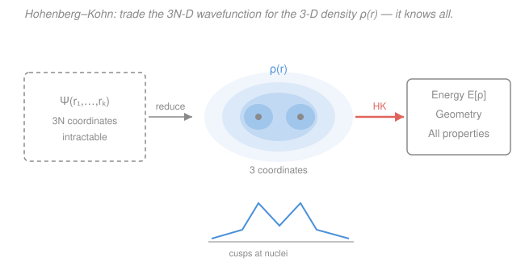

# Quantum Chemistry · Lesson 3.5: DFT I: Hohenberg–Kohn

> ⏱ ~15 min · Module 3: Electron Correlation and DFT · Builds on: [3.1 The correlation problem](03-01-correlation-problem.md), [1.3 Variational principle](01-03-variational-principle.md) · Unlocks: [3.6 DFT II: Kohn–Sham](03-06-dft-kohn-sham.md)

## Why this matters

Every method so far — Hartree–Fock, CI, MP2, coupled cluster — chases the same monster: the many-electron wavefunction $\Psi(\mathbf r_1,\dots,\mathbf r_N)$, a function of $3N$ spatial coordinates. For a modest molecule that is a function on a space of hundreds of dimensions, and the [correlation problem](03-01-correlation-problem.md) is precisely the cost of getting it right. **Density functional theory (DFT)** proposes something that sounds too good to be true: throw the wavefunction away and work with the **electron density** $\rho(\mathbf r)$ — a function of just *three* coordinates, the ordinary charge cloud you could almost measure with an X-ray. The Hohenberg–Kohn theorems say this is not a lossy approximation but an exact reformulation: the density, in principle, contains everything. This lesson is the "in principle." [3.6](03-06-dft-kohn-sham.md) makes it compute.

## The idea

The wavefunction feels indispensable because it seems to carry so much more information than the density. $\Psi$ depends on where *all* $N$ electrons are at once; $\rho(\mathbf r)$ only tells you the average number of electrons at a single point $\mathbf r$. Surely collapsing $\Psi$ down to $\rho$ loses the correlations, the entanglement, the whole many-body soul of the problem?

Hohenberg and Kohn's shock (1964) is that for the *ground state* it does not. Here is the intuition. Look at a real molecular density: it is a smooth blue cloud with a sharp **cusp** spiking up at each nucleus. Those cusps are not decoration — a theorem (Kato's) says the *height* of a cusp fixes the nuclear charge $Z$ sitting under it, and the *positions* of the cusps mark where the nuclei are. And the *total* integral $\int\rho\,d\mathbf r = N$ counts the electrons. So just by *reading the density* you recover the nuclear charges, the nuclear positions, and the electron count — which is to say, you recover the entire Hamiltonian. Once you have the Hamiltonian you have, in principle, every eigenstate and every property. The density knows it all.

That is the first theorem in cartoon form. The second theorem then hands you a *recipe*: among all candidate densities, the true ground state is the one that *minimizes the energy* — a variational principle ([1.3](01-03-variational-principle.md)), but now the thing you vary is a 3-D density instead of a $3N$-D wavefunction. Two theorems, and the many-body problem has been rewritten in three dimensions.

## The formal version

Setup (atomic units, where $\hbar = m_e = e = 4\pi\varepsilon_0 = 1$, so energies come out in hartree). The electronic Hamiltonian is

$$\hat H = \underbrace{-\tfrac12\sum_i \nabla_i^2}_{\hat T\ \text{(kinetic)}} \;+\; \underbrace{\sum_{i<j}\frac{1}{|\mathbf r_i - \mathbf r_j|}}_{\hat V_{ee}\ \text{(electron–electron)}} \;+\; \underbrace{\sum_i v(\mathbf r_i)}_{\hat V_{ext}\ \text{(external)}}.$$

The **external potential** $v(\mathbf r) = -\sum_A Z_A/|\mathbf r - \mathbf R_A|$ is the pull of the nuclei — the *only* piece that differs from one molecule to the next. The other two pieces, $\hat T$ and $\hat V_{ee}$, are the same universal operators for every system of electrons. The **electron density** is

$$\rho(\mathbf r) = N\!\int |\Psi(\mathbf r,\mathbf r_2,\dots,\mathbf r_N)|^2\,d\mathbf r_2\cdots d\mathbf r_N, \qquad \int \rho(\mathbf r)\,d\mathbf r = N.$$

*In words: $\rho(\mathbf r)$ is the probability of finding any electron at $\mathbf r$, scaled so it integrates to the total number of electrons $N$.*

**Hohenberg–Kohn Theorem 1 (existence / uniqueness).** The ground-state density $\rho(\mathbf r)$ determines the external potential $v(\mathbf r)$ uniquely (up to an additive constant).

*In words: fix the ground-state density and the nuclei are pinned down — same density can't come from two different molecules.* Since $v$ fixes $\hat H$, and $\hat H$ fixes every eigenstate, **every ground-state property is a functional of $\rho$**: the energy $E[\rho]$, the wavefunction $\Psi[\rho]$, dipole moments, forces — all determined by that one 3-D function. (A "functional" $F[\rho]$ eats a whole function $\rho$ and returns a number; the square brackets flag it.)

**Hohenberg–Kohn Theorem 2 (variational).** There is a **universal functional** $F[\rho]$ such that the energy functional

$$E_v[\rho] = F[\rho] + \int \rho(\mathbf r)\,v(\mathbf r)\,d\mathbf r, \qquad F[\rho] \equiv T[\rho] + V_{ee}[\rho],$$

satisfies $E_v[\rho] \ge E_0$ for every valid trial density $\rho$, with equality **only** for the true ground-state density $\rho_0$, which yields the exact ground-state energy $E_0$.

*In words: plug any legal density into $E_v[\rho]$ and you get an energy no lower than the truth; minimize over densities and you land exactly on the ground state.* This is the [variational principle of 1.3](01-03-variational-principle.md) with the density as the trial object — instead of scanning trial wavefunctions $\langle\psi|\hat H|\psi\rangle/\langle\psi|\psi\rangle$, you scan trial densities and minimize $E_v[\rho]$ subject to $\int\rho\,d\mathbf r = N$.

**Why "universal."** $F[\rho] = T[\rho] + V_{ee}[\rho]$ contains only the kinetic and electron–electron parts — the two operators that are *identical* for all electronic systems. So $F$ is one and the same functional for the hydrogen molecule, benzene, or a chunk of copper; only the $\int\rho\,v\,d\mathbf r$ term carries the specific molecule. Know $F$ once and you have solved chemistry.

**The catch.** HK proves $F[\rho]$ *exists* — it is a well-defined map from densities to numbers — but gives **no formula for it**. In particular the kinetic energy $T[\rho]$ as an explicit functional of the density is unknown. So the theorems are an existence proof, not an algorithm. The earliest attempt, **Thomas–Fermi theory**, guessed $F$ directly from the uniform electron gas: $T_{TF}[\rho] = C_F\!\int \rho^{5/3}\,d\mathbf r$ with $C_F = \tfrac{3}{10}(3\pi^2)^{2/3}$, plus the classical Coulomb repulsion. It is genuinely *orbital-free* — pure density, no wavefunction — but the crude kinetic term is so far off that Thomas–Fermi predicts **no chemical bonding at all** (Teller's theorem: TF molecules never bind). Getting $T[\rho]$ right to chemical accuracy from the density alone is the wall that orbital-free DFT hits — and exactly the wall Kohn–Sham ([3.6](03-06-dft-kohn-sham.md)) climbs around.

## Picture

The paradigm switch in one frame: discard $\Psi(\mathbf r_1,\dots,\mathbf r_N)$ (left, $3N$ coordinates), keep the density cloud $\rho(\mathbf r)$ (center, 3 coordinates, cusps marking the nuclei), and HK guarantees the coral arrow — density to *everything*.

## Worked examples

**Example 1 (the density really does count electrons and charges).** Take $\ce{H2}$ at equilibrium. Its ground-state density $\rho(\mathbf r)$ is a two-lobed cloud with a cusp over each proton. Integrate it: $\int\rho\,d\mathbf r = 2$, recovering $N = 2$ electrons. Read the cusp condition at either nucleus, $\left.\frac{\partial \bar\rho}{\partial r}\right|_{r\to 0} = -2Z\,\rho(0)$ (with $\bar\rho$ the spherical average) — the slope gives $Z = 1$, a proton. The cusp *positions* give the bond length. From those three readings you have reconstructed $v(\mathbf r) = -1/|\mathbf r - \mathbf R_1| - 1/|\mathbf r - \mathbf R_2|$, hence $\hat H$, hence everything about $\ce{H2}$. That is HK-1 made concrete: the density was not a lossy summary — it held the whole Hamiltonian.

**Example 2 (why the variational statement is a computational promise).** Suppose you had the exact $F[\rho]$. Then finding a molecule's ground state means minimizing $E_v[\rho] = F[\rho] + \int\rho\,v\,d\mathbf r$ over 3-D densities with $\int\rho\,d\mathbf r = N$ fixed. Introduce a Lagrange multiplier $\mu$ for that constraint (the same constrained-optimization trick as everywhere else in the curriculum) and set the functional derivative to zero:

$$\frac{\delta}{\delta\rho(\mathbf r)}\!\left[E_v[\rho] - \mu\!\left(\int\rho\,d\mathbf r - N\right)\right] = 0 \;\Longrightarrow\; \frac{\delta F[\rho]}{\delta\rho(\mathbf r)} + v(\mathbf r) = \mu.$$

*In words: at the true density the "energy cost of adding a bit of charge" is the same everywhere — that constant $\mu$ is the chemical potential (the electronegativity of the whole molecule).* This is a *single 3-D Euler equation*, no $3N$-dimensional wavefunction in sight. The catch bites here: without a formula for $\delta F/\delta\rho$ — especially the kinetic piece — you cannot actually evaluate it. Thomas–Fermi plugs in its crude $F_{TF}$ and gets a solvable equation, but the answer doesn't bind molecules. The promise is real; the missing functional is what stops you cashing it in.

## Watch out

- **You might think reducing $\Psi$ to $\rho$ must lose information** — it feels like averaging away the correlations. For a *general* state it would; the HK miracle is specifically about the *ground state*, where the map $v \leftrightarrow \rho_0$ is one-to-one, so no information is lost. Excited states need more care.
- **You might think HK gives you a way to compute.** It doesn't, on its own. It is an *existence* theorem: $F[\rho]$ exists but its form is unknown. Every practical DFT calculation rests on an *approximate* functional — the exactness of the theorems does not transfer to the approximation you actually run.
- **You might lump DFT in with Thomas–Fermi.** Thomas–Fermi is orbital-free DFT with a bad kinetic functional, and it fails badly (no bonding). Modern DFT works because Kohn–Sham ([3.6](03-06-dft-kohn-sham.md)) reintroduces orbitals to get $T$ almost exactly — a different beast from naive $\rho^{5/3}$ guessing.
- **You might read $F[\rho]$ as "just the easy classical Coulomb energy."** $V_{ee}[\rho]$ includes exchange and correlation, which are genuinely non-classical and *not* simple functionals of $\rho$. Hiding all the hard many-body physics inside an unknown $F$ is exactly why the theorem is easy to state and the functional impossible to write down.

## One-liner

> The ground-state density fixes the potential (HK-1) and minimizes a universal energy functional (HK-2), so 3-D $\rho(\mathbf r)$ holds everything the $3N$-D wavefunction did — the exact energy functional just happens to be unknown.

## Problems

**P1 (🟢)** State the two Hohenberg–Kohn theorems in your own words, and say precisely what each one *guarantees*. For HK-1, trace the chain of implications from $\rho$ to "all properties."

**P2 (🟡)** Explain the central appeal of DFT by comparing the dimensionality of $\rho(\mathbf r)$ with that of $\Psi(\mathbf r_1,\dots,\mathbf r_N)$ for, say, a water molecule ($N = 10$ electrons). Then define the universal functional $F[\rho]$: what two physical pieces does it contain, why is it called "universal," and why don't we have it exactly?

**P3 (🔴)** Sketch the reductio argument behind HK-1: assume two *different* external potentials $v_1$ and $v_2$ (differing by more than a constant) share the same ground-state density $\rho$, and derive a contradiction using the variational principle. Then explain in one paragraph why Thomas–Fermi orbital-free DFT fails, and how that failure motivates the Kohn–Sham strategy of [3.6](03-06-dft-kohn-sham.md).

Solutions

**P1** *HK-1 (existence/uniqueness):* the ground-state electron density $\rho(\mathbf r)$ determines the external potential $v(\mathbf r)$ uniquely, up to a trivial additive constant. It *guarantees* that no information is lost in passing from wavefunction to density — the density is a complete description of the ground state. The implication chain: $\rho \Rightarrow v(\mathbf r)$ (HK-1) $\Rightarrow \hat H = \hat T + \hat V_{ee} + \hat V_{ext}$ (since $\hat T$, $\hat V_{ee}$ are universal and only $v$ was missing) $\Rightarrow$ all eigenstates, in particular $\Psi_0 \Rightarrow$ every ground-state observable. So every property is a functional of $\rho$.

*HK-2 (variational):* there is a universal functional $F[\rho] = T[\rho] + V_{ee}[\rho]$ such that $E_v[\rho] = F[\rho] + \int\rho\,v\,d\mathbf r \ge E_0$ for all valid trial densities $\rho$ (those coming from an antisymmetric $N$-electron state), with equality only at the true ground-state density $\rho_0$. It *guarantees* a way to *find* the ground state: minimize $E_v[\rho]$ over densities — a variational principle in 3-D instead of $3N$-D.

**P2** Water has $N = 10$ electrons, so $\Psi$ is a function of $3N = 30$ spatial coordinates (60 with spin): a function on a 30-dimensional space, whose storage cost grows exponentially — put $M$ grid points per axis and you need $M^{30}$ values. The density $\rho(\mathbf r)$ is a function of just **3** coordinates regardless of $N$: $M^3$ values, the same whether the molecule has 10 electrons or 10,000. That collapse from $3N$ to $3$ — with, per HK, *no loss of ground-state information* — is the whole appeal.

The universal functional is $F[\rho] = T[\rho] + V_{ee}[\rho]$: the **kinetic energy** of the electrons plus the **electron–electron interaction energy** (Coulomb repulsion together with exchange and correlation). It is "universal" because $\hat T$ and $\hat V_{ee}$ are the *same operators* for every electronic system — the functional's form does not depend on which molecule you study; only the $\int\rho\,v\,d\mathbf r$ term carries the identity of the nuclei. We don't have it exactly because HK is an existence proof only: it shows $F[\rho]$ is well-defined but gives no closed form. The kinetic part $T[\rho]$ in particular has no known accurate expression in terms of $\rho$ alone, and $V_{ee}[\rho]$ hides the non-classical exchange–correlation physics.

**P3** *Reductio for HK-1.* Suppose two external potentials $v_1 \ne v_2$ (differing by more than a constant) both have non-degenerate ground states $\Psi_1, \Psi_2$ giving the **same** density $\rho$. They come from Hamiltonians $\hat H_1, \hat H_2$ with ground-state energies $E_1, E_2$. Since $v_1 \ne v_2 + \text{const}$, the states are different, $\Psi_1 \ne \Psi_2$. Use $\Psi_2$ as a *trial* function for $\hat H_1$; by the strict variational principle,

$$E_1 < \langle\Psi_2|\hat H_1|\Psi_2\rangle = \langle\Psi_2|\hat H_2|\Psi_2\rangle + \langle\Psi_2|\hat H_1 - \hat H_2|\Psi_2\rangle = E_2 + \int \rho(\mathbf r)\,[v_1(\mathbf r) - v_2(\mathbf r)]\,d\mathbf r,$$

because $\hat H_1 - \hat H_2 = \hat V_{ext,1} - \hat V_{ext,2} = \sum_i [v_1(\mathbf r_i) - v_2(\mathbf r_i)]$ is a one-body operator whose expectation value is $\int\rho\,(v_1 - v_2)\,d\mathbf r$ — and this is where the *shared* density enters. Now swap the roles (use $\Psi_1$ as a trial for $\hat H_2$):

$$E_2 < E_1 + \int \rho(\mathbf r)\,[v_2(\mathbf r) - v_1(\mathbf r)]\,d\mathbf r.$$

Add the two inequalities. The integrals are equal and opposite, so they cancel, leaving

$$E_1 + E_2 < E_2 + E_1,$$

a strict contradiction. Hence no two distinct potentials can share a ground-state density: $\rho \mapsto v$ is one-to-one. $\blacksquare$

*Why Thomas–Fermi fails, and the Kohn–Sham fix.* Thomas–Fermi is a direct, orbital-free realization of HK: it writes $F[\rho]$ explicitly using the uniform-electron-gas kinetic energy $T_{TF}[\rho] = C_F\int\rho^{5/3}\,d\mathbf r$ plus the classical Coulomb repulsion, then minimizes. The trouble is that $T[\rho]$ — by far the largest energy term — is enormously sensitive to the *shape* of $\rho$, and the smooth $\rho^{5/3}$ ansatz misses the shell structure and the sharp variations near nuclei. The kinetic error swamps the small bonding energies, and the theory predicts no molecule ever binds (Teller). Kohn–Sham sidesteps this: instead of guessing $T[\rho]$ from the density, it introduces a fictitious system of *non-interacting* electrons in orbitals that reproduce the true $\rho$, and computes almost all of the kinetic energy *exactly* from those orbitals. Only a small residual (exchange–correlation) is left to approximate. That is why KS-DFT is accurate where orbital-free DFT is not — the price is reintroducing $N$ orbitals, which [3.6](03-06-dft-kohn-sham.md) develops in full.

## Flashback

**From Lesson 1.3 (Variational principle):** For the hydrogen atom (atomic units, exact ground-state energy $E_0 = -\tfrac12$ hartree), use the normalized trial wavefunction $\psi(r) = (\alpha^3/\pi)^{1/2}e^{-\alpha r}$ with variational parameter $\alpha$. The expectation energy works out to $E(\alpha) = \tfrac12\alpha^2 - \alpha$. Minimize over $\alpha$ and confirm the variational bound $E(\alpha_{\min}) \ge E_0$ is met exactly. (Fresh variant — a different trial family from any worked in the lesson, but the same minimize-then-check drill.)

Solution

Minimize $E(\alpha) = \tfrac12\alpha^2 - \alpha$:

$$\frac{dE}{d\alpha} = \alpha - 1 = 0 \;\Longrightarrow\; \alpha_{\min} = 1.$$

Then $E(1) = \tfrac12(1)^2 - 1 = -\tfrac12$ hartree. This equals the exact $E_0 = -\tfrac12$, so the bound $E \ge E_0$ holds with equality — as it must, because this trial family *contains* the true hydrogen ground state ($\psi \propto e^{-r}$, i.e. $\alpha = 1$). The variational principle can only touch the exact energy when the trial space includes the exact state; otherwise it sits strictly above.

*Check.* $E(\alpha)$ is an upward parabola in $\alpha$ (coefficient $\tfrac12 > 0$), so $\alpha = 1$ is a genuine minimum, and $E(\alpha) \ge -\tfrac12$ for every $\alpha$ — never dipping below the true energy, exactly the guarantee. This is the same variational logic HK-2 lifts from wavefunctions to densities. ✓

## Connections

- **Backward:** HK-2 *is* the [variational principle of 1.3](01-03-variational-principle.md) — an upper bound minimized at the truth — with the trial object promoted from a wavefunction to a density. The reason DFT is worth the trouble is the [correlation problem of 3.1](03-01-correlation-problem.md): correlation is buried inside the unknown $V_{ee}[\rho]$, so an exact $F$ would deliver exact correlation for the cost of a 3-D minimization.
- **Forward:** [3.6 Kohn–Sham](03-06-dft-kohn-sham.md) turns this existence theorem into an algorithm by mapping the interacting density onto a non-interacting orbital system, recovering the kinetic energy that sank Thomas–Fermi and isolating the small exchange–correlation functional that all modern DFT approximates.
- **Sideways:** the density $\rho(\mathbf r)$ with its nuclear cusps is the same charge cloud behind the atomic and molecular structure of general chemistry (see [electron configurations and the periodic table](../../general-chemistry/lessons/01-02-electron-configurations-periodic-table.md)); the constrained minimization in Example 2 is the Lagrange-multiplier method that recurs from quantum mechanics ([variational and perturbation methods](../../quantum-mechanics/syllabus.md)) to constrained optimization across the curriculum, and its multiplier $\mu$ is the chemical potential that reappears in physical-chemistry thermodynamics.
