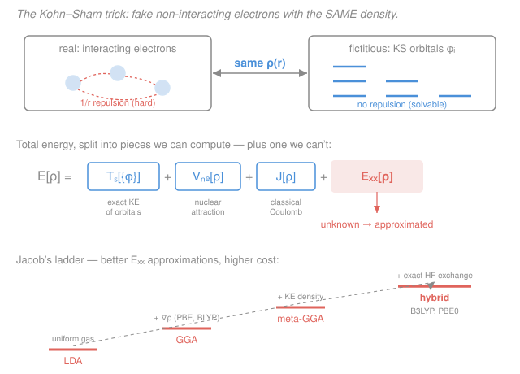

# Quantum Chemistry · Lesson 3.6: DFT II — Kohn–Sham

> ⏱ ~15 min · Module 3: Electron Correlation and DFT · Builds on: [3.5 (Hohenberg–Kohn)](03-05-dft-hohenberg-kohn.md), [2.3 (self-consistent field)](02-03-self-consistent-field.md) · Unlocks: [4.1 (PES & geometry optimization)](04-01-pes-geometry-optimization.md)

## Why this matters

Hohenberg–Kohn (Lesson 3.5) proved a miracle: the entire ground state — energy, everything — is a functional of just the three-dimensional electron density $\rho(\mathbf r)$, not the $3N$-dimensional wavefunction. But it was a miracle with no instructions. The universal functional $F[\rho]$ exists, yet nobody knows its form, and the worst offender is the **kinetic energy**: written directly in terms of $\rho$, it can only be crudely modeled, and crude kinetic energy wrecks the chemistry (it won't even bind molecules). This lesson is the fix that turned DFT from a theorem into the single most-used method in computational chemistry. The trick — due to Kohn and Sham — is so good that DFT now gets you correlation energy at essentially **Hartree–Fock cost**. Nearly every reaction energy, geometry, and spectrum computed today rides on it.

## The idea

The problem is the kinetic energy. We have a great handle on kinetic energy when we have **orbitals** — you saw this in Hartree–Fock (Lesson [2.2](02-02-hartree-fock-equations.md)): $-\tfrac12\langle\phi|\nabla^2|\phi\rangle$, exact and cheap. We have a terrible handle on it when all we have is the density $\rho$. So Kohn and Sham asked a sideways question: *what if we invent a fake system that gives us orbitals back?*

Here is the sleight of hand. Imagine a **fictitious** set of electrons that **do not interact** with each other at all — no messy $1/r_{12}$ repulsion. Such a system is trivially solvable: each electron just sits in its own orbital. Now tune the potential these fake electrons feel until their total density $\rho(\mathbf r)$ **exactly equals the density of the real, interacting molecule**. Same density, completely different (and far easier) dynamics.

Why is that legal? Because Hohenberg–Kohn said *everything* is fixed by the density. If the fake system has the right density, it carries the right information. And now we get the kinetic energy of the fake system **exactly** from its orbitals. It won't equal the real kinetic energy — but the *difference* is small, and we quietly sweep it, together with exchange and correlation, into one leftover term we'll approximate. We've traded one impossible functional (kinetic energy of the density) for one much smaller, better-behaved unknown.

## The formal version

Write the real ground-state energy as a functional of $\rho$ and split it deliberately:

$$\boxed{\,E[\rho] = T_s[\{\phi\}] + V_\text{ne}[\rho] + J[\rho] + E_\text{xc}[\rho]\,}$$

Term by term, with every symbol defined:

- $T_s[\{\phi\}] = -\tfrac12\sum_i^{N}\langle\phi_i|\nabla^2|\phi_i\rangle$ — the kinetic energy of the **non-interacting** reference, computed exactly from its orbitals $\phi_i$ (the **Kohn–Sham orbitals**). The subscript $s$ means "single-particle / non-interacting." Atomic units throughout: energies in hartree, lengths in bohr, $\hbar=m_e=e=1$, so the electron kinetic operator is $-\tfrac12\nabla^2$.
- $V_\text{ne}[\rho] = \int v_\text{ne}(\mathbf r)\,\rho(\mathbf r)\,d\mathbf r$ — electron–nucleus attraction, where $v_\text{ne}(\mathbf r) = -\sum_A Z_A/|\mathbf r - \mathbf R_A|$ is the external potential from nuclei of charge $Z_A$ at positions $\mathbf R_A$. Exact.
- $J[\rho] = \tfrac12\iint \dfrac{\rho(\mathbf r)\rho(\mathbf r')}{|\mathbf r - \mathbf r'|}\,d\mathbf r\,d\mathbf r'$ — the **classical Coulomb** self-repulsion of the charge cloud (the Hartree energy). Exact given $\rho$.
- $E_\text{xc}[\rho]$ — the **exchange–correlation functional**, defined as *everything left over*. It holds: (i) quantum exchange, (ii) electron correlation, and — the subtle part — (iii) the kinetic-energy correction $T[\rho] - T_s[\{\phi\}]$ between the real and fictitious systems. *In words: $E_\text{xc}$ is the junk drawer where all the hard many-body physics is hidden — small in magnitude, but not optional.*

Minimize $E[\rho]$ subject to the orbitals staying orthonormal (a constrained minimization exactly like the one behind Hartree–Fock in [2.2](02-02-hartree-fock-equations.md)). The result is the **Kohn–Sham equations**:

$$\left[-\tfrac12\nabla^2 + v_\text{eff}(\mathbf r)\right]\phi_i = \varepsilon_i\,\phi_i, \qquad v_\text{eff}(\mathbf r) = v_\text{ne}(\mathbf r) + v_H(\mathbf r) + v_\text{xc}(\mathbf r).$$

*In words: each Kohn–Sham orbital solves a one-electron Schrödinger equation in an effective potential.* The three pieces of $v_\text{eff}$ are the functional derivatives of the three density-dependent energy terms:

- $v_H(\mathbf r) = \dfrac{\delta J}{\delta\rho} = \displaystyle\int \dfrac{\rho(\mathbf r')}{|\mathbf r - \mathbf r'|}\,d\mathbf r'$ — the Hartree (classical Coulomb) potential.
- $v_\text{xc}(\mathbf r) = \dfrac{\delta E_\text{xc}}{\delta\rho}$ — the **exchange–correlation potential**, the one unknown piece.

The density is built from the occupied orbitals, $\rho(\mathbf r) = \sum_i^{N}|\phi_i(\mathbf r)|^2$.

**The self-consistency.** Notice $v_\text{eff}$ depends on $\rho$, which depends on the very orbitals you're solving for. This is the identical chicken-and-egg loop you met in the **SCF** procedure of Lesson [2.3](02-03-self-consistent-field.md): guess $\rho \to$ build $v_\text{eff} \to$ solve for orbitals $\to$ rebuild $\rho \to$ repeat until $\rho$ stops changing. Kohn–Sham DFT is solved by the *same* SCF machinery as Hartree–Fock, at the *same* formal cost (roughly $N^3$–$N^4$). The magic: because $E_\text{xc}$ includes correlation, converged KS-DFT delivers **correlated** energies — something HF, at the same price, never can.

**The one catch.** $E_\text{xc}[\rho]$ is unknown exactly and must be **approximated**. The quality of a DFT calculation is essentially the quality of its $E_\text{xc}$ — hence the "functional zoo," organized as **Jacob's ladder** of increasing sophistication:

| Rung | Ingredient added | Examples |
|---|---|---|
| **LDA** | $E_\text{xc}$ from the local density only, borrowed from the uniform electron gas | SVWN |
| **GGA** | + the density gradient $\nabla\rho$ (how fast $\rho$ varies) | PBE, BLYP |
| **meta-GGA** | + kinetic-energy density / $\nabla^2\rho$ | TPSS, SCAN |
| **hybrid** | + a fraction of **exact HF exchange** | B3LYP, PBE0 |

Higher rungs are generally more accurate and more expensive; hybrids (especially **B3LYP**) are the everyday workhorses of molecular chemistry.

## Picture

## Worked examples

**Example 1 (where does each electron-repulsion effect live?).** Consider the simplest question: two electrons in $\ce{He}$. In the KS decomposition, the classical part of their mutual repulsion sits in $J[\rho]$ — but $J$ contains a spurious **self-interaction**: each electron's density repels *itself*, which is unphysical. Where is that error fixed? In $E_\text{xc}$. The exchange part of $E_\text{xc}$ is built precisely to cancel the self-repulsion that $J$ over-counts, and the correlation part accounts for the electrons dodging each other beyond the average field. So the accounting is: $J$ = "every bit of charge repels every other bit, classically and naively," and $E_\text{xc}$ = "the quantum corrections that make that honest." When a functional's exchange doesn't perfectly cancel $J$'s self-term, you get **self-interaction error** — a real, named DFT failure (see Watch out).

**Example 2 (why the trick beats direct density kinetics).** Suppose you tried to skip Kohn–Sham and write kinetic energy directly as a functional of $\rho$ — the old **Thomas–Fermi** model does exactly this, using the uniform-gas result $T_\text{TF}[\rho] = C_F\int \rho^{5/3}\,d\mathbf r$ with $C_F = \tfrac{3}{10}(3\pi^2)^{2/3}$. It's a clean formula, but its error is catastrophic: Thomas–Fermi theory famously predicts that **molecules don't bind at all** (Teller's theorem) — every molecule falls apart into atoms. The kinetic energy is enormous (thousands of hartree for a heavy atom) and even a small fractional error dwarfs a chemical bond (hundredths of a hartree). Kohn–Sham sidesteps this by computing the *bulk* of the kinetic energy exactly from orbitals ($T_s$), leaving only a tiny residual inside $E_\text{xc}$. That single move — exact orbital kinetics instead of approximate density kinetics — is why DFT is chemically accurate and Thomas–Fermi is not.

## Watch out

- **You might think Kohn–Sham orbitals are "the real electrons," like HF orbitals.** They are not — they're auxiliary functions of a fictitious non-interacting system, defined only to reproduce the density. Their energies $\varepsilon_i$ lack the clean physical meaning HF orbital energies have (no exact Koopmans' theorem; the HOMO energy is the notable formal exception, equaling minus the ionization energy for the *exact* functional). Use them for chemical intuition, but don't over-read them.
- **You might think a higher rung is always more accurate.** Usually, but not guaranteed — a functional is fit and validated on certain data, and a fancy meta-GGA can lose to a well-tuned GGA on a system outside its training. The ladder ranks *ingredients*, not a strict accuracy guarantee. Match the functional to the problem.
- **You might expect DFT to just work everywhere because it "has correlation."** It has *approximate* correlation, with structural blind spots: **self-interaction error** (over-delocalizes charge, wrecks reaction barriers and charge-transfer states), **poor dispersion** (standard functionals miss London/van der Waals attraction — patched with empirical **-D** corrections, e.g. B3LYP-D3), and **static (strong) correlation** (near-degeneracies like bond-breaking or stretched $\ce{H2}$, where single-reference DFT fails much as HF does — a job for the multireference methods hinted at in [3.2](03-02-configuration-interaction.md)).

## One-liner

> Kohn–Sham computes the kinetic energy exactly from orbitals of a fake non-interacting system with the *same density*, dumps all remaining many-body physics into one approximated term $E_\text{xc}$, and solves it self-consistently like SCF — buying correlation at Hartree–Fock cost.

## Problems

**P1 (🟢)** Write the Kohn–Sham decomposition of the total energy and state in one phrase what each term is. Which single term contains the unknown physics that must be approximated, and name the three distinct contributions buried inside it.

**P2 (🟡)** Explain the Kohn–Sham trick: what is the fictitious system, what property does it share with the real molecule, and why does this make DFT (a) solvable by the same self-consistent-field loop as Hartree–Fock (Lesson [2.3](02-03-self-consistent-field.md)) yet (b) able to include electron correlation, which Hartree–Fock cannot?

**P3 (🔴)** Place LDA, GGA, and hybrid functionals on the accuracy/cost ladder. Then pick a sensible functional for each task and justify it in one line, naming a known DFT failure relevant to the choice:
(a) thermochemistry of a medium organic molecule;
(b) the binding energy of a benzene dimer (two rings stacked, held only by van der Waals forces);
(c) the reaction barrier of a process where a positive charge is shared across two fragments.

Solutions

**P1** The decomposition is

$$E[\rho] = T_s[\{\phi\}] + V_\text{ne}[\rho] + J[\rho] + E_\text{xc}[\rho].$$

- $T_s$ — kinetic energy of the non-interacting Kohn–Sham reference, computed exactly from its orbitals.
- $V_\text{ne}$ — electron–nucleus (external-potential) attraction energy.
- $J$ — classical Coulomb (Hartree) self-repulsion of the density.
- $E_\text{xc}$ — exchange–correlation functional: **the one that holds the unknown physics** and must be approximated.

The three contributions inside $E_\text{xc}$: (1) exchange (antisymmetry, including cancellation of $J$'s self-interaction), (2) correlation (electrons avoiding one another beyond the mean field), and (3) the kinetic-energy correction $T[\rho] - T_s[\{\phi\}]$ — the difference between the real interacting kinetic energy and the non-interacting one.

**P2** *The fictitious system* is a set of $N$ **non-interacting** electrons — each occupying its own Kohn–Sham orbital, with no electron–electron repulsion. *The shared property* is the electron density: the non-interacting system's potential is tuned so its density $\rho(\mathbf r) = \sum_i|\phi_i|^2$ equals the density of the real, fully interacting molecule. By Hohenberg–Kohn (Lesson [3.5](03-05-dft-hohenberg-kohn.md)), the density determines everything, so a system with the correct density carries the correct ground-state information.

(a) *Solvable like SCF:* because the fake electrons don't interact, each obeys a **one-electron** Schrödinger equation $[-\tfrac12\nabla^2 + v_\text{eff}]\phi_i = \varepsilon_i\phi_i$. But $v_\text{eff}$ depends on the density, which depends on the orbitals — the same self-referential loop as the Fock operator in Hartree–Fock. So you solve it the same way: guess $\rho$, build $v_\text{eff}$, get orbitals, rebuild $\rho$, iterate to self-consistency. Same machinery, same $\sim N^3$–$N^4$ cost.

(b) *Includes correlation:* Hartree–Fock's energy expression, by construction, contains no correlation — it's a single-determinant mean-field theory. Kohn–Sham's energy contains $E_\text{xc}$, which by definition includes the correlation energy. As long as the approximate $E_\text{xc}$ captures correlation reasonably, converged KS-DFT yields correlated energies at HF-like cost — the central practical reason DFT dominates.

**P3** *Ladder (low→high accuracy and cost):* **LDA** (local density only, uniform-gas) $<$ **GGA** (adds the density gradient $\nabla\rho$) $<$ **hybrid** (GGA plus a fraction of exact HF exchange). (meta-GGA sits between GGA and hybrid.)

(a) *Organic thermochemistry:* a hybrid such as **B3LYP** — hybrids' fraction of exact exchange greatly improves reaction and atomization energies; B3LYP is the field's workhorse for main-group organic thermochemistry. Relevant caveat: pure LDA/GGA overbind and mishandle exchange, and even B3LYP needs a dispersion correction for larger systems.

(b) *Benzene dimer (van der Waals):* standard functionals **cannot describe dispersion** — the London attraction between the stacked rings is missing entirely, so a bare B3LYP or PBE predicts little or no binding. Use a **dispersion-corrected** functional, e.g. **B3LYP-D3** or **ωB97X-D**. Named failure: **poor dispersion**.

(c) *Charge shared across two fragments:* this is prone to **self-interaction (delocalization) error**, which spuriously over-stabilizes spread-out (fractional) charge and lowers barriers. Choose a functional with a high or long-range fraction of exact exchange — a **range-separated hybrid** like **ωB97X** (or at least a hybrid such as PBE0) — because exact exchange counteracts the self-interaction. Named failure: **self-interaction error** (charge-transfer / delocalization error).

## Flashback

**From Lesson 3.5 (Hohenberg–Kohn theorems):** State the two Hohenberg–Kohn theorems in one sentence each, and explain what job the **universal functional** $F[\rho]$ does — in particular, why "universal" is the word that makes it powerful. (Fresh variant: focus on the *universality*, not the proofs.)

Solution

**HK-1 (existence):** the ground-state electron density $\rho(\mathbf r)$ uniquely determines the external potential $v_\text{ne}$ (up to a constant), and hence the Hamiltonian and every ground-state property — so the density alone, a function of just three variables, encodes the whole ground state.

**HK-2 (variational principle):** there is an energy functional $E_v[\rho]$ that is minimized by the true ground-state density and equals the true ground-state energy there; any trial density gives an energy no lower than the truth — the density analog of the wavefunction variational principle from [1.3](01-03-variational-principle.md).

**The universal functional** $F[\rho] = T[\rho] + V_\text{ee}[\rho]$ collects the kinetic energy plus electron–electron interaction. The full energy is $E_v[\rho] = F[\rho] + \int v_\text{ne}(\mathbf r)\rho(\mathbf r)\,d\mathbf r$, where only the last term depends on which molecule you're studying. Because $F[\rho]$ contains **no reference to the nuclei** — no $v_\text{ne}$ — it is the *same functional for every system in the universe*: the same $F$ works for $\ce{H2}$, benzene, or a protein. That universality is the payoff and the frustration: if we knew $F$ once, we'd have solved all of chemistry — but nobody knows its exact form, which is exactly why Kohn–Sham (this lesson) splits off the easy, known pieces and quarantines the ignorance in $E_\text{xc}$.

## Connections

- **Backward:** the self-consistent solution reuses the **SCF** loop of [2.3](02-03-self-consistent-field.md) verbatim (guess density → effective one-electron operator → orbitals → new density → repeat); the orbital kinetic energy $-\tfrac12\langle\phi|\nabla^2|\phi\rangle$ and the constrained minimization come straight from Hartree–Fock ([2.2](02-02-hartree-fock-equations.md)); and the whole scheme is licensed by Hohenberg–Kohn ([3.5](03-05-dft-hohenberg-kohn.md)). $E_\text{xc}$ is DFT's answer to the correlation problem posed in [3.1](03-01-correlation-problem.md) — a cheaper alternative to the wavefunction correlation of CI ([3.2](03-02-configuration-interaction.md)), MP2 ([3.3](03-03-moller-plesset-mp2.md)), and coupled cluster ([3.4](03-04-coupled-cluster-taste.md)).
- **Forward:** Module 4 runs on DFT. Because KS-DFT gives cheap, correlated energies *and* forces, it is the default engine for the **potential energy surfaces and geometry optimization** of [4.1](04-01-pes-geometry-optimization.md), the **vibrational frequencies** of [4.2](04-02-vibrational-frequencies.md), and (via time-dependent DFT) the **electronic spectra** of [4.3](04-03-electronic-spectra.md). Knowing a functional's blind spots is exactly the "reading a calculation critically" skill of [4.4](04-04-reading-calculation-critically.md).
- **Sideways:** the LDA's uniform-electron-gas reference is a **statistical-mechanics** object — the same free-electron gas behind metals and the Fermi energy in [statistical mechanics](../../stat-mech/syllabus.md). And the LCAO Kohn–Sham orbitals, plotted and occupied, are the quantitative version of the bonding/antibonding **molecular orbitals** from general chemistry's [MO picture](../../general-chemistry/lessons/01-05-molecular-shape-vsepr-hybridization-mo.md).
