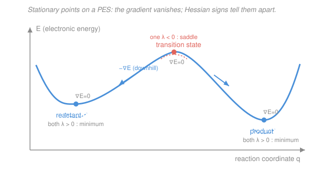

# Quantum Chemistry · Lesson 4.1: Potential Energy Surfaces and Geometry Optimization

> ⏱ ~15 min · Module 4: Computational Chemistry and Spectroscopy · Builds on: [1.5 Born–Oppenheimer approximation](01-05-born-oppenheimer-approximation.md), and the energy methods of Modules 2–3 (HF, MP2, CCSD(T), DFT) · Unlocks: [4.2 Vibrational frequencies](04-02-vibrational-frequencies.md)

## Why this matters

Every question you actually ask a quantum-chemistry program — "what shape is this molecule?", "how much more stable is the product than the reactant?", "how high is the reaction barrier?" — is really a question about the **shape of a surface**. Modules 2–3 gave you machinery to compute the electronic energy for *one* fixed set of nuclear positions. This lesson turns that single number into a landscape and teaches you to find its important points: the valleys (equilibrium structures) and the mountain passes (transition states). Almost no calculation reports the energy at your *guessed* geometry — it first walks downhill to the real one. Understanding that walk is understanding what "the answer" even means.

## The idea

Recall from [1.5](01-05-born-oppenheimer-approximation.md) that the Born–Oppenheimer approximation lets us clamp the nuclei, solve the electrons, and treat the resulting electronic energy (plus nuclear repulsion) as a **potential energy for the nuclei**. Do that at *every* nuclear geometry and you sweep out a **potential energy surface (PES)**: energy as a function of where the atoms sit.

Picture a hilly landscape. Water (a relaxing molecule) rolls downhill and pools in valleys — those are **stable structures**: reactants, products, intermediates. To get from one valley to another, the molecule must climb over the lowest **mountain pass** between them — that pass is the **transition state**, the bottleneck that sets the reaction rate.

Two pieces of local information tell you everything about where you're standing. The **slope** (the gradient) tells you which way is downhill and how steep. At a valley bottom *or* a pass, the ground is momentarily flat — slope zero. So flat ground alone doesn't distinguish a valley from a pass. What distinguishes them is **curvature** (the Hessian): a valley curves *up* in every direction; a pass curves *up* along the ridge but *down* along the road through it. Optimization is just "keep walking downhill until the slope is zero"; classifying what you found is "check the curvature."

## The formal version

A non-linear molecule of $N$ atoms has $3N-6$ internal degrees of freedom (bond lengths, angles, dihedrals) after removing 3 translations and 3 rotations — linear molecules have $3N-5$. Collect them in a coordinate vector $\mathbf{q}=(q_1,\dots,q_{3N-6})$. The PES is the scalar function $E(\mathbf q)$, computable at any $\mathbf q$ by your chosen method (HF/MP2/CCSD(T)/DFT).

**Gradient.** The first derivatives form the gradient vector
$$\nabla E = \left(\frac{\partial E}{\partial q_1},\dots,\frac{\partial E}{\partial q_{3N-6}}\right), \qquad \mathbf F = -\nabla E .$$
*In words: the gradient points uphill; the forces on the nuclei are its negative, pointing downhill.*

**Stationary point.** A geometry where
$$\nabla E(\mathbf q^\star)=\mathbf 0 \quad(\text{every force zero}).$$
*In words: nothing is pushing the atoms — the structure is in mechanical balance.* Reactants, products, intermediates, and transition states are **all** stationary points; the gradient alone cannot tell them apart.

**Hessian.** The matrix of second derivatives,
$$H_{ij}=\frac{\partial^2 E}{\partial q_i\,\partial q_j},$$
a symmetric $(3N-6)\times(3N-6)$ matrix of curvatures. Diagonalize it to get **eigenvalues** $\lambda_1,\dots,\lambda_{3N-6}$, each the curvature along one independent direction (its eigenvector). The signs classify the stationary point:

| Hessian eigenvalues | Type | Chemical meaning |
|---|---|---|
| all $\lambda_i>0$ | minimum | equilibrium structure (reactant / product / intermediate) |
| exactly one $\lambda_i<0$ | first-order saddle | **transition state** — max along the reaction coordinate, min in all other directions |
| two or more $\lambda_i<0$ | higher-order saddle | usually not chemically meaningful |

*In words: a minimum curves upward in every direction (a true bowl); a transition state is a mountain pass — downhill along exactly one direction (the reaction coordinate), uphill along all the rest.*

**Geometry optimization (finding a minimum).** Newton–Raphson takes the local quadratic model $E(\mathbf q+\Delta\mathbf q)\approx E+\nabla E^\top\Delta\mathbf q+\tfrac12\Delta\mathbf q^\top H\,\Delta\mathbf q$, sets its gradient to zero, and solves for the step
$$\boxed{\;\Delta\mathbf q = -H^{-1}\,\nabla E\;}$$
*In words: don't just step straight downhill — use the curvature to jump toward where the slope will vanish.* The Hessian rescales the raw downhill direction $-\nabla E$ so that a shallow, broad direction takes a big step and a steep, stiff one takes a small step, landing near the minimum in far fewer steps than plain gradient descent. Computing an exact $H$ every step is expensive, so in practice **quasi-Newton (BFGS)** methods carry an *approximate* Hessian and update it cheaply from successive gradients. The loop is:

1. Guess a geometry $\mathbf q$.
2. Compute $E$ and $\nabla E$ (and an approximate $H$).
3. Take the step $\Delta\mathbf q=-H^{-1}\nabla E$; move to $\mathbf q+\Delta\mathbf q$.
4. Repeat until **converged**.

Convergence is declared when all of these fall below preset thresholds: the **maximum force** component, the **RMS force** (root-mean-square over all components), the **maximum displacement**, and the **RMS displacement**. (Requiring both force *and* step to be tiny guards against stopping on a flat shoulder that isn't yet a true stationary point.)

**Finding a transition state is harder.** A minimizer only ever goes *downhill*, so it can never land on a pass. A TS search must go **up** along exactly one direction (the eigenvector of the single negative eigenvalue) while going down along all others — **eigenvector-following / saddle-search** algorithms do this, and they need a *good* Hessian to identify which direction to ascend. They also need a starting guess already near the pass; a random guess usually slides into a valley.

**Link to 4.2.** The vibrational frequencies of [4.2](04-02-vibrational-frequencies.md) come from mass-weighting *this same Hessian* and taking square roots of its eigenvalues, $\omega\propto\sqrt{\lambda}$. A negative eigenvalue therefore gives an **imaginary frequency** ($\sqrt{\lambda<0}$ is imaginary) — so a transition state shows up in a frequency calculation as exactly **one imaginary frequency**, and a genuine minimum shows **none**. Running frequencies is how you *confirm* what a geometry optimization found.

## Picture

All three marked points have $\nabla E=0$. The blue minima curve **up** (all $\lambda>0$); the coral pass curves **down** along the reaction coordinate (one $\lambda<0$) — the same negative curvature that becomes the imaginary frequency in [4.2](04-02-vibrational-frequencies.md).

## Worked examples

**Example 1 (classify from the Hessian).** A geometry optimization on a 4-atom non-linear molecule ($3N-6=6$ internal coordinates) converges, and the Hessian eigenvalues (atomic units) come back as
$$\{0.42,\;0.31,\;0.18,\;0.09,\;0.05,\;-0.12\}.$$
Five positive, exactly one negative $\Rightarrow$ **first-order saddle = transition state**. The eigenvector belonging to $-0.12$ is the reaction coordinate: displacing the atoms along it lowers the energy toward reactant on one side and product on the other. A frequency calculation would report one imaginary frequency and five real ones. Had *all six* been positive, this would instead be a genuine equilibrium structure.

**Example 2 (why the Hessian earns its keep).** Consider a toy 2-coordinate energy $E(x,y)=x^2+9y^2$ — a long, narrow valley (stiff in $y$, soft in $x$), minimum at the origin. Start at $(x,y)=(3,1)$. The gradient is $\nabla E=(2x,18y)=(6,18)$.

*Plain steepest descent* steps along $-\nabla E=(-6,-18)$: the huge $y$-component overshoots the steep valley wall and the path zig-zags across the floor, needing many steps.

*Newton's step* uses the Hessian $H=\begin{pmatrix}2&0\\0&18\end{pmatrix}$, so $H^{-1}\nabla E=\left(\tfrac{6}{2},\tfrac{18}{18}\right)=(3,1)$ and
$$\Delta\mathbf q=-H^{-1}\nabla E=(-3,-1)\ \Longrightarrow\ (3,1)+(-3,-1)=(0,0).$$
One step lands exactly on the minimum, because for a truly quadratic surface the quadratic model is exact. Real PESs aren't perfectly quadratic, but near a minimum they're close — which is why quasi-Newton methods converge in a handful of steps. The Hessian's job is to *undo the anisotropy* of the valley.

## Watch out

- **You might think zero gradient means "minimum found."** It only means **stationary**. A transition state has zero gradient too. Always check the Hessian (or run frequencies): all-positive $\Rightarrow$ minimum; one-negative $\Rightarrow$ TS. An optimizer that "converged" can still be sitting on a saddle.
- **You might think a minimizer can reach a transition state if you just start close.** No — quasi-Newton minimization is built to *decrease* energy, so it slides off any pass into the nearest valley. Locating a TS needs a dedicated saddle-search that deliberately ascends one eigenvector.
- **You might read the converged minimum as *the* structure.** It's the nearest **local** minimum to your guess. A flexible molecule has many conformers (local minima); the **global** minimum requires sampling several starting geometries. "Optimized" never automatically means "lowest possible."
- **Don't confuse the number of imaginary frequencies with the number of negative eigenvalues by accident of setup.** A small residual imaginary frequency from a loose grid or unconverged geometry is numerical noise, not a real TS — tighten convergence before believing it (a theme picked up in [4.4 Reading a calculation critically](04-04-reading-calculation-critically.md)).

## One-liner

> The PES is $E(\mathbf q)$; stationary points ($\nabla E=0$) are sorted by Hessian eigenvalue signs — all positive is a minimum, exactly one negative is a transition state — and optimization is Newton stepping $\Delta\mathbf q=-H^{-1}\nabla E$ downhill until the forces vanish.

## Problems

**P1 (🟢)** For each converged stationary point below, the Hessian eigenvalues (atomic units) are given. Classify each as a minimum, a transition state, or a higher-order saddle, and state how many imaginary vibrational frequencies each would show.
(a) $\{0.51,\,0.22,\,0.14\}$  (b) $\{0.40,\,0.19,\,-0.08\}$  (c) $\{0.33,\,-0.05,\,-0.21\}$

**P2 (🟡)** Describe the geometry-optimization loop in your own words: name the quantities computed at each step (energy, gradient, Hessian) and what each is used for, write the Newton/quasi-Newton step, explain *why* multiplying by $H^{-1}$ gives a better step than moving straight along $-\nabla E$, and list the four convergence criteria.

**P3 (🔴)** Explain why a transition state has *exactly one* imaginary vibrational frequency. In your answer connect (i) the geometric classification (one negative Hessian eigenvalue) to (ii) the frequency relation $\omega\propto\sqrt\lambda$ used in [4.2](04-02-vibrational-frequencies.md), and (iii) contrast the algorithmic task of finding a minimum with that of finding a transition state — why can't the same downhill optimizer do both?

Solutions

**P1**
(a) All three eigenvalues positive $\Rightarrow$ **minimum** (equilibrium structure). **Zero** imaginary frequencies.
(b) Exactly one negative eigenvalue ($-0.08$) $\Rightarrow$ **first-order saddle = transition state**. **One** imaginary frequency.
(c) Two negative eigenvalues ($-0.05,\,-0.21$) $\Rightarrow$ **second-order (higher-order) saddle** — not a chemically meaningful stationary point. **Two** imaginary frequencies.
Rule: number of imaginary frequencies = number of negative Hessian eigenvalues, because $\omega\propto\sqrt\lambda$ and $\sqrt{\lambda<0}$ is imaginary.

**P2** The loop:
1. **Guess** an initial geometry $\mathbf q$.
2. **Compute the energy** $E(\mathbf q)$ (via HF/MP2/CCSD(T)/DFT) — tells you how high you are. **Compute the gradient** $\nabla E$ — its negative $-\nabla E$ is the force, pointing downhill and vanishing at a stationary point, so it's both the direction to move and the convergence test. **Compute (or approximately update) the Hessian** $H$ — the local curvature.
3. **Step** $\Delta\mathbf q=-H^{-1}\nabla E$ and move to $\mathbf q+\Delta\mathbf q$.
4. **Repeat** until converged.

Why $H^{-1}$ helps: plain steepest descent moves along $-\nabla E$, but the gradient is large in stiff (high-curvature) directions and small in soft ones, so a single step size either overshoots the stiff directions or crawls in the soft ones, causing zig-zagging (Example 2). Multiplying by $H^{-1}$ divides each direction's step by its curvature, so soft directions take large steps and stiff ones small — the step aims straight at where the *slope will be zero* under the local quadratic model, reaching the minimum in far fewer iterations. Exact Hessians are costly, so **quasi-Newton (BFGS)** builds an approximate $H$ (or $H^{-1}$) from the history of gradients.

Four convergence criteria (all must be met): **maximum force** component, **RMS force**, **maximum displacement**, and **RMS displacement**, each below its threshold. Requiring both force and displacement to be small prevents stopping on a nearly-flat shoulder that isn't yet a true stationary point.

**P3** *(i) Geometry.* At a transition state the Hessian $H_{ij}=\partial^2E/\partial q_i\partial q_j$ has exactly one negative eigenvalue: the surface curves *down* along that one eigenvector (the reaction coordinate — a maximum along the reaction path) and *up* along every other direction (a minimum in all orthogonal directions). That mixed curvature is precisely a first-order saddle, a mountain pass.

*(ii) Frequencies.* Vibrational analysis ([4.2](04-02-vibrational-frequencies.md)) mass-weights this same Hessian and diagonalizes it; each normal-mode frequency satisfies $\omega\propto\sqrt{\lambda}$ for the corresponding eigenvalue $\lambda$. A positive $\lambda$ gives a real, physical vibration. The single negative $\lambda$ gives $\sqrt{\lambda<0}$ = an **imaginary** frequency — a mode that is not an oscillation at all but a "downhill in both directions" motion along the reaction coordinate. One negative eigenvalue $\Rightarrow$ exactly one imaginary frequency; all others (positive) stay real. So the geometric classification and the frequency count are the *same statement about the same matrix*, and running frequencies is how you confirm a TS: exactly one imaginary frequency, and its mode should visibly connect reactant to product.

*(iii) Algorithms.* A minimizer (quasi-Newton/BFGS) is engineered to *decrease* energy along every direction — it always heads to the bottom of the nearest bowl, so it can never rest on a pass; started near a TS it slides off into a valley. Finding a TS is the opposite task in *one* direction: you must *maximize* along the reaction coordinate (the negative-curvature eigenvector) while minimizing along all others. That requires a **saddle-search / eigenvector-following** method plus a good starting guess near the pass and a reliable Hessian to identify which direction to ascend — which is why locating transition states is markedly harder and more failure-prone than optimizing minima.

## Flashback

**From Lesson 1.5 (Born–Oppenheimer approximation):** A Born–Oppenheimer PES for a diatomic near its equilibrium bond length $R_e$ is modeled as $E(R)=\tfrac12 k\,(R-R_e)^2+E_0$ with force constant $k=0.37\ \mathrm{a.u.}$ (hartree/bohr$^2$). (a) What is the gradient $dE/dR$ at $R=R_e$, and what kind of stationary point is $R_e$? (b) In one internal coordinate the "Hessian" is the single number $d^2E/dR^2$ — evaluate it and give its sign. (c) In one sentence, why does the sign of this second derivative already tell you the diatomic will have a real (not imaginary) vibrational frequency?

Solution

(a) $\dfrac{dE}{dR}=k(R-R_e)$, which is **0** at $R=R_e$ — so $R_e$ is a **stationary point**. Since the energy rises on both sides (a well), it is a **minimum**: the equilibrium bond length.

(b) $\dfrac{d^2E}{dR^2}=k=0.37\ \mathrm{a.u.}>0$ — the one-dimensional Hessian is a single **positive** number.

(c) Because the lone Hessian eigenvalue is positive, the frequency $\omega\propto\sqrt{k}$ is **real** — a genuine oscillation of the bond. (A negative second derivative would make $\sqrt{k}$ imaginary, i.e. the "structure" would be a maximum sitting at a transition state, not a stable diatomic.) This is the [4.2](04-02-vibrational-frequencies.md) frequency link in its simplest, one-coordinate form.

## Connections

- **Backward:** the PES *is* the Born–Oppenheimer energy of [1.5](01-05-born-oppenheimer-approximation.md), now viewed as a function over all $3N-6$ internal coordinates rather than a single bond length. The energy at any point comes from the methods of Modules 2–3 — HF ([2.2](02-02-hartree-fock-equations.md)), MP2 ([3.3](03-03-moller-plesset-mp2.md)), coupled cluster ([3.4](03-04-coupled-cluster-taste.md)), or DFT ([3.6](03-06-dft-kohn-sham.md)); the accuracy of the surface is the accuracy of that method, so barrier heights and geometries are only as good as the energy underneath them.
- **Forward:** [4.2 Vibrational frequencies](04-02-vibrational-frequencies.md) diagonalizes the *mass-weighted Hessian* built here — turning its eigenvalues into IR/Raman frequencies and using the imaginary-frequency count to confirm minima vs transition states. Those harmonic frequencies feed the vibrational spectroscopy and thermochemical partition functions of physical chemistry (see [molecular energy levels](../../physical-chemistry/lessons/04-03-molecular-energy-levels-box-oscillator-rotor.md) and [Gibbs–Helmholtz free energies](../../physical-chemistry/lessons/01-03-gibbs-helmholtz-energies.md)).
- **Sideways (classical mechanics / optimization):** "every smooth well is a parabola near its bottom" is exactly the harmonic approximation of a mechanical oscillator — the multidimensional Hessian here plays the role of the single force constant $k=U''(x_0)$, and its eigenvectors are the independent oscillation directions (normal modes). The Newton step $\Delta\mathbf q=-H^{-1}\nabla E$ is the same second-order optimization used across applied math wherever a smooth function must be minimized.
