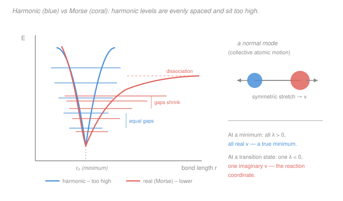

# Quantum Chemistry · Lesson 4.2: Vibrational Frequencies

> ⏱ ~15 min · Module 4: Computational Chemistry and Spectroscopy · Builds on: [4.1 PES and geometry optimization](04-01-pes-geometry-optimization.md), [`physical-chemistry` 4.3 (box, oscillator, rotor)](../../physical-chemistry/lessons/04-03-molecular-energy-levels-box-oscillator-rotor.md) · Unlocks: [4.3 Electronic spectra](04-03-electronic-spectra.md)

## Why this matters

You optimized a geometry in [4.1](04-01-pes-geometry-optimization.md) and landed on a stationary point — the gradient is zero. But is it a *minimum* (a real molecule) or a *transition state* (a fleeting saddle on the way to products)? The answer, and a genuine experimental prediction, both fall out of the **second derivatives** of the potential energy surface — the Hessian. Diagonalize it the right way and you get the molecule's **vibrational frequencies**: the peaks in an IR or Raman spectrum, the zero-point energy that corrects every reaction energy, and a yes/no certificate that your stationary point is what you think it is. This is the single most-run "post-optimization" job in computational chemistry.

## The idea

Near the bottom of any potential well, the surface looks like a parabola — that's the universal-well argument from mechanics ([`mechanics-refresher` 3.1](../../mechanics-refresher/lessons/03-01-simple-harmonic-motion.md), Example 2). A molecule sitting at its optimized geometry is a ball resting in a bowl in $3N$ dimensions (three coordinates per atom). Nudge it and it oscillates. The *shape* of the bowl — how steeply it curves in each direction — sets how fast it rings, exactly as spring stiffness $k$ set $\omega=\sqrt{k/m}$ for one mass on a spring.

The twist for a molecule: the atoms are coupled. Push one and its neighbors move too, and they have *different masses*. So the vibrations aren't "atom 1 wiggles, then atom 2 wiggles." They're **normal modes** — special collective patterns where *every* atom oscillates at *one* shared frequency, in lockstep. A symmetric stretch, a bend, an asymmetric stretch. Any real jiggling is a superposition of these modes. Finding them is a linear-algebra problem: diagonalize the curvature matrix, but weighted by mass so the heavy atoms move less. Each eigenvector is a normal mode; each eigenvalue is (essentially) the square of its frequency.

And the sign of each eigenvalue is the certificate. All positive → you're in a bowl → a minimum. One negative → the bowl is actually a mountain pass in one direction → a transition state, and that one direction *is* the reaction coordinate.

## The formal version

Let $V(\mathbf{x})$ be the Born–Oppenheimer potential energy surface as a function of the $3N$ Cartesian nuclear coordinates $\mathbf{x}=(x_1,y_1,z_1,\dots,z_N)$. At a stationary point the gradient vanishes ($\nabla V=\mathbf 0$, from [4.1](04-01-pes-geometry-optimization.md)) and the curvature is the **Hessian**

$$H_{ij}=\left.\frac{\partial^2 V}{\partial x_i\,\partial x_j}\right|_{\text{stationary}}, \qquad i,j=1,\dots,3N.$$

*In words: $H_{ij}$ is how the force along coordinate $i$ changes as you move along coordinate $j$ — the molecular generalization of the spring constant $k$.*

Newton's equations for small displacements are $m_i\ddot x_i=-\sum_j H_{ij}\,x_j$. The different masses couple awkwardly, so we change variables to $q_i=\sqrt{m_i}\,x_i$ (mass-weighted coordinates). That turns the equations into $\ddot q_i=-\sum_j \tilde H_{ij}\,q_j$ with the **mass-weighted Hessian**

$$\boxed{\;\tilde H_{ij}=\frac{H_{ij}}{\sqrt{m_i\,m_j}}\;}$$

*In words: divide each Hessian entry by the geometric mean of the two atoms' masses — heavy atoms respond less to the same force.* Now diagonalize $\tilde H$. Its **eigenvectors** are the normal modes (mass-weighted displacement patterns) and its **eigenvalues** $\lambda$ give the harmonic angular frequencies

$$\omega=\sqrt{\lambda}, \qquad \tilde\nu=\frac{\omega}{2\pi c},$$

where $c$ is the speed of light and $\tilde\nu$ is the **wavenumber** (cm⁻¹), the unit spectroscopists actually plot. *In words: each mode is an independent harmonic oscillator with its own $\omega=\sqrt{\lambda}$ — the exact same $\sqrt{\text{stiffness}}$ you met for one spring, now once per mode.* These feed straight into the quantized oscillator levels $E_v=\hbar\omega\,(v+\tfrac12)$ from physical chemistry ([4.3](../../physical-chemistry/lessons/04-03-molecular-energy-levels-box-oscillator-rotor.md)).

**Counting modes.** The $3N$ coordinates split into three kinds of motion:

$$\underbrace{3}_{\text{translation}}+\underbrace{3\ (\text{or }2)}_{\text{rotation}}+\underbrace{3N-6\ (\text{or }3N-5)}_{\text{vibration}}=3N.$$

*In words: 3 ways to slide the whole molecule, 3 ways to spin it (only 2 for a linear molecule — spinning about the bond axis moves nothing), and everything left is vibration.* A **nonlinear** $N$-atom molecule has $3N-6$ vibrational modes; a **linear** one has $3N-5$. The 6 (or 5) translations and rotations don't change the energy, so they show up as eigenvalues $\lambda\approx 0$ — zero-frequency modes you discard.

**The transition-state certificate.** From [4.1](04-01-pes-geometry-optimization.md), a stationary point's type is read from the Hessian eigenvalue signs:

- **All $\lambda>0$** → all frequencies real → a **minimum** (a stable molecule).
- **Exactly one $\lambda<0$** → $\omega=\sqrt{\lambda}$ is **imaginary** (reported as e.g. $1200i\ \text{cm}^{-1}$) → a **first-order transition state**. That single negative-curvature eigenvector is the reaction coordinate.

*In words: a frequency job is how you certify a stationary point — count the imaginary frequencies. Zero means a real minimum; exactly one means a genuine transition state.*

**The diatomic special case.** For two atoms there is one vibration ($3\cdot2-5=1$). The Hessian is a single number — the force constant $k$ (N/m) — and the mass-weighting collapses to the **reduced mass** $\mu=m_1m_2/(m_1+m_2)$:

$$\boxed{\;\tilde\nu=\frac{1}{2\pi c}\sqrt{\frac{k}{\mu}}\;}$$

*In words: a diatomic is literally one mass $\mu$ on one spring $k$ — the SHM formula $\omega=\sqrt{k/m}$ from [`mechanics-refresher` 3.1](../../mechanics-refresher/lessons/03-01-simple-harmonic-motion.md), converted to wavenumbers.*

## Picture

The blue parabola is the harmonic model; the coral curve is the real (Morse) potential. They share the same *curvature at the bottom* — the same force constant, so the same harmonic frequency. But the real well is **softer** as you climb: it flattens toward dissociation. So its levels sit **lower** and bunch **closer** together. The transition a spectrometer measures ($v=0\to1$) is therefore *smaller* than the harmonic gap — which is precisely why computed harmonic frequencies come out too high.

## Worked examples

**Example 1 (count the modes).** Water, $\ce{H2O}$, is bent (nonlinear) with $N=3$: it has $3(3)-6=3$ vibrational modes — a symmetric stretch, an asymmetric stretch, and a bend. Carbon dioxide, $\ce{CO2}$, is linear with $N=3$: it has $3(3)-5=4$ modes — symmetric stretch, asymmetric stretch, and *two* degenerate bends (in-plane and out-of-plane). The extra CO₂ mode comes entirely from the "missing" rotation about the molecular axis: a linear molecule spends that degree of freedom on a vibration instead. A frequency calculation returns $3N=9$ eigenvalues for each; you keep the 3 (or 4) with $\lambda>0$ and discard the 6 (or 5) near-zero ones as translations and rotations.

**Example 2 (why you'd care — reading a spectrum).** Suppose a calculation on a carbonyl compound returns a strong mode at $\tilde\nu=1730\ \text{cm}^{-1}$ whose eigenvector is dominated by the C and O atoms moving against each other. That eigenvector *is* the assignment: it's the C=O stretch, and $1730\ \text{cm}^{-1}$ is the IR peak you'd hunt for in the lab. The mode's frequency, its intensity (from how the dipole changes along the eigenvector), and its atomic character all come from the one diagonalization — this is how computed spectra get matched to experiment, and it feeds the electronic-plus-vibrational structure of [4.3](04-03-electronic-spectra.md) and the vibrational spectroscopy of physical chemistry ([4.6](../../physical-chemistry/lessons/04-06-electronic-spectroscopy.md)).

## Watch out

- **You might think the raw computed number is the prediction.** It isn't. Harmonic frequencies from *any* method run **high** for two stacked reasons: (1) the harmonic approximation itself ignores anharmonicity — the real well is Morse-soft, so real levels sit lower; and (2) method/basis error — Hartree–Fock in particular *overbinds*, making the well too stiff. In practice you multiply by an empirical **scaling factor** (≈0.89 for HF, ≈0.96 for B3LYP) that lumps both corrections together. Report the scaled value.
- **You might forget to mass-weight.** Diagonalizing the bare Hessian $H$ gives force constants, not frequencies, and mixes light and heavy motions wrongly. The $1/\sqrt{m_im_j}$ is not optional — it's why an O–H stretch (light H) is high-frequency and a C–I stretch (heavy I) is low.
- **You might panic at an imaginary frequency.** One imaginary frequency is *good* — it certifies a proper transition state. But **two or more** means your "transition state" is a higher-order saddle and not a valid reaction path; re-optimize. And a tiny imaginary frequency ($<50i\ \text{cm}^{-1}$) on a minimum is usually just integration-grid noise, not real.

## One-liner

> Mass-weight the Hessian, diagonalize: eigenvectors are the normal modes and $\omega=\sqrt{\lambda}$ their harmonic frequencies — all real means a minimum, one imaginary means a transition state, and every computed value needs a scaling factor because the real well is softer than a parabola.

## Problems

**P1 (🟢)** Methane, $\ce{CH4}$, is a nonlinear molecule with $N=5$ atoms. How many vibrational normal modes does it have? A frequency job returns $3N$ eigenvalues total — how many, and what physical motions do the non-vibrational ones correspond to? How would the count change if the 5 atoms were arranged in a straight line instead?

**P2 (🟡)** A Hartree–Fock calculation gives the H–Cl bond a harmonic force constant $k=620\ \text{N/m}$. (a) Compute the reduced mass $\mu$ (use $m_{\text H}=1.008\,$u, $m_{\text{Cl}}=35.45\,$u, $1\,\text{u}=1.6605\times10^{-27}\,$kg). (b) Compute $\tilde\nu$ in cm⁻¹ using $\tilde\nu=\frac1{2\pi c}\sqrt{k/\mu}$, $c=2.998\times10^{10}\,\text{cm/s}$. (c) Apply the HF scaling factor 0.89 and compare to the experimental fundamental, $2886\ \text{cm}^{-1}$.

**P3 (🔴, Boss-4 rehearsal)** For carbon monoxide $\ce{CO}$ a calculation returns a force constant $k=1902\ \text{N/m}$ ($m_{\text C}=12.000\,$u, $m_{\text O}=15.999\,$u). (a) Compute $\mu$ in kg and $\tilde\nu$ in cm⁻¹. (b) The experimental fundamental is $\approx 2143\ \text{cm}^{-1}$. Your computed *harmonic* value lands above it — explain the physical reason in terms of the shape of the true potential. (c) What, specifically, does an empirical scaling factor correct for, and why can one number do it?

Solutions

**P1** Nonlinear, $N=5$: vibrational modes $=3N-6=3(5)-6=\boxed{9}$. The frequency job returns $3N=15$ eigenvalues total; the other $15-9=6$ are the zero-frequency modes — **3 translations** (sliding the whole molecule in $x,y,z$) and **3 rotations** (tumbling about three axes). If the 5 atoms were collinear (linear), rotation about the molecular axis moves no nuclei, so there are only 2 rotations, leaving $3N-5=3(5)-5=\boxed{10}$ vibrations — one more, because the "lost" rotation is spent on a vibration.

**P2** (a) Reduced mass:
$$\mu=\frac{m_{\text H}m_{\text{Cl}}}{m_{\text H}+m_{\text{Cl}}}=\frac{1.008\times35.45}{1.008+35.45}=\frac{35.73}{36.458}=0.9801\ \text{u}=0.9801\times1.6605\times10^{-27}=1.628\times10^{-27}\ \text{kg}.$$
(b) $\dfrac{k}{\mu}=\dfrac{620}{1.628\times10^{-27}}=3.809\times10^{29}\ \text{s}^{-2}$, so $\sqrt{k/\mu}=6.172\times10^{14}\ \text{s}^{-1}$. Then
$$\tilde\nu=\frac{6.172\times10^{14}}{2\pi(2.998\times10^{10})}=\frac{6.172\times10^{14}}{1.884\times10^{11}}\approx \boxed{3277\ \text{cm}^{-1}}.$$
(c) Scaled: $0.89\times3277\approx\boxed{2917\ \text{cm}^{-1}}$. *The raw HF number (3277) overshoots experiment (2886) by ~14%; scaling brings it to 2917, within ~1%.* This is exactly the point of the scaling factor — the bare HF harmonic frequency is systematically too high.

**P3** (a) $\mu=\dfrac{12.000\times15.999}{12.000+15.999}=\dfrac{191.99}{27.999}=6.857\ \text{u}=6.857\times1.6605\times10^{-27}=1.139\times10^{-26}\ \text{kg}$. Then $\dfrac{k}{\mu}=\dfrac{1902}{1.139\times10^{-26}}=1.670\times10^{29}$, $\sqrt{\,}=4.087\times10^{14}\ \text{s}^{-1}$, and
$$\tilde\nu=\frac{4.087\times10^{14}}{1.884\times10^{11}}\approx\boxed{2170\ \text{cm}^{-1}}.$$
(b) Computed harmonic $2170 > 2143$ experiment. The harmonic model replaces the real bond potential with a parabola that matches only the *curvature at the very bottom*. The real potential is Morse-like: it softens and flattens toward dissociation, so its energy levels sit lower and bunch closer than the evenly spaced parabola levels. The measured fundamental is the $v=0\to1$ gap of that *softened* ladder, so it comes out **below** the harmonic gap. (c) A scaling factor (~0.96 for a good DFT method, ~0.89 for HF) multiplies the computed harmonic frequency down to match experiment. It lumps together **two** systematic errors: the anharmonicity the harmonic model ignores, and the method/basis error (e.g. HF overbinding → too-stiff well). One number works because both errors are roughly *proportional* to the frequency and consistent across similar molecules, so a single multiplicative constant, fit to a large reference set, captures the bulk of the correction.

## Flashback

**From Lesson 4.1 (PES and geometry optimization):** For the model surface $f(x,y)=x^3-3x+y^2$, find its stationary points, compute the Hessian at each, and classify each as a minimum, maximum, or transition state (saddle). For any transition state, how many imaginary vibrational frequencies would a frequency job report there?

Solution

Stationary points where $\nabla f=\mathbf 0$: $f_x=3x^2-3=0\Rightarrow x=\pm1$, and $f_y=2y=0\Rightarrow y=0$. So $(1,0)$ and $(-1,0)$.

Hessian: $f_{xx}=6x,\ f_{yy}=2,\ f_{xy}=0$, so
$$H=\begin{pmatrix}6x & 0\\[2pt] 0 & 2\end{pmatrix}.$$
It's already diagonal, so its eigenvalues are $6x$ and $2$.

- At $(1,0)$: eigenvalues $6$ and $2$, **both positive** → a **minimum**. All frequencies real; zero imaginary.
- At $(-1,0)$: eigenvalues $-6$ and $2$, **one negative** → a **saddle / transition state**. Exactly **one** imaginary frequency, whose eigenvector points along $x$ — the reaction coordinate.

*Check.* This is the same certificate as the lesson: the sign pattern of the Hessian eigenvalues classifies the stationary point, and the count of negative eigenvalues equals the count of imaginary frequencies. One negative → a proper first-order transition state.

## Connections

- **Backward:** the frequencies are read straight off the Hessian of [4.1](04-01-pes-geometry-optimization.md) — mass-weighting turns "curvature" into "frequency," and the eigenvalue *signs* are the same minimum-vs-saddle test, now stated as real-vs-imaginary frequencies. Each mode is the one-spring SHM of [`mechanics-refresher` 3.1](../../mechanics-refresher/lessons/03-01-simple-harmonic-motion.md), and the quantized levels $E_v=\hbar\omega(v+\tfrac12)$ are the harmonic oscillator of [`physical-chemistry` 4.3](../../physical-chemistry/lessons/04-03-molecular-energy-levels-box-oscillator-rotor.md).
- **Forward:** these frequencies feed [4.3 Electronic spectra](04-03-electronic-spectra.md) (vibrational structure on electronic bands) and Boss Problem 4; the sum $\tfrac12\sum_k\hbar\omega_k$ is the **zero-point energy** that corrects every reaction energy and enters the thermochemical partition-function machinery of physical chemistry.
- **Sideways:** the "mass-weight then diagonalize" recipe is the molecular twin of normal-mode analysis for coupled springs in classical mechanics, and the scaling-factor idea — one empirical constant absorbing a systematic model error — is the same pragmatic move you'll see throughout computational chemistry ([4.4](04-04-reading-calculation-critically.md)).
