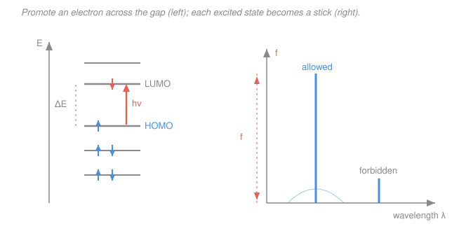

# Quantum Chemistry · Lesson 4.3: Electronic spectra

> ⏱ ~15 min · Module 4: Computational Chemistry and Spectroscopy · Builds on: [2.3 Self-consistent field](02-03-self-consistent-field.md), [`physical-chemistry` 4.6 Electronic spectroscopy](../../physical-chemistry/lessons/04-06-electronic-spectroscopy.md) · Unlocks: [4.4 Reading a calculation critically](04-04-reading-calculation-critically.md)

## Why this matters

A UV/Vis spectrum is often the first thing an experimentalist measures and the first thing they ask you to explain: *why is this dye red, why does that sensor light up at 450 nm, which electronic transition is this band?* Everything you have built so far — Hartree–Fock, DFT, the orbitals and their energies — describes a molecule sitting in its **ground state**. A spectrum is about **excited states**: where the molecule goes when it swallows a photon. This lesson is the bridge from a converged ground-state calculation to a predicted absorption spectrum — what you can read straight off the orbitals (a crude first guess), what you genuinely need extra machinery for, and how to turn a list of excited states into a plot you can lay next to experiment.

## The idea

Start with the cartoon everyone draws first. Your SCF gave you a ladder of molecular orbitals, filled from the bottom up. The **HOMO** is the highest occupied, the **LUMO** the lowest empty. Shine light on the molecule and the simplest thing that can happen is: one electron jumps from an occupied orbital into an empty one — most cheaply, HOMO → LUMO. The photon energy needed is roughly the *gap* between those two orbital energies. That single picture already gets you far: small gap → absorbs low-energy (red/IR) light, large gap → absorbs high-energy (UV) light. It's why conjugated dyes (small gaps) are colored and why saturated hydrocarbons (huge gaps) are clear.

But "roughly the gap" hides a real cheat. Orbital energies were computed for the *ground-state* electron cloud. The moment you move an electron up, the whole cloud rearranges — the electron you promoted now feels a different repulsion, and so do all the others. The true excitation energy is the gap **plus** a correction for that change in electron–electron interaction, and that correction can be over an electron-volt. So the orbital gap is a qualitative sighting shot, not a number you'd report. To get honest excitation energies — and, just as important, *how strongly* each transition absorbs — you need methods that actually solve for excited states. Two do the everyday work: **CIS** and, the DFT-era workhorse, **TD-DFT**.

## The formal version

**The orbital-gap estimate.** The crudest transition energy is

$$\Delta E_{\text{HOMO}\to\text{LUMO}} \approx \varepsilon_{\text{LUMO}} - \varepsilon_{\text{HOMO}},$$

with $\varepsilon_i$ the orbital energies from a converged SCF ([2.3](02-03-self-consistent-field.md)). *In words: approximate the photon energy by the energy difference between the empty orbital you fill and the occupied one you empty.* Convert to a wavelength with the Planck relation $E = h\nu = hc/\lambda$, so $\lambda = hc/\Delta E$. This **neglects orbital relaxation and the change in electron–electron interaction on excitation** — exactly the frozen-orbital sin you already met in Koopmans' theorem ([2.3](02-03-self-consistent-field.md)), now applied to a *difference* of orbitals instead of a single one. Treat it as order-of-magnitude only.

**Configuration interaction singles (CIS).** Build excited states as mixtures of all singly-excited configurations $|\Phi_i^a\rangle$ (one electron moved from occupied orbital $i$ to virtual orbital $a$) on top of the HF reference, and diagonalize the Hamiltonian in that space:

$$|\Psi_{\text{ex}}\rangle = \sum_{i,a} c_i^a\,|\Phi_i^a\rangle.$$

*In words: an excited state isn't one clean orbital jump — it's a weighted blend of many possible jumps, and CIS finds the blend and its energy.* CIS is the excited-state analogue of HF: it includes the interaction change that the bare gap misses, but like HF it omits electron correlation, so it typically **overestimates** excitation energies (often by ~0.5–1 eV).

**Time-dependent DFT (TD-DFT).** Keep this conceptual. TD-DFT asks how the ground-state Kohn–Sham density ([DFT, Module 3](../syllabus.md)) responds to a small oscillating electric field; the frequencies at which the response resonates *are* the excitation energies. In practice you solve a matrix eigenvalue problem whose eigenvalues are the excitation energies $\omega_n$ and whose eigenvectors give the **transition density** — the shape of the electron rearrangement — from which the intensity follows. *In words: TD-DFT delivers excited-state energies and intensities at roughly the cost of a ground-state DFT calculation*, which is why it is the default for molecules of any real size. It builds in the electron-interaction change (through the functional), so it is far better than the gap and usually better than CIS.

**Intensity — the oscillator strength.** How *strongly* a transition absorbs is set by the **transition dipole moment**:

$$\boldsymbol{\mu}_{0n} = \langle\Psi_n\,|\,\hat{\boldsymbol{\mu}}\,|\,\Psi_0\rangle, \qquad f_n \;\propto\; \omega_n\,|\boldsymbol{\mu}_{0n}|^2,$$

where $\hat{\boldsymbol{\mu}} = -\sum_k \mathbf{r}_k$ (atomic units) is the dipole operator, $\Psi_0$ the ground and $\Psi_n$ the excited state, $\omega_n$ the excitation energy, and $f_n$ the dimensionless **oscillator strength**. *In words: a transition absorbs strongly only if promoting the electron actually shifts charge in a way that couples to the light's electric field; no charge displacement, no absorption.* $f \approx 1$ is a strong band; $f \approx 0$ is dark.

**Selection rules** are the symmetry shortcuts for when $\boldsymbol{\mu}_{0n}$ vanishes:

- **Spin:** $\Delta S = 0$. Transitions that flip total spin (singlet → triplet) are spin-forbidden and appear only very weakly.
- **Spatial / symmetry (parity, Laporte):** the integrand $\Psi_n\,\hat{\boldsymbol{\mu}}\,\Psi_0$ must contain the totally symmetric representation, or the integral is zero. In centrosymmetric systems this becomes the Laporte rule — $g \leftrightarrow g$ and $u \leftrightarrow u$ transitions are forbidden ($\hat{\boldsymbol{\mu}}$ is odd, so only $g \leftrightarrow u$ survives).

*In words: forbidden means the transition dipole integral is zero by symmetry, so $f \to 0$ and the band is weak (it shows up at all only because vibrations briefly break the symmetry).*

**Predicting a spectrum.** Each excited state gives one $(\omega_n, f_n)$ pair. Plot excitation energy (or wavelength $\lambda = hc/\omega_n$) on the $x$-axis and $f_n$ as the stick height: a **stick spectrum**. Real bands aren't infinitely thin — vibrational and thermal motion smear each line — so you convolve each stick with a Gaussian or Lorentzian to get a smooth predicted absorption curve. The vibrational fine structure *within* a band (the **Franck–Condon** progression from [physical chemistry 4.6](../../physical-chemistry/lessons/04-06-electronic-spectroscopy.md)) comes from the overlap of ground- and excited-state vibrational wavefunctions — a further layer you can add on top.

## Picture

## Worked examples

**Example 1 (gap → color).** A TD-DFT run on a conjugated dye reports a first excitation energy of $2.30\ \text{eV}$ with oscillator strength $f = 0.8$. What color region does it absorb, and what does the large $f$ tell you? Convert with $\lambda(\text{nm}) = 1239.8 / E(\text{eV})$ (the handy form of $\lambda = hc/E$):

$$\lambda = \frac{1239.8}{2.30} \approx 539\ \text{nm}.$$

That's green light. A molecule absorbing green appears magenta/red (you see the *complement*). The large $f \approx 0.8$ says this is a strong, fully allowed band — a genuinely colored, intense dye, not a faint tail. Everything the experimentalist sees, from one $(\omega, f)$ pair.

**Example 2 (why the bare gap misleads).** Suppose the same molecule's *orbital gap* is $\varepsilon_{\text{LUMO}} - \varepsilon_{\text{HOMO}} = 3.1\ \text{eV}$ from the Kohn–Sham orbitals, but TD-DFT gives $2.30\ \text{eV}$ for the actual first excitation. Which do you trust, and why the $0.8\ \text{eV}$ discrepancy? Trust TD-DFT. The bare gap ignores that promoting the electron changes the electron–electron interaction: the excited electron and the hole it leaves behind attract each other (an electron–hole binding), pulling the true excitation energy *below* the naked orbital gap. The gap gave you the right ballpark and the right *ordering* of states, but the $0.8\ \text{eV}$ is precisely the electron-interaction physics the gap can't see — and it's the difference between predicting a green absorber and a UV one.

## Watch out

- **You might think the HOMO–LUMO gap *is* the excitation energy.** It's a first estimate that omits the change in electron–electron repulsion when you excite; the real transition energy can differ by an eV or more. Report a CIS/TD-DFT number, not the gap, in anything quantitative.
- **You might think a computed transition with $f \approx 0$ is a mistake.** No — it's a *forbidden* transition, correctly predicted to be dark by symmetry/spin. It's still a real excited state (it matters for photochemistry and phosphorescence); it just barely absorbs.
- **You might trust TD-DFT everywhere.** Standard (local/hybrid) functionals systematically fail for **charge-transfer** states (electron moves far, to a region the functional's self-interaction error mishandles — energies come out far too low) and for **Rydberg** states (diffuse excited orbitals the functional can't bind). Range-separated functionals fix much of this — but you have to know to check.

## One-liner

> The orbital gap sights the target, but honest UV/Vis needs an excited-state method (CIS, TD-DFT) for the energy *and* the transition dipole for the intensity — then it's just a stick plot of $(\lambda, f)$, broadened.

## Problems

**P1 (🟢)** A Kohn–Sham calculation gives $\varepsilon_{\text{HOMO}} = -0.245\ E_h$ and $\varepsilon_{\text{LUMO}} = -0.087\ E_h$. (a) Estimate the HOMO→LUMO transition energy in eV and the corresponding wavelength in nm. (b) State in one sentence why this is only a crude estimate. Use $1\ E_h = 27.211\ \text{eV}$ and $\lambda(\text{nm}) = 1239.8/E(\text{eV})$.

**P2 (🟡)** A TD-DFT calculation on a centrosymmetric molecule returns four low-lying excited states: (i) a singlet of $u$ symmetry, (ii) a singlet of $g$ symmetry, (iii) a triplet of $u$ symmetry, (iv) a singlet of $u$ symmetry with a large computed transition dipole. The ground state is a totally symmetric singlet ($g$). For each, state whether the transition from the ground state is spin-allowed and spatially (Laporte) allowed, and rank the four by expected band intensity (oscillator strength).

**P3 (🔴)** In two or three sentences each: (a) What does TD-DFT give you that the orbital-gap estimate cannot? (b) Name one class of excited state where standard-functional TD-DFT is known to fail badly, say which way the error goes, and describe one concrete check you'd run to catch it.

Solutions

**P1** (a) The gap in hartree is

$$\Delta E = \varepsilon_{\text{LUMO}} - \varepsilon_{\text{HOMO}} = -0.087 - (-0.245) = 0.158\ E_h.$$

Convert to eV: $0.158 \times 27.211 = 4.30\ \text{eV}$. Then

$$\lambda = \frac{1239.8}{4.30} \approx 288\ \text{nm},$$

i.e. in the UV. (b) It equates the excitation energy with a difference of *ground-state* orbital energies, ignoring that exciting an electron changes the electron–electron interaction (orbital relaxation + electron–hole attraction) — so the true excitation energy is shifted, typically downward, from this bare gap by up to ~1 eV.

*Check.* Units: $E_h \times (\text{eV}/E_h) = \text{eV}$ ✓; a ~4 eV gap landing in the near-UV (~290 nm) is sensible for a colorless small molecule. ✓

**P2** The dipole operator $\hat{\boldsymbol{\mu}}$ is odd (ungerade, $u$) and does not change spin. From a totally symmetric singlet-$g$ ground state:

- **Spin rule ($\Delta S = 0$):** the three singlets (i, ii, iv) are spin-allowed; the triplet (iii) is spin-**forbidden**.
- **Laporte rule ($g \leftrightarrow u$ only, since $\hat{\boldsymbol{\mu}}$ is $u$):** from a $g$ ground state, only transitions to $u$ states are spatially allowed. So (i) $u$ ✓, (iv) $u$ ✓, (iii) $u$ ✓ *spatially* (but it's spin-forbidden); (ii) $g$ is spatially **forbidden** ($g \to g$).

Fully allowed (both rules) require a singlet $u$ final state: (i) and (iv). Between them, (iv) is flagged with a large transition dipole, so it has the biggest $f$. State (i) is allowed but with a smaller/unspecified dipole. State (ii) is spatially forbidden and (iii) is spin-forbidden, both giving very small $f$.

Ranking by expected intensity (largest → smallest): **(iv) > (i) ≫ (ii) ≈ (iii)**, with (ii) and (iii) both weak (nonzero only through vibronic coupling / spin–orbit leakage).

*Check.* Only $g\to u$ singlet transitions carry appreciable intensity — consistent with (iv) and (i) being the visible bands, the other two being dark. ✓

**P3** (a) TD-DFT solves for the actual excited states, so it returns **excitation energies that include the change in electron–electron interaction on excitation** (orbital relaxation and electron–hole attraction), which the frozen ground-state orbital gap omits, **and** it gives the **transition density / transition dipole**, hence the **oscillator strength** $f$ — i.e. the intensity of each band, which orbital energies alone say nothing about. (b) **Charge-transfer** excitations (an electron moving from a donor region to a distant acceptor): standard local/hybrid functionals put these energies **far too low** (the self-interaction error and the missing long-range electron–hole $1/r$ attraction). Concrete check: **re-run with a range-separated (long-range-corrected) functional** such as CAM-B3LYP or $\omega$B97X-D and see if the state's energy jumps up substantially, and/or inspect the transition density for large spatial separation between the hole and the excited electron (a big donor→acceptor charge shift flags a CT state). *(A Rydberg-state answer — diffuse excited orbital, energy too low, checked by adding diffuse basis functions and a range-separated functional — is equally valid.)*

## Flashback

**From Lesson 2.3 (Self-consistent field / Koopmans' theorem):** A converged Hartree–Fock calculation on carbon monoxide $\ce{CO}$ returns a highest occupied orbital energy $\varepsilon_{\text{HOMO}} = -0.555\ E_h$. (a) Use Koopmans' theorem to estimate the first ionization energy in eV. (b) The experimental value is $14.0\ \text{eV}$. State whether your estimate is high or low, and name the two neglected effects and which way each pushes the error. ($1\ E_h = 27.211\ \text{eV}$.)

Solution

(a) Koopmans' theorem: $\text{IE} \approx -\varepsilon_{\text{HOMO}} = 0.555\ E_h$. Converting,

$$\text{IE} \approx 0.555 \times 27.211 = 15.1\ \text{eV}.$$

(b) The estimate ($15.1$ eV) is **high** relative to experiment ($14.0$ eV). The two neglected effects:

- **Orbital relaxation** — after ionization the cation's remaining electrons relax (contract) toward the nuclei, lowering the ion's energy and hence the true IE; neglecting it makes Koopmans **overestimate** the IE.
- **Electron correlation** — the neutral molecule holds more correlation energy than the cation, and HF recovers none of it, so this effect alone would make Koopmans **underestimate** the IE.

The two errors run opposite and partly cancel; here the relaxation term wins, leaving Koopmans on the high side — the usual outcome for a tightly bound $\sigma$ HOMO like CO's.

*Check.* Same frozen-orbital logic as this lesson's orbital-gap estimate — one orbital energy stands in for a real energy difference, ignoring how the electron cloud rearranges. A ~1 eV overshoot within ~8% of experiment is the expected quality. ✓

## Connections

- **Backward:** the orbital energies $\varepsilon_i$ and the frozen-orbital approximation come straight from [2.3's SCF and Koopmans' theorem](02-03-self-consistent-field.md) — an electronic transition is a *difference* of orbital energies, ionization was *minus one* orbital energy; both cheat by ignoring how the cloud relaxes. TD-DFT's self-consistent response machinery reuses the Kohn–Sham construction of [DFT (Module 3)](../syllabus.md).
- **Forward:** [4.4 Reading a calculation critically](04-04-reading-calculation-critically.md) turns the caveats here — functional choice, charge-transfer and Rydberg failures, basis-set sensitivity — into a general habit of checking whether a computed number can be trusted.
- **Sideways:** these are the *ab initio* origins of the UV/Vis and photoelectron spectra in [physical chemistry's electronic spectroscopy](../../physical-chemistry/lessons/04-06-electronic-spectroscopy.md) — the Franck–Condon vibronic structure, selection rules, and band intensities you measured experimentally there are exactly what the transition dipole and oscillator strength predict here.
