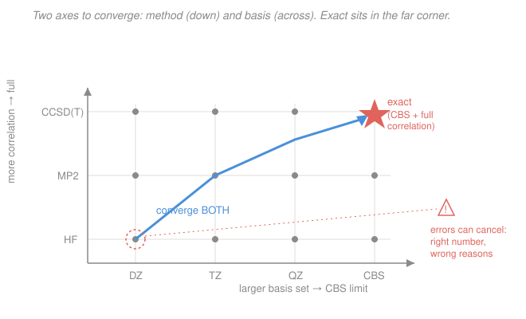

# Quantum Chemistry · Lesson 4.4: Reading a Calculation Critically

> ⏱ ~15 min · Module 4: Computational Chemistry and Spectroscopy · Builds on: [4.1](04-01-pes-geometry-optimization.md), [4.2](04-02-vibrational-frequencies.md), [4.3](04-03-electronic-spectra.md), [2.5](02-05-basis-sets.md), [3.3](03-03-moller-plesset-mp2.md), [3.4](03-04-coupled-cluster-taste.md), [3.5](03-05-dft-hohenberg-kohn.md), [3.6](03-06-dft-kohn-sham.md) · Unlocks: the course closes here — you leave able to run a calculation *and* decide whether to believe it

## Why this matters

Any package will hand you a number to eight decimals. The skill that separates a chemist from a button-pusher is knowing which of those decimals are real. A published "the barrier is 14.2 kcal/mol" is a claim with two independent knobs behind it — the **method** and the **basis set** — and either can be wrong by more than 14.2. Worse, they can be wrong in *opposite* directions and cancel, handing you a right answer for entirely wrong reasons that collapses the moment you change the molecule. This final lesson is the working judgment: how to trust, distrust, error-bar, and sanity-check a computed result — everything from Modules 1–3 pointed at that decision.

## The idea

Think of every energy you compute as a point on a grid with two axes (the [Picture](#picture)). One axis is the **method**: how much electron correlation you recover — Hartree–Fock at the bottom (none), then MP2, then CCSD(T) near the top. The other axis is the **basis set**: how flexible your orbital expansion is — a small double-zeta, then triple-, quadruple-zeta, reaching for the complete-basis-set (CBS) limit. The one true answer lives in the far corner: full correlation *and* the CBS limit. Your calculation sits somewhere inside the grid, and its error is the distance to that corner **along both axes**.

The trap: improving only one axis doesn't get you there. A gorgeous CCSD(T) with a tiny basis is still far from the corner; a huge basis on bare Hartree–Fock is too. You must push both. And because the two errors have signs, a method that overbinds paired with a basis that underbinds can land you on the right answer by luck. That's why chemists lean on **established method/basis pairings** benchmarked against experiment or high-level references, quote **relative** energies rather than absolute ones, and never trust a single number without a reason it should be trustworthy.

## The formal version

**The two-axis error decomposition.** For a target property $P$ (an energy, a barrier, a bond length), write the error of an approximate calculation as

$$P_{\text{calc}} - P_{\text{exact}} \;=\; \underbrace{\big(P_{\text{calc}} - P_{\text{CBS}}^{\text{method}}\big)}_{\text{basis-set error}} \;+\; \underbrace{\big(P_{\text{CBS}}^{\text{method}} - P_{\text{exact}}\big)}_{\text{method error}}.$$

*In words: total error = (distance to the complete-basis limit for your method) + (distance from that limit to the true answer). The first shrinks with bigger basis sets; the second shrinks with better correlation treatment.* The two are **not** independent — correlation energy is far more basis-hungry than the Hartree–Fock energy, so a correlated method demands a larger basis than HF does to reach *its* limit.

**The method axis** (increasing cost and, for single-reference problems, accuracy):

$$\text{HF} \;<\; \text{MP2} \;<\; \text{CCSD} \;<\; \text{CCSD(T)} \quad(\text{the "gold standard"}).$$

DFT sits off to the side: its accuracy depends on the **functional**, not on a systematic ladder, so "better" is empirical, not guaranteed — a hybrid like B3LYP or $\omega$B97X-D is usually good, but there is no knob you can turn to reach the exact answer ([3.5](03-05-dft-hohenberg-kohn.md), [3.6](03-06-dft-kohn-sham.md)). All of these are **single-reference** methods, built on one dominant Hartree–Fock determinant. When a system has **static correlation** — stretched bonds, diradicals, some transition metals, where two or more configurations matter comparably ([3.1](03-01-correlation-problem.md)) — single-reference methods fail no matter how good, and you need a multireference treatment. *In words: pick the method for the physics; a single-reference method on a multireference problem is the wrong tool, not a small error.*

**The basis axis.** Correlation-consistent sets are designed to converge smoothly, cc-pVXZ for $X = \text{D}, \text{T}, \text{Q}, \dots$, so correlation energy extrapolates toward the CBS limit roughly as

$$E_X \approx E_{\text{CBS}} + A\,X^{-3},$$

letting you estimate the corner from two finite calculations ([2.5](02-05-basis-sets.md)). Two basis pitfalls to name: **anions and weak interactions need diffuse functions** (the "aug-" prefix) because their density spreads far from the nuclei; and comparing a complex to its fragments incurs **basis-set superposition error (BSSE)** — each fragment "borrows" the other's basis functions and looks artificially stabilized. The counterpoise correction removes it. *In words: too small a basis makes anions and intermolecular bonds look wrong, and finite basis sets fake a bit of extra binding whenever fragments share them.*

**Error cancellation, used on purpose.** Absolute total energies are enormous and their errors large; **relative** energies (a barrier, a reaction energy) subtract most of that error away because the same imperfect method/basis is applied to both sides. A reaction designed so that the *number and type of bonds* is conserved on each side — **isodesmic** — or so that the *number of unpaired electrons* is conserved — **isogyric** — makes the leftover errors nearly identical and cancel almost completely. That's cancellation exploited by design, not by luck.

**From electronic energy to free energy.** A single-point calculation gives $E_{\text{elec}}$, the electronic energy at fixed nuclei — not something you can compare to a measured $\Delta H$ or $\Delta G$. You must add the corrections that the harmonic frequencies of [4.2](04-02-vibrational-frequencies.md) provide:

$$E_0 = E_{\text{elec}} + \underbrace{\tfrac12\!\sum_i h\nu_i}_{\text{ZPE}}, \qquad H(T) = E_0 + \underbrace{E_{\text{trans}} + E_{\text{rot}} + E_{\text{vib}}(T) + RT}_{\text{thermal corrections}}, \qquad G(T) = H(T) - T S(T).$$

*In words: add zero-point vibrational energy to get the energy at 0 K; add thermal population of translation, rotation, and vibration (plus $RT$ for $pV$) to reach the enthalpy at temperature $T$; then subtract $TS$, with the entropy $S$ again built from those frequencies via the partition functions, to reach the Gibbs free energy.* Every piece past $E_{\text{elec}}$ rides on the vibrational analysis — which is only valid at a genuine minimum (all real frequencies).

## Picture

## Worked examples

**Example 1 (mechanical — read the label).** You're handed two barrier heights: one from **B3LYP/6-31G(d)**, one from **CCSD(T)/cc-pVTZ**. Which do you trust, and what would you improve first?

Read each label as *method / basis*. CCSD(T) is the gold-standard single-reference method; cc-pVTZ is a solid triple-zeta basis — this result is strong on **both** axes, and you'd improve it by extrapolating the basis toward CBS (cc-pVQZ, then the $X^{-3}$ fit). B3LYP/6-31G(d) is weak on both: B3LYP is an older functional lacking a dispersion correction, and 6-31G(d) is a small double-zeta with no diffuse functions. Its dominant, most improvable error is the **basis** (jump to at least a triple-zeta, add "aug-" if anions or weak interactions are present); its method error you can only address by switching functionals or going to a wavefunction method. Verdict: trust the CCSD(T)/cc-pVTZ number; treat the B3LYP/6-31G(d) as a cheap first pass.

**Example 2 (why you'd care — cancellation you can bank on).** You want a reaction energy, and you've arranged the reaction to be **isodesmic**: each side has the same count of C–C and C–H bonds (a bond is *swapped between partners*, never made or broken). Compute every species at the *same* modest level, say MP2/cc-pVDZ. Each absolute energy carries a large basis error, but because the bond inventory is identical on both sides, those per-bond errors subtract out almost exactly, and the reaction energy comes out close to a far more expensive CCSD(T)/CBS value. Change the reaction to a **non**-isodesmic one (a bond is broken, not swapped) and that protection vanishes — the leftover errors no longer match, and the same MP2/cc-pVDZ number can be off by many kcal/mol. The lesson: *what cancels is what you can trust cheaply.*

## Watch out

- **You might think good agreement with experiment means your calculation is good.** Not necessarily — a too-small basis (underbinds) and a method that overbinds can cancel, so B3LYP/6-31G(d) sometimes "nails" a number that CCSD(T)/cc-pVTZ, closer to the truth on both axes, gets slightly differently. Agreement for the *wrong reasons* fails the moment you change system or property. Trust benchmarked pairings and convergence, not a single lucky match.
- **You might read a small imaginary frequency as roundoff.** An imaginary (reported as negative) frequency at a claimed minimum means you're at a **saddle point**, not a minimum ([4.1](04-01-pes-geometry-optimization.md)) — the Hessian has a negative eigenvalue. One imaginary frequency is a transition state; a "minimum" with any is not converged. Follow the imaginary mode downhill and re-optimize. Only an all-real-frequency structure earns the thermochemistry of [4.2](04-02-vibrational-frequencies.md).
- **You might over-interpret orbital energies.** Kohn–Sham eigenvalues are not ionization potentials (only the HF HOMO approximates one, via Koopmans, and even that crudely); orbital *shapes* and energies are qualitative aids, not observables. Report energies and densities, not eigenvalue arithmetic.
- **You might trust an SCF or geometry that hasn't converged.** A non-converged SCF or a geometry stopped before the gradient is small gives a number on no part of the real surface. Check that convergence criteria were actually met before reading anything off the output.

## One-liner

> Every computed energy is a point on a method-by-basis grid; trust it only when both axes are converged, the pairing is benchmarked, and — for anything you'll compare to experiment — the frequencies are real and the ZPE/thermal/entropy corrections are in.

## Problems

**P1 (🟢)** You have three calculations of the same atomization energy: (a) HF/cc-pVTZ, (b) MP2/cc-pVDZ, (c) CCSD(T)/cc-pVQZ. Rank them by expected reliability, and for the *least* reliable name the single error axis you'd improve first.

**P2 (🟡)** A collaborator reports "an optimized minimum of the anion $\ce{FCH2CO2-}$ at MP2/6-31G(d), with one vibrational frequency of $-180\ \mathrm{cm^{-1}}$." Name two independent red flags in that one sentence and give the fix for each.

**P3 (🔴)** You have $E_{\text{elec}}$ for reactant and product of a unimolecular isomerization and want $\Delta G$ at 298 K. Outline every quantity you must add to each species' $E_{\text{elec}}$ and where each comes from, and explain why the *relative* $\Delta G$ can be trustworthy even if each absolute energy carries a large error.

Solutions

**P1** Rank by how far each sits from the "full correlation + CBS" corner on **both** axes.

- (c) **CCSD(T)/cc-pVQZ** — best method (gold standard) and a large basis: closest to the corner on both axes. Most reliable.
- (b) **MP2/cc-pVDZ** — decent method (recovers dynamic correlation) but a small double-zeta basis; and correlation is basis-hungry, so cc-pVDZ is especially inadequate *for MP2*. Middle.
- (a) **HF/cc-pVTZ** — a good basis wasted on a method that recovers **zero** correlation energy; atomization energies depend heavily on correlation, so HF is systematically far off no matter the basis. Least reliable.

For (a), the limiting axis is the **method**: improve correlation (go to MP2/CCSD(T)); enlarging the basis further does almost nothing because HF has already nearly reached its own (wrong) CBS limit. Ranking: (c) > (b) > (a).

**P2** Two independent problems in one sentence:

1. **A minimum cannot have an imaginary frequency.** The reported $-180\ \mathrm{cm^{-1}}$ (negative = imaginary) means the structure is a **saddle point**, not a minimum — the Hessian has a negative eigenvalue ([4.1](04-01-pes-geometry-optimization.md)). *Fix:* displace along that imaginary mode and re-optimize until all frequencies are real; only then is it a minimum and only then are ZPE/thermal corrections meaningful.
2. **6-31G(d) has no diffuse functions, and this is an anion.** Anionic density spreads far from the nuclei; without diffuse ("+"/"aug-") functions the extra electron is described poorly, giving unreliable geometry and energy. *Fix:* use a basis with diffuse functions, e.g. 6-31+G(d) or aug-cc-pVDZ, and re-optimize.

(A fair third: MP2 geometry + small basis is a modest level overall — but the two above are the load-bearing red flags.)

**P3** Build $G(298\,\text{K})$ for **each** species from its $E_{\text{elec}}$, then subtract.

*Pieces to add to each $E_{\text{elec}}$* (all from a frequency calculation at that species' optimized minimum, [4.2](04-02-vibrational-frequencies.md)):
- **Zero-point energy** $\tfrac12\sum_i h\nu_i$ → gives $E_0$, the energy at 0 K. (Requires all real frequencies.)
- **Thermal corrections** to enthalpy: populate translation ($\tfrac32RT$), rotation ($\tfrac32RT$ nonlinear, $RT$ linear), and vibration $E_{\text{vib}}(T)$ from the harmonic partition function, plus $RT$ for the $pV$ term → gives $H(298)$.
- **Entropy** $S(298)$ from the translational, rotational, and vibrational partition functions → subtract $TS$ to get $G(298) = H - TS$.

Then $\Delta G = G_{\text{product}} - G_{\text{reactant}}$.

*Why the relative number survives large absolute errors:* each absolute $E_{\text{elec}}$ is huge and carries a large method+basis error, but reactant and product are computed at the **same** level, and in an isomerization the two share the same atoms and largely the same bonding environment. Subtracting cancels the bulk of the correlated systematic error — the leftover is the small *difference* in errors between two similar structures. So $\Delta G$ can be reliable to a couple of kcal/mol even though neither absolute energy is trustworthy to hundreds. (This is the isodesmic/isogyric idea in miniature: conserve as much bonding as possible across the comparison and the errors cancel.)

## Flashback

**From Lesson 4.2 (Vibrational frequencies):** A geometry optimization on a linear triatomic is followed by a frequency calculation that returns, in $\mathrm{cm^{-1}}$: $-95,\ 610,\ 610,\ 1340,\ 2350$. (i) Is this structure a minimum, a transition state, or neither? (ii) How many vibrational frequencies *should* a linear triatomic have, and does the count check out? (Fresh variant — different numbers than the lesson.)

Solution

(i) One frequency is **imaginary** (the $-95$, reported negative). Exactly one imaginary frequency means the Hessian has exactly one negative eigenvalue — a **first-order saddle point**, i.e. a **transition state**, not a minimum. To use it as a minimum you'd follow the imaginary mode downhill and re-optimize until all frequencies are real.

(ii) A molecule of $N$ atoms has $3N$ coordinates; subtract 3 translations and — for a **linear** molecule — only **2** rotations (rotation about the molecular axis is not a degree of freedom), leaving $3N-5$ vibrations. For $N=3$: $3(3)-5 = 4$ vibrational frequencies. The list has five entries, but one ($-95$) is the reaction coordinate at the saddle, not a bound vibration; the four genuine vibrations are $610, 610, 1340, 2350$ (the doubly-degenerate $610$ is the bend). The count checks out.

*Check.* A nonlinear triatomic would instead have $3N-6 = 3$ vibrations — so the "linear vs. bent" distinction changes the expected count, exactly the bookkeeping [4.2](04-02-vibrational-frequencies.md) uses before trusting any thermochemistry.

## Connections

- **Backward:** this lesson is where every earlier module pays off — the method ladder from the correlation problem ([3.1](03-01-correlation-problem.md)), MP2 ([3.3](03-03-moller-plesset-mp2.md)) and CCSD(T) ([3.4](03-04-coupled-cluster-taste.md)), DFT functionals ([3.5](03-05-dft-hohenberg-kohn.md), [3.6](03-06-dft-kohn-sham.md)), basis-set convergence and BSSE ([2.5](02-05-basis-sets.md)), stationary points ([4.1](04-01-pes-geometry-optimization.md)), and the frequencies that build thermochemistry ([4.2](04-02-vibrational-frequencies.md)).
- **Forward (research use):** this is the course's exit. The judgment here — converge both axes, use benchmarked method/basis pairings, quote relative energies with honest error bars, sanity-check spin state and frequencies — is exactly what you bring to reading a computational paper or running your own study. The natural next steps beyond this course are multireference methods (CASSCF/CASPT2) for the static-correlation problems single-reference theory can't touch, and explicitly-correlated (F12) methods that reach the basis limit faster.
- **Sideways:** the free-energy machinery here is the bridge to physical chemistry — the ZPE, thermal, and entropy corrections come from the same molecular partition functions behind [physical chemistry's molecular energy levels](../../physical-chemistry/lessons/04-03-molecular-energy-levels-box-oscillator-rotor.md), and the resulting $G(T)$ is the [Gibbs energy](../../physical-chemistry/lessons/01-03-gibbs-helmholtz-energies.md) that decides which way a reaction runs. Computed spectra ([4.3](04-03-electronic-spectra.md)) meet experiment in [electronic spectroscopy](../../physical-chemistry/lessons/04-06-electronic-spectroscopy.md). The variational and perturbation foundations that started it all live in [quantum mechanics](../../quantum-mechanics/syllabus.md).

---

*Course wrap-up.* You have traced the whole arc of electronic-structure theory. Module 1 laid the **foundations** — the variational and perturbation principles, the Born–Oppenheimer separation, and the first molecular orbital in $\ce{H2+}$. Module 2 built **Hartree–Fock**: antisymmetry and Slater determinants, the self-consistent field, the Roothaan–Hall matrix machinery, and the basis sets that make it computable. Module 3 confronted what HF misses — **electron correlation** — through configuration interaction, Møller–Plesset, coupled cluster, and the entirely different route of density-functional theory. Module 4 put it all to work: **running real calculations** on potential energy surfaces, extracting vibrational and electronic spectra, and — in this lesson — reading the numbers critically. You can now not only produce a computed energy but decide, with reasons, whether to believe it. That judgment is the whole point.
