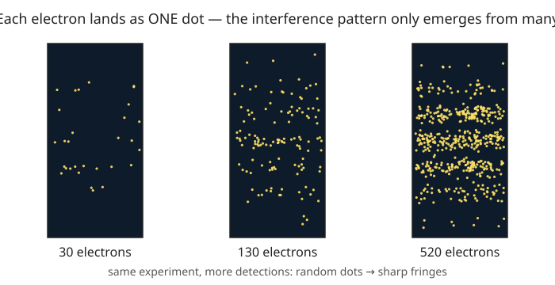

# Quantum Mechanics · Lesson 1.1: Why quantum — the experiments that break classical physics

> ⏱ ~15 min · Module 1: The quantum framework · Builds on: [`linalg-refresher`](#/course/linalg-refresher), [`analytical-mechanics`](#/course/analytical-mechanics) · Unlocks: [1.2 The wavefunction and the Born rule](#/lesson/quantum-mechanics/01-02-wavefunction-born-rule.md)

## Why this matters

Around 1900, classical physics was a finished cathedral: Newton's mechanics, Maxwell's electromagnetism, Boltzmann's statistical mechanics. Then a handful of experiments — a glowing oven, a metal plate under light, electrons fired at a screen, and the plain fact that atoms *exist* — each returned an answer the cathedral could not produce. Not a small numerical discrepancy: a qualitative, order-of-magnitude, "this should be impossible" failure. Quantum mechanics is the theory built to answer exactly these four. This lesson is the case for the prosecution — what classical physics predicts, why it's wrong, and the single new idea (**energy and action come in discrete lumps**) that fixes all four at once. Everything formal in the rest of the course exists to make that idea precise.

## The idea

One thread runs through every anomaly: **things classical physics treats as smoothly continuous are actually granular.** Light energy, an electron's arrival, an atom's allowed orbits — all come in discrete units, set by a tiny new constant of nature,

$$h = 6.626\times10^{-34}\ \text{J·s}, \qquad \hbar \equiv \frac{h}{2\pi} = 1.055\times10^{-34}\ \text{J·s}.$$

$h$ is **Planck's constant**; $\hbar$ ("h-bar") is the same constant per radian, and it's the version that shows up everywhere in quantum mechanics. Its units, joule-seconds, are units of *action* (energy × time, or momentum × distance) — the same quantity that was minimized in the Lagrangian mechanics you saw in `analytical-mechanics`. The whole quantum revolution is the discovery that action is quantized in units of $h$.

Because $h$ is so absurdly small, the graininess is invisible at human scale — a thrown baseball's "lumps" are $10^{34}$ times finer than anything you could notice, so it looks perfectly classical. But shrink to atoms and photons, where a single lump is the whole story, and the granularity takes over completely.

## The formal version

**1. Blackbody radiation and the ultraviolet catastrophe.** A hot cavity radiates a spectrum of light. Treating each electromagnetic mode as a classical oscillator sharing energy $k_B T$ ($k_B$ = Boltzmann's constant, $T$ = temperature) gives the **Rayleigh–Jeans law**, with energy density per frequency $\nu$

$$u(\nu)\,\propto\, \nu^2\, k_B T.$$

*In words:* every mode gets the same energy, and there are more and more high-frequency modes, so the predicted energy **diverges** as $\nu\to\infty$ — a hot oven would emit infinite ultraviolet power. Planck's fix (1900): a mode of frequency $\nu$ (angular frequency $\omega = 2\pi\nu$) can only hold energy in whole multiples,

$$E_n = n\hbar\omega = n h\nu, \qquad n = 0,1,2,\dots$$

*In words:* a high-frequency mode needs a big minimum quantum $\hbar\omega$ just to turn on, so at temperature $T$ it's usually frozen out — killing the divergence and reproducing the observed spectrum exactly.

**2. The photoelectric effect.** Light on a metal ejects electrons. Classically, brighter light (bigger wave amplitude) should eject faster electrons, and any color should work if you wait. Experiment says otherwise: electron energy depends on **frequency, not intensity**, and below a threshold frequency *nothing* comes out. Einstein (1905): light itself is quantized into **photons** of energy

$$E = \hbar\omega = h\nu, \qquad K_{\max} = h\nu - W.$$

*In words:* one photon knocks out one electron; the electron leaves with the photon's energy minus the **work function** $W$ (the cost to escape the metal). Measure it by finding the **stopping voltage** $V_0$ that just halts the fastest electrons: $eV_0 = h\nu - W$. Plot $V_0$ vs $\nu$ and the slope is $h/e$ — Planck's constant, read straight off a metal plate.

**3. Wave–particle duality (the double slit).** Fire electrons one at a time at a double slit. Each hits the screen as a single localized dot — a particle. But let thousands accumulate and the dots pile up into **interference fringes** — a wave. No classical object does both. De Broglie (1924) unified it: *every* particle has a wavelength

$$\lambda = \frac{h}{p},$$

where $p$ is momentum. *In words:* momentum and wavelength are the same information in different clothes; the electron interferes with itself because it propagates as a wave of wavelength $h/p$ but registers as a particle when detected.

**4. Atomic stability.** In Rutherford's atom an electron orbits the nucleus. But an orbiting charge accelerates, and Maxwell says an accelerating charge **radiates** energy. The electron should spiral into the nucleus in about $10^{-11}$ s (P3 makes this quantitative). Classically, atoms cannot exist. Bohr (1913): only special orbits with quantized angular momentum are allowed, giving discrete energy levels

$$E_n = -\frac{13.6\ \text{eV}}{n^2}, \qquad n = 1,2,3,\dots$$

*In words:* there's a lowest rung ($n=1$) with nowhere lower to fall, so the atom is stable; electrons jump between rungs by absorbing or emitting a photon of exactly $\hbar\omega = E_{n'} - E_n$ — which is why atoms emit sharp spectral lines, not a continuous smear.

## Picture

Each panel is the same experiment run longer. On the left, 30 electrons look like random specks — every electron arrives as a particle, one dot, unpredictable. As detections accumulate (middle, right), the dots organize into bright and dark bands: the interference pattern was always there, encoded as the *probability* of where each single electron lands. That probability is what the wavefunction, next lesson, will compute.

## Worked examples

**Example 1 (photon energy — the currency of light).** A red photon has wavelength $\lambda = 650$ nm. Its frequency is $\nu = c/\lambda$, so its energy is

$$E = h\nu = \frac{hc}{\lambda} = \frac{(6.626\times10^{-34})(3.00\times10^8)}{650\times10^{-9}} = 3.06\times10^{-19}\ \text{J} = 1.91\ \text{eV}.$$

A handy shortcut worth memorizing: $E(\text{eV}) = 1240 / \lambda(\text{nm})$. Check: $1240/650 = 1.91$ eV. ✓ So visible light runs about 1.6–3.3 eV per photon — conveniently the scale of atomic energy-level gaps, which is *why* atoms interact with visible light at all.

**Example 2 (why brighter isn't enough).** Shine 400 nm light (photon energy $1240/400 = 3.10$ eV) on a metal with work function $W = 2.3$ eV. Each photon ejects an electron with $K_{\max} = 3.10 - 2.3 = 0.80$ eV, stopped by $V_0 = 0.80$ V. Now double the intensity: *twice as many* electrons come out, but each still has $K_{\max} = 0.80$ eV — the stopping voltage doesn't budge. Switch to 600 nm light ($1240/600 = 2.07$ eV $<$ $W$): the beam can be blindingly bright and **zero** electrons emerge, because no single photon carries enough energy. This is the fingerprint of quantization — energy delivered in indivisible lumps, not as a continuously adjustable wave amplitude.

## Watch out

- You might think intensity controls electron energy in the photoelectric effect. It doesn't: **frequency** sets each electron's energy ($K_{\max}=h\nu-W$); intensity only sets the *number* of electrons. This split — energy from frequency, count from intensity — is the whole classical/quantum divide.
- You might think "wave–particle duality" means the electron is somehow a wave *and* a particle at every instant. Better: it **propagates** like a wave (amplitudes that interfere) but is always **detected** as a whole particle (one dot). Crucially, if you measure *which slit* it went through, the interference pattern vanishes — the wave behavior requires the paths to remain indistinguishable.
- You might think quantum effects are simply "absent" for big objects. They're not absent, just unresolvably small: $\lambda = h/p$ is real for a baseball too (P2), it's just $10^{-34}$ m — smaller than any aperture, so nothing diffracts it. Classical physics is the large-$p$, tiny-$\lambda$ limit of this same picture.

## One-liner

> Classical physics fails wherever a single quantum of action $h$ matters, and quantization — light in photons $E=\hbar\omega$, matter as waves $\lambda=h/p$, atoms in discrete energy levels — is what repairs every failure.

## Problems

**P1 (🟢)** A green photon has wavelength $\lambda = 500$ nm. Find its energy in joules and in electron-volts.

**P2 (🟡)** Compute the de Broglie wavelength of (a) an electron accelerated through 100 V, so its kinetic energy is $100$ eV, and (b) a $0.145$ kg baseball thrown at $40$ m/s. Use the results to explain in one sentence why diffraction is routine for electrons but never observed for baseballs. ($m_e = 9.11\times10^{-31}$ kg.)

**P3 (🔴, optional)** *The classical atom's death, quantified.* A classical electron in a circular orbit of radius $r$ radiates power given by the Larmor formula $P = \dfrac{e^2 a^2}{6\pi\varepsilon_0 c^3}$, where $a$ is its acceleration. Using the Coulomb force for the orbit, show the collapse time from the Bohr radius $r_0 = 5.29\times10^{-11}$ m down to the nucleus is
$$T = \frac{r_0^3\, c^3\, m_e^2}{4\,(k e^2)^2}, \qquad k=\frac{1}{4\pi\varepsilon_0},$$
and evaluate it. (Use $ke^2 = 2.31\times10^{-28}$ J·m, $m_e = 9.11\times10^{-31}$ kg, $c = 3.00\times10^8$ m/s.) This number is the reason the classical atom is impossible.

Solutions

**P1** Energy of a photon is $E = hc/\lambda$:
$$E = \frac{(6.626\times10^{-34})(3.00\times10^8)}{500\times10^{-9}} = 3.97\times10^{-19}\ \text{J}.$$
Convert with $1\ \text{eV} = 1.602\times10^{-19}$ J: $E = 3.97\times10^{-19}/1.602\times10^{-19} = 2.48$ eV. (Shortcut check: $1240/500 = 2.48$ eV. ✓)

**P2** Use $\lambda = h/p$.

(a) Electron. Kinetic energy $K = 100\ \text{eV} = 100 \times 1.602\times10^{-19} = 1.602\times10^{-17}$ J. For a nonrelativistic particle $p = \sqrt{2m_e K}$:
$$p = \sqrt{2(9.11\times10^{-31})(1.602\times10^{-17})} = \sqrt{2.92\times10^{-47}} = 5.40\times10^{-24}\ \text{kg·m/s},$$
$$\lambda = \frac{6.626\times10^{-34}}{5.40\times10^{-24}} = 1.23\times10^{-10}\ \text{m} = 0.123\ \text{nm} \approx 1.2\ \text{Å}.$$
That's the spacing between atoms in a crystal — which is exactly why electron diffraction off crystals (Davisson–Germer) works.

(b) Baseball. $p = mv = (0.145)(40) = 5.8$ kg·m/s, so
$$\lambda = \frac{6.626\times10^{-34}}{5.8} = 1.1\times10^{-34}\ \text{m}.$$

*One sentence:* the electron's wavelength ($\sim 10^{-10}$ m) matches atomic spacings, so crystals act as a diffraction grating for it, while the baseball's ($\sim10^{-34}$ m) is 34 orders of magnitude smaller than any physical opening, so there is nothing in the universe fine enough to diffract it.

**P3** Set up the circular orbit. Coulomb force provides the centripetal force:
$$\frac{ke^2}{r^2} = \frac{m_e v^2}{r} \;\Rightarrow\; v^2 = \frac{ke^2}{m_e r}, \qquad a = \frac{v^2}{r} = \frac{ke^2}{m_e r^2}.$$
The orbit's total energy (kinetic $+$ potential) is $E = \tfrac12 m_e v^2 - \dfrac{ke^2}{r} = -\dfrac{ke^2}{2r}$, so
$$\frac{dE}{dt} = \frac{ke^2}{2r^2}\frac{dr}{dt}.$$
Energy is lost at the Larmor rate $\dfrac{dE}{dt} = -P = -\dfrac{e^2 a^2}{6\pi\varepsilon_0 c^3} = -\dfrac{2}{3}\dfrac{k\,e^2 a^2}{c^3}$ (using $\tfrac{1}{6\pi\varepsilon_0} = \tfrac23 k$). Substitute $a = ke^2/(m_e r^2)$:
$$-P = -\frac{2}{3}\frac{k e^2}{c^3}\cdot\frac{k^2 e^4}{m_e^2 r^4} = -\frac{2}{3}\frac{k^3 e^6}{c^3 m_e^2 r^4}.$$
Equate the two expressions for $dE/dt$ and solve for $dr/dt$:
$$\frac{ke^2}{2r^2}\frac{dr}{dt} = -\frac{2}{3}\frac{k^3 e^6}{c^3 m_e^2 r^4} \;\Rightarrow\; \frac{dr}{dt} = -\frac{4}{3}\frac{k^2 e^4}{c^3 m_e^2 r^2}.$$
Separate and integrate from $r_0$ to $0$ (let $C = \tfrac43 k^2 e^4/(c^3 m_e^2)$):
$$\int_{r_0}^{0} r^2\,dr = -C\int_0^T dt \;\Rightarrow\; -\frac{r_0^3}{3} = -C\,T \;\Rightarrow\; T = \frac{r_0^3}{3C} = \frac{r_0^3\, c^3\, m_e^2}{4\,(ke^2)^2}.$$
Now the number. $(ke^2)^2 = (2.31\times10^{-28})^2 = 5.34\times10^{-56}$; $r_0^3 = (5.29\times10^{-11})^3 = 1.48\times10^{-31}$; $c^3 = 2.70\times10^{25}$; $m_e^2 = 8.30\times10^{-61}$. Then
$$T = \frac{(1.48\times10^{-31})(2.70\times10^{25})(8.30\times10^{-61})}{4(5.34\times10^{-56})} = \frac{3.32\times10^{-66}}{2.14\times10^{-55}} \approx 1.6\times10^{-11}\ \text{s}.$$
Sixteen picoseconds. A classical atom would implode almost instantly — the flat, unshakable failure that Bohr's quantized orbits (lowest rung, nothing below it) exist to repair.

## Connections

- **Backward:** the "action in units of $h$" theme lands directly on `analytical-mechanics` — the same action integral you extremized there is what's quantized here, and the Hamiltonian will return in [2.1 The Schrödinger equation](#/lesson/quantum-mechanics/02-01-schrodinger-equation.md) as the operator generating time evolution. The linear-algebra machinery of `linalg-refresher` (vectors, eigenvalues, Hermitian operators) is the language the next four lessons recast all of this into.
- **Forward:** [1.2 The wavefunction and the Born rule](#/lesson/quantum-mechanics/01-02-wavefunction-born-rule.md) makes the double-slit "probability of landing here" precise — the fringe pattern in the Picture is $|\psi|^2$. De Broglie's $\lambda = h/p$ becomes the plane wave $e^{ipx/\hbar}$ and, superposed, the wave packets of Module 2.
- **Sideways:** the frequency–energy link $E = \hbar\omega$ and the momentum–wavenumber link $p = \hbar k$ are a Fourier duality between time/space and energy/momentum — the same transform pair that will power wave packets, the uncertainty principle, and (in `complex-analysis`) contour methods for propagators.
