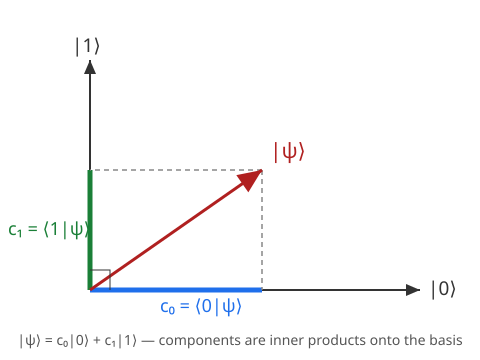

# Quantum Mechanics · Lesson 1.3: Hilbert space and Dirac notation

> ⏱ ~15 min · Module 1: The quantum framework · Builds on: [1.2 The wavefunction and the Born rule](#/lesson/quantum-mechanics/01-02-wavefunction-born-rule.md), inner-product spaces from `linalg-refresher` · Unlocks: [1.4 Observables as Hermitian operators](#/lesson/quantum-mechanics/01-04-observables-hermitian-operators.md)

## Why this matters

In 1.2 a quantum state was a function $\psi(x)$ — a probability amplitude over positions. That's true but parochial: it hard-codes one particular question ("where is the particle?"). The deeper truth is that $\psi$ is a **vector in an abstract space**, and $\psi(x)$ is merely its list of components in *one* basis (the position basis), no more fundamental than writing a geometric vector as $(v_x, v_y, v_z)$. Once you see states as vectors, every tool from linear algebra — inner products, orthonormal bases, expansion in components, changes of basis — becomes quantum mechanics. Dirac's bra–ket notation is the compact bookkeeping that makes this whole viewpoint effortless. Master it here and the rest of the course is linear algebra with physical clothes on.

## The idea

Think of a quantum state as an arrow in a (possibly infinite-dimensional, complex) vector space. Everything you know about ordinary vectors carries over:

- You can **add** states and **scale** them by (complex) numbers — that's superposition.
- There's an **inner product** $\langle\phi|\psi\rangle$ that measures overlap, exactly like the dot product measures how aligned two arrows are. Its size tells you "how much of $\phi$ is inside $\psi$."
- You can pick an **orthonormal basis** — a set of mutually perpendicular unit-length reference arrows $\{|n\rangle\}$ — and write any state as a weighted sum of them. Those weights are the components.

The wavefunction $\psi(x)$ is just the component of $|\psi\rangle$ along the basis arrow $|x\rangle$ "particle is exactly at $x$." Choose the energy basis instead and the same state has different components; the arrow hasn't moved, only the coordinate system did. Dirac notation gives the arrow its own symbol $|\psi\rangle$ — the **ket** — so we can talk about the state *before* committing to any coordinates.

## The formal version

**State space.** Quantum states of a system live in a **Hilbert space** $\mathcal H$: a complex vector space equipped with an inner product, and complete (Cauchy sequences converge — the technical clause that lets infinite sums behave). Physical states are the nonzero vectors, written as **kets** $|\psi\rangle \in \mathcal H$.

*In words:* the arena of quantum mechanics is a complex vector space with a notion of overlap.

**Bras and the inner product.** To every ket $|\psi\rangle$ there corresponds a **bra** $\langle\psi|$, a linear map that eats a ket and returns a complex number. The pairing is the **inner product** $\langle\phi|\psi\rangle \in \mathbb C$, obeying

$$\langle\phi|\psi\rangle = \langle\psi|\phi\rangle^*, \qquad \langle\phi|\,(\,a|\psi_1\rangle + b|\psi_2\rangle\,) = a\langle\phi|\psi_1\rangle + b\langle\phi|\psi_2\rangle,$$

with $a,b \in \mathbb C$ and $*$ complex conjugation. The first rule forces **antilinearity in the bra slot**: $(\,a|\phi_1\rangle+b|\phi_2\rangle\,)$ turns into the bra $a^*\langle\phi_1| + b^*\langle\phi_2|$.

*In words:* the inner product is linear in the ket, conjugate-symmetric, and therefore antilinear (conjugate the scalars) in the bra — the complex upgrade of the real dot product's symmetry.

**Norm and normalization.** The **norm** is $\|\psi\| = \sqrt{\langle\psi|\psi\rangle}$, and conjugate symmetry guarantees $\langle\psi|\psi\rangle = \langle\psi|\psi\rangle^*$ is real and $\ge 0$. A physical state is **normalized**:

$$\langle\psi|\psi\rangle = 1.$$

*In words:* total probability is 1, now written as "the state is a unit vector." This is exactly $\int|\psi(x)|^2\,dx = 1$ from 1.2, dressed in bra–ket form.

**Orthonormal basis.** A set $\{|n\rangle\}$ is **orthonormal** if

$$\langle m|n\rangle = \delta_{mn} = \begin{cases}1 & m=n\\ 0 & m\ne n\end{cases},$$

and a **basis** if every state expands in it. Any $|\psi\rangle$ then decomposes as

$$|\psi\rangle = \sum_n c_n |n\rangle, \qquad c_n = \langle n|\psi\rangle.$$

*In words:* project the state onto each reference arrow to read off its component, then reassemble. The formula $c_n = \langle n|\psi\rangle$ falls out by hitting the sum with $\langle m|$ and using orthonormality: $\langle m|\psi\rangle = \sum_n c_n \langle m|n\rangle = \sum_n c_n \delta_{mn} = c_m$.

**Completeness (resolution of the identity).** Substituting $c_n = \langle n|\psi\rangle$ back into the expansion,

$$|\psi\rangle = \sum_n |n\rangle\langle n|\psi\rangle \quad\Longrightarrow\quad \boxed{\;\sum_n |n\rangle\langle n| = \mathbb 1\;}$$

where $\mathbb 1$ is the identity operator and each $|n\rangle\langle n|$ is the **projector** onto $|n\rangle$.

*In words:* the basis is complete when its projectors add up to "do nothing" — you can slot $\sum_n|n\rangle\langle n|$ into any expression for free, the single most-used trick in the whole subject.

**The position basis and the wavefunction.** Position has a *continuous* spectrum, so the basis $\{|x\rangle\}$ is labeled by a real number, sums become integrals, and the Kronecker delta becomes a Dirac delta:

$$\langle x|x'\rangle = \delta(x - x'), \qquad \int |x\rangle\langle x|\,dx = \mathbb 1, \qquad \psi(x) = \langle x|\psi\rangle.$$

*In words:* the wavefunction is literally the component of the abstract state $|\psi\rangle$ along the position eigenket $|x\rangle$. Normalization $\langle\psi|\psi\rangle = \int \langle\psi|x\rangle\langle x|\psi\rangle\,dx = \int |\psi(x)|^2 dx = 1$ recovers 1.2 by inserting completeness. (The $|x\rangle$ aren't normalizable states — $\langle x|x\rangle = \delta(0)$ is infinite — they're idealized reference directions, legal to use inside integrals.)

## Picture

A qubit — a two-state system with orthonormal basis $\{|0\rangle,|1\rangle\}$ — makes the geometry literal: the state $|\psi\rangle$ is an arrow, and its components $c_0,c_1$ are its shadows on the two basis axes.

The component along each axis is the inner product onto that basis vector, $c_n = \langle n|\psi\rangle$ — the exact quantum analogue of dropping a perpendicular to read a coordinate. Rotate to a different orthonormal pair and the arrow keeps its length ($\langle\psi|\psi\rangle=1$) while the shadows change.

## Worked examples

**Example 1 (mechanical — components and completeness in a qubit).** Let $|\psi\rangle = \tfrac{3}{5}|0\rangle + \tfrac{4i}{5}|1\rangle$ with $\{|0\rangle,|1\rangle\}$ orthonormal.

*Norm:* using antilinearity in the bra, $\langle\psi| = \tfrac{3}{5}\langle 0| - \tfrac{4i}{5}\langle 1|$ (note the conjugate on $i$), so

$$\langle\psi|\psi\rangle = \left(\tfrac{3}{5}\right)^2\langle0|0\rangle + \left(\tfrac{4}{5}\right)^2\langle1|1\rangle = \tfrac{9}{25}+\tfrac{16}{25} = 1. \checkmark$$

The cross terms died because $\langle0|1\rangle=\langle1|0\rangle=0$.

*Components:* $c_0 = \langle 0|\psi\rangle = \tfrac{3}{5}$ and $c_1 = \langle 1|\psi\rangle = \tfrac{4i}{5}$, read straight off the coefficients.

*Completeness check:* apply $\mathbb 1 = |0\rangle\langle0| + |1\rangle\langle1|$ to $|\psi\rangle$:

$$|0\rangle\langle0|\psi\rangle + |1\rangle\langle1|\psi\rangle = |0\rangle\!\left(\tfrac{3}{5}\right) + |1\rangle\!\left(\tfrac{4i}{5}\right) = |\psi\rangle. \checkmark$$

The projectors sorted the state into its two pieces and handed it back intact.

**Example 2 (why you'd care — the Born rule is "component squared").** By the Born rule, if $\{|n\rangle\}$ are the possible outcomes of some measurement, the probability of outcome $n$ is $P(n) = |c_n|^2 = |\langle n|\psi\rangle|^2$. For Example 1's state, measuring in the $\{|0\rangle,|1\rangle\}$ basis gives

$$P(0) = |c_0|^2 = \tfrac{9}{25}, \qquad P(1) = |c_1|^2 = \left|\tfrac{4i}{5}\right|^2 = \tfrac{16}{25},$$

and these sum to $1$ **because** the state is normalized and the basis complete:

$$\sum_n |c_n|^2 = \sum_n \langle\psi|n\rangle\langle n|\psi\rangle = \langle\psi|\Big(\sum_n|n\rangle\langle n|\Big)|\psi\rangle = \langle\psi|\mathbb 1|\psi\rangle = \langle\psi|\psi\rangle = 1.$$

So "probabilities sum to 1" is not a separate axiom — it's completeness plus normalization. This identity is the engine of P3 and of every measurement calculation from 1.5 onward.

## Watch out

- You might think $\langle\phi|\psi\rangle = \langle\psi|\phi\rangle$ like a real dot product, but in a complex space they're **conjugates**: $\langle\phi|\psi\rangle = \langle\psi|\phi\rangle^*$. They're equal only when the overlap is real. Swapping the order without conjugating is the single most common Dirac-notation error.
- You might think a state and its "phased" version $e^{i\theta}|\psi\rangle$ are different states. They give identical probabilities $|\langle n|\psi\rangle|^2$ for every measurement, so a **global phase is physically invisible** — normalization fixes length, not overall phase. (Relative phases *between* components, like the $i$ in Example 1, are very real.)
- You might think $|n\rangle\langle n|$ and $\langle n|n\rangle$ are the same object. $\langle n|n\rangle = 1$ is a **number** (bra-then-ket, inner product); $|n\rangle\langle n|$ is an **operator** (ket-then-bra, "outer product," a projector). Order of the vertical bars is everything.
- You might think $|x\rangle$ is an honest normalizable state. It isn't: $\langle x|x'\rangle = \delta(x-x')$ blows up on the diagonal. Treat position eigenkets only as reference directions living inside integrals, never as states a particle can actually occupy.

## One-liner

> A quantum state is a unit vector in a Hilbert space; the wavefunction is just its components in the position basis, and $\sum_n |n\rangle\langle n| = \mathbb 1$ lets you switch coordinates for free.

## Problems

**P1 (🟢)** A qubit is in the unnormalized state $|\psi\rangle = a|0\rangle + b|1\rangle$ with $\{|0\rangle,|1\rangle\}$ orthonormal and $a,b\in\mathbb C$. Find the normalization constant $N$ so that $N|\psi\rangle$ is normalized, and compute $\langle 0|\,(N|\psi\rangle)$. Then evaluate both for $a=1,\ b = i\sqrt{3}$.

**P2 (🟡)** With $\{|0\rangle,|1\rangle\}$ orthonormal, define the **rotated basis**
$$|+\rangle = \tfrac{1}{\sqrt2}\big(|0\rangle + |1\rangle\big), \qquad |-\rangle = \tfrac{1}{\sqrt2}\big(|0\rangle - |1\rangle\big).$$
(a) Verify $\{|+\rangle,|-\rangle\}$ is orthonormal. (b) Show it is complete by checking $|+\rangle\langle+| + |-\rangle\langle-| = \mathbb 1$ acts as the identity on the state $|\psi\rangle = \tfrac{3}{5}|0\rangle + \tfrac{4}{5}|1\rangle$. (c) Re-expand $|\psi\rangle$ in the $\{|+\rangle,|-\rangle\}$ basis and confirm the probabilities still sum to 1.

**P3 (🔴, optional)** *(Born probabilities are basis-consistent.)* Let $\{|n\rangle\}$ be any orthonormal basis and $|\psi\rangle$ a normalized state with components $c_n = \langle n|\psi\rangle$. Prove directly from orthonormality and completeness that $\sum_n |c_n|^2 = 1$, and that the same holds in *any* other orthonormal basis $\{|\tilde n\rangle\}$ — i.e. the total probability is 1 no matter which complete set of outcomes you measure. (This is why the Born rule is consistent: it doesn't privilege a basis.)

Solutions

**P1** Normalization requires $\langle\psi|\psi\rangle$ (unnormalized) computed first. With $\langle\psi| = a^*\langle0| + b^*\langle1|$ and orthonormality,
$$\langle\psi|\psi\rangle = |a|^2\langle0|0\rangle + |b|^2\langle1|1\rangle = |a|^2 + |b|^2.$$
So $N = \dfrac{1}{\sqrt{|a|^2+|b|^2}}$, and
$$\langle0|\,(N|\psi\rangle) = N\big(a\langle0|0\rangle + b\langle0|1\rangle\big) = \frac{a}{\sqrt{|a|^2+|b|^2}}.$$
For $a=1,\ b=i\sqrt3$: $|a|^2+|b|^2 = 1 + 3 = 4$, so $N = \tfrac12$ and $\langle0|(N|\psi\rangle) = \tfrac{1}{2}$. (Check the probabilities: $P(0) = \tfrac14$, $P(1) = |N b|^2 = |i\sqrt3/2|^2 = \tfrac34$, summing to 1. ✓)

**P2** (a) *Orthonormality.* Using $\langle m|n\rangle = \delta_{mn}$:
$$\langle+|+\rangle = \tfrac12(\langle0|+\langle1|)(|0\rangle+|1\rangle) = \tfrac12(1+0+0+1) = 1,$$
and identically $\langle-|-\rangle = \tfrac12(1 - 0 - 0 + 1) = 1$. Cross term:
$$\langle+|-\rangle = \tfrac12(\langle0|+\langle1|)(|0\rangle-|1\rangle) = \tfrac12(1 - 0 + 0 - 1) = 0. \checkmark$$

(b) *Completeness.* First get the components of $|\psi\rangle$ in the new basis:
$$\langle+|\psi\rangle = \tfrac{1}{\sqrt2}\big(\tfrac35 + \tfrac45\big) = \tfrac{7}{5\sqrt2}, \qquad \langle-|\psi\rangle = \tfrac{1}{\sqrt2}\big(\tfrac35 - \tfrac45\big) = -\tfrac{1}{5\sqrt2}.$$
Then
$$|+\rangle\langle+|\psi\rangle + |-\rangle\langle-|\psi\rangle = \tfrac{7}{5\sqrt2}|+\rangle - \tfrac{1}{5\sqrt2}|-\rangle.$$
Substitute the definitions of $|\pm\rangle$:
$$= \tfrac{7}{5\sqrt2}\cdot\tfrac{1}{\sqrt2}(|0\rangle+|1\rangle) - \tfrac{1}{5\sqrt2}\cdot\tfrac{1}{\sqrt2}(|0\rangle-|1\rangle) = \tfrac{7}{10}(|0\rangle+|1\rangle) - \tfrac{1}{10}(|0\rangle-|1\rangle).$$
Collect: $|0\rangle$ coefficient $= \tfrac{7}{10}-\tfrac{1}{10} = \tfrac{6}{10} = \tfrac35$; $|1\rangle$ coefficient $= \tfrac{7}{10}+\tfrac{1}{10} = \tfrac{8}{10} = \tfrac45$. That reassembles $|\psi\rangle = \tfrac35|0\rangle + \tfrac45|1\rangle$ exactly. ✓

(c) *Probabilities.* $|\langle+|\psi\rangle|^2 = \tfrac{49}{50}$ and $|\langle-|\psi\rangle|^2 = \tfrac{1}{50}$, summing to $\tfrac{50}{50} = 1$. ✓ (Compare the original basis: $\tfrac{9}{25}+\tfrac{16}{25}=1$. Same total, redistributed — measuring in a rotated basis gives different outcome probabilities but the same certainty that *something* happens.)

**P3** Insert the definition and use antilinearity of the bra ($c_n^* = \langle\psi|n\rangle$):
$$\sum_n |c_n|^2 = \sum_n c_n^* c_n = \sum_n \langle\psi|n\rangle\langle n|\psi\rangle = \langle\psi|\Big(\sum_n |n\rangle\langle n|\Big)|\psi\rangle.$$
The bracketed sum is completeness, $\sum_n |n\rangle\langle n| = \mathbb 1$, so
$$\sum_n |c_n|^2 = \langle\psi|\mathbb 1|\psi\rangle = \langle\psi|\psi\rangle = 1,$$
using normalization at the last step. Nothing in this chain referenced *which* basis $\{|n\rangle\}$ is: the only inputs were orthonormality (to justify $\sum|n\rangle\langle n| = \mathbb 1$) and $\langle\psi|\psi\rangle=1$. So for a second orthonormal basis $\{|\tilde n\rangle\}$ with $\sum_{\tilde n}|\tilde n\rangle\langle\tilde n| = \mathbb 1$, the identical computation gives $\sum_{\tilde n}|\langle\tilde n|\psi\rangle|^2 = \langle\psi|\psi\rangle = 1$. The Born rule's probabilities always total 1, in every complete measurement basis — the resolution of the identity is doing all the work. $\blacksquare$

## Flashback

**From Lesson 1.2 (The wavefunction and the Born rule):** A particle on the interval $0 \le x \le L$ has wavefunction $\psi(x) = A\,x(L-x)$ (and $\psi = 0$ outside). (a) Find the real normalization constant $A>0$. (b) Compute the expectation value $\langle x\rangle$, and explain in one sentence why the answer is unsurprising.

Solution

(a) Normalize: $\displaystyle 1 = \int_0^L |\psi|^2\,dx = A^2\int_0^L x^2(L-x)^2\,dx$. Expand $x^2(L-x)^2 = x^2(L^2 - 2Lx + x^2) = L^2 x^2 - 2L x^3 + x^4$:
$$\int_0^L (L^2 x^2 - 2L x^3 + x^4)\,dx = \frac{L^2 L^3}{3} - \frac{2L\,L^4}{4} + \frac{L^5}{5} = L^5\!\left(\tfrac13 - \tfrac12 + \tfrac15\right) = L^5\cdot\tfrac{10-15+6}{30} = \frac{L^5}{30}.$$
So $A^2 \cdot \tfrac{L^5}{30} = 1 \Rightarrow A = \sqrt{\dfrac{30}{L^5}}$.

(b) $\displaystyle \langle x\rangle = \int_0^L x\,|\psi|^2\,dx = A^2\int_0^L x^3(L-x)^2\,dx$. The density $|\psi|^2 \propto x^2(L-x)^2$ is symmetric about $x = L/2$ (swapping $x \leftrightarrow L-x$ leaves it unchanged), so the mean sits at the midpoint: $\boxed{\langle x\rangle = L/2}$. (Direct integration confirms it: $\int_0^L x^3(L-x)^2 dx = \tfrac{L^6}{60}$, and $A^2\cdot\tfrac{L^6}{60} = \tfrac{30}{L^5}\cdot\tfrac{L^6}{60} = \tfrac{L}{2}$.) It's unsurprising because a probability cloud symmetric about the center of the box must average to the center.

## Connections

- **Backward:** this is `linalg-refresher` made complex and infinite-dimensional — orthonormal bases and the projection $c_n = \langle n|\psi\rangle$ are the inner-product-space material from `linalg-refresher` 4.1 (inner products & orthogonality) and 4.3 (Gram–Schmidt/QR), now written in Dirac notation. The wavefunction $\psi(x) = \langle x|\psi\rangle$ upgrades 1.2's "state = function" to "state = vector, function = its components."
- **Forward:** 1.4 promotes measurable quantities to **Hermitian operators** whose eigenkets form the orthonormal bases used here; 1.5 turns $|\langle n|\psi\rangle|^2$ into the full measurement postulate. The resolution of the identity $\sum_n|n\rangle\langle n|=\mathbb 1$ recurs constantly — inserting it is how you switch between position, momentum, and energy bases throughout Modules 2–4.
- **Sideways:** the bra $\langle\phi|$ is the **dual vector** (covector) to the ket $|\phi\rangle$ — the same ket/covector duality you meet in differential geometry and in the row-vs-column-vector distinction of linear algebra; the inner product is the map that pairs them. Global-phase invariance $e^{i\theta}|\psi\rangle$ previews the gauge freedom that reappears in electromagnetism.
