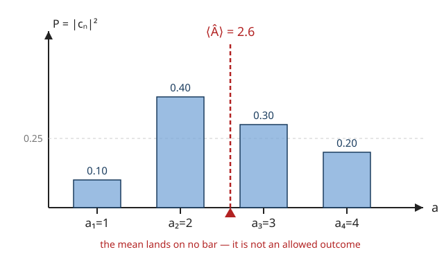

# Quantum Mechanics · Lesson 1.5: Measurement, collapse, and expectation values

> ⏱ ~15 min · Module 1: The quantum framework · Builds on: [1.4 Observables as Hermitian operators](#/lesson/quantum-mechanics/01-04-observables-hermitian-operators.md), [1.2 The wavefunction and the Born rule](#/lesson/quantum-mechanics/01-02-wavefunction-born-rule.md) · Unlocks: Boss Problem 1, then Module 2 (the Schrödinger equation)

## Why this matters

Lessons 1.3–1.4 built the machinery: states are vectors in a Hilbert space, observables are Hermitian operators, and the spectral theorem hands you a real spectrum with an orthonormal eigenbasis. But machinery predicts nothing until you say **what a measurement does**. This lesson is that bridge — the three postulates that turn $|\psi\rangle$ and $\hat A$ into numbers you can check against a lab: *which* values can appear, *how often*, and *what the system becomes* once you've looked. It is also the entire content of Boss Problem 1, and every expectation value, uncertainty, and selection rule in the rest of the course is a special case of what's here.

## The idea

A quantum state is not a hidden classical value you're merely ignorant of. Before measurement, an observable genuinely has no single value — the state is a **superposition** of the observable's eigenstates, each carrying a complex amplitude. Measurement is the moment that superposition is forced to commit.

Three things happen, and they're worth saying in plain English first:

1. **The answer is always an eigenvalue.** A meter measuring $\hat A$ can only ever read out one of $\hat A$'s eigenvalues $a_n$ — never a value in between. (This is *why* observables must be Hermitian: their eigenvalues are real, so the meter reads real numbers.)
2. **How likely each answer is comes from overlap.** The probability of reading $a_n$ is the squared length of the projection of your state onto that eigenstate — how much of $|a_n\rangle$ is "inside" $|\psi\rangle$.
3. **The act of measuring rewrites the state.** The instant you read $a_n$, the state jumps to $|a_n\rangle$. All other components are gone. Measure again immediately and you get $a_n$ again, with certainty — the answer has become a fact.

The expectation value is then *not* the most likely outcome, and usually not even a possible outcome — it's the long-run **average** over many identically prepared copies, weighted by those probabilities.

## The formal version

Let $\hat A$ be an observable with (for now, non-degenerate) eigenvalues $a_n$ and orthonormal eigenstates $|a_n\rangle$, so $\hat A|a_n\rangle = a_n|a_n\rangle$ and $\langle a_m|a_n\rangle = \delta_{mn}$. Any normalized state expands as
$$|\psi\rangle = \sum_n c_n\,|a_n\rangle, \qquad c_n = \langle a_n|\psi\rangle, \qquad \sum_n |c_n|^2 = 1.$$

**Postulate (measured values).** A measurement of $\hat A$ returns one of the eigenvalues $a_n$, and nothing else.
*In words:* the meter's dial is stamped with the spectrum of $\hat A$; no reading lies off it.

**Postulate (Born rule, operator form).** The probability of obtaining $a_n$ is
$$P(a_n) = |\langle a_n|\psi\rangle|^2 = |c_n|^2.$$
*In words:* project $|\psi\rangle$ onto the eigenstate and square the length — that's the odds of that outcome. (This is exactly the position-space Born rule $|\psi(x)|^2$ from [1.2](#/lesson/quantum-mechanics/01-02-wavefunction-born-rule.md), now written in an arbitrary eigenbasis.)

**Postulate (collapse).** Immediately after obtaining $a_n$, the state becomes $|a_n\rangle$.
*In words:* measurement discards every component except the one you found, and renormalizes. Formally it applies the projector $\hat P_n = |a_n\rangle\langle a_n|$ and divides by the surviving length: $|\psi\rangle \to \hat P_n|\psi\rangle / \lVert \hat P_n|\psi\rangle\rVert$.

**Expectation value.** The mean of the measured value over many identically prepared systems is
$$\langle \hat A\rangle = \langle\psi|\hat A|\psi\rangle = \sum_n a_n\,|c_n|^2.$$
*In words:* the two forms are the same number — the sandwich $\langle\psi|\hat A|\psi\rangle$ *is* the probability-weighted average of the eigenvalues. (To see it, insert $\hat A|\psi\rangle = \sum_n a_n c_n|a_n\rangle$ and use orthonormality.)

**Variance and standard deviation.** The spread of outcomes is
$$\sigma_A^2 = \langle \hat A^2\rangle - \langle \hat A\rangle^2 = \sum_n (a_n - \langle\hat A\rangle)^2\,|c_n|^2, \qquad \sigma_A = \sqrt{\sigma_A^2}.$$
*In words:* the same variance-equals-mean-of-square-minus-square-of-mean identity from probability, now over measurement outcomes. Here $\langle \hat A^2\rangle = \langle\psi|\hat A^2|\psi\rangle = \sum_n a_n^2|c_n|^2$. In quantum mechanics $\sigma_A$ is called the **uncertainty** $\Delta A$ of $\hat A$ in the state $|\psi\rangle$.

**Determinate states are eigenstates.** $\sigma_A = 0$ in the state $|\psi\rangle$ *if and only if* $|\psi\rangle$ is an eigenstate of $\hat A$.
*In words:* the only states that give a guaranteed, repeatable reading are the eigenstates — for anything else the outcome is genuinely random. (Proof sketch: $\sigma_A^2 = \langle\psi|(\hat A - \langle\hat A\rangle)^2|\psi\rangle = \lVert(\hat A-\langle\hat A\rangle)|\psi\rangle\rVert^2$, a squared norm, which vanishes only when $(\hat A - \langle\hat A\rangle)|\psi\rangle = 0$ — i.e. $|\psi\rangle$ is an eigenstate with eigenvalue $\langle\hat A\rangle$.)

**Degeneracy (the general collapse rule).** If $a_n$ is degenerate with eigenspace spanned by $\{|a_n^{(k)}\rangle\}$, then $P(a_n) = \sum_k |\langle a_n^{(k)}|\psi\rangle|^2$ and the state collapses to the **normalized projection** onto that whole subspace, $\hat P_n|\psi\rangle/\lVert\hat P_n|\psi\rangle\rVert$ with $\hat P_n = \sum_k |a_n^{(k)}\rangle\langle a_n^{(k)}|$ — not to a single ray.

## Picture

Each bar is the probability $|c_n|^2$ of measuring the eigenvalue $a_n$ beneath it; the bars sum to 1. The dashed red line is $\langle\hat A\rangle = \sum_n a_n|c_n|^2 = 2.6$ — and notice it lands **between** bars, on no allowed value. The expectation value is the balance point of the distribution, not a thing the meter can ever read.

## Worked examples

**Example 1 (mechanical — reading the three postulates off a state).** Suppose $\hat A$ has eigenvalues $a=5$ and $a=-3$ with orthonormal eigenstates $|+\rangle,|-\rangle$, and
$$|\psi\rangle = \tfrac{1}{\sqrt3}\,|+\rangle + \sqrt{\tfrac{2}{3}}\,|-\rangle.$$
Norm check: $\tfrac13 + \tfrac23 = 1$. ✓ The amplitudes are $c_+ = 1/\sqrt3$, $c_- = \sqrt{2/3}$, so
$$P(5) = |c_+|^2 = \tfrac13, \qquad P(-3) = |c_-|^2 = \tfrac23.$$
Average: $\langle\hat A\rangle = 5\cdot\tfrac13 + (-3)\cdot\tfrac23 = \tfrac53 - 2 = -\tfrac13$. If the meter happens to read $5$, the state collapses to $|+\rangle$, and every subsequent immediate measurement returns $5$ with certainty.

**Example 2 (why you'd care — energy of a superposition).** This is the shape of Boss Problem 1. Let $\hat H$ (the energy observable) have eigenstates $|E_1\rangle,|E_2\rangle$ with energies $E_1, E_2$, and let the system be prepared in $|\psi\rangle = \tfrac{1}{\sqrt2}(|E_1\rangle + |E_2\rangle)$. A measurement of energy returns $E_1$ or $E_2$, each with probability $\tfrac12$; the mean energy is $\langle\hat H\rangle = \tfrac12(E_1+E_2)$, and the spread is $\sigma_H = \tfrac12|E_2 - E_1|$ (the two-outcome formula $\sigma = |a_2-a_1|\sqrt{p_1 p_2}$ with $p_1=p_2=\tfrac12$). This energy uncertainty is exactly what drives the time evolution in [2.2](#/lesson/quantum-mechanics/02-02-stationary-states-time-evolution.md): a state with $\sigma_H \neq 0$ is *not* stationary, because it is a genuine mix of energies that beat against each other.

## Watch out

- You might think $\langle\hat A\rangle$ is "the value of $\hat A$" or the most likely outcome. It is neither — it's a weighted average, and as the Picture shows it is usually *not even an eigenvalue*, so no single measurement can return it. It only emerges from averaging many runs.
- You might think the statistics come from measuring **one** system over time. They come from an **ensemble**: many copies, each freshly prepared in the same $|\psi\rangle$, each measured **once**. Measuring one system repeatedly gives $a_n, a_n, a_n, \dots$ — collapse has frozen it after the first look, so a single system tells you nothing about the distribution.
- You might think a superposition means the observable secretly has some value you just haven't seen. Unless $|\psi\rangle$ is an eigenstate of $\hat A$, it has $\sigma_A > 0$: the value is genuinely indefinite, not merely unknown. "Determinate" and "eigenstate" are the same condition.
- You might think you can pin down two observables at once. Collapsing to an eigenstate of $\hat A$ can *destroy* a definite value of some other observable $\hat B$ — measuring one disturbs the other unless they share eigenstates. That compatibility question ($[\hat A,\hat B]=0$?) is the subject of [3.3](#/lesson/quantum-mechanics/03-03-commutators-uncertainty.md) and [3.4](#/lesson/quantum-mechanics/03-04-compatible-observables.md).

## One-liner

> Measurement returns an eigenvalue with probability $|\langle a_n|\psi\rangle|^2$ and collapses the state onto it; the expectation value $\langle\psi|\hat A|\psi\rangle$ is the ensemble average, and only eigenstates have zero spread.

## Problems

**P1 (🟢)** An observable $\hat A$ has orthonormal eigenstates $|a_1\rangle,|a_2\rangle$ with eigenvalues $a_1 = 2$ and $a_2 = 7$. A system is prepared in
$$|\psi\rangle = \tfrac{3}{5}\,|a_1\rangle + \tfrac{4}{5}\,|a_2\rangle.$$
(a) Confirm $|\psi\rangle$ is normalized. (b) Find the probability of each outcome. (c) Compute $\langle\hat A\rangle$.

**P2 (🟡)** For the same state as P1, compute $\langle\hat A^2\rangle$, the variance $\sigma_A^2$, and the standard deviation $\sigma_A$. Then: if the measurement returns $7$, write the post-measurement state, and state what a second, immediate measurement of $\hat A$ yields and with what probability.

**P3 (🔴, optional)** An observable $\hat A$ has three orthonormal eigenstates $|u_1\rangle,|u_2\rangle,|u_3\rangle$ with eigenvalues $-1,\,0,\,+2$. A system is prepared in
$$|\psi\rangle = \tfrac{1}{\sqrt6}\,|u_1\rangle + \tfrac{1}{\sqrt3}\,|u_2\rangle + \tfrac{1}{\sqrt2}\,|u_3\rangle.$$
(a) Give the full outcome distribution $P(-1),P(0),P(2)$. (b) Compute $\langle\hat A\rangle$, $\langle\hat A^2\rangle$, and $\sigma_A$. (c) The observable is measured and returns $+2$; then it is measured a **second** time immediately afterward. Give the probability distribution of that second measurement, and explain in one line why it differs from part (a). (This idempotency of collapse — measuring twice in a row is the same as measuring once — is why $\hat P_n^2 = \hat P_n$.)

Solutions

**P1.**
(a) $|3/5|^2 + |4/5|^2 = \tfrac{9}{25} + \tfrac{16}{25} = 1$. ✓
(b) $P(2) = |c_1|^2 = \tfrac{9}{25} = 0.36$ and $P(7) = |c_2|^2 = \tfrac{16}{25} = 0.64$.
(c) $\langle\hat A\rangle = 2(0.36) + 7(0.64) = 0.72 + 4.48 = 5.2$. (Note it lies between $2$ and $7$, not on either.)

**P2.** Using the same probabilities:
$$\langle\hat A^2\rangle = 2^2(0.36) + 7^2(0.64) = 4(0.36) + 49(0.64) = 1.44 + 31.36 = 32.8.$$
$$\sigma_A^2 = \langle\hat A^2\rangle - \langle\hat A\rangle^2 = 32.8 - (5.2)^2 = 32.8 - 27.04 = 5.76, \qquad \sigma_A = \sqrt{5.76} = 2.4.$$
(Check with the two-outcome shortcut: $\sigma_A = |7-2|\sqrt{(0.36)(0.64)} = 5\sqrt{0.2304} = 5(0.48) = 2.4$. ✓)
Post-measurement state: outcome $7$ collapses $|\psi\rangle$ onto $|a_2\rangle$, so the state is exactly $|a_2\rangle$. A second immediate measurement of $\hat A$ then yields $7$ with probability $|\langle a_2|a_2\rangle|^2 = 1$ — certainty. The state is now determinate ($\sigma_A = 0$), an eigenstate.

**P3.**
(a) $P(-1) = \left(\tfrac{1}{\sqrt6}\right)^2 = \tfrac16$, $\ P(0) = \tfrac13 = \tfrac26$, $\ P(2) = \tfrac12 = \tfrac36$. They sum to $\tfrac{1+2+3}{6} = 1$. ✓
(b)
$$\langle\hat A\rangle = (-1)\tfrac16 + 0\cdot\tfrac13 + 2\cdot\tfrac12 = -\tfrac16 + 1 = \tfrac56 \approx 0.833.$$
$$\langle\hat A^2\rangle = (-1)^2\tfrac16 + 0^2\cdot\tfrac13 + 2^2\cdot\tfrac12 = \tfrac16 + 2 = \tfrac{13}{6} \approx 2.167.$$
$$\sigma_A^2 = \tfrac{13}{6} - \left(\tfrac56\right)^2 = \tfrac{78}{36} - \tfrac{25}{36} = \tfrac{53}{36}, \qquad \sigma_A = \tfrac{\sqrt{53}}{6} \approx 1.213.$$
(c) The first measurement returned $+2$, collapsing the state to $|u_3\rangle$. The state is now an eigenstate of $\hat A$, so the second measurement gives $P(2) = 1$ and $P(-1) = P(0) = 0$ — a single certain outcome, not the spread of part (a). It differs because collapse has already committed the system: applying the projector twice is the same as applying it once ($\hat P_3^2 = \hat P_3$), so a repeated measurement reveals nothing new.

## Flashback

**From Lesson 1.4 (Observables as Hermitian operators):** Consider the operator $\hat A = \begin{pmatrix} 2 & i \\ -i & 2 \end{pmatrix}$ in an orthonormal basis. (a) Verify $\hat A$ is Hermitian. (b) Find its eigenvalues and confirm they are real. (c) Find the normalized eigenvectors and confirm they are orthogonal. (These eigenvalues are the only values a measurement of $\hat A$ could return, and the eigenvectors are the states it collapses to — this lesson's postulates in a $2\times 2$ world.)

Solution

(a) The conjugate transpose is $\hat A^\dagger = \overline{\hat A}^{\,T}$. Conjugating gives $\begin{pmatrix} 2 & -i \\ i & 2\end{pmatrix}$; transposing swaps the off-diagonals back to $\begin{pmatrix} 2 & i \\ -i & 2\end{pmatrix} = \hat A$. Hermitian. ✓

(b) $\det(\hat A - \lambda I) = (2-\lambda)^2 - (i)(-i) = (2-\lambda)^2 - 1 = 0 \Rightarrow 2-\lambda = \pm 1 \Rightarrow \lambda = 3 \text{ or } \lambda = 1.$ Both real, as a Hermitian operator guarantees. ✓

(c) For $\lambda = 3$: $(\hat A - 3I)v = \begin{pmatrix} -1 & i \\ -i & -1\end{pmatrix}v = 0$ gives $-v_1 + i v_2 = 0$, so $v_1 = i v_2$; take $v_{(3)} = \tfrac{1}{\sqrt2}\begin{pmatrix} i \\ 1\end{pmatrix}$.
For $\lambda = 1$: $\begin{pmatrix} 1 & i \\ -i & 1\end{pmatrix}v = 0$ gives $v_1 = -i v_2$; take $v_{(1)} = \tfrac{1}{\sqrt2}\begin{pmatrix} -i \\ 1\end{pmatrix}$.
Orthogonality (remember the bra conjugates): $\langle v_{(3)}|v_{(1)}\rangle = \tfrac12\big(\overline{i}\,(-i) + \overline{1}\,(1)\big) = \tfrac12\big((-i)(-i) + 1\big) = \tfrac12(i^2 + 1) = \tfrac12(-1+1) = 0.$ ✓ Distinct eigenvalues of a Hermitian operator give orthogonal eigenvectors — exactly the orthonormal measurement basis this lesson assumed.

## Connections

- **Backward:** the Born rule here is [1.2](#/lesson/quantum-mechanics/01-02-wavefunction-born-rule.md)'s $|\psi(x)|^2$ lifted into the abstract eigenbasis, and it leans entirely on [1.4](#/lesson/quantum-mechanics/01-04-observables-hermitian-operators.md): Hermiticity is what makes eigenvalues real (readable outcomes) and eigenstates orthonormal (a clean probability partition), as the Flashback re-derives.
- **Forward:** this closes Module 1 and is the whole of **Boss Problem 1**. The nonzero energy spread $\sigma_H$ of Example 2 is the engine of time evolution in [2.2](#/lesson/quantum-mechanics/02-02-stationary-states-time-evolution.md); the "measuring one disturbs another" caveat becomes the uncertainty principle in [3.3](#/lesson/quantum-mechanics/03-03-commutators-uncertainty.md) and the compatible-observables machinery in [3.4](#/lesson/quantum-mechanics/03-04-compatible-observables.md).
- **Sideways (probability):** $\langle\hat A\rangle$ and $\sigma_A^2 = \langle\hat A^2\rangle - \langle\hat A\rangle^2$ are the ordinary expectation and variance of `prob-stat-refresher`, with the eigenvalues $a_n$ as the sample space and $|c_n|^2$ as the pmf. Quantum measurement is a probability distribution manufactured by the state–operator pair — the physics is entirely in *where the $|c_n|^2$ come from*.
