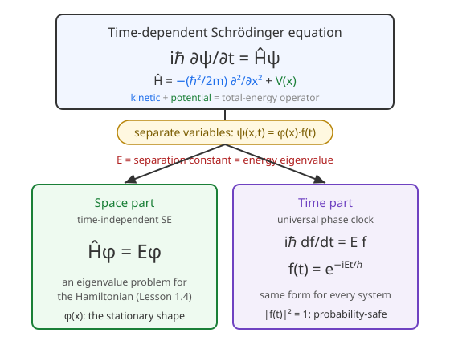

# Quantum Mechanics · Lesson 2.1: The Schrödinger equation

> ⏱ ~15 min · Module 2: The Schrödinger equation and 1D systems · Builds on: [1.4 Observables as Hermitian operators](#/lesson/quantum-mechanics/01-04-observables-hermitian-operators.md), [1.5 Measurement and expectation values](#/lesson/quantum-mechanics/01-05-measurement-expectation-values.md) · Unlocks: stationary states, the infinite/finite well, tunneling, and every 1D system in Module 2

## Why this matters

Module 1 told you what a quantum state *is* (a vector), how to read it (Born rule), and how to measure it (Hermitian operators). It never told you how a state **changes in time**. That is the whole job of the Schrödinger equation: it is the quantum equivalent of $F=ma$ — the single dynamical law from which every trajectory, spectrum, and transition in this course descends. And it hands you a gift: for any potential that doesn't itself depend on time, the equation *factors*, splitting the hard part (a spatial eigenvalue problem) cleanly away from the trivial part (a phase that ticks). Nearly everything you'll solve for the rest of the course is that spatial half.

## The idea

Classically, a particle's total energy is kinetic plus potential, $E = \frac{p^2}{2m} + V(x)$. Quantum mechanics keeps that bookkeeping but promotes each quantity to an **operator** — a machine that acts on the wavefunction. The energy machine is the **Hamiltonian** $\hat H$, and the central claim of quantum dynamics is disarmingly simple:

> **The energy operator generates time evolution.** Feed the current state to $\hat H$, and it tells you how fast the state is turning.

That "turning" is literal. In time $dt$, the state picks up a little twist proportional to $\hat H\psi$ — and the proportionality constant is $-i/\hbar$, so the change is a *rotation in the complex plane*, not a growth or decay. (This is exactly why probability is conserved: rotations preserve length.)

Now the second idea, which is where all the mileage is. If the potential $V(x)$ doesn't change with time, you can look for states with a rigid shape and a spinning phase — the spatial profile $\varphi(x)$ stays put while an overall phase $f(t)$ rotates. Plug that guess in and the equation splits in two: the time part is a universal spinning clock, the *same* for every system, and the space part is an eigenvalue equation $\hat H\varphi = E\varphi$ — the very "measurable-quantity-as-Hermitian-operator" structure from [1.4](#/lesson/quantum-mechanics/01-04-observables-hermitian-operators.md), now applied to energy. Solving quantum mechanics in 1D *is* solving that eigenvalue problem.

## The formal version

**The time-dependent Schrödinger equation (TDSE).** For a particle of mass $m$ on a line in potential $V(x)$, the wavefunction $\psi(x,t)$ obeys

$$i\hbar\,\frac{\partial \psi}{\partial t} = \hat H\psi, \qquad \hat H = -\frac{\hbar^2}{2m}\frac{\partial^2}{\partial x^2} + V(x).$$

Here $\hbar$ is the reduced Planck constant and $\hat H$ is the Hamiltonian operator. *In words:* the rate at which the state rotates (left side) is set by its energy content (right side).

**Where $\hat H$ comes from — canonical quantization.** The classical Hamiltonian is $H(x,p) = \frac{p^2}{2m} + V(x)$. Turn it into an operator by the substitution rule

$$x \to \hat x = x, \qquad p \to \hat p = -i\hbar\frac{\partial}{\partial x}.$$

Then $\hat p^2 = -\hbar^2\,\partial^2/\partial x^2$, so $\frac{\hat p^2}{2m} = -\frac{\hbar^2}{2m}\partial^2/\partial x^2$ — the kinetic term above. *In words:* take the energy expression you already know from analytical mechanics and replace momentum with a derivative. The first term of $\hat H$ is kinetic energy, the second is potential energy; their sum is the total-energy operator.

**Separation of variables.** Suppose $V=V(x)$ has no time dependence, and look for a solution of product form $\psi(x,t) = \varphi(x)\,f(t)$. Substituting,

$$i\hbar\,\varphi(x)\frac{df}{dt} = f(t)\,\hat H\varphi(x)
\;\Longrightarrow\;
\underbrace{i\hbar\,\frac{1}{f}\frac{df}{dt}}_{\text{time only}}
=
\underbrace{\frac{\hat H\varphi}{\varphi}}_{\text{space only}} = E.$$

A function of $t$ alone equals a function of $x$ alone, so both must equal the **same constant** $E$ — the *separation constant*. *In words:* the only way a purely-time thing can equal a purely-space thing for all $t$ and $x$ is if both are the same number.

This splits the PDE into two ODEs:

$$i\hbar\,\frac{df}{dt} = E f \;\Longrightarrow\; \boxed{\,f(t) = e^{-iEt/\hbar}\,}, \qquad\qquad \boxed{\,\hat H\varphi = E\varphi\,}\ \text{(TISE).}$$

The left equation is solved once and for all: a pure phase rotating at angular frequency $E/\hbar$. The right equation — the **time-independent Schrödinger equation** — is an eigenvalue problem for $\hat H$ (exactly [1.4](#/lesson/quantum-mechanics/01-04-observables-hermitian-operators.md)'s spectral picture). Its eigenvalues $E$ are the allowed energies; because $\hat H$ is Hermitian, they are real. *In words:* the separation constant is nothing but an energy eigenvalue, and each one comes with a spatial shape $\varphi(x)$.

## Picture

## Worked examples

**Example 1 (mechanical — reading the operator).** Take the free particle, $V(x)=0$, and the candidate $\varphi(x) = e^{ikx}$ for a constant $k$. Apply $\hat H$:

$$\hat H\varphi = -\frac{\hbar^2}{2m}\frac{d^2}{dx^2}e^{ikx} = -\frac{\hbar^2}{2m}(ik)^2 e^{ikx} = \frac{\hbar^2 k^2}{2m}\,e^{ikx}.$$

So $\hat H\varphi = E\varphi$ with $E = \frac{\hbar^2 k^2}{2m}$. Notice this is exactly $\frac{p^2}{2m}$ with $p=\hbar k$ — the plane wave is a momentum eigenstate ($\hat p\,e^{ikx} = \hbar k\,e^{ikx}$), and its energy is purely kinetic. The full time-dependent state is $\psi(x,t)=e^{ikx}e^{-iEt/\hbar}=e^{i(kx-\omega t)}$ with $\omega = E/\hbar$: a wave moving right. This is the seed of the free-particle and wave-packet story later in the module.

**Example 2 (why you'd care — the phase does the physics).** A **stationary state** is a single product solution $\psi(x,t)=\varphi_n(x)e^{-iE_n t/\hbar}$. Its probability density is

$$|\psi(x,t)|^2 = \varphi_n^*\varphi_n\,\underbrace{e^{+iE_n t/\hbar}e^{-iE_n t/\hbar}}_{=1} = |\varphi_n(x)|^2,$$

completely time-independent — the phase cancels against its conjugate. That is *why* these are called stationary: nothing observable moves. Time-dependence only reappears when you **superpose different energies**. With $\psi = c_1\varphi_1 e^{-iE_1 t/\hbar} + c_2\varphi_2 e^{-iE_2 t/\hbar}$ (real $\varphi_n$, real $c_n$),

$$|\psi|^2 = c_1^2\varphi_1^2 + c_2^2\varphi_2^2 + 2c_1 c_2\,\varphi_1\varphi_2\,\cos\!\Big(\tfrac{(E_2-E_1)t}{\hbar}\Big).$$

The cross-term breathes at angular frequency $\omega_{21} = (E_2-E_1)/\hbar$ — the **Bohr frequency**. This single beat is the origin of atomic spectral lines: a superposition of two levels radiates at exactly this frequency. (You'll prove this in P3, and Module 6 turns it into a transition rate.)

## Watch out

- You might think $\hat H$ "is" the energy, a number. It's an **operator** — a rule that acts on $\psi$. It only produces a number ($E$) when $\psi$ is one of its eigenstates; on a general state it returns a different function, and the best you can report is the *expectation* $\langle H\rangle = \int\psi^*\hat H\psi\,dx$.
- You might think you can separate variables for any potential. Separation needs $V$ to be **time-independent**. If $V=V(x,t)$ (e.g. an applied field switched on), no single $E$ exists, $f(t)=e^{-iEt/\hbar}$ is wrong, and you need time-dependent methods (Module 6).
- You might think the phase $e^{-iEt/\hbar}$ is negligible "just a phase." It's invisible in a *single* stationary state, but the moment two energies coexist, the **relative** phase $e^{-i(E_2-E_1)t/\hbar}$ becomes physical and drives all the dynamics. Global phase: unobservable. Relative phase: everything.
- Sign trap: the temporal factor is $e^{-iEt/\hbar}$ with a **minus** sign (from $i\hbar\,\dot f = Ef \Rightarrow \dot f = -\tfrac{iE}{\hbar}f$). Getting it as $e^{+iEt/\hbar}$ flips the direction of every wave and the sign of every Bohr frequency.

## One-liner

> The Hamiltonian is the energy operator, and it drives time evolution by rotating the state's phase at rate $E/\hbar$; when $V$ doesn't depend on time, that rotation peels off as $e^{-iEt/\hbar}$ and leaves the eigenvalue problem $\hat H\varphi=E\varphi$ to solve.

## Problems

**P1 (🟢)** A particle moves in the harmonic potential $V(x) = \tfrac12 m\omega^2 x^2$. Verify that $\varphi(x) = A\,e^{-m\omega x^2/2\hbar}$ solves the time-independent Schrödinger equation $\hat H\varphi = E\varphi$, and read off the energy $E$.

**P2 (🟡)** Starting from the full TDSE $i\hbar\,\partial_t\psi = -\frac{\hbar^2}{2m}\partial_x^2\psi + V(x)\psi$ with $V$ independent of $t$, insert the ansatz $\psi(x,t)=\varphi(x)f(t)$, carry out the separation explicitly, and solve the time equation for $f(t)$. State clearly *why* each side must equal a constant.

**P3 (🔴, optional)** (a) For a stationary state $\psi(x,t)=\varphi(x)e^{-iEt/\hbar}$ with $\hat H\varphi=E\varphi$ and $\int|\varphi|^2dx=1$, show that $\langle H\rangle$ is independent of time (and in fact equals $E$). (b) For the superposition $\psi = c_1\varphi_1 e^{-iE_1 t/\hbar} + c_2\varphi_2 e^{-iE_2 t/\hbar}$ of two orthonormal energy eigenstates, show $|\psi|^2$ oscillates in time at angular frequency $(E_2-E_1)/\hbar$.

Solutions

**P1** Write $\alpha = m\omega/\hbar$, so $\varphi = A e^{-\alpha x^2/2}$. Differentiate:
$$\varphi' = -\alpha x\,\varphi, \qquad \varphi'' = -\alpha\varphi -\alpha x\,\varphi' = -\alpha\varphi + \alpha^2 x^2\varphi = (\alpha^2 x^2 - \alpha)\varphi.$$
Kinetic term:
$$-\frac{\hbar^2}{2m}\varphi'' = -\frac{\hbar^2}{2m}(\alpha^2 x^2 - \alpha)\varphi.$$
Now $\alpha^2 = m^2\omega^2/\hbar^2$, so $-\frac{\hbar^2}{2m}\alpha^2 x^2 = -\frac{\hbar^2}{2m}\cdot\frac{m^2\omega^2}{\hbar^2}x^2 = -\frac{m\omega^2}{2}x^2$, and $-\frac{\hbar^2}{2m}(-\alpha) = \frac{\hbar^2}{2m}\cdot\frac{m\omega}{\hbar} = \frac{\hbar\omega}{2}$. Hence
$$-\frac{\hbar^2}{2m}\varphi'' = \Big(-\tfrac12 m\omega^2 x^2 + \tfrac12\hbar\omega\Big)\varphi.$$
Add the potential term $V\varphi = \tfrac12 m\omega^2 x^2\,\varphi$; the $x^2$ pieces cancel exactly:
$$\hat H\varphi = \Big(-\tfrac12 m\omega^2 x^2 + \tfrac12\hbar\omega + \tfrac12 m\omega^2 x^2\Big)\varphi = \tfrac12\hbar\omega\,\varphi.$$
So it is an eigenstate with $\boxed{E = \tfrac12\hbar\omega}$ — the oscillator ground state and its zero-point energy, which Module 3 rebuilds from scratch.

**P2** Substitute $\psi = \varphi(x)f(t)$. The time derivative hits only $f$, the space derivative only $\varphi$:
$$i\hbar\,\varphi\,\frac{df}{dt} = -\frac{\hbar^2}{2m}f\,\frac{d^2\varphi}{dx^2} + V(x)\varphi f = f\,\hat H\varphi.$$
Divide through by $\varphi f$ (valid where it is nonzero):
$$i\hbar\,\frac{1}{f}\frac{df}{dt} = \frac{1}{\varphi}\hat H\varphi.$$
The left side depends on $t$ alone; the right side depends on $x$ alone. If two expressions in independent variables are equal for *all* $x$ and $t$, neither can actually vary — each is a fixed constant, call it $E$. (Concretely: hold $x$ fixed and vary $t$; the right side can't move, so the left side can't either.) The time equation is
$$i\hbar\,\frac{df}{dt} = E f \;\Longrightarrow\; \frac{df}{f} = -\frac{iE}{\hbar}\,dt \;\Longrightarrow\; \ln f = -\frac{iE}{\hbar}t + c \;\Longrightarrow\; f(t) = f(0)\,e^{-iEt/\hbar}.$$
Absorbing $f(0)$ into $\varphi$'s normalization gives $f(t)=e^{-iEt/\hbar}$, and the space side leaves $\hat H\varphi = E\varphi$, the TISE.

**P3** (a) Because $\varphi$ is an eigenstate, $\hat H\psi = e^{-iEt/\hbar}\hat H\varphi = E\varphi e^{-iEt/\hbar} = E\psi$. Then
$$\langle H\rangle = \int \psi^*\hat H\psi\,dx = \int \psi^*(E\psi)\,dx = E\int|\psi|^2 dx = E\int|\varphi|^2 dx = E,$$
using $|\psi|^2 = |\varphi|^2$ (the phase cancels). This is a constant, independent of $t$. (One can equally check $\langle H^2\rangle = E^2$, so $\Delta H = 0$: a stationary state has perfectly definite energy.)

(b) With $\varphi_1,\varphi_2$ orthonormal, expand the modulus squared:
$$|\psi|^2 = |c_1|^2|\varphi_1|^2 + |c_2|^2|\varphi_2|^2 + 2\,\mathrm{Re}\!\Big[c_1 c_2^*\,\varphi_1\varphi_2^*\,e^{-i(E_1-E_2)t/\hbar}\Big].$$
The first two terms are static. The cross-term carries the only time dependence, through the factor $e^{-i(E_1-E_2)t/\hbar} = e^{+i(E_2-E_1)t/\hbar}$, whose real part oscillates as $\cos\!\big((E_2-E_1)t/\hbar\big)$. Hence $|\psi|^2$ — and therefore $\langle x\rangle$ and any other observable — oscillates at angular frequency $\omega_{21} = (E_2-E_1)/\hbar$, the Bohr frequency. (For real $\varphi_n$ and real $c_n$ this is precisely the $2c_1 c_2\varphi_1\varphi_2\cos(\omega_{21}t)$ term of Example 2.) Physically: only *energy differences* are observable in the dynamics, which is why spectroscopy measures gaps, not absolute energies.

## Flashback

**From Lesson 1.4 (Observables as Hermitian operators):** The TISE $\hat H\varphi = E\varphi$ is just an eigenvalue problem for a Hermitian operator — so drill the finite-dimensional version. Consider

$$H = \begin{pmatrix} 1 & i \\ -i & 1 \end{pmatrix}.$$

Show it is Hermitian, find its eigenvalues (confirm they are real), and check that its two eigenvectors are orthogonal.

Solution

**Hermitian:** the conjugate-transpose $H^\dagger$ swaps off-diagonal entries and conjugates them: $H^\dagger_{12} = \overline{H_{21}} = \overline{-i} = i = H_{12}$ and $H^\dagger_{21} = \overline{H_{12}} = \overline{i} = -i = H_{21}$; diagonals are real. So $H^\dagger = H$. ✓

**Eigenvalues:** $\det(H-\lambda I) = (1-\lambda)^2 - (i)(-i) = (1-\lambda)^2 - 1 = 0$, giving $(1-\lambda)^2 = 1$, so $\lambda = 0$ or $\lambda = 2$ — both real, as the spectral theorem for Hermitian operators guarantees (the same guarantee that makes energy eigenvalues real).

**Eigenvectors:** for $\lambda = 2$: $(1-2)v_1 + i v_2 = 0 \Rightarrow v_1 = i v_2$, so $|u\rangle = \tfrac{1}{\sqrt2}\binom{i}{1}$. For $\lambda = 0$: $v_1 + i v_2 = 0 \Rightarrow v_1 = -i v_2$, so $|w\rangle = \tfrac{1}{\sqrt2}\binom{-i}{1}$. Their inner product (conjugate the first): $\langle u|w\rangle = \tfrac12\big(\overline{i}(-i) + \overline{1}\cdot 1\big) = \tfrac12\big((-i)(-i) + 1\big) = \tfrac12(i^2 + 1) = \tfrac12(-1+1) = 0$. Orthogonal. ✓ Distinct eigenvalues of a Hermitian operator always give orthogonal eigenvectors — the finite-dimensional shadow of "energy eigenstates are orthogonal."

## Connections

- **Backward:** $\hat H\varphi = E\varphi$ is the spectral problem of [1.4](#/lesson/quantum-mechanics/01-04-observables-hermitian-operators.md) applied to energy — Hermiticity is what makes the $E$'s real and the eigenstates orthogonal (the Flashback in miniature). Expectation values use the machinery of [1.5](#/lesson/quantum-mechanics/01-05-measurement-expectation-values.md).
- **Forward:** [2.2](#/lesson/quantum-mechanics/02-02-stationary-states-time-evolution.md) evolves *any* state by expanding it in energy eigenstates and attaching each its own $e^{-iE_n t/\hbar}$; [2.3](#/lesson/quantum-mechanics/02-03-infinite-square-well.md) onward just solve $\hat H\varphi=E\varphi$ for particular $V(x)$. The Bohr frequency of P3 returns in Module 6 as the emission/absorption line.
- **Sideways (analytical mechanics):** canonical quantization $p\to -i\hbar\,\partial_x$ turns the classical Hamiltonian $H(q,p)$ into $\hat H$ — the same Hamiltonian that generated flow through the Poisson bracket now generates time evolution through the Schrödinger equation. The bracket $\{\cdot,H\}$ becomes the commutator $\tfrac{i}{\hbar}[\cdot,\hat H]$, made precise in [3.5 (Heisenberg picture and Ehrenfest)](#/lesson/quantum-mechanics/03-05-heisenberg-picture-ehrenfest.md).
